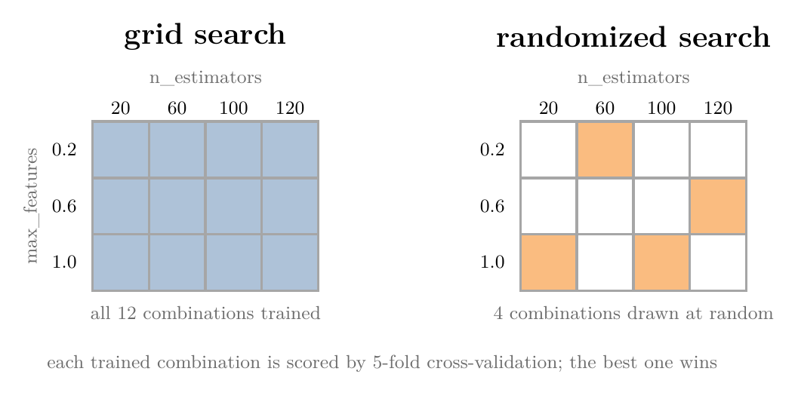
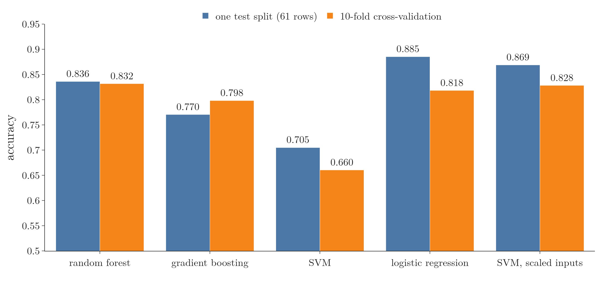
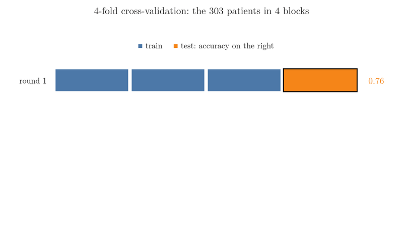
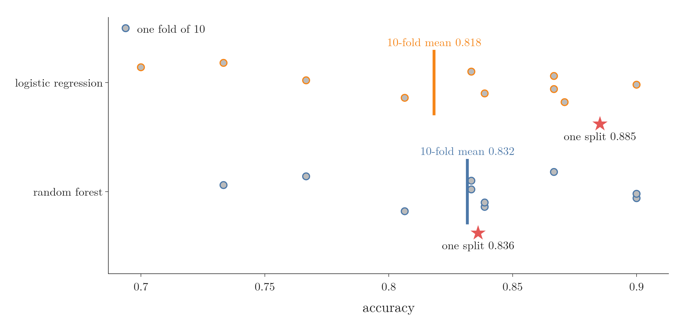
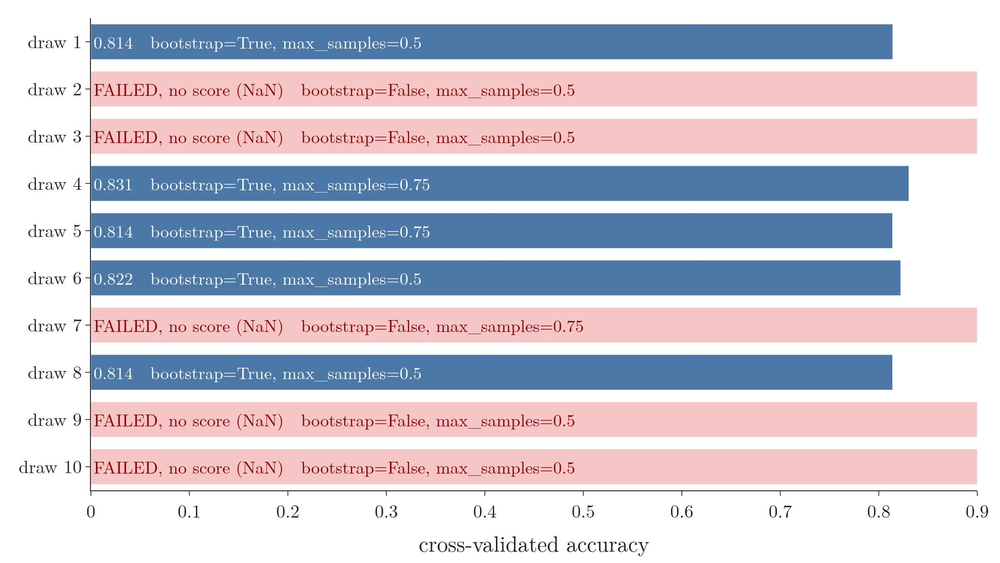

<!-- where-this-fits: generated by course_map/build_map.py; edit concepts.yaml, not this block -->
> **Where this fits:** Pipeline map steps 8 (Model), 9 (Evaluate), 10 (Tune). See the [Course map](../../../00-course-map/00-course-map.md).
>
> 
>
> - **Builds on:** [Overfitting](../../../ML/01-foundations/ML-007-challenges-in-ml/ML-007-challenges-in-ml.md#7-overfitting-and-underfitting); [Hyperparameter tuning](../../../ML/01-foundations/ML-009-mldlc/ML-009-mldlc.md#83-model-selection-and-hyperparameter-tuning); [ML pipelines](../../../ML/01-foundations/ML-012-toy-project/ML-012-toy-project.md#1-overview); [Simple imputation (mean, median, mode, constant)](../../../ML/03-feature-engineering/ML-022-what-is-feature-engineering/ML-022-what-is-feature-engineering.md#1-overview); [Decision trees](../../../ML/08-trees-and-ensembles/ML-091-decision-trees-intuition/ML-091-decision-trees-intuition.md#2-a-decision-tree-is-nested-if-else); [Feature importance](../../../ML/08-trees-and-ensembles/ML-093-regression-trees/ML-093-regression-trees.md#75-feature-importance).
> - **Leads to:** [Stacking and blending](../../../ML/08-trees-and-ensembles/ML-121-stacking-blending/ML-121-stacking-blending.md#2-from-voting-to-stacking); [Random under- and oversampling](../../../ML/09-clustering-and-more/ML-127-imbalanced-data/ML-127-imbalanced-data.md#6-random-oversampling); [Balanced random forest](../../../ML/09-clustering-and-more/ML-127-imbalanced-data/ML-127-imbalanced-data.md#8-ensemble-methods-the-balanced-random-forest); [Optuna](../../../ML/09-clustering-and-more/ML-128-optuna/ML-128-optuna.md#4-optunas-vocabulary).
> - **Compare with:** [Train-test split](../../../ML/01-foundations/ML-012-toy-project/ML-012-toy-project.md#6-training-and-test-sets); [Bagging](../../../ML/08-trees-and-ensembles/ML-101-bagging-regressor/ML-101-bagging-regressor.md#4-baggingregressor-on-the-boston-housing-data); [OOB score](../../../ML/08-trees-and-ensembles/ML-101-bagging-regressor/ML-101-bagging-regressor.md#1-overview); [Optuna](../../../ML/09-clustering-and-more/ML-128-optuna/ML-128-optuna.md#4-optunas-vocabulary); [Bayesian optimisation](../../../ML/09-clustering-and-more/ML-128-optuna/ML-128-optuna.md#1-overview); [Dropout](../../../DL/02-training/DL-024-dropout/DL-024-dropout.md#4-how-dropout-works).
<!-- /where-this-fits -->

## 1. Overview

> **Key point:** A random forest is strong out of the box. A grid search or a randomized search, scored by cross-validation, tunes its hyperparameters systematically; on a small dataset like ours, the tuned forest does no better than the default one.

{height=30%}

This Note:

- applies a **random forest** (G-1611) to a real dataset, heart disease, and compares it with other algorithms (sections 2 to 4);
- tunes one **hyperparameter** (G-910), a setting chosen before training, by hand (section 5);
- tunes several at once (the settings are described in [the forest-level hyperparameters](../ML-105-random-forest-hyperparameters/ML-105-random-forest-hyperparameters.md#3-the-forest-level-hyperparameters)) with the two search methods of Figure 1: **grid search** (G-872, section 6) and randomized search (`RandomizedSearchCV`, G-1625, section 7).

Both searches were introduced earlier: `GridSearchCV` in [hyperparameter tuning with a pipeline](../../03-feature-engineering/ML-028-pipelines/ML-028-pipelines.md#9-hyperparameter-tuning-with-a-pipeline), and `RandomizedSearchCV` in [tuning with GridSearchCV and RandomizedSearchCV](../ML-093-regression-trees/ML-093-regression-trees.md#72-tuning-with-gridsearchcv-and-randomizedsearchcv). Here we see what a random forest grid looks like, how long it takes, and one trap specific to forests.

The Notebook (`ML-106-random-forest-tuning.ipynb`) runs every step.

## 2. The heart disease data

> **Key point:** 303 patients, 13 medical features, and a target: 1 for heart disease, 0 for none.

The data is a well-known heart disease dataset from Kaggle. Each of the 303 **observations** (records, one row of the data table each) is a patient. Its **features** (input variables, one column each) are age, sex, chest pain type (`cp`), resting blood pressure (`trestbps`), cholesterol (`chol`), maximum heart rate (`thalach`) and other medical measurements. The last column, `target`, is the **target** (the output we predict): whether the patient has heart disease.

Predicting a class in this way is a classification problem: from the 13 features, predict the target. We hold out 20% for testing: 242 training observations and 61 test observations.

## 3. A random forest out of the box

> **Key point:** With no tuning at all, the random forest scores 0.836 on the test split and 0.832 with cross-validation, the best cross-validated score of the four algorithms.

{height=38%}

We train four classifiers with their default settings and score each by its **accuracy** (G-162), the share of patients classified correctly, on the 61 observations of the **test set** (G-1962) (Figure 2, blue):

| Model | Test split | 10-fold cross-validation |
|---|---|---|
| Random forest | 0.836 | **0.832** |
| Gradient boosting | 0.770 | 0.798 |
| SVM (`SVC`) | 0.705 | 0.660 |
| Logistic regression | **0.885** | 0.818 |

Gradient boosting is another tree ensemble, covered in later Notes; it is used here in the same way as any scikit-learn model. On the single test split, logistic regression wins; section 4 shows why that split is not the whole story.

The random forest does not always win. But a large study of 179 classifiers on 121 datasets found random forests the family most likely to come out on top (Fernández-Delgado et al. 2014), so an untuned forest is a strong first model.

> **Extra:** The SVM's poor score is not a fair verdict on SVMs. An SVM measures distances, so it needs scaled inputs ([split and scale](../../07-classification/ML-085-knn/ML-085-knn.md#32-split-and-scale) shows the same for KNN), and cholesterol, in the hundreds, swamps the 0/1 features. With a `StandardScaler` in a pipeline, the SVM scores 0.869 on the split and 0.828 with cross-validation (Figure 2, right). A random forest needs no scaling: a tree compares one feature at a time with a threshold, so rescaling a feature moves the threshold but not which observations fall on each side (ESL §10.7, Table 10.1). In the Notebook, putting a `StandardScaler` in front of the forest leaves its scores almost unchanged (0.836 and 0.835).
>
> Logistic regression on unscaled data needs `max_iter=5000` to converge; with the default 100 iterations, scikit-learn warns that it stopped early.

## 4. One split is not enough

> **Key point:** 61 test observations give a noisy score; 10-fold cross-validation trains and tests 10 times and averages, a more reliable number.

A single split of 61 observations can be lucky or unlucky: which 61 patients should be the test set? Instead of choosing, we use every part of the data as the test set once. Cut the data into blocks, train on all the blocks but one, test on the block left out, then rotate so that every block is tested once, and average the scores. This procedure is **cross-validation** (G-510; see [cross-validation with a pipeline](../../03-feature-engineering/ML-028-pipelines/ML-028-pipelines.md#8-cross-validation-with-a-pipeline)), and the blocks are called **folds** (G-2227).

Figure 3 runs it on the heart data with the default random forest. Watch the orange test block move one place per round. With 4 folds the four accuracies are 0.76, 0.80, 0.91 and 0.83, mean 0.825. With 10 folds, the common choice, each fold is scored by a model trained on the other 9, and the mean is 0.832.



With cross-validation (Figure 2, orange), logistic regression drops from 0.885 to **0.818**, while the random forest stays at **0.832**. The two are in fact close, and the forest is slightly ahead.

{height=32%}

Figure 4 shows why. Watch the spread of the dots: one fold of about 30 patients scores anywhere from 0.70 to 0.90, and the single split of section 3 (the star) is just one such draw. For logistic regression it happened to land near the top.

> **Python:** 10-fold cross-validation.
>
> ```python
> from sklearn.model_selection import cross_val_score
>
> scores = cross_val_score(RandomForestClassifier(random_state=42),
>                          X, y, cv=10)
> scores.mean()     # 0.832
> ```
>
> `cross_val_score` returns the 10 accuracies; their mean is the cross-validated score.

## 5. Tuning one setting by hand

> **Key point:** Giving each tree fewer observations makes the trees less alike, and the forest a little more accurate: 0.826 with full-size samples, 0.834 with 20% of the observations per tree.

`max_samples` sets how many training observations each tree gets (see [the four settings](../ML-105-random-forest-hyperparameters/ML-105-random-forest-hyperparameters.md#31-the-four-settings)). The default, `None`, gives each tree a bootstrap sample as large as the training set.

**The idea.** When every tree sees a large sample, the samples overlap a lot, so the trees learn much the same thing and make the same mistakes. Averaging copies of the same mistake does not cancel it. Smaller samples overlap less, so the trees differ more: their **correlation between base models** (G-488) is lower, and their mistakes cancel more often in the vote. [Tree-level against node-level feature sampling](../ML-104-bagging-vs-random-forest/ML-104-bagging-vs-random-forest.md#3-difference-2-tree-level-against-node-level-feature-sampling) gives the formula: the less alike the trees, the lower the forest's variance (ESL §15.2).

**The result.** We change only `max_samples` and score each forest with 10-fold cross-validation, averaged over 20 runs:

| Observations per tree (`max_samples`) | all (`None`) | 75% | 50% | 30% | 20% |
|---|---|---|---|---|---|
| Mean cross-validated accuracy | 0.826 | 0.825 | 0.829 | 0.833 | **0.834** |

Smaller samples score higher, and on the same folds 20% of the observations beats all of them in 16 of the 20 runs. The trees really do become less alike: the average correlation between two trees' predictions drops from 0.44 to 0.34.

{height=36%}

Figure 5 shows both halves of the argument. Watch the blue line creep up by less than 0.01 while the grey runs scatter over about 0.03: the gain is real on average but small next to the noise of one run, and panel (b) shows the trees growing less alike.

> **Extra:** The gain is small, about 2 or 3 of 303 patients, while a single cross-validation run moves by about 0.01 when only the seed changes. Because of this noise, the Notebook averages 20 runs, each with new folds and a new forest, and uses 500 trees so the forest's own randomness stays small. Too few observations hurt again, because each tree becomes too weak: the [demo dataset](../ML-105-random-forest-hyperparameters/ML-105-random-forest-hyperparameters.md#33-trying-the-settings-on-a-demo-dataset) shows a forest with 25 observations per tree losing accuracy. The best share depends on the data: on that demo data the score is flat from about a quarter of the observations, on the heart data about 20% is best.

Cross-validation scores a setting without a separate test split: each observation is tested by a model that did not train on it. The runs above cross-validate all 303 patients, the 61 test patients included, so they only compare settings. The searches below cross-validate the 242 training observations only, so the test set stays untouched until the end.

So a setting can matter, and the problem is scale: a random forest has about 20 hyperparameters, and guessing a good value for each by hand is hopeless. We need a systematic search.

## 6. Grid search over a random forest

> **Key point:** Four hyperparameters with 4, 3, 3 and 3 values make 108 forests; 5-fold cross-validation trains each 5 times, 540 fits in all, 13 to 22 seconds here.

### 6.1 The grid

> **Key point:** List the values to try for each hyperparameter; the search trains a forest for every combination.

We choose values for the four settings that matter most:

> **Python:** The grid for a random forest.
>
> ```python
> param_grid = {
>     "n_estimators": [20, 60, 100, 120],  # trees
>     "max_features": [0.2, 0.6, 1.0],     # columns per split
>     "max_depth": [2, 8, None],           # depth of each tree
>     "max_samples": [0.5, 0.75, 1.0],     # rows per tree
> }
> ```
>
> The grid, called a **parameter grid** (G-1446), is a **dictionary**: each key is a hyperparameter's name, exactly as the model spells it, and each value is the list of values to try.

The search tries every combination, so the number of forests is the product of the list lengths:

$$4 \times 3 \times 3 \times 3 = 108 \text{ forests}$$

With 4 hyperparameters, the combinations form a 4-dimensional table (Figure 1 shows 2 of the dimensions); every cell becomes one forest.

### 6.2 Running the search

> **Key point:** GridSearchCV takes the model, the grid, the number of folds, and optionally verbose and n_jobs.

> **Python:** Grid search with 5-fold cross-validation.
>
> ```python
> from sklearn.model_selection import GridSearchCV
>
> rf_grid = GridSearchCV(RandomForestClassifier(random_state=42),
>                        param_grid, cv=5,
>                        verbose=1, n_jobs=-1)
> rf_grid.fit(X_train, y_train)
> # Fitting 5 folds for each of 108 candidates,
> # totalling 540 fits
> ```
>
> `cv=5`: every forest is trained and scored 5 times. `verbose=1` prints the progress line; `n_jobs=-1` uses every CPU core, which matters when hundreds of forests are trained.

The search trains 540 forests:

$$108 \times 5 = 540$$

On this small dataset that takes 13 to 22 seconds on 12 cores, depending on how busy the machine is; on a large dataset it can take hours.

### 6.3 The result

> **Key point:** The best forest has 20 trees of depth 8, 20% of the features per split and 75% of the observations per tree: cross-validated accuracy 0.843.

`rf_grid.best_params_` gives the winning combination, and `rf_grid.best_score_` its mean cross-validated accuracy:

| `n_estimators` | `max_features` | `max_depth` | `max_samples` | Cross-validated accuracy |
|---|---|---|---|---|
| **20** | **0.2** | **8** | **0.75** | **0.843** |
| 20 | 0.2 | None | 0.75 | 0.839 |
| 20 | 0.6 | 8 | 1.0 | 0.831 |
| 20 | 0.2 | 8 | 1.0 | 0.831 |
| 60 | 0.6 | 8 | 1.0 | 0.827 |

The table lists the top five, from `rf_grid.cv_results_` (the table of every combination's scores, see [choosing the imputer with grid search](../../04-missing-data-and-outliers/ML-037-missing-indicator-random-sample/ML-037-missing-indicator-random-sample.md#7-choosing-the-imputer-automatically-with-grid-search)). The winner scores **0.869** on the 61 test observations. By default, `GridSearchCV` retrains the best combination on the whole training set, so `rf_grid` itself predicts with the best forest.

### 6.4 Did tuning really help?

> **Key point:** Judged fairly, no: the tuned forest scores 0.814 and the default forest 0.819. The grid's own 0.843 is the luckiest of 108 scores.

The grid's 0.843 is the best of 108 scores measured on the same 5 folds, and picking the best makes it optimistic:

1. Each of the 108 scores is the forest's true accuracy plus some noise from the particular folds.
2. The search picks the largest score, so it also picks the forest whose noise happened to be most positive.
3. So the winner's score overstates its true accuracy, like the tallest of 108 people picked at random overstates the average height.

This optimism is **selection bias** (G-2157; see [the best score of a grid is a little lucky](../ML-093-regression-trees/ML-093-regression-trees.md#74-the-best-score-of-a-grid-is-a-little-lucky); Cawley and Talbot 2010). The 0.869 on the test set comes from only 61 patients, one of which moves the score by 0.016.

A fair test is **nested cross-validation** (G-2158), shown fold by fold in Figure 6. An outer cross-validation splits the data; inside each outer training part, the whole grid search runs and picks a winner; the winner is then scored on the outer test part, which the search never saw. With 5 outer folds repeated 4 times (20 outer folds):

| | Mean accuracy |
|---|---|
| Default random forest | **0.819** |
| Grid-tuned random forest | 0.814 |
| The grid's own best score, averaged | 0.845 |

{height=45%}

Figure 6 shows every outer fold. Watch the red crosses: they sit to the right of both forests in 14 of the 20 folds, so the grid's own score is the optimistic one, while the orange and blue points swap places from fold to fold.

The tuned forest beats the default on only 5 of the 20 folds and ties on 5. The grid's own score, 0.845, overstates the tuned forest by about 0.03.

The result matches a large study: across 38 datasets, the random forest was the least tunable of six common algorithms, its defaults already close to the best settings (Probst et al. 2019). Tuning pays off more for models such as SVMs, the most tunable in that study; the search tools are the same.

## 7. Randomized search

> **Key point:** RandomizedSearchCV trains only a fixed number of random combinations (10 by default), so a much bigger grid stays affordable.

### 7.1 A bigger grid

> **Key point:** Three more hyperparameters turn 108 combinations into 864; randomized search tries 10 of them, 50 fits.

We add `bootstrap`, `min_samples_split` and `min_samples_leaf`, with two values each. The bigger grid has 864 combinations, or 4,320 fits in a grid search:

$$108 \times 2 \times 2 \times 2 = 864$$

`RandomizedSearchCV` tries only `n_iter` of them (see [tuning with GridSearchCV and RandomizedSearchCV](../ML-093-regression-trees/ML-093-regression-trees.md#72-tuning-with-gridsearchcv-and-randomizedsearchcv)), 10 by default (Figure 1, right):

$$10 \times 5 = 50 \text{ fits}$$

### 7.2 A trap: bootstrap and max_samples

> **Key point:** `bootstrap=False` with a `max_samples` value is not allowed, so half the random combinations fail; the fix is a list of two grids.

Putting both lists into one grid lets the search draw combinations such as `bootstrap=False, max_samples=0.5`. scikit-learn refuses these, because `max_samples` only applies when observations are drawn (see [trying the settings on a demo dataset](../ML-105-random-forest-hyperparameters/ML-105-random-forest-hyperparameters.md#33-trying-the-settings-on-a-demo-dataset)). The search does not stop: it records the failed combinations with the score NaN ("not a number") and prints a warning. In our run, **5 of the 10** combinations failed, so the search really tried only 5.

{height=36%}

Figure 7 lists the 10 draws. Watch the pink rows: every one pairs `bootstrap=False` with a `max_samples` value, and every blue row has `bootstrap=True`.

The fix is to pass a **list of grids** (G-1105): the search picks one of the grids at random each time, then a combination from it.

> **Python:** Two grids, so max_samples only meets bootstrap=True.
>
> ```python
> from sklearn.model_selection import RandomizedSearchCV
>
> grids = [
>     dict(param_grid, bootstrap=[True],
>          min_samples_split=[2, 5], min_samples_leaf=[1, 2]),
>     {"n_estimators": [20, 60, 100, 120],
>      "max_features": [0.2, 0.6, 1.0],
>      "max_depth": [2, 8, None], "bootstrap": [False],
>      "min_samples_split": [2, 5], "min_samples_leaf": [1, 2]},
> ]
> rf_random = RandomizedSearchCV(
>     RandomForestClassifier(random_state=42), grids,
>     n_iter=10, cv=5, n_jobs=-1, random_state=42)
> rf_random.fit(X_train, y_train)
> ```
>
> `dict(param_grid, bootstrap=[True], ...)` copies `param_grid` and adds keys. The second grid has no `max_samples`, so it keeps the default, `None`. `random_state=42` fixes which combinations are drawn.

### 7.3 The result

> **Key point:** In one or two seconds, the randomized search finds a forest with cross-validated accuracy 0.826, a little below the full grid's 0.843.

The best of the 10 combinations: 20 trees, 60% of the features, fully grown, `min_samples_split=5`, `min_samples_leaf=2`, all the observations with replacement. Its cross-validated accuracy is **0.826**, and its test accuracy 0.836.

The randomized search trained 50 forests instead of 540 (and instead of 4,320 for a grid over its larger space). The randomized search found a good forest, with a lower best score than the grid: the speed-for-accuracy trade of [tuning with GridSearchCV and RandomizedSearchCV](../ML-093-regression-trees/ML-093-regression-trees.md#72-tuning-with-gridsearchcv-and-randomizedsearchcv).

The two searches also work well one after the other, a plan called "coarse to fine". First a randomized search over a wide grid shows where the good combinations lie. Then a grid search over a small grid around them tries every nearby combination (Yu and Zhu 2020, §3.1.2; DataCamp, *Hyperparameter Tuning in Python*, "Informed Search: Coarse to Fine").

## 8. Summary

| | Grid search | Randomized search |
|---|---|---|
| Class | `GridSearchCV` | `RandomizedSearchCV` |
| Combinations tried | all (here 108) | `n_iter` (default 10) |
| Fits with `cv=5` | 540 | 50 |
| Our time | 13 to 22 seconds | 1 to 2 seconds |
| Best cross-validated accuracy (optimistic) | 0.843 | 0.826 |
| Use when | small data, few hyperparameters | large data, many hyperparameters |

- Out of the box, the random forest had the best cross-validated score of four algorithms (0.832), so an untuned forest is a strong first model.
- Judge models by cross-validation, not one small test split: logistic regression fell from 0.885 to 0.818, because one split of 61 patients can be lucky, while cross-validation tests every observation once and averages.
- Fewer observations per tree made the trees less alike and the forest more accurate: 0.826 to 0.834 with 20% of the observations, because smaller samples overlap less, so the trees' mistakes cancel more often in the vote.
- A grid over 4 hyperparameters needed 108 forests and 540 fits; its best score, 0.843, is optimistic, because picking the largest of 108 noisy scores also picks the luckiest noise.
- Nested cross-validation is the fair test: tuned 0.814 against default 0.819, because each winner is scored on data its search never saw. A random forest's defaults are hard to beat, so tuning a forest gains little, while models such as SVMs gain more.
- The two searches combine well (coarse to fine): a randomized search over a wide grid first, then a grid search over a small grid around its best values, so the cheap search decides where the thorough one looks.
- `bootstrap=False` cannot be combined with `max_samples`: use a list of grids, because otherwise those combinations fail with no score (5 of 10 in our run) and the search silently tries fewer forests.
- So a search tunes a forest systematically, but on a small dataset like this one the tuned forest does no better than the default.

## 9. Sources

**Built from**

- CampusX, "Hyperparameter Tuning Random Forest using GridSearchCV and RandomizedSearchCV | Code Example", YouTube, https://www.youtube.com/watch?v=4Im0CT43QxY
- StatQuest with Josh Starmer, "Machine Learning Fundamentals: Cross Validation", YouTube, https://www.youtube.com/watch?v=fSytzGwwBVw (cross-validation as rotating blocks, section 4)

**Other references**

- Cawley, G. C. and Talbot, N. L. C. (2010). On over-fitting in model selection and subsequent selection bias in performance evaluation. *Journal of Machine Learning Research* 11, 2079–2107.
- DataCamp, *Hyperparameter Tuning in Python*, chapter "Informed Search", lesson "Informed Search: Coarse to Fine", https://campus.datacamp.com/courses/hyperparameter-tuning-in-python/informed-search?ex=1
- Fernández-Delgado, M., Cernadas, E., Barro, S. and Amorim, D. (2014). Do we need hundreds of classifiers to solve real world classification problems? *Journal of Machine Learning Research* 15, 3133–3181.
- Hastie, T., Tibshirani, R. and Friedman, J. (2009). *The Elements of Statistical Learning*, 2nd ed. Springer. §10.7 (Table 10.1), §15.2.
- Probst, P., Boulesteix, A.-L. and Bischl, B. (2019). Tunability: importance of hyperparameters of machine learning algorithms. *Journal of Machine Learning Research* 20(53), 1–32.
- Yu, T. and Zhu, H. (2020). Hyper-parameter optimization: a review of algorithms and applications. arXiv:2003.05689, §3.1.2 (random search first to narrow the search space, then a finer search).

## 10. Key terms

| Term | Meaning |
|---|---|
| Fold (G-2227) | One of the equal blocks the data is cut into for cross-validation; each fold is the test block once |
| Parameter grid | A dictionary of hyperparameter names and the values to try for each |
| List of grids | Several parameter grids passed together, so incompatible values never meet |
| Selection bias | The optimism of a score that was picked as the best of many noisy scores: the winner partly won by luck on the same folds, so it looks a little better than it will on new data. |
| Nested cross-validation | Cross-validation with the whole tuning search inside each outer fold, so the chosen model is scored on data the search never saw |
