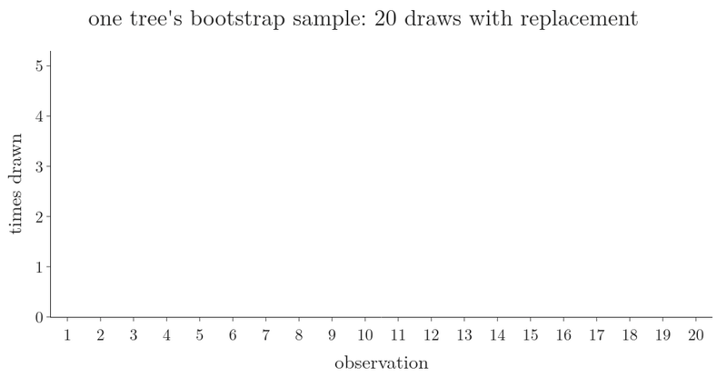
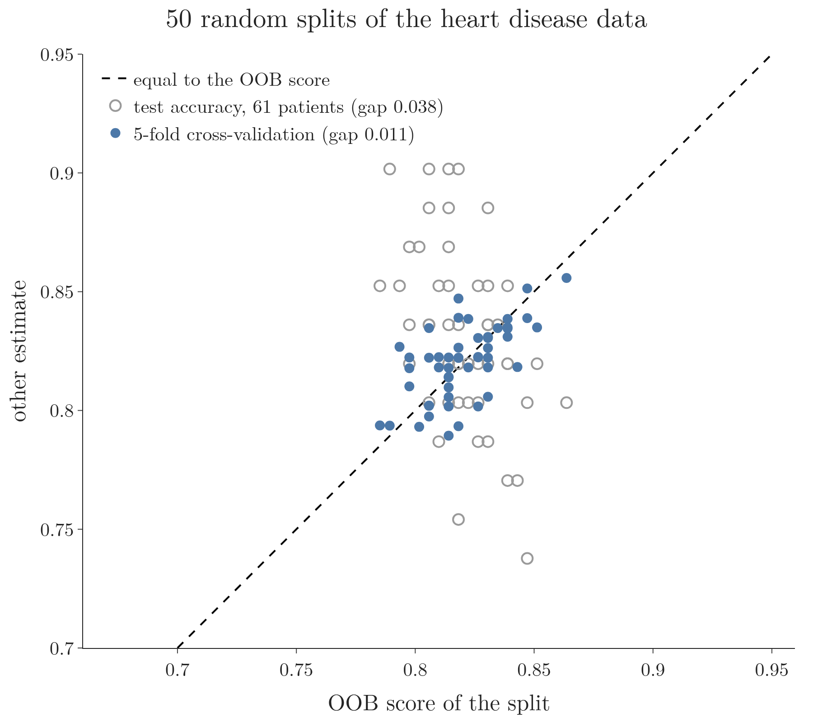
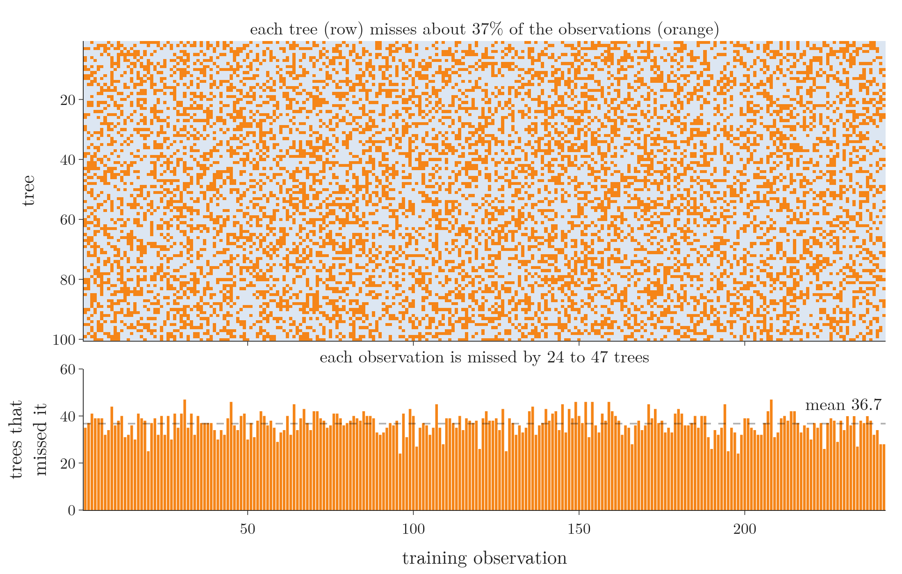

<!-- where-this-fits: generated by course_map/build_map.py; edit concepts.yaml, not this block -->
> **Where this fits:** Pipeline map steps 8 (Model), 9 (Evaluate). See the [Course map](../../../00-course-map/00-course-map.md).
>
> 
>
> - **Builds on:** Overfitting ([Note ML-007](../../../ML/01-foundations/ML-007-challenges-in-ml/ML-007-challenges-in-ml.md)); Hyperparameter tuning ([Note ML-009](../../../ML/01-foundations/ML-009-mldlc/ML-009-mldlc.md)); Grid and random search ([Note ML-028](../../../ML/03-feature-engineering/ML-028-pipelines/ML-028-pipelines.md)); Decision trees ([Note ML-091](../../../ML/08-trees-and-ensembles/ML-091-decision-trees-intuition/ML-091-decision-trees-intuition.md)); Feature importance ([Note ML-093](../../../ML/08-trees-and-ensembles/ML-093-regression-trees/ML-093-regression-trees.md)); Bagging ([Note ML-099](../../../ML/08-trees-and-ensembles/ML-099-bagging-intuition/ML-099-bagging-intuition.md)).
> - **Leads to:** Balanced random forest ([Note ML-127](../../../ML/09-clustering-and-more/ML-127-imbalanced-data/ML-127-imbalanced-data.md)).
> - **Compare with:** Bagging ([Note ML-101](../../../ML/08-trees-and-ensembles/ML-101-bagging-regressor/ML-101-bagging-regressor.md)); Cross-validation ([Note ML-106](../../../ML/08-trees-and-ensembles/ML-106-random-forest-tuning/ML-106-random-forest-tuning.md)); Dropout ([Note DL-024](../../../DL/02-training/DL-024-dropout/DL-024-dropout.md)).
<!-- /where-this-fits -->

## 1. Overview

> **Key point:** Each tree in a forest never sees about 37% of the training observations. Predicting every observation with only the trees that never saw it, and scoring those predictions, gives a free estimate of how the forest will do on new data.


**Out-of-bag (OOB) evaluation** (G-1411) is a way to test a bagging model, such as a random forest, using only its training data. Each **observation** is one record (one row of the data table): its **features** (input variables, one column each) and its **target** (the output we predict). OOB evaluation is available in every bagging-based ensemble of scikit-learn (section 7). Figure 1 shows the whole process on 6 observations and 4 trees.

The OOB score was introduced with the bagging classifier (the [bagging classifier Note](../ML-100-bagging-classifier/ML-100-bagging-classifier.md), section 4): `oob_score=True`, then `oob_score_`. This Note:

- explains exactly how the score is computed (section 3);
- rebuilds it by hand (section 5);
- shows when it can be trusted (sections 4, 6 and 7).

The Notebook (`notebook.ipynb`) runs every step.

## 2. Out-of-bag observations

> **Key point:** Drawing with replacement means some observations are drawn several times for a tree and others not at all; the observations a tree missed are out-of-bag for that tree.

Each tree is trained on a **bootstrap sample** (G-319), drawn **with replacement** (`bootstrap=True`), which holds on average about 63.2% of the distinct observations (the [bagging Note](../ML-099-bagging-intuition/ML-099-bagging-intuition.md), section 2.3). The other **36.8%**, the observations a tree never drew, are its **out-of-bag (OOB) observations** (G-1412): the tree has never seen them, so they can serve as test data for that tree.

Figure 2 draws one tree's bootstrap sample from 20 observations, one draw at a time. Each draw picks any of the 20 observations, including ones already drawn. Watch the bars: some observations are drawn two, three or four times, and 7 of the 20 (35%) are never drawn. Those 7 are the tree's out-of-bag observations (orange).



Careful: being out-of-bag is a property of an observation **for one tree**, not for the whole forest. An observation missed by tree 1 is almost certainly seen by other trees. The chance that one observation is missed by all 100 trees is

$$0.368^{100} \approx 10^{-43},$$

so in practice no observation is hidden from the whole forest. What OOB evaluation uses is that every observation is hidden from **some** trees.

## 3. How the OOB score is computed

> **Key point:** For each observation, ask only the trees that never saw it, combine their answers, and compare with the truth; the share of correct answers is the OOB score.

### 3.1 The steps

> **Key point:** Four steps: record each tree's sample, find each observation's OOB trees, let them vote, score the votes.

Figure 1 runs these steps on 6 observations and 4 trees:

1. **Record each tree's bootstrap sample.** Blue cells are observations a tree was trained on ("x2": drawn twice); orange cells are its OOB observations. Tree 1 missed observations 3 and 6; tree 4 missed observations 4 and 5.
2. **For each observation, find the trees that never saw it.** Observation 5 is OOB for trees 2 and 4; observation 1 only for tree 2.
3. **Let only those trees vote.** Trees 2 and 4 both say 1 for observation 5, so observation 5's **OOB prediction** (G-1392) is 1.
4. **Compare with the truth.** Observation 3 is really 1, but its only OOB tree, tree 1, says 0: wrong. The other five observations are right.

### 3.2 The formula

> **Key point:** OOB accuracy is the number of observations whose OOB prediction is right, divided by the number of observations that have an OOB prediction.

1. **In words:** the share of training observations predicted correctly by the trees that never saw them.
2. **Formula:**
   $$\text{OOB score} = \frac{\text{rows whose OOB prediction is correct}}{\text{rows that have an OOB prediction}}$$
3. **Example:** in Figure 1, 5 of the 6 observations are right:
   $$\text{OOB score} = \frac{5}{6} = 0.83$$

For a regressor, the OOB prediction of an observation is the **mean** of its OOB trees' numbers, and `oob_score_` is the $R^2$ of those predictions (the [bagging regressor Note](../ML-101-bagging-regressor/ML-101-bagging-regressor.md), section 4).

> **Extra:** scikit-learn does not count hard votes. Each OOB tree gives its class probabilities for the observation (the share of each class in the leaf the observation lands in), the probabilities are added up, and the class with the largest total wins. Adding probabilities in this way is **soft voting** (G-1828) (the [voting classifier Note](../ML-097-voting-classifier/ML-097-voting-classifier.md)). The totals, divided by the number of OOB trees, are stored in `oob_decision_function_`. On our data, hard votes and soft votes give the same score.

## 4. The OOB score in scikit-learn

> **Key point:** On the heart disease data, the OOB score is as good an estimate as 5-fold cross-validation (0.820 against 0.820, averaged over 50 splits), at no extra cost.

We use the heart disease data of the [tuning Note](../ML-106-random-forest-tuning/ML-106-random-forest-tuning.md): 303 patients, 242 for training and 61 for testing.

> **Python:** A random forest with its OOB score.
>
> ```python
> rf = RandomForestClassifier(oob_score=True,
>                             random_state=42)
> rf.fit(X_train, y_train)
> rf.oob_score_                 # 0.835
> rf.score(X_test, y_test)      # 0.836
> ```
>
> `oob_score=True` must be set **before** `fit`: the OOB predictions are collected while the forest is trained. Without it, `oob_score_` does not exist.

On this split the OOB score, **0.835**, is close to the test accuracy, **0.836**, and a 5-fold **cross-validation** (G-510) on the training set gives 0.806. One split of 61 test patients is noisy, though: one patient moves the test accuracy by 0.016. So the Notebook repeats the comparison on 50 random splits, with 500 trees:

| Estimate (mean over 50 splits) | Accuracy |
|---|---|
| OOB score | 0.820 |
| 5-fold cross-validation | 0.820 |
| Test accuracy (61 patients) | 0.831 |

On a typical split, the OOB score and the cross-validation score differ by only 0.011, while each one misses the 61-patient test accuracy by 0.038: the small test set is the noisy one. The OOB estimate is almost identical to cross-validation (ESL §15.3.1), but cross-validation needs 5 more forests to be trained. The OOB score needs none. Think of a study group in which each member is quizzed only on questions they never practised: every quiz is fair, and no separate exam is needed.

Figure 3 plots all 50 splits. Each point is one split: its OOB score across, and another estimate up. Watch the blue cross-validation points stay close to the dashed line, where the two estimates are equal, while the grey test-set points spread far above and below it.



So the OOB observations act as a **validation set** (G-2067) that comes for free: about 37% of the data, unseen by each tree, without holding out any observations from training.

A free validation score is also a way to tune a forest: train forests with different settings, for example different values of `max_features` (the [random forest hyperparameters Note](../ML-105-random-forest-hyperparameters/ML-105-random-forest-hyperparameters.md), section 3.2), and keep the one with the best OOB score.

## 5. Rebuilding the OOB score by hand

> **Key point:** `estimators_samples_` tells us which observations each tree saw; predicting each tree's missing observations and adding up the probabilities reproduces `oob_score_` exactly.

A fitted forest keeps each tree's bootstrap sample in `estimators_samples_` (the same attribute as in the [bagging classifier Note](../ML-100-bagging-classifier/ML-100-bagging-classifier.md), section 3.3). From it, the Notebook builds a table with one row per tree and one column per training observation, marking which observations each tree missed. Figure 4 draws that table.



Reading Figure 4 row by row and column by column gives two facts:

- each tree's share of OOB observations is between 32% and 41%, **36.7%** on average, matching the theory's 36.8%;
- every training observation is OOB for at least 24 of the 100 trees (36.7 on average, at most 47), so every observation gets an OOB prediction.

> **Python:** The OOB predictions, step by step.
>
> ```python
> in_bag = np.zeros((n_trees, n_rows), dtype=bool)
> for t, rows in enumerate(rf.estimators_samples_):
>     in_bag[t, rows] = True
> oob = ~in_bag            # True where tree t missed row i
>
> proba = np.zeros((n_rows, 2))
> for t, tree in enumerate(rf.estimators_):
>     proba[oob[t]] += tree.predict_proba(X_arr[oob[t]])
> (proba.argmax(axis=1) == y_arr).mean()     # 0.835
> ```
>
> `~` flips True and False. `proba[oob[t]] += ...` adds tree t's probabilities only to the observations it missed. `argmax(axis=1)` picks, for each observation, the class with the larger total.

The result, **0.835**, is exactly `rf.oob_score_`, and the probabilities match `oob_decision_function_`.

## 6. How many trees the OOB score needs

> **Key point:** With very few trees, some observations have no OOB tree and the estimate is poor; from about 20 trees on, the OOB score tracks the test accuracy.

{height=36%}

Each observation is OOB for only about 37% of the trees. With 5 trees, the chance that an observation is seen by **every** tree is $0.632^5 \approx 0.10$, so about 10% of the observations get no OOB prediction at all: 27 of the 242 here. scikit-learn warns: "Some inputs do not have OOB scores. This probably means too few trees were used", and still counts those observations, with empty probabilities, in the score.

Figure 5 shows the effect on the heart disease data:

- with **5 trees**, the OOB score is 0.711, far below the test accuracy of 0.787: 27 observations have no OOB prediction, and the rest are judged by only a few trees each;
- from about **20 trees** on, the OOB score settles between 0.81 and 0.84, close to the test accuracy (0.84 to 0.87 on 61 noisy test observations).

Here the OOB score sits a little below the test accuracy at every forest size from 20 trees on (for example 0.818 against 0.836 with 500 trees). The gap is a known effect: on two-class data the OOB score tends to underrate a forest, most of all with balanced classes and few observations, as here (Janitza and Hornung, 2018). The reason is that a bootstrap sample that misses observation $i$ holds slightly more observations of the *other* class, so the trees that judge observation $i$ lean a little towards the wrong class.

## 7. When the OOB score is available

> **Key point:** Only with `bootstrap=True`; it works for classifiers, regressors and bagging ensembles alike.

- **The OOB score needs bootstrapping.** With `bootstrap=False` (pasting, the [bagging Note](../ML-099-bagging-intuition/ML-099-bagging-intuition.md), section 6.2) there are no OOB observations, and scikit-learn raises `ValueError: Out of bag estimation only available if bootstrap=True`.
- **The OOB score works for regression.** On a 5,000-observation sample of the California housing data (`fetch_california_housing` in scikit-learn: districts of California, 8 features, the median house value as target), a `RandomForestRegressor` gives an OOB $R^2$ of 0.764 against a test $R^2$ of 0.741. Its per-observation OOB predictions are in `oob_prediction_`.
- **The OOB score works for any bagging ensemble**: `BaggingClassifier` and `BaggingRegressor` take the same `oob_score` (the [bagging classifier Note](../ML-100-bagging-classifier/ML-100-bagging-classifier.md) and the [bagging regressor Note](../ML-101-bagging-regressor/ML-101-bagging-regressor.md)).


## 8. Summary

| | Value on the heart data (mean of 50 splits) | What it needs |
|---|---|---|
| OOB score | 0.820 | `oob_score=True`, `bootstrap=True`, no extra training |
| 5-fold cross-validation | 0.820 | 5 more forests |
| Test accuracy (61 patients) | 0.831 | a held-out test set |

- A tree's OOB observations are the training observations its bootstrap sample missed: about 37%.
- OOB is per tree: practically every observation is seen by some trees and missed by others.
- Each observation is predicted only by its OOB trees; the share of correct predictions is the OOB score.
- With enough trees (here about 20 or more), the OOB score is a free estimate as good as cross-validation.

## 9. Sources

**Built from**

- CampusX, "OOB Score | Out of Bag Evaluation in Random Forest | Machine Learning", YouTube, https://www.youtube.com/watch?v=tdDhyFoSG94
- StatQuest with Josh Starmer, "StatQuest: Random Forests Part 1 - Building, Using and Evaluating", YouTube, https://www.youtube.com/watch?v=J4Wdy0Wc_xQ (the per-observation OOB vote of section 3, and tuning with the OOB score)

**Other references**

- Hastie, T., Tibshirani, R. and Friedman, J. (2009). *The Elements of Statistical Learning*, 2nd ed. Springer. §15.3.1 (out-of-bag samples).
- Janitza, S. and Hornung, R. (2018). On the overestimation of random forest's out-of-bag error. *PLoS ONE* 13(8): e0201904.

## 10. Key terms

| Term | Meaning |
|---|---|
| Out-of-bag (OOB) evaluation (G-1411) | Testing a bagging model by predicting each training observation with only the base models that never saw it |
| OOB prediction | An observation's prediction from only the trees whose bootstrap sample missed it |
| oob_score_ | The accuracy (classifier) or $R^2$ (regressor) of the OOB predictions |
| oob_decision_function_ | Each training observation's class probabilities from its OOB trees |
| oob_prediction_ | Each training observation's OOB prediction, for a regressor |
| Validation set | Data held back from training to check and tune a model before the final test |
