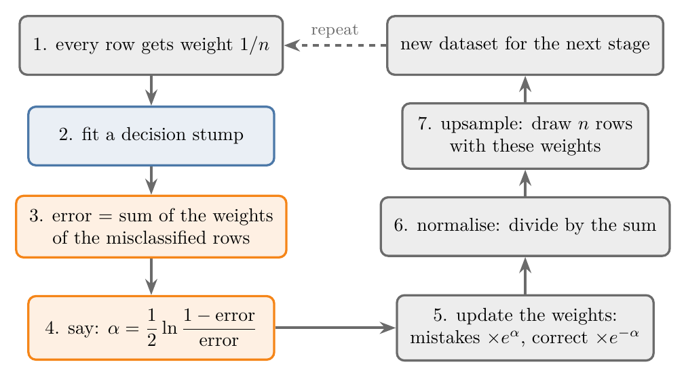
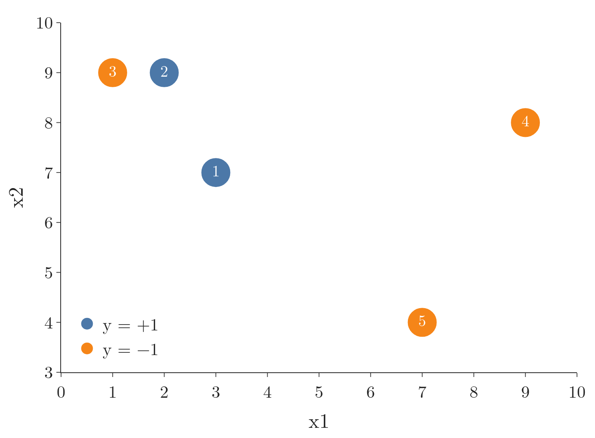
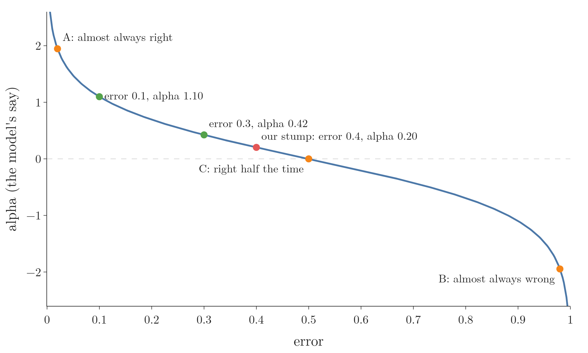
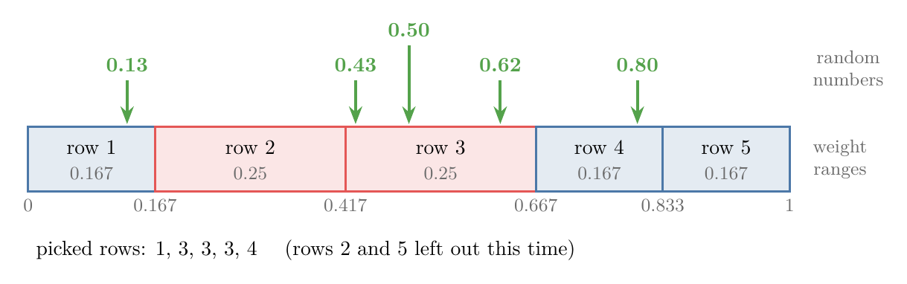
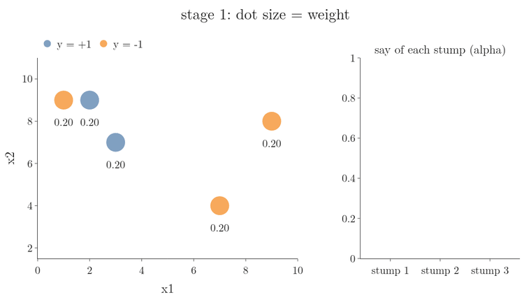

<!-- where-this-fits: generated by course_map/build_map.py; edit concepts.yaml, not this block -->
> **Where this fits:** Pipeline map step 8 (Model). See the [Course map](../../../00-course-map/00-course-map.md).
>
> 
>
> - **Builds on:** [AdaBoost](../../../ML/08-trees-and-ensembles/ML-109-adaboost-intuition/ML-109-adaboost-intuition.md#3-a-stage-wise-additive-model).
> - **Compare with:** [Gradient boosting](../../../ML/08-trees-and-ensembles/ML-114-gradient-boosting-intuition/ML-114-gradient-boosting-intuition.md#2-boosting-passes-mistakes-forward).
<!-- /where-this-fits -->

## 1. Overview

> **Key point:** One AdaBoost stage, in seven steps: give the observations weights, fit a stump, add up the weights it got wrong, turn that error into a say alpha, raise the weights of the mistakes and lower the rest, normalise, and draw a new dataset by weight.

{height=40%}

We met the idea in [stage by stage](../ML-109-adaboost-intuition/ML-109-adaboost-intuition.md#4-stage-by-stage): stumps (one-split decision trees) trained one after another, each focusing on the previous one's mistakes, combined by a weighted vote. That section left two questions open:

- how the say $\alpha$ of each stump is computed;
- how the mistakes are made "more important" for the next stump.

The present Note answers both on a toy dataset of 5 observations, following Figure 1 step by step. [AdaBoost from scratch](../ML-111-adaboost-from-scratch/ML-111-adaboost-from-scratch.md#3-stage-1-weights-stump-error-and-alpha) runs the same steps in Python.

## 2. The toy data

> **Key point:** 5 observations, two features x1 and x2, and a target y of +1 or -1.

Each **observation** is one record, one row of the table below. Each **feature** is an input variable, one column (x1, x2). The **target** y is the output we predict.

| Row | x1 | x2 | y |
|---|---|---|---|
| 1 | 3 | 7 | +1 |
| 2 | 2 | 9 | +1 |
| 3 | 1 | 9 | -1 |
| 4 | 9 | 8 | -1 |
| 5 | 7 | 4 | -1 |

The output has two classes, so this is classification. The number of observations is $n = 5$. As in [labels +1 and -1](../ML-109-adaboost-intuition/ML-109-adaboost-intuition.md#23-labels-1-and--1), the classes are written +1 and -1.

Figure 2 places the 5 observations in the plane of the two features. Watch where the two classes sit: the +1 observations 1 and 2 lie at the left, next to the -1 observation 3, so no single cut on x1 or x2 puts every observation on its class's side.

{height=34%}

## 3. Step 1: every observation gets the same weight

> **Key point:** At the start every observation has weight 1/n, so all observations are equally important and the weights add up to 1.

AdaBoost gives each observation a **sample weight** (G-1730): a number saying how important that observation is. At the start all observations are equally important.

1. **In words:** each observation's starting weight is 1 divided by the number of observations.
2. **Formula:**
   $$w_i = \frac{1}{n}$$
3. **Example:** with $n = 5$, every observation gets:
   $$w_i = 1/5 = 0.2$$
   The weights add up to 1:
   $$0.2 \times 5 = 1$$

The weights always add up to 1. We add them to the table as a new column, *weight*.

## 4. Step 2: fit a decision stump

> **Key point:** Train a decision stump on the data and record its prediction for every observation.

We train a **decision stump** (G-559): a decision tree with `max_depth=1` (see [decision stumps](../ML-109-adaboost-intuition/ML-109-adaboost-intuition.md#22-decision-stumps)). The stump tries every cut on x1 and on x2, for example "x1 > 5" or "x2 < 10", and keeps the one with the largest information gain (or the largest drop in Gini impurity; [information gain](../ML-091-decision-trees-intuition/ML-091-decision-trees-intuition.md#7-information-gain) and [Gini impurity](../ML-091-decision-trees-intuition/ML-091-decision-trees-intuition.md#8-gini-impurity) compare the two). Call the result **model 1**.

We then pass the training observations through model 1 and write its predictions in a new column. Suppose they are:

| Row | y | weight | prediction | correct? |
|---|---|---|---|---|
| 1 | +1 | 0.2 | +1 | yes |
| 2 | +1 | 0.2 | -1 | **no** |
| 3 | -1 | 0.2 | +1 | **no** |
| 4 | -1 | 0.2 | -1 | yes |
| 5 | -1 | 0.2 | -1 | yes |

Model 1 gets observations 2 and 3 wrong. The predictions are an assumed example: the steps that follow are the same for any stump.

## 5. Step 3: the error is a sum of weights

> **Key point:** A stump's error is the total weight of the observations it misclassified, not simply the share of observations it got wrong.

1. **In words:** add up the weights of the misclassified observations. The total is the **weighted error** (G-2114).
2. **Formula:**
   $$\text{error} = \sum_{i \thinspace:\thinspace\hat y_i \neq y_i} w_i$$
   The sum runs over the observations where the prediction $\hat y_i$ differs from the true class $y_i$: the symbol $\sum_{i:\hat y_i \neq y_i}$ means "add $w_i$ for every observation $i$ that is misclassified".
3. **Example:** observations 2 and 3 are wrong, each with weight 0.2:
   $$\text{error} = 0.2 + 0.2 = 0.4$$

In this first stage all weights are equal, so the error equals the share of observations wrong, 2 out of 5. In later stages the weights differ, and a mistake on a heavy observation costs more than a mistake on a light one.

## 6. Step 4: the say of the stump, alpha

> **Key point:** Alpha, half the log of (1 - error)/error, is large and positive for a small error, 0 at error 0.5, and large and negative for an error near 1.

The **model weight** $\alpha$ (**alpha**, G-192) is the stump's say in the final vote. The say must depend on the error: a model that makes many mistakes should have a small say, and a model that makes few a large one.

### 6.1 What shape alpha should have

> **Key point:** A model that is always wrong is as useful as one that is always right: we just flip its answer. The useless model is the one that is right half the time.

Take three models:

- **model A** is always right: error 0, accuracy 100%;
- **model B** is always wrong: error 1, accuracy 0%;
- **model C** is right half the time: error 0.5, accuracy 50%.

(The error is 1 minus the accuracy: 90% accuracy means an error of 0.1.)

A is clearly the most reliable. Between B and C, B is the more reliable. Think of two friends: one lies every time, the other lies half the time. Whatever the first one says, the opposite is true, so we can trust that friend completely by flipping every answer. The second one is no help at all: we never know when to believe them.

So we want a function of the error that:

- is large and positive when the error is near 0 (trust the model);
- is 0 when the error is 0.5 (ignore the model);
- is large and negative when the error is near 1 (trust the model, but flip its vote).

### 6.2 The formula

> **Key point:** Half the natural log of the ratio of correct weight to wrong weight.

{height=40%}

The standard AdaBoost formula (Schapire 2013, Algorithm 1), plotted in Figure 3, has exactly that shape.

1. **In words:** divide the weight the stump got right by the weight it got wrong, take the natural logarithm, and halve it.
2. **Formula:**
   $$\alpha = \frac{1}{2}\ln\left(\frac{1-\text{error}}{\text{error}}\right)$$
   $\ln$ is the natural logarithm, the log to base $e \approx 2.718$ (logs were introduced in [from products to sums: the log](../../07-classification/ML-072-log-loss/ML-072-log-loss.md#4-from-products-to-sums-the-log)).
3. **Example:** model 1 has error 0.4:
   $$\alpha_1 = \frac{1}{2}\ln\left(\frac{1-0.4}{0.4}\right)$$
   $$= \frac{1}{2}\ln(1.5)$$
   $$= \frac{1}{2} \times 0.405 = 0.20$$

So model 1's say in the final vote is $\alpha_1 = 0.20$, a small say, since it got 40% wrong (Figure 3, red point). Fewer mistakes earn a larger say: a stump with error 0.3 gets $\alpha = 0.42$ and a stump with error 0.1 gets $\alpha = 1.10$ (Figure 3, green points; these two stumps appear in [AdaBoost from scratch](../ML-111-adaboost-from-scratch/ML-111-adaboost-from-scratch.md#7-stage-2-and-a-stump-with-no-mistakes)). The checks. An error of 0.5 gives:

$$0.5 \times \ln 1 = 0$$

An error of 0.98 gives:

$$0.5 \times \ln(0.02/0.98) = -1.95$$

This is the mirror image of an error of 0.02.

> **Extra:** A negative alpha flips the stump's vote in the final sum, which is the "believe the liar backwards" idea. In practice a stump that is worse than guessing is rarely kept: scikit-learn stops adding stumps when a new one's error reaches 0.5 or more on two classes (scikit-learn source; [the hyperparameters of AdaBoostClassifier](../ML-112-adaboost-hyperparameters/ML-112-adaboost-hyperparameters.md#2-the-hyperparameters-of-adaboostclassifier)).

## 7. Step 5: update the observation weights

> **Key point:** Multiply the weight of each misclassified observation by $e^{\alpha}$ (it grows) and of each correct observation by $e^{-\alpha}$ (it shrinks).

Now we tell the next stump about the mistakes, by **boosting** the weights of the misclassified observations and lowering the rest: the **weight update** (G-2110). Raising these weights is where boosting gets its name.

1. **In words:** a misclassified observation's weight is multiplied by $e$ to the power alpha; a correctly classified observation's weight by $e$ to the power minus alpha.
2. **Formula:**
   For a misclassified observation $i$:
   $$w_i^{\text{new}} = w_i \thinspace e^{\alpha}$$
   For an observation $i$ classified correctly:
   $$w_i^{\text{new}} = w_i \thinspace e^{-\alpha}$$
3. **Example:** with $w_i = 0.2$ and $\alpha_1 = 0.2027$:
   For a misclassified observation:
   $$0.2 \times e^{0.2027} = 0.2 \times 1.2247 = 0.2449$$
   For a correct observation:
   $$0.2 \times e^{-0.2027} = 0.2 \times 0.8165 = 0.1633$$

Observations 2 and 3 rise from 0.2 to about 0.24; observations 1, 4 and 5 fall to about 0.16. Why the exponential is the right choice is shown in [why the update uses the exponential](../ML-111-adaboost-from-scratch/ML-111-adaboost-from-scratch.md#5-why-the-update-uses-the-exponential).

Figure 4 runs steps 1 to 7 on these weights. Watch the two red bars, the mistakes, grow above the dotted line at 0.2 while the green bars shrink below it. Its last frames show step 7 (section 9).

> **Extra:** With classes +1 and -1, both cases fit in one formula, where $h(x_i)$ is the stump's prediction for observation $i$:
>
> $$w_i^{\text{new}} = w_i\thinspace e^{-\alpha\thinspace y_i\thinspace h(x_i)}$$
>
> If the stump is right, the true class and the prediction have the same sign:
>
> $$y_i h(x_i) = (+1)(+1) = (-1)(-1) = +1$$
>
> so the factor is $e^{-\alpha}$. If it is wrong, $y_i h(x_i) = -1$, so the factor is $e^{\alpha}$. The single formula is another reason AdaBoost uses +1 and -1.

## 8. Step 6: normalise the weights

> **Key point:** Divide every new weight by their total, so the weights add up to 1 again.

After the update the weights no longer add up to 1. They must, because step 7 lays them end to end on the line from 0 to 1, and the next error (step 3) is read as a share of the total weight.

1. **In words:** divide each weight by the sum of all the weights.
2. **Formula:**
   $$w_i \leftarrow \frac{w_i^{\text{new}}}{\sum_{j=1}^{n} w_j^{\text{new}}}$$
3. **Example:** the sum of the new weights:
   $$2 \times 0.2449 + 3 \times 0.1633$$
   $$= 0.4899 + 0.4899 = 0.9798$$
   Divide each weight by it:
   $$\text{misclassified: } \frac{0.2449}{0.9798} = 0.25$$
   $$\text{correct: } \frac{0.1633}{0.9798} = 0.1667$$

Check:

$$2 \times 0.25 + 3 \times 0.1667 = 1$$

Figure 4 shows the normalised weights at the end of step 6. The two mistakes now carry half of the total weight between them, against 40% before.

> **Extra:** Here the misclassified observations end up with exactly half the total weight. The half-and-half split holds after every normalised AdaBoost update. Before normalising, the mistakes weigh this much in total:
>
> $$\text{error} \cdot e^{\alpha}$$
>
> and the correct observations:
>
> $$(1-\text{error}) \cdot e^{-\alpha}$$
>
> Step 4 gave:
>
> $$e^{\alpha} = \sqrt{(1-\text{error})/\text{error}}$$
>
> With it, both totals equal:
>
> $$\sqrt{\text{error}\thinspace(1-\text{error})}$$
>
> In our example:
>
> $$\sqrt{0.4 \times 0.6} = 0.4899$$
>
> These are the two equal halves of the sum above. So the old stump, judged on the new weights, has an error of exactly 0.5 and would get $\alpha = 0$: repeating it adds nothing to the vote, and the next stump only earns a say by doing better on the reweighted observations.

## 9. Step 7: upsampling, a new dataset drawn by weight

> **Key point:** Lay the weights end to end on the line from 0 to 1, draw n random numbers, and pick the observation whose range each number lands in. Heavy observations get picked more often.

The new weights are passed on through the data itself. We build a new dataset of the same size, $n = 5$ observations, in which heavy observations appear more often. Drawing a dataset this way is called **upsampling** (resampling by weight) (G-2063).

{height=26%}

1. **Make ranges.** Each observation owns a stretch of the line from 0 to 1, as long as its weight. Observation 1 owns 0 to 0.167, observation 2 owns 0.167 to 0.417, observation 3 owns 0.417 to 0.667, observation 4 owns 0.667 to 0.833, and observation 5 owns 0.833 to 1 (Figure 5). Each boundary is the running total, the **cumulative sum** (G-519), of the weights.
2. **Draw random numbers.** Draw 5 random numbers between 0 and 1, say 0.13, 0.43, 0.62, 0.50 and 0.80.
3. **Pick observations.** Each number picks the observation whose range it falls in: 0.13 picks observation 1; 0.43, 0.62 and 0.50 all pick observation 3; 0.80 picks observation 4.

The new dataset is observations 1, 3, 3, 3 and 4. Observation 3, a mistake, appears three times; observations 2 and 5 do not appear at all. Another draw could give, for example, observations 1, 3, 2, 2 and 5. Either way, observations with larger weights own longer stretches of the line and are picked more often.

The last frames of Figure 4 play the draw: each random number lands as a dart on one observation's stretch.

The next stump trains on this new dataset, so it pays most attention to the observations the first stump got wrong. In the new dataset every observation starts with the same weight, $1/n$, again. Nothing is lost by the reset: a heavy observation is now present as several copies, and the copies carry its importance.

> **Extra:** Upsampling is one way to make a model respect weights. The other is to hand the weights straight to the learner: scikit-learn's decision trees accept a `sample_weight` argument and count each observation in proportion to its weight. scikit-learn's AdaBoost works this way, with no random draws (scikit-learn source; [weights instead of upsampling](../ML-111-adaboost-from-scratch/ML-111-adaboost-from-scratch.md#10-weights-instead-of-upsampling-how-scikit-learn-does-it)).

## 10. Repeat, then vote

> **Key point:** The new dataset starts the next stage; after T stages we have T stumps and T alphas, combined by the weighted vote.

With the new dataset, everything repeats (Figure 1):

1. every observation of the new dataset gets weight $1/n$ again;
2. a new stump is trained on it, model 2;
3. its error and its say $\alpha_2$ are computed;
4. the weights are updated and normalised, and a new dataset is drawn for model 3.

We repeat this for as many stumps as we want, $T$. At the end we have $\alpha_1, \alpha_2, \dots, \alpha_T$ and stumps $h_1, \dots, h_T$, and the prediction is the weighted vote of [the final prediction](../ML-109-adaboost-intuition/ML-109-adaboost-intuition.md#5-the-final-prediction-a-weighted-vote):

$$H(x) = \operatorname{sign}\big(\alpha_1 h_1(x) + \alpha_2 h_2(x) + \dots + \alpha_T h_T(x)\big)$$

Figure 6 runs three real stages on our 5 observations. Here the stumps are fitted by scikit-learn, so their mistakes differ from the assumed example of section 4, and the weights go straight to each stump as sample weights instead of through upsampling (the Extra in section 9). Watch observation 3 swell to half of all the weight after stump 1 misses it, the next stumps cut around it, and the weighted vote of 3 stumps get all 5 observations right, even though no single stump can.

## 11. Summary

| Step | What we do | Our numbers (stage 1) |
|---|---|---|
| 1 | weight every observation $1/n$ | 0.2 each |
| 2 | fit a decision stump | observations 2 and 3 wrong |
| 3 | error = sum of the weights of the mistakes | 0.4 |
| 4 | $\alpha = 0.5 \ln((1-\text{error})/\text{error})$ | 0.20 |
| 5 | mistakes $\times e^{\alpha}$, correct $\times e^{-\alpha}$ | 0.2449 and 0.1633 |
| 6 | divide by the sum | 0.25 and 0.1667 |
| 7 | draw $n$ observations by weight | observations 1, 3, 3, 3, 4 |

- The error is a weighted error: the total weight of the misclassified observations, so in later stages a mistake on a heavy observation costs more than a mistake on a light one.
- Alpha is large for a small error, 0 at error 0.5, negative above 0.5, because a model that is right half the time tells us nothing, while one that is always wrong can be trusted by flipping its vote.
- The weights of the mistakes grow, the others shrink, and all are rescaled to add up to 1, so the mistakes carry half of the total weight and the old stump, judged on the new weights, would earn no say.
- Upsampling turns weights into a new dataset in which heavy observations appear more often, so the next stump pays most attention to the observations the last one got wrong.
- These steps answer the two open questions: steps 3 and 4 compute each stump's say, and steps 5 to 7 make its mistakes more important for the next stump.

## 12. Sources

**Built from**

- CampusX, "AdaBoost - A Step by Step Explanation", YouTube, https://www.youtube.com/watch?v=RT0t9a3Xnfw
- StatQuest with Josh Starmer, "AdaBoost, Clearly Explained", YouTube, https://www.youtube.com/watch?v=LsK-xG1cLYA (the same steps on a second example; equal weights again after the new dataset is drawn)

**Other references**

- Schapire, R. E. (2013). Explaining AdaBoost. In *Empirical Inference*, Springer, pp. 37–52. (Algorithm 1: weights start at $1/m$, the say of each stump is half the log of (1 - error) over error, and the weights are multiplied by $e^{-\alpha_t y_i h_t(x_i)}$ and normalised.) schapire.net/papers/explaining-adaboost.pdf
- scikit-learn developers. Source file `sklearn/ensemble/_weight_boosting.py` (version 1.9), method `_boost` of `AdaBoostClassifier`: fits each stump with `sample_weight` and stops when the error reaches $1 - 1/K$, which is 0.5 for two classes. github.com/scikit-learn/scikit-learn

## 13. Key terms

Terms taught in this Note come first; linked terms are recaps, taught in the Note the link opens.

| Term | Meaning |
|---|---|
| Sample weight (G-1730) | A number attached to each row saying how important it is; AdaBoost starts every row at $1/n$ and raises the weights of misclassified rows so the next model focuses on them. |
| Weighted error (G-2114) | The total sample weight of the rows a model misclassifies; AdaBoost uses it to judge how good that model is. |
| Weight update (G-2110) | The AdaBoost step that raises the weights of misclassified rows (times $e^{\alpha}$) and lowers the rest (times $e^{-\alpha}$), so the next model pays more attention to the mistakes. |
| Upsampling (resampling by weight) (G-2063) | Drawing a new dataset of the same size in which each row is picked with probability equal to its weight, so heavily weighted rows appear more often for the next model. |
| Cumulative sum (G-519) | The running total of a list of numbers; it turns weights into ranges on the line from 0 to 1. |
| [Decision stump](../../../ML/08-trees-and-ensembles/ML-109-adaboost-intuition/ML-109-adaboost-intuition.md#22-decision-stumps) (G-559) | A decision tree with maximum depth 1: one question, two regions. Too weak alone, it is AdaBoost's usual weak learner. |
| [Alpha (model weight)](../../../ML/08-trees-and-ensembles/ML-109-adaboost-intuition/ML-109-adaboost-intuition.md#43-the-say-of-each-stump-alpha) (G-192) | A base model's say in AdaBoost's final vote; larger when it made fewer mistakes. |
| [Normalisation (of weights)](../../../ML/08-trees-and-ensembles/ML-111-adaboost-from-scratch/ML-111-adaboost-from-scratch.md#6-normalising-and-drawing-the-next-dataset) (G-1347) | Dividing every weight by their sum so they add up to 1. |
