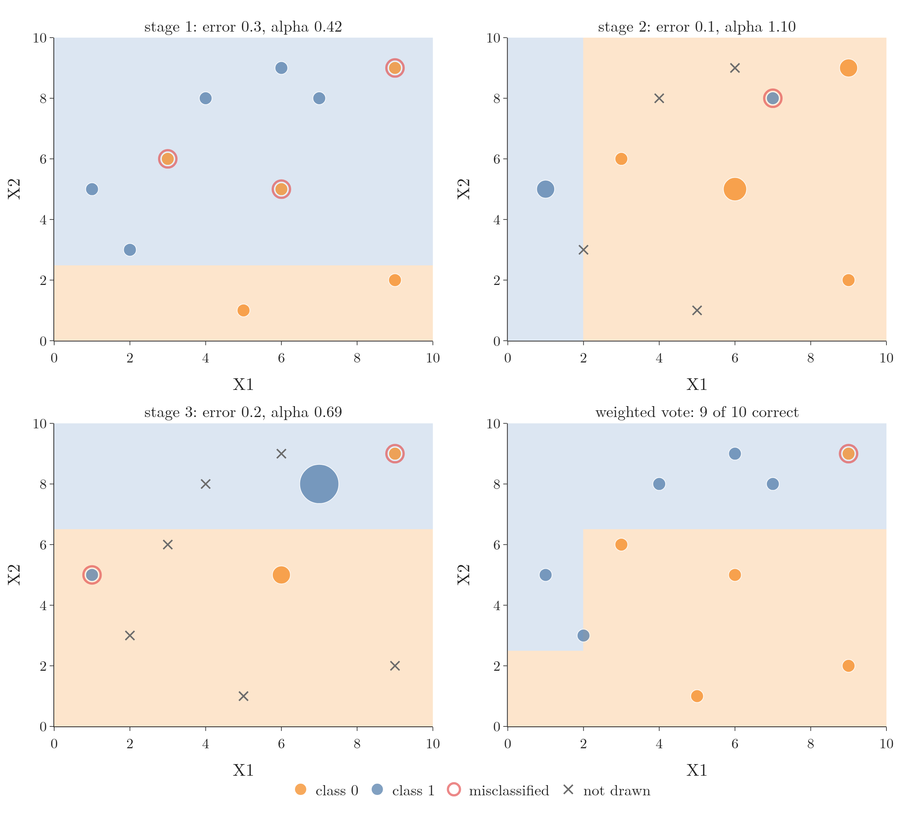
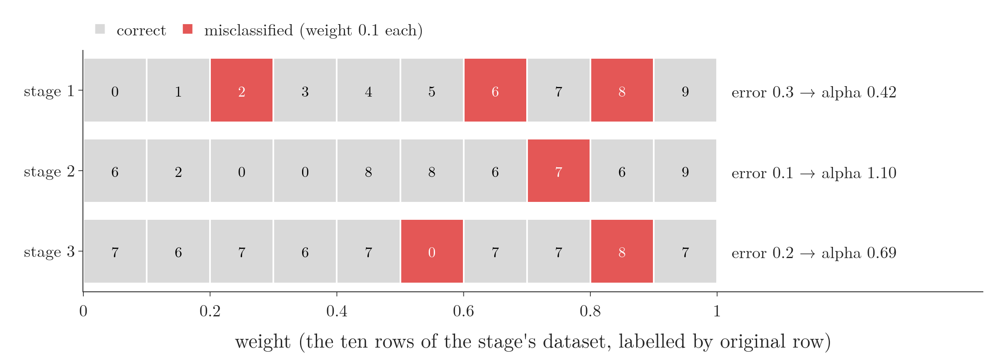
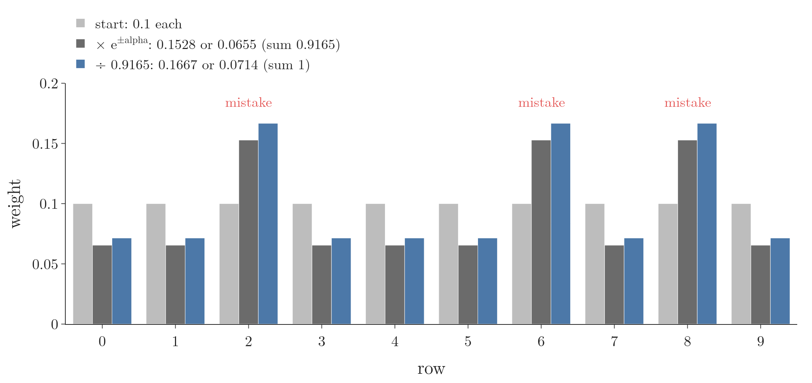
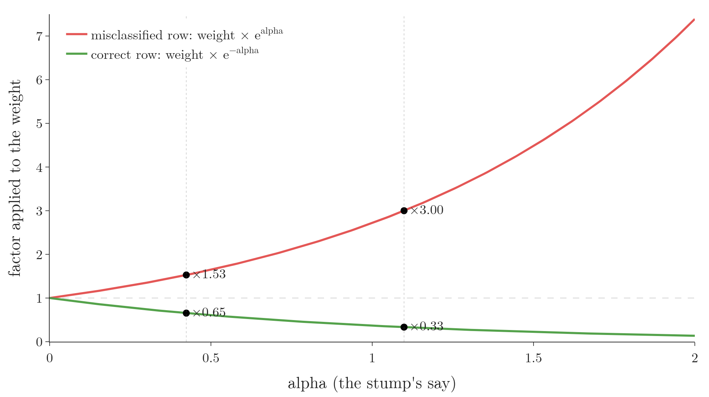
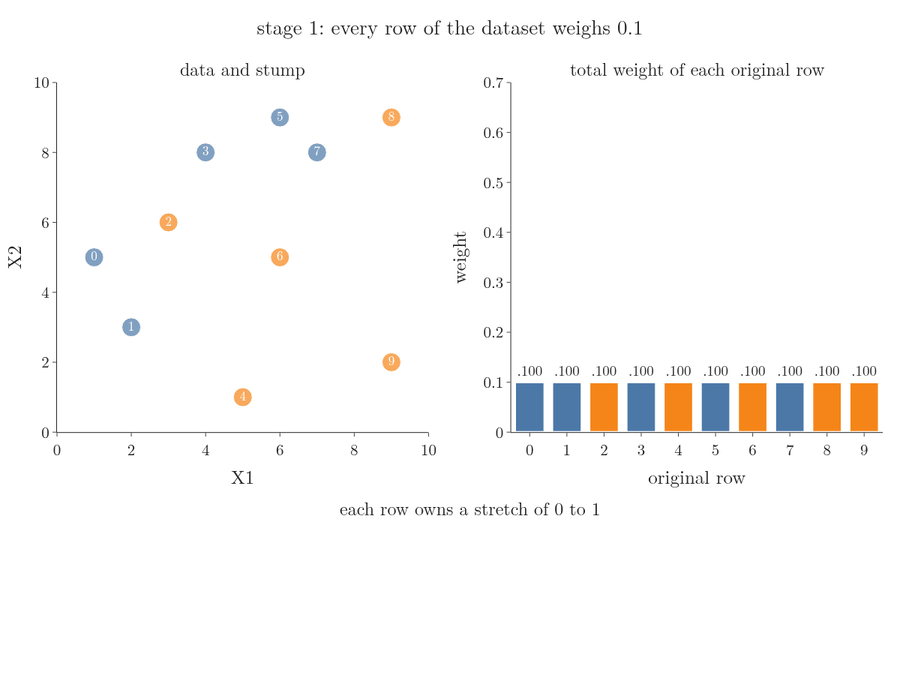
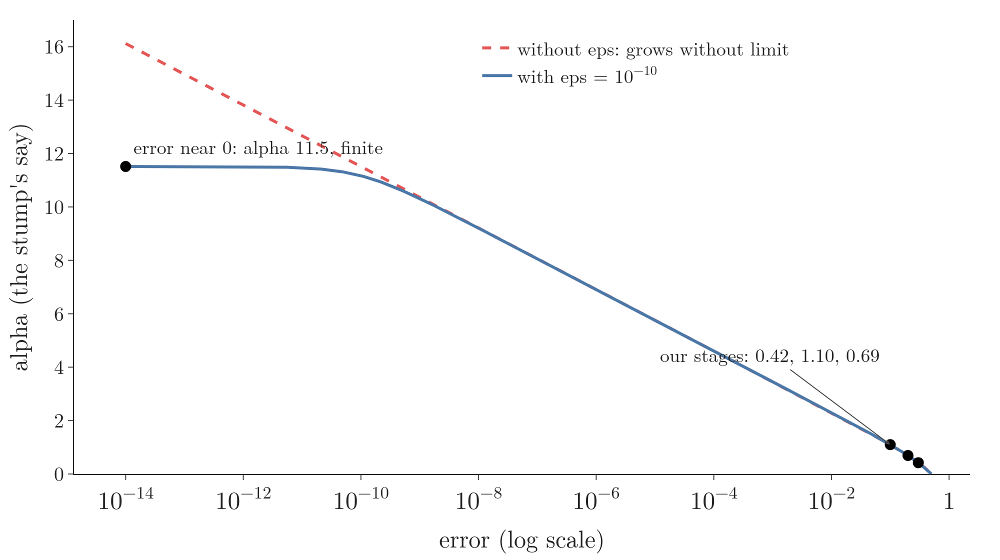
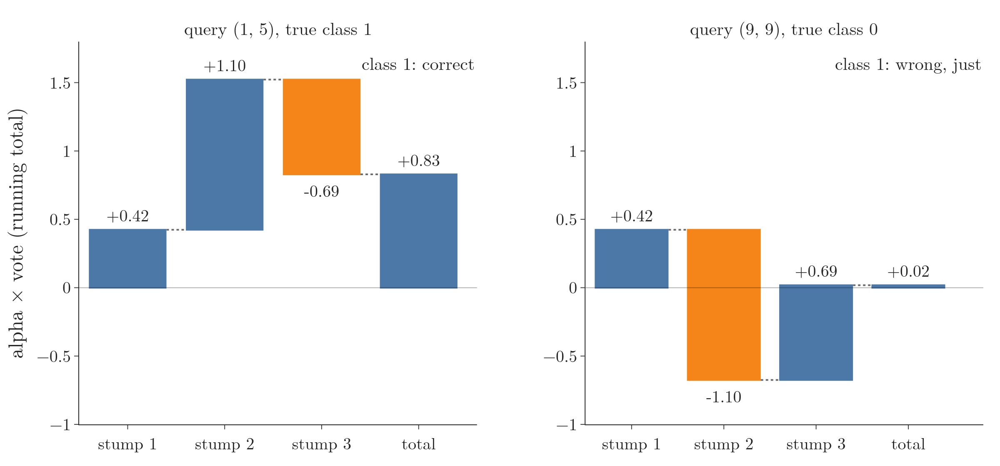
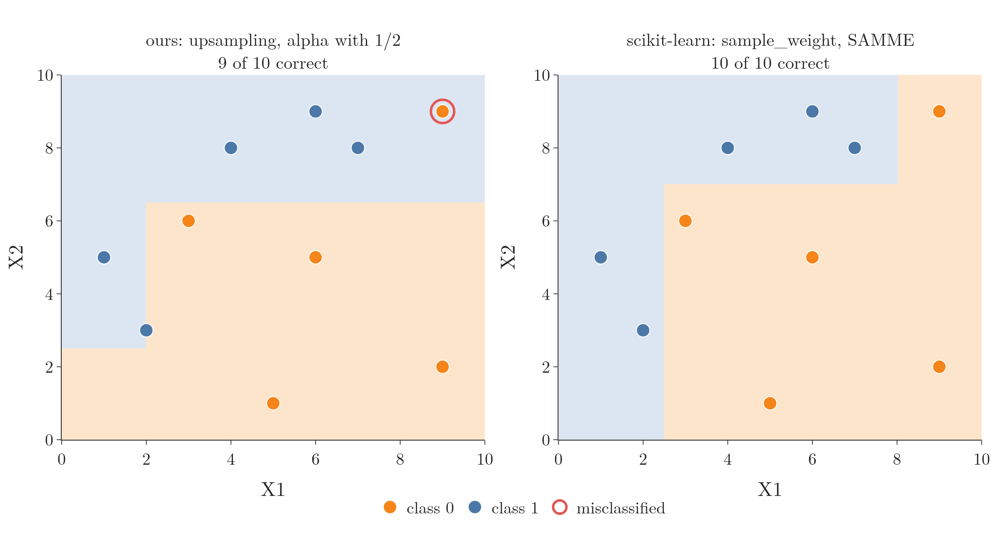

<!-- where-this-fits: generated by course_map/build_map.py; edit concepts.yaml, not this block -->
> **Where this fits:** Pipeline map step 8 (Model). See the [Course map](../../../00-course-map/00-course-map.md).
>
> 
>
> - **Builds on:** Hyperparameter tuning ([Note ML-009](../../../ML/01-foundations/ML-009-mldlc/ML-009-mldlc.md)); Decision trees ([Note ML-091](../../../ML/08-trees-and-ensembles/ML-091-decision-trees-intuition/ML-091-decision-trees-intuition.md)); Boosting ([Note ML-095](../../../ML/08-trees-and-ensembles/ML-095-ensemble-learning/ML-095-ensemble-learning.md)).
> - **Compare with:** Gradient boosting ([Note ML-114](../../../ML/08-trees-and-ensembles/ML-114-gradient-boosting-intuition/ML-114-gradient-boosting-intuition.md)).
<!-- /where-this-fits -->

## 1. Overview

> **Key point:** We code three stages of AdaBoost by hand on 10 observations: weights, stump, error, alpha, weight update, normalisation and upsampling, then the weighted vote. The result matches the steps of the step-by-step Note.

{height=55%}

The [AdaBoost step-by-step Note](../ML-110-adaboost-step-by-step/ML-110-adaboost-step-by-step.md) went through one stage on paper. Here we write each step in Python with pandas, NumPy and scikit-learn, and run three stages (Figure 1). The Notebook (`notebook.ipynb`) holds the full code; `images/figs.py` draws the figures with the same data and random seed.

Along the way we see two things the paper version did not show: why the weight update uses the exponential, and what to do when a stump makes no mistakes at all.

## 2. The data

> **Key point:** 10 observations, features X1 and X2, classes 1 and 0; no single straight cut separates them.

Each **observation** (G-1374) is one record (one row of the table). X1 and X2 are the **features** (G-772), the input variables (columns). The **target** (G-1949) `label` is the class we predict.

| Row | X1 | X2 | label |
|---|---|---|---|
| 0 | 1 | 5 | 1 |
| 1 | 2 | 3 | 1 |
| 2 | 3 | 6 | 0 |
| 3 | 4 | 8 | 1 |
| 4 | 5 | 1 | 0 |
| 5 | 6 | 9 | 1 |
| 6 | 6 | 5 | 0 |
| 7 | 7 | 8 | 1 |
| 8 | 9 | 9 | 0 |
| 9 | 9 | 2 | 0 |

The rows are numbered from 0, as pandas does. The classes are mixed (Figure 1, top left), so no single straight line separates them: a stump alone will make mistakes, which is exactly what we want to watch.

The labels are stored as 1 and 0, the way scikit-learn expects them. For the final vote we turn them into +1 and -1 (section 9).

> **Python:** Building the table.
>
> ```python
> import pandas as pd
>
> df = pd.DataFrame()
> df["X1"] = [1, 2, 3, 4, 5, 6, 6, 7, 9, 9]
> df["X2"] = [5, 3, 6, 8, 1, 9, 5, 8, 9, 2]
> df["label"] = [1, 1, 0, 1, 0, 1, 0, 1, 0, 0]
> ```
>
> Assigning a list to `df["X1"]` creates a column named X1.

## 3. Stage 1: weights, stump, error and alpha

> **Key point:** Every observation gets 0.1; the first stump is "X2 at most 2.5 means class 0"; it misclassifies observations 2, 6 and 8, so error = 0.3 and alpha = 0.42.

**Weights.** With 10 observations, each observation starts at:

$$1/10 = 0.1$$

**The stump.** A `DecisionTreeClassifier` with `max_depth=1` is a **decision stump** (G-559): a tree with a single split. Trained on all 10 observations, it chooses **X2 $\le$ 2.5**: below, class 0; above, class 1 (Figure 1, top left).

> **Python:** Weights and the first stump.
>
> ```python
> from sklearn.tree import DecisionTreeClassifier
>
> df["weights"] = 1 / df.shape[0]    # 0.1 for every row
> X = df[["X1", "X2"]].values
> y = df["label"].values
> dt1 = DecisionTreeClassifier(max_depth=1, random_state=0)
> dt1.fit(X, y)
> df["y_pred"] = dt1.predict(X)
> ```
>
> `df.shape[0]` is the number of rows. `export_text(dt1)` from `sklearn.tree` prints the split as text.

> **Extra:** On this data the cut "X1 $\le$ 2.5" is exactly as good as "X2 $\le$ 2.5": both get 3 observations wrong. When two cuts tie, scikit-learn tries the features in a random order, so the winner depends on `random_state` (scikit-learn docs, `DecisionTreeClassifier`); another seed can give the X1 cut.

**Mistakes.** Comparing `label` with `y_pred` observation by observation, the stump is wrong on observations **2, 6 and 8**: three class-0 observations in the class-1 region.

**Error and alpha.** The error is the total weight of those observations:

$$0.1 + 0.1 + 0.1 = 0.3$$

The stump's say in the final vote is its **alpha** (G-192), from the formula of the step-by-step Note, section 6:

$$\alpha_1 = \frac{1}{2}\ln\left(\frac{1-0.3}{0.3}\right)$$

$$\alpha_1 = \frac{1}{2}\ln(2.333)$$

$$\alpha_1 = \frac{1}{2} \times 0.847 = 0.4236$$

Figure 2 lays each stage's ten weights end to end, so they fill 0 to 1. Watch the red blocks: the error is simply how much of the bar they cover, and less red means a larger alpha.

{height=30%}

> **Python:** Error and alpha as functions.
>
> ```python
> import numpy as np
>
> def model_error(d):
>     wrong = d["label"] != d["y_pred"]
>     return d.loc[wrong, "weights"].sum()
>
> def calculate_model_weight(error, eps=1e-10):
>     return 0.5 * np.log((1 - error + eps) / (error + eps))
>
> alpha1 = calculate_model_weight(model_error(df))  # 0.4236
> ```
>
> `d.loc[wrong, "weights"]` keeps only the rows where `wrong` is `True`. `np.log` is the natural log. `eps` is explained in section 7.

## 4. Updating the weights

> **Key point:** The three mistakes go from 0.1 to 0.1528; the seven correct observations from 0.1 to 0.0655.

With $\alpha_1 = 0.4236$ (the step-by-step Note, section 7):

Misclassified:

$$0.1 \times e^{0.4236}$$

$$= 0.1 \times 1.5275 = 0.1528$$

Correct:

$$0.1 \times e^{-0.4236}$$

$$= 0.1 \times 0.6547 = 0.0655$$

Figure 3 shows the update for every row, together with the normalising step of section 6. Watch the three mistakes: they grow at both steps, while the seven correct rows shrink and then recover a little when the total is scaled back to 1.

{height=36%}

> **Python:** The update for every observation at once.
>
> ```python
> def update_row_weights(d, alpha):
>     correct = d["label"] == d["y_pred"]
>     return np.where(correct,
>                     d["weights"] * np.exp(-alpha),
>                     d["weights"] * np.exp(alpha))
>
> df["updated_weights"] = update_row_weights(df, alpha1)
> ```
>
> `np.where(condition, a, b)` takes `a` where the condition is `True` and `b` where it is `False`, row by row.

## 5. Why the update uses the exponential

> **Key point:** $e^{\alpha}$ grows fast with alpha: a stump we trust a lot changes the weights a lot; a stump we barely trust changes them little.

{height=36%}

Figure 4 plots the two factors.

- **$e^{\alpha}$ (red)** is 1 at $\alpha = 0$ and rises quickly. A large alpha means a trustworthy stump, one with few mistakes. If such a stump still gets an observation wrong, that observation is likely a hard one, and its weight is multiplied by a big number: $\times 3.00$ for our stage 2 stump ($\alpha = 1.10$).
- **$e^{-\alpha}$ (green)** is the mirror image: below 1 for any positive alpha, and smaller the larger alpha is. Observations a trustworthy stump gets right lose most of their weight: $\times 0.33$ at $\alpha = 1.10$.
- A stump we barely trust (small alpha) changes the weights only a little: $\times 1.53$ and $\times 0.65$ for our stage 1 stump ($\alpha = 0.42$).

So the size of the update follows how much we trust the stump that made it.

## 6. Normalising and drawing the next dataset

> **Key point:** The updated weights add to 0.9165; after dividing, mistakes weigh 0.1667 and correct observations 0.0714. Ten random draws then give the dataset for stage 2.

**Normalise.** Dividing every weight by the sum of all weights is **normalisation** (G-1347); afterwards the weights add up to 1. The updated weights add up to:

$$3 \times 0.1528 + 7 \times 0.0655 = 0.9165$$

Dividing each by 0.9165, for a misclassified observation:

$$\frac{0.1528}{0.9165} = 0.1667$$

and for a correct one:

$$\frac{0.0655}{0.9165} = 0.0714$$

**Ranges.** The running total of the normalised weights, `np.cumsum`, gives each observation's upper end; its lower end is the upper end minus its own weight. Observation 0 owns 0 to 0.0714, observation 1 owns 0.0714 to 0.1429, observation 2 owns 0.1429 to 0.3095, and so on.

**Upsampling.** Drawing a new dataset in which each row appears in proportion to its weight is **upsampling** (G-2063). We draw 10 random numbers between 0 and 1 and, for each, pick the observation whose range it falls in (the step-by-step Note, section 9).

> **Python:** Ranges and the new dataset.
>
> ```python
> df["normalized_weights"] = (df["updated_weights"]
>                             / df["updated_weights"].sum())
> df["cumsum_upper"] = np.cumsum(df["normalized_weights"])
>
> rng = np.random.default_rng(0)
>
> def create_new_dataset(d):
>     indices = []
>     for _ in range(d.shape[0]):
>         a = rng.random()
>         # first row whose upper end is above a
>         upper = d["cumsum_upper"].values
>         indices.append(int(np.argmax(upper > a)))
>     return indices
>
> index_values = create_new_dataset(df)
> second_df = (df.iloc[index_values][["X1", "X2", "label"]]
>              .reset_index(names="row"))
> ```
>
> `rng.random()` returns a random number between 0 and 1; seed 0 makes the draw repeatable. `upper > a` is a list of `True`/`False`; `np.argmax` returns the position of the first `True`. `reset_index(names="row")` numbers the new rows 0 to 9 and keeps the original row number in a column `row`.

Our draw picks observations **6, 2, 0, 0, 8, 8, 6, 7, 6, 9**. The three mistakes (observations 2, 6 and 8) take 6 of the 10 places; observations 1, 3, 4 and 5 are not drawn at all (Figure 1, top right: crosses).

**Weights start again.** In the new dataset every observation gets weight 0.1 again. The upsampling has already done the reweighting: an observation drawn three times counts three times.

Figure 5 plays the whole loop of sections 3 to 8, one step per frame, for the three stages. Watch the weight bars of the mistakes (red outlines) grow, the stretches of 0 to 1 they own widen, and the random darts land on them more often. A row drawn twice then starts the next stage with weight 0.2: the upsampling has turned weight into copies.

{height=55%}

> **Extra:** `np.random.default_rng(0)` is NumPy's current way to make random numbers. Older code calls `np.random.random()` with no seed, so every run draws different observations and gives different stumps. Fixing the **random seed** (G-1617) makes the results repeatable. NumPy can also draw by weight in one line: `rng.choice(10, size=10, p=weights)`.

## 7. Stage 2, and a stump with no mistakes

> **Key point:** The second stump is "X1 at most 2 means class 1"; it gets one observation wrong, so error = 0.1 and alpha = 1.10, a bigger say than the first stump's.

On `second_df` we repeat every step:

1. weights 0.1 each;
2. the new stump is **X1 $\le$ 2**: left, class 1; right, class 0 (Figure 1, top right);
3. it gets one observation wrong, original observation 7 (class 1 at X1 = 7), so the error is 0.1;
4. the stump's alpha is:

   $$\alpha_2 = 0.5 \times \ln(0.9/0.1)$$

   $$\alpha_2 = 0.5 \times \ln 9 = 1.0986$$


The second stump has a larger say than the first (1.10 against 0.42) because it made fewer mistakes.

The update follows (Figure 4). The mistake becomes:

$$0.1 \times e^{1.0986} = 0.3$$

Each of the nine correct observations becomes:

$$0.1 \times e^{-1.0986} = 0.0333$$

Their sum:

$$0.3 + 9 \times 0.0333 = 0.6$$

After normalising, the mistake weighs **0.5** and every other observation 0.0556. The draw for stage 3 gives observation 7 six times out of ten.

**When a stump makes no mistakes.** On a small dataset a stump can classify every observation correctly. Its error is then 0, and the formula breaks:

$$\alpha = \frac{1}{2}\ln\left(\frac{1-0}{0}\right) \quad \text{divides by zero}$$

The fix is to add a tiny number, such as $10^{-10}$, to the error before dividing; that is the `eps` in `calculate_model_weight`. Such a stump then gets a huge but finite alpha (Figure 6). Watch the two curves part near an error of $10^{-10}$: without `eps` alpha keeps climbing, with it alpha stops at 11.5.

{height=36%}

scikit-learn handles this case itself: it stops boosting early, because a perfect stump leaves nothing to fix (scikit-learn source).

## 8. Stage 3

> **Key point:** The third stump, trained on the third dataset, is "X2 at most 6.5 means class 0"; error 0.2, alpha 0.69.

The third dataset is observations 7, 6, 7, 6, 7, 0, 7, 7, 8, 7. The new stump is **X2 $\le$ 6.5**: below, class 0; above, class 1 (Figure 1, bottom left). The third stump gets two observations wrong, original observations 0 and 8, so the error is 0.2 and

$$\alpha_3 = \frac{1}{2}\ln\left(\frac{1-0.2}{0.2}\right) = \frac{1}{2}\ln 4 = 0.6931$$

> **Extra:** A common slip when copying the stage code is to train the third stump on the second dataset while comparing its predictions with the labels of the third. The predictions then belong to different observations from the labels, and the "error" comes out meaninglessly high. The Notebook makes this slip on purpose and gets an "error" of 0.7 and a negative say, $\alpha = -0.42$. A negative say would flip that stump's vote in the final sum (the step-by-step Note, section 6.2). Each stump must be trained and scored on the same dataset; the Notebook keeps one table per stage for that reason.

## 9. Prediction: the weighted vote

> **Key point:** Convert each stump's 1/0 to +1/-1, weight by alpha, add, take the sign. Observation (1, 5) gets +0.83: class 1. Observation (9, 9) gets +0.02: class 1, which is wrong.

We have $\alpha_1 = 0.4236$, $\alpha_2 = 1.0986$, $\alpha_3 = 0.6931$. A stump predicts 1 or 0; for the vote (the [AdaBoost intuition Note](../ML-109-adaboost-intuition/ML-109-adaboost-intuition.md), section 5) we turn 1 into +1 and 0 into -1 with $2p - 1$.

**Query (1, 5), true class 1.** The stumps say: X2 = 5 > 2.5, so +1; X1 = 1 $\le$ 2, so +1; X2 = 5 $\le$ 6.5, so -1.

$$0.4236 \times (+1) + 1.0986 \times (+1) + 0.6931 \times (-1) = 0.8291$$

Positive, so +1: class 1, **correct**.

**Query (9, 9), true class 0.** The stumps say: X2 = 9 > 2.5, so +1; X1 = 9 > 2, so -1; X2 = 9 > 6.5, so +1.

$$0.4236 \times (+1) + 1.0986 \times (-1) + 0.6931 \times (+1) = 0.0181$$

Positive, so +1: class 1, **wrong**, though only just. On all 10 training observations the three stumps get 9 right; observation 8 is the one they miss (Figure 1, bottom right). With more stages, later stumps would keep working on it.

Figure 7 builds both totals one stump at a time. Watch stump 2: on (1, 5) it pushes the total up, on (9, 9) it pulls it below zero, and stump 3 lifts it back just above.

{height=36%}


> **Python:** The weighted vote.
>
> ```python
> def to_pm(p):            # 1 -> +1, 0 -> -1
>     return 2 * p - 1
>
> def adaboost_predict(query):
>     query = np.array(query).reshape(1, 2)
>     votes = [to_pm(m.predict(query)[0])
>              for m in (dt1, dt2, dt3)]
>     total = (alpha1 * votes[0] + alpha2 * votes[1]
>              + alpha3 * votes[2])
>     return np.sign(total)
>
> adaboost_predict([1, 5])   # 1.0
> ```
>
> `reshape(1, 2)` turns the pair into a table of one row and two columns, the shape `predict` expects. `np.sign` returns 1.0, -1.0 or 0.0.

## 10. Weights instead of upsampling: how scikit-learn does it

> **Key point:** scikit-learn hands the weights to the stump with `sample_weight` instead of drawing observations, and its alpha has no factor 1/2; the decisions are the same. With the same tie-breaking, our loop reproduces `AdaBoostClassifier` exactly.

Upsampling is random: another seed draws other observations and can give other stumps. scikit-learn's `AdaBoostClassifier` avoids the randomness. scikit-learn never draws observations; it trains each stump with `fit(X, y, sample_weight=w)`, the **sample_weight** (G-1732) argument, so the tree counts every observation in proportion to its weight when it compares cuts.

scikit-learn also uses a slightly different but equivalent bookkeeping, the **SAMME** (G-1722) algorithm (Zhu et al. 2009):

- the alpha is twice ours (no factor 0.5):

  $$\alpha = \ln((1-\text{error})/\text{error})$$

- only the mistakes are multiplied, by $e^{\alpha}$; correct observations keep their weight; then all are normalised.

Both changes leave the result unchanged. Doubling every alpha doubles the vote total but never changes its sign. And multiplying the mistakes by $e^{2\alpha}$ gives the same normalised weights as multiplying the mistakes by $e^{\alpha}$ and the correct observations by $e^{-\alpha}$: only the ratio between the two groups matters.

> **Python:** AdaBoost with sample weights, checked against scikit-learn.
>
> ```python
> from sklearn.ensemble import AdaBoostClassifier
>
> def adaboost_weights(X, y, seeds):
>     w = np.full(len(y), 1 / len(y))
>     stumps, alphas = [], []
>     for seed in seeds:
>         stump = DecisionTreeClassifier(max_depth=1,
>                                        random_state=seed)
>         stump.fit(X, y, sample_weight=w)
>         wrong = stump.predict(X) != y
>         err = w[wrong].sum()
>         alpha = np.log((1 - err) / err)   # SAMME
>         w = w * np.exp(alpha * wrong)     # mistakes only
>         w = w / w.sum()
>         stumps.append(stump)
>         alphas.append(alpha)
>     return stumps, np.array(alphas)
>
> abc = AdaBoostClassifier(DecisionTreeClassifier(max_depth=1),
>                          n_estimators=3, random_state=0)
> abc.fit(X, y)
> seeds = [s.random_state for s in abc.estimators_]
> stumps, alphas = adaboost_weights(X, y, seeds)
> ```
>
> `alpha * wrong` is `alpha` for a mistake (`True` counts as 1) and 0 for a correct observation ($e^0 = 1$). scikit-learn gives each stump its own `random_state`; reusing them makes ties break the same way.

Both give alphas 0.8473, 1.2993 and 1.8458 (`abc.estimator_weights_`) and the same predictions. Without random draws, the three weighted stumps classify **all 10 observations** correctly. The first alpha, 0.8473, is exactly twice our hand-computed 0.4236.

Figure 8 puts the two ensembles side by side on the training data. Watch the top-right corner: our vote leaves observation 8 at (9, 9) in the class-1 region, while scikit-learn's weighted stumps put it on the class-0 side of their **decision boundary** (G-555), the line where the vote changes sign.

{height=40%}

## 11. Summary

| Stage | Data | Stump | Mistakes | Error | Alpha |
|---|---|---|---|---|---|
| 1 | all 10 observations | X2 $\le$ 2.5: class 0 | observations 2, 6, 8 | 0.3 | 0.4236 |
| 2 | drawn: 6, 2, 0, 0, 8, 8, 6, 7, 6, 9 | X1 $\le$ 2: class 1 | observation 7 | 0.1 | 1.0986 |
| 3 | drawn: 7, 6, 7, 6, 7, 0, 7, 7, 8, 7 | X2 $\le$ 6.5: class 0 | observations 0, 8 | 0.2 | 0.6931 |

- Every step of a stage is a few lines of pandas and NumPy: weights, stump, error, alpha, update, normalise, draw.
- The exponential update makes trusted stumps change the weights a lot and doubtful ones a little.
- An error of 0 breaks the alpha formula; a tiny `eps` keeps it finite.
- Each stump must be trained and scored on its own stage's dataset.
- Our three upsampled stumps get 9 of 10 training observations right; scikit-learn's weighted stumps (SAMME, `sample_weight`) get all 10.

## 12. Sources

**Built from**

- CampusX, "AdaBoost Algorithm | Code from Scratch", YouTube, https://www.youtube.com/watch?v=a20TaKNsriE

**Other references**

- scikit-learn developers. DecisionTreeClassifier, API reference, parameter `random_state`: the features are permuted at random at each split, so tied splits depend on the seed. scikit-learn.org, page sklearn.tree.DecisionTreeClassifier
- scikit-learn developers. Source file `sklearn/ensemble/_weight_boosting.py` (version 1.9): `AdaBoostClassifier.fit` stops when a stump's error is 0; `_boost` uses alpha = ln((1 - error) / error) + ln(K - 1) and multiplies only the mistakes' weights. github.com/scikit-learn/scikit-learn
- Zhu, J., Zou, H., Rosset, S. and Hastie, T. (2009). Multi-class AdaBoost. *Statistics and Its Interface*, 2(3), 349–360. (The SAMME algorithm; with two classes it is AdaBoost.)

## 13. Key terms

| Term | Meaning |
|---|---|
| sample_weight | The argument of `fit` that tells a scikit-learn model how much each observation counts |
| SAMME | The AdaBoost variant in scikit-learn: alpha without the factor 1/2, only misclassified observations reweighted; same decisions |
| Random seed | A number that fixes a random number generator so that a run can be repeated exactly |
