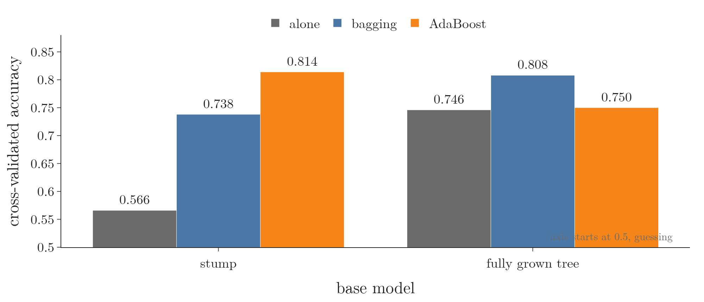
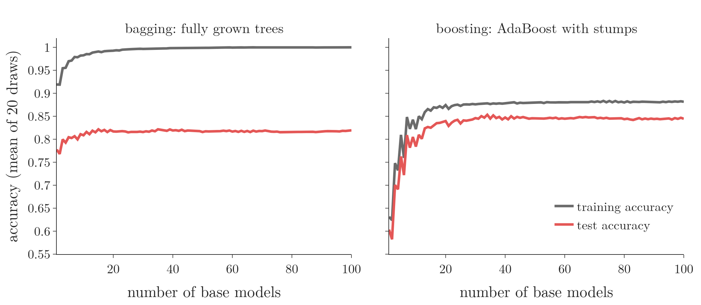
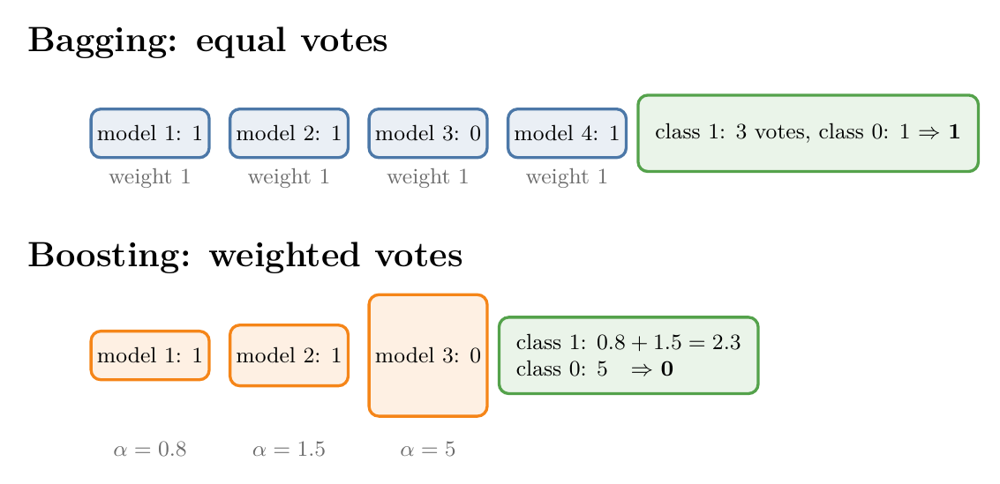

<!-- where-this-fits: generated by course_map/build_map.py; edit concepts.yaml, not this block -->
> **Where this fits:** Pipeline map step 8 (Model). See the [Course map](../../../00-course-map/00-course-map.md).
>
> 
>
> - **Builds on:** [Underfitting](../../../ML/01-foundations/ML-007-challenges-in-ml/ML-007-challenges-in-ml.md#7-overfitting-and-underfitting); [Ensemble learning](../../../ML/01-foundations/ML-009-mldlc/ML-009-mldlc.md#84-ensemble-learning); [Bias-variance trade-off](../../../ML/06-regression/ML-061-bias-variance/ML-061-bias-variance.md#1-overview).
> - **Leads to:** [Gradient boosting](../../../ML/08-trees-and-ensembles/ML-114-gradient-boosting-intuition/ML-114-gradient-boosting-intuition.md#13-gradient-boosting-compared-with-adaboost).
> - **Compare with:** [Bagging](../../../ML/08-trees-and-ensembles/ML-101-bagging-regressor/ML-101-bagging-regressor.md#4-baggingregressor-on-the-boston-housing-data); [Stacking and blending](../../../ML/08-trees-and-ensembles/ML-121-stacking-blending/ML-121-stacking-blending.md#2-from-voting-to-stacking).
<!-- /where-this-fits -->

## 1. Overview

> **Key point:** Bagging and boosting differ on three points: the kind of base model (low bias and high variance, against high bias and low variance; [bias and variance](../../06-regression/ML-061-bias-variance/ML-061-bias-variance.md#1-overview) are the two kinds of error a model can make), the way they learn (in parallel, against in sequence), and the weight of each base model in the vote (equal, against earned).

{height=40%}

On tables of data, tree ensembles (many decision trees whose answers are combined) built by bagging ([random forests](../ML-102-random-forest-intro/ML-102-random-forest-intro.md#1-overview)) and by boosting ([gradient boosting](../ML-114-gradient-boosting-intuition/ML-114-gradient-boosting-intuition.md#1-overview), [XGBoost](../ML-117-xgboost-intro/ML-117-xgboost-intro.md#1-overview)) are among the strongest models: a benchmark on 45 medium-sized datasets found them ahead of deep networks (Grinsztajn et al. 2022). "What is the difference between bagging and boosting?" is also a common interview question.

We have now seen both: [bagging](../ML-099-bagging-intuition/ML-099-bagging-intuition.md#2-the-core-idea) and random forests, and boosting through [AdaBoost](../ML-109-adaboost-intuition/ML-109-adaboost-intuition.md#1-overview). This Note puts them side by side on three points (Figure 1). The Notebook (`ML-113-bagging-vs-boosting.ipynb`) runs a small experiment on the first point.

## 2. Difference 1: the type of base model

> **Key point:** Bagging starts from low-bias, high-variance models and lowers their variance; boosting starts from high-bias, low-variance models and lowers their bias.

We want low bias and low variance, but a single model usually trades one for the other ([the bias-variance trade-off](../../06-regression/ML-061-bias-variance/ML-061-bias-variance.md#5-the-trade-off)). **Bagging** (G-251) takes **low-bias, high-variance** models (G-1132), such as fully grown trees or [KNN](../../07-classification/ML-085-knn/ML-085-knn.md#1-overview) (which predicts from the $k$ closest points) with a small $k$, and averages away much of their variance ([how bagging lowers variance](../ML-099-bagging-intuition/ML-099-bagging-intuition.md#32-how-bagging-lowers-variance)). Boosting attacks the trade-off from the opposite end.

### 2.1 Boosting: high bias, low variance models

> **Key point:** Boosting uses models that are too simple to fit the data well but are stable, such as shallow trees and decision stumps.

Boosting needs base models with **high bias and low variance**:

- a **shallow decision tree** (G-1785), whose depth is very small;
- above all the **decision stump** (G-559), a tree of depth 1 ([decision stumps](../ML-109-adaboost-intuition/ML-109-adaboost-intuition.md#22-decision-stumps)).

A stump is not good on the training data, but it hardly changes when the data changes. Adding many stumps in sequence, each fixing the last one's mistakes, lowers the bias step by step while the variance stays fairly low: on noisy data it creeps up only with very many stumps (average test accuracy 0.846 with 50 stumps, 0.837 with 1,500, in [the experiment on the number of stages](../ML-112-adaboost-hyperparameters/ML-112-adaboost-hyperparameters.md#3-nestimators-from-underfitting-to-overfitting)). ESL §15.2 states the same contrast: bagged trees improve only through lower variance, while boosting grows its trees adaptively to remove bias.

### 2.2 The rule of thumb

> **Key point:** A model that is very good on the training data but unstable calls for bagging; a model that is stable but weak calls for boosting.

| If the algorithm is... | it is... | so use |
|---|---|---|
| very good on the training data, unstable when the data changes | low bias, high variance | bagging |
| not so good on the training data, stable when the data changes | high bias, low variance | boosting |

The type of base model is the most important of the three differences.

> **Extra:** Swapping the base models shows why. On the noisy circles data of [the AdaBoost experiment](../ML-112-adaboost-hyperparameters/ML-112-adaboost-hyperparameters.md#3-nestimators-from-underfitting-to-overfitting) (two classes arranged as an inner disc and an outer ring, with some labels flipped at random), with 100 base models each and 10-fold cross-validation (G-510; the data is split into 10 parts, and each part in turn is the test set while the other nine train):
>
> | Base model | Alone | Bagging | AdaBoost |
> |---|---|---|---|
> | stump | 0.566 | 0.738 | **0.814** |
> | fully grown tree | 0.746 | **0.808** | 0.750 |
>
>
> {width=90%}
>
> Boosting helps stumps most, bagging helps full trees most. AdaBoost with full trees is no better than one tree: the first tree already classifies every training observation correctly, its error is 0, and boosting stops after that single tree, since no mistakes are left to pass on.

### 2.3 Watching the two errors move

> **Key point:** Bagging starts with a good training fit and gains on new data as models are added; boosting starts poor on both and climbs on both.

Figure 3 adds base models one at a time and tracks the accuracy on the training data and on test data, averaged over 20 fresh draws of the noisy circles (350 training and 150 test points each).

- **Bagging (left).** One fully grown tree already scores 0.92 on its training data: the bias is low from the start. The gap down to its test accuracy, 0.78, is the variance. Adding trees averages part of that variance away, and the test accuracy rises to 0.82.
- **Boosting (right).** One stump scores 0.63 on the training data and 0.60 on the test data: both are poor and close together, the mark of high bias and low variance. Each added stump lowers the bias, so both curves climb together, to 0.88 and 0.84 after 100 stumps.

{width=95%}

## 3. Difference 2: parallel against sequential learning

> **Key point:** Bagging trains all its models side by side, independently; boosting trains them one after another, each depending on the one before.

**Bagging is parallel** (**parallel learning**, G-1443; Figure 1, left). Bagging stands for bootstrap aggregation ([bootstrapping and aggregation](../ML-099-bagging-intuition/ML-099-bagging-intuition.md#21-bootstrapping)). From a dataset of, say, 1,000 **observations** (G-1374; records, one row of the data table each), each base model gets its own random sample of observations. No model needs anything from any other, so all of them can be trained at the same time.

**Boosting is sequential** (**sequential learning**, G-1775; Figure 1, right). The data goes to model 1, which does its job and passes its mistakes on to model 2. Model 2 does its job and passes its own mistakes to model 3, and so on. Model 2 cannot start before model 1 has finished, because it learns from model 1's mistakes.

Figure 4 runs both on the noisy circles of the Notebook, one base model per frame. Watch the marker sizes on the left. In bagging (top) each tree's sample is a fresh random draw: big and small markers land anywhere, whatever the earlier trees got wrong. In boosting (bottom) the weights pile up on the observations the stumps so far keep missing, near the border of the disc, so each stump depends on all the ones before it. The right panels show difference 1 as well: bagging's deep trees fit the training data at once (training accuracy 0.89 with one tree, 1.00 by 50), while boosting's stumps start weak (0.61) and climb stage by stage (0.85 after 100).

{height=60%}

> **Extra:** Parallel training has a practical side. Bagging can spread its models over every CPU core (`n_jobs=-1` in `BaggingClassifier` and `RandomForestClassifier`); `AdaBoostClassifier` has no `n_jobs`, because its stages must run one at a time.

## 4. Difference 3: the weight of each base model

> **Key point:** In bagging every base model's vote counts the same, like a democracy; in boosting each model's vote is weighted by how well it did.

When a new **query point** (G-1605) arrives, every trained base model gives its answer. The two methods combine those answers differently.

**Bagging: equal votes.** Suppose four models answer 1, 1, 0 and 1. Every vote has the same weight, like a democracy, so the **majority vote** (G-1146) wins: three say 1, the output is 1 (Figure 1, left: every weight is 1).

**Boosting: weighted votes.** Every model carries its own weight, its **alpha** (G-192; [the say of the stump](../ML-110-adaboost-step-by-step/ML-110-adaboost-step-by-step.md#6-step-4-the-say-of-the-stump-alpha)). With weights such as 0.8, 1.5 and 5, the model with weight 5 is listened to far more than the one with 0.8. A model that made fewer mistakes during training earns a larger say. Suppose those three models answer 1, 1 and 0: class 1 collects the weights of the two models that said 1:

$$0.8 + 1.5 = 2.3$$

Class 0 collects 5, so the output is 0, although two of the three models said 1 (Figure 5).

{width=85%}

## 5. Summary

| | Bagging | Boosting |
|---|---|---|
| Base models | low bias, high variance (fully grown trees, KNN with small k) | high bias, low variance (stumps, shallow trees) |
| Mainly reduces | variance | bias |
| Learning | parallel: models trained independently, at the same time | sequential: each model learns from the previous one's mistakes |
| Data each model sees | a random sample of the observations | all observations, reweighted toward earlier mistakes |
| Weight in the vote | equal (democracy) | each model's alpha, earned by its accuracy |
| Examples | bagging, random forest | AdaBoost, gradient boosting, XGBoost |

- Both aim at low bias and low variance, from opposite ends.
- Bagging averages unstable, accurate models; boosting adds up stable, weak ones.
- Bagging trains in parallel and votes equally; boosting trains in sequence and weights each vote.

## 6. Sources

**Built from**

- CampusX, "Bagging Vs Boosting | What is the difference between Bagging and Boosting", YouTube, https://www.youtube.com/watch?v=7M5oWXCpDEw

**Other references**

- Grinsztajn, L., Oyallon, E. and Varoquaux, G. (2022). Why do tree-based models still outperform deep learning on typical tabular data? *NeurIPS 2022, Datasets and Benchmarks Track*. arxiv.org/abs/2207.08815
- Hastie, T., Tibshirani, R. and Friedman, J. (2009). *The Elements of Statistical Learning* (ESL), 2nd ed. Springer. §15.2 (bagging reduces variance only; boosting removes bias).

## 7. Key terms

| Term | Meaning |
|---|---|
| Parallel learning | Training the base models independently, so they can all be trained at once (bagging) |
| Sequential learning | Training the base models one after another, each depending on the previous ones (boosting) |
| Shallow decision tree | A decision tree with a small maximum depth; high bias, low variance |
