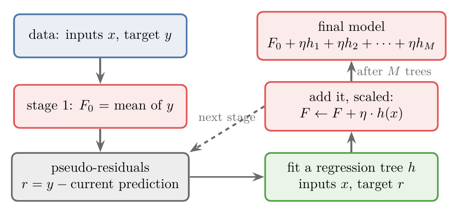
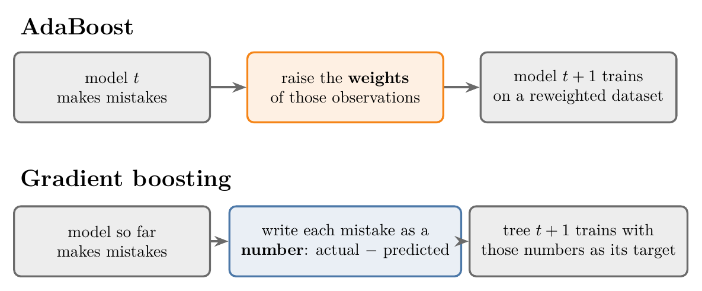
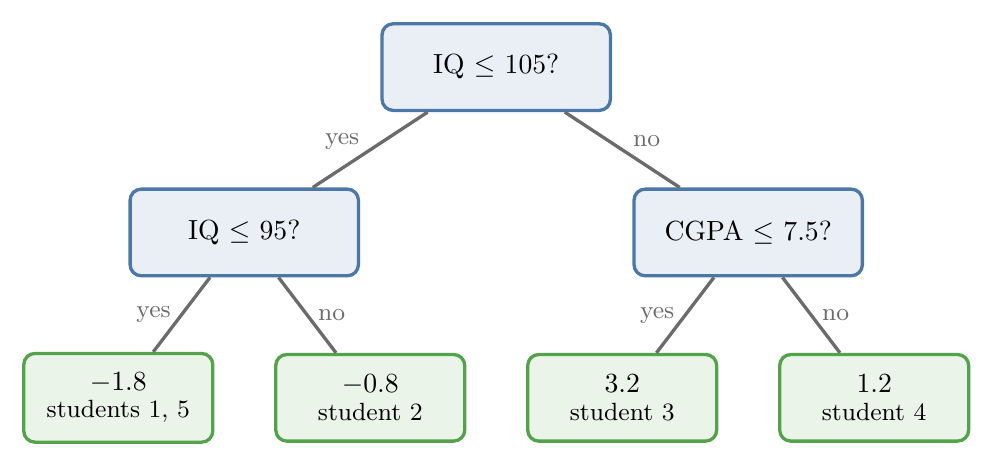
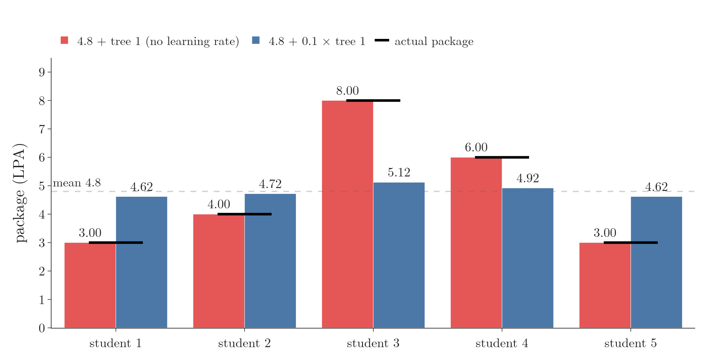
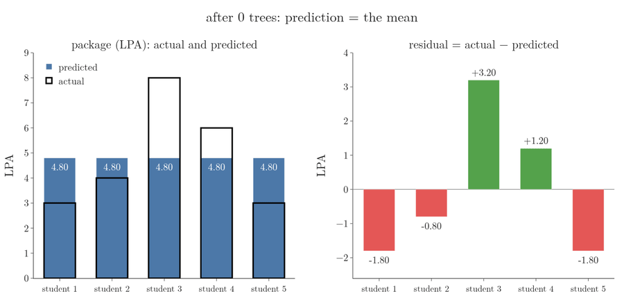
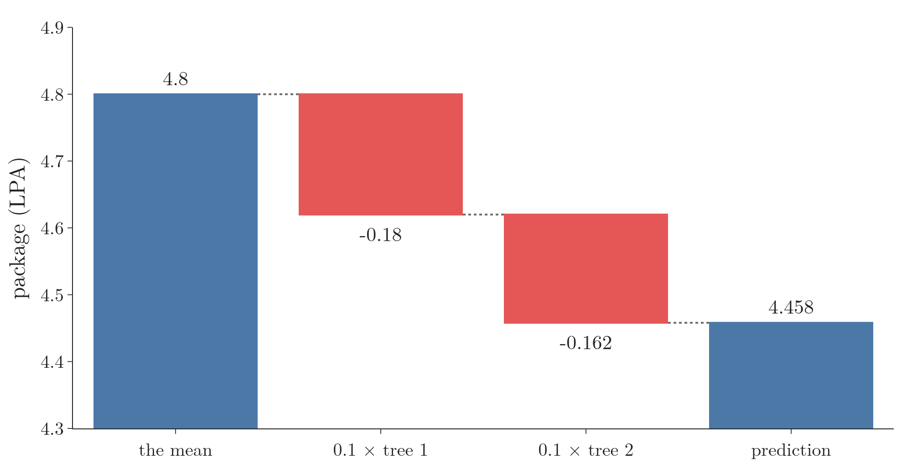
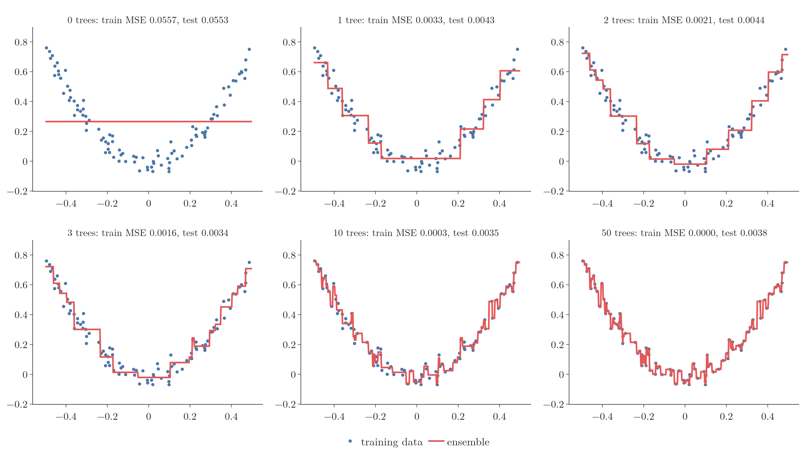
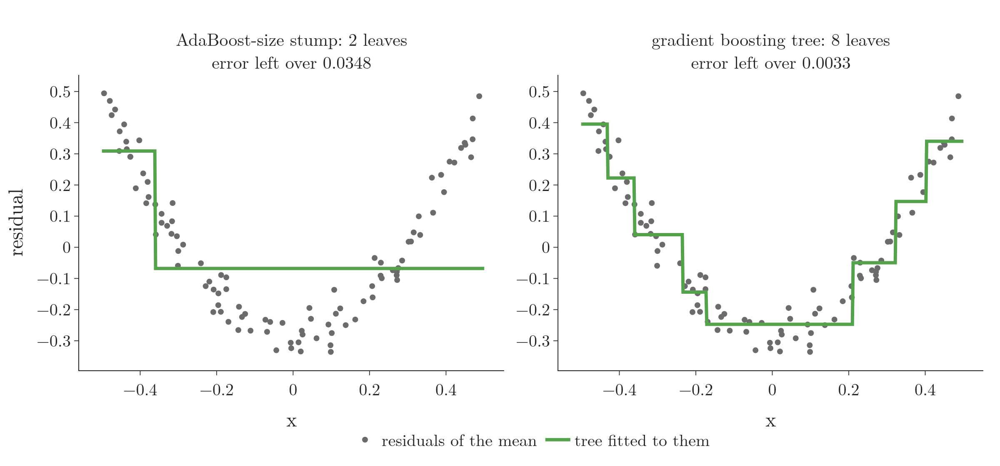

<!-- where-this-fits: generated by course_map/build_map.py; edit concepts.yaml, not this block -->
> **Where this fits:** Pipeline map step 8 (Model). See the [Course map](../../../00-course-map/00-course-map.md).
>
> 
>
> - **Builds on:** [Learning rate](../../../ML/01-foundations/ML-005-online-learning/ML-005-online-learning.md#5-the-learning-rate); [Gradient descent](../../../ML/06-regression/ML-056-gradient-descent/ML-056-gradient-descent.md#2-the-idea); [Log loss (binary cross entropy)](../../../MA/08-likelihood/MA-072-mle-in-machine-learning/MA-072-mle-in-machine-learning.md#4-a-bernoulli-target-gives-the-log-loss); [Sigmoid function](../../../ML/07-classification/ML-071-sigmoid-function/ML-071-sigmoid-function.md#4-the-sigmoid-function); [Regression trees](../../../ML/08-trees-and-ensembles/ML-093-regression-trees/ML-093-regression-trees.md#3-how-a-regression-tree-predicts); [Boosting](../../../ML/08-trees-and-ensembles/ML-109-adaboost-intuition/ML-109-adaboost-intuition.md#3-a-stage-wise-additive-model).
> - **Leads to:** [XGBoost](../../../ML/08-trees-and-ensembles/ML-120-xgboost-maths/ML-120-xgboost-maths.md#6-why-xgboost-approximates-the-loss).
> - **Compare with:** [AdaBoost](../../../ML/08-trees-and-ensembles/ML-109-adaboost-intuition/ML-109-adaboost-intuition.md#3-a-stage-wise-additive-model).
<!-- /where-this-fits -->

## 1. Overview

> **Key point:** Gradient boosting starts with the mean as its first guess. Then, again and again, it trains a small regression tree on the current mistakes (the residuals) and adds a small part of that tree to the model.

{height=36%}

**Gradient boosting** (G-859) is a boosting algorithm, like AdaBoost: it builds a strong model by adding many weak ones (here small trees) one at a time. Gradient boosting is one of the strongest algorithms for tables of data (Grinsztajn et al. 2022), and its optimised version, XGBoost, has won many Kaggle competitions: 17 of the 29 winning solutions on Kaggle's blog in 2015 used it (Chen and Guestrin 2016). Figure 1 shows the whole method for regression. The present Note:

- follows it by hand on five students (sections 3 to 10);
- watches it fit a curve (sections 11 and 12);
- compares it with AdaBoost (section 13).

The maths behind each step is in [additive modelling](../ML-115-gradient-boosting-regression-maths/ML-115-gradient-boosting-regression-maths.md#3-additive-modelling-a-complex-function-as-a-sum-of-simple-ones); classification is in [one algorithm, a different loss](../ML-116-gradient-boosting-classification/ML-116-gradient-boosting-classification.md#2-one-algorithm-a-different-loss).

## 2. Boosting passes mistakes forward

> **Key point:** Every boosting algorithm adds small models one at a time; each new model is told about the mistakes of the models before it. AdaBoost tells it through observation weights; gradient boosting tells it through the residuals.

Boosting (see [a stage-wise additive model](../ML-109-adaboost-intuition/ML-109-adaboost-intuition.md#3-a-stage-wise-additive-model)) builds a big model from small models, added one after another: a **stage-wise additive model** (G-1867). What makes it boosting is that each new model learns from the mistakes of the ones before.

Gradient boosting changes three things in **AdaBoost** (G-167):

- **The first model.** AdaBoost starts with a **decision stump** (G-559), a tree with one split. Gradient boosting starts with a single leaf: one number, predicted for every observation (section 4).
- **The size of the trees.** AdaBoost adds stumps. Gradient boosting adds trees that are larger than a stump but still limited in size, commonly 8 to 32 leaves.
- **How the trees are scaled.** AdaBoost gives each stump its own say. Gradient boosting multiplies every tree by the same number, the learning rate (section 8).

Section 13 returns to these differences with data. The fourth difference is the main one. The two algorithms pass on the mistakes in different ways:

- **AdaBoost** raises the weights of the observations it got wrong and draws a new dataset by weight, so the next stump focuses on those observations (see [update the observation weights](../ML-110-adaboost-step-by-step/ML-110-adaboost-step-by-step.md#7-step-5-update-the-observation-weights)).
- **Gradient boosting** writes the mistakes down as numbers, one per observation, and trains the next model to predict exactly those numbers.

Figure 2 puts the two side by side. Watch the middle box: the only difference is the form the mistakes take before the next model sees them.

{height=28%}

## 3. The toy data: five students

> **Key point:** Two features (IQ and CGPA), one numeric target (package in LPA): a regression problem.

Each student is an **observation** (G-1374) (one record, one row of the table). IQ and CGPA are the **features** (G-772), the input variables. LPA is the **target** (G-1949), the number we predict.

| Student | IQ | CGPA | LPA |
|---|---|---|---|
| 1 | 90 | 8 | 3 |
| 2 | 100 | 7 | 4 |
| 3 | 110 | 6 | 8 |
| 4 | 120 | 9 | 6 |
| 5 | 80 | 5 | 3 |

LPA is lakh rupees per annum. We build an ensemble of three models: model 1, then two decision trees. Real ensembles use many more; three are enough to see every step.

## 4. Stage 1: the mean

> **Key point:** For regression, the first model is not a tree at all: it is a single number, the mean of the target, predicted for every observation.

The first model ignores the features. Whatever the IQ and CGPA, model 1 predicts the same number: the mean of the target. In tree language model 1 is a single leaf.

1. **In words:** add up the target values and divide by the number of observations.
2. **Formula:**
   $$F_0 = \frac{1}{n}\sum_{i=1}^{n} y_i$$
3. **Example:**
   $$F_0 = \frac{3 + 4 + 8 + 6 + 3}{5} = \frac{24}{5} = 4.8$$

So model 1 says every student earns 4.8 LPA, even a student with CGPA 10 and IQ 120. We write $F_0$ for this first model, the **base prediction** (G-261), and store its answers in a new column, *pred1*: 4.8 in every observation. Why the mean is the right start is shown in [step 1: the best constant is the mean](../ML-115-gradient-boosting-regression-maths/ML-115-gradient-boosting-regression-maths.md#5-step-1-the-best-constant-is-the-mean).

## 5. Pseudo-residuals: the mistakes of the current model

> **Key point:** The mistake on each observation is actual minus predicted. Gradient boosting calls it the pseudo-residual.

To tell the next model about the mistakes, we need one number per observation that says how wrong we were. We use actual minus predicted, called the **pseudo-residual** (G-1589).

1. **In words:** for each observation, subtract the current prediction from the true target value.
2. **Formula:**
   $$r_i = y_i - F_0$$
3. **Example:** student 1 earns 3 and was predicted 4.8:
   $$r_1 = 3 - 4.8 = -1.8$$

| Student | LPA | pred1 | res1 |
|---|---|---|---|
| 1 | 3 | 4.8 | $-1.8$ |
| 2 | 4 | 4.8 | $-0.8$ |
| 3 | 8 | 4.8 | 3.2 |
| 4 | 6 | 4.8 | 1.2 |
| 5 | 3 | 4.8 | $-1.8$ |

A negative residual means we predicted too much; a positive one, too little. A residual of 0 would mean a perfect prediction. The name "residual" comes from linear regression (see [the best-fit line](../../06-regression/ML-049-simple-linear-regression/ML-049-simple-linear-regression.md#34-the-best-fit-line)); why gradient boosting adds \"pseudo\" is explained in [pseudo-residuals are negative gradients](../ML-115-gradient-boosting-regression-maths/ML-115-gradient-boosting-regression-maths.md#6-step-2a-pseudo-residuals-are-negative-gradients).

## 6. Stage 2: a tree that predicts the mistakes

> **Key point:** Model 2 is a regression tree with the same features, but its target is the residual column, not the package. Model 2 learns how wrong model 1 is for each kind of student.

Training on the mistakes is the central idea of gradient boosting. Model 2 is a **regression tree** (G-1654; see [regression trees](../ML-093-regression-trees/ML-093-regression-trees.md#1-overview)):

- **features:** IQ and CGPA, as before;
- **target:** *res1*, the mistakes of model 1, not the package.

We are not asking tree 1 "what is this student's package?" but "how far off is model 1 for this student?". The better it predicts the mistakes, the better we can correct them.

{height=30%}

Figure 3 shows the tree scikit-learn grows on this data. Student 1 (IQ 90) goes left at "IQ $\le$ 105" and left again at "IQ $\le$ 95", reaching the leaf $-1.8$: exactly student 1's residual. With only five observations, every student gets a leaf of their own (students 1 and 5 share one, and their residuals are equal), so the tree's predictions *pred* on the training observations equal the residuals exactly.

Trees are the usual choice for these later models, and Friedman's original method is built around them (Friedman 2001), although any regression model could be used.

## 7. Adding the models together

> **Key point:** The ensemble's prediction is model 1's output plus model 2's output. Without anything else, this reproduces the training data exactly, which is overfitting.

To predict, we add the outputs of the models.

1. **In words:** start from the mean and add the tree's correction.
2. **Formula:**
   $$F_1(x) = F_0 + h_1(x)$$
   where $h_1$ is tree 1.
3. **Example:** student 1 (IQ 90, CGPA 8) gets 4.8 from model 1 and $-1.8$ from tree 1:
   $$F_1 = 4.8 + (-1.8) = 3.0$$
   which is exactly the package of 3 LPA.

Student 2 gets the prediction below, again exact:

$$4.8 - 0.8 = 4$$

Every training observation is now predicted perfectly, and that is a warning sign: the model has memorised these five students. A new student, not in the data, will probably be predicted badly. Memorising the training data is **overfitting** (G-1429; see [overfitting and bias-variance](../../06-regression/ML-061-bias-variance/ML-061-bias-variance.md#4-seeing-bias-and-variance)).

## 8. The learning rate: small steps in the right direction

> **Key point:** We add only a fraction of each tree, the learning rate (typically 0.1). Each step is smaller, but it still points the right way; many small steps overfit less than one big jump.

The fix is to add only part of each tree's correction. That part is the **learning rate** (G-1067) $\eta$ (eta), a number between 0 and 1, typically 0.1. With no learning rate, the multiplier is 1.

1. **In words:** multiply the tree's output by the learning rate before adding it.
2. **Formula:**
   $$F_1(x) = F_0 + \eta \thinspace h_1(x)$$
3. **Example:** student 1 with $\eta = 0.1$:
   $$F_1 = 4.8 + 0.1 \times (-1.8)$$
   $$F_1 = 4.8 - 0.18 = 4.62$$

The answer, 4.62, is still far from 3, but it moved the right way. More trees will bring it closer, one small step at a time. The same idea, shrinking every model's contribution so that learning slows down and overfitting slows down even more, was called **shrinkage** (G-1796) in [what the learning rate does](../ML-112-adaboost-hyperparameters/ML-112-adaboost-hyperparameters.md#41-what-the-learning-rate-does).

Figure 4 compares the two choices for all five students. Watch the red bars: they land exactly on every actual package, which is memorising. The blue bars all move a tenth of the way from the mean 4.8 towards their targets.

{height=36%}

The learning rate is the same for every tree after the first model: with $\eta = 0.1$, tree 1, tree 2 and every later tree are all multiplied by 0.1.

## 9. Stage 3: the residuals of the combined model

> **Key point:** The next tree is trained on the residuals of everything so far; with each stage the residuals move towards 0.

Before adding model 3, we measure how wrong the combined model of stage 2 is.

1. **In words:** actual minus the prediction of model 1 plus the scaled tree 1.
2. **Formula:**
   $$r_i^{(2)} = y_i - \big(F_0 + \eta\thinspace h_1(x_i)\big)$$
3. **Example:** student 1:
   $$r_1^{(2)} = 3 - \big(4.8 + 0.1 \times (-1.8)\big)$$
   $$r_1^{(2)} = 3 - 4.62 = -1.62$$

| Student | LPA | res1 | pred2 | res2 | pred3 | res3 |
|---|---|---|---|---|---|---|
| 1 | 3 | $-1.8$ | 4.62 | $-1.62$ | 4.458 | $-1.458$ |
| 2 | 4 | $-0.8$ | 4.72 | $-0.72$ | 4.648 | $-0.648$ |
| 3 | 8 | 3.2 | 5.12 | 2.88 | 5.408 | 2.592 |
| 4 | 6 | 1.2 | 4.92 | 1.08 | 5.028 | 0.972 |
| 5 | 3 | $-1.8$ | 4.62 | $-1.62$ | 4.458 | $-1.458$ |

Every residual moved towards 0: $-1.8$ became $-1.62$, $3.2$ became $2.88$. A residual of 0 means no gap between actual and predicted, so the goal is to keep adding models until the residuals are close to 0.

Figure 5 keeps going past the table. Watch the residual bars on the right: each tree removes a tenth of what is left, so they shrink by the same share at every stage. After 50 trees every residual is within 0.02 of 0, and the blue bars fill the outlines of the actual packages.

{height=45%}

Model 3 is again a regression tree: features IQ and CGPA, target *res2*. Model 3 predicts the mistakes of models 1 and 2 together. On this tiny dataset model 3 splits like tree 1, with leaves $-1.62$, $-0.72$, $2.88$ and $1.08$. Adding $0.1$ times its output gives *pred3*, and *res3* is smaller again.

## 10. Predicting for a new student

> **Key point:** Send the new observation through every tree, multiply each tree's output by the learning rate, and add everything to the mean.

1. **In words:** the mean, plus the learning rate times each tree's output.
2. **Formula:**
   $$\hat{y} = F_0 + \eta\thinspace h_1(x) + \eta\thinspace h_2(x)$$
   $$+ \dots + \eta\thinspace h_M(x)$$
   where $M$ is the number of trees.
3. **Example:** a new student with IQ 60 and CGPA 4.9 lands in the leaf "IQ $\le$ 95" of both trees, with outputs $-1.8$ and $-1.62$:
   $$\hat{y} = 4.8 + 0.1 \times (-1.8) + 0.1 \times (-1.62)$$
   $$\hat{y} = 4.8 - 0.18 - 0.162 = 4.458$$

So the model predicts about 4.46 LPA. With five observations and two trees the answer is rough; with real data and hundreds of trees, the same procedure gives very good predictions.

Figure 6 builds the sum step by step; watch each tree pull the answer down a little from the mean.

{height=34%}


## 11. Watching it fit a curve

> **Key point:** On 100 points along a curve, the mean is a flat line; each tree bends the model towards the data, and after many trees the model starts chasing the noise.

The same steps on a bigger dataset show what each stage does. We take 100 points with one feature $x$ between $-0.5$ and 0.5 and the target $y = 3x^2$ plus a little random noise (normal, with standard deviation 0.05): a U-shaped, non-linear relationship. Each tree has at most 8 leaves.


Figure 7 runs three stages, with learning rate 0.5:

1. **Stage 1:** the model is the mean of $y$, 0.265: a flat red line.
2. **Residuals:** the grey sticks are the residuals; the lower panel shows them as points.
3. **Tree:** a tree with 8 leaves fits those residuals: the green steps.
4. **Update:** half of the green steps is added to the red line, which bends towards the data. The residuals shrink, and the next tree has less to fix.

{height=46%}

Figure 8 continues further, with learning rate 1. One tree already captures the U shape, and the training error falls from 0.0557 to 0.0033. After 10 trees the red line already zigzags between the training points (training error 0.0003), and after 50 trees it passes through every one of them (training error 0). The test error rises: averaged over 20 fresh datasets of the same kind, each tested on 5,000 new points, from 0.00450 after 3 trees to 0.00506 after 50 (Figure 8's titles show the single dataset drawn). Rising test error with falling training error is overfitting again, this time from too many trees.

> **Python:** The whole loop is a few lines.
>
> ```python
> from sklearn.tree import DecisionTreeRegressor
>
> pred = np.full(len(y), y.mean())        # stage 1: the mean
> trees = []
> for _ in range(n_trees):
>     residual = y - pred                 # actual minus predicted
>     tree = DecisionTreeRegressor(max_leaf_nodes=8)
>     tree.fit(X, residual)               # target: the residuals
>     pred = pred + lr * tree.predict(X)  # small step
>     trees.append(tree)
> ```
>
> Each tree is limited to 8 leaves by `max_leaf_nodes=8`. scikit-learn's `GradientBoostingRegressor(loss="squared_error", learning_rate=lr, max_leaf_nodes=8, max_depth=None)` gives the same predictions to 15 decimals; the Notebook checks this. (`max_depth=None` matters: its default `max_depth=3` would limit the trees as well.)

## 12. Learning rate against number of trees

> **Key point:** As in AdaBoost, a smaller learning rate needs more trees but reaches a lower test error and overfits more slowly.

The trade-off is the one of [the trade-off with n_estimators](../ML-112-adaboost-hyperparameters/ML-112-adaboost-hyperparameters.md#43-the-trade-off-with-n_estimators), so the two are tuned together. On the curve, with 8 leaves per tree, averaged over 20 fresh datasets with 5,000 test points each:

| Learning rate | Lowest test error | Reached after | Test error after 200 trees |
|---|---|---|---|
| 1.0 | 0.00448 | 4 trees | 0.00506 |
| 0.5 | 0.00364 | 6 trees | 0.00506 |
| 0.1 | **0.00350** | 35 trees | 0.00463 |

With learning rate 1 the training error reaches 0 after about 50 trees, while the test error climbs back up. Learning rate 0.1 needs more trees, but its best test error is the lowest of the three, and after 200 trees it has climbed the least. ESL §10.12.1 reports the same: smaller learning rates give better test error and need more trees. (The noise in $y$ alone gives a test error of $0.05^2 = 0.0025$, the floor no model can beat.)

Figure 9 runs the three learning rates side by side. Watch the stars in the lower panel: learning rate 1 reaches its lowest test error first (4 trees) but the highest; learning rate 0.1 takes 35 trees to get there and lands lowest, and its curve climbs back the slowest. In the upper panels, learning rates 1 and 0.5 zigzag through the noise after 50 trees, while 0.1 still follows the U shape with far fewer jumps.

{height=55%}

The Notebook's playground (`app.py`, a Dash app) lets us change the number of trees, the learning rate and the leaves per tree, and watch the curve and both errors change.

<!-- playground: images/gradient_boosting_playground.html -->

## 13. Gradient boosting compared with AdaBoost

> **Key point:** Gradient boosting uses bigger trees than AdaBoost's stumps, and one learning rate for every tree instead of a separate say for each model.

| | AdaBoost | Gradient boosting |
|---|---|---|
| Base models | decision stumps (depth 1, 2 leaves) | trees with more leaves, commonly 8 to 32 |
| How mistakes are passed on | larger weights for misclassified observations | the next tree's target is the residuals |
| How models are combined | each model gets its own say $\alpha$ | every tree is multiplied by the same learning rate |
| First model | a stump | the mean of the target (regression) |

Figure 10 shows why stumps are too small, on the first residuals of the curve data. Watch the left panel: one split cannot follow the U shape, while the 8-leaf tree on the right removes most of the error in one stage (0.0033 left, against 0.0348).

{height=36%}

The leaf count depends on the data: about 8 leaves for small datasets, up to about 32 for big ones. Stumps are rarely enough: a tree with 2 leaves cannot capture any interaction between features, so boosted stumps suit only data where each feature acts on its own (ESL §10.11).

> **Extra:** Trees with 4 to 8 leaves work well in most cases (ESL §10.11); scikit-learn's default, `max_depth=3`, allows at most 8. Like the learning rate, the tree size is a hyperparameter, best set by cross-validation.

## 14. Summary

| Step | What we do | Toy example | Why |
|---|---|---|---|
| Stage 1 | predict the mean of $y$ for everyone | 4.8 | the best single guess before any tree ([why the mean](../ML-115-gradient-boosting-regression-maths/ML-115-gradient-boosting-regression-maths.md#5-step-1-the-best-constant-is-the-mean)) |
| Residuals | actual minus predicted | $-1.8$, $-0.8$, 3.2, 1.2, $-1.8$ | one number per student saying how wrong the model is, and in which direction |
| Tree | regression tree, features $x$, target the residuals | leaves $-1.8$, $-0.8$, 3.2, 1.2 | it learns how wrong the model is for each kind of student |
| Update | add learning rate $\times$ tree | $4.8 + 0.1 \times (-1.8) = 4.62$ | a small step the right way; adding the whole tree memorises the data |
| Repeat | new residuals, new tree | $-1.8 \rightarrow -1.62 \rightarrow -1.458$ | each stage moves the residuals towards 0 |
| Predict | mean + $\eta \times$ (sum of tree outputs) | new student: 4.458 | a new student gets every tree's correction, scaled as in training |

- Gradient boosting is a stage-wise additive model: each new tree predicts the mistakes of the ensemble so far, so each tree only has to learn what is still wrong.
- For regression the first model is the mean of the target, and the mistakes are the pseudo-residuals, actual minus predicted, so a negative residual means the model predicted too much and a positive one too little.
- Adding whole trees overfits; the learning rate adds only a fraction of each, and many small steps generalise better.
- Too many trees overfit as well, so the number of trees and the learning rate are tuned together.
- Unlike AdaBoost: bigger trees (commonly 8 to 32 leaves), because a stump's single split cannot follow a curve or capture any interaction between features; and the same learning rate for every tree.
- So gradient boosting answers its task in one loop: start from the mean, then keep adding a small part of a tree trained on the current mistakes.

## 15. Sources

**Built from**

- CampusX, "Gradient Boosting Explained | How Gradient Boosting Works?", YouTube, https://www.youtube.com/watch?v=fbKz7N92mhQ
- StatQuest with Josh Starmer, "Gradient Boost Part 1 (of 4): Regression Main Ideas", YouTube, https://www.youtube.com/watch?v=3CC4N4z3GJc (the opening comparison with AdaBoost, section 2)

**Other references**

- Chen, T. and Guestrin, C. (2016). XGBoost: A Scalable Tree Boosting System. *Proceedings of KDD 2016*, Section 1. arxiv.org/abs/1603.02754
- Friedman, J. H. (2001). Greedy function approximation: a gradient boosting machine. *Annals of Statistics*, 29(5), 1189–1232. (Gradient boosting with regression trees, "TreeBoost".)
- Grinsztajn, L., Oyallon, E. and Varoquaux, G. (2022). Why do tree-based models still outperform deep learning on typical tabular data? *NeurIPS 2022, Datasets and Benchmarks Track*. arxiv.org/abs/2207.08815
- Hastie, T., Tibshirani, R. and Friedman, J. (2009). *The Elements of Statistical Learning* (ESL), 2nd ed., Springer. §10.11 "Right-sized trees for boosting" (4 to 8 leaves; stumps allow no interactions); §10.12.1 "Shrinkage".

## 16. Key terms

| Term | Meaning |
|---|---|
| Gradient boosting | A way to build a model from many trees added one by one: it starts from a simple guess, and each new tree is trained on the mistakes (pseudo-residuals) of the ensemble so far (a boosting algorithm). |
| Pseudo-residual | The mistake on one observation that the next tree learns; for squared error it is actual minus predicted |
| Base prediction ($F_0$) | The first model of gradient boosting; for regression, the mean of the target |
| Learning rate ($\eta$) in gradient boosting | The fraction of each tree's output that is added to the model, the same for every tree; typically 0.1 |
