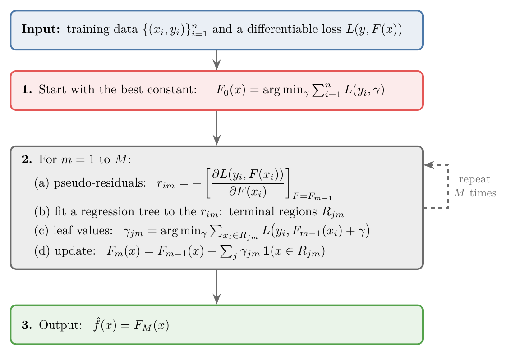
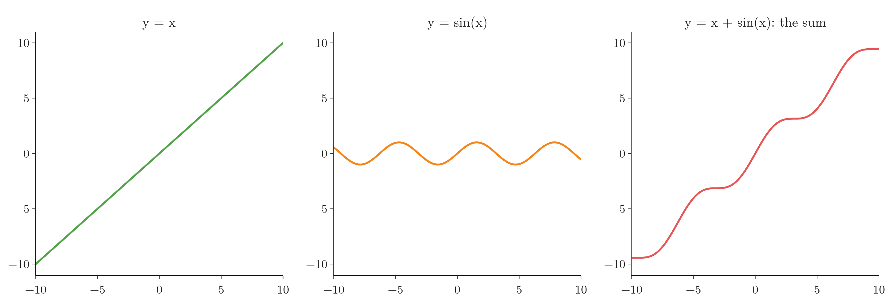
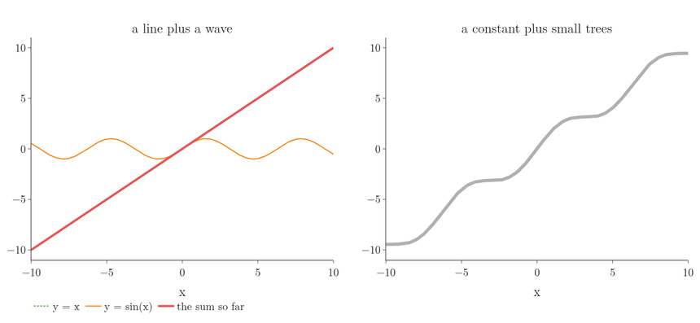
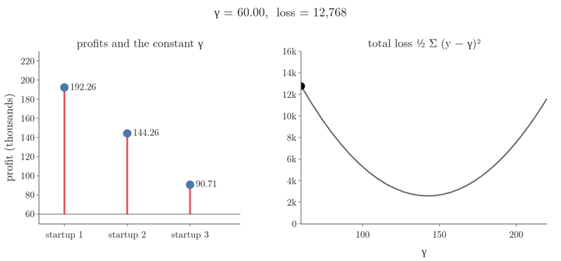
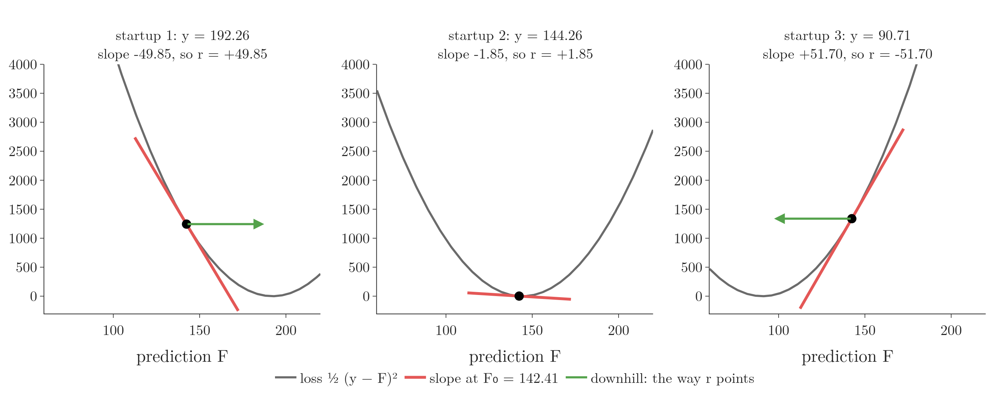
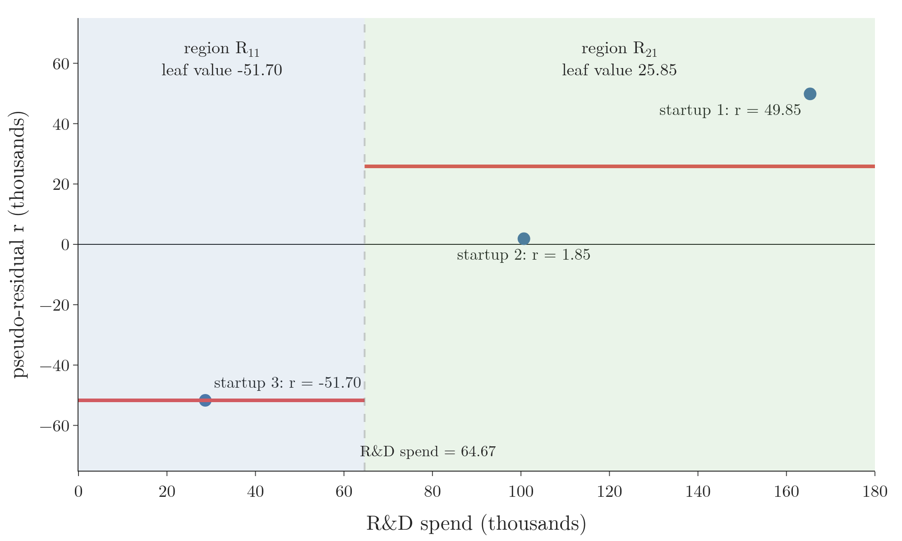
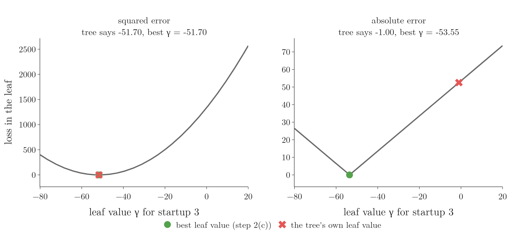
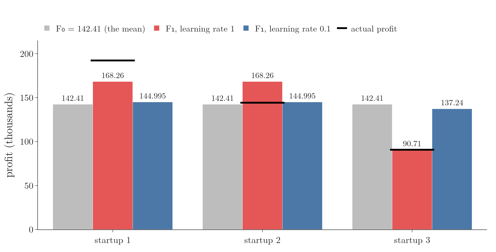
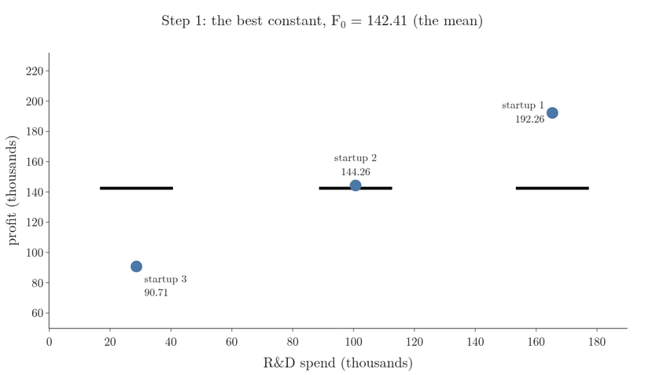

<!-- where-this-fits: generated by course_map/build_map.py; edit concepts.yaml, not this block -->
> **Where this fits:** Pipeline map step 8 (Model). See the [Course map](../../../00-course-map/00-course-map.md).
>
> 
>
> - **Builds on:** [Gradient descent](../../../ML/06-regression/ML-056-gradient-descent/ML-056-gradient-descent.md#7-gradient-descent-as-a-class); [Learning rate](../../../ML/06-regression/ML-056-gradient-descent/ML-056-gradient-descent.md#5-the-learning-rate); [Sigmoid function](../../../ML/07-classification/ML-071-sigmoid-function/ML-071-sigmoid-function.md#4-the-sigmoid-function); [Log loss (binary cross entropy)](../../../ML/07-classification/ML-072-log-loss/ML-072-log-loss.md#62-the-loss-function); [Regression trees](../../../ML/08-trees-and-ensembles/ML-093-regression-trees/ML-093-regression-trees.md#3-how-a-regression-tree-predicts); [Boosting](../../../ML/08-trees-and-ensembles/ML-095-ensemble-learning/ML-095-ensemble-learning.md#44-boosting).
> - **Leads to:** [XGBoost](../../../ML/08-trees-and-ensembles/ML-117-xgboost-intro/ML-117-xgboost-intro.md#3-what-xgboost-is).
> - **Compare with:** [AdaBoost](../../../ML/08-trees-and-ensembles/ML-112-adaboost-hyperparameters/ML-112-adaboost-hyperparameters.md#2-the-hyperparameters-of-adaboostclassifier).
<!-- /where-this-fits -->

## 1. Overview

> **Key point:** Gradient boosting is one algorithm with three steps: start from the best constant, then repeatedly compute pseudo-residuals, fit a tree to them and give each leaf its best value, and finally output the sum.

{height=46%}

[Boosting passes mistakes forward](../ML-114-gradient-boosting-intuition/ML-114-gradient-boosting-intuition.md#2-boosting-passes-mistakes-forward) ran gradient boosting by hand: the mean, residuals (actual minus predicted), trees on the residuals, a learning rate. Figure 1 is the same procedure written as the formal algorithm from the textbook *The Elements of Statistical Learning*. The present Note explains every line of it and runs each step on three startups.

The same algorithm also solves classification; only the loss function changes (see [one algorithm, a different loss](../ML-116-gradient-boosting-classification/ML-116-gradient-boosting-classification.md#2-one-algorithm-a-different-loss)). Before the steps, we need one idea that all boosting algorithms share: additive modelling.

## 2. A model is a function

> **Key point:** Every ML model is a function $y = f(x)$ that maps the features to the target.

Whatever the algorithm, an ML model learns a mathematical relationship between the **features** (G-772) (the input variables, one column of the data table each) and the **target** (G-1949) (the output we predict). With one feature $x$ (say CGPA) and a target $y$ (say package), the model is a function $y = f(x)$. With several features, it is $y = f(x_1, x_2, x_3)$. Each **observation** (G-1374) (one record, one row of the table) gives one pair of $x$ and $y$.

Linear regression learns a straight line ([a line through the data](../../06-regression/ML-049-simple-linear-regression/ML-049-simple-linear-regression.md#3-a-line-through-the-data)): a very simple function. A **regression tree** (G-1654) is also a function, made of if-else rules whose leaves predict the mean of the targets that reach them ([how a regression tree predicts](../ML-093-regression-trees/ML-093-regression-trees.md#3-how-a-regression-tree-predicts)). Learning means finding the function that matches the data.

## 3. Additive modelling: a complex function as a sum of simple ones

> **Key point:** When the true function is too complex for a line or a polynomial, we build it as a sum of simple functions, added one at a time. Boosting does exactly this, with trees as the simple functions.

### 3.1 When lines and polynomials are not enough

> **Key point:** A line misses curved data; high-degree polynomials swing wildly at the edges.

Some data follows a pattern that wiggles as it rises. A straight line cannot follow it. Polynomial regression ([adding powers as new features](../../06-regression/ML-060-polynomial-regression/ML-060-polynomial-regression.md#3-adding-powers-as-new-features)) can bend, but a high degree makes the curve shoot up or down at the edges of the data (**Runge's phenomenon**, G-1716), which lowers the test $R^2$ (the share of the variation in the targets that the model explains, see [the R² score](../../06-regression/ML-051-regression-metrics/ML-051-regression-metrics.md#6-r²-score)).

### 3.2 Break the function into parts

> **Key point:** $y = x + \sin x$ is hard to guess as a whole, but easy as the sum of a line and a wave.

{height=26%}

Figure 2 shows such a function: it rises like a line and wiggles like a wave. The function is in fact the sum of two simple functions, $y = x$ and $y = \sin x$. If we did not know this, we could still approach it step by step: first catch the rising trend, then catch the wiggle that is left over, and add the two.

Catching the parts one by one and adding them is **additive modelling** (G-174): we approximate a complex function by adding simple functions, each one capturing part of what the others missed. A painter works the same way: first the rough outline, then the shading, then the fine details, each pass adding what the earlier ones left out.

$$F(x) = f_0(x) + f_1(x) + f_2(x) + \dots + f_M(x)$$

### 3.3 Boosting is stage-wise additive modelling

> **Key point:** In boosting, each added function is a model (a tree), and they are added in stages, one after another.

All boosting algorithms build this kind of sum. [A stage-wise additive model](../ML-109-adaboost-intuition/ML-109-adaboost-intuition.md#3-a-stage-wise-additive-model) (G-1867): "additive" because the final model is a sum, "stage-wise" because the parts are added one per stage.

Figure 3 shows both sums being built. Watch the left panel first: the red curve starts as the line $y = x$, and the wave is added bit by bit until the sum is $y = x + \sin x$. Then watch the right panel: a boosted model builds the same curve from a constant plus small trees with 4 leaves each. One tree gives a rough staircase (squared error 9.96); after 5 trees the error is 0.27, and after 60 trees the staircase lies on the curve.

{height=40%}

In gradient boosting, $f_0$ is a constant and every later $f_m$ is a regression tree, which is also a function. Each new tree moves the sum closer to the training data, so the training error never rises from one stage to the next: section 8 picks each leaf value to make the loss as small as possible, and a leaf value of 0 (no change) is always one of the options.

## 4. The ingredients: training data and a differentiable loss

> **Key point:** The algorithm needs two ingredients: the training observations $(x_i, y_i)$, and a loss function $L(y, F(x))$ that we can differentiate.

### 4.1 Three startups

> **Key point:** Three observations, three features (spending), one target (profit): $n = 3$.

We use three observations of the 50 Startups data, a regression dataset of US companies (amounts in thousands):

| Startup | R&D spend | Administration | Marketing | Profit |
|---|---|---|---|---|
| 1 | 165.35 | 136.90 | 471.78 | 192.26 |
| 2 | 100.67 | 91.79 | 249.74 | 144.26 |
| 3 | 28.66 | 127.06 | 201.13 | 90.71 |

The notation $\lbrace(x_i, y_i)\rbrace_{i=1}^{n}$ in Figure 1 simply means this table. Here $n = 3$; $x_1$ is the first startup's three spends together, and $y_1 = 192.26$ is its profit.

### 4.2 The loss function

> **Key point:** We use half the squared error:
>
> $$L = \frac{1}{2}(y - F(x))^2$$
>
> Any loss works, as long as it can be differentiated.

A **loss function** (G-706) measures how wrong a prediction is (see [mean squared error](../../06-regression/ML-051-regression-metrics/ML-051-regression-metrics.md#3-mean-squared-error-mse)). In Figure 1 it is written $L(y, F(x))$, where $F(x)$ is the model's output, $\hat{y}$. Gradient boosting accepts any **differentiable loss** (G-605), one we can differentiate at every point; this flexibility is one of its strengths (Friedman 2001).

For regression we take the squared error with a factor of one half.

1. **In words:** half of the squared difference between the true value and the prediction.
2. **Formula:**
   $$L\big(y_i, F(x_i)\big) = \frac{1}{2}\big(y_i - F(x_i)\big)^2$$
3. **Example:** startup 1 with a prediction of 142.41:
   $$L = \frac{1}{2}(192.26 - 142.41)^2$$
   $$= \frac{1}{2} \times 2485.02$$
   $$= 1242.51$$

The $\frac{1}{2}$ is for convenience: when we differentiate, the 2 from the square cancels it. The factor does not change which model is best. If line 1 has squared error 10 and line 2 has 20, halving gives 5 and 10, and line 1 is still the better one.

## 5. Step 1: the best constant is the mean

> **Key point:** $F_0$ is the single number $\gamma$ that makes the total loss smallest. For half the squared error, setting the derivative to zero gives the mean of $y$.

Step 1 finds the first function, $F_0$. $F_0$ does not depend on $x$: it is one number for every observation, a leaf on its own.

1. **In words:** choose the constant $\gamma$ (gamma) that makes the sum of the losses over all observations as small as possible. The symbol $\arg\min_\gamma$ means "the value of $\gamma$ that minimises"; the symbol is read **arg min** (G-211).
2. **Formula:**
   $$F_0 = \arg\min_{\gamma} \sum_{i=1}^{n} \frac{1}{2}\thinspace(y_i - \gamma)^2$$
   Here $\sum_{i=1}^{n}$ means "add the term for observation 1, 2, up to $n$".
3. **Example:** for our three startups we need the $\gamma$ that minimises the total loss:
   $$\frac{1}{2}(192.26 - \gamma)^2$$
   $$+ \frac{1}{2}(144.26 - \gamma)^2$$
   $$+ \frac{1}{2}(90.71 - \gamma)^2$$
   The derivation below gives $\gamma = 142.41$.

To find the minimum, we differentiate with respect to $\gamma$ and set the result to zero, as for linear regression ([finding the minimum](../../06-regression/ML-050-linear-regression-maths/ML-050-linear-regression-maths.md#4-finding-the-minimum)), where the **derivative** (G-595) is the slope of a curve. By the chain rule, the 2 from the square cancels the $\frac{1}{2}$, and the inner derivative of $(y_i - \gamma)$ is $-1$:

$$\frac{d}{d\gamma} \sum_{i=1}^{n} \frac{1}{2}(y_i - \gamma)^2$$

$$= -\sum_{i=1}^{n} (y_i - \gamma)$$

Setting the derivative to zero:

$$-\sum_{i=1}^{n} (y_i - \gamma) = 0$$

Multiplying by $-1$ and writing out the sum for $n = 3$:

$$(\gamma - 192.26) + (\gamma - 144.26) + (\gamma - 90.71) = 0$$

$$\Rightarrow 3\gamma = 427.23$$

$$\Rightarrow \gamma = 142.41$$

The answer, 142.41, is the mean of the profits. So, with the squared-error loss, the first model is always the mean of the target, as [the first stage of the worked example](../ML-114-gradient-boosting-intuition/ML-114-gradient-boosting-intuition.md#4-stage-1-the-mean) claimed. With another loss, step 1 gives another constant.

Figure 4 slides $\gamma$ across the three profits. Watch the red gaps on the left and the dot on the right: moving $\gamma$ up shrinks one gap and stretches the others, and the total loss is smallest (2,581) at $\gamma = 142.41$, where the gaps above and below balance.

{height=40%}

## 6. Step 2(a): pseudo-residuals are negative gradients

> **Key point:** For every observation, the pseudo-residual is minus the derivative of the loss with respect to the current prediction. For half the squared error, that is exactly actual minus predicted.

Step 2 is a loop that runs $M$ times, once per tree. With $M = 50$ we get 50 trees, $f_1$ to $f_{50}$. Inside the loop, the index $m$ is the tree we are building and $i$ is the observation.

1. **In words:** differentiate the loss with respect to the prediction $F(x_i)$, plug in the current model $F_{m-1}$, and flip the sign. The symbol $\partial L / \partial F$ (a **partial derivative**) is the slope of the loss $L$ when only the prediction $F$ is nudged and everything else is held fixed. For one startup with $y = 192.26$ and a prediction $F = 142.41$, the loss is:
   $$L = \frac{1}{2}(192.26 - F)^2$$
   Its slope at that prediction is:
   $$\frac{\partial L}{\partial F} = -(192.26 - 142.41) = -49.85$$
   So the pseudo-residual (minus the slope) is $+49.85$.
2. **Formula:**
   $$r_{im} = -\left[\frac{\partial L\big(y_i, F(x_i)\big)}{\partial F(x_i)}\right] _{F = F_{m-1}}$$
   For half the squared error, the chain rule gives:
   $$\frac{\partial L}{\partial F(x_i)} = -(y_i - F(x_i))$$
   So:
   $$r_{im} = y_i - F_{m-1}(x_i)$$
3. **Example:** for the first tree ($m = 1$) the current model is $F_0 = 142.41$:
   $$r_{11} = 192.26 - 142.41 = 49.85$$
   $$r_{21} = 144.26 - 142.41 = 1.85$$
   $$r_{31} = 90.71 - 142.41 = -51.70$$

The derivative of the loss is its **gradient** (G-863), the same quantity gradient descent follows (see [which way to move](../../06-regression/ML-056-gradient-descent/ML-056-gradient-descent.md#21-which-way-to-move)). Minus the gradient, the **negative gradient** (G-1308), points in the direction that lowers the loss fastest. For the squared error it happens to equal the ordinary residual, actual minus predicted; for other losses it does not, which is why it is called a **pseudo-residual** (G-1589).

Figure 5 draws this for each startup. Watch the sign: where the loss slopes down (startup 1) the residual is positive and the green arrow says "predict more"; where it slopes up (startup 3) the residual is negative; startup 2 sits almost at the bottom, so its residual is almost 0.

{height=36%}

> **Extra:** The negative gradient is where "gradient" in gradient boosting comes from. Gradient descent changes a parameter by a small step against the gradient. Gradient boosting changes the *predictions* by a small step against the gradient: each tree learns the negative gradient, and adding it (times the learning rate) is one step of gradient descent on the predictions. Friedman calls this gradient descent in function space (Friedman 2001).

## 7. Step 2(b): fit a tree; it creates terminal regions

> **Key point:** A regression tree is trained with the features as $x$ and the pseudo-residuals as the target. Its leaves cut the feature space into terminal regions $R_{jm}$.

Next we train a regression tree: the three spends are the features, the column $r_{i1}$ is the target. With only three observations we allow a single split (`max_depth=1`); in practice gradient boosting commonly uses trees with 8 to 32 leaves (StatQuest, "Gradient Boost Part 3 (of 4)"), and ESL §10.11 finds 4 to 8 leaves work well in most cases.

The tree splits on R&D spend at 64.67 (halfway between 28.66 and 100.67). Startup 3 goes to one leaf; startups 1 and 2 go to the other.

{height=40%}

Each leaf covers a part of the feature space, called a **terminal region** (G-1960) $R_{jm}$: region $j$ of tree $m$. In Figure 6, $R_{11}$ is "R&D spend $\le$ 64.67" and $R_{21}$ is "R&D spend $>$ 64.67". A deeper tree would cut more regions, up to $J_m$ for tree $m$.

The tree's own prediction in each region is the mean of the targets there. On the left, it is $-51.70$. On the right:

$$(49.85 + 1.85)/2 = 25.85$$

## 8. Step 2(c): the best value for each leaf

> **Key point:** Each leaf gets the constant $\gamma_{jm}$ that best corrects the current model for the observations in that leaf. For the squared error, this is the mean of the residuals in the leaf, the same value the tree already gives.

Step 2(c) does not simply trust the tree's own leaf values; it computes a new **leaf value** (G-1061) $\gamma_{jm}$ for each leaf. For each region it solves a small version of step 1, using only the observations that fall in that region.

1. **In words:** for each leaf, find the amount $\gamma$ which, added to the current predictions of the observations in that leaf, makes their loss smallest.
2. **Formula:**
   $$\gamma_{jm} = \arg\min_{\gamma} \sum_{x_i \in R_{jm}} L\big(y_i,\thickspace F_{m-1}(x_i) + \gamma\big)$$
   Here $x_i \in R_{jm}$ says that $x_i$ lies in region $R_{jm}$, so the sum runs over the observations of that leaf only.
3. **Example:** region $R_{11}$ holds only startup 3. Setting the derivative of $\frac{1}{2}(90.71 - 142.41 - \gamma)^2$ to zero:
   $$-(90.71 - 142.41 - \gamma) = 0$$
   $$\gamma_{11} = 90.71 - 142.41 = -51.70$$

Region $R_{21}$ holds startups 1 and 2, so the sum has two terms:

$$-(192.26 - 142.41 - \gamma)$$

$$-(144.26 - 142.41 - \gamma) = 0$$

$$51.70 - 2\gamma = 0$$

$$\gamma_{21} = 25.85$$

Both values equal the tree's own leaf values, and not by coincidence: with the squared error, the minimising $\gamma$ is always the mean of the residuals in the leaf, which is exactly what a regression tree predicts. With another loss, step 2(c) gives different values, and then the step matters.

Figure 7 shows both cases for region $R_{11}$, which holds startup 3 alone. Watch the red cross: with the squared error it sits at the bottom of the curve, so the tree's own value is already the best; with the absolute error (the Extra below) it sits far up the slope, and step 2(c) moves the leaf to $-53.55$.

{height=36%}

> **Extra:** With the absolute error $L = |y - F(x)|$ (scikit-learn's `loss="absolute_error"`), step 1 gives the **median** (G-1209), 144.26. The pseudo-residuals become the signs of $y - F$: $+1$, 0 and $-1$, so the tree learns only the direction of each mistake. Step 2(c) then sets each leaf to the median of the actual residuals in it: $-53.55$ for startup 3, and for startups 1 and 2 (residuals 48 and 0) any value between 0 and 48 is a median; scikit-learn takes 0. The tree's own leaf values (the means of the signs, $-1$ and 0.5) are replaced. The Notebook reproduces these numbers.

## 9. Step 2(d): update the model

> **Key point:** Add the leaf value of the region each observation falls in to the current model (in practice times the learning rate):
>
> $$F_m = F_{m-1} + \gamma_{jm}$$

1. **In words:** each observation's new prediction is its old prediction plus the value of the leaf it lands in.
2. **Formula:**
   $$F_m(x) = F_{m-1}(x) + \sum_{j=1}^{J_m} \gamma_{jm}\thinspace\mathbf{1}(x \in R_{jm})$$
   $\mathbf{1}(x \in R_{jm})$ is 1 if $x$ lies in region $R_{jm}$ and 0 otherwise, so the sum just picks the value of the one leaf $x$ falls in.
3. **Example:** startups 1 and 2 are in $R_{21}$, startup 3 in $R_{11}$:
   For startups 1 and 2:
   $$F_1 = 142.41 + 25.85 = 168.26$$
   For startup 3:
   $$F_1 = 142.41 - 51.70 = 90.71$$

In practice each tree is multiplied by the **learning rate** (G-1067) $\eta$ before it is added, as in [the learning rate](../ML-114-gradient-boosting-intuition/ML-114-gradient-boosting-intuition.md#8-the-learning-rate-small-steps-in-the-right-direction):

$$F_m(x) = F_{m-1}(x) + \eta \sum_j \gamma_{jm} \mathbf{1}(x \in R_{jm})$$

With $\eta = 0.1$ the predictions become 144.995, 144.995 and 137.24. scikit-learn's `GradientBoostingRegressor` with one tree of depth 1 gives exactly these numbers for both learning rates (Notebook).

Figure 8 compares the two updates. Watch startup 3: with learning rate 1 it jumps straight onto its actual profit, 90.71; with 0.1 it moves only a tenth of the way, from 142.41 to 137.24.

{height=36%}

Then the loop goes back to step 2(a) with $m = 2$: new pseudo-residuals from $F_1$, a new tree, new leaf values, a new update.

Figure 9 plays the whole round in order, with learning rate 0.1, and then repeats it. Watch four things:

1. **Step 2(a):** the red gaps between each profit and the black prediction bars are the pseudo-residuals.
2. **Step 2(b):** the dashed line at R&D spend 64.67 cuts the feature space into the terminal regions $R_{11}$ and $R_{21}$.
3. **Step 2(c):** the dotted red lines mark each region's leaf value added in full:
   $$142.41 - 51.70 = 90.71$$
   $$142.41 + 25.85 = 168.26$$
4. **Step 2(d):** the black bars move only a tenth of the way to those lines. As the round repeats, the red gaps shrink; after 60 trees every bar sits on its profit.

{height=60%}

## 10. Step 3: the output

> **Key point:** After $M$ rounds, the model is the constant plus all the trees:
>
> $$F_M(x) = F_0 + f_1(x) + \dots + f_M(x)$$

Unrolling the updates shows the additive model of section 3:

$$F_M(x) = F_0 + f_1(x) + f_2(x) + \dots + f_M(x)$$

where each $f_m(x)$ is tree $m$ with its leaf values $\gamma_{jm}$ (times $\eta$). To predict for a new startup, we send it down every tree, collect one leaf value from each, and add them to $F_0$.

> **Python:** The loss is a parameter of `GradientBoostingRegressor`.
>
> ```python
> from sklearn.ensemble import GradientBoostingRegressor
>
> gbr = GradientBoostingRegressor(
>     loss="squared_error",   # or "absolute_error", "huber", "quantile"
>     n_estimators=100,       # M, the number of trees
>     learning_rate=0.1,      # eta
>     max_depth=3)            # size of each tree
> gbr.fit(X, y)
> ```
>
> `"huber"`, the **Huber loss** (G-905), is squared error for small residuals and absolute error for large ones, so outliers pull less; `"quantile"` predicts a chosen quantile instead of the mean. Old names such as `"ls"` and `"lad"` were removed from scikit-learn and now raise an error.

## 11. Summary

| Step | What it does | Squared error gives | Startups | Why |
|---|---|---|---|---|
| 1 | best constant $F_0$ | the mean of $y$ | 142.41 | the start that makes the total loss smallest |
| 2(a) | pseudo-residuals $r_{im}$ = minus the gradient | $y_i - F_{m-1}(x_i)$ | 49.85, 1.85, $-51.70$ | they point the way that lowers the loss fastest |
| 2(b) | regression tree on $r_{im}$ | terminal regions $R_{jm}$ | R&D $\le$ 64.67 or not | each region groups observations that get one shared correction |
| 2(c) | best value $\gamma_{jm}$ per leaf | mean residual of the leaf | $-51.70$, 25.85 | the correction that makes the loss of that leaf smallest |
| 2(d) | $F_m = F_{m-1} + \eta \cdot$ leaf value | | 168.26, 168.26, 90.71 ($\eta = 1$) | moves each prediction toward its target |
| 3 | output $F_M$ | $F_0$ + all trees | | a new startup collects one leaf value from every tree |

- An ML model is a function; additive modelling builds a complex function as a sum of simple ones, and boosting adds them in stages, because a line misses curved data and a high-degree polynomial swings wildly at the edges.
- The algorithm needs training data and a differentiable loss, because step 2(a) differentiates the loss; half the squared error is the standard choice for regression, and its half cancels the 2 from the square.
- Step 1 and step 2(c) are both "find the best constant": over all observations for $F_0$, over one leaf's observations for $\gamma_{jm}$, so the same move (set the derivative to zero) solves both.
- The pseudo-residual is the negative gradient of the loss; for squared error it is the ordinary residual, which is why [the worked example](../ML-114-gradient-boosting-intuition/ML-114-gradient-boosting-intuition.md#5-pseudo-residuals-the-mistakes-of-the-current-model) could use actual minus predicted.
- With squared error, the leaf values equal the tree's own means; with other losses (absolute, Huber, log loss) step 2(c) changes them, so step 2(c) only matters once the loss is not the squared error.
- So every line of the textbook algorithm (Figure 1) is one of these three steps, and only the loss decides what each step computes.

## 12. Sources

**Built from**

- CampusX, "Gradient Boosting Regression Part 2 | Mathematics of Gradient Boosting", YouTube, https://www.youtube.com/watch?v=nMNiTZm-qY0
- StatQuest with Josh Starmer, "Gradient Boost Part 2 (of 4): Regression Details", YouTube, https://www.youtube.com/watch?v=2xudPOBz-vs (why the factor of one half changes nothing, section 4.2; why the residuals are called "pseudo", section 6)
- StatQuest with Josh Starmer, "Gradient Boost Part 3 (of 4): Classification", YouTube, https://www.youtube.com/watch?v=jxuNLH5dXCs (the usual tree size: 8 to 32 leaves)

**Other references**

- Hastie, T., Tibshirani, R. and Friedman, J. (2009). *The Elements of Statistical Learning* (ESL), 2nd ed., Springer. §10.10.3, Algorithm 10.3, "Gradient Tree Boosting Algorithm"; §10.11 (4 to 8 leaves per tree work well).
- Friedman, J. H. (2001). Greedy function approximation: a gradient boosting machine. *Annals of Statistics*, 29(5), 1189–1232. (Any differentiable loss; steepest descent in function space.)

## 13. Key terms

| Term | Meaning |
|---|---|
| Additive modelling | Building a complex function as a sum of simple functions, each capturing part of what the others missed |
| Differentiable loss | A loss function whose derivative exists at every point, so it can be minimised with derivatives |
| Arg min (G-211) | The value of a variable that makes an expression smallest, written $\arg\min$ |
| Negative gradient | The direction that lowers the loss fastest: minus the derivative of the loss with respect to the prediction. |
| Terminal region | The part of the feature space that ends in one leaf of a tree, written $R_{jm}$ for leaf $j$ of tree $m$ |
| Leaf value ($\gamma_{jm}$) | The constant a leaf adds to the model, chosen to minimise the loss of the observations in that leaf |
