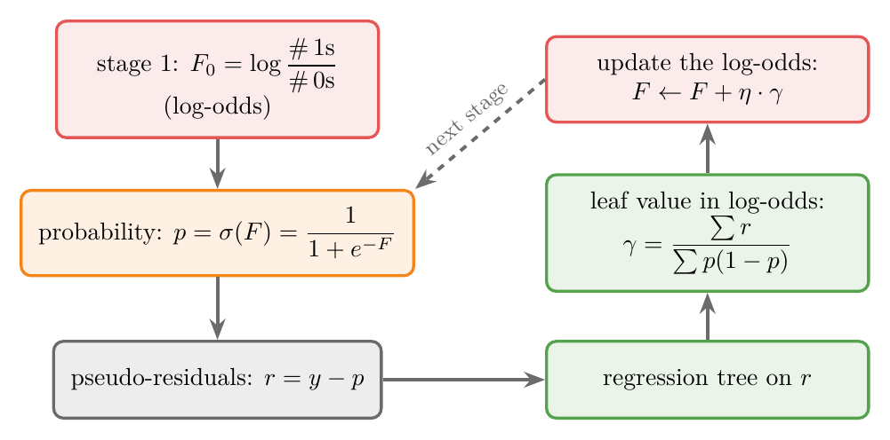
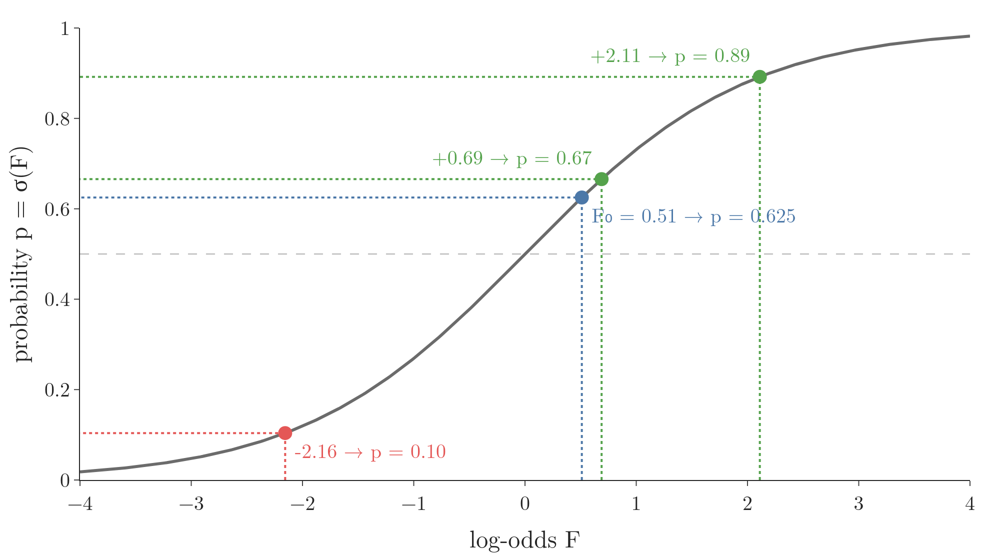
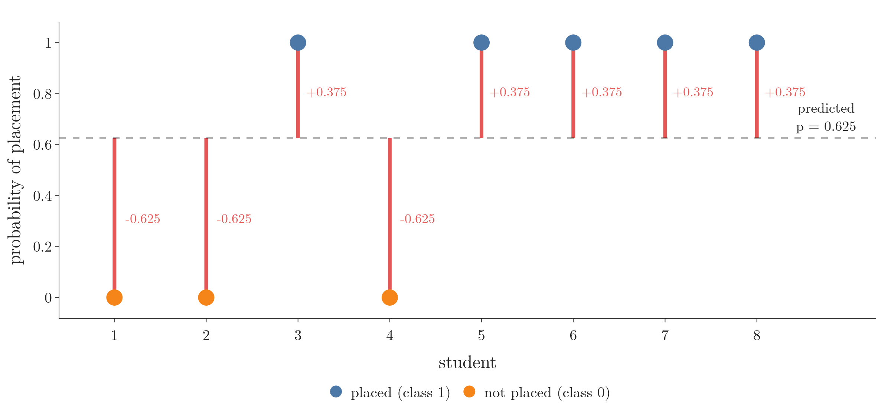
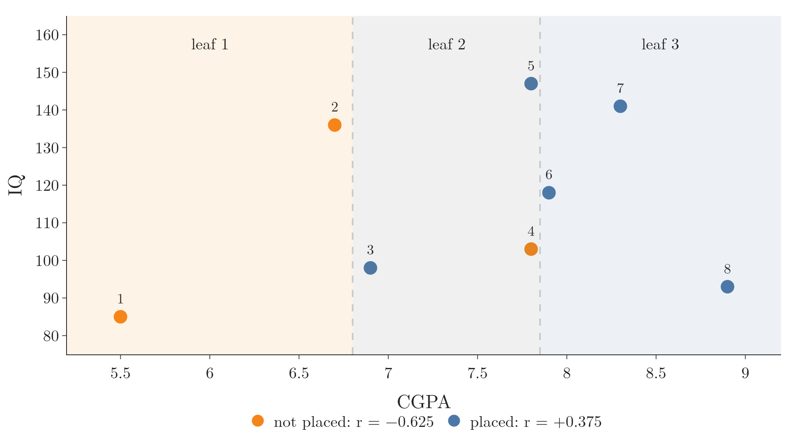
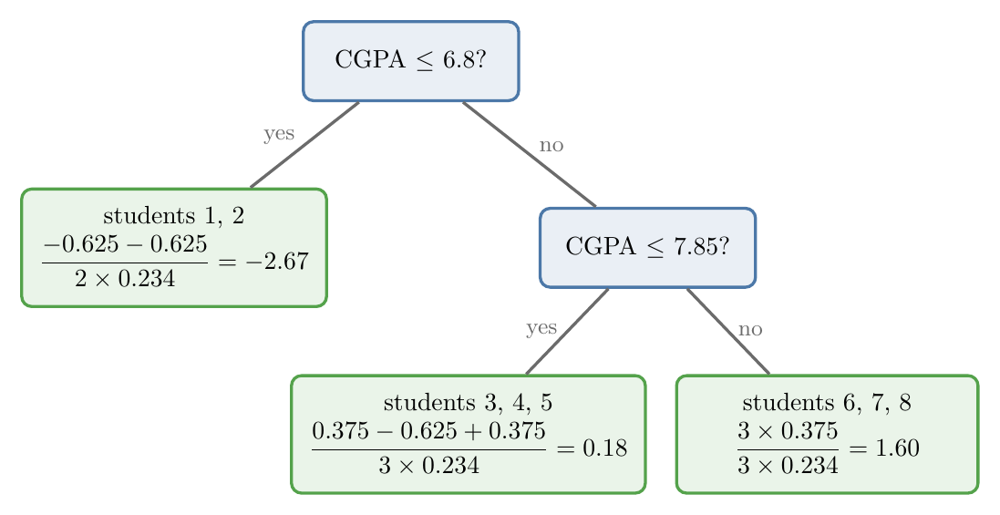
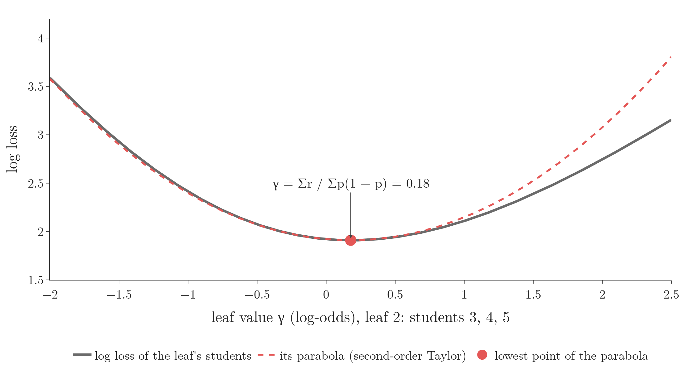
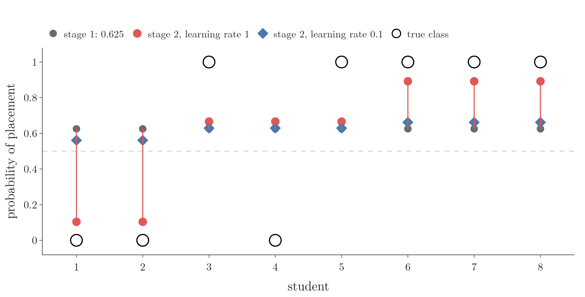
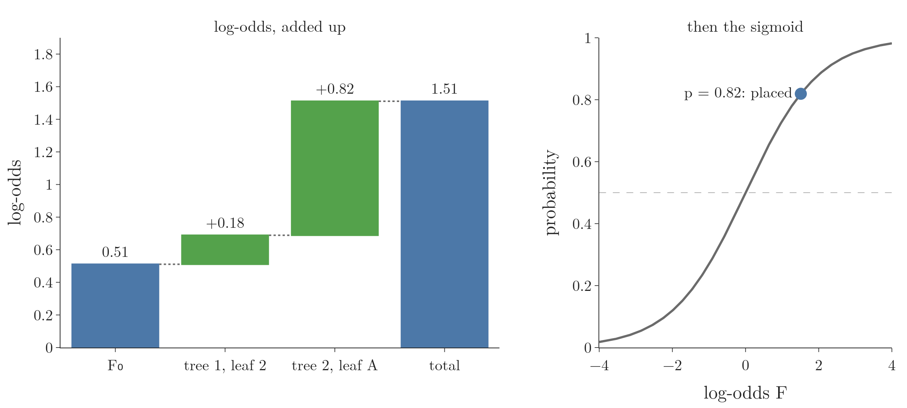
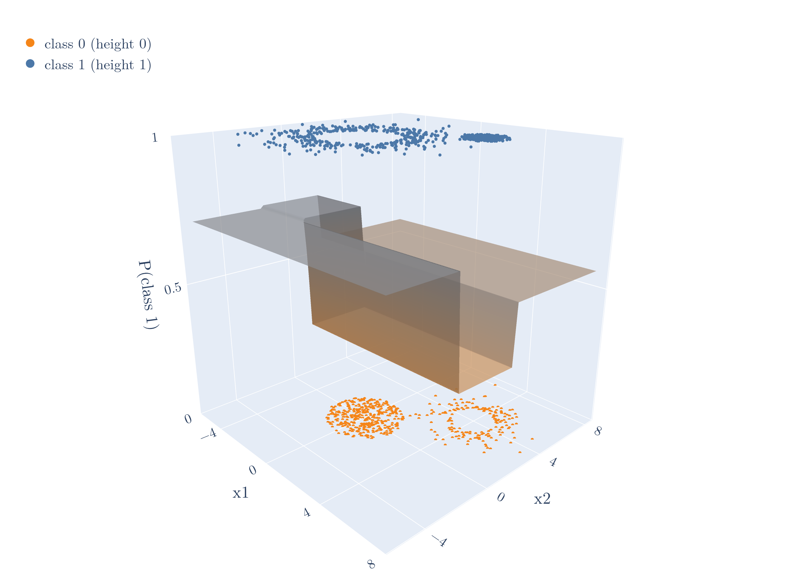
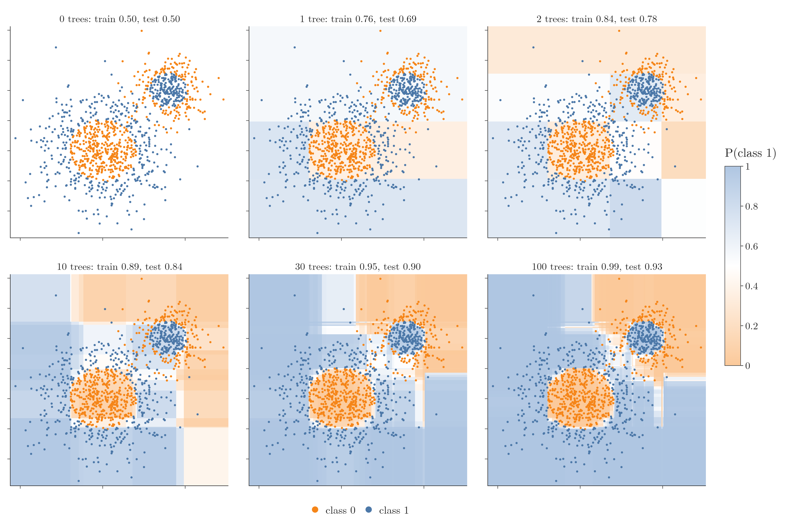

<!-- where-this-fits: generated by course_map/build_map.py; edit concepts.yaml, not this block -->
> **Where this fits:** Pipeline map step 8 (Model). See the [Course map](../../../00-course-map/00-course-map.md).
>
> 
>
> - **Builds on:** Gradient descent ([Note ML-056](../../../ML/06-regression/ML-056-gradient-descent/ML-056-gradient-descent.md)); Learning rate ([Note ML-056](../../../ML/06-regression/ML-056-gradient-descent/ML-056-gradient-descent.md)); Sigmoid function ([Note ML-071](../../../ML/07-classification/ML-071-sigmoid-function/ML-071-sigmoid-function.md)); Log loss (binary cross entropy) ([Note ML-072](../../../ML/07-classification/ML-072-log-loss/ML-072-log-loss.md)); Regression trees ([Note ML-093](../../../ML/08-trees-and-ensembles/ML-093-regression-trees/ML-093-regression-trees.md)); Boosting ([Note ML-095](../../../ML/08-trees-and-ensembles/ML-095-ensemble-learning/ML-095-ensemble-learning.md)).
> - **Leads to:** XGBoost ([Note ML-117](../../../ML/08-trees-and-ensembles/ML-117-xgboost-intro/ML-117-xgboost-intro.md)).
> - **Compare with:** AdaBoost ([Note ML-112](../../../ML/08-trees-and-ensembles/ML-112-adaboost-hyperparameters/ML-112-adaboost-hyperparameters.md)).
<!-- /where-this-fits -->

## 1. Overview

> **Key point:** Classification uses the same gradient boosting algorithm with the log loss. The model works in log-odds: it starts from the log-odds of class 1, turns log-odds into probabilities with the sigmoid, fits trees to the residuals $y - p$, and adds each leaf's value in log-odds.

{height=36%}

The [gradient boosting intuition Note](../ML-114-gradient-boosting-intuition/ML-114-gradient-boosting-intuition.md) built a regression model from a mean and trees on the residuals. The [gradient boosting maths Note](../ML-115-gradient-boosting-regression-maths/ML-115-gradient-boosting-regression-maths.md) showed that the same procedure is one general algorithm for any differentiable loss. For classification we only swap the loss, from squared error to log loss, and Figure 1 shows what changes. We work through it on eight students, then watch it separate two classes on a harder dataset.

## 2. One algorithm, a different loss

> **Key point:** Boosting combines many high-bias models into one low-bias model; for classification the loss becomes the log loss, and the first model and the leaf values change with it.

Gradient boosting adds small models in stages, each learning from the mistakes of the ones before. The small models are **weak learners** (G-2104; [AdaBoost intuition Note](../ML-109-adaboost-intuition/ML-109-adaboost-intuition.md)), models that are only a little better than guessing: high bias, low variance. Adding many of them lowers the bias step by step, which is why boosting fixes underfitting ([bagging vs boosting Note](../ML-113-bagging-vs-boosting/ML-113-bagging-vs-boosting.md)).

For classification, the loss is the **log loss** (G-303; [log loss Note](../../07-classification/ML-072-log-loss/ML-072-log-loss.md)) instead of the squared error. Three things change:

- the first model is the log-odds of class 1, not the mean;
- the residuals are computed from probabilities;
- each leaf's value is computed with a new formula, so that it is in log-odds.

The trees themselves are still regression trees: their targets, the residuals, are numbers.

## 3. The toy data: eight students

> **Key point:** Two features (CGPA, IQ) and a target class: placed (1) or not (0). Five students were placed, three were not.

Each student is an **observation** (G-1374) (one record, one row of the table). CGPA and IQ are the **features** (G-772), the input variables. *Placed* is the **target** (G-1949), the class we predict.

| Student | CGPA | IQ | Placed |
|---|---|---|---|
| 1 | 5.5 | 85 | 0 |
| 2 | 6.7 | 136 | 0 |
| 3 | 6.9 | 98 | 1 |
| 4 | 7.8 | 103 | 0 |
| 5 | 7.8 | 147 | 1 |
| 6 | 7.9 | 118 | 1 |
| 7 | 8.3 | 141 | 1 |
| 8 | 8.9 | 93 | 1 |

We build three models: $F_0$, a simple starting value, then two regression trees. At each stage we compute the combined model's output for every student.

## 4. Stage 1: the log-odds of class 1

> **Key point:** The first model predicts, for everyone, the natural log of (number of 1s divided by number of 0s): here $\ln(5/3) = 0.51$.

For classification the mean of the 0s and 1s is not a sensible start for the maths that follows. Instead we use the log-odds.

The **odds** (G-1376) of an event compare how often it happens with how often it does not: 5 placed against 3 not placed gives odds of 5 to 3, or $5/3 = 1.67$. The **log-odds** (G-1116) is the natural logarithm of the odds (logs are introduced in the [log loss Note](../../07-classification/ML-072-log-loss/ML-072-log-loss.md), section 4).

1. **In words:** count the 1s, divide by the count of the 0s, and take the natural log (base $e$, not base 10).
2. **Formula:**
   $$F_0 = \ln\left(\frac{\text{number of 1s}}{\text{number of 0s}}\right) = \ln\left(\frac{p}{1-p}\right)$$
   where $p$ is the share of 1s.
3. **Example:**
   $$F_0 = \ln\left(\frac{5}{3}\right) = \ln(1.667) = 0.51$$

So stage 1 predicts a log-odds of 0.51 for every student, whatever the CGPA and IQ.

> **Extra:** Log-odds of 0 means even odds (1 to 1, a probability of 0.5). Positive log-odds mean class 1 is more likely, negative ones mean class 0 is more likely. Log-odds can be any number, which is why the trees can safely add to them; probabilities must stay between 0 and 1. Step 1 of the general algorithm, applied to the log loss, gives exactly this log-odds: the Extra in section 8 shows that the derivative of one observation's log loss is $p - y$, so the best constant $\gamma$ satisfies $\sum_i (\sigma(\gamma) - y_i) = 0$, that is $\sigma(\gamma) = 5/8$, and $\gamma = \ln(5/3)$.

## 5. From log-odds back to a probability

> **Key point:** The sigmoid turns log-odds into a probability: $p = 1/(1 + e^{-F})$. For $F_0 = 0.51$ that gives 0.625.

A log-odds of 0.51 does not tell us directly whether a student is placed. To compute residuals and to make predictions, we need a probability. The **sigmoid** function (G-1798) does the conversion ([sigmoid function Note](../../07-classification/ML-071-sigmoid-function/ML-071-sigmoid-function.md)).

1. **In words:** $e$ to the power of minus the log-odds, plus 1, then 1 divided by that.
2. **Formula:**
   $$p = \sigma(F) = \frac{1}{1 + e^{-F}} = \frac{e^{F}}{1 + e^{F}}$$
3. **Example:**
   $$p = \frac{1}{1 + e^{-0.51}} = \frac{1}{1 + 0.600} = 0.625$$

The probability 0.625 is just the share of 1s, $5/8 = 0.625$. With a threshold of 0.5, stage 1 predicts "placed" for every student. The guess is wrong for three of them, but it is a reasonable start: most students were placed.

Figure 2 marks the conversion for $F_0$ and for the three log-odds the students reach after stage 2 (section 9). Watch the dashed line at 0.5: any log-odds above 0 lands above it ("placed"), any below 0 lands under it.

{height=36%}

## 6. Pseudo-residuals: class minus probability

> **Key point:** Each observation's mistake is its class (0 or 1) minus the predicted probability: $r = y - p$.

As in regression, we measure each observation's mistake as actual minus predicted, now with the probability as the prediction.

1. **In words:** subtract the predicted probability from the true class.
2. **Formula:**
   $$r_i = y_i - p_i$$
3. **Example:** student 1 is not placed ($y = 0$), student 3 is placed ($y = 1$):
   $$r_1 = 0 - 0.625 = -0.625, \qquad r_3 = 1 - 0.625 = 0.375$$

Figure 3 draws the residuals. Each dot is a student at the height of its true class, 0 or 1. The dashed line is the predicted probability, 0.625, the same for everyone. The red gap from the line to each dot is that student's residual: dots above the line have a positive residual, dots below it a negative one.

{height=34%}

Every placed student has residual 0.375, every student not placed $-0.625$. These are the **pseudo-residuals** (G-1589) of the log loss: the Extra in section 8 shows that $y - p$ is minus the gradient of the log loss.

## 7. Stage 2: a regression tree on the residuals

> **Key point:** Tree 1 learns the residuals from CGPA and IQ. Tree 1 is a regression tree, even though the problem is classification, because its target is a number.

We train a regression tree with CGPA and IQ as features and the residuals as the target, allowing 3 leaves. The tree splits twice on CGPA:

- **leaf 1, CGPA $\le$ 6.8:** students 1 and 2 (both not placed);
- **leaf 2, 6.8 $<$ CGPA $\le$ 7.85:** students 3, 4 and 5 (two placed, one not);
- **leaf 3, CGPA $>$ 7.85:** students 6, 7 and 8 (all placed).


Figure 4 draws the three leaves as bands of CGPA. Watch the middle band: it is the only one that mixes the two colours, so its residuals partly cancel.

{height=36%}

The tree's own leaf value is the mean residual, for example $-0.625$ in leaf 1. But that number is a difference of probabilities, and $F_0$ is in log-odds. We cannot add a probability to a log-odds. So each leaf gets a new value, its **leaf value in log-odds** (G-1062).

## 8. Leaf values in log-odds

> **Key point:** A leaf's value is the sum of its residuals divided by the sum of $p(1-p)$ over its observations, where $p$ is each observation's previous probability.

{height=32%}

1. **In words:** add up the residuals of the observations in the leaf; divide by the sum, over the same observations, of the previous probability times one minus it.
2. **Formula:**
   $$\gamma_j = \frac{\sum_{i \in \text{leaf } j} r_i}{\sum_{i \in \text{leaf } j} p_i (1 - p_i)}$$
3. **Example:** leaf 1 holds students 1 and 2, both with residual $-0.625$ and previous probability 0.625:
   $$\gamma_1 = \frac{-0.625 + (-0.625)}{0.625 \times 0.375 + 0.625 \times 0.375} = \frac{-1.25}{0.469} = -2.67$$

The same formula gives 0.18 for leaf 2 and 1.60 for leaf 3 (Figure 5). Leaf 1 pushes the log-odds of its students strongly down (towards "not placed"), leaf 3 pushes them up, and the mixed leaf 2 barely moves them.

> **Extra:** Where the formula comes from. Write one observation's log loss in terms of its log-odds $z$, with $p = \sigma(z)$: since $\ln p = -\ln(1 + e^{-z})$ and $\ln(1-p) = -z - \ln(1 + e^{-z})$,
> $$L = -\big[y \ln p + (1-y)\ln(1-p)\big] = \ln(1 + e^{-z}) + (1-y)\thinspace z$$
> Its derivative with respect to $z$ is $-(1-p) + (1-y) = p - y$, so the pseudo-residual, minus the derivative, is $y - p$. The second derivative is the sigmoid's derivative, $p(1-p)$ ([sigmoid derivative Note](../../07-classification/ML-073-sigmoid-derivative/ML-073-sigmoid-derivative.md)). Step 2(c) of the algorithm asks for the $\gamma$ that minimises $\sum L(y_i, F_i + \gamma)$ over the leaf; the log loss gives no exact formula for this $\gamma$, so we approximate each $L$ by its first two Taylor terms, $L_i + (p_i - y_i)\gamma + \frac{1}{2}p_i(1-p_i)\gamma^2$ (the [XGBoost maths Note](../ML-120-xgboost-maths/ML-120-xgboost-maths.md) explains Taylor series). Setting the derivative to zero gives $\gamma = \sum (y_i - p_i) / \sum p_i(1 - p_i)$: our formula. The formula is one **Newton step** (G-1320) (Friedman 2001), and scikit-learn uses the same formula (scikit-learn source).

Figure 6 shows what the formula does for leaf 2. The grey curve is the log loss of students 3, 4 and 5 for each possible leaf value $\gamma$. The dashed red parabola is built from the residuals and the $p(1-p)$ terms, as in the Extra above. The formula returns the lowest point of the parabola, $\gamma = 0.18$, which sits at the bottom of the grey curve.

{height=36%}

## 9. The combined model after stage 2

> **Key point:** Add each observation's leaf value to $F_0$ to get its new log-odds, then apply the sigmoid to get its new probability. The probabilities move towards the true classes.

1. **In words:** new log-odds = old log-odds + the value of the leaf the observation lands in; then convert to a probability.
2. **Formula:**
   $$F_1(x) = F_0 + \gamma_j, \qquad p = \sigma\big(F_1(x)\big)$$
3. **Example:** student 1 lands in leaf 1:
   $$F_1 = 0.51 + (-2.67) = -2.16, \qquad p = \frac{1}{1 + e^{2.16}} = 0.10$$

| Student | Placed | Leaf | $F_1$ | $p$ | New residual $y - p$ |
|---|---|---|---|---|---|
| 1 | 0 | 1 | $-2.16$ | 0.10 | $-0.10$ |
| 2 | 0 | 1 | $-2.16$ | 0.10 | $-0.10$ |
| 3 | 1 | 2 | 0.69 | 0.67 | 0.33 |
| 4 | 0 | 2 | 0.69 | 0.67 | $-0.67$ |
| 5 | 1 | 2 | 0.69 | 0.67 | 0.33 |
| 6 | 1 | 3 | 2.11 | 0.89 | 0.11 |
| 7 | 1 | 3 | 2.11 | 0.89 | 0.11 |
| 8 | 1 | 3 | 2.11 | 0.89 | 0.11 |

Students 1 and 2 now get probability 0.10 of placement, so the model says "not placed", which is correct. Their residual moved from $-0.625$ to $-0.10$, towards 0. Only student 4, in the mixed leaf, is still misclassified.

### 9.1 The learning rate

> **Key point:** Multiplying each leaf value by a learning rate such as 0.1 turns the big jump into a gradual one.

The jump from $-0.625$ to $-0.10$ in one stage is large. As in regression, we can shrink it by multiplying each tree's leaf values by the learning rate $\eta$ ([gradient boosting intuition Note](../ML-114-gradient-boosting-intuition/ML-114-gradient-boosting-intuition.md), section 8): $F_1 = F_0 + \eta\thinspace\gamma_j$.

With $\eta = 0.1$, student 1's log-odds becomes $0.51 + 0.1 \times (-2.67) = 0.24$ and its probability 0.56: a small step in the right direction instead of a leap. In practice $\eta$ is around 0.1 and many more trees are used. The toy example keeps $\eta = 1$ so that two trees show visible progress.

Figure 7 puts the two learning rates side by side for all eight students. Watch students 1 and 2: with learning rate 1 they drop from 0.625 to 0.10 in one stage; with 0.1 they only move to 0.56, still on the wrong side of 0.5.

{height=36%}

## 10. Stage 3: a second tree

> **Key point:** Tree 2 learns the residuals of the combined model; its leaf values use the probabilities of stage 2; the new log-odds is $F_0$ plus both leaf values.

Tree 2 is trained on the new residuals. Tree 2 splits on IQ:

| Leaf of tree 2 | Rule | Students | $\sum r$ | $\sum p(1-p)$ | Leaf value |
|---|---|---|---|---|---|
| A | IQ $\le$ 100.5 | 1, 3, 8 | 0.339 | 0.412 | 0.82 |
| B | 100.5 $<$ IQ $\le$ 144 | 2, 4, 6, 7 | $-0.553$ | 0.508 | $-1.09$ |
| C | IQ $>$ 144 | 5 | 0.334 | 0.223 | 1.50 |

The formula is the same as in section 8, but $p$ is now each observation's probability after stage 2. Leaf C holds only student 5, so its value is $0.334 / (0.666 \times 0.334) = 1/0.666 = 1.50$.

Each student's new log-odds adds both trees: student 4 gets $0.51 + 0.18 - 1.09 = -0.40$, probability 0.40, so it is now correctly "not placed".

| Student | Placed | $p$ stage 1 | $p$ stage 2 | $p$ stage 3 |
|---|---|---|---|---|
| 1 | 0 | 0.625 | 0.10 | 0.21 |
| 2 | 0 | 0.625 | 0.10 | 0.04 |
| 3 | 1 | 0.625 | 0.67 | 0.82 |
| 4 | 0 | 0.625 | 0.67 | 0.40 |
| 5 | 1 | 0.625 | 0.67 | 0.90 |
| 6 | 1 | 0.625 | 0.89 | 0.74 |
| 7 | 1 | 0.625 | 0.89 | 0.74 |
| 8 | 1 | 0.625 | 0.89 | 0.95 |

All eight students are now on the correct side of 0.5. Not every probability improved: students 1, 6 and 7 moved slightly away from their class, because tree 2 put them in a leaf with student 4. Taken together, though, the model got better: the average log loss fell from 0.66 (stage 1) to 0.31 (stage 2) and 0.22 (stage 3).

Figure 8 plays the stages, and continues for two more trees built the same way. Watch the residual bars, the red gaps between each probability and its true class: every tree shortens most of them, student 4's long bar shrinks with tree 2, and the log loss on the right keeps falling (0.13 and 0.08 after trees 3 and 4).


## 11. Predicting a new student

> **Key point:** Add $F_0$ and the leaf values of every tree to get the log-odds, apply the sigmoid, and compare with the threshold.

1. **In words:** follow the new observation down each tree, add up $F_0$ and the leaf values (times $\eta$), and convert to a probability.
2. **Formula:**
   $$F(x) = F_0 + \eta\thinspace\gamma^{(1)}(x) + \eta\thinspace\gamma^{(2)}(x), \qquad p = \sigma\big(F(x)\big)$$
3. **Example:** a student with CGPA 7.2 and IQ 100 lands in leaf 2 of tree 1 (0.18) and leaf A of tree 2 (0.82); with $\eta = 1$:
   $$F = 0.51 + 0.18 + 0.82 = 1.51, \qquad p = \frac{1}{1 + e^{-1.51}} = 0.82$$

The probability of placement is 0.82, above 0.5, so the prediction is "placed". scikit-learn's `GradientBoostingClassifier(loss="log_loss", n_estimators=2, learning_rate=1.0, max_leaf_nodes=3, max_depth=None)` reproduces every probability in this Note (Notebook).

Figure 9 shows the two halves of the prediction. Watch the order: all adding happens in log-odds on the left, and only the total goes through the sigmoid on the right.

{height=34%}

> **Python:** The same model in scikit-learn.
>
> ```python
> from sklearn.ensemble import GradientBoostingClassifier
>
> gbc = GradientBoostingClassifier(
>     loss="log_loss",        # the default
>     n_estimators=2, learning_rate=1.0,
>     max_leaf_nodes=3, max_depth=None)
> gbc.fit(X, y)
> gbc.predict_proba(X_new)    # probabilities
> gbc.decision_function(X_new)   # the log-odds F(x)
> ```
>
> `decision_function` returns the summed log-odds; `predict_proba` applies the sigmoid to it. `max_depth=None` lets `max_leaf_nodes` alone set the tree size.

## 12. The geometric picture

> **Key point:** Lift each point to height 0 or 1 by its class. The model is a surface between 0 and 1; each tree raises it over the 1s and lowers it over the 0s, and after many trees its 0.5 level traces a curved **decision boundary** (G-555), the line where the predicted class changes.

To see what the stages do, we use a harder dataset of 1,500 points with two features, $x_1$ and $x_2$. Class 1 forms a ring around a disc of class 0, and next to it lies a small disc of class 1 inside a ring of class 0. No straight line separates them.

{height=42%}

In Figure 10, each point sits at the height of its class: class 0 on the floor, class 1 at height 1. Stage 1 is a flat surface at the share of class 1, 0.5. One tree with 4 leaves cuts the plane into 4 rectangles and lifts or lowers the surface over each one, towards the points above or below it.

{height=50%}

Figure 11 looks at the same surface from above, after more trees:

| Trees | Training accuracy | Test accuracy |
|---|---|---|
| 0 | 0.50 | 0.50 |
| 1 | 0.76 | 0.69 |
| 2 | 0.84 | 0.78 |
| 10 | 0.89 | 0.84 |
| 30 | 0.95 | 0.90 |
| 100 | 0.99 | 0.93 |

Each tree splits on one feature at a time, an **axis-parallel split** (G-243), so it adds a few rectangles, and the decision boundary is made of straight segments parallel to the axes. After 100 trees it follows both circles: the centre disc becomes orange (class 0), the small disc on the right blue (class 1). Training accuracy nearly reaches 1, and the gap to the test accuracy shows the model starting to memorise. The Notebook trains on to 1,000 trees, averaged over 20 fresh datasets of the same kind, each tested on 15,000 new points: test accuracy peaks at 0.942 after about 120 trees and then slips to 0.937 by 1,000, while training accuracy sits at 1.000. Past the peak, extra trees only fit the training points more tightly, so the number of trees is tuned like the learning rate (ESL §10.12).

## 13. Summary

| | Regression | Classification |
|---|---|---|
| Loss | half the squared error | log loss |
| First model $F_0$ | mean of $y$ | log-odds $\ln(N_1/N_0)$, where $N_1$ and $N_0$ count the observations of class 1 and class 0 |
| Model output | the prediction | log-odds; probability $= \sigma(F)$ |
| Pseudo-residual | $y - F$ | $y - p$ |
| Tree | regression tree on the residuals | regression tree on the residuals |
| Leaf value | mean residual of the leaf | $\sum r / \sum p(1-p)$ |
| Toy example | $F_0 = 4.8$ | $F_0 = 0.51$, $p = 0.625$ |

- Classification uses the same algorithm as regression, with the log loss.
- Everything is added in log-odds; the sigmoid converts log-odds to probabilities whenever we need residuals or predictions.
- The trees are regression trees; their leaf values are converted to log-odds with $\sum r / \sum p(1-p)$, a Newton step on the log loss.
- The learning rate scales every leaf value, turning big jumps into gradual steps.
- Geometrically, each tree raises or lowers a probability surface over rectangles of the feature space; many trees give a curved, flexible decision boundary.

## 14. Sources

**Built from**

- CampusX, "Gradient Boosting for Classification | Geometric Intuition | CampusX", YouTube, https://www.youtube.com/watch?v=4p5EQtyxSyI
- StatQuest with Josh Starmer, "Gradient Boost Part 3 (of 4): Classification", YouTube, https://www.youtube.com/watch?v=jxuNLH5dXCs (residuals drawn as the gap between a probability and its class, the residual figures of sections 6 and 10)
- StatQuest with Josh Starmer, "Gradient Boost Part 4 (of 4): Classification Details", YouTube, https://www.youtube.com/watch?v=StWY5QWMXCw (the leaf formula from a second-order Taylor polynomial, section 8)

**Other references**

- Friedman, J. H. (2001). Greedy function approximation: a gradient boosting machine. *Annals of Statistics*, 29(5), 1189–1232. (Two-class logistic regression: leaf values from a single Newton–Raphson step.)
- Hastie, T., Tibshirani, R. and Friedman, J. (2009). *The Elements of Statistical Learning* (ESL), 2nd ed., Springer. §10.12 (the number of trees $M$ is chosen to avoid overfitting).
- scikit-learn developers. Source file `sklearn/ensemble/_gb.py` (version 1.9), `_update_terminal_regions`: the leaf update for the log loss, numerator $y - p$, denominator $p(1-p)$, "a single Newton-Raphson step". github.com/scikit-learn/scikit-learn

## 15. Key terms

| Term | Meaning |
|---|---|
| Odds | How often an event happens divided by how often it does not, e.g. 5 placed to 3 not placed is $5/3$ |
| Log-odds | The natural log of the odds, $\ln(p/(1-p))$; any number, 0 at a probability of 0.5 |
| Leaf value in log-odds | $\sum r / \sum p(1-p)$ over a leaf's observations: the amount the leaf adds to the log-odds |
| Newton step | Minimising a function by fitting a parabola from its first and second derivatives and jumping to the parabola's lowest point |
