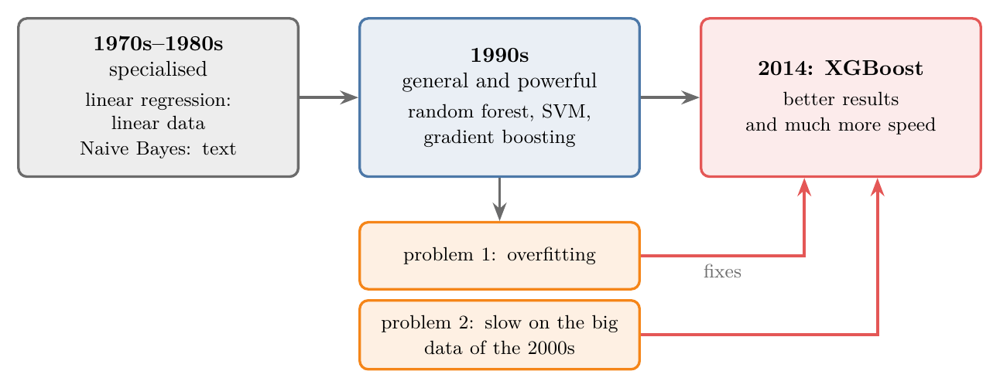
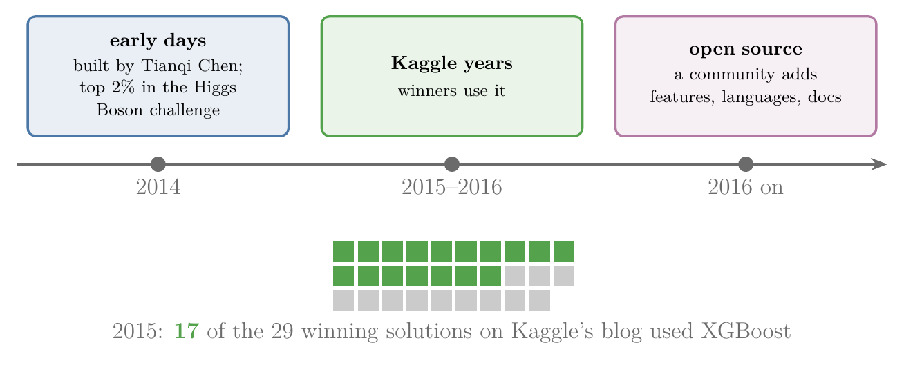
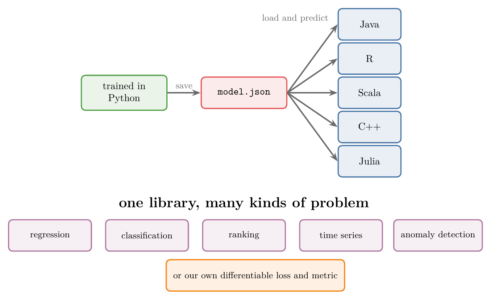
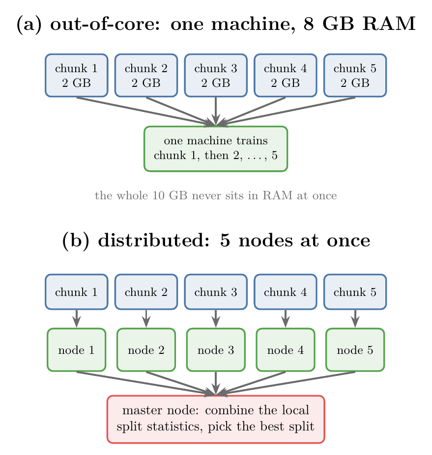

<!-- where-this-fits: generated by course_map/build_map.py; edit concepts.yaml, not this block -->
> **Where this fits:** Pipeline map step 8 (Model). See the [Course map](../../../00-course-map/00-course-map.md).
>
> 
>
> - **Builds on:** [Binning and binarization](../../../ML/03-feature-engineering/ML-031-binning-binarization/ML-031-binning-binarization.md#3-discretization); [Missing values](../../../ML/04-missing-data-and-outliers/ML-034-complete-case-analysis/ML-034-complete-case-analysis.md#2-why-missing-values-must-be-handled); [Taylor series](../../../MA/06-calculus/MA-061-derivatives-of-one-variable/MA-061-derivatives-of-one-variable.md#6-taylor-polynomials); [Hessian and multivariate Taylor](../../../MA/06-calculus/MA-064-hessian-and-multivariate-taylor/MA-064-hessian-and-multivariate-taylor.md#5-the-hessian); [Regularisation](../../../ML/06-regression/ML-062-ridge-regression-intuition/ML-062-ridge-regression-intuition.md#3-the-idea-penalise-large-coefficients); [Gradient boosting](../../../ML/08-trees-and-ensembles/ML-114-gradient-boosting-intuition/ML-114-gradient-boosting-intuition.md#2-boosting-passes-mistakes-forward).
<!-- /where-this-fits -->

## 1. Overview

> **Key point:** XGBoost is not a new algorithm: it is a library that takes gradient boosting and adds many optimisations, for flexibility, speed and performance.

{height=38%}

**XGBoost** (G-2133; eXtreme Gradient Boosting) is the gradient boosting of [boosting passes mistakes forward](../ML-114-gradient-boosting-intuition/ML-114-gradient-boosting-intuition.md#2-boosting-passes-mistakes-forward) and [additive modelling](../ML-115-gradient-boosting-regression-maths/ML-115-gradient-boosting-regression-maths.md#3-additive-modelling-a-complex-function-as-a-sum-of-simple-ones) with a long list of improvements. Some come from machine learning, most from software engineering. Figure 1 sorts them into three areas.

This Note is a map of the whole library: what each improvement is and why it matters, without the maths. The Notes that follow work through the core:

- the XGBoost tree for regression ([the similarity score](../ML-118-xgboost-regression/ML-118-xgboost-regression.md#4-the-similarity-score)) and classification ([the similarity score for classification](../ML-119-xgboost-classification/ML-119-xgboost-classification.md#5-the-similarity-score-for-classification));
- where its formulas come from ([the objective: loss plus a penalty on the tree](../ML-120-xgboost-maths/ML-120-xgboost-maths.md#4-the-objective-loss-plus-a-penalty-on-the-tree)).

> **Python:** XGBoost is a separate package, `pip install xgboost` (or `conda install -c conda-forge xgboost`), imported as `import xgboost as xgb`. Its `XGBClassifier` and `XGBRegressor` follow the scikit-learn `fit`/`predict` interface.

## 2. Why so many algorithms?

> **Key point:** Early algorithms worked well only on particular kinds of data; the general and powerful algorithms of the 1990s had two problems left: overfitting and speed on large data.

Machine learning has dozens of algorithms: linear regression, logistic regression, Naive Bayes, KNN, SVM and more. Why not one algorithm for every problem? Because each algorithm suits a certain kind of data.

**Specialised algorithms (1970s and 1980s).** Algorithms of this period solve problems well, but only on specific data. Linear regression works well on data with a linear pattern; Naive Bayes is at its best on text.

**General algorithms (1990s).** Random forests, SVMs and gradient boosting are both more powerful and more general: they give good results on many kinds of data. Two problems remained:

1. **overfitting**: they could still fit the training data too closely;
2. **scalability**: from the 2000s the internet made datasets grow fast, and on big datasets these algorithms were slow.

XGBoost was built to fix both: better results and much more speed.

Figure 2 lays out the three periods. The 1990s algorithms are general, but two problems (orange) remain, and XGBoost aims at both.

{height=30%}

## 3. What XGBoost is

> **Key point:** XGBoost is a library: the gradient boosting algorithm plus software engineering that makes it fast and robust.

A common misunderstanding is that XGBoost is a new algorithm. XGBoost is a **library** built on the existing gradient boosting algorithm. Its creator, Tianqi Chen, saw how much potential gradient boosting had. By improving its speed and its results, it could become far more powerful.

So XGBoost is two things together:

- **machine learning**, taken from gradient boosting (with a few changes of its own, section 8);
- **software engineering**: parallel processing, memory handling, distributed and GPU computing (section 7).

## 4. A short history

> **Key point:** Started in 2014, made famous by Kaggle competitions, then open-sourced and grown by a large community.

The history falls into three stages.

1. **The early days (2014).** Tianqi Chen built XGBoost at the University of Washington. He and Tong He used it in the 2014 Higgs Boson Machine Learning Challenge on Kaggle, a particle-physics competition, where their solution finished in the top 2% (Chen and He 2015). Kaggle users began to notice a new tool.
2. **The Kaggle years (2015-2016).** More and more winners used it. The XGBoost paper (Chen and Guestrin 2016, §1) reports that 17 of the 29 winning solutions published on Kaggle's blog in 2015 used XGBoost.
3. **Open source.** XGBoost is an open-source package (Chen and Guestrin 2016, §1). With the code open, engineers worldwide added features and optimisations, support for more platforms and languages, documentation and tutorials. The paper calls it "the consensus choice of learner" among the winning solutions it surveyed (Chen and Guestrin 2016, §1).

Figure 3 puts the stages on one timeline. Watch the squares at the bottom: each is one winning Kaggle solution published in 2015, and the green ones used XGBoost.

{height=32%}

## 5. Why gradient boosting was the starting point

> **Key point:** Gradient boosting already had flexibility, strong results, robustness and Kaggle success; it lacked only speed on big data.

Several properties made gradient boosting a good base:

- **Flexibility.** Gradient boosting accepts any loss function that can be differentiated (see [the ingredients: a differentiable loss](../ML-115-gradient-boosting-regression-maths/ML-115-gradient-boosting-regression-maths.md#4-the-ingredients-training-data-and-a-differentiable-loss)). The same algorithm handles regression, classification, ranking and custom problems.
- **Performance.** On most datasets it gives good results.
- **Robustness.** With proper regularisation its results are stable.
- **Kaggle.** Many winners already used it.

Gradient boosting did nearly everything right. With better results on new data and the ability to handle big datasets, gradient boosting would become hard to beat. That plan is the origin of XGBoost.

## 6. Flexibility

> **Key point:** XGBoost runs on any operating system, in many languages, alongside the usual libraries, and on almost any kind of problem, with our own loss if we want.

The aim was to reach as many people as possible. Four features serve it.

Figure 4 shows two of them at once. Top: one model saved from Python is loaded by every language interface. Bottom: the same library solves many kinds of problem, or any problem with our own differentiable loss.

{height=40%}

### 6.1 Cross-platform

> **Key point:** The same model runs on Windows, Linux and macOS.

A model trained on Linux can be loaded and used on Windows. Cross-platform support is common in libraries today.

### 6.2 Many programming languages

> **Key point:** A model trained in Python can be loaded and used from Java, R, Scala, C++ and others.

Most models live in one language: Python, R or MATLAB. XGBoost has interfaces (wrappers around the same core) for Python, R, Java, Scala, Ruby, Swift, Julia, C and C++ (XGBoost docs).

Language support matters in practice. Suppose a company's website is written in Java, as many enterprise applications are, and needs a machine learning component. Usually the model is trained in Python and wrapped in a separate web service (an API) that Java calls. With XGBoost, Java can load the saved model and predict directly.

> **Python:** Saving a model in Python for use in another language.
>
> ```python
> import xgboost as xgb
>
> model = xgb.XGBClassifier()
> model.fit(X_train, y_train)
> # JSON format: readable by every XGBoost interface
> model.save_model("model.json")
> ```
>
> In Java, XGBoost4J loads the same file with `XGBoost.loadModel("model.json")` and calls `predict` on new data.

### 6.3 Works with other libraries

> **Key point:** XGBoost fits into every stage of a project, from data analysis to deployment.

- **Model building:** NumPy, pandas and scikit-learn (XGBoost models follow the scikit-learn `fit`/`predict` interface).
- **Distributed computing:** Spark (PySpark) and Dask (section 7.6).
- **Explaining models:** SHAP and LIME.
- **Deployment:** Docker and Kubernetes.
- **Workflow management (MLOps):** MLflow and Apache Airflow.

### 6.4 Many kinds of problems

> **Key point:** Regression, binary and multiclass classification, time series, ranking, anomaly detection, and any custom differentiable loss.

Linear regression only does regression; logistic regression only classification. XGBoost handles:

- regression;
- binary and multiclass classification;
- time series forecasting;
- ranking (ordering items, as in recommender systems);
- anomaly detection.

Because it is gradient boosting underneath, we can also write our own loss function and our own evaluation metric. For example, a loss that charges more for false negatives than for false positives: [cost-sensitive learning](../../09-clustering-and-more/ML-127-imbalanced-data/ML-127-imbalanced-data.md#9-cost-sensitive-learning) writes such a loss.

## 7. Speed

> **Key point:** Six engineering tricks make XGBoost much faster than classic gradient boosting: parallel split search, column blocks, cache awareness, out-of-core training, distributed training and GPU training.

### 7.1 How much faster

> **Key point:** On 10,000 observations and 200 features, and on a single processor core, scikit-learn's classic gradient boosting needs 60 seconds; XGBoost needs 1.9 seconds, about 30 times less, for the same accuracy.

{height=36%}

The Notebook builds a synthetic dataset of 10,000 **observations** (G-1374; records, the rows of the data table) and 200 **features** (G-772; input variables, the columns). The Notebook trains the same ensemble, 100 trees of depth 3 with learning rate 0.1, in four implementations. Every library gets one processor core, so the comparison is about the algorithms alone; extra cores speed XGBoost up further (section 7.2). Figure 5 shows the result. Its time axis is logarithmic: the gridlines 1, 10 and 100 are equally far apart, so moving from one of them to the next multiplies the time by 10. The times:

- scikit-learn's classic `GradientBoostingClassifier`: **59.9 seconds**, test accuracy 0.922;
- XGBoost: **1.88 seconds**, accuracy 0.921;
- scikit-learn's `HistGradientBoostingClassifier`: 1.21 seconds, accuracy 0.916;
- LightGBM (section 9): 1.13 seconds, accuracy 0.918.

The accuracy hardly changes; only the time does. The XGBoost paper reports the same pattern: more than ten times faster than existing popular solutions on a single machine (Chen and Guestrin 2016, §1). On a dataset that takes 10 hours to train, a speed-up of even 10 times means 1 hour. The last two are other libraries built on the same histogram idea, shown for comparison (section 9).

> **Python:** XGBoost with the scikit-learn interface.
>
> ```python
> from xgboost import XGBClassifier
>
> model = XGBClassifier(n_estimators=100, max_depth=3,
>                       learning_rate=0.1,
>                       tree_method="hist", n_jobs=1,
>                       random_state=42)
> model.fit(X_train, y_train)
> model.score(X_test, y_test)        # 0.921
> ```
>
> `tree_method="hist"` (the default in current versions) uses histogram bins (section 8.4); `n_jobs` is the number of processor cores.

### 7.2 Parallel processing

> **Key point:** Boosting is sequential, tree after tree; the parallel work is inside one tree, where the best split of every feature can be searched at the same time.

**Parallel processing** (G-1444) means splitting one job among several workers. One builder takes 30 days to build a house; six builders working side by side take far less.

But boosting is sequential: tree 2 learns from the mistakes of tree 1, so it cannot start before tree 1 is done. Where does the parallel work come from? From inside each tree.

To grow a node, a decision tree tries every candidate split on every feature (see [splitting on a numerical feature](../ML-091-decision-trees-intuition/ML-091-decision-trees-intuition.md#9-splitting-on-a-numerical-feature)). Take two features, age and marks, and three students. For age we sort the values and score a cut between each neighbouring pair; we do the same for marks. Then we keep the best cut of all.

The search over age does not depend on the search over marks. So one processor core can take age while another takes marks (Figure 6). With 200 features and 8 cores, 8 features are searched at once. The number of cores used is the hyperparameter `n_jobs`.

{height=40%}

### 7.3 Column blocks

> **Key point:** XGBoost stores the data column by column, pre-sorted, so each core can take one column and work on it alone.

Most algorithms store data row by row: one block holds every column of row 1, the next every column of row 2. XGBoost stores it in **column blocks** (G-412): one block per feature, its values sorted once before training and reused for every tree (Chen and Guestrin 2016, §4.1). A core can pick up one whole column block and search its splits without touching the rest. Column blocks are what make the parallel split search of Figure 6 efficient.

### 7.4 Cache awareness

> **Key point:** Values that are needed again and again are kept in the small, fast cache memory next to the processor, instead of being fetched from RAM each time.

The processor (CPU) does the computing; the data lives in RAM, a separate piece of hardware, and fetching it takes time. **Cache memory** (G-338) is a small, fast memory inside the processor for things that are used repeatedly. A website's logo that loads faster the second time works the same way: it is kept locally.

XGBoost keeps what it uses most often in the cache, such as the gradient statistics it reads during the split search (Chen and Guestrin 2016, §4.2). A cook who keeps the most-used spices on the counter, instead of walking to the fridge each time, saves time in the same way.

### 7.5 Out-of-core computing

> **Key point:** A dataset bigger than the RAM is read in chunks; training moves forward chunk by chunk.

Suppose our laptop has 8 GB of RAM and the dataset is 10 GB. The dataset cannot be loaded at once, so normally we could not even start.

**Out-of-core computing** (G-1413) works in three steps:

1. split the data into chunks, say five of 2 GB, kept on disk;
2. load chunk 1 and train on it, which brings the model to some state;
3. load chunk 2 and continue training from that state, and so on to chunk 5.

XGBoost does this through its external-memory mode (Chen and Guestrin 2016, §4.3). Out-of-core training works together with cache awareness: what is needed again is kept in the cache while chunks come and go.

### 7.6 Distributed computing

> **Key point:** Several machines each take a part of the data and compute split statistics on it. The statistics are added together, and the best split is chosen from the totals.

In **distributed computing** (G-625) a job is shared between several machines, called **nodes**, working in parallel. Out-of-core computing lets one machine handle big data, but it still processes one chunk at a time. With 5 nodes and a 10 GB dataset cut into 5 chunks of 2 GB, all five chunks are processed at the same moment.

1. **Partition** the data: each node gets an equal share.
2. **Work locally**: each node computes, for every feature, the split statistics on its own share.
3. **Aggregate**: a **master node** adds the nodes' statistics together, picks the split that is best on the totals, and sends the decision back (Chen and Guestrin 2016, §6.1: the distributed version is built on a library for "allreduce", which combines one result from every machine).

Distributed training needs outside tools: XGBoost connects to Dask, Spark, Ray and Kubernetes for it (XGBoost docs).

Figure 7 compares the two ways of handling 10 GB of data. At the top, one machine reads the five chunks one after another; at the bottom, five nodes each read one chunk at the same moment, and the master node combines their split statistics.

{height=55%}

### 7.7 GPU support

> **Key point:** A graphics card has thousands of small cores; XGBoost's histogram building and split search can run on them.

A **GPU** (G-856; graphics processing unit, the graphics card) has many cores, each weaker than a CPU core but far more numerous. A GPU is ideal for many small, similar calculations: drawing game graphics, training deep learning models. XGBoost's histogram building and split finding are exactly such work, so XGBoost can run on a GPU.

The XGBoost GPU authors measured the gain on large public datasets (Mitchell et al. 2018, Table 2). On YearPredictionMSD, 515,000 observations and 90 features, 500 trees took 217 seconds on 64 CPU cores and 30 seconds on GPUs, about 7 times faster, with the same error. The gain needs large data: on a small dataset, copying the data to the graphics card and starting each GPU calculation take a fixed time that can outweigh the faster work (LightGBM docs, GPU Tuning Guide, explaining its own GPU training). The experiments in this Note run on the CPU only.

> **Python:** Training on a GPU.
>
> ```python
> model = XGBClassifier(tree_method="hist", device="cuda")
> ```
>
> Older code writes `tree_method="gpu_hist"`; that value is deprecated since XGBoost 2.0, which uses `device="cuda"` instead.

### 7.8 Why "extreme"

> **Key point:** All these engineering tricks taken to the extreme gave the library its name: eXtreme Gradient Boosting.

XGBoost pushes software engineering on gradient boosting as far as it goes:

- parallel processing (section 7.2);
- special data structures, the column blocks (section 7.3);
- cache use (section 7.4);
- out-of-core computing (section 7.5);
- distributed computing (section 7.6);
- GPU computing (section 7.7).

Hence the name, eXtreme Gradient Boosting.

## 8. Performance

> **Key point:** Five machine learning changes improve XGBoost's results: a regularised objective, missing-value handling, sparsity-aware splits, approximate split finding with quantile bins, and more ways to prune trees.

### 8.1 A regularised learning objective

> **Key point:** XGBoost's objective is the loss plus a penalty on the tree itself, so every tree is regularised as it is built.

Regularisation adds a penalty to the loss so that the model stays simpler and overfits less, as in ridge regression's L2 penalty (see [the loss with a penalty](../../06-regression/ML-063-ridge-regression-maths/ML-063-ridge-regression-maths.md#21-the-loss)). Classic gradient boosting accepts any differentiable loss but has no penalty built in. Classic gradient boosting fights overfitting only with the learning rate (see [the learning rate: small steps in the right direction](../ML-114-gradient-boosting-intuition/ML-114-gradient-boosting-intuition.md#8-the-learning-rate-small-steps-in-the-right-direction)) and by limiting or pruning the trees.

XGBoost adds a penalty term to its objective by default. The penalty punishes trees with many leaves and leaves with large output values. When the objective is minimised, the regularisation happens automatically. The formula, with its two hyperparameters $\gamma$ and $\lambda$, is derived in [the objective: loss plus a penalty on the tree](../ML-120-xgboost-maths/ML-120-xgboost-maths.md#4-the-objective-loss-plus-a-penalty-on-the-tree).

### 8.2 Sparsity-aware split finding

> **Key point:** At each split, XGBoost tries sending the observations with a missing value left and then right, and keeps the direction with the larger gain.

Data is **sparse** when it has many zeros or missing values. XGBoost first notices the sparsity and then handles it in its splits, a method called **sparsity-aware split finding** (G-1850).

Take one feature F1 with values 4, 5, 6, 8, 9 and one missing value. Candidate cuts are 4.5, 5.5, 7 and 8.5; no cut is placed at the missing value. For the node "F1 at most 4.5", the value 4 goes left and 5, 6, 8, 9 go right. Where does the observation with no F1 go?

XGBoost tries both (Figure 8):

1. send the observation with the missing value left, and compute the **gain** of the split (how much the split lowers the loss);
2. send it right, and compute the gain again;
3. keep the side with the larger gain as the node's **default direction** (G-574).

At prediction time, any observation missing F1 follows it (Chen and Guestrin 2016, §3.4, Alg. 3). The gain itself (how much a split lowers the loss) is defined in [gain: choosing the root split](../ML-118-xgboost-regression/ML-118-xgboost-regression.md#6-gain-choosing-the-root-split).

{height=34%}

### 8.3 Missing values without imputation

> **Key point:** Because of the default direction, XGBoost trains on data with missing values as they are, with no imputation step.

So far, a dataset with missing values had to be fixed first: observations dropped ([complete case analysis](../../04-missing-data-and-outliers/ML-034-complete-case-analysis/ML-034-complete-case-analysis.md#4-complete-case-analysis)) or values filled in ([imputing numerical data](../../04-missing-data-and-outliers/ML-035-imputing-numerical-data/ML-035-imputing-numerical-data.md#2-mean-and-median-imputation)). Many models refuse missing values. XGBoost does not need this step: the default direction of section 8.2 decides where each observation with a missing value goes.

The Notebook shows this on the Titanic passengers, where Age is missing for 177 of 891:

- scikit-learn's classic `GradientBoostingClassifier` stops with `ValueError: Input X contains NaN`;
- `XGBClassifier` trains on the data as it is: 5-fold cross-validated accuracy **0.828** (Pclass, Sex, Age, Fare);
- with the missing ages filled by the median first, it scores 0.834, about the same.

We can read the learned default direction from the first tree. One of its nodes asks "Age < 13?", and passengers with no age are sent to the "no" side, together with the passengers aged 13 or more. That side was chosen because it gave the larger gain (section 8.2).

> **Python:** Missing values in XGBoost.
>
> ```python
> import numpy as np
> from xgboost import XGBClassifier
>
> # np.nan marks a missing value (also the default)
> model = XGBClassifier(missing=np.nan)
> model.fit(X_train, y_train)   # no imputation needed
> ```

### 8.4 Approximate split finding with quantile bins

> **Key point:** Instead of trying every value as a split, XGBoost cuts each feature into bins and tries only the bin edges; the bins follow quantiles, so they are narrow where the data is dense.

The usual way to find a split, used in [regression trees](../ML-093-regression-trees/ML-093-regression-trees.md#43-trying-every-threshold), is the **exact greedy algorithm** (G-719):

1. sort the column;
2. try the midpoint between every pair of neighbouring values as a split;
3. keep the split with the largest gain.

The exact greedy algorithm always finds the best split, but on a column with ten million values it tries ten million candidates at every node.

**Approximate tree learning** (G-207) tries far fewer. The approximate method cuts the column into bins, for example 1 to 5, 6 to 10, 11 to 15, and tries only the bin edges. The continuous column becomes discrete, as in [binning](../../03-feature-engineering/ML-031-binning-binarization/ML-031-binning-binarization.md#3-discretization). The split found may be a little worse than the exact best, but training is much faster. Because the bins work like the bars of a histogram, this is also called **histogram-based training**.

Where should the bin edges go? Equal-width bins ignore the data. XGBoost places them at **quantiles** (cut points that leave a given share of the values below them; the median is the 50% quantile) instead (the method is called the **weighted quantile sketch** (G-2118)): where many values crowd together the bins are narrow, and where values are rare they are wide. The bins then describe the data more accurately, and the trees built on them are more accurate too.

On the Titanic fares, a very skewed column, [The three strategies on one feature](../../03-feature-engineering/ML-031-binning-binarization/ML-031-binning-binarization.md#8-the-three-strategies-on-one-feature) shows the difference: equal-width bins put almost every passenger in the first bin, while quantile bins share the passengers out evenly, with narrow bins among the many cheap fares.

Figure 9 shows the effect on the split search, with survival as the target. The horizontal axis is the fare threshold on a log scale (from 1 to 10 takes the same width as from 10 to 100), so the many cheap fares are spread out. The grey curve is the gain of every one of the 247 midpoints that the exact greedy algorithm tries; the best is 79.4. Watch the orange quantile edges crowd where the passengers crowd (the ticks at the bottom): with 8 bins they already reach 77.5, 98 percent of the best, and with 32 bins they find the best split itself. The blue equal-width edges waste most of their places on the few expensive fares and reach only 71.4 even with 64 bins.

{height=75%}

> **Extra:** "Weighted" means the quantiles are not counted in observations. Each observation counts with a weight, its Hessian $h_i$ (the second derivative of the loss, from [the best leaf output](../ML-120-xgboost-maths/ML-120-xgboost-maths.md#10-the-best-leaf-output)). For squared error every $h_i = 1$, so the weighted quantiles are the ordinary ones. For log loss $h_i = p_i(1-p_i)$ ([the similarity score for classification](../ML-119-xgboost-classification/ML-119-xgboost-classification.md#5-the-similarity-score-for-classification)): largest (0.25) at $p_i = 0.5$, near 0 when $p_i$ is close to 0 or 1. So observations the model is still unsure about weigh more, and the bins are finer among them. "Sketch" means the quantiles are estimated from a compact summary that can be merged, which lets it work when the data is split over many machines (Chen and Guestrin 2016, §3.3).

Which method to use: the exact greedy algorithm on small data; the approximate algorithm on big data, where scanning every value, especially when the data does not fit in memory, is too slow (Chen and Guestrin 2016, §3.2).

### 8.5 Tree pruning

> **Key point:** Besides the usual pre-pruning and post-pruning settings, XGBoost has $\gamma$: a split is only kept if it lowers the loss by at least $\gamma$.

**Tree pruning** limits how deep and complex the trees grow, which reduces overfitting (see [pruning a grown tree](../ML-092-decision-tree-hyperparameters/ML-092-decision-tree-hyperparameters.md#5-pruning-a-grown-tree-cost-complexity-pruning)). There are two kinds: pre-pruning stops a tree while it grows, post-pruning grows it fully and cuts it back.

XGBoost offers both kinds of settings, plus one more: $\gamma$ (`gamma`). A new branch is made only if it reduces the loss by a significant amount, at least $\gamma$. How this works is shown in [gain: choosing the root split](../ML-118-xgboost-regression/ML-118-xgboost-regression.md#6-gain-choosing-the-root-split). The price $\gamma$ per leaf is part of the regularised objective of section 8.1 (Chen and Guestrin 2016, §2.1).

## 9. LightGBM and CatBoost

> **Key point:** XGBoost is not the only strong gradient boosting library: LightGBM is built for speed and low memory, CatBoost for categorical features.

Two other libraries improve on gradient boosting in their own ways:

- **LightGBM** (G-1084; Light Gradient Boosting Machine, from Microsoft Research): aimed at faster training and lower memory use, with parallel, distributed and GPU training (LightGBM docs). Its paper reports training up to more than 20 times faster than conventional gradient boosting with almost the same accuracy (Ke et al. 2017).
- **CatBoost** (G-348; from Yandex; Prokhorenkova et al. 2018): an open-source gradient boosting library on decision trees whose best-known feature is built-in support for categorical columns, with no manual encoding.

scikit-learn's `HistGradientBoostingClassifier` and `HistGradientBoostingRegressor` are modelled on LightGBM (scikit-learn docs). In Figure 5, LightGBM and scikit-learn's version were the fastest of all on our data.

## 10. Summary

| Area | Improvement | What it gives |
|---|---|---|
| Flexibility | cross-platform, many languages | one model usable everywhere, e.g. trained in Python, used in Java |
| Flexibility | library integrations, many problem types, custom loss | fits any project and problem |
| Speed | parallel split search, column blocks | the features of one node are searched at once |
| Speed | cache awareness, out-of-core | less waiting for memory; data bigger than RAM |
| Speed | distributed and GPU training | many machines or thousands of GPU cores, worth it on large data |
| Performance | regularised objective, pruning with $\gamma$ | less overfitting |
| Performance | sparsity-aware splits | missing values handled with a learned default direction |
| Performance | approximate splits with quantile bins | fast split search that follows the data |

- XGBoost is a library: gradient boosting plus engineering. Boosting stays sequential, because each tree learns from the mistakes of the one before; the parallel work is inside each tree.
- It became famous through Kaggle: 17 of the 29 winning solutions published on Kaggle's blog in 2015 used it, because it fixed the two problems gradient boosting had left, overfitting and slow training on big data.
- On 10,000 observations and 200 features, on one core, XGBoost trained in 1.9 seconds against 60 seconds for classic gradient boosting, with the same accuracy, because of the engineering of the speed section (parallel split search, column blocks, histogram bins).
- Missing values need no imputation: each split learns where to send them, so the usual step of dropping or filling gaps can be skipped.
- Quantile bins are narrow where data is dense; only the bin edges are tried as splits (at most `max_bin` bins per feature, 256 by default; XGBoost docs), so the split search is much faster and still lands close to the best split.
- LightGBM and CatBoost are the other major gradient boosting libraries, so they are the alternatives to try: LightGBM for speed and low memory, CatBoost for categorical columns.
- So XGBoost is not a new algorithm: it is the same gradient boosting, made flexible, fast and less prone to overfitting.

## 11. Sources

**Built from**

- CampusX, "Introduction to XGBOOST | Machine Learning | CampusX", YouTube, https://www.youtube.com/watch?v=C6aDw4y8qJ0

**Other references**

- Chen, T. and Guestrin, C. (2016). *XGBoost: A Scalable Tree Boosting System*. KDD 2016 (arXiv:1603.02754).
- Chen, T. and He, T. (2015). *Higgs Boson Discovery with Boosted Trees*. Proceedings of the NIPS 2014 Workshop on High-energy Physics and Machine Learning, PMLR 42, 69–80.
- Ke, G. et al. (2017). *LightGBM: A Highly Efficient Gradient Boosting Decision Tree*. NeurIPS 2017.
- Mitchell, R., Adinets, A., Rao, T. and Frank, E. (2018). *XGBoost: Scalable GPU Accelerated Learning*. arXiv:1806.11248.
- LightGBM documentation, README (features list), github.com/microsoft/LightGBM.
- LightGBM documentation, *GPU Tuning Guide and Performance Comparison*, lightgbm.readthedocs.io (GPU works best on large, dense datasets; on a too small dataset the data transfer overhead and the overhead of invoking GPU functions become significant).
- Prokhorenkova, L. et al. (2018). *CatBoost: unbiased boosting with categorical features*. NeurIPS 2018.
- scikit-learn documentation, `HistGradientBoostingClassifier`: "This implementation is inspired by LightGBM."
- XGBoost documentation: *XGBoost Parameters* (`max_bin`, `tree_method`); home page (language bindings, distributed training), xgboost.readthedocs.io.

## 12. Key terms

Terms taught in this Note come first; linked terms are recaps, taught in the Note the link opens.

| Term | Meaning |
|---|---|
| XGBoost (G-2133) | eXtreme Gradient Boosting: a library that implements gradient boosting with many speed and accuracy optimisations. |
| Parallel processing (G-1444) | Splitting one job among several processor cores working at the same time. |
| Column block (G-412) | XGBoost's storage of the data one sorted column per block, so each core can work on one feature. |
| Cache memory (G-338) | A small, fast memory inside the processor that holds data used again and again. |
| Distributed computing (G-625) | Sharing one job between several machines (nodes), coordinated by a master node. |
| Sparsity-aware split finding (G-1850) | XGBoost's way of handling missing values: at each split it tries sending them to the left and to the right side and keeps the side with the higher gain. |
| Default direction (G-574) | The side of a split that rows with a missing value follow. XGBoost tries sending them left and then right and keeps the side with the larger gain, so trees handle missing values without filling them in. |
| Exact greedy algorithm (G-719) | Finding a split by trying the midpoint between every pair of neighbouring sorted values. |
| Approximate tree learning (histogram-based training) (G-207) | Finding a tree split by cutting each feature into bins and trying only the bin edges instead of every value; the split may be a little worse, but training is much faster. |
| Weighted quantile sketch (G-2118) | XGBoost's method for choosing candidate split points in a column: it places bin edges at quantiles in which each row counts by its Hessian (weighted quantiles). |
| LightGBM (G-1084) | Microsoft's gradient boosting library, aimed at speed and low memory use. |
| CatBoost (G-348) | Yandex's gradient boosting library, with built-in handling of categorical columns. |
| [Observation](../../../ML/01-foundations/ML-003-types-of-ml/ML-003-types-of-ml.md#21-learning-from-inputs-and-outputs) (G-1374) | One record of a dataset: one row of the data table. |
| [Feature](../../../ML/01-foundations/ML-002-ai-vs-ml-vs-dl/ML-002-ai-vs-ml-vs-dl.md#52-features-chosen-by-us-or-learned) (G-772) | One piece of information about each example that a model uses (e.g. a student's CGPA). |
| [Out-of-core learning (out-of-core computing)](../../../ML/01-foundations/ML-005-online-learning/ML-005-online-learning.md#6-out-of-core-learning) (G-1413) | Training on data too big for the memory (RAM) by loading it chunk by chunk, offline. |
| [GPU](../../../ML/01-foundations/ML-011-setup-anaconda-jupyter-colab/ML-011-setup-anaconda-jupyter-colab.md#6-kaggle-notebooks) (G-856) | A graphics chip that runs deep learning maths much faster than a CPU. |
