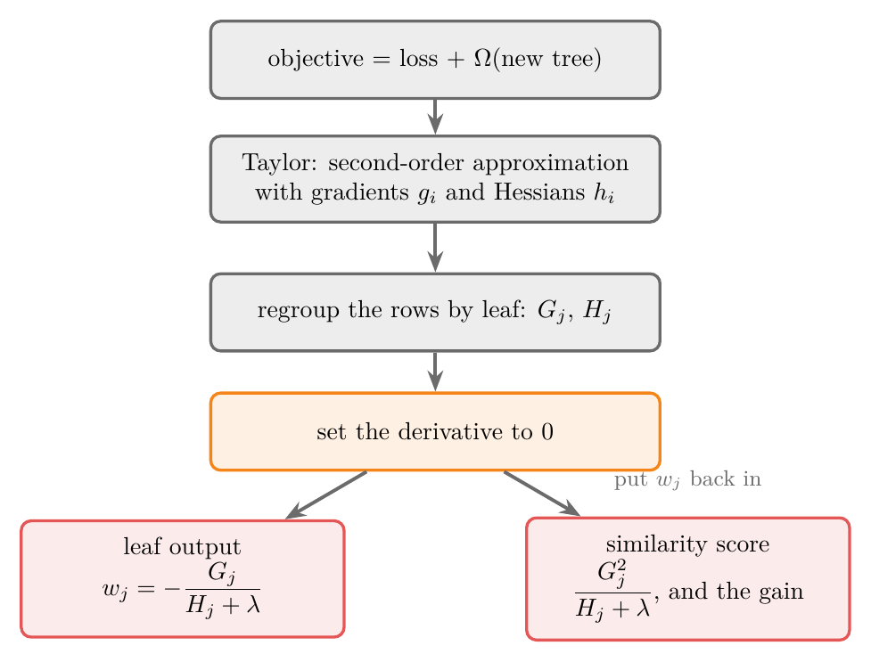
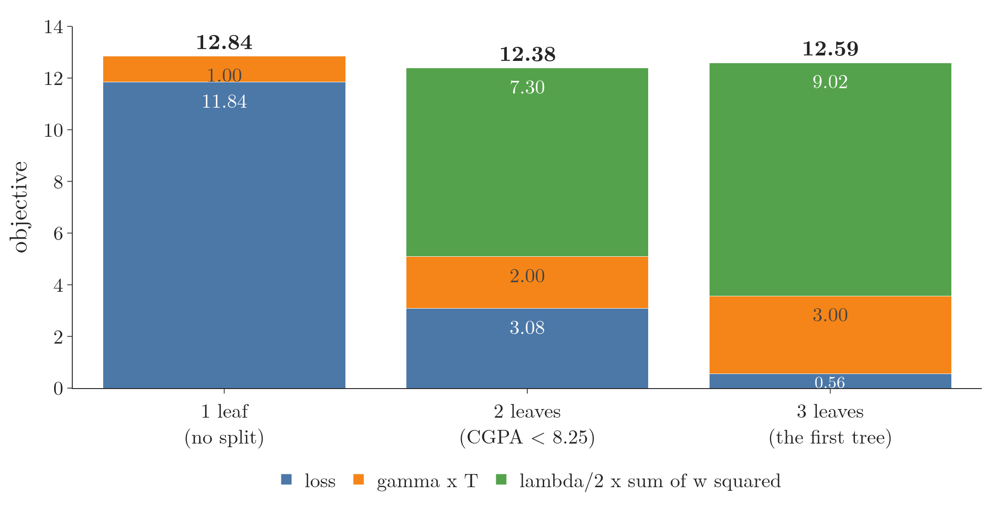
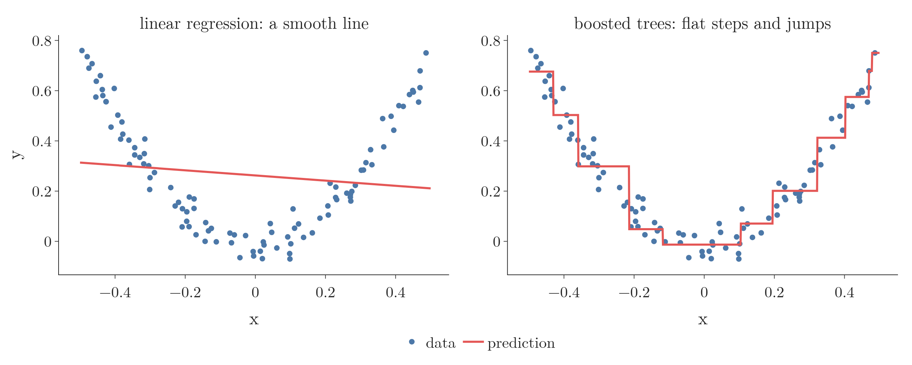
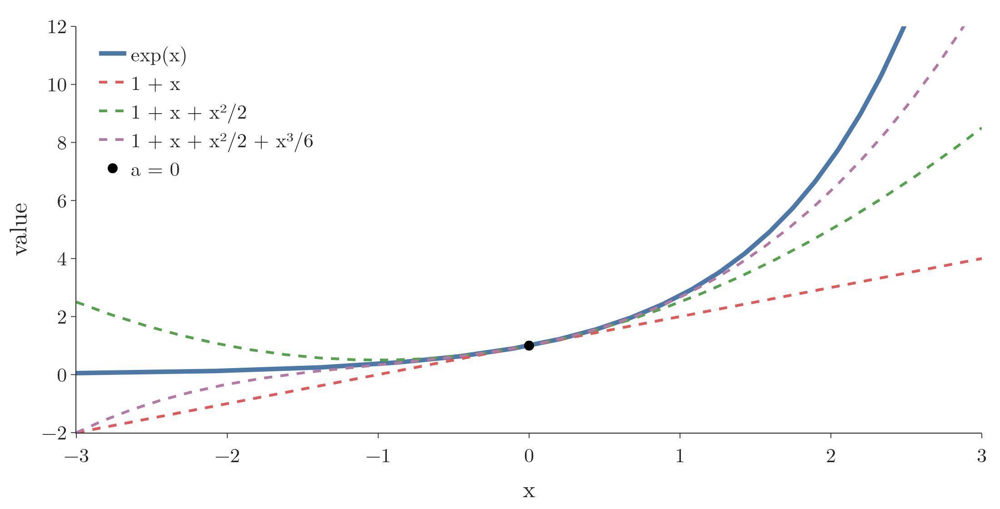
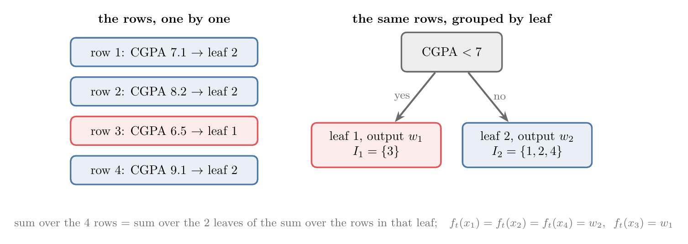
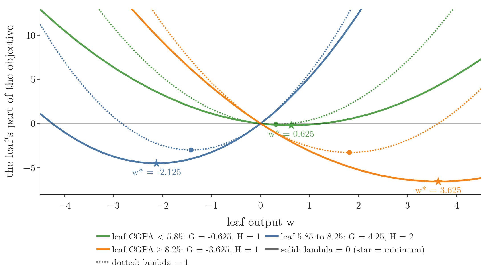
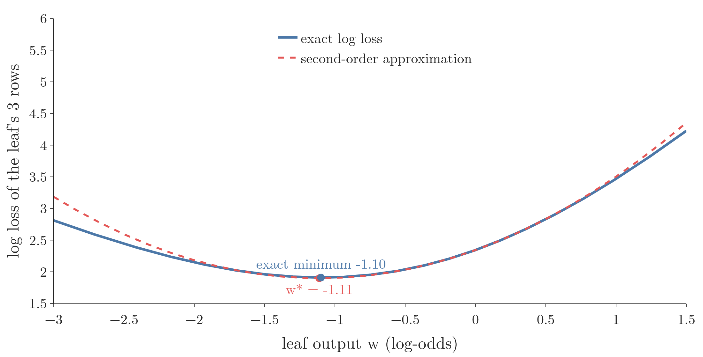
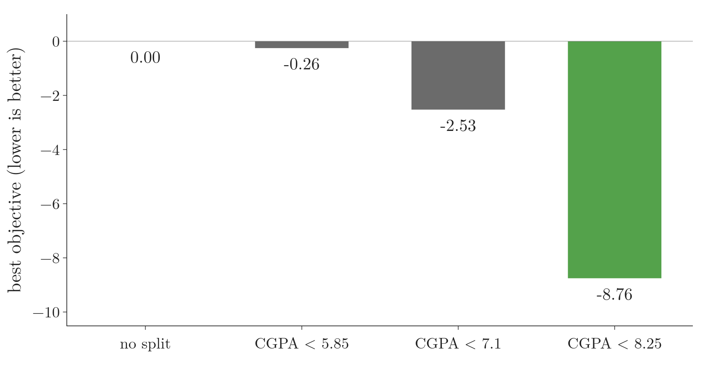

<!-- where-this-fits: generated by course_map/build_map.py; edit concepts.yaml, not this block -->
> **Where this fits:** Pipeline map steps 0 (Foundations), 8 (Model). See the [Course map](../../../00-course-map/00-course-map.md).
>
> 
>
> - **Builds on:** [Missing values](../../../ML/01-foundations/ML-007-challenges-in-ml/ML-007-challenges-in-ml.md#5-poor-quality-data); [Binning and binarization](../../../ML/03-feature-engineering/ML-022-what-is-feature-engineering/ML-022-what-is-feature-engineering.md#63-binning-numbers-into-categories); [Regularisation](../../../ML/06-regression/ML-062-ridge-regression-intuition/ML-062-ridge-regression-intuition.md#1-overview); [Gradient boosting](../../../ML/08-trees-and-ensembles/ML-114-gradient-boosting-intuition/ML-114-gradient-boosting-intuition.md#13-gradient-boosting-compared-with-adaboost); [Eigenvectors and eigenvalues](../../../MA/05-linear-algebra/MA-056-eigenvectors-and-eigenvalues/MA-056-eigenvectors-and-eigenvalues.md#2-eigenvectors-stay-on-their-own-span); [Derivatives of one variable](../../../MA/06-calculus/MA-061-derivatives-of-one-variable/MA-061-derivatives-of-one-variable.md#1-overview).
> - **Leads to:** [Convex and non-convex loss](../../../MA/07-optimisation/MA-065-convex-and-non-convex-cost-functions/MA-065-convex-and-non-convex-cost-functions.md#32-why-convexity-matters-one-minimum).
<!-- /where-this-fits -->

## 1. Overview

> **Key point:** XGBoost's formulas all come from one calculation: write the objective (loss + a penalty on the new tree), approximate it with a second-order Taylor series, group the observations (the records of the data) by leaf, and minimise. The minimum gives the leaf output; its value gives the similarity score and the gain.

{height=42%}

[XGBoost regression](../ML-118-xgboost-regression/ML-118-xgboost-regression.md#4-the-similarity-score) and [XGBoost classification](../ML-119-xgboost-classification/ML-119-xgboost-classification.md#5-the-similarity-score-for-classification) used four formulas without proof (in them, $r_i$ is the residual, actual minus predicted, $p_i$ the predicted probability, $n$ the number of observations in a leaf and $\lambda$ a penalty strength):

| | Regression | Classification |
|---|---|---|
| Similarity score | $(\sum r_i)^2 \thinspace/\thinspace(n + \lambda)$ | $(\sum r_i)^2 \thinspace/\thinspace(\sum p_i(1-p_i) + \lambda)$ |
| Output value | $\sum r_i \thinspace/\thinspace(n + \lambda)$ | $\sum r_i \thinspace/\thinspace(\sum p_i(1-p_i) + \lambda)$ |

This Note derives all four, following the XGBoost paper (Chen and Guestrin 2016, §2). Figure 1 is the plan. The maths needs derivatives (slopes) and the chain rule (see [which way to move](../../06-regression/ML-056-gradient-descent/ML-056-gradient-descent.md#21-which-way-to-move) and [the pseudo-residuals](../ML-115-gradient-boosting-regression-maths/ML-115-gradient-boosting-regression-maths.md#6-step-2a-pseudo-residuals-are-negative-gradients)) and the gradient boosting algorithm ([the algorithm in three steps](../ML-115-gradient-boosting-regression-maths/ML-115-gradient-boosting-regression-maths.md#1-overview)).

## 2. A boosting model is a sum of functions

> **Key point:** The prediction is the base model plus the output of every tree. Each tree is a function of the input, so the whole model is a sum of functions.

Take students with CGPA, IQ and a package. The base model is the mean, say 14.5 LPA. The second model is a tree trained on the residuals; for a student with CGPA 9 and IQ 102 it lands in a leaf with output 2.1. The prediction is the base plus the leaf:

$$14.5 + 2.1 = 16.6$$

Every model here is a function: input in, number out. A tree computes its number with if-else questions, but it is still a function. Each student is one **observation** (G-1374; one record, a row of the data table); CGPA and IQ are **features** (G-772; input variables, the columns), and the package is the **target** (G-1949; the output we predict). Calling the models $f_1, f_2, \dots, f_t$, the prediction $\hat y_i$ (read "y hat") for observation $i$ is

$$\hat y_i = f_1(x_i) + f_2(x_i) + \dots + f_t(x_i) = \sum_{k=1}^{t} f_k(x_i)$$

where $\sum_{k=1}^{t}$ means "add the term for $k = 1, 2$, up to $t$".

The sum of functions is [the additive model](../ML-115-gradient-boosting-regression-maths/ML-115-gradient-boosting-regression-maths.md#3-additive-modelling-a-complex-function-as-a-sum-of-simple-ones). (The learning rate is left out of the maths; it is applied afterwards, when the tree is added.)

Figure 2 shows the sum on the four students of [the XGBoost regression data](../ML-118-xgboost-regression/ML-118-xgboost-regression.md#2-the-data-cgpa-and-package). Watch the right panel: adding the flat line $f_1$ and the step function $f_2$ point by point gives a staircase, and that staircase is the model.

{height=30%}

## 3. What we must find: the leaf weights

> **Key point:** Once the newest tree's splits are fixed, the only unknowns are its leaf outputs $w_1, \dots, w_T$. We want the values that make the loss smallest.

A tree with $T$ leaves gives one of $T$ numbers, depending on the leaf an observation lands in. These leaf outputs are also called **leaf weights** (G-1063), written $w_1, w_2, \dots, w_T$. A tree with 3 leaves has three unknowns, not one.

Good leaf weights bring each prediction $\hat y_i$ close to the true value $y_i$. The gap between them is measured by a loss function $L(y_i, \hat y_i)$, such as squared error (see [mean squared error](../../06-regression/ML-051-regression-metrics/ML-051-regression-metrics.md#3-mean-squared-error-mse)). So the task is an optimisation problem: choose the $w_j$ that make the total loss smallest.

## 4. The objective: loss plus a penalty on the tree

> **Key point:** Gradient boosting minimises the loss alone. XGBoost minimises the loss plus a penalty $\Omega(f)$, which punishes trees with many leaves and with large leaf outputs:
>
> $$\Omega(f) = \gamma T + \frac{1}{2}\lambda \sum w_j^2$$

Gradient boosting accepts any differentiable loss and minimises $\sum_i L(y_i, \hat y_i)$. XGBoost adds a **regularisation term** (G-1658; a penalty that keeps the model simple, see [the idea of Ridge](../../06-regression/ML-062-ridge-regression-intuition/ML-062-ridge-regression-intuition.md#3-the-idea-penalise-large-coefficients)) $\Omega$ for the newest tree. The sum of the two is called the **objective function** (G-1372; G-1371 for XGBoost's): loss plus regularisation.

1. **In words:** the total loss over all observations, plus $\gamma$ times the number of leaves, plus half of $\lambda$ times the sum of the squared leaf weights.
2. **Formula:**
   $$\text{Obj} = \sum_{i=1}^{n} L(y_i, \hat y_i) + \Omega(f)$$
   $$\Omega(f) = \gamma T + \frac{1}{2}\lambda \sum_{j=1}^{T} w_j^2$$
3. **Example:** the first tree of [the output values of the leaves](../ML-118-xgboost-regression/ML-118-xgboost-regression.md#8-output-values-of-the-leaves) has $T = 3$ leaves with outputs 0.625, $-2.125$ and 3.625. With $\gamma = 1$ and $\lambda = 1$:
   $$0.625^2 + 2.125^2 + 3.625^2 = 18.05$$
   $$\Omega = 1 \times 3 + \frac{1}{2} \times 1 \times 18.05$$
   $$\Omega = 3 + 9.02 = 12.02$$

Both parameters are hyperparameters (settings we choose before training). A larger $\gamma$ makes every extra leaf cost more; a larger $\lambda$ makes large outputs cost more, as the L2 penalty does in ridge regression (see [why the slope shrinks](../../06-regression/ML-063-ridge-regression-maths/ML-063-ridge-regression-maths.md#24-why-the-slope-shrinks)).

Figure 3 adds up the objective for three trees on the same students, with $\gamma = \lambda = 1$ and the loss $\frac{1}{2}(y - \hat y)^2$. Watch the blue loss fall as the tree grows while the orange and green penalties rise: the 3-leaf tree fits best, but its penalty of 12.02 makes the 2-leaf tree the cheapest overall (12.38 against 12.59).

{height=34%}

Figure 4 shows what $\lambda$ does to one leaf. The leaf holds students 1 and 3 of [the regression example](../ML-118-xgboost-regression/ML-118-xgboost-regression.md#3-stage-1-the-mean-and-its-residuals), with residuals $-2.875$ and $-1.375$. The blue curve is the leaf's loss for each possible output $w$; the green curve is the penalty $\frac{1}{2}\lambda w^2$; the black curve is their sum, and the red dot is its lowest point. With $\lambda = 0$ the dot sits at the mean residual, $-2.125$. Watch the dot as $\lambda$ grows: the penalty pulls it towards 0, to $-1.417$ at $\lambda = 1$ and $-0.354$ at $\lambda = 10$. Section 10 derives the formula in the title.

{height=45%}

> **Extra:** The $\gamma$ here is a penalty per leaf, not the $\gamma_{jm}$ used for leaf values in [the best value for each leaf](../ML-115-gradient-boosting-regression-maths/ML-115-gradient-boosting-regression-maths.md#8-step-2c-the-best-value-for-each-leaf); the two papers just use the same Greek letter. In this Note leaf values are always $w_j$.

## 5. The objective, stage by stage

> **Key point:** At stage $t$ everything before is fixed; only the new tree $f_t$ is unknown. The objective is the loss of (old prediction + $f_t(x_i)$) plus $\Omega(f_t)$.

Write the objective at each stage. The base model $f_1$ is a constant, not a tree, so it gets no $\Omega$.

- **Stage 1** (base model only):
  $$\text{Obj}^{(1)} = \sum_i L\big(y_i, f_1(x_i)\big)$$
- **Stage 2:**
  $$\text{Obj}^{(2)} = \sum_i L\big(y_i, f_1(x_i) + f_2(x_i)\big) + \Omega(f_2)$$
- **Stage 3:**
  $$\text{Obj}^{(3)} = \sum_i L\big(y_i, f_1(x_i) + f_2(x_i) + f_3(x_i)\big) + \Omega(f_3)$$

Only the newest tree gets a penalty: the earlier trees were already penalised at their own stages and are now fixed.

At a general stage $t$, everything up to $f_{t-1}$ is already known. We call that sum $\hat y_i^{(t-1)}$, the prediction after $t - 1$ stages.

1. **In words:** the loss of each observation when the new tree's output is added to the old prediction, summed over the observations, plus the penalty on the new tree.
2. **Formula:**
   $$\text{Obj}^{(t)} = \sum_{i=1}^{n} L\big(y_i,\ \hat y_i^{(t-1)} + f_t(x_i)\big) + \Omega(f_t)$$
3. **Example:** in [stage 2 of the regression example](../ML-118-xgboost-regression/ML-118-xgboost-regression.md#9-stage-2-adding-the-tree-with-a-learning-rate), student 1 has $y_1 = 4.5$ and $\hat y_1^{(1)} = 7.375$. With squared error, the loss is:
   $$L = \frac{1}{2}(y - \hat{y})^2$$
   For student 1 it becomes:
   $$\frac{1}{2}\big(4.5 - 7.375 - f_2(x_1)\big)^2$$
   This is small when $f_2(x_1)$ is close to $-2.875$, the residual.

The goal is to choose the new tree, and so its leaf weights, to make $\text{Obj}^{(t)}$ as small as possible.

## 6. Why XGBoost approximates the loss

> **Key point:** For a general loss, the best leaf weights have no simple formula. XGBoost replaces the loss by a parabola that is easy to minimise, and the same recipe then works for every loss.

In linear regression the prediction is $mx + b$. The unknowns are two numbers, $m$ and $b$, so we set the derivatives of the loss to 0 ([the two formulas](../../06-regression/ML-050-linear-regression-maths/ML-050-linear-regression-maths.md#45-the-two-formulas)) or walk downhill ([the idea of gradient descent](../../06-regression/ML-056-gradient-descent/ML-056-gradient-descent.md#2-the-idea)).

A boosted model is different in two ways (Figure 5, right):

1. **The unknowns are trees, not numbers.** A tree is a set of splits plus leaf weights. Splits cannot be found by setting a derivative to 0, so the model is built greedily: one tree at a time, and inside a tree one split at a time, each chosen by trying the candidates (Chen and Guestrin 2016, §2.2).
2. **The leaf weights have no simple formula for a general loss.** Once the splits are fixed, the objective is a smooth function of the leaf weights $w_j$, and we can differentiate it. For squared error the derivative gives a formula at once. For log loss, setting the derivative to 0 gives an equation with no simple formula for the answer (Extra in section 12).

Gradient boosting handled each loss in its own way: the mean of the residuals for squared error, a special formula for log loss. XGBoost uses one method for every loss: approximate the loss near the current prediction by a parabola, and minimise the parabola. In the paper's words, the second-order approximation "can be used to quickly optimize the objective in the general setting" (Chen and Guestrin 2016, §2.2).

A hiker in fog does the same: she cannot see the whole valley, so she judges the slope and the curve of the ground under her feet, steps to the bottom of that local bowl, and looks again. The tool for this is the Taylor series.

## 7. The Taylor series

> **Key point:** Near a point $a$, any smooth function can be approximated by a polynomial built from its derivatives at $a$. More terms give a better approximation over a wider range.

The **Taylor series** (G-1954) approximates a complicated function by a polynomial. The polynomial uses the function's value and derivatives at one point $a$.

1. **In words:** start from the value at $a$, add the slope times the distance from $a$, add half the second derivative times the distance squared, and so on.
2. **Formula:**
   $$f(x) \approx f(a) + \frac{f'(a)}{1!}(x - a) + \frac{f''(a)}{2!}(x - a)^2$$
   $$\quad + \frac{f'''(a)}{3!}(x - a)^3 + \dots$$
   $f'$, $f''$ and $f'''$ are the first, second and third derivatives; $2! = 2$ and $3! = 6$.
3. **Example:** $f(x) = e^x$ around $a = 0$. Every derivative of $e^x$ is $e^x$, and $e^0 = 1$, so
   $$e^x \approx 1 + x + \frac{x^2}{2} + \frac{x^3}{6}$$
   At $x = 0.5$:
   $$1 + 0.5 + 0.125 + 0.0208 = 1.6458$$
   The true value is:
   $$e^{0.5} = 1.6487$$

{height=40%}

Figure 6 shows the pattern. The straight line $1 + x$ is right only near 0. Adding $x^2/2$ follows the curve further, and adding $x^3/6$ further still. XGBoost stops at the second-order term, a parabola.

## 8. The second-order approximation of the objective

> **Key point:** Expand each observation's loss around the old prediction: loss $\approx$ old loss + $g_i f_t(x_i)$ + $\frac{1}{2} h_i f_t(x_i)^2$, with $g_i$ the gradient and $h_i$ the Hessian of the loss at the old prediction.

We apply the Taylor series to each observation's loss $L(y_i, \hat y_i^{(t-1)} + f_t(x_i))$, seen as a function of the prediction. The point we expand around is the old prediction, and the step away from it is the new tree's output:

- $x = \hat y_i^{(t-1)} + f_t(x_i)$ (the new prediction);
- $a = \hat y_i^{(t-1)}$ (the old prediction);
- $x - a = f_t(x_i)$ (the new tree's output).

Two names for the derivatives at the old prediction:

- the **gradient** (G-863; G-857 for $g_i$) $g_i$: the first derivative of the loss with respect to the prediction;
- the **Hessian** (G-887) $h_i$: the second derivative.

The symbol $\partial$ marks a derivative taken with respect to one quantity, here the prediction, with everything else held fixed. A small instance: the loss

$$L = \frac{1}{2}(y - \hat y)^2$$

with $y = 4.5$ and old prediction $\hat y = 7.375$:

$$g = \hat y - y = 7.375 - 4.5 = 2.875$$

$$h = 1$$

In general, for observation $i$, the two derivatives at the old prediction are:

$$g_i = \frac{\partial L(y_i, \hat y_i^{(t-1)})}{\partial \hat y_i^{(t-1)}}$$

$$h_i = \frac{\partial^2 L(y_i, \hat y_i^{(t-1)})}{\partial \big(\hat y_i^{(t-1)}\big)^2}$$

($\partial^2$ means the derivative taken twice.)

1. **In words:** each observation's new loss is approximately its old loss, plus its gradient times the new tree's output, plus half its Hessian times that output squared.
2. **Formula:**
   $$\text{Obj}^{(t)} \approx \sum_{i=1}^{n} \Big[ L\big(y_i, \hat y_i^{(t-1)}\big) + g_i f_t(x_i)$$
   $$\qquad + \frac{1}{2} h_i f_t(x_i)^2 \Big] + \Omega(f_t)$$
3. **Example:** squared error gives $g_i = \hat y_i - y_i$ and $h_i = 1$ (section 11). For student 1:
   $$g_1 = 7.375 - 4.5 = 2.875$$
   So with $f = f_t(x_1)$:
   $$\tfrac{1}{2}(2.875)^2 + 2.875 f + \tfrac{1}{2} f^2$$
   $$= \tfrac{1}{2}(2.875 + f)^2$$
   $$= \tfrac{1}{2}(4.5 - 7.375 - f)^2$$
   For squared error the approximation is exact, because the loss is already a parabola.

The first term, the old loss, does not depend on the new tree. The old loss does not change where the minimum is, so we drop it:

$$\tilde{\text{Obj}}^{(t)} = \sum_{i=1}^{n} \Big[ g_i f_t(x_i) + \frac{1}{2} h_i f_t(x_i)^2 \Big]$$
$$\quad + \gamma T + \frac{1}{2}\lambda \sum_{j=1}^{T} w_j^2$$

## 9. From a sum over observations to a sum over leaves

> **Key point:** Every observation in leaf $j$ gets the same output $w_j$. So we can add up the observations leaf by leaf; with $G_j$ and $H_j$ the sums of $g_i$ and $h_i$ in leaf $j$, the objective becomes a sum of one parabola per leaf.

The objective now has two sums of different kinds: one over the $n$ observations, one over the $T$ leaves. To minimise it we bring them under one sum, over the leaves.

{height=30%}

Figure 7 shows the idea with a tree "CGPA < 7" and four observations with CGPA 7.1, 8.2, 6.5 and 9.1. Observation 3 lands in leaf 1; observations 1, 2 and 4 land in leaf 2. The set of observations in leaf $j$ is its **instance set** (G-954) $I_j$: here $I_1 = \lbrace3\rbrace$ and $I_2 = \lbrace1, 2, 4\rbrace$.

Two facts make the regrouping work:

1. **The same observations, a different order.** Summing over all observations equals summing over the leaves, and inside each leaf over its observations:
   $$\sum_{i=1}^{4} = \sum_{i \in I_1} + \sum_{i \in I_2}$$
2. **Every observation in a leaf gets that leaf's output.** For $i \in I_j$, $f_t(x_i) = w_j$. Here:
   $$f_t(x_3) = w_1$$
   $$f_t(x_1) = f_t(x_2) = f_t(x_4) = w_2$$

So, for example, the gradient part becomes $g_3 w_1 + (g_1 + g_2 + g_4) w_2$. Writing the sums of the gradients and Hessians in leaf $j$ as

$$G_j = \sum_{i \in I_j} g_i$$

$$H_j = \sum_{i \in I_j} h_i$$

and collecting the $w_j^2$ terms with the penalty:

1. **In words:** for each leaf, its gradient sum times its output, plus half of (its Hessian sum plus $\lambda$) times its output squared; add over the leaves, then add $\gamma T$.
2. **Formula:**
   $$\tilde{\text{Obj}}^{(t)} = \sum_{j=1}^{T} \Big[ G_j w_j + \frac{1}{2}(H_j + \lambda) w_j^2 \Big] + \gamma T$$
3. **Example:** the leaf of the regression tree holding students 1 and 3 (residuals $-2.875$ and $-1.375$) has $g = 2.875$ and $1.375$. So:
   $$G = 2.875 + 1.375 = 4.25$$
   $$H = 1 + 1 = 2$$
   With $\lambda = 0$ its part of the objective is:
   $$4.25\thinspace w + w^2$$

Each leaf now has its own small parabola in its own $w_j$, independent of the other leaves.

## 10. The best leaf output

> **Key point:** Set the derivative of each leaf's parabola to 0: $w_j^\ast= -G_j / (H_j + \lambda)$, where $w_j^\ast$ (read "w star") is the best value of $w_j$.

Differentiate $G_j w_j + \frac{1}{2}(H_j + \lambda) w_j^2$ with respect to $w_j$; the other leaves and $\gamma T$ do not contain $w_j$ and drop out.

$$\frac{\partial \tilde{\text{Obj}}}{\partial w_j} = G_j + (H_j + \lambda) w_j = 0$$

1. **In words:** the best output of a leaf is minus its gradient sum divided by (its Hessian sum plus $\lambda$).
2. **Formula:**
   $$w_j^\ast= -\frac{G_j}{H_j + \lambda}$$
3. **Example:** the leaf of section 9, with $G = 4.25$, $H = 2$, $\lambda = 0$:
   $$w^\ast= -\frac{4.25}{2 + 0} = -2.125$$
   the output found in [the output values of the leaves](../ML-118-xgboost-regression/ML-118-xgboost-regression.md#8-output-values-of-the-leaves). With $\lambda = 1$:
   $$-4.25/3 = -1.42$$

The Notebook checks this against a brute-force search over a fine grid of $w$ values: the minimum lands at the same place. Because $H_j + \lambda > 0$, the parabola opens upwards, so this point is a minimum, not a maximum.

Figure 8 draws the three parabolas of the regression tree. Watch each star sit at its own $-G_j/(H_j + \lambda)$, independent of the other leaves; with $\lambda = 1$ (dotted) each parabola gets steeper and its minimum moves towards 0.

{height=38%}

## 11. Regression: gradient and Hessian of squared error

> **Key point:** For squared error, the loss is:
>
> $$L = \frac{1}{2}(y - \hat{y})^2$$
>
> The gradient is minus the residual $r_i$ and the Hessian is 1:
>
> $$g_i = \hat y_i - y_i = -r_i$$
>
> $$h_i = 1$$
>
> So $w^\ast$ is the regression output formula:
>
> $$w^\ast= \sum r_i / (n + \lambda)$$

1. **In words:** the gradient is minus the residual; the Hessian is 1 for every observation.
2. **Formula:** with the chain rule,
   $$g_i = \frac{\partial}{\partial \hat y_i} \frac{1}{2}(y_i - \hat y_i)^2$$
   $$g_i = -(y_i - \hat y_i) = -r_i$$
   $$h_i = \frac{\partial}{\partial \hat y_i}(\hat y_i - y_i) = 1$$
   Here $\hat y_i$ is the previous stage's prediction, so $r_i$ is the residual the new tree is fitted to. In a leaf with $n$ observations, $G_j = -\sum r_i$ and $H_j = n$:
   $$w_j^\ast= -\frac{-\sum r_i}{n + \lambda} = \frac{\sum r_i}{n + \lambda}$$
3. **Example:** student 4 alone in a leaf, residual 0.625:
   $$w^\ast= 0.625/(1 + 0) = 0.625$$

The $\frac{1}{2}$ in the loss is there only to cancel the 2 from the square, as in [the loss function](../ML-115-gradient-boosting-regression-maths/ML-115-gradient-boosting-regression-maths.md#42-the-loss-function). XGBoost's `reg:squarederror` uses exactly this loss, with gradient $\hat{y} - y$ and Hessian 1.

## 12. Classification: gradient and Hessian of log loss

> **Key point:** For log loss, measured in log-odds, the gradient is minus the residual $r_i$ and the Hessian is $p_i(1 - p_i)$:
>
> $$g_i = p_i - y_i = -r_i$$
>
> $$h_i = p_i(1 - p_i)$$
>
> So $w^\ast$ is the classification output formula:
>
> $$w^\ast= \sum r_i / \Big(\sum p_i(1-p_i) + \lambda\Big)$$

In classification the model adds up log-odds, so the "prediction" we differentiate with respect to is the log-odds $z$. The two derivatives of log loss with respect to $z$ are worked out in [pseudo-residuals: class minus probability](../ML-116-gradient-boosting-classification/ML-116-gradient-boosting-classification.md#6-pseudo-residuals-class-minus-probability) (using [the derivative of the sigmoid](../../07-classification/ML-073-sigmoid-derivative/ML-073-sigmoid-derivative.md#33-the-result)):

$$g_i = p_i - y_i$$

$$h_i = p_i(1 - p_i)$$

with $p_i$ the previous stage's probability.

1. **In words:** the gradient is minus the residual in probability; the Hessian is $p(1-p)$.
2. **Formula:**
   $$w_j^\ast= -\frac{\sum (p_i - y_i)}{\sum p_i(1 - p_i) + \lambda}$$
   $$w_j^\ast= \frac{\sum r_i}{\sum p_i(1 - p_i) + \lambda}$$
3. **Example:** the left leaf of [the output values in log-odds](../ML-119-xgboost-classification/ML-119-xgboost-classification.md#7-output-values-in-log-odds): classes 0, 1, 0, each with $p = 0.6$.
   $$G = 0.6 - 0.4 + 0.6 = 0.8$$
   $$H = 3 \times 0.24 = 0.72$$
   So:
   $$w^\ast= -\frac{0.8}{0.72 + 0} = -1.11$$

{height=40%}

For log loss the parabola is only an approximation (Figure 9). Its minimum is $-1.11$. The true minimum of the log loss is close to it:

$$\ln 0.5 - \ln 1.5 = -1.10$$

The intuition: each new tree starts again from the new predictions, so the small error is corrected rather than carried along. A Notebook test agrees: over 100 trees the error did not build up (Extra below).

Figure 10 moves the touching point. Watch the parabola: wherever we expand, it touches the loss at that point $a$ with the same slope and curvature, and its minimum (the star, $a - g/h$) is a good guess only when $a$ is near the true minimum; from $a = 1.2$ it overshoots to $-2.39$. Each tree expands around the current predictions, so XGBoost always uses the parabola where it fits. At the end, $\lambda$ grows from 0 to 3: the parabola gets steeper and $w^\ast$ shrinks towards 0, as section 10 says:

$$w^\ast= -0.8/(0.72 + \lambda)$$

> **Extra:** The exact best output of a leaf solves $\sum_i \sigma(z_i + w) = \sum_i y_i$, where $z_i$ is observation $i$'s previous log-odds (set the derivative of the leaf's log loss to 0). Here all three observations share one $z_i$, so the equation has a formula; in general it does not, and XGBoost uses the parabola instead. Does the parabola's small error build up? The Notebook (section 6) grows 100 trees of depth 3 ($\eta = 0.3$) on 2,000 synthetic observations, half for testing, twice with the same tree-growing rule: once with the Newton outputs $-G/H$, once with each leaf's exact minimum.
>
> | Trees | Train log loss, Newton | Train log loss, exact | Test log loss, Newton | Test log loss, exact |
> |---|---|---|---|---|
> | 1 | 0.527 | 0.472 | 0.545 | 0.499 |
> | 10 | 0.199 | 0.170 | 0.280 | 0.268 |
> | 50 | 0.057 | 0.040 | 0.261 | 0.264 |
> | 100 | 0.016 | 0.007 | 0.282 | 0.312 |
>
> The Newton outputs lower the training loss a little less per tree, but the gap does not grow: it shrinks from 0.055 after one tree to 0.009 after 100. On the test half the two are about equal at 10 to 50 trees. So, on this data, the approximation does not build up into a large error.

> **Extra:** This is Newton's method: a step to the minimum of the local parabola, using both the slope ($g$) and the curvature ($h$). scikit-learn's gradient boosting chooses its splits with the gradient alone and uses $h$ only for the leaf outputs; XGBoost uses $h$ for both the splits and the leaves (Sigrist 2021). The same $g$ and $h$ are what a custom loss must supply (see [a custom loss function](../../09-clustering-and-more/ML-127-imbalanced-data/ML-127-imbalanced-data.md#92-a-custom-loss-function)).

## 13. The best objective, and the similarity score

> **Key point:** Put $w_j^\ast$ back into the objective: the smallest objective a tree can reach is $-\frac{1}{2}\sum_j G_j^2/(H_j + \lambda) + \gamma T$. The term $G_j^2/(H_j + \lambda)$ is the similarity score.

Substituting $w_j^\ast= -G_j/(H_j + \lambda)$ into one leaf's part, $G_j w_j + \frac{1}{2}(H_j + \lambda) w_j^2$:

$$-\frac{G_j^2}{H_j + \lambda} + \frac{1}{2}(H_j + \lambda)\frac{G_j^2}{(H_j + \lambda)^2}$$
$$= -\frac{G_j^2}{H_j + \lambda} + \frac{1}{2}\frac{G_j^2}{H_j + \lambda}$$
$$= -\frac{1}{2}\frac{G_j^2}{H_j + \lambda}$$

1. **In words:** the best objective of a tree is minus a half of the sum over its leaves of (gradient sum squared over Hessian sum plus $\lambda$), plus $\gamma$ per leaf.
2. **Formula:**
   $$\tilde{\text{Obj}}^{\ast} = -\frac{1}{2}\sum_{j=1}^{T} \frac{G_j^2}{H_j + \lambda} + \gamma T$$
3. **Example:** the regression tree with one split at CGPA < 8.25, $\lambda = \gamma = 0$. Left:
   $$G = 2.875 + 1.375 - 0.625 = 3.625$$
   $$H = 3$$
   Right:
   $$G = -3.625$$
   $$H = 1$$
   $$\frac{3.625^2}{3} = 4.38$$
   $$\frac{3.625^2}{1} = 13.14$$
   $$\tilde{\text{Obj}}^{\ast} = -\frac{1}{2}(4.38 + 13.14) = -8.76$$

This number is the tree's **structure score** (G-1905): the lower it is, the better the tree's structure. Figure 11 scores the three candidate root splits of the regression tree this way: CGPA < 8.25 reaches $-8.76$, far below the others, the same winner the gain picked.

{height=32%}

The paper uses it as a score for a tree, like the impurity of a decision tree but valid for a wider range of losses (Chen and Guestrin 2016, §2.2).

The term in each leaf, $G_j^2/(H_j + \lambda)$, is the **similarity score** (G-1804). Since $G_j = -\sum r_i$, squaring removes the sign:

- regression ($h = 1$): $(\sum r_i)^2 / (n + \lambda)$;
- classification ($h = p(1-p)$): $(\sum r_i)^2 / (\sum p_i(1-p_i) + \lambda)$.

These are the two similarity formulas of the table in section 1.

## 14. The gain of a split

> **Key point:** Gain is the objective before the split minus the objective after it:
>
> $$\text{Gain} = \frac{1}{2}\big[S_L + S_R - S_{\text{parent}}\big] - \gamma$$
>
> The worked regression and classification examples drop the $\frac{1}{2}$ and compare with $\gamma$ separately, which is exactly what the XGBoost library does.

A split turns one leaf (the parent, with observations $I$) into two (left $I_L$ and right $I_R$). The number of leaves grows by 1, so the penalty grows by $\gamma$.

- Before: $-\frac{1}{2}\thinspace G^2/(H + \lambda) + \gamma$, with $G = G_L + G_R$ and $H = H_L + H_R$.
- After: $-\frac{1}{2}\big(G_L^2/(H_L + \lambda) + G_R^2/(H_R + \lambda)\big) + 2\gamma$.

1. **In words:** the gain is how much the split lowers the objective: half of (left similarity + right similarity $-$ parent similarity), minus $\gamma$ for the extra leaf.
2. **Formula:**
   $$\text{Gain} = \frac{1}{2}\Big[\frac{G_L^2}{H_L + \lambda} + \frac{G_R^2}{H_R + \lambda} - \frac{(G_L + G_R)^2}{H_L + H_R + \lambda}\Big] - \gamma$$
3. **Example:** the root split of the regression tree, $\lambda = \gamma = 0$ (parent similarity 0, section 13):
   $$\text{Gain} = \frac{1}{2}\thinspace(4.38 + 13.14 - 0) - 0$$
   $$= \frac{1}{2} \times 17.52$$
   $$= 8.76$$
   which is $0 - (-8.76)$, the drop in the best objective.

The split is worth making only if the gain is positive. With $\gamma > 0$, a split must lower the loss by more than the price of one extra leaf: this is the pruning rule of [gamma: pruning weak splits](../ML-118-xgboost-regression/ML-118-xgboost-regression.md#13-gamma-pruning-weak-splits).

The worked regression and classification examples used $S_L + S_R - S_{\text{parent}}$, without the $\frac{1}{2}$, and got 17.52 for this split. The $\frac{1}{2}$ only rescales every gain by the same factor, so the best split is the same either way.

The XGBoost library follows the same convention as those examples. Its tree dump prints `gain=17.520834` for this split, and it removes a split when that unhalved gain is below `gamma`: in the Notebook the lower split (gain 5.04) survives `gamma=5.0` and disappears at `gamma=5.1`. So the library's `gamma` corresponds to $2\gamma$ in the paper's formula.

## 15. Summary

| Step | Result | Why |
|---|---|---|
| Objective at stage $t$ | $\sum_i L(y_i, \hat y_i^{(t-1)} + f_t(x_i)) + \gamma T + \frac{1}{2}\lambda\sum_j w_j^2$ | the penalty makes extra leaves and large outputs cost something |
| Taylor, second order | $\sum_i [g_i f_t(x_i) + \frac{1}{2} h_i f_t(x_i)^2] + \Omega(f_t)$ | a parabola is easy to minimise, whatever the loss |
| Grouped by leaf | $\sum_j [G_j w_j + \frac{1}{2}(H_j + \lambda) w_j^2] + \gamma T$ | each leaf gets its own parabola, solved on its own |
| Best leaf output | $w_j^\ast= -G_j/(H_j + \lambda)$ | the bottom of that parabola: the output value formula |
| Best objective | $-\frac{1}{2}\sum_j G_j^2/(H_j + \lambda) + \gamma T$ | scores a whole tree (lower is better); each leaf's term is the similarity score |
| Gain of a split | $\frac{1}{2}[S_L + S_R - S_P] - \gamma$, with $S = G^2/(H + \lambda)$ | a split is kept only if it lowers the objective by more than the price of one leaf |
| Squared error | $g = -r$, $h = 1$ | gives the regression formulas, with $n$ in the denominator |
| Log loss (in log-odds) | $g = p - y$, $h = p(1-p)$ | gives the classification formulas, with $\sum p(1-p)$ in the denominator |

- XGBoost minimises loss plus a penalty on the number of leaves ($\gamma$) and on the size of their outputs ($\lambda$), so larger $\gamma$ and $\lambda$ give simpler trees, as the L2 penalty does in ridge regression.
- A second-order Taylor series turns any loss into one parabola per leaf, which is minimised in closed form, because for a general loss the best leaf weights have no simple formula.
- The leaf output and the similarity score both come from that minimisation; only $g$ and $h$ depend on the loss, so one derivation serves regression, classification and any other differentiable loss.
- The gain is the drop in the best objective after a split; the library drops the $\frac{1}{2}$ and compares with `gamma`, because the $\frac{1}{2}$ rescales every gain by the same factor and the best split stays the same (the library's `gamma` is $2\gamma$ in the paper's formula).
- So all four formulas used without proof in XGBoost regression and classification come from one calculation: penalised objective, Taylor parabola, grouping by leaf, minimum.

## 16. Sources

**Built from**

- CampusX, "The Maths Behind XGBoost | Machine Learning | CampusX", YouTube, https://www.youtube.com/watch?v=0Eo-_5bfers
- StatQuest with Josh Starmer, "XGBoost Part 3 (of 4): Mathematical Details", YouTube, https://www.youtube.com/watch?v=ZVFeW798-2I (a leaf's loss plotted against its output value, with the minimum moving towards 0 as lambda grows: the lambda figures of sections 4 and 12; one approximation for every loss, section 6)

**Other references**

- Chen, T. and Guestrin, C. (2016). *XGBoost: A Scalable Tree Boosting System*. KDD 2016 (arXiv:1603.02754).
- Sigrist, F. (2021). *Gradient and Newton Boosting for Classification and Regression*. Expert Systems with Applications (arXiv:1808.03064), section on software implementations.

## 17. Key terms

| Term | Meaning |
|---|---|
| Objective function | The quantity a model minimises: loss plus regularisation term |
| Regularisation term $\Omega$ | XGBoost's penalty on a tree: $\gamma T + \frac{1}{2}\lambda\sum_j w_j^2$ |
| Leaf weight $w_j$ | The output value of leaf $j$ of a tree |
| Taylor series | Approximation of a function near a point by a polynomial built from its derivatives there |
| Gradient $g_i$ | First derivative of observation $i$'s loss with respect to the previous prediction |
| Hessian $h_i$ | Second derivative of observation $i$'s loss with respect to the previous prediction |
| Instance set $I_j$ | The observations that land in leaf $j$ |
| Structure score | The best objective of a tree, $-\frac{1}{2}\sum_j G_j^2/(H_j + \lambda) + \gamma T$; lower is better |
