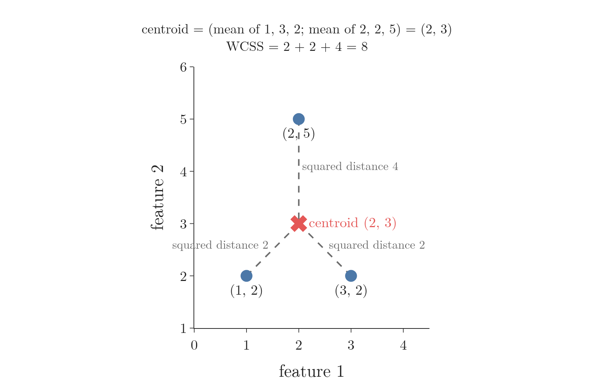
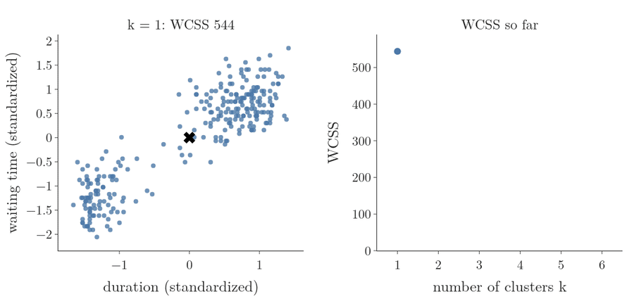
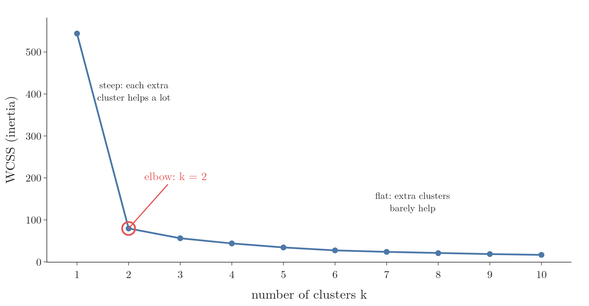
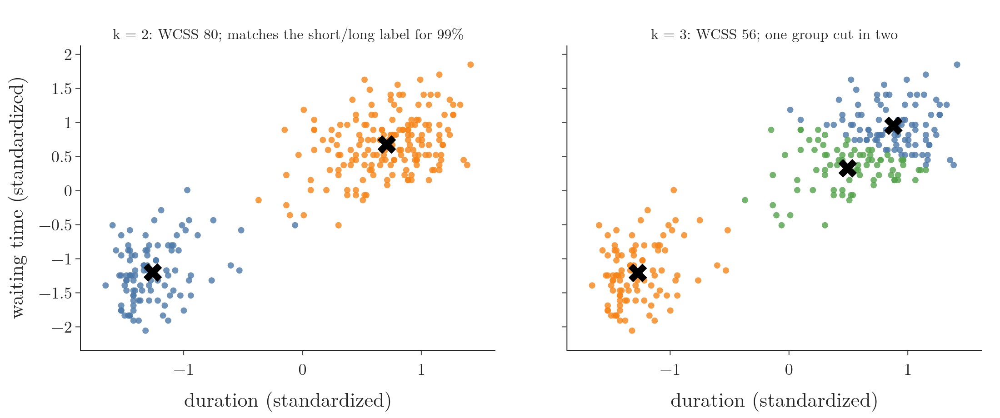

<!-- where-this-fits: generated by course_map/build_map.py; edit concepts.yaml, not this block -->
> **Where this fits:** Pipeline map steps 8 (Model), 10 (Tune). See the [Course map](../../../00-course-map/00-course-map.md).
>
> 
>
> - **Builds on:** [Clustering](../../../ML/01-foundations/ML-003-types-of-ml/ML-003-types-of-ml.md#32-clustering); [Feature scaling](../../../ML/03-feature-engineering/ML-023-standardization/ML-023-standardization.md#2-feature-scaling-in-brief); [Expectation maximization (EM)](../../../MA/08-likelihood/MA-074-expectation-maximization/MA-074-expectation-maximization.md#3-the-two-steps-and-the-algorithm).
> - **Leads to:** [K-means](../../../ML/09-clustering-and-more/ML-124-kmeans-from-scratch/ML-124-kmeans-from-scratch.md#1-overview).
> - **Compare with:** [Gaussian mixture model (GMM)](../../../MA/08-likelihood/MA-073-gaussian-mixture-models/MA-073-gaussian-mixture-models.md#6-the-mixture-density); [Hierarchical clustering](../../../ML/09-clustering-and-more/ML-125-hierarchical-clustering/ML-125-hierarchical-clustering.md#4-two-kinds-of-hierarchical-clustering); [DBSCAN](../../../ML/09-clustering-and-more/ML-126-dbscan/ML-126-dbscan.md#8-the-dbscan-algorithm-step-by-step).
<!-- /where-this-fits -->

## 1. Overview

> **Key point:** k-means splits the data into k clusters by repeating two moves: give every point to its nearest centroid, then move every centroid to the mean of its points. The elbow method helps us choose k.

**K-means** (G-996) is a **clustering** (G-401) algorithm: it puts similar **observations** (G-1374; records, one row of the data table each) in the same group without being told what the groups are (clustering is **unsupervised learning**, G-2058, learning from inputs only: see [clustering](../../01-foundations/ML-003-types-of-ml/ML-003-types-of-ml.md#32-clustering)). Clustering is used everywhere: e-commerce sites cluster customers, colleges cluster students, photo apps cluster images.

Binning ([k-means binning](../../03-feature-engineering/ML-031-binning-binarization/ML-031-binning-binarization.md#71-how-k-means-finds-the-bins)) already ran the k-means loop on a single column. This Note runs it on two **features** (G-772; input variables, one column of the data table each), where each observation is a point and distances are measured in a plane, and adds what was missing there: the starting centroids, the stopping test and how to choose k. Figure 1 shows the whole algorithm on 18 students.

{height=48%}

## 2. Prerequisites

- Clustering and unsupervised learning: [clustering](../../01-foundations/ML-003-types-of-ml/ML-003-types-of-ml.md#32-clustering).
- k-means on one column, and the word centroid: [k-means binning](../../03-feature-engineering/ML-031-binning-binarization/ML-031-binning-binarization.md#71-how-k-means-finds-the-bins).
- The Euclidean distance (the straight-line distance between two points): [the Euclidean distance](../../04-missing-data-and-outliers/ML-038-knn-imputer/ML-038-knn-imputer.md#41-the-euclidean-distance).
- Putting features on one scale (standardization): [the standardization formula](../../03-feature-engineering/ML-023-standardization/ML-023-standardization.md#4-the-standardization-formula).

## 3. Why we need a clustering algorithm

> **Key point:** With two features we can see the clusters by eye; with ten or a hundred features we cannot, and k-means does the same job in any number of dimensions.

Take the training and placement cell of a college. It has the CGPA and IQ of every final-year student and wants to split the students into groups, so that each group can be prepared for placements in its own way.

With only two features, a scatter plot is enough: we look at it and see, say, three groups. No algorithm is needed. Now add marks in class 10, marks in class 12, home state and parents' monthly income: 10 to 15 features. We can no longer draw the data, so we can no longer see the groups.

Many features are where k-means earns its place. We explain k-means in two dimensions, because two dimensions can be drawn. k-means needs only distances and means, and both work with any number of features, exactly as for KNN ([KNN with any number of features](../../07-classification/ML-085-knn/ML-085-knn.md#22-any-number-of-features)), so every step runs unchanged in 100 dimensions.

## 4. The five steps of k-means

> **Key point:** 1 choose k; 2 pick k starting centroids; 3 assign every point to its nearest centroid; 4 move each centroid to the mean of its points; 5 stop if no centroid moved, otherwise go back to step 3.

Steps 3 to 5 are the loop of [k-means binning](../../03-feature-engineering/ML-031-binning-binarization/ML-031-binning-binarization.md#71-how-k-means-finds-the-bins): assign every value to its nearest centroid, move each centroid to the mean of its values, repeat until nothing changes. Here we add what that Note left out: choosing k, the starting centroids, and the loop on two features, run on the 18 students of Figure 1.

### 4.1 Step 1: choose k

> **Key point:** k-means cannot find the number of clusters by itself; we must tell it k.

**k** is the number of clusters we want. k-means does not work it out from the data: looking at the students, it cannot decide whether there should be 3 or 4 groups. Choosing k is our job. Not every clustering method asks for k first: hierarchical clustering ([merging clusters step by step](../ML-125-hierarchical-clustering/ML-125-hierarchical-clustering.md#5-agglomerative-clustering-merge-by-merge)) builds a tree of merges and lets us choose the number of clusters afterwards.

The requirement sounds odd: if we cannot plot data with many features, how can we know k? Section 5 answers this with the elbow method. Until then we assume we know it: k = 3 for the students.

### 4.2 Step 2: pick the starting centroids

> **Key point:** k-means picks k points at random and treats them as the first centres of the clusters.

At the start there are no clusters yet, so k-means simply picks k data points at random and calls them **centroids** (G-367). This step is the **centroid initialization** (G-366).

In Figure 1 (stage 2, "Pick 3 starting centroids"), three students were picked at random. They are marked with crosses: blue, orange and green. Two of them happen to sit in the same group of students, a poor start; the next steps repair it.

### 4.3 Steps 3 and 4 on two features

> **Key point:** Distances become Euclidean distances in the plane, and each new centroid is the mean of each feature over the cluster's points.

**Assign.** For every point we compute its **Euclidean distance** (G-715; [the straight-line distance](../../04-missing-data-and-outliers/ML-038-knn-imputer/ML-038-knn-imputer.md#41-the-euclidean-distance)) to each of the k centroids, and the point joins the nearest one. With 18 students and 3 centroids, the number of distances per round is:

$$18 \times 3 = 54$$

In Figure 1 (stage 3, "Assign each student to its nearest centroid"), the green centroid is nearest to every student on the right and at the bottom, so all of them turn green; the orange centroid wins the top group; the blue centroid has only itself.

**Move.** The new centroid of a cluster is the mean CGPA and the mean IQ of its points. For example, a cluster with the points (1, 2), (3, 2) and (2, 5) gets the centroid

$$\left(\frac{1 + 3 + 2}{3},\ \frac{2 + 2 + 5}{3}\right) = (2,\ 3).$$

{width=60%}

Figure 2 draws this example.

The centroid is the mean, and not some other middle point, because the mean is the point with the smallest total squared distance to the cluster's points. The squared distance adds up feature by feature, and for one feature the number closest in squared distance to a set of values is their mean ([the best constant is the mean](../../08-trees-and-ensembles/ML-115-gradient-boosting-regression-maths/ML-115-gradient-boosting-regression-maths.md#5-step-1-the-best-constant-is-the-mean) derives this). So every move can only lower the WCSS of section 5.1.

In Figure 1 (stage 4, "Move each centroid to the mean of its points"), the green centroid moves to the middle of its many points, between the right and bottom groups. The orange centroid moves up into the top group.

> **Extra:** CGPA runs from about 4 to 10, IQ from about 70 to 140. In a raw squared Euclidean distance a gap of 10 IQ points adds $10^2 = 100$, while a gap of 2 CGPA points adds only $2^2 = 4$, so IQ would dominate the distances. Like [KNN](../../07-classification/ML-085-knn/ML-085-knn.md#32-split-and-scale), k-means is distance-based, so Figure 1 uses [standardized values](../../03-feature-engineering/ML-023-standardization/ML-023-standardization.md#41-the-idea-how-many-standard-deviations-from-the-mean) (each feature rescaled to mean 0 and spread 1).

### 4.4 Step 5: stop when the centroids stop moving

> **Key point:** Compare the new centroids with the old ones: if they moved, go back to step 3; if they did not, the clusters are final.

After each move we compare the centroids with where they were in the previous round. If they moved, the clusters may still change, so we assign every point again. If they did not, assigning again would give the same clusters and moving again the same centroids: the algorithm has finished. This is **convergence**.

In Figure 1, round 2 hands most bottom-left students, and the lone orange student on the left, to the blue centroid, which is now nearer to them. Round 3 moves the last one, the student at the very bottom. In round 4 no point changes cluster, so no centroid moves, and three clean clusters remain (Figure 1, last stage, "Centroids did not move: stop").

The clusters k-means ends with depend on the random start of step 2. A poor start can leave poor clusters, however many rounds we run. The usual fix is to run k-means several times from different random starts and keep the run with the lowest WCSS (section 5.1); scikit-learn does this with `n_init` (the number of random starts). [A bad start and the fix](../ML-124-kmeans-from-scratch/ML-124-kmeans-from-scratch.md#9-bad-random-starts) are shown in the from-scratch code.

## 5. Choosing k: the elbow method

> **Key point:** Run k-means for k = 1, 2, 3, ..., plot the WCSS of each, and pick the k where the curve bends from steep to flat: the **elbow method** (G-671).

Section 4 assumed k = 3 for the students. To see how k is chosen when we do not know it, this section switches to a real dataset whose true number of groups is known: 272 eruptions of the Old Faithful geyser, which come in two kinds, short and long (section 5.4). If the method works, it should pick k = 2 there.

### 5.1 WCSS: how tight the clusters are

> **Key point:** WCSS adds up, over all clusters, the squared distance from each point to its own centroid. Small WCSS means tight clusters.

**WCSS** (G-2102; within-cluster sum of squares) measures how far the points sit from their own centroids. scikit-learn calls the same number **inertia**. Figure 3 shows how it is built.

1. **In words:** for every point, take its distance to the centroid of its own cluster and square it. Add these up within each cluster, then add the clusters' totals.
2. **Formula:** with clusters $C_1, \dots, C_k$ and centroids $c_1, \dots, c_k$,
   $$\text{WCSS} = \sum_{j=1}^{k} \ \sum_{x \in C_j} \lVert x - c_j \rVert^2$$
   where $\lVert x - c_j \rVert$ is the Euclidean distance from point $x$ to centroid $c_j$.
3. **Example:** the cluster (1, 2), (3, 2), (2, 5) from section 4.3 has centroid (2, 3). The squared distances are
   $$(1-2)^2 + (2-3)^2 = 2$$
   $$(3-2)^2 + (2-3)^2 = 2$$
   $$(2-2)^2 + (5-3)^2 = 4$$
   So this cluster's WCSS is:
   $$2 + 2 + 4 = 8$$
   If a second cluster had WCSS 5, the total would be:
   $$8 + 5 = 13$$

### 5.2 The elbow curve

> **Key point:** The elbow curve plots WCSS against the number of clusters, k = 1 up to about 10 or 20.

To draw the **elbow curve** (G-670), we run k-means once for each k and record the WCSS:

1. **k = 1:** all points form one cluster, its centroid is the mean of all the data, and we compute the WCSS.
2. **k = 2:** k-means makes two clusters; we compute WCSS of each and add them.
3. **k = 3, 4, ...:** the same, up to 10, 15 or 20.

Figure 4 plays these steps on the Old Faithful data of section 5.4. Each frame raises k by one: the left panel shows the clusters k-means finds, and the right panel adds that k's WCSS to the curve. Watch how much the curve drops from k = 1 to k = 2, and how little after that.

Going much beyond 20 is rarely useful. A business will not treat its customers in 50 different ways.

### 5.3 WCSS always falls as k grows

> **Key point:** More clusters means each point can sit closer to a centroid, so WCSS shrinks; with one cluster per point it reaches 0.

Is WCSS for 1 cluster bigger than for 2, and for 2 bigger than for 3? Yes. With more centroids, each point can find one closer to it, so the squared distances shrink.

The extreme case proves the trend. Say there are 50 points. The largest possible k is 50: every point is its own cluster and its own centroid. Every distance from a point to its centroid is 0, so WCSS = 0.

So the curve starts high at k = 1 and falls towards 0 as k approaches the number of points. Picking the k with the smallest WCSS would therefore always pick the largest k, which is useless. We need a different rule.

### 5.4 Reading the elbow

> **Key point:** The elbow point is where WCSS stops falling fast: adding one more cluster after it gains little.

Figure 5 is the elbow curve for a real dataset: 272 eruptions of the Old Faithful geyser, each described by two features, the eruption's duration and the waiting time before it (standardized, as section 4.3 recommends). The dataset also labels every eruption as short or long: two kinds. WCSS falls from 544 at k = 1 to 80 at k = 2. After that it hardly moves: 56 at k = 3, 44 at k = 4, 34 at k = 5.

The **elbow point** (G-672) is where the curve bends, the k after which the fall flattens out. Here it is k = 2, the two kinds of eruption:

- Going from 1 to 2 clusters cuts WCSS by 85%: the second cluster was worth it.

  $$(544 - 80) / 544 = 0.85$$

- Going from 2 to 3, and beyond, barely helps: the extra clusters only split real groups in pieces (Figure 6).

{width=100%}

A memorable picture: the curve is a hill we slide down from the left. On the steep part we drop fast. The point where the slope suddenly eases is the elbow: from there on, each extra cluster buys almost no drop.

> **Extra:** On real data the bend is often not sharp, and it is easy to read the wrong k from it (Schubert 2022). Other ways to choose k exist for this reason, such as the silhouette score (a score of how much closer each point is to its own cluster than to the nearest other cluster; Rousseeuw 1987).

## 6. Summary

| Step | What happens | With the students (k = 3) | Why |
|---|---|---|---|
| 1. Choose k | We decide the number of clusters | k = 3, assumed (the elbow method picks k = 2 on Old Faithful) | k-means cannot work out the number of clusters by itself |
| 2. Initialize | k random points become the centroids | three students picked at random | there are no clusters yet to take centres from |
| 3. Assign | Every point joins its nearest centroid (Euclidean distance) | 18 × 3 = 54 distances per round | each point goes with the centre it is most similar to |
| 4. Move | Each centroid moves to the mean of its points | mean CGPA, mean IQ per cluster | the mean is the point closest, in total squared distance, to the points the centroid now holds |
| 5. Check | Centroids unchanged: stop; else back to step 3 | stopped after 4 rounds | once nothing moves, another round would give the same clusters |

- k-means only needs distances and means, so it works the same in 2 or 100 dimensions.
- Scale the features first: k-means is distance-based.
- WCSS (inertia) = the sum of squared distances from each point to its own centroid, so a small WCSS means tight clusters.
- WCSS always falls as k grows and reaches 0 when every point is its own cluster, so picking the smallest WCSS would always pick the largest k.
- The elbow method picks the k where the WCSS curve bends from steep to flat, because after the bend each extra cluster only splits a real group in pieces.
- So k-means groups the points with two repeated moves, assign and move, and the elbow curve supplies the k it cannot find by itself.

## 7. Sources

**Built from**

- CampusX, "K-Means Clustering Algorithm | Geometric Intuition | Clustering | Unsupervised Learning", YouTube, https://www.youtube.com/watch?v=5shTLzwAdEc
- StatQuest with Josh Starmer, "StatQuest: K-means clustering", YouTube, https://www.youtube.com/watch?v=4b5d3muPQmA

**Other references**

- Schubert 2022: E. Schubert, *Stop using the elbow criterion for k-means and how to choose the number of clusters instead*, arXiv:2212.12189, 2022.
- Rousseeuw 1987: P. J. Rousseeuw, *Silhouettes: a graphical aid to the interpretation and validation of cluster analysis*, Journal of Computational and Applied Mathematics 20, 1987, 53–65.

## 8. Key terms

Terms taught in this Note come first; linked terms are recaps, taught in the Note the link opens.

| Term | Meaning |
|---|---|
| k-means (G-996) | A clustering algorithm that repeatedly assigns points to the nearest centre and moves each centre to the mean of its points. |
| Centroid (G-367) | The centre point of one cluster in k-means, the mean of the points in it; every point is assigned to its nearest centroid. |
| Centroid initialization (G-366) | Picking the first k centroids, here at random from the data. |
| Elbow method (G-671) | Choosing k at the point where the elbow curve bends from steep to flat. |
| WCSS (inertia) (G-2102) | Within-cluster sum of squares: the sum of squared distances from each point to its own centroid; a smaller value means tighter clusters. |
| Elbow curve (G-670) | A plot of WCSS (how far points sit from their own cluster centre) against the number of clusters k; the point where it bends is used to choose k. |
| Elbow point (G-672) | The k where the elbow curve bends, after which adding clusters barely lowers WCSS; it is the number of clusters the elbow method picks. |
| Convergence (k-means) (G-470) | The point where the centroids stop moving between rounds, so the algorithm stops. |
| k (k-means) (G-993) | The number of clusters k-means makes; chosen by us. |
| [Clustering](../../../ML/01-foundations/ML-003-types-of-ml/ML-003-types-of-ml.md#32-clustering) (G-401) | Splitting data into groups of similar rows. |
| [Observation](../../../ML/01-foundations/ML-003-types-of-ml/ML-003-types-of-ml.md#21-learning-from-inputs-and-outputs) (G-1374) | One record of a dataset: one row of the data table. |
| [Unsupervised learning](../../../ML/01-foundations/ML-003-types-of-ml/ML-003-types-of-ml.md#31-learning-from-inputs-only) (G-2058) | Learning from inputs only, to find structure. |
| [Feature](../../../ML/01-foundations/ML-002-ai-vs-ml-vs-dl/ML-002-ai-vs-ml-vs-dl.md#52-features-chosen-by-us-or-learned) (G-772) | One piece of information about each example that a model uses (e.g. a student's CGPA). |
| [Euclidean distance](../../../ML/04-missing-data-and-outliers/ML-038-knn-imputer/ML-038-knn-imputer.md#41-the-euclidean-distance) (G-715) | The straight-line distance between two points. |
