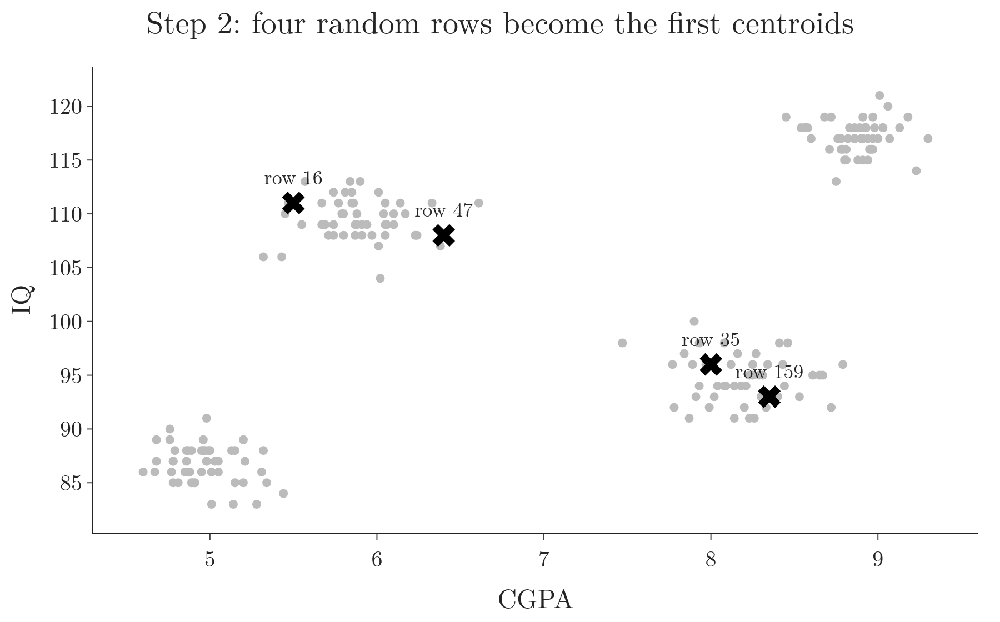
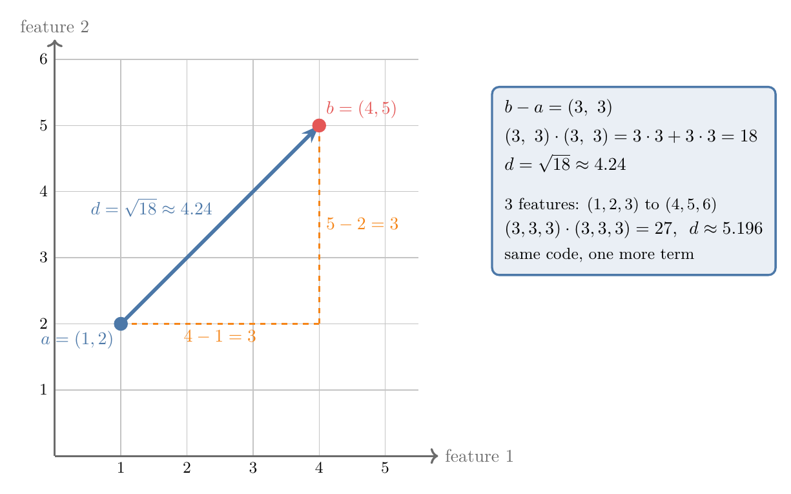
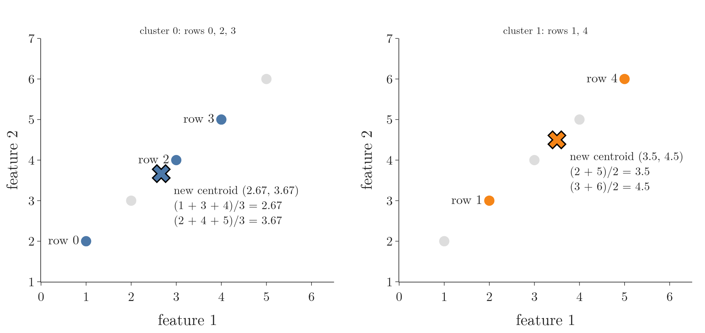
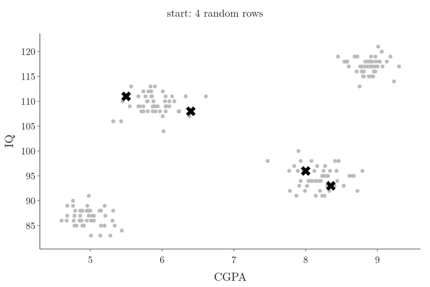
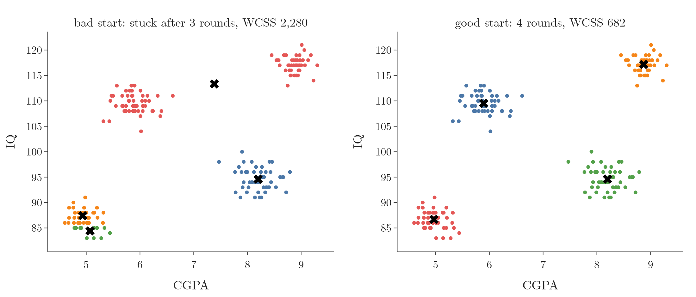
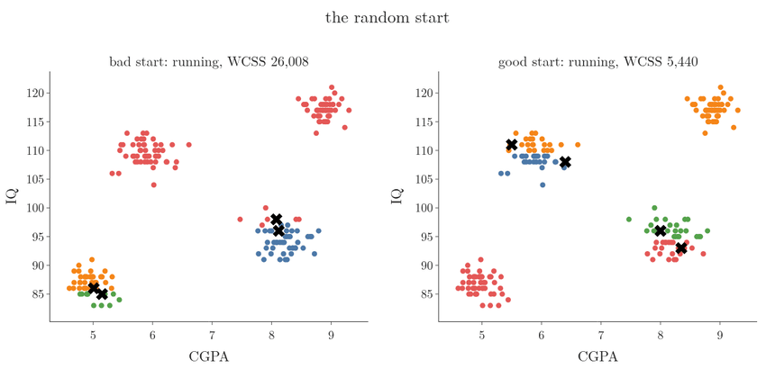

<!-- where-this-fits: generated by course_map/build_map.py; edit concepts.yaml, not this block -->
> **Where this fits:** Pipeline map step 8 (Model). See the [Course map](../../../00-course-map/00-course-map.md).
>
> 
>
> - **Builds on:** [Unsupervised learning](../../../ML/01-foundations/ML-003-types-of-ml/ML-003-types-of-ml.md#3-unsupervised-learning); [Feature scaling](../../../ML/01-foundations/ML-006-instance-vs-model-based/ML-006-instance-vs-model-based.md#31-how-it-works); [Elbow method and WCSS](../../../ML/09-clustering-and-more/ML-122-kmeans-intuition/ML-122-kmeans-intuition.md#5-choosing-k-the-elbow-method); [Expectation maximization (EM)](../../../MA/08-likelihood/MA-074-expectation-maximization/MA-074-expectation-maximization.md#1-overview).
> - **Leads to:** [Hierarchical clustering](../../../ML/09-clustering-and-more/ML-125-hierarchical-clustering/ML-125-hierarchical-clustering.md#4-two-kinds-of-hierarchical-clustering); [DBSCAN](../../../ML/09-clustering-and-more/ML-126-dbscan/ML-126-dbscan.md#8-the-dbscan-algorithm-step-by-step).
> - **Compare with:** [Hierarchical clustering](../../../ML/09-clustering-and-more/ML-125-hierarchical-clustering/ML-125-hierarchical-clustering.md#4-two-kinds-of-hierarchical-clustering); [DBSCAN](../../../ML/09-clustering-and-more/ML-126-dbscan/ML-126-dbscan.md#8-the-dbscan-algorithm-step-by-step); [Gaussian mixture model (GMM)](../../../MA/08-likelihood/MA-073-gaussian-mixture-models/MA-073-gaussian-mixture-models.md#32-the-standard-terms).
<!-- /where-this-fits -->

## 1. Overview

> **Key point:** We write k-means (G-996) ourselves as a class with one public method, `fit_predict`, and two helpers: `assign_clusters` (step 3) and `move_centroids` (step 4).

Coding an algorithm from scratch is the surest test that we understand it. This Note turns [the five steps of k-means](../ML-122-kmeans-intuition/ML-122-kmeans-intuition.md#4-the-five-steps-of-k-means) (pick k starting centroids, assign every point to the nearest, move each centroid to the mean of its points, repeat until nothing moves) into about 40 lines of Python. Figure 1 shows how the steps map onto the methods of the class.

{height=50%}

The class is in `kmeans.py` in this Note's folder; running `python kmeans.py` checks that it finds the same clusters as scikit-learn. The Notebook (`ML-124-kmeans-from-scratch.ipynb`) runs every experiment below.

## 2. Prerequisites

- [The five steps of k-means](../ML-122-kmeans-intuition/ML-122-kmeans-intuition.md#4-the-five-steps-of-k-means) and [WCSS](../ML-122-kmeans-intuition/ML-122-kmeans-intuition.md#51-wcss-how-tight-the-clusters-are) (G-2102; the total squared distance from each point to its cluster's centroid).
- `KMeans` in scikit-learn ([training k-means](../ML-123-kmeans-code/ML-123-kmeans-code.md#5-training-k-means-with-k--4)), the student data and [boolean indexing](../ML-123-kmeans-code/ML-123-kmeans-code.md#6-plotting-the-clusters-with-boolean-indexing).

## 3. The shape of the class

> **Key point:** The constructor stores k and a limit on the number of rounds; `fit_predict` runs the loop and returns one cluster number per observation.

We copy scikit-learn's interface, so our class is used exactly like the real one:

> **Python:** Using the class.
>
> ```python
> from kmeans import KMeans
>
> km = KMeans(n_clusters=4, max_iter=100)
> y_means = km.fit_predict(X)   # one cluster number per row
> ```
>
> `from kmeans import KMeans` loads the class from our own file `kmeans.py`, not from scikit-learn.

The **constructor** (G-457), the method that runs when the object is created, takes two settings:

- **`n_clusters`**: k, the number of clusters (step 1). Default 2.
- **`max_iter`**: the largest number of assign-and-move rounds. Default 100. The loop stops earlier if the centroids (G-367) stop moving.

> **Python:** The constructor.
>
> ```python
> class KMeans:
>     def __init__(self, n_clusters=2, max_iter=100,
>                  random_state=None):
>         self.n_clusters = n_clusters
>         self.max_iter = max_iter
>         self.random_state = random_state
>         self.centroids = None   # set by fit_predict
> ```
>
> `random_state` is our addition: it fixes the random start so that results can be repeated.

## 4. Step 2: random starting centroids

> **Key point:** Pick k different row numbers at random and take those rows as the first centroids.

`X` is a 2-D NumPy array: with 100 points in 2 columns, it holds 100 rows of 2 numbers each. Each row is an **observation** (one record of the data) and each column a **feature** (an input variable). To start, we pick k different row numbers between 0 and 99 at random, then take those rows. Figure 2 shows one such start on the 200 students: the four chosen rows are real students. They fall in pairs inside two groups, and two groups start with no centroid at all; the loop of Figure 6 still recovers all four.



> **Python:** Choosing the starting centroids.
>
> ```python
> rng = np.random.default_rng(self.random_state)
> random_index = rng.choice(X.shape[0],
>                           size=self.n_clusters,
>                           replace=False)
> self.centroids = X[random_index].astype(float)
> ```
>
> `X.shape[0]` is the number of rows. `rng.choice(100, size=2, replace=False)` returns 2 different numbers from 0 to 99, for example `[26, 17]`. `X[[26, 17]]` then picks rows 26 and 17. `astype(float)` lets the centroids hold decimals once they move.

> **Extra:** The same can be written with Python's `random` module: `random.sample(range(X.shape[0]), k)` also returns k different numbers. NumPy's generator is used here because it takes a seed per object, so two models never share random state.

## 5. Step 3: assigning clusters

> **Key point:** For every row, compute its distance to every centroid and record the index of the smallest one.

### 5.1 One distance formula for any number of features

> **Key point:** The squared Euclidean distance (G-715) is the dot product (G-634) of the difference vector with itself, so `np.sqrt(np.dot(a - b, a - b))` works for 2, 3 or 100 features.

The Euclidean distance (the straight-line distance between two points, see [the KNN imputer](../../04-missing-data-and-outliers/ML-038-knn-imputer/ML-038-knn-imputer.md#41-the-euclidean-distance)) gains one term per feature, so code written term by term would change with the number of features. The sum of squared differences is the dot product (multiply matching entries and add, see [projecting one point](../../05-dimensionality/ML-047-pca-step-by-step/ML-047-pca-step-by-step.md#21-projecting-one-point)) of the difference vector with itself, which needs no change:

$$d(a, b) = \sqrt{(b - a) \cdot (b - a)}$$

For $a = (1, 2)$ and $b = (4, 5)$:

$$b - a = (3, 3)$$
$$(3, 3) \cdot (3, 3) = 18$$
$$d = \sqrt{18} \approx 4.24$$

With a third feature, $(1, 2, 3)$ and $(4, 5, 6)$, the same code gives:

$$b - a = (3, 3, 3)$$
$$(3, 3, 3) \cdot (3, 3, 3) = 27$$
$$d = \sqrt{27} \approx 5.196$$

In Figure 3, watch the two dashed sides: each feature adds one squared side, and the dot product adds them all at once.



Figure 4 plays the same calculation step by step: the difference vector, its dot product with itself, the square root. Watch the last part: a third feature adds one more term to the dot product, and the line of code stays the same.

{height=60%}

> **Python:** The distance in NumPy.
>
> ```python
> np.sqrt(np.dot(b - a, b - a))   # 4.24 for (1, 2), (4, 5)
> ```
>
> `b - a` subtracts element by element. `np.dot(u, v)` multiplies matching elements and adds them up.

### 5.2 The nearest centroid

> **Key point:** With 100 rows and 2 centroids we compute 200 distances; each row gets the index of its smaller one.

A nested loop visits every row and, inside, every centroid. With 100 rows and 2 centroids the inner line runs:

$$100 \times 2 = 200$$

times. For each row we keep the position of the smallest distance: 0 if the first centroid is nearer, 1 if the second.

> **Python:** `assign_clusters`.
>
> ```python
> def assign_clusters(self, X):
>     cluster_group = []
>     for row in X:
>         distances = [np.sqrt(np.dot(row - c, row - c))
>                      for c in self.centroids]
>         cluster_group.append(int(np.argmin(distances)))
>     return np.array(cluster_group)
> ```
>
> The square brackets build a list of k distances, one per centroid. `np.argmin` returns the position of the smallest value, the same as `distances.index(min(distances))`. The result has one entry per row, such as `[0, 0, 1, ...]`, and is returned as a NumPy array so it can be used for boolean indexing.

## 6. Step 4: moving the centroids

> **Key point:** For each cluster k, select its rows with `X[cluster_group == k]` and take the mean of each column with `mean(axis=0)`.

The cluster numbers tell us which rows belong to which cluster. The new centroid of a cluster is the mean of each column over its rows (see [steps 3 and 4 on two features](../ML-122-kmeans-intuition/ML-122-kmeans-intuition.md#43-steps-3-and-4-on-two-features)).

Take five rows and their clusters:

| Row | Values | Cluster |
|---|---|---|
| 0 | (1, 2) | 0 |
| 1 | (2, 3) | 1 |
| 2 | (3, 4) | 0 |
| 3 | (4, 5) | 0 |
| 4 | (5, 6) | 1 |

`X[cluster_group == 0]` keeps rows 0, 2 and 3. Their column means are:

$$(1 + 3 + 4)/3 = 2.67$$
$$(2 + 4 + 5)/3 = 3.67$$

So the new centroid of cluster 0 is (2.67, 3.67). Cluster 1 gets $(3.5, 4.5)$. Figure 5 draws both: each cross lands in the middle of its own rows, and the other cluster's rows (grey) play no part.



> **Python:** `move_centroids`.
>
> ```python
> def move_centroids(self, X, cluster_group):
>     new_centroids = []
>     for k in range(self.n_clusters):
>         members = X[cluster_group == k]
>         new_centroids.append(members.mean(axis=0))
>     return np.array(new_centroids)
> ```
>
> `axis=0` averages down each column, giving one mean per column. Without it, `mean()` averages all six numbers into a single value (3.17), which is not a point at all.

> **Extra:** A cluster can end up empty: no row is nearest to its centroid. The mean of zero rows is undefined, and a loop over the cluster numbers that actually occur (for example with `np.unique(cluster_group)`) would silently return fewer than k centroids. The file `kmeans.py` keeps an empty cluster's old centroid instead. scikit-learn moves it to the data point that is farthest from its own centroid (scikit-learn source, `_k_means_common.pyx`).

## 7. Step 5: stopping

> **Key point:** Save the centroids before moving them; if the new ones equal the old ones, break out of the loop.

> **Python:** The loop inside `fit_predict`.
>
> ```python
> for i in range(self.max_iter):
>     cluster_group = self.assign_clusters(X)
>     old_centroids = self.centroids
>     self.centroids = self.move_centroids(X, cluster_group)
>     if np.allclose(old_centroids, self.centroids):
>         break
> return cluster_group
> ```
>
> `break` leaves the loop at once. `np.allclose` is True when every pair of numbers is equal up to a tiny rounding error. `(old == new).all()` also works, but computed means can differ in the last decimal place.

Figure 6 runs the whole loop on the 200 students from the start of Figure 2. Watch the largest move shrink round by round; in round 4 the centroids do not move at all, `np.allclose` is True, and the loop breaks.



The loop ends in one of two ways (Figure 1): the centroids stop moving, or `max_iter` rounds have run. Either way, `fit_predict` returns the cluster number of every row.

## 8. Testing the class

> **Key point:** On two, three and four blobs, and on the 200 students, the class finds the right groups in 2 to 5 rounds.

We generate test data with `make_blobs` (see [k-means in three dimensions](../ML-123-kmeans-code/ML-123-kmeans-code.md#8-k-means-in-three-dimensions)): 100 points around 2, 3 or 4 centres, each with spread 1. Then we run our class with the matching k, and finally on the 200 students with k = 4.

{height=55%}

Figure 7 shows all four results: every group found, every centroid in the middle of its group. The loops finished after 2, 5, 3 and 4 rounds. Plotting needs one scatter call per cluster, so the plotting code (not the class) must be extended each time k grows.

> **Python:** The self-check in `kmeans.py`.
>
> ```python
> from sklearn.metrics import adjusted_rand_score
>
> ours = KMeans(n_clusters=3, random_state=1).fit_predict(X)
> theirs = SkKMeans(n_clusters=3, random_state=0).fit_predict(X)
> assert adjusted_rand_score(ours, theirs) == 1.0
> ```
>
> Cluster numbers are only names, so we cannot compare them directly. `adjusted_rand_score` is 1.0 when two labelings put exactly the same points together, whatever the numbers.

## 9. Bad random starts

> **Key point:** If the starting centroids fall badly, k-means gets stuck in poor clusters, a **local optimum** (G-1111); more rounds do not help, but restarting from other random points does.

Sometimes the class returns wrong clusters. Blaming `max_iter` and raising it is tempting, but the round counts say otherwise. Across 30 random starts on the four blobs, k-means never needed more than 10 rounds; at most 10 of the 100 allowed rounds were ever used.

Figure 8 shows the real cause on the students. With one random start (left), two centroids end up in the bottom-left group. That group gets split in two, while two real groups, the top ones, have to share one centroid placed in the empty space between them. After 3 rounds nothing changes any more, so the algorithm stops, stuck. Raising `max_iter` to 500 gives exactly the same result.



Figure 9 runs both starts round by round. Watch the status in each panel's title. The bad start stops in round 3 and the good start in round 4: in both, the centroids no longer move, so the loop breaks long before `max_iter`. From then on nothing changes in either panel, and the bad run stays at WCSS 2,280. Extra rounds are never used, so they cannot repair a bad start.

{height=40%}

The two runs can be compared by their WCSS (see [WCSS](../ML-122-kmeans-intuition/ML-122-kmeans-intuition.md#51-wcss-how-tight-the-clusters-are)): 2,280 for the bad start and 682 for the good one. Lower is better, so the fix is simple (ESL §14.3.6):

1. run k-means from several random starts;
2. keep the run with the lowest WCSS.

In the Notebook, the best of 10 starts is the good clustering (WCSS 682). scikit-learn's `n_init` (see [training k-means](../ML-123-kmeans-code/ML-123-kmeans-code.md#5-training-k-means-with-k--4)) does exactly this job, and its `k-means++` start spreads the first centroids out.

> **Extra:** The class also stores the WCSS of its result as `inertia_`, like scikit-learn:
>
> ```python
> self.inertia_ = ((X - self.centroids[cluster_group]) ** 2).sum()
> ```
>
> `self.centroids[cluster_group]` repeats, for every row, the centroid of its own cluster; subtracting, squaring and summing gives the WCSS. With it, the elbow method takes one loop over k. Taking the best of 10 starts for each k, the students give WCSS 29,958, 4,184, 2,363, 682, 514, ...: the elbow is at k = 4, as with scikit-learn.

## 10. Summary

| Method | Step | What it does | Why |
|---|---|---|---|
| `__init__` | 1 | Stores k (`n_clusters`) and the round limit (`max_iter`) | copies scikit-learn's interface, so the class is used like the real one |
| `fit_predict` | 2 | Picks k random rows as the first centroids, then runs the loop | there are no clusters yet, so the start is taken from the data |
| `assign_clusters` | 3 | Distance from every row to every centroid; keeps the index of the nearest | each row joins the cluster of its nearest centroid |
| `move_centroids` | 4 | Each centroid becomes the column means of its rows | the centroid moves to the middle of its own rows |
| check in `fit_predict` | 5 | Stops when the centroids no longer move | once nothing moves, more rounds would give the same clusters |

- The Euclidean distance for any number of features: `np.sqrt(np.dot(a - b, a - b))`, so the same line of code works for 2, 3 or 100 features.
- `X[cluster_group == k].mean(axis=0)` is the new centroid of cluster k; `axis=0` gives one mean per column, a point, instead of one single number.
- On the four blobs, k-means stopped within 10 rounds from all 30 starts; the wrong result on the students came from a bad random start, not from too few rounds.
- Fix bad starts by restarting several times and keeping the lowest WCSS, because a lower WCSS means tighter clusters; scikit-learn's `n_init` does the same.
- So about 40 lines of Python run the five steps of k-means and find the same clusters as scikit-learn.

## 11. Sources

**Built from**

- CampusX, "K-Means Clustering Algorithm From Scratch In Python | ML Algorithms From Scratch", YouTube, https://www.youtube.com/watch?v=MFraC1JObUo
- StatQuest with Josh Starmer, "StatQuest: K-means clustering", YouTube, https://www.youtube.com/watch?v=4b5d3muPQmA (a bad start is fixed by rerunning from new starts and keeping the lowest total variation, section 9)

**Other references**

- ESL: Hastie, Tibshirani and Friedman, *The Elements of Statistical Learning*, 2nd ed., Springer, 2009, §14.3.6 (k-means; restarting from several random starts and keeping the lowest objective).
- scikit-learn source, `_k_means_common.pyx`: the function `_relocate_empty_clusters_dense` in `sklearn/cluster/_k_means_common.pyx`, scikit-learn 1.9.

## 12. Key terms

| Term | Meaning |
|---|---|
| Constructor (`__init__`) | The method that runs when an object is created and stores its settings |
| max_iter (G-113) | The largest number of assign-and-move rounds k-means may run |
| np.argmin | NumPy function returning the position of the smallest value |
| mean(axis=0) | The mean of each column of an array |
| Local optimum (k-means) | A clustering where k-means has stopped but a better one exists, caused by a bad start |
| Adjusted Rand score (G-175) | A number that is 1.0 when two labelings group the points identically, whatever the label numbers |
