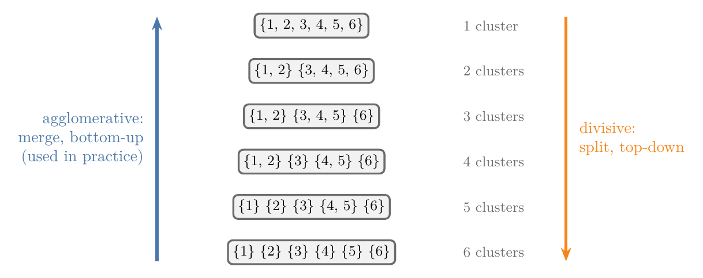
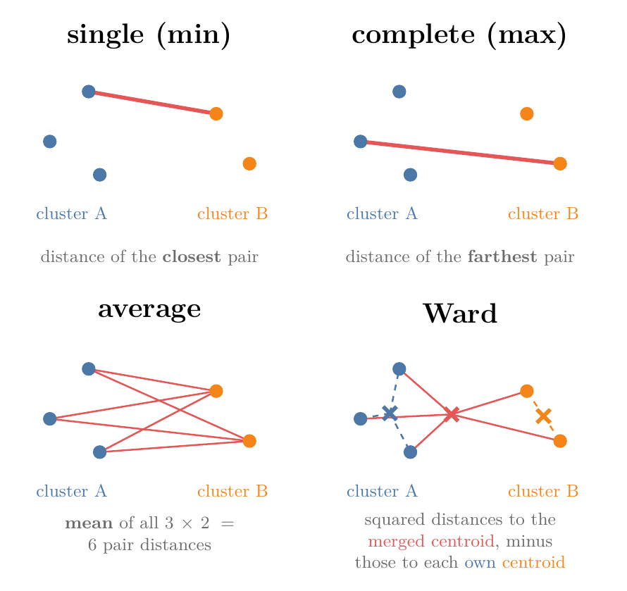
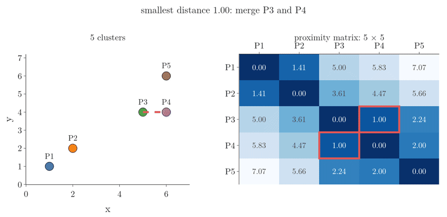
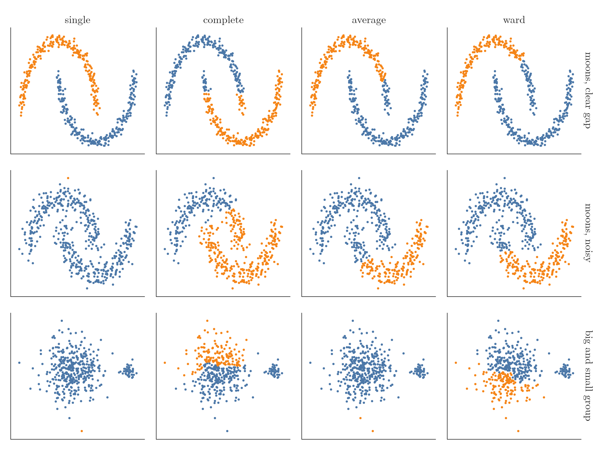
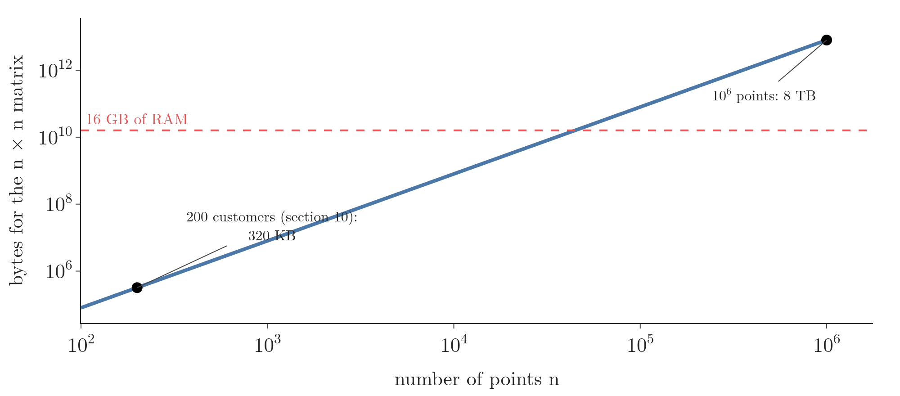

<!-- where-this-fits: generated by course_map/build_map.py; edit concepts.yaml, not this block -->
> **Where this fits:** Pipeline map step 8 (Model). See the [Course map](../../../00-course-map/00-course-map.md).
>
> 
>
> - **Builds on:** [Clustering](../../../ML/01-foundations/ML-003-types-of-ml/ML-003-types-of-ml.md#32-clustering).
> - **Compare with:** [K-means](../../../ML/09-clustering-and-more/ML-122-kmeans-intuition/ML-122-kmeans-intuition.md#4-the-five-steps-of-k-means); [DBSCAN](../../../ML/09-clustering-and-more/ML-126-dbscan/ML-126-dbscan.md#8-the-dbscan-algorithm-step-by-step).
<!-- /where-this-fits -->

## 1. Overview

> **Key point:** Agglomerative clustering starts with every point as its own cluster and repeatedly merges the two closest clusters; the record of the merges, the dendrogram, lets us pick any number of clusters afterwards.

**k-means** (G-996) works well on round, well-separated groups but fails on many other shapes. **Hierarchical clustering** (G-893) is a family of clustering methods that build a whole hierarchy of clusters, from single points up to one cluster holding everything. Figure 1 shows the idea on six points. In each frame, the left panel shows the points and the clusters merged so far; the right panel is the dendrogram, a tree whose vertical axis is the distance at which two clusters merged.

{height=45%}

This Note covers why we need it, how the merging works, the four ways to measure the distance between two clusters, how to read the number of clusters off the dendrogram, and scikit-learn's `AgglomerativeClustering` on customer data. The Notebook (`ML-125-hierarchical-clustering.ipynb`) runs every example.

## 2. Prerequisites

- [k-means and its centroids](../ML-122-kmeans-intuition/ML-122-kmeans-intuition.md#4-the-five-steps-of-k-means): a centroid is the mean point of a cluster.
- [The Euclidean distance](../../04-missing-data-and-outliers/ML-038-knn-imputer/ML-038-knn-imputer.md#41-the-euclidean-distance): the straight-line distance between two points.
- [The dendrogram as a picture](../../02-getting-data/ML-020-bivariate-multivariate-analysis/ML-020-bivariate-multivariate-analysis.md#8-clustermap-grouping-similar-categories): a tree that joins the most similar items first.

## 3. Where k-means struggles

> **Key point:** k-means builds clusters around centroids, so it finds round blobs; rings, crescents, stretched groups and noise points defeat it.

k-means assigns every point to its nearest centroid ([the five steps of k-means](../ML-122-kmeans-intuition/ML-122-kmeans-intuition.md#4-the-five-steps-of-k-means)). Nearest-centroid assignment works when the groups are compact and well separated. On harder shapes it fails, as Figure 2 shows on four standard test datasets:

- **Two circles**, one inside the other. We want the inner ring and the outer ring; k-means cuts both rings in half, top against bottom.
- **Two moons**, two interleaving crescents. k-means splits the picture with a straight boundary, so each cluster gets parts of both moons.
- **Three stretched groups**, long thin diagonal bands. k-means mixes neighbouring bands.
- **Three groups plus noise.** Some points are noise that belong to no group, but k-means must put every point in some cluster.

{height=50%}

k-means does best on spherical (round) groups. Other clustering methods exist because of these failures. This Note covers hierarchical clustering; density-based clustering, with its algorithm DBSCAN, is covered in [density-based clustering](../ML-126-dbscan/ML-126-dbscan.md#4-density-based-clustering). DBSCAN can also label noise points as noise instead of forcing them into a cluster.

## 4. Two kinds of hierarchical clustering

> **Key point:** Agglomerative clustering merges bottom-up, from single points to one cluster; divisive clustering splits top-down. Agglomerative is the one used in practice.

There are two types:

- **Agglomerative clustering** (G-180) starts with every point as a cluster and merges, one step at a time, until one cluster is left. Agglomerative clustering is the common one, and the rest of this Note is about it.
- **Divisive clustering** (G-630) works the other way round: it starts with one cluster holding everything and splits it, step by step, until every point is alone. Section 6 sketches it.

{width=85%}

Figure 3 shows both directions on the same six points.

## 5. Agglomerative clustering, merge by merge

> **Key point:** Start with n clusters, merge the two closest, record the merge, and repeat until one cluster is left.

### 5.1 The merges

> **Key point:** Every merge reduces the number of clusters by one: 6, 5, 4, 3, 2, 1.

Figure 1 runs the algorithm on six points:

1. **Start:** each point is a cluster of its own, so there are 6 clusters.
2. **Merge 1:** points 4 and 5 are the closest pair, so they form a cluster. 5 clusters are left.
3. **Merge 2:** points 1 and 2 are the next closest pair. 4 clusters are left.
4. **Merge 3:** point 3 is close to the cluster {4, 5}, so it joins it: {3, 4, 5}. 3 clusters are left.
5. **Merge 4:** point 6 joins {3, 4, 5}. 2 clusters are left.
6. **Merge 5:** the last two clusters, {1, 2} and {3, 4, 5, 6}, merge into one.

### 5.2 The dendrogram records the merges

> **Key point:** Each merge is drawn as a link whose height is the distance at which the two clusters merged.

The tree on the right of Figure 1 is the **dendrogram** (G-582; see [the clustermap](../../02-getting-data/ML-020-bivariate-multivariate-analysis/ML-020-bivariate-multivariate-analysis.md#8-clustermap-grouping-similar-categories)): it joins the most similar items first, with short links. Here we see how it is built. Every merge adds one link, and the height of the link is the distance between the two clusters when they merged.

Reading the tree, we see at once that 4 and 5 were the closest pair, 1 and 2 the next, that 3 was close to {4, 5}, and that 6 came last before the final merge. The tree shows a hierarchy of clusters inside clusters, which is where the name hierarchical clustering comes from.

### 5.3 Cutting the dendrogram

> **Key point:** A horizontal cut through the dendrogram gives as many clusters as the vertical lines it crosses.

The algorithm always ends with one cluster, but the whole history is kept, so we can stop at any stage:

- **Cut high**, just below the top link (Figure 1, last frame, the cut at 2.6): it crosses 2 vertical lines, giving 2 clusters: {1, 2} and {3, 4, 5, 6}.
- **Cut a little lower**, below the purple link: 3 clusters: {1, 2}, {6} and {3, 4, 5}.
- **Cut lower again**, below the green link: 4 clusters: {1, 2}, {6}, {3} and {4, 5}.

So one run of the algorithm serves every number of clusters. Section 9 shows how to choose where to cut.

## 6. Divisive clustering in brief

> **Key point:** Divisive clustering starts from one cluster and keeps splitting until every point stands alone.

Take the same six points. Divisive clustering starts with all six in a single cluster and splits it in two, for example {1, 2} and {3, 4, 5, 6}. Then it splits one of the parts again, giving 3 clusters, and so on, until there are 6 clusters of one point each.

The result is the same kind of tree, read from the top down. Divisive clustering is used much less than agglomerative clustering.

## 7. The algorithm: the proximity matrix

> **Key point:** Compute the n × n matrix of distances, merge the closest pair, update the matrix row and column of the new cluster, and repeat until one cluster remains.

To code agglomerative clustering, we need a **proximity matrix** (G-1585): a table with one row and one column per cluster, holding the distance between every pair. The algorithm is:

1. Compute the proximity matrix of all n points.
2. Make every point a cluster.
3. Repeat until one cluster is left:
   - merge the two closest clusters;
   - update the proximity matrix: remove the two old rows and columns, and add one row and column for the new cluster.

Take five points: $P_1 = (1, 1)$, $P_2 = (2, 2)$, $P_3 = (5, 4)$, $P_4 = (6, 4)$ and $P_5 = (6, 6)$. Their **Euclidean distances** (G-715) form the proximity matrix (Figure 4, left):

|  | P1 | P2 | P3 | P4 | P5 |
|---|---|---|---|---|---|
| **P1** | 0 | 1.41 | 5.00 | 5.83 | 7.07 |
| **P2** | 1.41 | 0 | 3.61 | 4.47 | 5.66 |
| **P3** | 5.00 | 3.61 | 0 | 1.00 | 2.24 |
| **P4** | 5.83 | 4.47 | 1.00 | 0 | 2.00 |
| **P5** | 7.07 | 5.66 | 2.24 | 2.00 | 0 |

The diagonal is 0: every point is at distance 0 from itself. The matrix is symmetric: the distance from P1 to P2 equals the distance from P2 to P1.

The smallest value off the diagonal is 1.00, between P3 and P4, so they merge into a cluster $C_1 = \lbrace P_3, P_4\rbrace$. The matrix shrinks to 4 rows: P1, P2, $C_1$ and P5. The distances between unchanged points (P1 to P2, P1 to P5, P2 to P5) stay as they are. But what is the distance from $C_1$ to P1, P2 or P5 (the question marks of Figure 4, right)? The answer depends on how we measure the distance between clusters, which is the subject of the next section.

{width=100%}

## 8. Linkage: the distance between two clusters

> **Key point:** **Single linkage** (G-1811) uses the closest pair of points, **complete linkage** (G-427) the farthest pair, **average linkage** (G-236) the mean of all pairs, and **Ward linkage** (G-2099) the growth in spread caused by merging.

The rule for the distance between two clusters is called the **linkage** (G-1104). The linkage is the only thing that differs between the four types of agglomerative clustering in scikit-learn. Figure 5 shows all four.

{height=55%}

### 8.1 Single linkage (min)

> **Key point:** The distance between two clusters is the distance between their two closest points.

1. **In words:** compute the distance from every point of A to every point of B, and keep the smallest.
2. **Formula:**
   $$d_{\text{single}}(A, B) = \min_{a \in A,\thinspace b \in B} d(a, b)$$
   Here $a \in A$ means that the point $a$ belongs to $A$, and $\min$ keeps the smallest distance over every such pair $(a, b)$.
3. **Example:** $C_1 = \lbrace P_3, P_4\rbrace$ to each other point; the two distances come from the rows of P3 and P4:
   $$C_1 \text{ to } P_5: \min(2.24, 2.00) = 2.00$$
   $$C_1 \text{ to } P_1: \min(5.00, 5.83) = 5.00$$
   $$C_1 \text{ to } P_2: \min(3.61, 4.47) = 3.61$$

With the updated matrix, the next smallest distance is 1.41 (P1 to P2), so they merge into $C_2 = \lbrace P_1, P_2\rbrace$. Then $C_1$ and $P_5$ merge at 2.00 into $C_3 = \lbrace P_3, P_4, P_5\rbrace$. Finally $C_2$ and $C_3$ merge at their closest pair, P2 to P3: 3.61.

Figure 6 plays these merges. In every frame the red outline marks the smallest distance off the diagonal; the two clusters it names merge, their two rows and columns become one, and the matrix shrinks: 5 × 5, 4 × 4, 3 × 3, 2 × 2, 1 × 1. Watch the new row: each of its entries is the smaller of the two entries it replaces.



Single linkage separates groups well when there is a clear gap between them (Figure 7 in section 8.5, top row, first panel: the two moons are found exactly). Its weakness is noise. A few points lying between two groups act as a bridge: to merge two clusters, single linkage needs only one close pair, so the groups get chained together through the bridge points. The effect is called **chaining** (ESL §14.3.12; Tan et al. 2006, §8.3.2). In Figure 7 (middle row, first panel), the noisy moons become one cluster plus one lonely point.

### 8.2 Complete linkage (max)

> **Key point:** The distance between two clusters is the distance between their two farthest points.

1. **In words:** compute all distances between points of A and points of B, and keep the largest.
2. **Formula:**
   $$d_{\text{complete}}(A, B) = \max_{a \in A,\thinspace b \in B} d(a, b)$$
3. **Example:** $C_1 = \lbrace P_3, P_4\rbrace$ to $P_5$:
   $$\max(2.24, 2.00) = 2.24$$
   At the last step, $\lbrace P_1, P_2\rbrace$ to $\lbrace P_3, P_4, P_5\rbrace$ is the largest of six distances: 7.07 (P1 to P5).

Complete linkage is less affected by outliers and noise (Tan et al. 2006, §8.3.2): a stray point cannot pull two groups together, since the farthest pair decides. Its weakness is groups of very different sizes: complete linkage tends to break large clusters (Tan et al. 2006, §8.3.2). The farthest pair across the two halves of a big, wide group is long, so merging those halves looks expensive; if the small group is closer than that to one half, the small group joins that half first, and the big group stays broken. In Figure 7 of section 8.5 (bottom row, second panel), the big group is cut in half while the small group joins one of the halves.

### 8.3 Average linkage

> **Key point:** The distance between two clusters is the mean of all distances between a point of one and a point of the other.

1. **In words:** compute the distance of every pair (one point from A, one from B), add them, and divide by the number of pairs, $|A| \times |B|$.
2. **Formula:**
   $$d_{\text{average}}(A, B) = \frac{1}{|A|\thinspace|B|} \sum_{a \in A} \sum_{b \in B} d(a, b)$$
   Here $|A|$ is the number of points in $A$, and the double sum adds $d(a, b)$ over every pair: fix one $a$, add over all $b$, then move to the next $a$.
3. **Example:** $\lbrace P_1, P_2\rbrace$ to $\lbrace P_3, P_4, P_5\rbrace$ has 6 pairs:
   $$2 \times 3 = 6$$
   The sum of the six distances, then the average:
   $$5.00 + 5.83 + 7.07 + 3.61 + 4.47 + 5.66 = 31.64$$
   $$\frac{31.64}{6} = 5.27$$

The average lies between the minimum and the maximum, so average linkage is an in-between choice: neither single nor complete linkage (Tan et al. 2006, §8.3.2).

### 8.4 Ward linkage

> **Key point:** Ward merges the two clusters whose merger increases the total squared distance to the centroids the least. Ward is scikit-learn's default.

1. **In words:** compute the squared distances of all points of A and B to the centroid of the merged cluster, and add them. Subtract the squared distances of A's points to A's own centroid and of B's points to B's own centroid. What remains is how much the spread grows by merging.
2. **Formula:** with $m_{AB}$, $m_A$ and $m_B$ the centroids of $A \cup B$, $A$ and $B$,
   $$\Delta(A, B) = \sum_{x \in A \cup B} \lVert x - m_{AB} \rVert^2 - \sum_{x \in A} \lVert x - m_A \rVert^2 - \sum_{x \in B} \lVert x - m_B \rVert^2$$
3. **Example:** $A = \lbrace P_3, P_4\rbrace$, $B = \lbrace P_5\rbrace$. The merged centroid is the mean of the three points:
   $$m_{AB} = (17/3, 14/3) \approx (5.67, 4.67)$$
   The squared distances of P3, P4 and P5 to it, one per line:
   $$(5 - 5.67)^2 + (4 - 4.67)^2 = 0.89$$
   $$(6 - 5.67)^2 + (4 - 4.67)^2 = 0.56$$
   $$(6 - 5.67)^2 + (6 - 4.67)^2 = 1.89$$
   $$0.89 + 0.56 + 1.89 = 3.33$$
   A's centroid is (5.5, 4); P3 and P4 are each 0.5 away from it:
   $$0.5^2 + 0.5^2 = 0.5$$
   B is one point, its own centroid, so its sum is 0. Then
   $$\Delta = 3.33 - 0.5 - 0 = 2.83$$

Each merge thus keeps the clusters as tight as possible, which is the same goal as k-means' WCSS (within-cluster sum of squares, the total squared distance of points to their centroid; see [WCSS](../ML-122-kmeans-intuition/ML-122-kmeans-intuition.md#51-wcss-how-tight-the-clusters-are); scikit-learn user guide, Hierarchical clustering). Of all four linkages, Ward gives the most even cluster sizes, and single linkage the most uneven (scikit-learn user guide, Hierarchical clustering).

> **Extra:** scipy's `linkage` and scikit-learn report the Ward distance as $\sqrt{2\Delta}$. Here:
> $$\sqrt{2 \times 2.83} = 2.38$$
>
> Both print 2.38 for this merge. The square root does not change which pair is smallest, so the merges are the same.

### 8.5 The four linkages side by side

> **Key point:** No linkage wins everywhere: single needs clean gaps, complete and Ward prefer compact groups of similar size.

Figure 7 runs all four linkages, with 2 clusters, on three datasets:

- **Moons with a clear gap (top):** only single linkage separates the two moons; the others cut across them.
- **Noisy moons (middle):** single linkage chains everything into one cluster and leaves one point alone. Complete, average and Ward give rough splits.
- **A big and a small group (bottom):** no linkage finds the two groups. Single linkage chains the small group onto the big one and leaves one outlying point as the second "cluster"; average linkage does the same with two outlying points; complete and Ward split the big group in half.

{height=58%}

So the linkage is a real choice that depends on the data. When the groups have odd shapes and also noise, DBSCAN ([density-based clustering](../ML-126-dbscan/ML-126-dbscan.md#4-density-based-clustering)) was built for that case: DBSCAN finds clusters of any shape and labels noise points (Ester et al. 1996).

## 9. Choosing the number of clusters from the dendrogram

> **Key point:** Find the longest vertical stretch of the dendrogram that no horizontal line crosses, and cut through it.

As with k-means, we do not know the number of clusters in advance, and data with many **features** (input variables, the columns of the data table) cannot be plotted. For k-means we had the elbow method; here the dendrogram does the job.

The vertical lines of a dendrogram measure distance between clusters: the longer the stretch before the next merge, the more separate those clusters are. The rule is:

1. Extend every horizontal link of the dendrogram across the whole plot.
2. Find the longest stretch of vertical line that none of these horizontal lines crosses.
3. Cut horizontally through the middle of that stretch.
4. The number of vertical lines the cut crosses is the number of clusters.

Figure 8 is the Ward dendrogram of 200 shopping-mall customers (section 10). Like k-means, hierarchical clustering is distance-based, so both features were first standardized ([the standardization formula](../../03-feature-engineering/ML-023-standardization/ML-023-standardization.md#4-the-standardization-formula)). The red band, from height 4.35 to 9.45, is the longest stretch with no merge inside: 5.10. A cut at 7, in its middle, crosses 5 vertical lines: 5 clusters, the five groups we can see in the scatter plot (Figure 9).

{height=48%}

> **Extra:** The rule is a guide, not a proof. The blue band in Figure 8, from 10.14 to 15.19, is nearly as long (5.04), and a cut there gives 3 clusters. On data we cannot plot, both candidates are worth inspecting. Scaling matters here too: on the raw, unscaled features the two bands swap order (131.8 against 132.3) and the rule would pick 3 clusters (Notebook). Standardizing gives both features the same say in the distances.

## 10. AgglomerativeClustering in scikit-learn

> **Key point:** `AgglomerativeClustering(n_clusters, metric, linkage)` plus `fit_predict`; scipy draws the dendrogram first so we can choose `n_clusters`.

### 10.1 The main hyperparameters

> **Key point:** n_clusters, metric, linkage and distance_threshold.

`AgglomerativeClustering` (in `sklearn.cluster`) has four important hyperparameters:

- **`n_clusters`**: how many clusters to return, i.e. where to cut the tree. Default 2.
- **`metric`**: how to measure the distance between two points: `"euclidean"` (default), `"manhattan"`, `"cosine"`, `"l1"` or `"l2"`. Ward linkage accepts only Euclidean. Euclidean is the straight-line distance; Manhattan adds up the absolute differences feature by feature (both are **Minkowski distances**, G-1227: see [the steps of KNN](../../07-classification/ML-085-knn/ML-085-knn.md#21-the-steps)).
- **`linkage`**: `"ward"` (default), `"complete"`, `"average"` or `"single"`.
- **`distance_threshold`**: cut the tree at this height instead of at a number of clusters: clusters whose linkage distance is at or above the threshold are not merged. `distance_threshold` needs `n_clusters=None`.

> **Extra:** Older code and tutorials write `affinity="euclidean"`. scikit-learn renamed the parameter to `metric` in version 1.2 and removed `affinity` in 1.4, so the old name now raises a `TypeError` (scikit-learn release notes 1.2).

### 10.2 Clustering shopping-mall customers

> **Key point:** Two features, annual income and spending score, give 5 clear groups of customers.

The file `data/shopping_data.csv` describes 200 customers of a shopping mall. Each customer is an **observation** (one record, a row of the table). The columns are ID, gender, age, annual income (thousand dollars) and spending score (1 to 100, given by the mall). We keep the last two columns as the features and standardize them.

> **Python:** Dendrogram, then clusters.
>
> ```python
> from scipy.cluster.hierarchy import linkage, dendrogram
> from sklearn.cluster import AgglomerativeClustering
>
> from sklearn.preprocessing import StandardScaler
>
> data = customers.iloc[:, 3:5].values   # income, score
> data_std = StandardScaler().fit_transform(data)
>
> Z = linkage(data_std, method="ward")   # all 199 merges
> d = dendrogram(Z, no_plot=True)        # tree coordinates
>
> cluster = AgglomerativeClustering(
>     n_clusters=5, metric="euclidean", linkage="ward")
> labels_ = cluster.fit_predict(data_std)
> ```
>
> `linkage` returns one row per merge: the two clusters merged, the distance and the new size. `dendrogram(..., no_plot=True)` only computes the line coordinates (`icoord`, `dcoord`), which the Notebook draws with Plotly.

The five clusters have 32, 39, 85, 21 and 23 customers (Figure 9):

- high income, low spending (blue);
- high income, high spending (orange): the mall's best customers;
- average income, average spending (green, the largest group);
- low income, high spending (red);
- low income, low spending (purple).

{height=45%}

A marketing team could now treat each group differently. The same method could, for example, cluster countries by GDP, population and area to see which countries are most similar to India.

## 11. Strengths and limitations

> **Key point:** Hierarchical clustering handles many kinds of data and gives a full tree of similarities, but needs an n × n distance matrix, so it does not scale to big datasets.

Strengths:

- **Widely applicable:** with four linkages to choose from, it can cluster data that k-means cannot.
- **The dendrogram:** the tree shows, at every level, which point or group is closest to which. k-means only says which cluster a point is in, not which other points are its closest relatives. The clustermap ([a heatmap with a dendrogram](../../02-getting-data/ML-020-bivariate-multivariate-analysis/ML-020-bivariate-multivariate-analysis.md#8-clustermap-grouping-similar-categories)) uses exactly this tree to reorder the rows and columns of a heatmap so that similar ones sit together.

Limitation:

- **Big datasets:** the proximity matrix has $n \times n$ entries. With $10^6$ (ten lakh) points the matrix holds $10^{12}$ distances. At 8 bytes per number, $10^{12}$ distances take 8 terabytes, or 4 terabytes if only the half above the diagonal is stored: far beyond the RAM of any ordinary computer. Hierarchical clustering suits small and medium datasets (Figure 10).

{width=85%}

## 12. Summary

| Linkage | Distance between clusters A and B | Good at | Weak at |
|---|---|---|---|
| Single (min) | Closest pair of points | Clear gaps, odd shapes | Noise: chains groups together |
| Complete (max) | Farthest pair of points | Outliers and noise | Breaks big groups |
| Average | Mean of all pair distances | In between | In between |
| Ward (default) | Growth of squared distance to centroids | Compact groups | Odd shapes |

- No linkage wins everywhere, so the linkage is a choice made to fit the shape of the data.
- Agglomerative clustering: every point starts as a cluster; merge the two closest clusters until one is left, so one run gives the whole hierarchy of clusters inside clusters. Divisive clustering does the reverse.
- The proximity matrix holds the distance between every pair of clusters and is updated after each merge, because the new cluster needs a distance to every other cluster, and the linkage decides it.
- The dendrogram records every merge at its distance; a horizontal cut gives the clusters, so the number of clusters can be chosen after the run.
- Choose the cut in the longest vertical stretch no horizontal line crosses, because a long stretch means those clusters stay far apart before the next merge; the rule is a guide. Standardize the features first, because the method is distance-based and unscaled features can change which stretch is longest.
- scikit-learn: the class `AgglomerativeClustering` with `n_clusters`, `metric` and `linkage`; `metric` replaced `affinity`, so older code that passes `affinity` now raises an error.
- Memory grows with $n^2$, so big datasets are out of reach.
- So hierarchical clustering handles shapes where k-means struggles, and its dendrogram lets us pick the number of clusters afterwards, on small and medium datasets.

## 13. Sources

**Built from**

- CampusX, "Agglomerative Hierarchical Clustering | Python Code Example", YouTube, https://www.youtube.com/watch?v=Ka5i9TVUT-E

**Other references**

- ESL: Hastie, Tibshirani and Friedman, *The Elements of Statistical Learning*, 2nd ed., Springer, 2009, §14.3.12 (hierarchical clustering; chaining in single linkage).
- Ester et al. 1996: M. Ester, H.-P. Kriegel, J. Sander and X. Xu, *A Density-Based Algorithm for Discovering Clusters in Large Spatial Databases with Noise*, Proceedings of KDD 1996.
- Tan et al. 2006: P.-N. Tan, M. Steinbach and V. Kumar, *Introduction to Data Mining*, Pearson, 2006, §8.3.2 (strengths and weaknesses of single, complete and group-average linkage).
- scikit-learn user guide, Hierarchical clustering: section 2.3.6 of the scikit-learn 1.9 user guide (Ward and the k-means objective; cluster sizes by linkage).
- scikit-learn release notes 1.2: scikit-learn 1.2 changelog, `sklearn.cluster` (`affinity` deprecated in favour of `metric`, removal in 1.4).

## 14. Key terms

Terms taught in this Note come first; linked terms are recaps, taught in the Note the link opens.

| Term | Meaning |
|---|---|
| Hierarchical clustering (G-893) | Clustering that builds a hierarchy of clusters, from single points up to one cluster. |
| Agglomerative clustering (G-180) | Grouping that starts with one cluster per point and repeatedly merges the closest pair (bottom-up hierarchical clustering). |
| Divisive clustering (G-630) | Top-down hierarchical clustering: start with one cluster and split repeatedly. |
| Proximity matrix (G-1585) | An n × n table of the distances between every pair of points or clusters. |
| Single linkage (G-1811) | In hierarchical clustering, a way to measure the distance between two clusters: the distance of their closest pair of points; the two closest clusters are merged next. |
| Complete linkage (G-427) | A way to measure the distance between two clusters in hierarchical clustering: the distance of their farthest pair of points; the closest two clusters are merged next. |
| Average linkage (G-236) | A way to measure the distance between two clusters in hierarchical clustering: the mean of all distances between a point of one cluster and a point of the other; the closest two clusters are merged next. |
| Ward linkage (G-2099) | A rule for the distance between two clusters in hierarchical clustering: how much the total squared distance to the centroids grows if the two are merged. |
| Linkage (G-1104) | The rule that measures the distance between two clusters, for example the distance between their closest points or their average distance; hierarchical clustering merges the two closest clusters by this rule, so the linkage shapes the result. |
| AgglomerativeClustering (G-181) | scikit-learn's class for agglomerative clustering: given the number of clusters, the distance and the linkage, `fit_predict` merges points bottom-up and returns each point's cluster. |
| Cutting the dendrogram (G-527) | Drawing a horizontal line through the dendrogram; the lines it crosses are the clusters. |
| distance_threshold (G-624) | Height at which `AgglomerativeClustering` stops merging, instead of a fixed number of clusters. |
| [k-means](../../../ML/09-clustering-and-more/ML-122-kmeans-intuition/ML-122-kmeans-intuition.md#4-the-five-steps-of-k-means) (G-996) | A clustering algorithm that repeatedly assigns points to the nearest centre and moves each centre to the mean of its points. |
| [Dendrogram](../../../ML/02-getting-data/ML-020-bivariate-multivariate-analysis/ML-020-bivariate-multivariate-analysis.md#8-clustermap-grouping-similar-categories) (G-582) | A tree showing which rows (or columns) were joined as similar, and in what order. |
| [Euclidean distance](../../../ML/04-missing-data-and-outliers/ML-038-knn-imputer/ML-038-knn-imputer.md#41-the-euclidean-distance) (G-715) | The straight-line distance between two points. |
| [Minkowski distance](../../../ML/07-classification/ML-085-knn/ML-085-knn.md#21-the-steps) (G-1227) | A family of distances between two points, $\left(\sum_i \lvert x_i - y_i \rvert^p\right)^{1/p}$, set by the number $p$: $p = 2$ gives the Euclidean distance and $p = 1$ the Manhattan distance; KNN uses it to find the nearest neighbours. |
