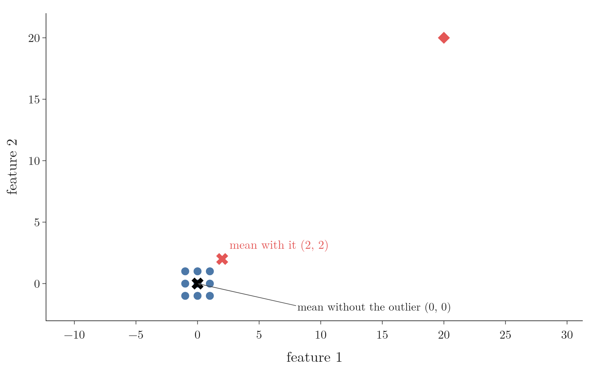
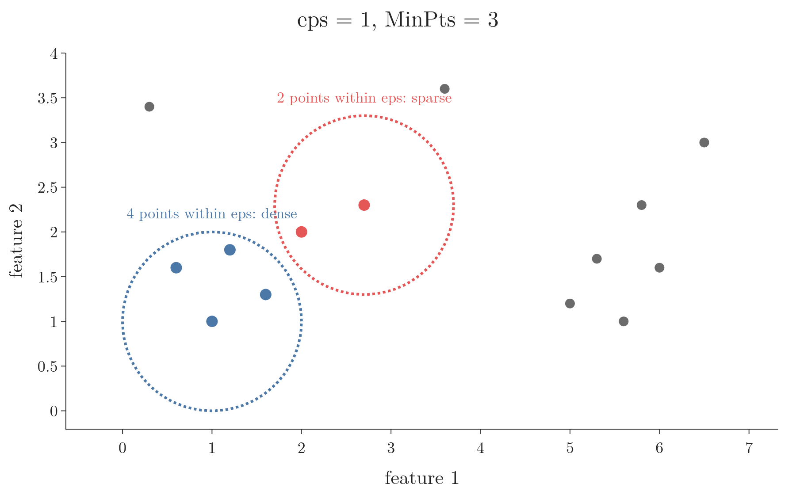
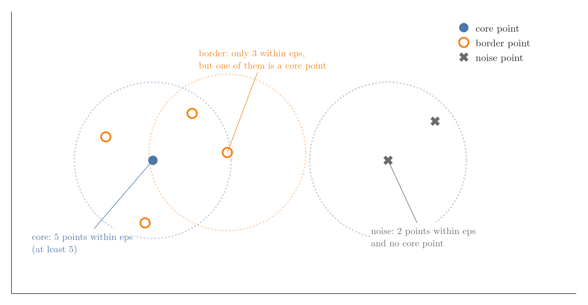
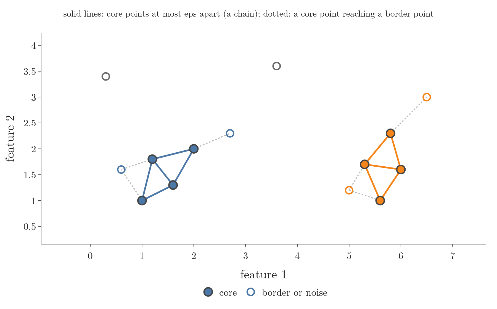
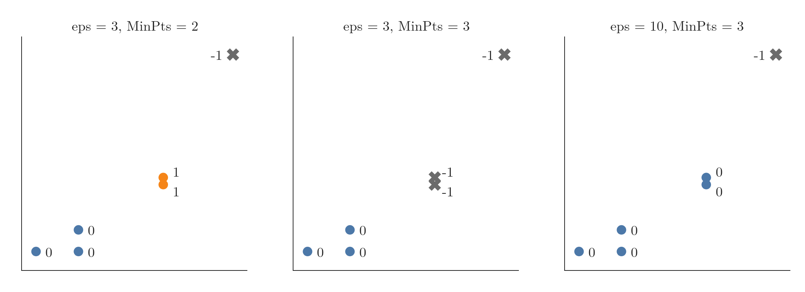
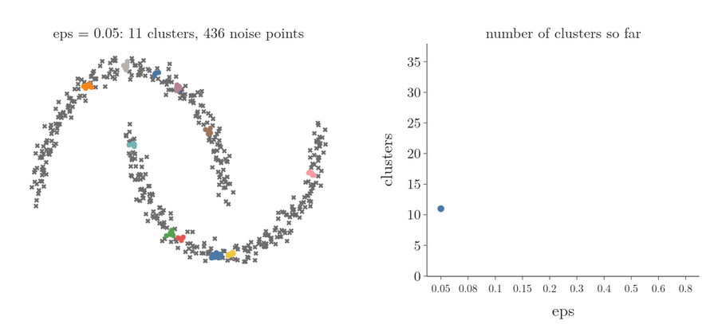
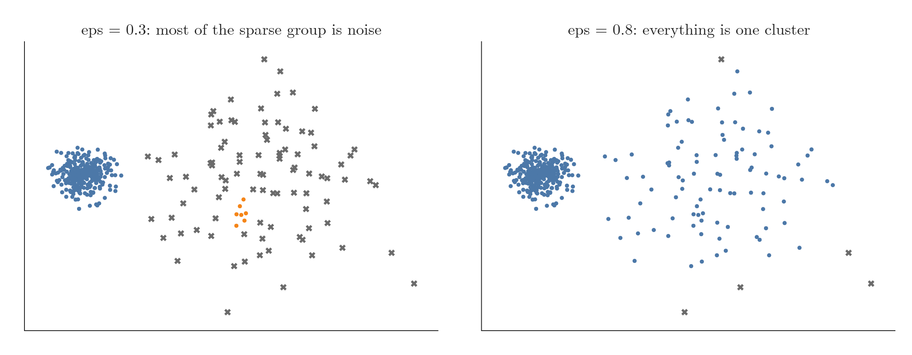

<!-- where-this-fits: generated by course_map/build_map.py; edit concepts.yaml, not this block -->
> **Where this fits:** Pipeline map step 8 (Model). See the [Course map](../../../00-course-map/00-course-map.md).
>
> 
>
> - **Builds on:** [Unsupervised learning](../../../ML/01-foundations/ML-003-types-of-ml/ML-003-types-of-ml.md#3-unsupervised-learning).
> - **Leads to:** [K-means](../../../MA/08-likelihood/MA-074-expectation-maximization/MA-074-expectation-maximization.md#8-k-means-as-hard-em).
> - **Compare with:** [K-means](../../../ML/09-clustering-and-more/ML-124-kmeans-from-scratch/ML-124-kmeans-from-scratch.md#1-overview); [Hierarchical clustering](../../../ML/09-clustering-and-more/ML-125-hierarchical-clustering/ML-125-hierarchical-clustering.md#4-two-kinds-of-hierarchical-clustering).
<!-- /where-this-fits -->

## 1. Overview

> **Key point:** DBSCAN grows clusters through dense regions of points and labels points in sparse regions as noise. DBSCAN finds the number of clusters by itself and handles any shape, but needs two well-chosen settings: eps and MinPts.

**DBSCAN** (G-548; density-based spatial clustering of applications with noise) is a clustering algorithm that groups points lying in dense regions and marks lonely points as noise. Each point is an **observation** (G-1374; one record of the data, a row of the table). Figure 1 shows why it matters: on two moons and two circles, where k-means (a method that groups points around centroids, the means of the groups) cuts straight across the shapes (see [where k-means struggles](../ML-125-hierarchical-clustering/ML-125-hierarchical-clustering.md#3-where-k-means-struggles)), DBSCAN finds them exactly.

{height=28%}

This Note covers why k-means is not enough, the two settings eps and MinPts, the three kinds of points, the algorithm step by step, DBSCAN in scikit-learn, and its strengths and weaknesses. The Notebook (`ML-126-dbscan.ipynb`) runs every example, and `app.py` lets us move eps and MinPts with sliders.

## 2. Prerequisites

- k-means and the elbow method: [the five steps of k-means](../ML-122-kmeans-intuition/ML-122-kmeans-intuition.md#4-the-five-steps-of-k-means) and [choosing k](../ML-122-kmeans-intuition/ML-122-kmeans-intuition.md#5-choosing-k-the-elbow-method).
- Where k-means fails on odd shapes: [where k-means struggles](../ML-125-hierarchical-clustering/ML-125-hierarchical-clustering.md#3-where-k-means-struggles).
- What outliers are and why they matter: [what an outlier is](../../04-missing-data-and-outliers/ML-040-what-are-outliers/ML-040-what-are-outliers.md#2-what-an-outlier-is) and [how outliers spoil a model](../../04-missing-data-and-outliers/ML-040-what-are-outliers/ML-040-what-are-outliers.md#3-how-outliers-spoil-a-model).

## 3. Why k-means is not enough

> **Key point:** k-means needs k in advance, is pulled around by outliers, and only finds round clusters.

k-means is a good algorithm, but it has three flaws serious enough to need another one.

### 3.1 We must choose k

> **Key point:** In high dimensions we cannot see the clusters, and the elbow curve is often ambiguous.

k-means must be told the number of clusters before it starts. With 10 **features** (G-772; input variables, the columns of the data table) we cannot plot the data to count them. The elbow method helps (see [the elbow curve](../ML-122-kmeans-intuition/ML-122-kmeans-intuition.md#52-the-elbow-curve)), but on real data the elbow curve often has no clear bend, and then we are guessing (Schubert 2022).

### 3.2 Outliers pull the centroids

> **Key point:** A centroid is a mean, and one far-away point moves a mean a lot.

k-means computes distances from every point to every centroid and places each centroid at the mean of its points. A mean is sensitive to outliers (see [how outliers spoil a model](../../04-missing-data-and-outliers/ML-040-what-are-outliers/ML-040-what-are-outliers.md#3-how-outliers-spoil-a-model)). Nine points centred on (0, 0) have their mean at (0, 0). Add one outlier at (20, 20) and the mean jumps to (2, 2), outside the group it should describe (Figure 2).

{width=70%}

Every point must also belong to some cluster, so the outlier itself is forced into a group where it does not belong.

### 3.3 Only round clusters

> **Key point:** k-means is centroid-based, so it finds spherical groups and fails on rings, crescents and other shapes.

k-means is a **centroid-based** clustering algorithm (G-368): everything revolves around centroids. Such an algorithm finds compact, round groups. On non-spherical data it fails completely, as [where k-means struggles](../ML-125-hierarchical-clustering/ML-125-hierarchical-clustering.md#3-where-k-means-struggles) shows on circles, moons and stretched groups.

So k-means works well on some datasets and badly on many others. DBSCAN addresses all three flaws.

## 4. Density-based clustering

> **Key point:** Clusters are dense regions of points separated by sparse regions; we find the dense regions and call each one a cluster.

**Density-based clustering** (G-588) groups points by how densely they are packed. In a dataset with two groups, the inside of each group is a **dense region** (G-584): many points close together. Between the groups lies a **sparse region** with few points. The sparse region is what separates the two dense regions into two clusters.

Density does not care about shape. A dense crescent is a cluster just as much as a dense round blob. DBSCAN is one density-based algorithm; another one is **OPTICS** (G-1396; Ankerst et al. 1999).

The name DBSCAN lists its features: **density-based**, **spatial** (it works on points in space), **clustering of applications with noise** (it labels noise points as noise).

## 5. Measuring density: eps and MinPts

> **Key point:** Around a point, draw a circle of radius eps and count the points inside; if there are at least MinPts, the region is dense.

DBSCAN measures density around each point with two settings:

- **eps** (G-697; epsilon): a distance. The circle of radius eps around a point is its **eps-neighbourhood** (G-698). The unit is that of the data: eps = 1 could be 1 centimetre or 1 kilometre.
- **MinPts** (G-1231; minimum points): how many points the eps-neighbourhood must contain for the region to count as dense.

For example, with eps = 1 and MinPts = 3, we draw a circle of radius 1 around a point and count the points inside, the point itself included. 4 points: at least 3, so dense. Around another point the circle holds 2 points: fewer than 3, so sparse. Doing this for every point measures the density everywhere. Figure 3 shows both cases on the 14 points of the animation in section 8.

{width=75%}

eps and MinPts are DBSCAN's only two hyperparameters, and choosing them well is most of the work of using it.

> **Extra:** Whether the point itself is counted differs between explanations. The original paper counts it: the eps-neighbourhood of a point p holds every point within eps of p, p included (Ester et al. 1996, Def. 1). scikit-learn counts it too (scikit-learn `DBSCAN` docs), and section 9.1 shows the effect: with `min_samples=2`, the points (8, 7) and (8, 8) each have only one other point within eps, yet both are core points. So with `min_samples=4`, a point needs 3 neighbours within eps, plus itself.

## 6. Core, border and noise points

> **Key point:** Core points sit in dense regions; border points are not dense themselves but lie within eps of a core point; noise points are neither.

Using eps and MinPts, DBSCAN puts every point into one of three types (Figure 4):

- A **core point** (G-486) has at least MinPts points in its eps-neighbourhood (equal to MinPts is enough). In Figure 4, with eps = 1 and MinPts = 5, the blue point has exactly 5. Core points form the inside of a cluster and make up its shape.
- A **border point** (G-323) meets two conditions: it has fewer than MinPts points in its eps-neighbourhood, but at least one of them is a core point. The circled orange point has only 3, fewer than 5, so it is not a core point; one of the 3 is the blue core point. Border points sit on the edge of a cluster.
- A **noise point** (G-1329) is neither a core point nor a border point. The circled grey cross has only 2 points within eps, so it is not a core point, and neither of them is a core point, so it is not a border point either. Noise points are the outliers far from the dense areas.

{height=45%}

## 7. Density-connected points

> **Key point:** Two points are density-connected if a chain of core points links them, each step no longer than eps; density-connected points belong to the same cluster.

If two points A and B are **density-connected** (G-589), we can put them in the same cluster. They can be far apart: what matters is whether we can walk from A to B through the dense region.

A and B are density-connected if they are linked, possibly indirectly, by a sequence of core points in which every two neighbouring points are at most eps apart.

The chain breaks in two cases:

- **A non-core point in the middle:** there is no core point at some step, only a border point or a noise point. A border point can end a chain but cannot pass it on.
- **A gap:** two neighbouring core points in the chain are more than eps apart.

If either case happens, A and B are not density-connected and go in different clusters. Figure 5 draws the chains on the 14 points with eps = 1 and MinPts = 4: two groups of linked core points, and no chain across the gap.

{width=75%}

## 8. The DBSCAN algorithm step by step

> **Key point:** Label every point; grow one cluster from each unclustered core point through all density-connected core points; attach each border point to its nearest core point's cluster; leave noise alone.

Figure 6 runs DBSCAN on 14 points with eps = 1 and MinPts = 4.

0. **Choose eps and MinPts.**
1. **Label every point** as core, border or noise (Figure 6, frame "Step 1: core, border or noise").
2. **Grow the clusters.** Take a core point that is not yet in a cluster and start a new cluster with it. Add every core point that is density-connected to it. When no more core points can be added, the cluster is complete; take the next unclustered core point and start the next cluster (Figure 6, frames "Step 2: cluster 1 grows" and "cluster 2 grows").
3. **Attach the border points.** Each border point joins the cluster of its nearest core point (Figure 6, frame "Step 3"; the dotted lines join each border point to its nearest core point). A border point joins a cluster but never extends it: a point that is within eps of a border point only, and of no core point, is not pulled in.
4. **Leave the noise.** Noise points join no cluster (Figure 6, frame "Step 4: noise points stay unclustered").

{height=48%}

The result is 2 clusters and 2 noise points. Nobody told DBSCAN there were 2 clusters: the density of the points decided.

> **Extra:** scikit-learn does step 3 slightly differently: a border point within eps of two clusters joins whichever cluster is built first, not necessarily the one of its nearest core point. The result can therefore depend on the order of the data; the core points and noise points are always the same (scikit-learn user guide, DBSCAN).

## 9. DBSCAN in scikit-learn

> **Key point:** `DBSCAN(eps, min_samples).fit(X)`; the result is in `labels_`, where noise gets the label -1.

### 9.1 A six-point example

> **Key point:** With eps = 3 and min_samples = 2, six points give two clusters and one noise point.

scikit-learn calls the two settings `eps` and `min_samples` (MinPts). After `fit`, the attribute `labels_` holds the cluster of every point, and **noise points get the label -1**.

> **Python:** DBSCAN on six points.
>
> ```python
> import numpy as np
> from sklearn.cluster import DBSCAN
>
> X = np.array([[1, 2], [2, 2], [2, 3],
>               [8, 7], [8, 8], [25, 80]])
> db = DBSCAN(eps=3, min_samples=2).fit(X)
> db.labels_                # [ 0,  0,  0,  1,  1, -1]
> db.core_sample_indices_   # [0, 1, 2, 3, 4]
> ```
>
> `core_sample_indices_` lists which points are core points. scikit-learn's defaults are `eps=0.5` and `min_samples=5`; the right values always depend on the data.

The first three points form cluster 0, the next two cluster 1, and the far-away point (25, 80) is noise (Figure 7, left).



### 9.2 Changing min_samples and eps

> **Key point:** A larger min_samples turns small groups into noise; a larger eps merges groups.

- **min_samples = 3** (Figure 7, middle): (8, 7) and (8, 8) have only 2 points within eps, so neither is a core point, and neither is near one. Both become noise. Only the first three points remain a cluster.
- **eps = 10, min_samples = 3** (Figure 7, right): the bigger circle around (2, 3) reaches (8, 7), 7.2 away. The two groups become one cluster of five points. (25, 80) is still noise.

### 9.3 Shapes k-means cannot handle

> **Key point:** On the circles DBSCAN recovers both rings exactly; k-means does no better than chance.

Figure 1 shows DBSCAN (eps = 0.3, min_samples = 5, on standardized data) on the two shapes where k-means fails (see [where k-means struggles](../ML-125-hierarchical-clustering/ML-125-hierarchical-clustering.md#3-where-k-means-struggles)). The data is standardized first because eps is one distance for every feature (section 5): a feature measured in large units would dominate every distance, exactly as IQ dominates CGPA in [k-means on two features](../ML-122-kmeans-intuition/ML-122-kmeans-intuition.md#43-steps-3-and-4-on-two-features). We can score each result by how well it matches the true groups, with the adjusted Rand score (1 = identical, 0 = no better than chance):

| Data | k-means | DBSCAN |
|---|---|---|
| Two moons | 0.49 | 1.00 |
| Two circles | 0.00 | 1.00 |

DBSCAN does not care about the shape or size of a cluster, only about density.

## 10. Strengths of DBSCAN

> **Key point:** Robust to outliers, no k to choose, any cluster shape, and only two hyperparameters.

- **Robust to outliers:** noise points are detected and labelled -1 instead of being forced into a cluster. Labelling noise makes DBSCAN useful for anomaly detection (see [anomaly detection](../../01-foundations/ML-003-types-of-ml/ML-003-types-of-ml.md#34-anomaly-detection)).
- **No k:** DBSCAN finds the number of clusters by itself. In Figure 6 it found 2 without being told.
- **Any shape:** clusters can be rings, crescents or any other shape, because only density matters.
- **Few settings:** just two hyperparameters, eps and MinPts.

## 11. Weaknesses of DBSCAN

> **Key point:** It is sensitive to eps and MinPts, fails when clusters have different densities, and cannot predict the cluster of a new point.

### 11.1 Sensitive to its hyperparameters

> **Key point:** Small changes in eps or MinPts can change the clustering a lot.

Section 9.2 showed it on six points: one change in `min_samples` or `eps` gave a completely different result. We must choose both values with care, and try several.

Figure 8 shows the same on the two moons of Figure 1, with MinPts fixed at 5 and eps growing from 0.05 to 0.8. Watch the left panel:

- **eps too small (0.05 to 0.1):** few points have 5 neighbours within eps, so the moons break into many small clusters (33 at eps = 0.08) and many points are noise (136).
- **eps about right (0.2 to 0.5):** the two moons, with at most one noise point.
- **eps too large (0.6 and above):** the gap between the moons is now shorter than eps, so the chain of core points crosses it and everything becomes one cluster.



### 11.2 Clusters of different density

> **Key point:** One eps cannot suit a tightly packed cluster and a loosely spread one at the same time.

Figure 9 has a tightly packed group on the left and a loosely spread group on the right. eps is a single value for the whole dataset:

- **Small eps (0.3):** right for the dense group, but most of the sparse group (93 of its 100 points) becomes noise.
- **Large eps (0.8):** right for the sparse group, but now the two groups merge into one cluster.

{height=34%}

### 11.3 No predictions for new points

> **Key point:** DBSCAN only labels the data it was trained on; scikit-learn's `DBSCAN` has no `predict` method.

DBSCAN labels the points it was given and stops. If a new point arrives tomorrow, it cannot say which cluster the point belongs to: we would have to add the point and run the whole algorithm again, because the new point may itself change which points are core points. So scikit-learn offers `fit` and `fit_predict`, but no `predict`.

## 12. Choosing eps: the k-distance plot

> **Key point:** For every point, measure the distance to its MinPts-th nearest point, sort these distances, and put eps where the curve bends upward.

> **Extra:** A common way to choose eps:
>
> 1. Fix MinPts first (this method draws a **k-distance plot**, G-994). For 2-D data the original paper uses MinPts = 4 (Ester et al. 1996, §4.2).
> 2. For every point, compute the distance to its MinPts-th nearest point (counting the point itself, as scikit-learn does).
> 3. Sort these distances and plot them (Figure 10).
>
> Points inside clusters have small distances; noise points have large ones. The curve stays low and then shoots up. A value of eps at the bend treats the points with a larger k-distance as noise and puts all others in some cluster (Ester et al. 1996, §4.2). On the standardized moons, the bend is at about 0.2, and any eps from 0.2 to 0.4 gives the two moons exactly.
>
> ```python
> from sklearn.neighbors import NearestNeighbors
>
> dist, _ = NearestNeighbors(n_neighbors=5).fit(X).kneighbors(X)
> k_dist = np.sort(dist[:, -1])   # distance to the 5th nearest point
> ```

{height=36%}

## 13. Experimenting with eps and MinPts

> **Key point:** The best way to build intuition is to move eps and MinPts and watch the clusters change.

`app.py`, in this Note's folder, is a small Dash app. Run `python app.py` and open `http://127.0.0.1:8050`. Choose a dataset and move the two sliders; the plot shows the clusters, the noise points and their counts.

<!-- playground: images/dbscan_playground.html -->

Things to try:

- **Two moons, eps from 0.05 to 1.0:** many tiny clusters and much noise, then the two moons, then one big cluster.
- **Three groups plus noise:** find settings where the scattered points become noise and the three groups stay separate.
- **Two densities:** try to find one eps that gives both groups. There is none, which is section 11.2.
- **Any dataset, min_samples from 2 to 20:** larger values call more points noise.

## 14. Summary

| | k-means | DBSCAN | Why |
|---|---|---|---|
| Idea | centroid-based | density-based | a dense region can have any shape; centroids give round groups |
| Number of clusters | must be given (k) | found automatically | in DBSCAN the density of the points decides |
| Cluster shapes | round only | any shape | DBSCAN only looks at density, not at distance to a centre |
| Outliers | pull centroids; forced into clusters | labelled noise (-1) | a mean moves a lot for one far point; DBSCAN leaves sparse points out |
| Clusters of different density | no density setting to tune | fails: one eps for all | one eps cannot suit a tight group and a loose one at once |
| Predict new points | yes (`predict`) | no | a new point can change which points are core points, so DBSCAN must run again |
| Settings | k | eps, MinPts (`min_samples`) | small changes in eps or MinPts can change the clustering a lot |

- A core point has at least MinPts points within eps (itself included); a border point has fewer but is within eps of a core point; everything else is noise. So core points make the inside of a cluster, border points its edge, and noise points are the outliers.
- Points linked by a chain of core points, each step at most eps, are density-connected and share a cluster, so a cluster can take any shape as long as its dense region is unbroken.
- Algorithm: label points, grow clusters from core points, attach border points, leave noise, so the number of clusters comes out of the data instead of being given.
- In scikit-learn: `DBSCAN(eps, min_samples).fit(X).labels_`, with -1 for noise, so outliers are marked instead of being forced into a cluster.
- Choose eps with care, for example from the bend of the k-distance plot, because too small an eps breaks clusters into pieces and noise, and too large an eps merges them into one.
- So DBSCAN fixes k-means' three flaws (k in advance, outliers, round shapes), at the price of choosing eps and MinPts well.

## 15. Sources

**Built from**

- CampusX, "DBSCAN Clustering Algorithms | Density Based Clustering | How DBSCAN Works | CampusX", YouTube, https://www.youtube.com/watch?v=1_bLnsNmhCI
- StatQuest with Josh Starmer, "Clustering with DBSCAN, Clearly Explained!!!", YouTube, https://www.youtube.com/watch?v=RDZUdRSDOok

**Other references**

- Ester et al. 1996: M. Ester, H.-P. Kriegel, J. Sander and X. Xu, *A Density-Based Algorithm for Discovering Clusters in Large Spatial Databases with Noise*, Proceedings of KDD 1996, Definition 1 and §4.2.
- scikit-learn `DBSCAN` docs: the `min_samples` parameter of `sklearn.cluster.DBSCAN` ("This includes the point itself"), scikit-learn 1.9 API reference.
- scikit-learn user guide, DBSCAN: section 2.3 Clustering, DBSCAN, implementation notes on border points and data order.
- Ankerst et al. 1999: M. Ankerst, M. M. Breunig, H.-P. Kriegel and J. Sander, *OPTICS: Ordering Points To Identify the Clustering Structure*, Proceedings of ACM SIGMOD 1999, 49–60.
- Schubert 2022: E. Schubert, *Stop using the elbow criterion for k-means and how to choose the number of clusters instead*, arXiv:2212.12189, 2022.

## 16. Key terms

| Term | Meaning |
|---|---|
| DBSCAN | Density-based spatial clustering of applications with noise: clusters dense regions and labels lonely points as noise |
| Centroid-based clustering | Clustering built around centroids, such as k-means |
| Density-based clustering | Clustering that finds dense regions of points separated by sparse regions |
| Dense region, sparse region | An area with many points close together; an area with few points |
| eps (epsilon) | The radius of the neighbourhood DBSCAN examines around each point |
| eps-neighbourhood | All points within distance eps of a point |
| MinPts (min_samples) | The number of points an eps-neighbourhood needs for the point to be a core point |
| Core point | A point with at least MinPts points within eps |
| Border point | A point with fewer than MinPts points within eps, but with a core point among them |
| Noise point | A point that is neither core nor border; DBSCAN labels it -1 |
| Density-connected | Linked by a chain of core points with every step at most eps |
| OPTICS | Another density-based clustering algorithm |
| k-distance plot | Sorted distances from every point to its k-th nearest point, used to choose eps |
