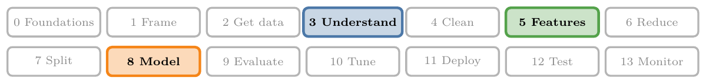
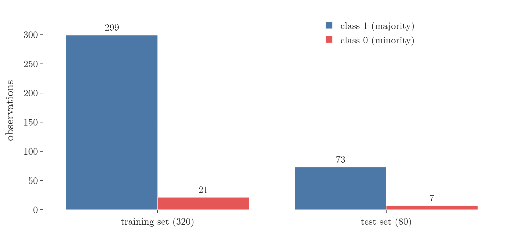
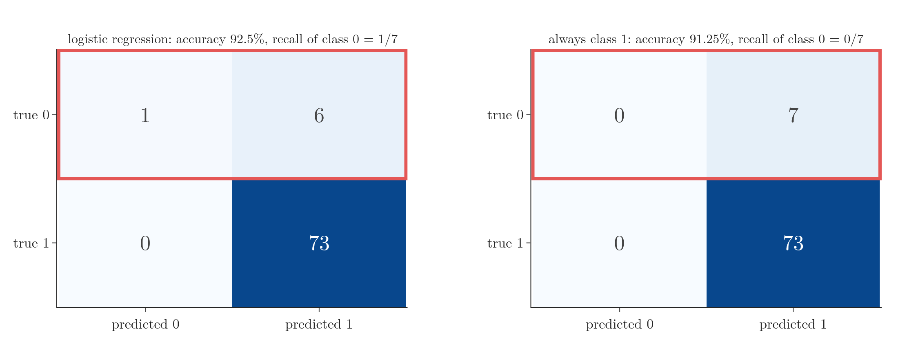
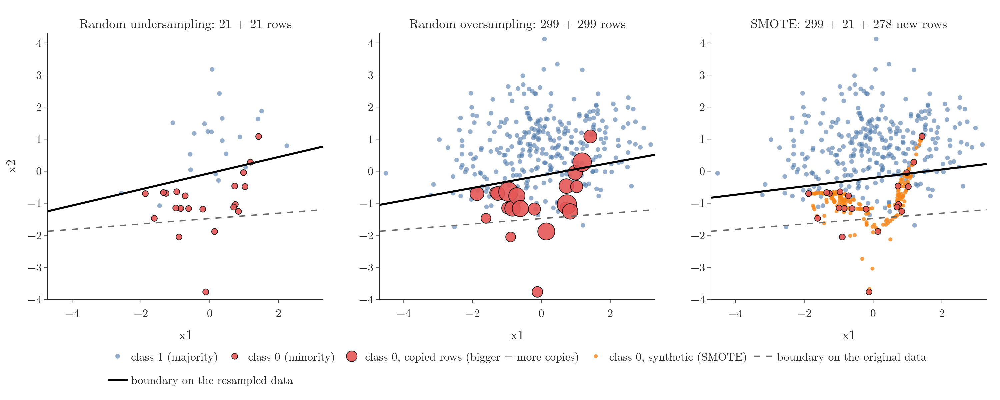
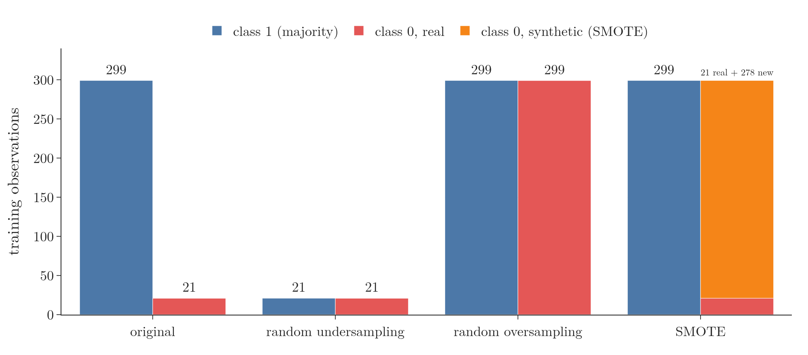
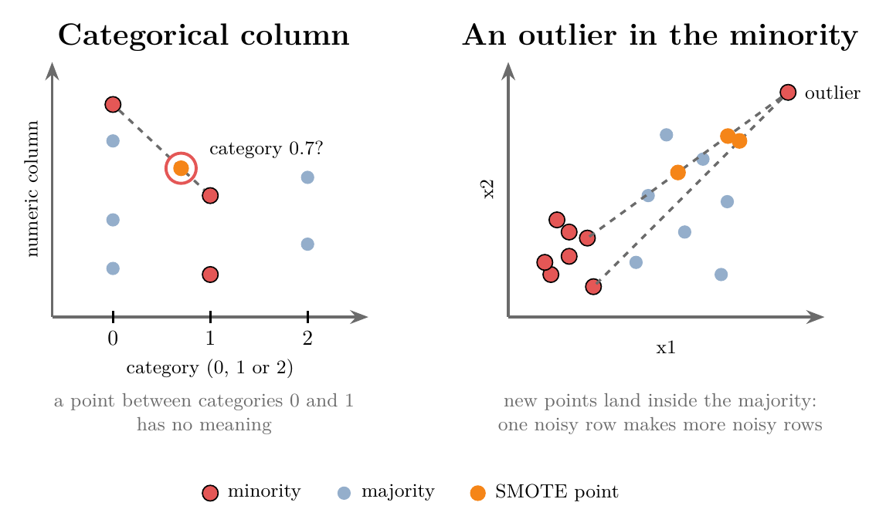
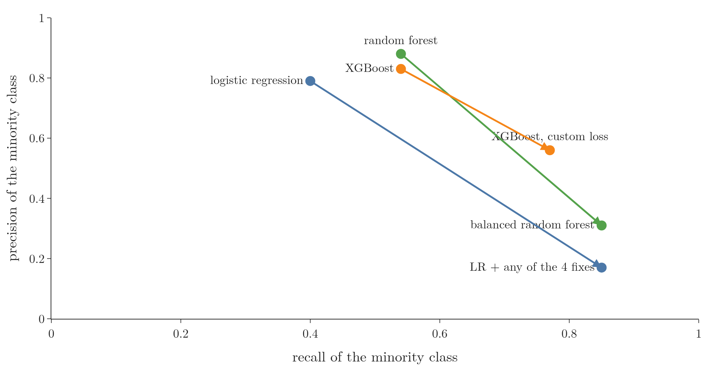

<!-- where-this-fits: generated by course_map/build_map.py; edit concepts.yaml, not this block -->
> **Where this fits:** Pipeline map steps 3 (Understand data), 5 (Engineer features), 8 (Model). See the [Course map](../../../00-course-map/00-course-map.md).
>
> 
>
> - **Builds on:** [Cross-validation](../../../ML/03-feature-engineering/ML-028-pipelines/ML-028-pipelines.md#8-cross-validation-with-a-pipeline); [Log loss (binary cross entropy)](../../../MA/08-likelihood/MA-072-mle-in-machine-learning/MA-072-mle-in-machine-learning.md#4-a-bernoulli-target-gives-the-log-loss); [Confusion matrix](../../../ML/07-classification/ML-075-accuracy-confusion-matrix/ML-075-accuracy-confusion-matrix.md#4-the-confusion-matrix); [ROC curve and AUC](../../../ML/07-classification/ML-077-roc-auc/ML-077-roc-auc.md#4-the-roc-curve); [K-nearest neighbours](../../../ML/07-classification/ML-085-knn/ML-085-knn.md#2-how-knn-predicts); [Random forest](../../../ML/08-trees-and-ensembles/ML-102-random-forest-intro/ML-102-random-forest-intro.md#4-how-a-random-forest-works).
> - **Leads to:** [ANN for classification](../../../DL/01-basics/DL-011-customer-churn-ann/DL-011-customer-churn-ann.md#4-building-a-network-in-keras).
<!-- /where-this-fits -->

## 1. Overview

> **Key point:** When one class is rare, a model learns mostly the common class; we fix this by changing the data, the ensemble, or the cost of mistakes.

{height=40%}

**Imbalanced data** (G-921) was defined in [when accuracy misleads](../../07-classification/ML-075-accuracy-confusion-matrix/ML-075-accuracy-confusion-matrix.md#6-when-accuracy-misleads-imbalanced-data): data in which one class is much rarer than another. This Note shows what goes wrong when we train on it and teaches the five techniques of Figure 1:

- **Change the data** (resampling): random undersampling, random oversampling, SMOTE.
- **Change the ensemble:** the balanced random forest.
- **Change the learning** (cost-sensitive learning): class weights and a custom loss function.

The Notebook (`ML-127-imbalanced-data.ipynb`) runs every technique on the same dataset.

## 2. What imbalanced data looks like

> **Key point:** One class (the majority) has far more observations than another (the minority); this happens with two classes or with many.

Take a college where we know each student's CGPA and IQ and whether they were placed. Each student is one **observation** (G-1374; one record, one row of the data table); CGPA and IQ are **features** (G-772; input variables, one column each); placed or not is the **target** (G-1949), the output we predict. At a top college, most students are placed: out of 500 final-year students, perhaps 450 placed and 50 not. Placed is the **majority class** (G-1145), the class with many observations; not placed is the **minority class** (G-1229), the rare one.

The same can happen with three or more classes. Suppose 10 more students did not sit for placements at all, a third class. The data now has one large class and two small ones, and it is still imbalanced.

### 2.1 Our dataset

> **Key point:** 400 observations, two features, about 7% in class 0; the training set has 299 observations of class 1 and only 21 of class 0.

To see the effects, we use a synthetic dataset made with scikit-learn's `make_classification`: 400 observations, two features `x1` and `x2`, and two classes. Class 1 is the majority and class 0 the minority. After an 80/20 split, the training set has 320 observations (299 of class 1, 21 of class 0) and the test set 80 observations (73 and 7) (Figure 2).

{width=75%}

> **Python:** Making an imbalanced dataset.
>
> ```python
> from sklearn.datasets import make_classification
>
> X, y = make_classification(
>     n_samples=400, n_features=2, n_informative=2,
>     n_redundant=0, n_clusters_per_class=2,
>     weights=[0.07], class_sep=0.8, flip_y=0,
>     random_state=59)
> ```
>
> `weights=[0.07]` puts about 7% of the rows in class 0. `n_clusters_per_class=2` gives each class two blobs, so no straight line separates them well.

## 3. Two problems with imbalanced data

> **Key point:** The model becomes biased towards the majority class, and accuracy hides it.

### 3.1 Bias towards the majority class

> **Key point:** The algorithm sees mostly majority observations, so it learns them well and the minority badly.

A model learns from the observations it sees. With 299 observations of class 1 and 21 of class 0, almost all of the training signal is about class 1. The model learns to get class 1 right and pays little attention to class 0.

{width=100%}

Figure 3 shows the result for logistic regression. The decision boundary sits low, below almost all the red points. The model keeps almost every blue point on the correct side and gives up on most of the red ones: it is **biased towards the majority class**.

### 3.2 Accuracy is not reliable

> **Key point:** The model in Figure 3 has 92.5% accuracy but finds only 1 of the 7 minority observations in the test set.

The classification report of the model in Figure 3, on the 80 test observations:

| Class | Precision | Recall | F1 | Observations |
|---|---|---|---|---|
| 0 (minority) | 1.00 | **0.14** | 0.25 | 7 |
| 1 (majority) | 0.92 | 1.00 | 0.96 | 73 |
| Accuracy | | | **0.925** | 80 |

The accuracy, 92.5%, looks excellent. The recall of class 0 is 0.14: of the 7 minority observations, the model found only 1. If class 0 is the class we care about, this model is nearly useless. Figure 4 shows where the 92.5% comes from: the 73 majority observations, all right.

{width=100%}

A "dumb" model that always answers class 1 already scores 73 / 80 = 91.25% here, the same trap as in [when accuracy misleads](../../07-classification/ML-075-accuracy-confusion-matrix/ML-075-accuracy-confusion-matrix.md#6-when-accuracy-misleads-imbalanced-data). So on imbalanced data we judge models by the minority class's precision (the share of flagged observations that are really minority), recall (the share of minority observations found) and F1 (their balance), see [precision](../../07-classification/ML-076-precision-recall-f1/ML-076-precision-recall-f1.md#2-precision) and [recall](../../07-classification/ML-076-precision-recall-f1/ML-076-precision-recall-f1.md#3-recall), and by ROC AUC (how well the model ranks minority above majority, see [the ROC curve](../../07-classification/ML-077-roc-auc/ML-077-roc-auc.md#4-the-roc-curve)).

> **Python:** The classification report.
>
> ```python
> from sklearn.linear_model import LogisticRegression
> from sklearn.metrics import classification_report
>
> clf = LogisticRegression().fit(X_train, y_train)
> print(classification_report(y_test, clf.predict(X_test)))
> ```

## 4. Why imbalanced data matters

> **Key point:** Many of the problems classical ML is used for are imbalanced, and in most of them the rare class is the one we need to find.

| Domain | Problem | The rare class |
|---|---|---|
| Finance | fraud detection | fraudulent transactions |
| Finance | credit risk assessment | customers who will not repay a loan |
| Healthcare | rare disease prediction | patients who have the disease (say 1%) |
| Manufacturing | predicting machine failure | machines about to break down |
| Consumer internet | churn prediction | users who will leave the platform next month |
| Environmental science | earthquake or volcano prediction | days with an eruption or quake |

In every row of the table, predicting the minority class correctly is the whole point. A model that is biased towards the majority, like the one in Figure 3, fails exactly where it matters.

## 5. Random undersampling

> **Key point:** Randomly drop majority observations until both classes have the same number of observations.

The simplest fix is to make the data balanced. **Random undersampling** (G-1619) keeps every minority observation and draws, at random and without replacement, the same number of majority observations. The other majority observations are thrown away.

With 900 majority and 100 minority observations, we keep 100 random majority observations and all 100 minority observations: 200 observations instead of 1,000. On our training set, 320 observations (299 + 21) become **42** observations (21 + 21).

> **Python:** Random undersampling with the imbalanced-learn library.
>
> ```python
> import numpy as np
> from imblearn.under_sampling import RandomUnderSampler
>
> rus = RandomUnderSampler(random_state=42)
> X_under, y_under = rus.fit_resample(X_train, y_train)
> X_under.shape           # (42, 2)
> np.bincount(y_under)    # [21, 21]
> ```
>
> **imbalanced-learn** (G-922; imported as `imblearn`) collects the techniques of this Note behind one method, `fit_resample`, which returns the new inputs and labels. `np.bincount` counts how many labels are 0, 1, and so on.

{width=100%}

Figure 5, left, shows the 42 observations and the new boundary. Logistic regression now treats both classes as equally important, and the line moves up through the middle of the data. The minority recall on the test set rises from 0.14 to **1.00** (all 7 found), while the minority precision falls from 1.00 to 0.33: the model now also flags many majority observations as class 0.

> **Extra:** A straight line cannot separate this data well, because each class has two blobs. Undersampling fixes the bias, not the shape of the boundary; an algorithm that draws curved boundaries, such as a random forest, may do better.

**Advantages:**

- Undersampling removes the bias towards the majority class.
- The data gets smaller, so training is faster. With 10 lakh majority and 1 lakh minority observations, we train on 2 lakh observations instead of 11 lakh.

**Disadvantages:**

- We throw data away: here 278 of 320 observations. Those observations may hold information the model needs.
- The sample can be unrepresentative. A random sample is usually fine, but by bad luck it can keep one kind of majority observation and drop another.

## 6. Random oversampling

> **Key point:** Randomly copy minority observations until both classes have the same number of observations.

**Random oversampling** (G-1613) goes the other way: keep every observation and draw minority observations at random *with replacement* until the minority is as large as the majority. With 900 and 100 observations, we draw 900 minority observations from the 100, so each one appears 9 times on average.

On our training set, 320 observations become **598** (299 + 299) (Figure 6).

{width=90%}

Each of the 21 minority observations now appears between 9 and 21 times. In a scatter plot the copies sit exactly on top of each other, which is why Figure 5, middle, draws each repeated observation as one dot whose size grows with the number of copies.

> **Python:** Random oversampling.
>
> ```python
> from imblearn.over_sampling import RandomOverSampler
>
> ros = RandomOverSampler(random_state=42)
> X_over, y_over = ros.fit_resample(X_train, y_train)
> np.bincount(y_over)     # [299, 299]
> ```

The boundary moves up much as with undersampling (Figure 5, middle). The minority recall rises to **0.86** (6 of 7) and the precision falls to 0.32.

**Advantage:** random oversampling removes the bias towards the majority class without throwing any data away.

**Disadvantages:**

- The data grows: here from 320 to 598 observations. A 1 GB dataset can become nearly 2 GB.
- Copies are not new information. An observation repeated 21 times looks very important to the algorithm, which can **overfit** (G-1429) to it, especially decision trees: the tree carves out tiny regions around the repeated points, with more splits and more leaves (Chawla et al. 2002, §4.1).

## 7. SMOTE

> **Key point:** Instead of copying minority observations, create new ones on the line between a minority observation and one of its minority neighbours.

**SMOTE** (G-1825; Synthetic Minority Over-sampling Technique) is the most popular technique for imbalanced data. SMOTE is an oversampling technique: it grows the minority class until the classes are equal. The difference is that it makes new observations instead of copies, so the model does not see the same point again and again.

### 7.1 Interpolation

> **Key point:** A new point is placed a random fraction of the way from a minority point to its neighbour.

SMOTE creates observations by **interpolation** (G-964): placing a new point on the straight segment between two existing points.

**The new point, step by step:**

1. **In words:** start at the minority point $x$; move a random fraction $\lambda$ (between 0 and 1) of the way towards its neighbour $n$.
2. **Formula:**

   $$x_{\text{new}} = x + \lambda \thinspace(n - x)$$

   $$0 \le \lambda \le 1$$

   With $\lambda = 0$ the new point is $x$ itself; with $\lambda = 1$ it is the neighbour. The same formula is often written $x - \lambda\thinspace(x - n)$.
3. **Example:** $x = (1, 1)$, $n = (2, 2)$ and $\lambda = 0.5$:

   $$x_{\text{new}} = (1, 1) + 0.5 \times \big((2, 2) - (1, 1)\big)$$

   $$x_{\text{new}} = (1, 1) + (0.5, 0.5)$$

   $$x_{\text{new}} = (1.5, 1.5)$$

   The new point lies exactly halfway between the two.

### 7.2 The algorithm

> **Key point:** Find each minority point's 5 nearest minority neighbours, then repeat: random point, random neighbour, random fraction, new point.

{width=100%}

Figure 7 shows the steps:

1. Take only the minority observations, and find the $k$ nearest minority neighbours of each one, usually $k = 5$ (a KNN search, as in [how KNN predicts](../../07-classification/ML-085-knn/ML-085-knn.md#2-how-knn-predicts)).
2. Pick a minority point at random.
3. Pick one of its $k$ neighbours at random.
4. Draw a random $\lambda$ between 0 and 1 and create the new point $x + \lambda\thinspace(n - x)$.
5. Repeat steps 2 to 4 until the minority class is as large as the majority.

> **Python:** SMOTE written by hand in a few lines of NumPy, to see every step.
>
> ```python
> from sklearn.neighbors import NearestNeighbors
>
> def smote(X, y, k=5, seed=42):
>     rng = np.random.default_rng(seed)
>     mino = X[y == 0]
>     # step 1: k nearest minority neighbours
>     # (k + 1, since each point is its own nearest)
>     nn = NearestNeighbors(n_neighbors=k + 1).fit(mino)
>     nbrs = nn.kneighbors(mino, return_distance=False)
>     nbrs = nbrs[:, 1:]
>     n_new = (y == 1).sum() - len(mino)
>     i = rng.integers(len(mino), size=n_new)    # step 2
>     j = nbrs[i, rng.integers(k, size=n_new)]   # step 3
>     lam = rng.random((n_new, 1))               # step 4
>     new = mino[i] + lam * (mino[j] - mino[i])
>     return (np.vstack([X, new]),
>             np.r_[y, np.zeros(n_new)])
> ```
>
> `rng.integers(21, size=278)` draws 278 random positions at once, so all new points are made in one go instead of in a loop.

> **Python:** SMOTE with imbalanced-learn, the version we use in practice.
>
> ```python
> from imblearn.over_sampling import SMOTE
>
> sm = SMOTE(k_neighbors=5, random_state=42)
> X_smote, y_smote = sm.fit_resample(X_train, y_train)
> new = X_smote[len(X_train):]   # the 278 synthetic rows
> ```
>
> imbalanced-learn builds each new point exactly as our function does (imbalanced-learn source, `_smote/base.py`): a random minority point, one of its `k_neighbors` nearest minority neighbours, and a random factor between 0 and 1. `fit_resample` returns the original observations first and the synthetic observations after them.

On our data, SMOTE creates 278 new observations: 320 observations become 598 (299 + 299). Figure 5, right, shows them in orange, lying on segments between red points. The boundary moves up again; the minority recall rises to **0.71** (5 of 7) and the precision falls to 0.29.

### 7.3 Advantages and disadvantages

> **Key point:** SMOTE reduces bias without copies, but it fails on categorical features, is slow on big data, depends on k, spreads outliers and may invent unrealistic observations.

**Advantages:**

- SMOTE reduces the bias towards the majority class.
- There are no duplicates, so there is less risk of overfitting than with random oversampling (section 10 tests this on real data).

SMOTE is popular, but whether to use it is much debated, because of five disadvantages:

1. **SMOTE cannot handle categorical features.** Interpolating between category 0 and category 1 can give 0.7, which is not a category (Figure 8, left).
2. **SMOTE is slow on large data.** SMOTE needs a nearest-neighbour search, which measures many distances and becomes slow with many observations or many features.
3. **SMOTE depends on $k$.** With $k = 1$, every new point lies on the segment to the single nearest neighbour, so the new points have little variety. With a very large $k$, neighbours can be far away and new points appear all over the feature space. The middle is hard to find; $k = 5$ is the usual default, but the best value depends on the data. Figure 9 shows all three cases on our training data.
4. **SMOTE is sensitive to outliers.** A noisy minority point far from the others gets picked too, and the segments to its neighbours cross the majority region, so one noisy observation creates more noisy observations (Figure 8, right). Our own data shows this: the red outlier at the bottom of Figure 5, right, pulls a trail of orange points down with it.
5. **The new observations may not be realistic.** Nothing guarantees that the invented points follow the true distribution of the population. They follow the straight lines between existing points, which real data may not.

{width=90%}

{width=100%}

> **Extra:** imbalanced-learn has variants aimed at some of these problems (imbalanced-learn user guide, Over-sampling). `SMOTENC` handles a mix of numeric and categorical features (for a categorical feature it takes the most common category among the neighbours instead of interpolating). `BorderlineSMOTE` creates points only near the class boundary, and `ADASYN` creates more points where the minority is hardest to learn.

### 7.4 Resampling only the training data

> **Key point:** Resample after the split, and inside each cross-validation fold; resampling first makes the scores look far better than they are.

We resample **only the training set**, after the train-test split. The test set must keep its real class balance, or the scores no longer describe real data. And SMOTE points made from test observations would leak test information into training (data leakage: test information reaching the training step, see [scaling the inputs](../../01-foundations/ML-012-toy-project/ML-012-toy-project.md#7-scaling-the-inputs)).

The same holds inside cross-validation (see [cross-validation with a pipeline](../../03-feature-engineering/ML-028-pipelines/ML-028-pipelines.md#8-cross-validation-with-a-pipeline)). If we run SMOTE on the whole training set and then cross-validate, the validation folds are full of synthetic points built from the training folds' own minority observations, and they no longer have the real class balance (imbalanced-learn user guide, Common pitfalls).

imbalanced-learn's own `Pipeline` fixes this: it runs the resampler only while fitting, so each fold resamples its own training part and validates on untouched observations. On our training set, with 5-fold cross-validation and the F1 score of class 0:

| Setup | Cross-validated F1 (class 0) |
|---|---|
| No resampling | 0.200 |
| SMOTE inside an imblearn `Pipeline` (correct) | **0.426** |
| SMOTE on all observations, then cross-validation (leaky) | 0.885 |

The leaky setup reports more than twice the honest score, and almost all of the gap comes from the synthetic validation points: scoring only the real observations of the same leaky folds gives 0.398, close to the honest 0.426 (Notebook).

> **Python:** SMOTE inside cross-validation.
>
> ```python
> from imblearn.pipeline import Pipeline
> from sklearn.metrics import f1_score, make_scorer
> from sklearn.model_selection import (StratifiedKFold,
>                                      cross_val_score)
>
> pipe = Pipeline([("smote", SMOTE(random_state=42)),
>                  ("model", LogisticRegression())])
> cv = StratifiedKFold(n_splits=5, shuffle=True,
>                      random_state=42)
> f1_minority = make_scorer(f1_score, pos_label=0)
> cross_val_score(pipe, X_train, y_train, cv=cv,
>                 scoring=f1_minority).mean()   # 0.426
> ```
>
> scikit-learn's own `Pipeline` cannot hold a resampler, because it only knows `fit`/`transform` steps. `StratifiedKFold` keeps the class ratio the same in every fold, so each fold gets some of the 21 minority observations. `make_scorer(f1_score, pos_label=0)` scores the F1 of class 0 instead of class 1.

## 8. Ensemble methods: the balanced random forest

> **Key point:** A balanced random forest trains every tree on a balanced sample: the minority observations (or a bootstrap sample of them) plus the same number of random majority observations.

Ensemble methods (many models whose answers are combined, see [how an ensemble predicts](../../08-trees-and-ensembles/ML-095-ensemble-learning/ML-095-ensemble-learning.md#3-how-an-ensemble-predicts)) such as bagging and random forests can be changed to handle imbalanced data. A random forest ([how a random forest works](../../08-trees-and-ensembles/ML-102-random-forest-intro/ML-102-random-forest-intro.md#4-how-a-random-forest-works)) trains many decision trees, each on a random sample of the observations, and combines their votes. A **balanced random forest** (G-256) changes only how each sample is drawn: every sample is balanced, even though the data is not.

{height=42%}

In Figure 10, the training data has 900 majority and 300 minority observations. Each sample takes 300 minority observations and 300 majority observations drawn at random, 600 observations in all, and one tree is trained on it. To predict, every tree votes and the majority vote wins: here 1, 0 and 1 give 1.

Undersampling (section 5) threw most majority observations away for good. Here each tree throws different observations away, so together the trees still see most of the majority class. On our data, 100 trees each draw 21 of the 299 majority observations, so a given observation is missed by every tree with the probability below (each of the 100 trees draws 21 observations, 2,100 draws in all, and each draw misses a given observation with probability $1 - 1/299$):

$$(1 - 1/299)^{2100} \approx 0.001$$

> **Python:** A balanced random forest with imbalanced-learn.
>
> ```python
> from imblearn.ensemble import BalancedRandomForestClassifier
>
> brf = BalancedRandomForestClassifier(
>     n_estimators=100, random_state=42)
> brf.fit(X_train, y_train)
> y_pred = brf.predict(X_test)
> ```
>
> The balanced forest is used like any scikit-learn classifier. By default (`sampling_strategy="all"`, `replacement=True`), every tree gets 21 observations of each class, drawn with replacement: a bootstrap sample of the minority and an equally small random sample of the majority.

On our data, the balanced forest finds 5 of the 7 minority test observations (recall **0.71**, precision 0.28). An ordinary random forest finds 3 (recall 0.43, precision 0.50).

> **Extra:** imbalanced-learn has other balanced ensembles (imbalanced-learn API reference): `BalancedBaggingClassifier` (bagging with a resampler on every sample), `EasyEnsembleClassifier` (boosted models on balanced samples) and `RUSBoostClassifier` (boosting with random undersampling at every round).

## 9. Cost-sensitive learning

> **Key point:** Leave the data alone and change the learning itself, so that mistakes on the minority class cost more.

**Cost-sensitive learning** (G-493) changes how the algorithm learns, so that it handles imbalanced data better. There are two ways: class weights, and a custom loss function.

### 9.1 Class weights

> **Key point:** Give the minority class a bigger weight; each of its mistakes then adds more to the loss, and the model works harder to avoid them.

`class_weight` was introduced in [class_weight](../../07-classification/ML-080-logistic-hyperparameters/ML-080-logistic-hyperparameters.md#51-class_weight): it multiplies each observation's loss by a weight for its class. Here we set the weights by hand.

With 900 observations of class 1 and 100 observations of class 0, we might give class 0 a weight of 10 and class 1 a weight of 1. Every mistake on class 0 then costs 10 times as much. For an algorithm trained by gradient descent (see [the idea of gradient descent](../../06-regression/ML-056-gradient-descent/ML-056-gradient-descent.md#2-the-idea)), those mistakes produce 10 times larger updates, so the parameters move more to correct them.

> **Python:** Class weights in logistic regression.
>
> ```python
> clf = LogisticRegression(class_weight={0: 5, 1: 1})
> clf.fit(X_train, y_train)
> ```
>
> The dictionary maps each class label to its weight. `class_weight="balanced"` instead sets each weight to (observations) / (2 × observations of that class): here that gives 7.62 for class 0 and 0.54 for class 1 (worked out below the box).

The `"balanced"` weights for our training set, with 320 observations, 21 in class 0 and 299 in class 1:

$$\text{weight of class 0} = \frac{320}{2 \times 21}$$

$$\text{weight of class 0} = \frac{320}{42} = 7.62$$

$$\text{weight of class 1} = \frac{320}{2 \times 299}$$

$$\text{weight of class 1} = \frac{320}{598} = 0.54$$

The formula is chosen so that each class carries the same total weight, half of the 320, and neither class outweighs the other in the loss:

$$\text{class 0: } 21 \times 7.62 = 160$$

$$\text{class 1: } 299 \times 0.54 = 160$$

{width=90%}

Figure 11 shows the effect. With weight 1 (no weighting), the line sits below the red points; at 5, 25 and 50 it moves further up into the majority class. The bigger the weight, the more pressure on the model to classify the minority correctly:

| Weight of class 0 | Accuracy | Precision (0) | Recall (0) |
|---|---|---|---|
| 1 | 0.925 | 1.00 | 0.14 |
| 5 | 0.900 | 0.44 | 0.57 |
| 25 | 0.788 | 0.29 | 1.00 |
| 50 | 0.700 | 0.23 | 1.00 |

The weight is a dial: raise it and recall rises while precision falls. We pick the value that gives the best result for the problem, for example by cross-validation.

Most scikit-learn classifiers that minimise a loss accept `class_weight`: `LogisticRegression`, `SVC` (a support vector machine, see [the margin](../../07-classification/ML-086-svm-intuition/ML-086-svm-intuition.md#4-the-margin)), `DecisionTreeClassifier`, `RandomForestClassifier` (see [the forest-level hyperparameters](../../08-trees-and-ensembles/ML-105-random-forest-hyperparameters/ML-105-random-forest-hyperparameters.md#3-the-forest-level-hyperparameters)). KNN and Naive Bayes do not, because they do not learn by minimising a loss.

> **Extra:** Among scikit-learn's boosting models, `HistGradientBoostingClassifier` accepts `class_weight`, but `GradientBoostingClassifier` and `AdaBoostClassifier` do not. For those, pass weights per observation through `fit(X, y, sample_weight=...)`, which many scikit-learn models accept (`KNeighborsClassifier` does not).

### 9.2 A custom loss function

> **Key point:** Some libraries (gradient boosting, XGBoost, LightGBM) let us write our own loss, so we can set exactly how much each kind of mistake costs.

The losses we have used so far are standard ones: mean squared error, log loss (see [the loss function](../../07-classification/ML-072-log-loss/ML-072-log-loss.md#62-the-loss-function)). Some algorithms let us replace them with a **custom loss function** (G-523; also called a custom objective) that fits our problem. Suppose missing a minority observation (a false negative, if the minority is the positive class) is worse than a false alarm: we write a log loss that charges more for that mistake.

**The weighted log loss, step by step:**

1. **In words:** the usual log loss, but each observation's loss is multiplied by the cost of its class: $a$ for observations of class 1, $b$ for observations of class 0.
2. **Formula:** with $p_i$ the predicted probability of class 1,
   $$L_i = -a\thinspace y_i \log p_i - b\thinspace(1 - y_i) \log (1 - p_i)$$
   $$L = \frac{1}{n} \sum_{i=1}^{n} L_i$$
   Here $L_i$ is the loss of observation $i$, and $L$ is their average.
3. **Example:** a class 0 observation ($y = 0$) that the model gives $p = 0.9$, so only 0.1 for its true class. With $a = 1$, $b = 3.5$:
   $$\text{loss} = -3.5 \times \log(1 - 0.9)$$
   $$\text{loss} = -3.5 \times (-2.303)$$
   $$\text{loss} = 8.06$$
   instead of 2.303 with $b = 1$: the same mistake now costs 3.5 times as much.

To train with a custom loss, a gradient boosting library needs its derivatives with respect to the model's raw output $z$ (where $p = \sigma(z)$, the sigmoid). The symbol $\partial L_i / \partial z_i$ is the slope of observation $i$'s loss when only $z_i$ changes, and $\partial^2 L_i / \partial z_i^2$ is the slope of that slope (the second derivative). Take the loss of one observation, $L_i$ from step 2 above, and use $\partial p_i / \partial z_i = p_i(1 - p_i)$ (see [the derivation of the sigmoid derivative](../../07-classification/ML-073-sigmoid-derivative/ML-073-sigmoid-derivative.md#3-the-derivation)). One step per line:

$$\frac{\partial L_i}{\partial p_i} = -\frac{a\thinspace y_i}{p_i} + \frac{b\thinspace(1 - y_i)}{1 - p_i}$$

$$\frac{\partial L_i}{\partial z_i} = \frac{\partial L_i}{\partial p_i} \times p_i(1 - p_i)$$

$$\frac{\partial L_i}{\partial z_i} = -a\thinspace y_i\thinspace(1 - p_i) + b\thinspace(1 - y_i)\thinspace p_i$$

$$\frac{\partial^2 L_i}{\partial z_i^2} = \big[b\thinspace(1 - y_i) + a\thinspace y_i\big] \times p_i(1 - p_i)$$

The two results are

$$\frac{\partial L_i}{\partial z_i} = b\thinspace(1 - y_i)\thinspace p_i - a\thinspace y_i\thinspace(1 - p_i)$$

$$\frac{\partial^2 L_i}{\partial z_i^2} = p_i (1 - p_i) \big(a\thinspace y_i + b\thinspace(1 - y_i)\big)$$

For the class 0 observation above ($y = 0$, $p = 0.9$, $a = 1$, $b = 3.5$):

$$\frac{\partial L_i}{\partial z_i} = 3.5 \times 1 \times 0.9 - 0 = 3.15$$

$$\frac{\partial^2 L_i}{\partial z_i^2} = 0.9 \times 0.1 \times (0 + 3.5) = 0.315$$

> **Python:** The custom loss in XGBoost.
>
> ```python
> import xgboost as xgb
>
> def weighted_logloss(a, b):
>     def objective(z, dtrain):
>         y = dtrain.get_label()
>         p = 1 / (1 + np.exp(-z))          # sigmoid
>         grad = b * (1 - y) * p - a * y * (1 - p)
>         hess = p * (1 - p) * (a * y + b * (1 - y))
>         return grad, hess
>     return objective
>
> dtrain = xgb.DMatrix(X_train, label=y_train)
> booster = xgb.train(
>     {"max_depth": 3, "eta": 0.1, "base_score": 0.5},
>     dtrain, num_boost_round=100,
>     obj=weighted_logloss(a=1, b=3.5))
>
> z = booster.predict(xgb.DMatrix(X_test),
>                     output_margin=True)
> p = 1 / (1 + np.exp(-z))     # probability of class 1
> y_pred = (p > 0.5).astype(int)
> ```
>
> A `DMatrix` is XGBoost's own table format. `obj=` replaces XGBoost's built-in loss: at every round it calls our function with the current raw scores `z` and asks for the **gradient** (G-863; first derivative) and **Hessian** (G-887; second derivative) of each observation's loss. With a custom loss, XGBoost does not know how to turn raw scores into probabilities (XGBoost docs, Custom Objective), so we ask for the raw scores (`output_margin=True`) and apply the sigmoid ourselves.

With $b = 1$ (the ordinary log loss), XGBoost finds 2 of the 7 minority test observations. With $b = 3.5$ it finds 3 (recall **0.43**, precision 0.38). Section 10 repeats the comparison on real data, where the effect is clear.

> **Extra:** For logistic regression, this weighted log loss is exactly what `class_weight={0: b, 1: a}` does: scikit-learn multiplies each observation's loss by the weight of its class (scikit-learn source, `_logistic.py`). A custom loss is needed when the cost is not one number per class, for example the focal loss (Lin et al. 2017), which down-weights observations the model already gets right, or in a library without a `class_weight` setting.

## 10. Comparing the techniques

> **Key point:** On real data, every technique raises the minority recall far above the plain model's, at the cost of precision; which trade is best depends on the problem.

The toy test set has only 7 minority observations, so one observation found or missed moves the recall by $1/7 \approx 0.14$. Seven observations are enough for pictures, but too few to compare techniques. For the comparison we use real data, in conditions where the differences show:

- **Data:** the mammography dataset (Woods et al. 1993), the same data the SMOTE paper tests on (Chawla et al. 2002, §4.2). It has 11,183 observations and 6 features computed from mammogram images. The target says whether a region shows a calcification: only 260 observations (2.3%) do, so the minority class is class 1 here.
- **Testing:** 5-fold stratified cross-validation, repeated 3 times with different shuffles: 15 test folds of 52 minority observations each. Resampling happens inside each training fold (section 7.4). Each number below is the average over the 15 folds.

| Technique | Precision (1) | Recall (1) | F1 (1) | ROC AUC |
|---|---|---|---|---|
| Logistic regression, as is | 0.79 | 0.40 | 0.53 | 0.920 |
| + random undersampling | 0.17 | 0.85 | 0.28 | 0.923 |
| + random oversampling | 0.17 | 0.85 | 0.28 | 0.923 |
| + SMOTE | 0.17 | 0.85 | 0.28 | 0.922 |
| + `class_weight="balanced"` | 0.17 | 0.85 | 0.28 | 0.923 |
| Random forest, as is | 0.88 | 0.54 | 0.67 | 0.941 |
| Balanced random forest | 0.31 | 0.85 | 0.46 | 0.952 |
| XGBoost, ordinary log loss | 0.83 | 0.54 | 0.65 | 0.953 |
| XGBoost, custom loss (minority mistakes cost 10) | 0.56 | 0.77 | 0.65 | 0.953 |

Figure 12 draws the table's first two columns. Three things stand out:

{width=90%}

- **Recall rises sharply.** Logistic regression finds 40% of the calcifications as is and 85% after any of the four fixes. The forest goes from 54% to 85%, and XGBoost from 54% to 77%.
- **Precision falls.** The models now flag many more majority observations as class 1. A screening test works the same way: sending more patients for a second look catches more real cases, and also more healthy people. Whether that trade is worth it depends on the cost of each mistake.
- **ROC AUC barely moves.** ROC AUC does not depend on the threshold (see [probabilities and thresholds](../../07-classification/ML-077-roc-auc/ML-077-roc-auc.md#2-probabilities-and-thresholds)). Its stability says the models rank the observations almost as before; what changes is where they draw the line. For logistic regression, the four fixes land on almost the same point (the table's four logistic regression rows).

> **Extra:** Copies against SMOTE for a decision tree. Section 6 warned that a tree overfits to copied observations. Chawla et al. (2002, §4.1 and §4.2) explain why: copies make the tree carve smaller and more specific regions around the minority points, while SMOTE's new points make the regions larger and more general, so the tree generalises better. The same 15 folds show it:
>
> | Decision tree | Precision (1) | Recall (1) | F1 (1) | ROC AUC |
> |---|---|---|---|---|
> | as is | 0.62 | 0.60 | 0.61 | 0.749 |
> | + random oversampling (copies) | 0.62 | 0.57 | 0.60 | 0.730 |
> | + SMOTE | 0.43 | 0.70 | 0.53 | 0.808 |
>
> With copies the tree finds even fewer calcifications than before; with SMOTE it finds more, and its ROC AUC rises from 0.75 to 0.81.

### 10.1 Other techniques

> **Key point:** imbalanced-learn offers many more resamplers and ensembles; its API reference lists them.

The techniques here are the most common. imbalanced-learn has many more, grouped the same way:

- **Undersampling:** `TomekLinks`, `NearMiss`, `EditedNearestNeighbours`, `ClusterCentroids` and others, which choose which majority observations to drop instead of dropping them at random.
- **Oversampling:** `RandomOverSampler`, `SMOTE`, `SMOTENC`, `BorderlineSMOTE`, `SVMSMOTE`, `ADASYN`.
- **Combined:** `SMOTETomek`, `SMOTEENN` (oversample, then clean noisy observations).
- **Ensembles:** `BalancedRandomForestClassifier`, `BalancedBaggingClassifier`, `EasyEnsembleClassifier`, `RUSBoostClassifier`.

## 11. Summary

| Technique | What it does | Good | Bad |
|---|---|---|---|
| Random undersampling | drops random majority observations | less bias, faster training | loses data |
| Random oversampling | copies random minority observations | less bias, keeps all data | bigger data, overfitting |
| SMOTE | creates minority observations by interpolation | less bias, no copies | categorical features, slow, depends on k, outliers, unrealistic observations |
| Balanced random forest | balanced sample for every tree | uses most of the data | only for tree ensembles |
| Class weights | minority mistakes cost more | one setting, no new data | weight must be tuned |
| Custom loss | any cost we can write | full control | needs derivatives, only some libraries |

- Imbalanced data biases a model towards the majority class, and accuracy hides it, because a model that always answers the majority class already scores high: judge by the minority's precision, recall, F1 and ROC AUC.
- Many real problems (fraud, credit risk, rare disease, churn) are imbalanced, and the rare class is the one that matters, so a model biased towards the majority fails exactly where it is needed.
- Resampling changes the data, balanced ensembles change each model's sample, and cost-sensitive learning changes the loss; on real data each raises the minority recall far above the plain model's, at the cost of precision, so the choice depends on the cost of each kind of mistake.
- SMOTE creates $x + \lambda\thinspace(n - x)$, a point between a minority observation and one of its $k$ nearest minority neighbours, so the new points are not copies, and a decision tree overfits them less than copies.
- Resample only the training data, and inside each cross-validation fold, because resampling first leaks information and makes the scores look far better than they are.
- So the rare class is learnt properly only when we change the data, the ensemble or the cost of mistakes, and judge the result on the minority class.

## 12. Sources

**Built from**

- CampusX, "Imbalanced Data in Machine Learning | Undersampling | Oversampling | SMOTE", YouTube, https://www.youtube.com/watch?v=yh2AKoJCV3k

**Other references**

- Chawla et al. 2002: N. V. Chawla, K. W. Bowyer, L. O. Hall and W. P. Kegelmeyer, *SMOTE: Synthetic Minority Over-sampling Technique*, Journal of Artificial Intelligence Research 16, 2002, 321–357, §4.1 and §4.2 (copies against SMOTE on the mammography data).
- imbalanced-learn user guide: imbalanced-learn 0.14 documentation, sections "Over-sampling" and "Common pitfalls and recommended practices" (data leakage).
- imbalanced-learn API reference: `imblearn.ensemble`, imbalanced-learn 0.14.
- imbalanced-learn source, `_smote/base.py`: `imblearn/over_sampling/_smote/base.py`, new point = `X[rows] + steps * diffs` with `steps` uniform in [0, 1].
- XGBoost docs, Custom Objective: XGBoost documentation, "Custom Objective and Evaluation Metric" ("XGBoost doesn't know its link function").
- scikit-learn source, `_logistic.py`: `sklearn/linear_model/_logistic.py`, scikit-learn 1.9 (class weights multiply the sample weights).
- Woods et al. 1993: K. S. Woods, C. C. Doss, K. W. Bowyer, J. L. Solka, C. E. Priebe and W. P. Kegelmeyer, *Comparative evaluation of pattern recognition techniques for detection of microcalcifications in mammography*, International Journal of Pattern Recognition and Artificial Intelligence 7(6), 1993, 1417–1436. The copy used here comes from imbalanced-learn's `fetch_datasets`.
- Lin et al. 2017: T.-Y. Lin, P. Goyal, R. Girshick, K. He and P. Dollár, *Focal Loss for Dense Object Detection*, ICCV 2017.

## 13. Key terms

Terms taught in this Note come first; linked terms are recaps, taught in the Note the link opens.

| Term | Meaning |
|---|---|
| Majority class (G-1145) | The class with the most rows in imbalanced data. |
| Minority class (G-1229) | The rare class in imbalanced data, usually the one we need to find. |
| Random undersampling (G-1619) | Dropping randomly chosen majority rows until the classes are equal. |
| imbalanced-learn (G-922) | A Python library (`imblearn`) of tools that rebalance the classes by adding or removing rows (resampling techniques), plus balanced ensembles, with a `fit_resample` method. |
| Random oversampling (G-1613) | Copying randomly chosen minority rows until the classes are equal. |
| SMOTE (G-1825) | Synthetic Minority Over-sampling Technique: it grows the minority class until the classes are equal by making new rows on the line between a minority row and one of its minority neighbours. |
| Interpolation (G-964) | Placing a new point on the segment between two existing points. |
| Balanced random forest (G-256) | A random forest for imbalanced data: every tree is trained on a balanced sample, the minority observations plus the same number of random majority observations, and the trees then vote. |
| Cost-sensitive learning (G-493) | Changing the learning so that mistakes on some classes cost more. |
| Custom loss function (G-523) | A loss written by the user, passed to libraries such as XGBoost with its gradient and Hessian. |
| Resampling (G-1676) | Changing the number of rows per class to balance the data. |
| Synthetic data (G-1934) | Rows created by an algorithm rather than collected. |
| [Imbalanced data](../../../ML/01-foundations/ML-009-mldlc/ML-009-mldlc.md#62-what-we-do-during-eda) (G-921) | Data in which one class is much rarer than another. |
| [Observation](../../../ML/01-foundations/ML-003-types-of-ml/ML-003-types-of-ml.md#21-learning-from-inputs-and-outputs) (G-1374) | One record of a dataset: one row of the data table. |
| [Feature](../../../ML/01-foundations/ML-002-ai-vs-ml-vs-dl/ML-002-ai-vs-ml-vs-dl.md#52-features-chosen-by-us-or-learned) (G-772) | One piece of information about each example that a model uses (e.g. a student's CGPA). |
| [Target](../../../ML/01-foundations/ML-003-types-of-ml/ML-003-types-of-ml.md#21-learning-from-inputs-and-outputs) (G-1949) | The output column we predict, such as the class; also called the label. |
| [Overfitting](../../../ML/01-foundations/ML-007-challenges-in-ml/ML-007-challenges-in-ml.md#71-overfitting) (G-1429) | Learning the training data too closely, noise included; fails on new data. |
| [Gradient (of the loss)](../../../DL/01-basics/DL-015-backpropagation-what/DL-015-backpropagation-what.md#1-overview) (G-863) | How fast the loss changes with each weight and bias, collected in one vector (the partial derivatives of the loss); it points in the direction in which the loss rises fastest. |
| [Hessian $h_i$](../../../ML/08-trees-and-ensembles/ML-120-xgboost-maths/ML-120-xgboost-maths.md#8-the-second-order-approximation-of-the-objective) (G-887) | How fast row $i$'s gradient changes as the previous prediction moves (the second derivative of that row's loss with respect to the prediction). XGBoost uses it together with the gradient to compute leaf weights and split gains. |
