## 1. Overview

> **Key point:** A robot can only set its wheel speeds, but every task is stated in places: "go to the door". A model of the robot's motion connects the two, so that we can predict where wheel commands take the robot and choose the commands that reach a goal.

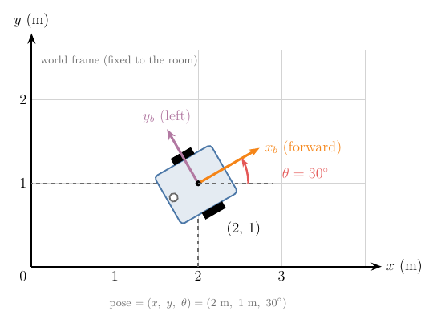

The only thing a wheeled robot can do is spin its motors. Everything we want from it is about places: drive to the door, stay in the lane, park in the corner. So we need a model that answers two questions, one in each direction:

1. **Prediction:** if the wheels spin at these speeds, where will the robot be in two seconds?
2. **Control:** to get to the door, at what speeds should the wheels spin?

Both questions need a precise way to say where the robot is, and a rule linking wheel speeds to changes in that position. In this Note we build both for the robot in Figure 1, which has two driven wheels like most indoor robots:

- three numbers that say where the robot is, and why it takes exactly these three (Section 2);
- why a rolling wheel's spin tells us its speed over the floor (Section 3);
- the link from the two wheel speeds to the robot's forward speed and turn rate, derived from one fact about turning bodies, and the link back (Section 4);
- how those speeds move the robot over the floor, and how to predict its path step by step (Section 5);
- why the robot cannot slide sideways, and why it can still reach every pose (Section 6).

Cars and trailers follow the same model with stricter limits; the car-like robots Note later in this chapter covers them.

## 2. Pose: where the robot is

> **Key point:** Position alone does not tell us where the robot will go next; we also need the direction it faces. Position $(x, y)$ plus heading $\theta$, measured in an agreed frame, is the pose.

### 2.1 Why we need a frame

"The robot is at (2, 1)" means nothing until we say measured from where, and along which directions. Figure 2 shows the problem: measured from the corner of the room, A, a robot is at (2, 1); measured from the corner of a rug, B, the same robot is at (1, 0.5).

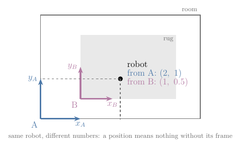

So we first agree on a reference: a corner of the room as the origin, with an x-axis along one wall and a y-axis along the other. Such a choice of origin and axes is a **coordinate frame** (G-2281). The frame fixed to the room is the **world frame** (G-2282); every position in this Note is measured in it.

### 2.2 Why position is not enough: the heading

Take two robots at the same spot, (2, 1), both driving forward at 0.5 m/s for one second. One faces along the x-axis, the other along the y-axis:

| Robot faces | Where it is after 1 s |
|---|---|
| along x | (2.5, 1) |
| along y | (2, 1.5) |

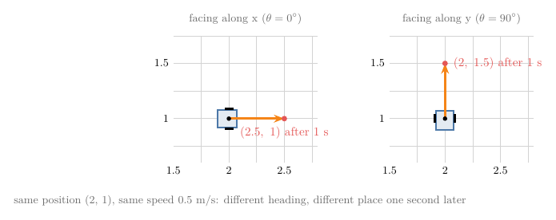

Figure 3 draws the two runs: same position, same speed, different result. To predict motion we must also record the direction the robot faces, its **heading** (G-2284): the angle $\theta$ from the world x-axis to the robot's forward direction.

Angles are measured counter-clockwise, so a robot facing along y has $\theta = 90^\circ$. That direction is a convention, not a law of nature. The robotics software standard ROS fixes it (x forward, y left, positive angles counter-clockwise when seen from above) so that every program reads the numbers the same way (REP-103).

Together, position and heading are the robot's **pose** (G-2280). For the robot in Figure 1:

$$x = 2 \text{ m}$$

$$y = 1 \text{ m}$$

$$\theta = 30^\circ$$

### 2.3 Why angles are measured in radians

> **Key point:** In radians, the arc a turning point travels is simply radius times angle, with no conversion factor; every formula in this Note relies on that.

We will often need this: a point at distance $d$ from a centre turns by some angle; how far does it travel along its arc? A full turn travels the whole circumference, $2\pi d$, and a part of a turn travels the same part of the circumference.

Try it in degrees, with $d = 0.5$ m and a turn of 30°. Thirty degrees is one twelfth of a full turn:

$$\frac{30}{360} \times 2\pi \times 0.5$$

$$= 0.262 \text{ m}$$

Multiplying the radius by the angle in degrees gives nonsense:

$$0.5 \times 30 = 15 \text{ m}$$

Degrees need the extra factor $2\pi / 360$ every time. So we measure angles in a unit that already contains it: the **radian** (G-2285), where a full turn is $2\pi$ radians. Then 30° is:

$$30 \times \frac{2\pi}{360} = 0.524 \text{ rad}$$

and the arc is radius times angle, with nothing else:

$$\text{arc} = d \times \Delta\theta$$

$$0.5 \times 0.524 = 0.262 \text{ m}$$

Figure 4 shows where the radian comes from. Bend a piece of string as long as the radius onto the circle: the angle it covers is one radian, about 57.3°. Keep laying radius-long pieces round the rim, and a full turn takes 6.283 of them, which is why a full turn is $2\pi$ radians.

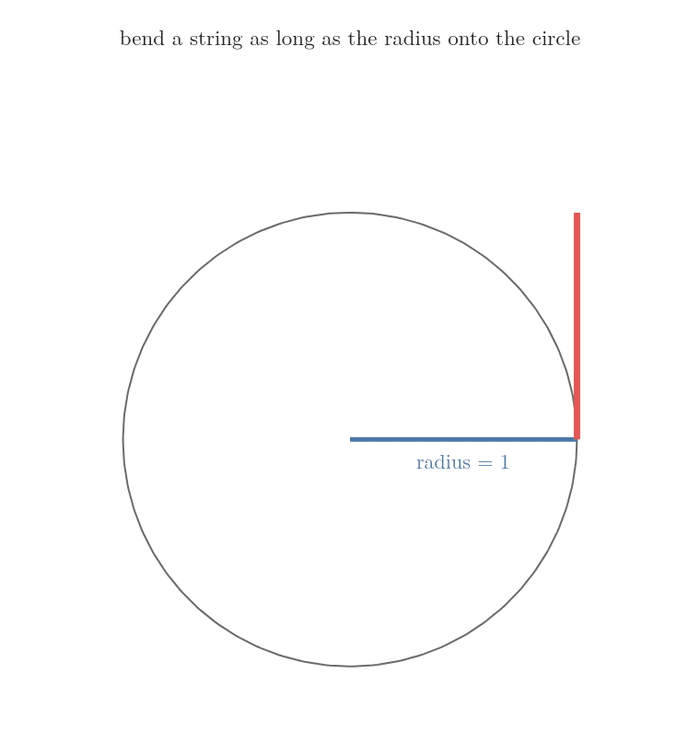

This arc rule is the reason the wheel formula (Section 3), the turning formulas (Section 4) and the cosine and sine functions of Python's `numpy` all work in radians.

### 2.4 Why the robot also has its own frame

A robot's sensors see the world from the robot's point of view: a distance sensor reports "an obstacle 1 m straight ahead", not a position on the room's map. To mark that obstacle on the map, we need to know where the robot is and which way it faces:

| Robot pose | "1 m straight ahead" is at |
|---|---|
| (2, 1), facing along x | (3, 1) |
| (2, 1), facing along y | (2, 2) |

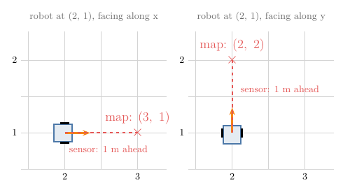

Figure 5 draws both cases: the reading is the same, the map point is not.

So the robot carries a frame of its own, the **body frame** (G-2283): origin at the middle point between its two wheels, x-axis pointing forward, y-axis pointing to its left (Figure 1). It moves and turns with the robot. The pose says exactly where the body frame sits inside the world frame, and that is what lets us move any measurement between the two. A later Note in this chapter, on coordinate frames, does those conversions in general.

### 2.5 Configuration and configuration space

> **Key point:** The configuration is the full list of numbers that places the robot; all its possible values form a space, and later planning Notes search that space for paths.

A **configuration** (G-2286) is a list of numbers that pins down where every point of a robot is (MR Definition 2.1). Our robot is rigid, so its pose is enough: knowing where the middle of the axle is and which way the robot faces fixes every other point of the body. We write it as one vector $q$ (a list of numbers):

$$q = (x,\ y,\ \theta)$$

$$q = (2,\ 1,\ 0.524)$$

The smallest number of values that does this is the robot's **degrees of freedom** (G-2310): 3 for a robot on a floor. Two values would not be enough, as the table in Section 2.2 shows.

All possible configurations together form the **configuration space** (G-2287), or C-space (MR Definition 2.1). It gets a name because later Notes plan routes by searching it: every point of the C-space is one placement of the whole robot, and a route is a path through it. Figure 6 draws the C-space of our robot as a box: the floor across, the heading upward. The robot of Figure 1 is one point in it. Turning the same robot around on the spot moves it to a different point straight above, because the pose has changed even though the position has not.

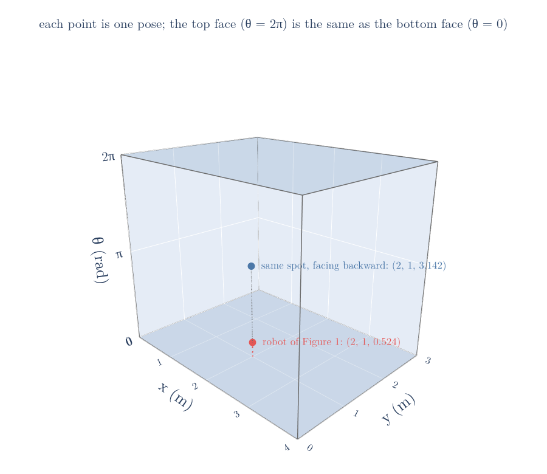

Two things about its shape matter:

- $x$ and $y$ can be any real numbers (any spot on an endless floor);
- $\theta$ wraps around, because turning by a full $2\pi$ brings the robot back to the same heading. So the headings 350° and 10° are only 20° apart, not 340°. A program that subtracts headings without allowing for the wrap-around turns the robot the long way round (Figure 7). In the box of Figure 6, this means the top face and the bottom face are the same headings.

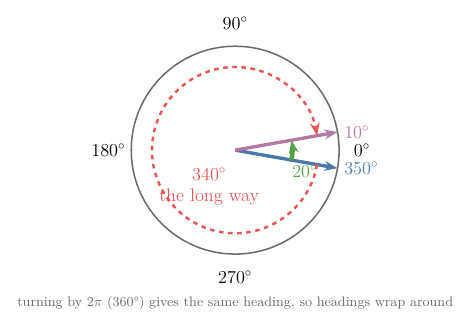

## 3. The differential-drive robot

> **Key point:** Two motorised wheels on one axle are enough to drive anywhere and even to spin on the spot. If a wheel rolls without slipping, its speed over the floor is its radius times its spin rate.

### 3.1 Why two wheels and a caster

A **differential-drive** (G-2288) robot has two driven wheels on a common axle, each turned by its own motor. It is the most common way to drive an indoor robot (LaValle §13.1.2.2), because two motors are enough for everything: driving, turning and spinning on the spot (Section 4.4). Two wheels on one axle would tip over, so a third, free-swivelling **caster wheel** (G-2289), like the wheel under an office chair, holds the robot up without steering it (LaValle §13.1.2.2).

There is no steering wheel. The robot turns only through the **difference** between its two wheel speeds, and that is where the name "differential" comes from.

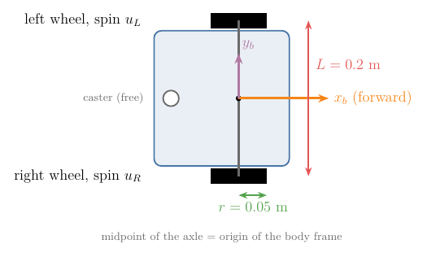

Figure 8 shows the only two measurements the model needs, with the values we use throughout. Both can be measured with a ruler:

$$r = 0.05 \text{ m} \quad \text{(wheel radius)}$$

$$L = 0.2 \text{ m} \quad \text{(wheel separation)}$$

### 3.2 Why wheel spin gives ground speed: rolling without slipping

> **Key point:** A wheel that does not skid lays its rim down on the floor as it turns, so it moves forward by exactly the length of rim it turns.

A motor tells us how fast the wheel spins, in radians per second. What we need is how fast the robot moves over the floor, in metres per second. The link is the wheel's grip.

A wheel **rolls without slipping** (G-2290) when the point touching the floor does not skid. Each bit of rim that comes down touches the floor once and stays put while touching. So the wheel moves forward by exactly the length of rim it has turned (Figure 9). One full turn lays down the whole circumference:

$$2\pi \times r$$

$$= 6.283 \times 0.05$$

$$= 0.314 \text{ m}$$


A part of a turn lays down the same part of the rim, which is the arc rule of Section 2.3: radius times angle. So a wheel spinning at a rate $u$ (radians per second) moves over the floor at:

$$v_{\text{wheel}} = r\ u$$

We write $u_R$ and $u_L$ for the spin rates of the right and left wheels, and $v_R$ and $v_L$ for their ground speeds. With the right wheel spinning at 12 rad/s and the left at 8 rad/s:

$$v_R = 0.05 \times 12 = 0.6 \text{ m/s}$$

$$v_L = 0.05 \times 8 = 0.4 \text{ m/s}$$

> **Extra:** Real wheels slip a little, more on smooth floors and in fast turns. The formula then overestimates the distance moved, and a robot that tracks its position by counting wheel turns slowly drifts away from the truth. Later Notes on motion models and wheel odometry deal with that error.

## 4. From wheel speeds to robot speeds and back

> **Key point:** The robot's forward speed is the average of the two wheel speeds, and its turn rate is their difference divided by the wheel separation. Both follow from one fact: a turning rigid body circles a single point.

### 4.1 Why we describe motion by forward speed and turn rate

Wheel speeds are what the motors take, but they are an awkward way to think. Asked how to drive to the door, nobody says "right wheel 0.35 m/s, left wheel 0.25 m/s"; we say "not too fast, and bear left". So we describe the motion of the whole robot with two numbers that match that way of thinking (Figure 10):

- its **forward speed** (G-2291) $v$: how fast the midpoint between the wheels moves along the heading, in metres per second;
- its **turn rate** (G-2292) $\omega$ (omega): how fast the heading $\theta$ changes, in radians per second, positive to the left.

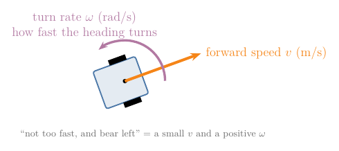

A controller decides $v$ and $\omega$; this section finds the formulas that convert them to wheel speeds and back.

### 4.2 Why the robot turns about a point on its axle line

> **Key point:** Each wheel can only move straight ahead, square to the axle. The only centre the whole body can turn about that allows this lies on the axle line.

When a rigid body turns, every point of it moves on a circle around one centre, and its velocity at each moment points square to the line from that centre. Our two wheels must move straight ahead, because they cannot slide sideways (Section 6). Straight ahead is square to the axle. So the line from the centre to each wheel must be the axle line itself: the centre lies somewhere on the line through the axle (MR §13.3.1).

That centre is the turning point, also called the instantaneous centre of curvature. Its distance from the robot's midpoint is the **turning radius** (G-2293) $R$.


The whole body turns by the same angle in each second, the turn rate $\omega$. By the arc rule of Section 2.3, a point at distance $d$ from the centre then travels $\omega$ times $d$ metres per second. Points farther out move faster (Figure 11):

$$\text{speed} = \omega \times \text{distance}$$

For a left turn, the right wheel sits half the wheel separation farther out than the midpoint, and the left wheel half the separation closer in:

$$v_R = \omega \thinspace(R + L/2)$$

$$v_L = \omega \thinspace(R - L/2)$$

$$v = \omega \thinspace R$$

### 4.3 Wheel speeds to forward speed and turn rate

> **Key point:** Subtracting the two wheel equations isolates $\omega$; adding them isolates $v$.

**Turn rate.** Subtract the left-wheel line from the right-wheel line. The $\omega R$ parts cancel, leaving only the separation:

$$v_R - v_L = \omega \thinspace(L/2 + L/2)$$

$$v_R - v_L = \omega \thinspace L$$

$$\omega = \frac{v_R - v_L}{L}$$

The formula says why a wide robot turns more lazily: the same speed difference has to swing a longer axle. With a speed difference of 0.2 m/s:

| Wheel separation $L$ | Turn rate $\omega$ |
|---|---|
| 0.2 m | 1 rad/s |
| 0.4 m | 0.5 rad/s |

**Forward speed.** Add the two lines. The $\omega L/2$ parts cancel:

$$v_R + v_L = 2\thinspace\omega\thinspace R$$

$$v_R + v_L = 2\thinspace v$$

$$v = \frac{v_R + v_L}{2}$$

The midpoint moves at the average speed of the wheels because it sits halfway between them.

**Worked example.** With our wheel speeds, the forward speed is:

$$v = \frac{0.6 + 0.4}{2} = 0.5 \text{ m/s}$$

The turn rate is:

$$\omega = \frac{0.6 - 0.4}{0.2} = 1 \text{ rad/s}$$

The turning radius follows from $v = \omega R$:

$$R = v / \omega$$

$$R = 0.5 / 1 = 0.5 \text{ m}$$

Going from the wheel speeds to the robot's motion is the **forward kinematics** (G-2294) of the robot (LaValle §13.1.2.2). It answers half of the prediction question of Section 1; Section 5 finishes it.

### 4.4 Four ways to drive

> **Key point:** Equal wheel speeds drive straight, opposite speeds spin on the spot, one stopped wheel pivots about that wheel, and anything else drives on a circle.

The two formulas predict four kinds of motion. Figure 12 plays each one for two seconds; the green dot is the turning point.


| Wheel speeds $v_R$, $v_L$ (m/s) | $v$ (m/s) | $\omega$ (rad/s) | $R$ (m) | Motion |
|---|---|---|---|---|
| 0.5, 0.5 | 0.5 | 0 | none | straight line |
| 0.2, −0.2 | 0 | 2 | 0 | spin on the spot |
| 0.4, 0 | 0.2 | 2 | 0.1 | pivot about the left wheel |
| 0.6, 0.4 | 0.5 | 1 | 0.5 | circle to the left |

Why each happens:

- **Straight line.** Equal speeds have no difference, so $\omega = 0$: nothing turns the heading. The turning point is infinitely far away.
- **Spin on the spot.** Opposite speeds add up to zero, so $v = 0$: the midpoint stays put while the heading turns.
- **Pivot.** A stopped wheel does not move, so it must be the turning point itself; the table confirms a turning radius of 0.1 m, exactly half the wheel separation.

The spin on the spot is what makes the differential drive so easy to steer: it can face any direction first and then drive straight (LaValle §13.1.2.2). A car cannot, as the car-like robots Note later in this chapter shows.

### 4.5 Back again: the wheel speeds for a wanted motion

> **Key point:** To drive with forward speed $v$ and turn rate $\omega$, run the right wheel at $v + \omega L/2$ and the left wheel at $v - \omega L/2$.

The control question of Section 1 goes the other way: the controller has chosen $v$ and $\omega$ and must send wheel commands. This is the **inverse kinematics** (G-2295) of the robot. Solve the two formulas of Section 4.3 for the wheel speeds:

$$v_R = v + \omega L/2$$

$$v_L = v - \omega L/2$$

Each wheel runs at the midpoint's speed, plus or minus the extra speed it needs for being half an axle farther out or closer in. Then divide by the wheel radius to get the spin rates for the motors.

**Worked example.** We want 0.3 m/s while bearing left at 0.5 rad/s. The extra speed for half an axle:

$$\omega L/2 = 0.5 \times 0.1 = 0.05 \text{ m/s}$$

The wheel speeds:

$$v_R = 0.3 + 0.05 = 0.35 \text{ m/s}$$

$$v_L = 0.3 - 0.05 = 0.25 \text{ m/s}$$

The spin rates:

$$u_R = 0.35 / 0.05 = 7 \text{ rad/s}$$

$$u_L = 0.25 / 0.05 = 5 \text{ rad/s}$$

Figure 13 shows why the two wheels differ. The wanted motion is a circle of radius 0.6 m (the turning radius, $v$ divided by $\omega$); the right wheel runs on the outside of it and must cover more ground in the same time than the left wheel on the inside.

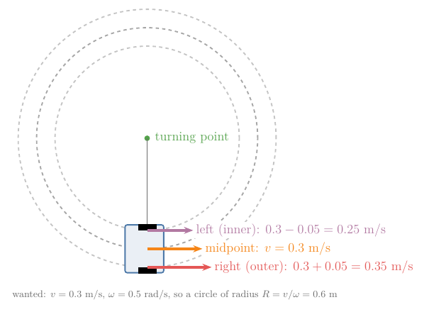

As a check, feeding 7 and 5 rad/s back into the forward kinematics of Section 4.3 must return 0.3 m/s and 0.5 rad/s, and it does (the Python box below).

> **Python:** both directions in four lines.
> ```python
> r, L = 0.05, 0.2               # wheel radius, wheel separation (m)
> def forward(uR, uL):           # spin rates (rad/s) -> v (m/s), omega (rad/s)
>     return r * (uR + uL) / 2, r * (uR - uL) / L
> def inverse(v, omega):         # v, omega -> spin rates (rad/s)
>     return (v + omega * L / 2) / r, (v - omega * L / 2) / r
> inverse(0.3, 0.5)              # (7.0, 5.0)
> forward(7, 5)                  # (0.3, 0.5): back where we started
> ```

## 5. From robot speeds to motion on the floor

> **Key point:** The robot moves along its heading, so its forward speed splits into an x part $v \cos\theta$ and a y part $v \sin\theta$. Because the heading keeps changing, we predict the path in many small steps.

### 5.1 Why the speed splits into cosine and sine parts

The robot knows its forward speed, but the map needs to know how fast $x$ and $y$ change. The robot moves in the direction it faces, so the share of its speed that goes into $x$ and into $y$ depends on the heading. The two extremes are easy:

- facing along x ($\theta = 0^\circ$): all of the speed goes into $x$, none into $y$;
- facing along y ($\theta = 90^\circ$): all of it goes into $y$, none into $x$.

In between, the speed is shared. Draw the velocity as an arrow of length $v$ at angle $\theta$ (Figure 14). It is the long side of a right-angled triangle whose two short sides are the x speed and the y speed.

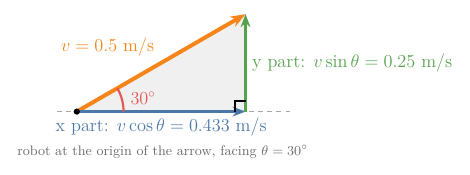

The cosine and sine of an angle are defined as exactly these shares of the long side:

- $\cos\theta$ is the side along x divided by the long side;
- $\sin\theta$ is the side along y divided by the long side.

So the x speed is $v \cos\theta$ and the y speed is $v \sin\theta$. The extremes check out: $\cos 0^\circ = 1$ and $\sin 0^\circ = 0$ (everything along x); $\cos 90^\circ = 0$ and $\sin 90^\circ = 1$ (everything along y).

**Worked example.** At $\theta = 30^\circ$, $\cos 30^\circ = 0.866$ and $\sin 30^\circ = 0.5$. With $v = 0.5$ m/s:

$$\text{x speed} = v \cos\theta$$

$$= 0.5 \times 0.866 = 0.433 \text{ m/s}$$

$$\text{y speed} = v \sin\theta$$

$$= 0.5 \times 0.5 = 0.25 \text{ m/s}$$

The two short sides must rebuild the long side (Pythagoras), and they do:

$$0.433^2 + 0.25^2 = 0.25$$

$$\sqrt{0.25} = 0.5 \text{ m/s}$$

### 5.2 The kinematic model

> **Key point:** Three equations give how fast each number of the pose changes, from the two inputs $v$ and $\omega$.

We need a short way to write "how fast this changes". A dot over a symbol means its rate of change per second, the [derivative](../../../../MA/06-calculus/MA-061-derivatives-of-one-variable/MA-061-derivatives-of-one-variable.md#41-from-secant-to-tangent) with respect to time (G-2296). For example, $\dot{x} = 0.433$ m/s means $x$ grows by 0.433 m each second.

The x speed and y speed of Section 5.1 are $\dot{x}$ and $\dot{y}$. The heading changes at the turn rate, by the definition of $\omega$ in Section 4.1. Together:

$$\dot{x} = v \cos\theta$$

$$\dot{y} = v \sin\theta$$

$$\dot{\theta} = \omega$$

This is the **kinematic model** (G-2297) of the differential-drive robot. "Kinematic" means it uses speeds only, not masses or forces. That is safe while the robot moves slowly, because then the wheels follow their commands closely; at high speed, skidding and inertia matter and a dynamic model is needed (LaValle §13.1.2.1). The two numbers we choose, $u = (v, \omega)$, are the **control inputs** (G-2298). A sanity check: at $\theta = 0$ the model gives $\dot{x} = v$ and $\dot{y} = 0$, straight along x, as it should.

The same three equations describe a single rolling wheel, the unicycle (MR §13.3.1); a later Note in this chapter compares wheel types.

The three lines can be written as one matrix times the input vector:

$$\dot{q} = G(q)\thinspace u$$

$$\dot{q} = \begin{bmatrix} \dot{x} \cr\dot{y} \cr\dot{\theta} \end{bmatrix}$$

$$G(q) = \begin{bmatrix} \cos\theta & 0 \cr\sin\theta & 0 \cr0 & 1 \end{bmatrix}$$

$$u = \begin{bmatrix} v \cr\omega \end{bmatrix}$$

The matrix form shows something the three lines hide. Each column of $G(q)$ is one direction the robot can move in: the first column is "drive forward", the second is "turn on the spot" (MR §13.3.1). Every motion is a mix of these two. A third direction, sliding sideways, is missing, and Section 6 is about that gap.

At our pose, with the input $u = (0.5, 1)$, the matrix product gives back the speeds of Section 5.1:

$$\dot{x} = 0.866 \times 0.5 + 0 \times 1 = 0.433$$

$$\dot{y} = 0.5 \times 0.5 + 0 \times 1 = 0.25$$

$$\dot{\theta} = 0 \times 0.5 + 1 \times 1 = 1$$

### 5.3 Why we predict the path step by step

> **Key point:** The direction of motion changes as the heading turns, so we cannot just multiply speed by time. Over a short step the heading hardly changes, so we treat it as fixed, move, and repeat.

Speed times time gives distance only if the direction stays the same. Here the heading turns at 1 rad/s, so the direction of motion changes all the time. But over a short time step $\Delta t$ the heading changes only a little, so we can treat the rates as fixed during the step and add them up. This is an **Euler step** (G-2299):

$$x_{\text{new}} = x + \dot{x}\thinspace\Delta t$$

$$y_{\text{new}} = y + \dot{y}\thinspace\Delta t$$

$$\theta_{\text{new}} = \theta + \dot{\theta}\thinspace\Delta t$$

**Worked example.** Start at the pose of Figure 1, keep $v = 0.5$ m/s and $\omega = 1$ rad/s, and take steps of $\Delta t = 0.1$ s. The first step:

$$x = 2 + 0.433 \times 0.1 = 2.0433$$

$$y = 1 + 0.25 \times 0.1 = 1.0250$$

$$\theta = 0.5236 + 1 \times 0.1 = 0.6236$$

The heading has changed, so the next step uses new rates:

| Step | $x$ (m) | $y$ (m) | $\theta$ (rad) | $\dot{x}$ (m/s) | $\dot{y}$ (m/s) |
|---|---|---|---|---|---|
| 0 | 2.0000 | 1.0000 | 0.5236 | 0.4330 | 0.2500 |
| 1 | 2.0433 | 1.0250 | 0.6236 | 0.4059 | 0.2920 |
| 2 | 2.0839 | 1.0542 | 0.7236 | 0.3747 | 0.3310 |

Figure 15 keeps going. The path bends left, and after about 6.3 s (63 steps) it closes a circle of radius 0.5 m, the turning radius of Section 4.3.

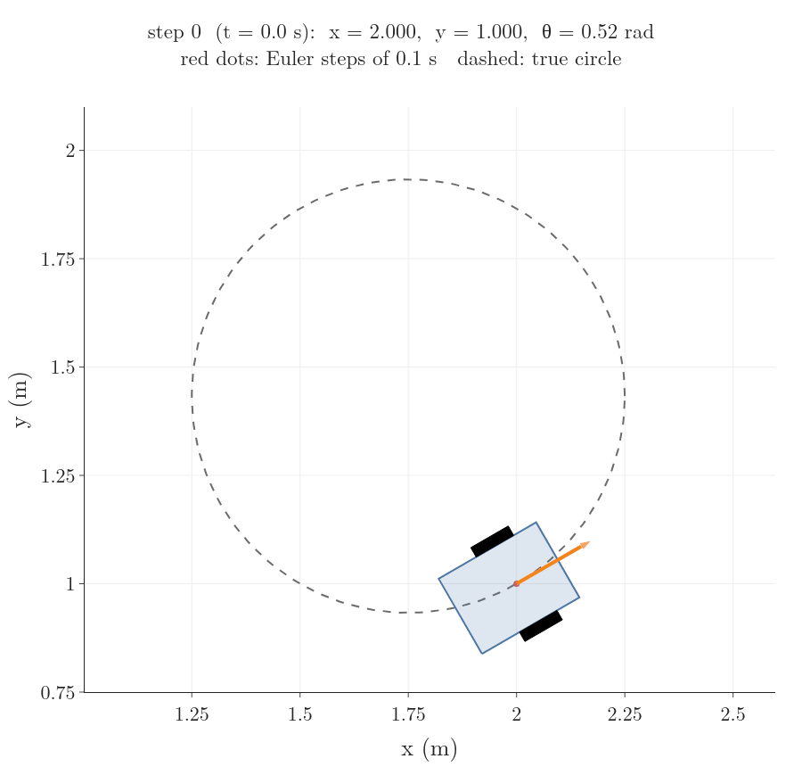

The prediction is not perfect. Each step moves along a straight line in the direction the robot faced at the start of the step, while the true robot curves. So the predicted path drifts from the true circle (the dashed line in Figure 15). The smaller the step, the less the heading changes within it, and the smaller the drift. The largest gap between the predicted and the true position during one lap:

| Step $\Delta t$ | Largest gap |
|---|---|
| 1 s | 51 cm |
| 0.5 s | 25 cm |
| 0.1 s | 5 cm |
| 0.01 s | 0.5 cm |

The gap shrinks in step with $\Delta t$: a step ten times smaller gives a gap ten times smaller. The notebook `RO-001-pose-and-differential-drive.ipynb` reproduces this table and lets us try other wheel speeds.

## 6. The robot cannot slide sideways

> **Key point:** Rolling wheels forbid sideways motion. That limits which way the robot can move at each moment, but not which poses it can reach; it only means some moves need manoeuvres.

Why does this deserve a section? Many route planners assume a robot can move in any direction from where it stands. A route that needs a step sideways cannot be followed by our robot or by a car, so those planners cannot be used as they are (MR §13.3.3). To plan for wheeled robots, we must state the rule exactly and understand what it does and does not forbid.

### 6.1 The rule as an equation

A wheel rolls along its own direction but grips against sliding sideways (LaValle §13.1.2.1). So the robot's midpoint can move forward or backward, never along its own left–right axis. In words: **the robot's velocity has no part pointing to its left**.

To turn that sentence into an equation, we need the robot's left direction in world coordinates. Its forward direction at heading $\theta$ is the arrow $(\cos\theta, \sin\theta)$, by Section 5.1 with a speed of 1. Its left is the forward direction turned by 90°, at heading $\theta + 90^\circ$ (Figure 16):

$$(\cos(\theta + 90^\circ),\ \sin(\theta + 90^\circ))$$

$$= (-\sin\theta,\ \cos\theta)$$

At $\theta = 0$ this gives $(0, 1)$, the y-axis: the left of a robot facing along x.

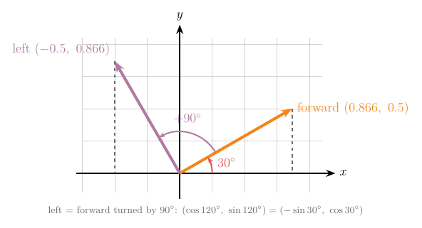

How much of a velocity points along an arrow of length 1 is found by multiplying matching entries and adding, the [dot product](../../../../ML/05-dimensionality/ML-047-pca-step-by-step/ML-047-pca-step-by-step.md#21-projecting-one-point) (G-634). For the velocity $(\dot{x}, \dot{y})$ and the left arrow, the rule says this must be zero:

$$-\dot{x}\sin\theta + \dot{y}\cos\theta = 0$$

**Check an allowed motion.** Driving forward at our pose ($\dot{x} = 0.433$, $\dot{y} = 0.25$, $\theta = 30^\circ$):

$$-0.433 \times 0.5 = -0.2165$$

$$0.25 \times 0.866 = 0.2165$$

$$-0.2165 + 0.2165 = 0$$

No part points left: allowed.

**Check a forbidden motion.** Moving straight to the robot's left at 0.5 m/s ($\dot{x} = -0.25$, $\dot{y} = 0.433$):

$$-(-0.25) \times 0.5 = 0.125$$

$$0.433 \times 0.866 = 0.375$$

$$0.125 + 0.375 = 0.5$$

All 0.5 m/s points left: the wheels would have to skid.

The rule can be written as a row of numbers times $\dot{q}$:

$$A(q)\thinspace\dot{q} = 0$$

$$A(q) = \begin{bmatrix} -\sin\theta & \cos\theta & 0 \end{bmatrix}$$

A [constraint](../../../../ML/07-classification/ML-087-svm-maths/ML-087-svm-maths.md#42-one-constraint-for-both-classes) (a condition that must always hold) on velocities, written in this form $A(q)\thinspace\dot{q} = 0$, is a **Pfaffian constraint** (G-2300) (MR §2.4). The form is worth a name because rules from very different machines fit it, such as a rolling coin, a car and a robot hand holding an object, and one set of tools then handles all of them (MR §2.4).

The constraint and the kinematic model say the same thing from two sides. The model lists the directions the robot can move in, the columns of $G(q)$; the constraint names the one it cannot. So every column of $G(q)$ must pass the constraint. At $\theta = 30^\circ$, the first column $(0.866, 0.5, 0)$:

$$-0.5 \times 0.866 + 0.866 \times 0.5 + 0 = 0$$

The second column $(0, 0, 1)$:

$$-0.5 \times 0 + 0.866 \times 0 + 0 \times 1 = 0$$

### 6.2 Why the robot can still reach every pose: holonomic and nonholonomic constraints

> **Key point:** A holonomic constraint fixes where a system can be. A nonholonomic constraint only fixes which way it can move at each moment; the system can still reach every configuration, with manoeuvres.

Does "no sideways motion" mean there are places the robot can never get to? Compare it with a system where that really is so: a toy train on a circular track of radius 5 m (Figure 17, left). The train's position obeys a rule about **position**:

$$x^2 + y^2 = 25$$

At the point $(3, 4)$, the check is:

$$3^2 + 4^2 = 9 + 16 = 25$$

The train can never leave the circle. The position rule also limits its velocity: as long as $x^2 + y^2$ stays at 25, its rate of change must be zero. By the [chain rule](../../../../ML/07-classification/ML-073-sigmoid-derivative/ML-073-sigmoid-derivative.md#2-two-rules-we-need) (G-371), the rate of change of $x^2$ is $2x$ times the rate of change of $x$. So:

$$2x\thinspace\dot{x} + 2y\thinspace\dot{y} = 0$$

At $(3, 4)$:

$$6\thinspace\dot{x} + 8\thinspace\dot{y} = 0$$

This velocity rule has the same Pfaffian form as the robot's, but it comes from a position rule. A rule on position, or a velocity rule that comes from one, is a **holonomic constraint** (G-2301). It removes whole configurations: the train lives on a 1-dimensional circle, not on the 2-dimensional floor (MR §2.4).


Is there a position rule hiding behind the robot's constraint? Suppose there were one, linking $x$, $y$ and $\theta$. Then fixing the position $(x, y)$ would also fix the heading $\theta$, the way fixing $x$ on the track fixes $y$. But the robot can spin on the spot (Section 4.4) and point in any direction from the same position. So no such rule exists (MR §2.4).

Figure 18 shows the consequence. Three legal moves shift the robot 0.5 m to its left, the one direction it can never move in directly:

1. Spin 90° to the left on the spot.
2. Drive 0.5 m forward.
3. Spin 90° back to the right.


A velocity rule that does not come from any position rule is a **nonholonomic constraint** (G-2302). It cuts the directions the robot can move in at each moment from 3 to 2, but the robot can still reach every pose (MR §2.4). Robots with such constraints are called nonholonomic robots. A car shows the same thing every day: it cannot drive sideways into a parking space, but it gets there by parallel parking (LaValle §13.1.2.1).

| | Holonomic constraint | Nonholonomic constraint |
|---|---|---|
| Limits | positions (and so velocities) | velocities only |
| Example | train on a circular track | wheel that cannot slide sideways |
| Reachable configurations | fewer: the track only | all of them |
| Rule | $g(q) = 0$, such as $x^2 + y^2 = 25$ | $A(q)\thinspace\dot{q} = 0$ with no $g(q)$ behind it |
| What it means for planning | search a smaller space | every pose is reachable, but routes need manoeuvres |

> **Extra:** Modern Robotics states the test in algebra. A Pfaffian constraint $A(q)\thinspace\dot{q} = 0$ is holonomic exactly when $A(q)$ is the matrix of partial derivatives (the [Jacobian](../../../../MA/06-calculus/MA-063-jacobian-and-matrix-gradients/MA-063-jacobian-and-matrix-gradients.md#42-the-formula-every-partial-derivative-in-one-grid)) of some function $g(q)$, so that it "integrates" back to $g(q) = 0$. For the train, $A = [2x,\ 2y]$ is the Jacobian of the track rule $g(x, y)$, where:
>
> $$g(x, y) = x^2 + y^2 - 25$$
>
> For the rolling robot, no such $g$ exists, so the constraint is called nonintegrable (MR §2.4).

## 7. Summary

| Robot | Configuration | Inputs | Control set | So it can |
|---|---|---|---|---|
| Differential drive | $(x, y, \theta)$ | $v$, $\omega$ from two wheel speeds | diamond | spin on the spot, then drive straight |

- The pose $(x, y, \theta)$ says where a floor robot is, because position alone does not say which way it will drive off.
- Angles are in radians, so a turning point's arc is radius times angle, with no conversion factor.
- A wheel that rolls without slipping moves at $r$ times its spin rate, because it lays its rim down on the floor.
- The forward speed is the average of the wheel speeds and the turn rate is their difference over $L$, because the rigid robot turns about one point on its axle line and each point's speed is turn rate times distance.
- Controllers think in $v$ and $\omega$, and the inverse formulas turn those into wheel commands, so the controller never has to reason in wheel speeds.
- The kinematic model gives the rates of $x$, $y$ and $\theta$; the heading keeps turning, so we predict the path in small Euler steps, and smaller steps drift less.
- The wheels forbid sideways motion, a nonholonomic constraint: it removes one direction of motion at each moment but no reachable pose, so the robot gets anywhere with manoeuvres such as spin–drive–spin or parallel parking.

So the two questions of the opening have their answers: the forward formulas and Euler steps predict where wheel commands take the robot, and the inverse formulas give the commands for a chosen motion.

## 8. Sources

**Built from**

- Duckietown, "11 - Modeling of a differential drive robot", YouTube, https://www.youtube.com/watch?v=XG4cODYVbJk
- Northwestern Robotics, "Modern Robotics, Chapter 13.3.1: Modeling of Nonholonomic Wheeled Mobile Robots", YouTube, https://www.youtube.com/watch?v=fPHVhlRFFCk
- Georgia Institute of Technology, "Control of Mobile Robots, 2.2 Differential Drive Robots", YouTube (re-upload of the Coursera course), https://www.youtube.com/watch?v=aE7RQNhwnPQ
- Carlotta A. Berry, PhD, "Advanced Mobile Robotics: Lecture 1-2b - Forward Kinematics w\ Instantaneous Center of Curvature", YouTube, https://www.youtube.com/watch?v=zx5n6wrl38U
- NPTEL - Indian Institute of Science, Bengaluru, "lec38 Wheeled Mobile Robots (WMR) on Flat Terrain", YouTube, https://www.youtube.com/watch?v=EqcY9Q0qbDs
- LaValle, S. M. (2006). *Planning Algorithms*. Cambridge University Press. §13.1.2.1 "A simple car", §13.1.2.2 "A differential drive". Free online: https://lavalle.pl/planning/node657.html (LaValle)
- Lynch, K. M. and Park, F. C. (2017). *Modern Robotics: Mechanics, Planning, and Control*. Cambridge University Press. Definition 2.1 configuration, degrees of freedom and C-space, §2.4 holonomic and nonholonomic constraints, §13.3.1 the canonical nonholonomic model, §13.3.3 Dubins and Reeds-Shepp paths. Free preprint: http://modernrobotics.org (MR)

**Other references**

- Northwestern Robotics, "Modern Robotics, Chapter 13.3.3: Motion Planning for Nonholonomic Mobile Robots", YouTube, https://www.youtube.com/watch?v=jOesC0wKpTQ
- Foote, T. and Purvis, M. (2010). *REP 103: Standard Units of Measure and Coordinate Conventions*. ROS Enhancement Proposals, https://www.ros.org/reps/rep-0103.html (REP-103)

## 9. Key terms

Terms taught in this Note come first; linked terms are recaps, taught in the Note the link opens.

| Term | Meaning |
|---|---|
| Coordinate frame (G-2281) | A chosen origin and set of axes used to give positions as numbers; every position or pose is stated relative to some frame. |
| World frame (G-2282) | The coordinate frame fixed to the surroundings (for example a corner of the room), in which the robot's pose is given. |
| Heading $\theta$ (G-2284) | The angle from the world x-axis to the direction a robot faces, measured counter-clockwise; it decides which way the robot moves when it drives forward. |
| Pose (G-2280) | Where a robot is and which way it faces: on a floor, its position $(x, y)$ and heading $\theta$, such as (2 m, 1 m, 30°); needed because a robot at one spot drives off differently depending on its heading. |
| Radian (G-2285) | The unit of angle at which the arc of a circle is as long as its radius; a full turn is $2\pi$ rad, and with radians an arc is simply radius times angle. |
| Body frame (G-2283) | A coordinate frame attached to the robot, with its x-axis pointing forward and its y-axis to the left; it moves and turns with the robot, so things can be described from the robot's point of view. |
| Configuration (G-2286) | The list of numbers that pins down where every part of a robot is, such as $q = (x, y, \theta)$ for a floor robot; planning and models work with it as one vector. |
| Degrees of freedom (G-2310) | The number of values in a robot's configuration, such as 3 for a floor robot $(x, y, \theta)$: how many independent ways it can be placed. |
| Configuration space (C-space) (G-2287) | The set of all possible configurations of a robot; for a floor robot, any $(x, y)$ with a heading on a circle. |
| Differential drive (G-2288) | A robot with two independently driven wheels on one axle (plus a caster); it steers by running the wheels at different speeds and can spin on the spot. |
| Caster wheel (G-2289) | A free-swivelling, undriven wheel, like the one under an office chair; it supports a robot without steering it. |
| Rolling without slipping (G-2290) | A wheel moving so that its contact point does not skid: it moves forward by its radius times the angle it turns and never slides sideways, which is what lets wheel turns predict motion. |
| Forward speed $v$ (G-2291) | How fast a robot's reference point (for a differential drive, the middle of the axle) moves along its heading, in m/s; for a differential drive, the average of the two wheel speeds. |
| Turn rate $\omega$ (G-2292) | How fast a robot's heading changes, in rad/s, positive to the left; for a differential drive, the difference of the wheel speeds divided by the wheel separation. |
| Turning radius $R$ (G-2293) | The distance from the point a robot is turning about (the turning point, or instantaneous centre of curvature) to the robot's reference point; $R = v / \omega$, so it says how tight a turn is. |
| Forward kinematics (wheeled robot) (G-2294) | Working out the robot's forward speed and turn rate from its wheel speeds, used to predict where the robot goes. |
| Inverse kinematics (wheeled robot) (G-2295) | Working out the wheel speeds that give a wanted forward speed and turn rate, used by a controller to command the motors. |
| Dot notation $\dot{x}$ (G-2296) | A dot over a quantity means its rate of change per second (its derivative with respect to time), such as $\dot{x} = 0.433$ m/s; models of motion are written with it. |
| Kinematic model (G-2297) | Equations that give how a robot's configuration changes from its speed inputs alone, ignoring masses and forces, such as $\dot{x} = v\cos\theta$, $\dot{y} = v\sin\theta$, $\dot{\theta} = \omega$; used to predict motion at low speed. |
| Control input $u$ (G-2298) | The numbers we choose to drive a robot, such as $u = (v, \omega)$; the model turns them into motion. |
| Euler step (G-2299) | One step of predicting motion: hold the rates fixed for a short time $\Delta t$ and add rate times $\Delta t$ to each quantity; repeated, it traces a path, more accurately the smaller $\Delta t$ is. |
| Pfaffian constraint (G-2300) | A rule on a system's velocities of the form $A(q)\thinspace\dot{q} = 0$, such as the robot's no-sideways rule $-\dot{x}\sin\theta + \dot{y}\cos\theta = 0$; it marks which directions of motion are forbidden. |
| Holonomic constraint (G-2301) | A rule on positions, $g(q) = 0$, such as a train on a circular track $x^2 + y^2 = 25$ (or a velocity rule that comes from one); it removes whole configurations the system can never be in. |
| Nonholonomic constraint (G-2302) | A velocity rule that does not come from any position rule, such as a wheel that cannot slide sideways; it limits which way a robot can move at each moment but not which configurations it can reach. |
| [Dot product](../../../../MA/05-linear-algebra/MA-050-dot-product-and-cosine-similarity/MA-050-dot-product-and-cosine-similarity.md#3-computing-the-dot-product) (G-634) | Multiplying two vectors entry by entry and adding the products, $u^{\mathsf T}x$, which gives one number. It is large when the vectors point the same way, so it measures similarity and gives projections. |
| [Chain rule](../../../../ML/07-classification/ML-073-sigmoid-derivative/ML-073-sigmoid-derivative.md#2-two-rules-we-need) (G-371) | To differentiate a function of a function, multiply the outer derivative by the inner derivative. |
