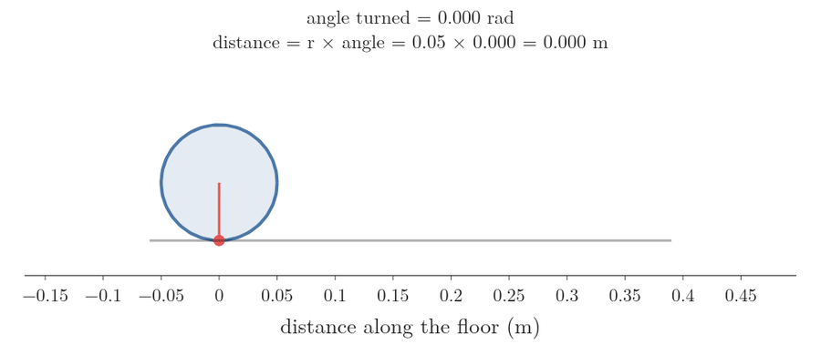
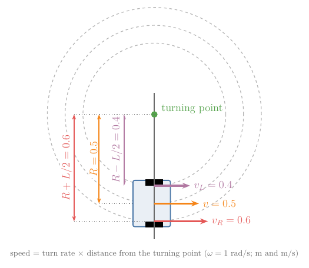
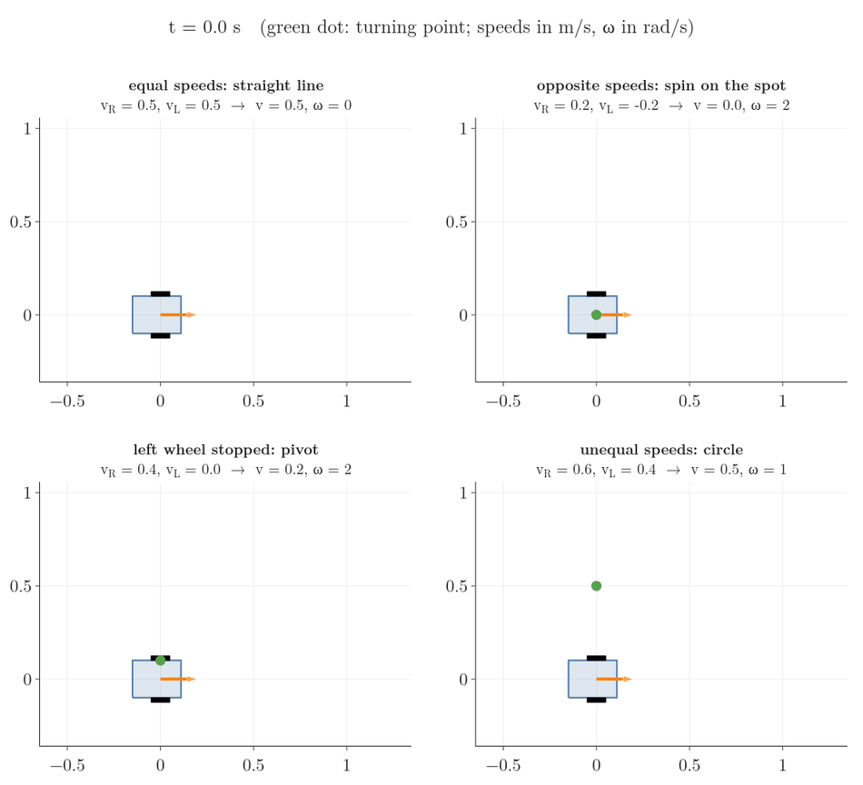
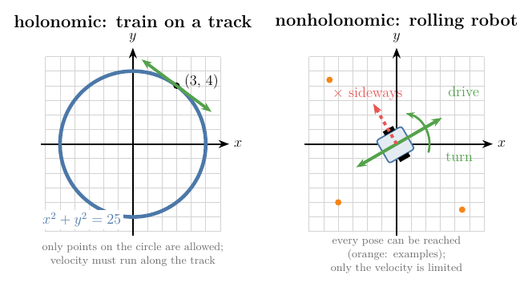
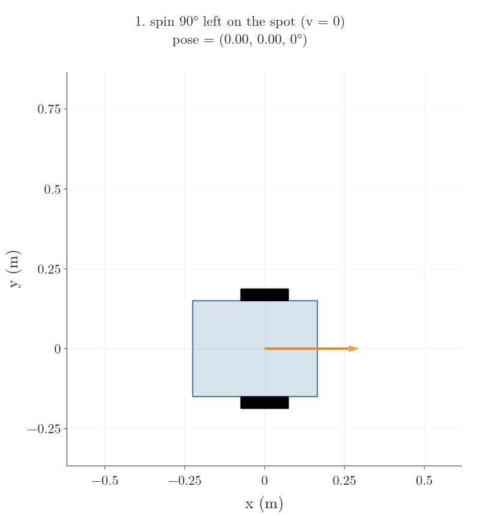
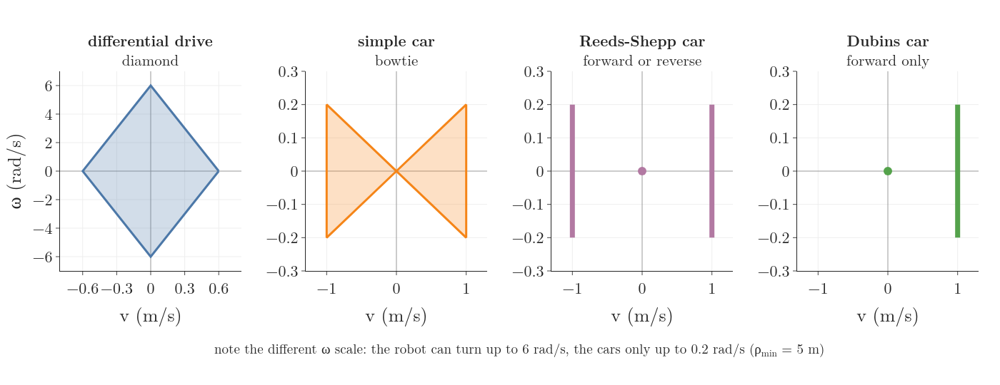

## 1. Overview

> **Key point:** Three numbers say where a robot on the floor is: its position $x$, $y$ and its heading $\theta$. Two wheel speeds decide how those three numbers change, and the wheels' grip means the robot can never slide sideways.


Figure 1 shows a small robot on a floor. Before a robot can plan a route or follow one, it needs two things:

- a way to say **where it is**: three numbers, the pose (Section 2);
- a way to predict **how it moves** when it spins its wheels: the kinematic model (Sections 3 to 5).

The robot we use throughout has two driven wheels, like most indoor robots. In this Note we:

- describe where a robot is with its pose and its coordinate frames (Section 2);
- turn wheel spin into ground speed (Section 3);
- turn the two wheel speeds into the robot's forward speed and turn rate, and back again (Section 4);
- predict the robot's path over time, step by step (Section 5);
- write down the rule that the robot cannot slide sideways, and see why that rule limits how it moves but not where it can get (Section 6);
- see cars as the same model with stricter limits: the simple car, the Reeds-Shepp car and the Dubins car (Section 7);
- add a trailer (Section 8).

## 2. Pose: where the robot is

> **Key point:** A robot on a flat floor is described by its position $(x, y)$ and the direction it faces, $\theta$. These three numbers together are its pose.

### 2.1 Position and heading

To say where something is, we first fix a reference: a corner of the room as the origin, with an x-axis along one wall and a y-axis along the other. Such a choice of origin and axes is a **coordinate frame** (G-2281). The frame fixed to the room is the **world frame** (G-2282).

Position alone is not enough. A robot at the same spot can face the door or the window, and it will drive off in different directions. So we also record the direction it faces, its **heading** (G-2284): the angle $\theta$ from the world x-axis to the robot's forward direction, measured counter-clockwise.

Together these three numbers are the robot's **pose** (G-2280). For the robot in Figure 1:

$$x = 2 \text{ m}$$

$$y = 1 \text{ m}$$

$$\theta = 30^\circ$$

### 2.2 Angles in radians

Robotics formulas measure angles in **radians** (G-2285) rather than degrees. One radian is the angle at which the arc of a circle is as long as its radius. A full turn is $2\pi$ radians, so:

$$360^\circ = 2\pi \text{ rad} = 6.283 \text{ rad}$$

$$180^\circ = \pi \text{ rad} = 3.142 \text{ rad}$$

$$30^\circ = \pi / 6 = 0.524 \text{ rad}$$

Radians make one rule very simple, and Section 3 and Section 4 both use it. A point at distance $d$ from a centre, turned by an angle $\Delta\theta$ in radians, travels an arc of length:

$$\text{arc} = d \times \Delta\theta$$

For example, a point 0.5 m from the centre turned by 0.524 rad (30°) travels:

$$0.5 \times 0.524 = 0.262 \text{ m}$$

### 2.3 The robot's own frame

The robot also carries a frame of its own, the **body frame** (G-2283). Its origin sits at the middle point between the two wheels, its x-axis points forward and its y-axis points to the robot's left (Figure 1). The body frame moves and turns with the robot.

With two frames, we can describe things from two points of view. "The obstacle is 1 m ahead" is easy to say in the body frame; "the obstacle is at (3, 1.5)" is easy to say in the world frame. The pose is exactly the link between them: it says where the body frame sits inside the world frame. The next Note in this chapter treats frames and how to switch between them in full.

### 2.4 Configuration and configuration space

A list of numbers that pins down where every part of a robot is, is called its **configuration** (G-2286) (MR Definition 2.1). For our robot the pose is the configuration, written as one vector $q$ (a list of numbers):

$$q = (x,\ y,\ \theta)$$

$$q = (2,\ 1,\ 0.524)$$

The number of values in the configuration is the robot's **degrees of freedom** (G-2310): our floor robot has 3. All possible configurations together form the **configuration space** (G-2287), or C-space. For a robot on a floor:

- $x$ and $y$ can be any real numbers (any spot on an endless floor);
- $\theta$ wraps around: turning by $2\pi$ brings the robot back to the same heading, so $\theta$ lives on a circle.

## 3. The differential-drive robot

> **Key point:** A differential-drive robot has two wheels on one axle, each with its own motor. If a wheel rolls without slipping, its speed over the ground is its radius times its spin rate.

### 3.1 Two motors, two wheels

A **differential-drive** (G-2288) robot has two driven wheels on a common axle, each turned by its own motor. A third, free-swivelling **caster wheel** (G-2289), like the wheel under an office chair, keeps it from tipping over (LaValle §13.1.2.2). Robot vacuum cleaners and most indoor robots are built this way.


Figure 2 shows the two measurements the model needs, with the values we use throughout:

$$r = 0.05 \text{ m} \quad \text{(wheel radius)}$$

$$L = 0.2 \text{ m} \quad \text{(wheel separation)}$$

The robot is steered only by the difference between the two wheel speeds: that is where the name "differential" comes from.

### 3.2 Rolling without slipping

> **Key point:** One full turn of a wheel that does not slip moves it forward by exactly its circumference.

A wheel **rolls without slipping** (G-2290) when the point touching the floor does not skid. Then one full turn of the wheel lays its whole rim down on the floor, so the wheel moves forward by its circumference (Figure 3).



For our wheel, one turn is $2\pi$ radians, and the distance travelled is:

$$2\pi \times r$$

$$= 6.283 \times 0.05$$

$$= 0.314 \text{ m}$$

The same holds for any part of a turn, by the arc rule of Section 2.2. So a wheel that spins at a rate $u$ (radians per second) moves over the floor at speed:

$$v_{\text{wheel}} = r\ u$$

We write $u_R$ and $u_L$ for the spin rates of the right and left wheels, and $v_R$ and $v_L$ for their ground speeds. With the right wheel spinning at 12 rad/s and the left at 8 rad/s:

$$v_R = 0.05 \times 12 = 0.6 \text{ m/s}$$

$$v_L = 0.05 \times 8 = 0.4 \text{ m/s}$$

> **Extra:** Real wheels slip a little, more on smooth floors and in fast turns. The model ignores this, and that is one reason why a robot that counts its wheel turns slowly loses track of where it is. Later Notes on motion models and wheel odometry deal with that error.

## 4. From wheel speeds to robot speeds and back

> **Key point:** The robot's forward speed is the average of the two wheel speeds, and its turn rate is their difference divided by the wheel separation. Both formulas can be turned around to give the wheel speeds for a wanted motion.

### 4.1 Forward speed and turn rate

We describe the motion of the whole robot with two numbers:

- its **forward speed** (G-2291) $v$: how fast the midpoint between the wheels moves along the heading, in metres per second;
- its **turn rate** (G-2292) $\omega$ (omega): how fast the heading $\theta$ changes, in radians per second. A positive $\omega$ turns the robot to the left (counter-clockwise).

### 4.2 Every point circles one turning point

When the two wheels run at different speeds, the robot drives on a circle. At each moment the whole robot turns about one point on the line through the axle, the turning point, also called the instantaneous centre of curvature (MR §13.3.1; LaValle §13.1.2.2). The distance from the turning point to the robot's midpoint is the **turning radius** (G-2293) $R$.



The whole robot is rigid, so every point on it turns by the same angle. By the arc rule of Section 2.2, a point farther from the turning point covers a longer arc in the same time. Its speed is therefore the turn rate times its distance (Figure 4):

$$\text{speed} = \omega \times \text{distance}$$

The right wheel sits half the wheel separation farther out than the midpoint, and the left wheel half the separation closer in:

$$v_R = \omega \thinspace(R + L/2)$$

$$v_L = \omega \thinspace(R - L/2)$$

$$v = \omega \thinspace R$$

### 4.3 Wheel speeds to forward speed and turn rate

> **Key point:** Subtract the two wheel equations to get $\omega$; add them to get $v$.

**Turn rate.** Subtract the left-wheel line from the right-wheel line. The $\omega R$ parts cancel:

$$v_R - v_L = \omega \thinspace(L/2 + L/2)$$

$$v_R - v_L = \omega \thinspace L$$

$$\omega = \frac{v_R - v_L}{L}$$

**Forward speed.** Add the two lines. The $\omega L/2$ parts cancel:

$$v_R + v_L = 2\thinspace\omega\thinspace R$$

$$v_R + v_L = 2\thinspace v$$

$$v = \frac{v_R + v_L}{2}$$

With our wheel speeds, the forward speed is:

$$v = \frac{0.6 + 0.4}{2} = 0.5 \text{ m/s}$$

The turn rate is:

$$\omega = \frac{0.6 - 0.4}{0.2} = 1 \text{ rad/s}$$

The turning radius follows from $v = \omega R$:

$$R = v / \omega$$

$$R = 0.5 / 1 = 0.5 \text{ m}$$

Going from the wheel speeds to the robot's motion is the **forward kinematics** (G-2294) of the robot (LaValle §13.1.2.2).

### 4.4 Four ways to drive

> **Key point:** Equal wheel speeds drive straight, opposite speeds spin on the spot, one stopped wheel pivots about that wheel, and anything else drives on a circle.

The two formulas give four typical motions. Figure 5 plays each one for two seconds; the green dot marks the turning point.



| Wheel speeds $v_R$, $v_L$ (m/s) | $v$ (m/s) | $\omega$ (rad/s) | $R$ (m) | Motion |
|---|---|---|---|---|
| 0.5, 0.5 | 0.5 | 0 | none | straight line |
| 0.2, −0.2 | 0 | 2 | 0 | spin on the spot |
| 0.4, 0 | 0.2 | 2 | 0.1 | pivot about the left wheel |
| 0.6, 0.4 | 0.5 | 1 | 0.5 | circle to the left |

- **Straight line.** With $v_R = v_L$, the difference is 0, so $\omega = 0$: the heading never changes. The turning point is infinitely far away.
- **Spin on the spot.** With $v_L = -v_R$, the sum is 0, so $v = 0$: the midpoint stays put while the heading changes.
- **Pivot.** With $v_L = 0$, the turning radius is 0.1 m (table), exactly half the wheel separation: the turning point is the left wheel itself.

### 4.5 Back again: the wheel speeds for a wanted motion

> **Key point:** To drive with forward speed $v$ and turn rate $\omega$, run the right wheel at $v + \omega L/2$ and the left wheel at $v - \omega L/2$.

A controller works the other way round: it decides how the robot should move and must send the matching wheel commands. This is the **inverse kinematics** (G-2295) of the robot. Solve the two formulas of Section 4.3 for the wheel speeds:

$$v_R = v + \omega L/2$$

$$v_L = v - \omega L/2$$

Then divide by the wheel radius to get the spin rates for the motors. Suppose we want the robot to move at 0.3 m/s while turning left at 0.5 rad/s. First the half-separation term:

$$\omega L/2 = 0.5 \times 0.1 = 0.05 \text{ m/s}$$

Then the wheel speeds:

$$v_R = 0.3 + 0.05 = 0.35 \text{ m/s}$$

$$v_L = 0.3 - 0.05 = 0.25 \text{ m/s}$$

Then the spin rates:

$$u_R = 0.35 / 0.05 = 7 \text{ rad/s}$$

$$u_L = 0.25 / 0.05 = 5 \text{ rad/s}$$

> **Python:** both directions in four lines.
> ```python
> r, L = 0.05, 0.2               # wheel radius, wheel separation (m)
> def forward(uR, uL):           # spin rates (rad/s) -> v (m/s), omega (rad/s)
>     return r * (uR + uL) / 2, r * (uR - uL) / L
> def inverse(v, omega):         # v, omega -> spin rates (rad/s)
>     return (v + omega * L / 2) / r, (v - omega * L / 2) / r
> forward(12, 8)                 # (0.5, 1.0)
> inverse(0.3, 0.5)              # (7.0, 5.0)
> ```

## 5. From robot speeds to motion on the floor

> **Key point:** The robot moves along its heading, so its forward speed splits into an x part $v \cos\theta$ and a y part $v \sin\theta$. Adding small steps of these speeds predicts its whole path.

### 5.1 Splitting the forward speed along the axes

The robot always moves in the direction it faces. Draw its velocity as an arrow of length $v$ at angle $\theta$ (Figure 6). That arrow is the long side of a right-angled triangle: its other two sides are how fast the robot moves along x and along y.


The cosine and sine of an angle give these two sides as fractions of the long side:

- $\cos\theta$ is the side along x divided by the long side;
- $\sin\theta$ is the side along y divided by the long side.

At $\theta = 30^\circ$, $\cos 30^\circ = 0.866$ and $\sin 30^\circ = 0.5$. With $v = 0.5$ m/s:

$$\text{x speed} = v \cos\theta$$

$$= 0.5 \times 0.866 = 0.433 \text{ m/s}$$

$$\text{y speed} = v \sin\theta$$

$$= 0.5 \times 0.5 = 0.25 \text{ m/s}$$

As a check, the two short sides must rebuild the long side (Pythagoras):

$$0.433^2 + 0.25^2 = 0.25$$

$$\sqrt{0.25} = 0.5 \text{ m/s}$$

### 5.2 The kinematic model

> **Key point:** Three equations give the rate of change of each number in the pose, from the inputs $v$ and $\omega$.

A dot over a symbol means "how fast this changes per second", its rate of change. It is the [derivative](../../../../MA/06-calculus/MA-061-derivatives-of-one-variable/MA-061-derivatives-of-one-variable.md#41-from-secant-to-tangent) of the quantity with respect to time, written in Newton's short form (G-2296). For example, $\dot{x} = 0.433$ m/s means $x$ grows by 0.433 m each second.

The x speed and y speed of Section 5.1 are $\dot{x}$ and $\dot{y}$, and $\dot{\theta}$ is the turn rate itself. Together:

$$\dot{x} = v \cos\theta$$

$$\dot{y} = v \sin\theta$$

$$\dot{\theta} = \omega$$

This is the **kinematic model** (G-2297) of the differential-drive robot: it predicts motion from speeds alone and ignores masses and forces (MR §13.3.1). The two numbers we choose, $u = (v, \omega)$, are the **control inputs** (G-2298). The same three equations describe a single rolling wheel, the unicycle (MR §13.3.1); a later Note in this chapter compares wheel types.

The three lines can be written as one matrix times the input vector. The matrix depends on the configuration $q$, so it is written $G(q)$:

$$\dot{q} = G(q)\thinspace u$$

$$\dot{q} = \begin{bmatrix} \dot{x} \cr\dot{y} \cr\dot{\theta} \end{bmatrix}$$

$$G(q) = \begin{bmatrix} \cos\theta & 0 \cr\sin\theta & 0 \cr0 & 1 \end{bmatrix}$$

$$u = \begin{bmatrix} v \cr\omega \end{bmatrix}$$

Each column of $G(q)$ is one direction the robot can move in: the first column is "drive forward", the second is "turn on the spot" (MR §13.3.1). At our pose, $\theta = 30^\circ$, and the input $u = (0.5, 1)$ gives:

$$\dot{x} = 0.866 \times 0.5 + 0 \times 1 = 0.433$$

$$\dot{y} = 0.5 \times 0.5 + 0 \times 1 = 0.25$$

$$\dot{\theta} = 0 \times 0.5 + 1 \times 1 = 1$$

### 5.3 Predicting the path step by step

> **Key point:** Over a short time step, multiply each rate by the step and add it to the pose. Repeating this traces the robot's path.

The model gives rates, not positions. To get positions, we take a small time step $\Delta t$ and assume the rates stay the same during it. This is an **Euler step** (G-2299):

$$x_{\text{new}} = x + \dot{x}\thinspace\Delta t$$

$$y_{\text{new}} = y + \dot{y}\thinspace\Delta t$$

$$\theta_{\text{new}} = \theta + \dot{\theta}\thinspace\Delta t$$

Start at the pose of Figure 1, keep $v = 0.5$ m/s and $\omega = 1$ rad/s, and take steps of $\Delta t = 0.1$ s. The first step:

$$x = 2 + 0.433 \times 0.1 = 2.0433$$

$$y = 1 + 0.25 \times 0.1 = 1.0250$$

$$\theta = 0.5236 + 1 \times 0.1 = 0.6236$$

The heading has changed, so the next step uses new rates:

| Step | $x$ (m) | $y$ (m) | $\theta$ (rad) | $\dot{x}$ (m/s) | $\dot{y}$ (m/s) |
|---|---|---|---|---|---|
| 0 | 2.0000 | 1.0000 | 0.5236 | 0.4330 | 0.2500 |
| 1 | 2.0433 | 1.0250 | 0.6236 | 0.4059 | 0.2920 |
| 2 | 2.0839 | 1.0542 | 0.7236 | 0.3747 | 0.3310 |

Figure 7 keeps going. The path bends left, and after about 6.3 s (63 steps) it closes a circle of radius 0.5 m, the turning radius of Section 4.3.


The step size matters. Each step pretends the heading is frozen for $\Delta t$, so the predicted path drifts from the true circle (the dashed line in Figure 7). The largest gap between the predicted and the true position during one lap:

| Step $\Delta t$ | Largest gap |
|---|---|
| 1 s | 51 cm |
| 0.5 s | 25 cm |
| 0.1 s | 5 cm |
| 0.01 s | 0.5 cm |

The gap shrinks in step with $\Delta t$: a step ten times smaller gives a gap about ten times smaller. The notebook `RO-001-pose-and-wheeled-robot-motion.ipynb` reproduces this table and lets us try other wheel speeds.

## 6. The robot cannot slide sideways

> **Key point:** Rolling wheels forbid sideways motion. That rule limits the directions the robot can move in at each moment, but not the poses it can reach.

### 6.1 The rule as an equation

A wheel rolls along its own direction, but it grips against sliding sideways (LaValle §13.1.2.1). So the robot's midpoint can move forward or backward, never along its own left–right axis. In words: the robot's velocity has no part along its body y-axis.

The robot's left direction, written in world coordinates, is the arrow:

$$(-\sin\theta,\ \cos\theta)$$

The part of the velocity $(\dot{x}, \dot{y})$ along that arrow is found by multiplying matching entries and adding (the [dot product](../../../../ML/05-dimensionality/ML-047-pca-step-by-step/ML-047-pca-step-by-step.md#21-projecting-one-point) (G-634) of the two arrows). The rule says it must be zero:

$$-\dot{x}\sin\theta + \dot{y}\cos\theta = 0$$

**Check an allowed motion.** Driving forward at our pose ($\dot{x} = 0.433$, $\dot{y} = 0.25$, $\theta = 30^\circ$):

$$-0.433 \times 0.5 = -0.2165$$

$$0.25 \times 0.866 = 0.2165$$

$$-0.2165 + 0.2165 = 0$$

The rule holds.

**Check a forbidden motion.** Moving straight to the robot's left at 0.5 m/s ($\dot{x} = -0.25$, $\dot{y} = 0.433$):

$$-(-0.25) \times 0.5 = 0.125$$

$$0.433 \times 0.866 = 0.375$$

$$0.125 + 0.375 = 0.5$$

The result is not zero: the wheels would have to skid.

The rule can be written as a row of numbers times $\dot{q}$:

$$A(q)\thinspace\dot{q} = 0$$

$$A(q) = \begin{bmatrix} -\sin\theta & \cos\theta & 0 \end{bmatrix}$$

A [constraint](../../../../ML/07-classification/ML-087-svm-maths/ML-087-svm-maths.md#42-one-constraint-for-both-classes) (a condition that must always hold) on the velocities, in this form $A(q)\thinspace\dot{q} = 0$, is a **Pfaffian constraint** (G-2300) (MR §2.4).

The constraint and the kinematic model of Section 5.2 say the same thing from two sides. The model lists the directions the robot can move in, the columns of $G(q)$; the constraint names the one direction it cannot. Every allowed direction passes the constraint. At $\theta = 30^\circ$, the first column $(0.866, 0.5, 0)$:

$$-0.5 \times 0.866 + 0.866 \times 0.5 + 0 = 0$$

The second column $(0, 0, 1)$:

$$-0.5 \times 0 + 0.866 \times 0 + 0 \times 1 = 0$$

### 6.2 Holonomic and nonholonomic constraints

> **Key point:** A holonomic constraint fixes where a system can be. A nonholonomic constraint only fixes which way it can move at each moment, and the system can still reach every configuration.

Compare the robot with a toy train on a circular track of radius 5 m (Figure 8, left). The train's position must obey a rule about **position**:

$$x^2 + y^2 = 25$$

At the point $(3, 4)$, the check is:

$$3^2 + 4^2 = 9 + 16 = 25$$

The train can never leave the circle. Its velocity is limited too: at every moment it must run along the track. Taking the rate of change of both sides of the position rule gives that velocity rule:

$$2x\thinspace\dot{x} + 2y\thinspace\dot{y} = 0$$

At $(3, 4)$:

$$6\thinspace\dot{x} + 8\thinspace\dot{y} = 0$$

This velocity rule has the same form as the robot's, but it comes from a position rule. A constraint on position, or a velocity constraint that comes from one, is a **holonomic constraint** (G-2301). It removes whole configurations: the train lives on a 1-dimensional circle, not on the 2-dimensional floor (MR §2.4).



Is there a position rule behind the robot's "no sideways" constraint? Suppose there were one, linking $x$, $y$ and $\theta$. Then fixing the position $(x, y)$ would also fix the heading $\theta$. But the robot can spin on the spot (Section 4.4) and point in any direction from the same position. So no such rule exists (MR §2.4).

Figure 9 makes this concrete: three legal moves shift the robot 0.5 m to its left, the one direction it can never move in directly.

1. Spin 90° to the left on the spot.
2. Drive 0.5 m forward.
3. Spin 90° back to the right.



A velocity constraint that does not come from any position rule is a **nonholonomic constraint** (G-2302). It cuts the directions the robot can move in at each moment from 3 to 2, but the robot can still reach every pose (MR §2.4). This is why such robots are called nonholonomic robots. A car shows the same thing: it cannot drive sideways into a parking space, but it can get there by parallel parking (LaValle §13.1.2.1).

| | Holonomic constraint | Nonholonomic constraint |
|---|---|---|
| Limits | positions (and so velocities) | velocities only |
| Example | train on a circular track | wheel that cannot slide sideways |
| Reachable configurations | fewer: the track only | all of them |
| Rule | $g(q) = 0$, such as $x^2 + y^2 = 25$ | $A(q)\thinspace\dot{q} = 0$ with no $g(q)$ behind it |

> **Extra:** Modern Robotics states the test in algebra. A Pfaffian constraint $A(q)\thinspace\dot{q} = 0$ is holonomic exactly when $A(q)$ is the matrix of partial derivatives (the [Jacobian](../../../../MA/06-calculus/MA-063-jacobian-and-matrix-gradients/MA-063-jacobian-and-matrix-gradients.md#42-the-formula-every-partial-derivative-in-one-grid)) of some function $g(q)$, so that it "integrates" to $g(q) = 0$. For the train, $A = [2x,\ 2y]$ is the Jacobian of the track rule $g(x, y)$, where:
>
> $$g(x, y) = x^2 + y^2 - 25$$
>
> For the rolling robot, no such $g$ exists, so the constraint is called nonintegrable (MR §2.4).

## 7. Cars: the same model with different limits

> **Key point:** A differential-drive robot and a car follow the same three equations. They differ only in which pairs of forward speed and turn rate they are allowed to use.

### 7.1 Control sets

A car also cannot slide sideways, and its midpoint between the rear wheels follows the same model as our robot (MR §13.3.1):

$$\dot{x} = v \cos\theta$$

$$\dot{y} = v \sin\theta$$

$$\dot{\theta} = \omega$$

What differs is the **control set** (G-2309): the pairs $(v, \omega)$ the vehicle can produce. Figure 10 draws each control set in the plane of forward speed (across) and turn rate (up).



**Differential drive: a diamond.** Each wheel has a top speed, say 0.6 m/s. Driving straight, both wheels at 0.6 m/s give the top forward speed:

$$v = 0.6 \text{ m/s}$$

Spinning on the spot, one wheel runs at +0.6 m/s and the other at −0.6 m/s, so the top turn rate is:

$$\omega = \frac{0.6 - (-0.6)}{0.2}$$

$$= 6 \text{ rad/s}$$

Mixtures lie on the straight edges between these corners, because each wheel speed is a straight-line mix of $v$ and $\omega$ (Section 4.5).

**Simple car: a bowtie.** The **simple car** (G-2303) can steer its front wheels only so far, so it cannot drive on a circle smaller than its **minimum turning radius** (G-2304) $\rho_{\min}$ (LaValle §13.1.2.1). Since $R = v / \omega$, the turn rate is limited by the speed:

$$\lvert\omega\rvert \le \lvert v\rvert / \rho_{\min}$$

With $\rho_{\min} = 5$ m and a top speed of 1 m/s, the largest turn rate is:

$$\omega_{\max} = 1 / 5 = 0.2 \text{ rad/s}$$

At $v = 0$ the car cannot turn at all: it cannot spin on the spot. Where $\rho_{\min}$ comes from (the steering angle and the distance between the axles) is the subject of the car-like robots Note later in this chapter.

**Reeds-Shepp car: two segments.** The **Reeds-Shepp car** (G-2305) is a simple car that drives at full speed forward or full speed in reverse ($v = +1$ or $v = -1$), or stands still, like the gears forward, reverse and park (LaValle §13.1.2.1).

**Dubins car: one segment.** The **Dubins car** (G-2306) is a Reeds-Shepp car without reverse: $v = +1$ or stop (LaValle §13.1.2.1).

### 7.2 Why the limits matter

The limits change what the vehicle can do, even though all four are nonholonomic and can reach every pose on an open floor (LaValle §13.1.2.1):

- The differential drive can spin on the spot, so it can point anywhere first and then drive straight to its goal (LaValle §13.1.2.2).
- The Reeds-Shepp car can get into an arbitrarily small parking space, given a little clearance, by shuffling forward and back.
- The Dubins car can reach any pose on an open floor, but parallel parking without reverse is impossible in a tight space; facing a wall, it may be unable to avoid hitting it.

The shortest routes for the Reeds-Shepp and Dubins cars are made of arcs at the minimum turning radius and straight lines; a later Note on planning with motion limits builds paths from them (MR §13.3.3).

## 8. A car pulling a trailer

> **Key point:** Each trailer adds one number to the configuration, its own heading, but no new control input. Driving forward, the trailer lines up behind the car; reversing, the angle between them grows.

### 8.1 The trailer's heading

Hitch a trailer to the middle of the car's rear axle (Figure 11). The trailer's wheels also cannot slide sideways, so the trailer is dragged along. Its configuration needs one more number, the trailer's heading $\theta_1$; we now call the car's heading $\theta_0$. The configuration has four numbers:

$$q = (x,\ y,\ \theta_0,\ \theta_1)$$

The distance from the hitch to the middle of the trailer's axle is the **hitch length** (G-2307) $d_1$.


The trailer's heading changes at the rate (LaValle §13.1.2.4, eq. 13.19):

$$\dot{\theta}_1 = \frac{v}{d_1}\thinspace\sin(\theta_0 - \theta_1)$$

The car's own three equations stay as in Section 7.1. Take $v = 1$ m/s, $d_1 = 2$ m, the car heading at 40° and the trailer at 10°. The angle between them is:

$$\theta_0 - \theta_1 = 40^\circ - 10^\circ = 30^\circ$$

$$\sin 30^\circ = 0.5$$

$$\dot{\theta}_1 = \frac{1}{2} \times 0.5 = 0.25 \text{ rad/s}$$

The trailer's heading grows towards the car's heading: the trailer swings in line behind the car.

### 8.2 Reversing with a trailer

Now reverse, with $v = -1$ m/s and the same angles:

$$\dot{\theta}_1 = \frac{-1}{2} \times 0.5 = -0.25 \text{ rad/s}$$

The trailer's heading now moves away from the car's heading, so the angle between them grows. If the driver does nothing, the angle keeps growing until the car and trailer fold into a V, called **jackknifing** (G-2308). Figure 12 shows both cases from the same start.


This is why reversing a trailer needs constant small steering corrections. With $k$ trailers the configuration has $3 + k$ numbers, but there are still only two inputs, $v$ and $\omega$ (LaValle §13.1.2.4).

## 9. Summary

| Robot | Configuration | Inputs | Allowed $(v, \omega)$ |
|---|---|---|---|
| Differential drive | $(x, y, \theta)$ | $v$, $\omega$ from two wheel speeds | diamond: can spin on the spot |
| Simple car | $(x, y, \theta)$ | $v$, $\omega$ | bowtie: $\lvert\omega\rvert \le \lvert v\rvert / \rho_{\min}$ |
| Reeds-Shepp car | $(x, y, \theta)$ | $v = \pm 1$ or 0, $\omega$ | two segments: forward or reverse |
| Dubins car | $(x, y, \theta)$ | $v = 1$ or 0, $\omega$ | one segment: forward only |
| Car with one trailer | $(x, y, \theta_0, \theta_1)$ | $v$, $\omega$ | as the car; trailer follows |

- The pose $(x, y, \theta)$ says where a floor robot is, because position alone does not say which way it will drive off.
- A wheel that rolls without slipping moves at $r$ times its spin rate, so counting wheel turns tells us how far the wheel went.
- The forward speed is the average of the wheel speeds and the turn rate is their difference over $L$, because every point of the rigid robot circles one turning point at a speed proportional to its distance.
- Turning the formulas around gives the wheel commands for a wanted motion, which is what a controller sends to the motors.
- The kinematic model turns $v$ and $\omega$ into the rates of change of $x$, $y$ and $\theta$; adding small Euler steps of these rates predicts the path, so the step must stay small for the prediction to stay accurate.
- The wheels forbid sideways motion, a nonholonomic constraint: it removes one direction of motion at each moment but no reachable pose, so a robot can still get anywhere, as spin–drive–spin and parallel parking show.
- Cars follow the same equations with a smaller control set, so they need more manoeuvring: no spinning on the spot, and the Dubins car cannot even reverse.
- A trailer adds a heading but no input; it lines up when driving forward and folds up when reversing, so reversing needs constant correction.

So the answer to the opening question is: three numbers say where the robot is, and two wheel speeds, through the kinematic model, say how those numbers change.

## 10. Sources

**Built from**

- Duckietown, "11 - Modeling of a differential drive robot", YouTube, https://www.youtube.com/watch?v=XG4cODYVbJk
- Northwestern Robotics, "Modern Robotics, Chapter 13.3.1: Modeling of Nonholonomic Wheeled Mobile Robots", YouTube, https://www.youtube.com/watch?v=fPHVhlRFFCk
- Carlotta A. Berry, PhD, "Advanced Mobile Robotics: Lecture 1-2b - Forward Kinematics w\ Instantaneous Center of Curvature", YouTube, https://www.youtube.com/watch?v=zx5n6wrl38U
- NPTEL - Indian Institute of Science, Bengaluru, "lec38 Wheeled Mobile Robots (WMR) on Flat Terrain", YouTube, https://www.youtube.com/watch?v=EqcY9Q0qbDs
- LaValle, S. M. (2006). *Planning Algorithms*. Cambridge University Press. §13.1.2.1 "A simple car", §13.1.2.2 "A differential drive", §13.1.2.4 "A car pulling trailers". Free online: https://lavalle.pl/planning/node657.html (LaValle)
- Lynch, K. M. and Park, F. C. (2017). *Modern Robotics: Mechanics, Planning, and Control*. Cambridge University Press. Definition 2.1 configuration, degrees of freedom and C-space, §2.4 holonomic and nonholonomic constraints, §13.3.1 the canonical nonholonomic model, §13.3.3 Dubins and Reeds-Shepp paths. Free preprint: http://modernrobotics.org (MR)

**Other references**

- Northwestern Robotics, "Modern Robotics, Chapter 13.3.3: Motion Planning for Nonholonomic Mobile Robots", YouTube, https://www.youtube.com/watch?v=jOesC0wKpTQ

## 11. Key terms

Terms taught in this Note come first; linked terms are recaps, taught in the Note the link opens.

| Term | Meaning |
|---|---|
| Coordinate frame (G-2281) | A chosen origin and set of axes used to give positions as numbers; every position or pose is stated relative to some frame. |
| World frame (G-2282) | The coordinate frame fixed to the surroundings (for example a corner of the room), in which the robot's pose is given. |
| Heading $\theta$ (G-2284) | The angle from the world x-axis to the direction a robot faces, measured counter-clockwise; it decides which way the robot moves when it drives forward. |
| Pose (G-2280) | Where a robot is and which way it faces: on a floor, its position $(x, y)$ and heading $\theta$, such as (2 m, 1 m, 30°); needed because a robot at one spot drives off differently depending on its heading. |
| Radian (G-2285) | The unit of angle at which the arc of a circle is as long as its radius; a full turn is $2\pi$ rad, and with radians an arc is simply radius times angle. |
| Body frame (G-2283) | A coordinate frame attached to the robot, with its x-axis pointing forward and its y-axis to the left; it moves and turns with the robot, so things can be described from the robot's point of view. |
| Configuration (G-2286) | The list of numbers that pins down where every part of a robot is, such as $q = (x, y, \theta)$ for a floor robot; planning and models work with it as one vector. |
| Degrees of freedom (G-2310) | The number of values in a robot's configuration, such as 3 for a floor robot $(x, y, \theta)$: how many independent ways it can be placed. |
| Configuration space (C-space) (G-2287) | The set of all possible configurations of a robot; for a floor robot, any $(x, y)$ with a heading on a circle. |
| Differential drive (G-2288) | A robot with two independently driven wheels on one axle (plus a caster); it steers by running the wheels at different speeds and can spin on the spot. |
| Caster wheel (G-2289) | A free-swivelling, undriven wheel, like the one under an office chair; it supports a robot without steering it. |
| Rolling without slipping (G-2290) | A wheel moving so that its contact point does not skid: it moves forward by its radius times the angle it turns and never slides sideways, which is what lets wheel turns predict motion. |
| Forward speed $v$ (G-2291) | How fast a robot's reference point (for a differential drive, the middle of the axle) moves along its heading, in m/s; for a differential drive, the average of the two wheel speeds. |
| Turn rate $\omega$ (G-2292) | How fast a robot's heading changes, in rad/s, positive to the left; for a differential drive, the difference of the wheel speeds divided by the wheel separation. |
| Turning radius $R$ (G-2293) | The distance from the point a robot is turning about (the turning point, or instantaneous centre of curvature) to the robot's reference point; $R = v / \omega$, so it says how tight a turn is. |
| Forward kinematics (wheeled robot) (G-2294) | Working out the robot's forward speed and turn rate from its wheel speeds, used to predict where the robot goes. |
| Inverse kinematics (wheeled robot) (G-2295) | Working out the wheel speeds that give a wanted forward speed and turn rate, used by a controller to command the motors. |
| Dot notation $\dot{x}$ (G-2296) | A dot over a quantity means its rate of change per second (its derivative with respect to time), such as $\dot{x} = 0.433$ m/s; models of motion are written with it. |
| Kinematic model (G-2297) | Equations that give how a robot's configuration changes from its speed inputs alone, ignoring masses and forces, such as $\dot{x} = v\cos\theta$, $\dot{y} = v\sin\theta$, $\dot{\theta} = \omega$; used to predict motion at low speed. |
| Control input $u$ (G-2298) | The numbers we choose to drive a robot, such as $u = (v, \omega)$; the model turns them into motion. |
| Euler step (G-2299) | One step of predicting motion: hold the rates fixed for a short time $\Delta t$ and add rate times $\Delta t$ to each quantity; repeated, it traces a path, more accurately the smaller $\Delta t$ is. |
| Pfaffian constraint (G-2300) | A rule on a system's velocities of the form $A(q)\thinspace\dot{q} = 0$, such as the robot's no-sideways rule $-\dot{x}\sin\theta + \dot{y}\cos\theta = 0$; it marks which directions of motion are forbidden. |
| Holonomic constraint (G-2301) | A rule on positions, $g(q) = 0$, such as a train on a circular track $x^2 + y^2 = 25$ (or a velocity rule that comes from one); it removes whole configurations the system can never be in. |
| Nonholonomic constraint (G-2302) | A velocity rule that does not come from any position rule, such as a wheel that cannot slide sideways; it limits which way a robot can move at each moment but not which configurations it can reach. |
| Control set (G-2309) | All the input pairs $(v, \omega)$ a vehicle can produce, drawn as a shape (diamond, bowtie, segments); the shape decides what manoeuvres are possible, such as spinning on the spot. |
| Simple car (G-2303) | A car model that moves like the differential drive but cannot turn on a circle smaller than its minimum turning radius, so its turn rate is limited by its speed and it cannot spin on the spot. |
| Minimum turning radius $\rho_{\min}$ (G-2304) | The radius of the tightest circle a car can drive, set by how far it can steer; it limits the turn rate to $\lvert\omega\rvert \le \lvert v\rvert / \rho_{\min}$. |
| Reeds-Shepp car (G-2305) | A simple car that moves at full speed forward or full speed in reverse (or stands still); with reverse it can manoeuvre into tight spaces. |
| Dubins car (G-2306) | A simple car that can only move forward at full speed (or stop); it can reach any pose on an open floor but cannot parallel park in a tight space. |
| Hitch length $d_1$ (G-2307) | The distance from the hitch point to the middle of a trailer's axle; a longer hitch makes the trailer's heading change more slowly. |
| Jackknifing (G-2308) | A car and trailer folding into a V when reversing, because in reverse the angle between them grows instead of shrinking. |
| [Dot product](../../../../MA/05-linear-algebra/MA-050-dot-product-and-cosine-similarity/MA-050-dot-product-and-cosine-similarity.md#3-computing-the-dot-product) (G-634) | Multiplying two vectors entry by entry and adding the products, $u^{\mathsf T}x$, which gives one number. It is large when the vectors point the same way, so it measures similarity and gives projections. |
