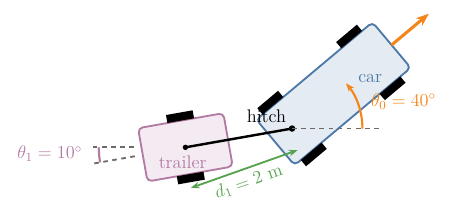
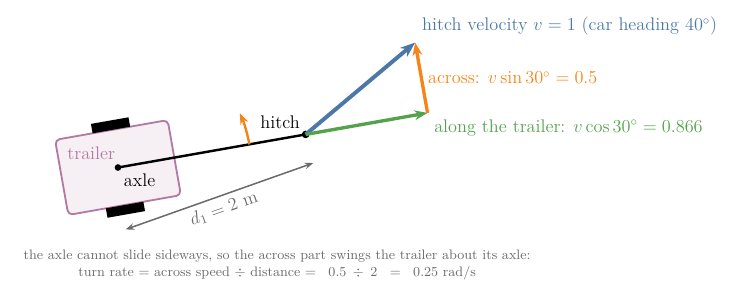
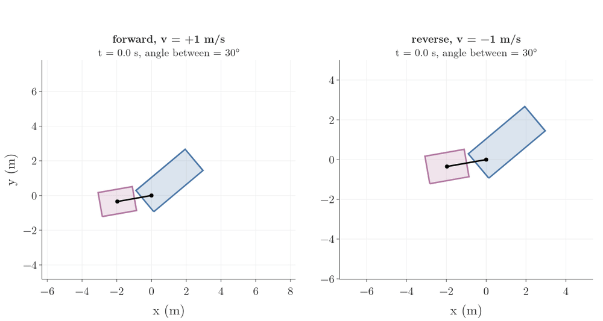

# Draft for the car-like robots Note (moved from RO-001, 2026-10-07)

Sections 7 and 8 of RO-001 as written, moved here when the car models and the trailer went to the car Note. Figure numbers and section links are those of RO-001 and must be renumbered when this Note is built. Figures: images/control_sets, trailer, trailer_why, trailer_drive.

## Glossary rows to restore (IDs kept)

| G-2309 | Control set | All the input pairs $(v, \omega)$ a vehicle can produce, drawn as a shape (diamond, bowtie, segments); the shape decides what manoeuvres are possible, such as spinning on the spot. | [Note RO-001](RO/control/01-robot-models/RO-001-pose-and-wheeled-robot-motion/RO-001-pose-and-wheeled-robot-motion.md#71-why-one-model-covers-cars-too) | Car models |
| G-2306 | Dubins car | A simple car that can only move forward at full speed (or stop); it can reach any pose on an open floor but cannot parallel park in a tight space. | [Note RO-001](RO/control/01-robot-models/RO-001-pose-and-wheeled-robot-motion/RO-001-pose-and-wheeled-robot-motion.md#71-why-one-model-covers-cars-too) | Car models |
| G-2307 | Hitch length $d_1$ | The distance from the hitch point to the middle of a trailer's axle; a longer hitch makes the trailer's heading change more slowly. | [Note RO-001](RO/control/01-robot-models/RO-001-pose-and-wheeled-robot-motion/RO-001-pose-and-wheeled-robot-motion.md#81-why-the-trailer-turns) | Car models |
| G-2308 | Jackknifing | A car and trailer folding into a V when reversing, because in reverse the angle between them grows instead of shrinking. | [Note RO-001](RO/control/01-robot-models/RO-001-pose-and-wheeled-robot-motion/RO-001-pose-and-wheeled-robot-motion.md#82-why-reversing-is-hard-jackknifing) | Car models |
| G-2304 | Minimum turning radius $\rho_{\min}$ | The radius of the tightest circle a car can drive, set by how far it can steer; it limits the turn rate to $\lvert\omega\rvert \le \lvert v\rvert / \rho_{\min}$. | [Note RO-001](RO/control/01-robot-models/RO-001-pose-and-wheeled-robot-motion/RO-001-pose-and-wheeled-robot-motion.md#71-why-one-model-covers-cars-too) | Car models |
| G-2305 | Reeds-Shepp car | A simple car that moves at full speed forward or full speed in reverse (or stands still); with reverse it can manoeuvre into tight spaces. | [Note RO-001](RO/control/01-robot-models/RO-001-pose-and-wheeled-robot-motion/RO-001-pose-and-wheeled-robot-motion.md#71-why-one-model-covers-cars-too) | Car models |
| G-2303 | Simple car | A car model that moves like the differential drive but cannot turn on a circle smaller than its minimum turning radius, so its turn rate is limited by its speed and it cannot spin on the spot. | [Note RO-001](RO/control/01-robot-models/RO-001-pose-and-wheeled-robot-motion/RO-001-pose-and-wheeled-robot-motion.md#71-why-one-model-covers-cars-too) | Car models |

## 7. Cars: the same model with different limits

> **Key point:** A differential-drive robot and a car follow the same three equations. They differ only in which pairs of forward speed and turn rate they can produce, and that one difference explains why a car cannot turn on the spot.

### 7.1 Why one model covers cars too

A car's rear wheels also cannot slide sideways, and its steered front wheels make it turn about a point on the line through its rear axle, for the same reason as in Section 4.2. So the midpoint of its rear axle follows the same model as our robot (MR §13.3.1):

$$\dot{x} = v \cos\theta$$

$$\dot{y} = v \sin\theta$$

$$\dot{\theta} = \omega$$

The difference lies elsewhere: not every pair $(v, \omega)$ is possible for every vehicle. All the pairs a vehicle can produce form its **control set** (G-2309). Figure 19 draws each control set in the plane of forward speed (across) and turn rate (up); the shape of the set decides what the vehicle can do.

**Differential drive: why a diamond.** Each wheel has a top speed, say 0.6 m/s. By Section 4.5, each wheel speed is a straight-line mix of $v$ and $\omega$, so each limit cuts the plane along a straight line, and the four limits (each wheel, forward and backward) make a four-sided shape. Its corners are the extremes. Driving straight with both wheels at 0.6 m/s gives the top forward speed:

$$v = 0.6 \text{ m/s}$$

Spinning with the wheels at +0.6 and −0.6 m/s gives the top turn rate:

$$\omega = \frac{0.6 - (-0.6)}{0.2}$$

$$= 6 \text{ rad/s}$$

The corner at no forward speed and a turn rate of 6 rad/s is the spin on the spot.

**Simple car: why a bowtie.** The **simple car** (G-2303) steers its front wheels, but only so far, so it cannot drive on a circle tighter than its **minimum turning radius** (G-2304) $\rho_{\min}$ (LaValle §13.1.2.1). A tighter circle means a faster turn at the same speed, because $R = v / \omega$. So the turn rate is limited by the speed:

$$\lvert\omega\rvert \le \lvert v\rvert / \rho_{\min}$$

With $\rho_{\min} = 5$ m and a top speed of 1 m/s, the largest turn rate is:

$$\omega_{\max} = 1 / 5 = 0.2 \text{ rad/s}$$

The limit is two straight lines through the origin, which gives the bowtie. At zero speed the allowed turn rate is zero: a car turns only by rolling along a curve, so a car standing still cannot turn, and it can never spin on the spot. Where $\rho_{\min}$ comes from (the steering angle and the distance between the axles) is the subject of the car-like robots Note later in this chapter.

**Reeds-Shepp car and Dubins car: why simplify further.** The **Reeds-Shepp car** (G-2305) is a simple car that drives only at full speed forward or full speed in reverse ($v = +1$ or $v = -1$), or stands still, like the gears forward, reverse and park. The **Dubins car** (G-2306) is the same without reverse: $v = +1$ or stop (LaValle §13.1.2.1). Why study such restricted cars?

- Limiting the speed to full forward or full reverse does not remove any pose the car can reach; it only fixes how fast it gets there (LaValle §13.1.2.1).
- For these two cars, the shortest route between any two poses on an open floor is known exactly: it is always made of arcs at the minimum turning radius and straight lines, from a short list of patterns (MR §13.3.3). Planners use these routes as ready-made building blocks; a later Note on planning with motion limits does so.

### 7.2 What the limits change

All four vehicles are nonholonomic and can reach every pose on an open floor (LaValle §13.1.2.1). The control set decides how hard it is to get there:

- The differential drive can spin on the spot, so it can turn to face the goal first and then drive straight to it (LaValle §13.1.2.2).
- The Reeds-Shepp car can get into an arbitrarily small parking space, given a little clearance, by shuffling forward and back (LaValle §13.1.2.1).
- The Dubins car cannot reverse, so parallel parking in a tight space is impossible. Facing a wall, it may be unable to avoid hitting it (LaValle §13.1.2.1).

## 8. A car pulling a trailer

> **Key point:** Each trailer adds one number to the configuration, its own heading, but no new control input. Pulled forward, the trailer swings into line behind the car; pushed in reverse, the angle between them grows.

### 8.1 Why the trailer turns

Hitch a trailer to the middle of the car's rear axle (Figure 20). The car decides where the hitch goes; the trailer can only follow. To know where everything is, we need one more number, the trailer's heading $\theta_1$; we now call the car's heading $\theta_0$. The configuration has four numbers:

$$q = (x,\ y,\ \theta_0,\ \theta_1)$$

The distance from the hitch to the middle of the trailer's axle is the **hitch length** (G-2307) $d_1$.

How fast does the trailer's heading change? Take the car heading at 40°, the trailer at 10°, $v = 1$ m/s and $d_1 = 2$ m. The hitch moves with the car: 1 m/s in the car's direction. Split that velocity into two parts relative to the trailer (Figure 21), using the angle between car and trailer:

$$\theta_0 - \theta_1 = 40^\circ - 10^\circ = 30^\circ$$

- the part **along** the trailer, $v \cos 30^\circ = 0.866$ m/s, pulls the trailer forward;
- the part **across** the trailer, $v \sin 30^\circ = 0.5$ m/s, pushes the front of the trailer sideways.

The trailer's own wheels cannot slide sideways, so its axle does not move across. The front end moves across at 0.5 m/s while the axle, 2 m behind, does not: the trailer turns about its axle. By the rule of Section 4.2, speed equals turn rate times distance, so the turn rate is the across speed divided by the distance:

$$\dot{\theta}_1 = \frac{0.5}{2} = 0.25 \text{ rad/s}$$

In general:

$$\dot{\theta}_1 = \frac{v}{d_1}\thinspace\sin(\theta_0 - \theta_1)$$

This is the trailer equation of LaValle §13.1.2.4 (eq. 13.19). The car's own three equations stay as in Section 7.1.

The formula explains what drivers see. The trailer's heading grows towards the car's heading, so the gap shrinks. As the gap shrinks, the across part shrinks with it, and when the two are in line the across part is zero and the trailer stops turning. A longer hitch swings more slowly, because the same across speed has a longer lever to turn.

### 8.2 Why reversing is hard: jackknifing

Now reverse, with $v = -1$ m/s and the same angles:

$$\dot{\theta}_1 = \frac{-1}{2} \times 0.5 = -0.25 \text{ rad/s}$$

The sign flips: the trailer now turns **away** from the car's heading, so the gap grows. A bigger gap makes the across part bigger, which makes the trailer turn away faster still. Left alone, the car and trailer fold into a V, called **jackknifing** (G-2308). Figure 22 shows both cases from the same start: forward, the gap falls from 30° to 2° in 6 s; in reverse, it grows from 30° to 89° in 2.6 s.

A rope behaves the same way. Pull a rope and it trails in line behind you; push it and it buckles. A trailer in reverse is being pushed, so the driver has to steer constantly to keep it from folding. With $k$ trailers the configuration has $3 + k$ numbers, but there are still only two inputs, $v$ and $\omega$ (LaValle §13.1.2.4), so each extra trailer is one more angle to keep in check with the same two controls.

