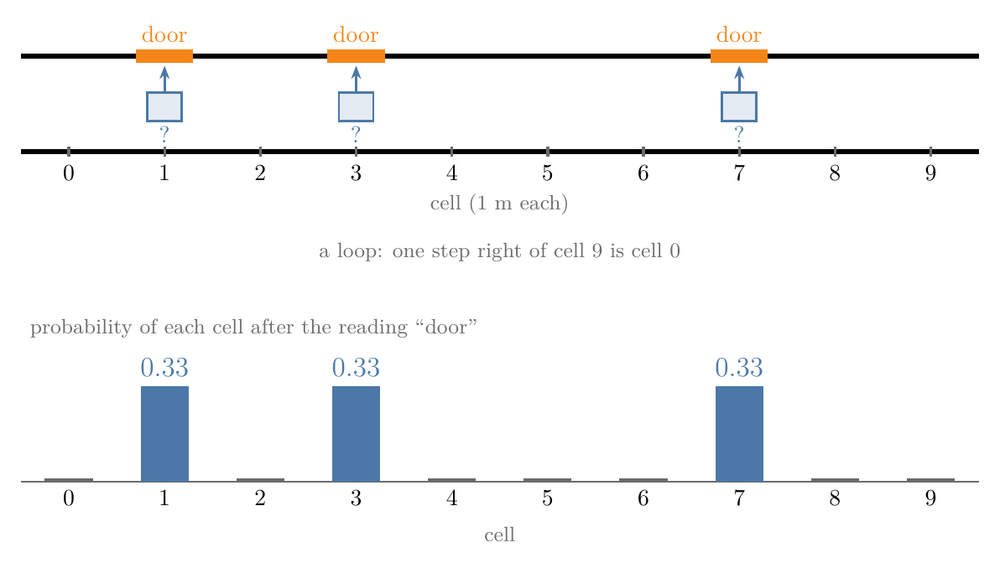
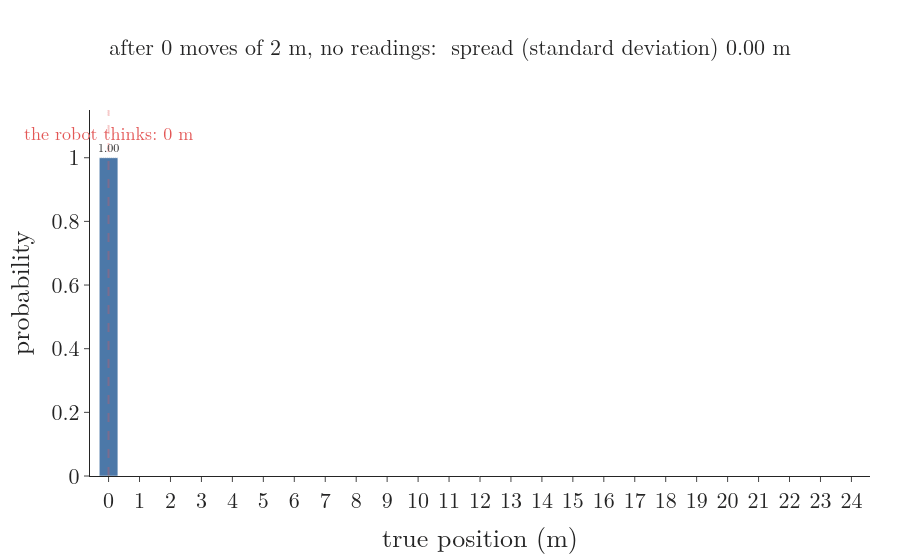
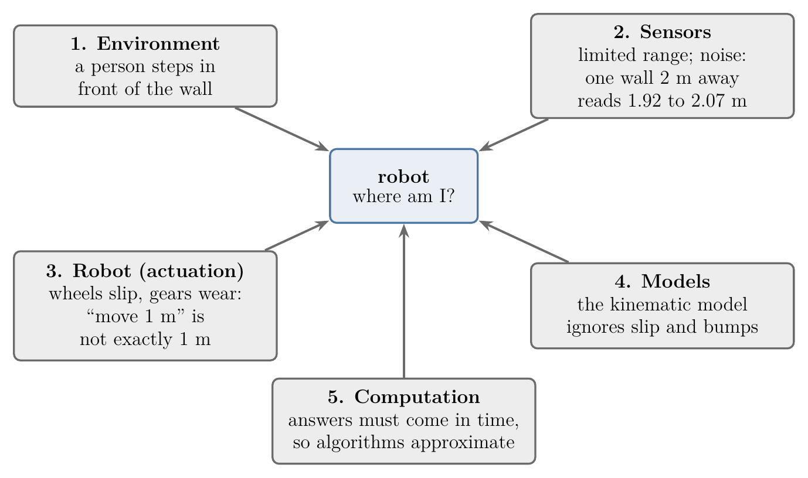
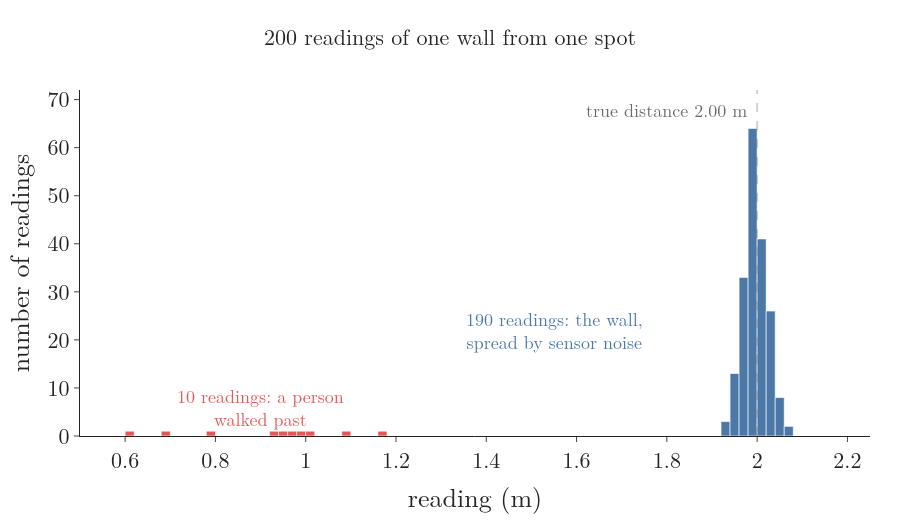
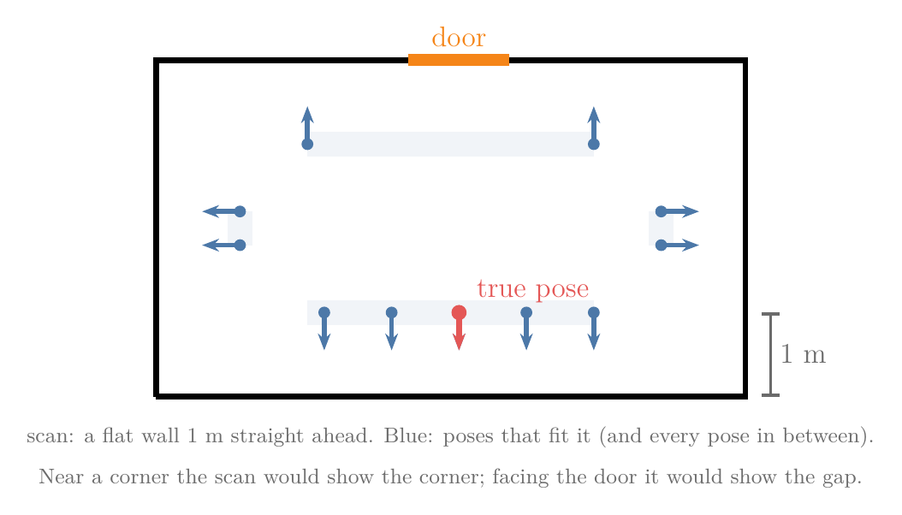
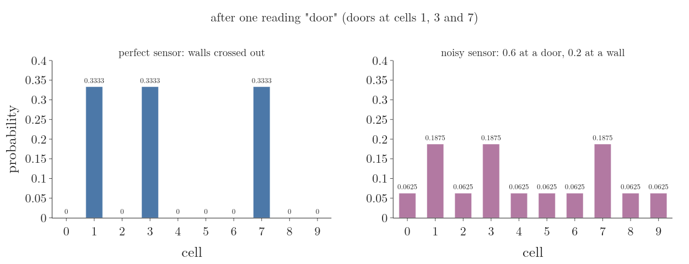
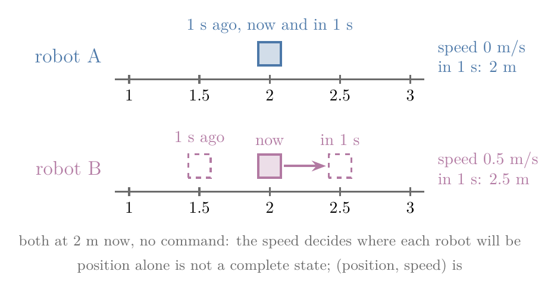

## 1. Overview

> **Key point:** A robot's sensors and wheels are never exact, so one reading can fit many places and one move can end in several. The robot therefore keeps a probability for every place it could be, instead of a single guess.

A delivery robot drives along the hallway of Figure 1, the hallway this whole chapter uses. It has a map: 10 cells of 1 m each, numbered 0 to 9, with doors at cells 1, 3 and 7. The hallway is a loop, so one step to the right of cell 9 is cell 0. The robot has a sensor that says "door" or "wall" for the cell beside it. Its sensor now says "door". Where is it?

There is no single answer. Three cells fit that reading, and the robot has no reason to prefer one of them. A robot that picks one cell and forgets the rest is wrong two times out of three. A robot that keeps all three, each with probability 1/3, still has the true cell among them.

This Note builds that idea step by step:

- why a robot can never be sure: five sources of uncertainty, and how errors pile up when the robot only counts its moves (Section 2);
- why the robot keeps a probability for every place instead of one best guess (Section 3);
- what the robot must keep track of, its state, and when a state is complete (Section 4);
- the two streams of data it receives, controls and measurements, and their order in time (Section 5);
- why moving makes the robot less sure and sensing makes it more sure (Section 6).

## 2. Why a robot is never sure

> **Key point:** Every part of a robot adds uncertainty: the world changes, sensors are limited and noisy, wheels slip, models are simplified and computers must answer in time. Errors in counted moves add up, so a robot that only counts its moves gets more and more lost.

### 2.1 Why counting moves is not enough: dead reckoning

The simplest way to know where we are is to start at a known place and add up our own moves: "I started at 0 m and moved 2 m eight times, so I am at 16 m." This is **dead reckoning** (G-2311): working out the position from a known start plus the robot's own motion, with no look at the surroundings. Facing north at 1 m/s for 3 s, a robot reckons it is 3 m north of where it started, without checking anything.

The trouble is that the moves themselves are not exact. Our hallway robot is told "move 2", two cells of 1 m. Because its wheels sometimes slip or spin on, the real move is (Labbe ch.2):

| Real move | Probability |
|---|---|
| 1 cell (it falls short) | 0.1 |
| 2 cells | 0.8 |
| 3 cells (it runs on) | 0.1 |

We count positions in whole cells, so a move that falls well short counts as 1 cell and one that runs on counts as 3. This is the move of the hallway robot throughout the chapter.

Figure 2 plays what happens to a robot that starts surely at 0 m on a long straight track and is told "move 2" eight times without looking around. The bars show the probability of each true position; the red dashed line is where the robot thinks it is.

The chance that the robot is exactly where it thinks shrinks with every move:

| Moves | Robot thinks | Chance it is exactly there | Spread (standard deviation) |
|---|---|---|---|
| 1 | 2 m | 0.80 | 0.45 m |
| 2 | 4 m | 0.66 | 0.63 m |
| 4 | 8 m | 0.49 | 0.89 m |
| 8 | 16 m | 0.33 | 1.26 m |

The spread is the [standard deviation](../../../../MA/02-probability/MA-012-expected-value-and-variance/MA-012-expected-value-and-variance.md#41-variance-term-by-term) (G-1870), the typical distance between the true position and the reckoned one. Why does it grow? One move has variance 0.2 m², the average squared miss from the commanded 2 m:

$$0.1 \times (1 - 2)^2 = 0.1$$

$$0.8 \times (2 - 2)^2 = 0$$

$$0.1 \times (3 - 2)^2 = 0.1$$

$$\text{variance} = 0.1 + 0 + 0.1 = 0.2$$

The moves slip independently, and for independent moves the [variances add](../../../../MA/04-inference/MA-033-sampling-distribution-and-clt/MA-033-sampling-distribution-and-clt.md#42-mean-and-variance-of-the-sample-means). After 8 moves:

$$\text{variance} = 8 \times 0.2 = 1.6$$

$$\text{spread} = \sqrt{1.6} = 1.26 \text{ m}$$

The spread keeps growing, more slowly than the number of moves but without limit. Dead reckoning is good over short stretches; over longer ones its error grows until something outside the robot corrects it. The notebook `RO-007-why-a-robot-is-never-sure.ipynb` checks the table with 100 000 simulated robots.

### 2.2 Five sources of uncertainty

Slipping wheels are only one cause. The textbook on probabilistic robotics lists five (Thrun et al. 2005 ch.1, as given in Khamis L5), shown in Figure 3:

1. **The environment.** The world is not fully predictable: people walk past, doors open and close, chairs move. A person who steps between the robot and the wall makes a distance sensor read much less than the true distance to the wall.
2. **The sensors.** A sensor sees only so far and so finely; a camera cannot see through walls. Eight distance sensors around a robot tell it how far the nearest obstacle is in eight directions, which is usually not enough to say where it is in a room. And every reading carries **sensor noise** (G-2312): small random errors, so the same wall measured again from the same spot gives slightly different numbers.
3. **The robot's actuation.** Motors and wheels do not do exactly what they are told. A command to move 1 m gives 95 cm one time and 1.1 m the next; gears slip and wear.
4. **The models.** Every model simplifies. The [kinematic model](../../../control/01-robot-models/RO-001-pose-and-differential-drive/RO-001-pose-and-differential-drive.md#52-the-kinematic-model) (G-2297), the equations that turn wheel speeds into motion, assumes wheels that never slip.
5. **The computation.** A robot must decide in time, so its algorithms take shortcuts and approximate (Khamis L5).

Figure 4 shows sensor noise and the environment at work on one wall. A distance sensor stands 2.00 m from a wall and takes 200 readings. The 190 readings of the wall itself spread from 1.92 m to 2.07 m, because of sensor noise. The 10 readings taken while a person walked past are between 0.61 m and 1.16 m, nowhere near the wall.

So no reading and no move can be taken at face value. The rest of this Note is about how a robot can still work out where it is.

## 3. Keep a distribution, not one best guess

> **Key point:** One reading often fits several places. A robot that keeps one guess throws the others away and gets lost when it guessed wrong; a robot that keeps a probability for every place keeps the truth among its candidates.

### 3.1 Why one reading fits many places

Back to the hallway. For this section we make two simplifications: the moves are exact and the door sensor never errs. At the start the robot knows nothing, so each of the 10 cells has the same probability:

$$P(\text{each cell}) = \frac{1}{10} = 0.1$$

The sensor says "door". Three cells have a door (1, 3 and 7) and nothing favours one of them, so each gets a third:

$$P(1) = P(3) = P(7) = \frac{1}{3} = 0.33$$

The other seven get 0, as Figure 1 shows. The same thing happens in two dimensions. A robot in a room whose laser scan shows "a flat wall 1 m straight ahead" could stand 1 m from any straight stretch of any wall, facing it (Figure 5). The reading rules out spots near a corner or facing the door, where the scan would look different, but it leaves many poses.

Such a list of every possible value with its probability, adding up to 1, is a [probability distribution](../../../../MA/03-distributions/MA-020-random-variables-and-distributions/MA-020-random-variables-and-distributions.md#3-probability-distributions-as-tables) (G-1571). Ours has three separate peaks, so it is a [multimodal](../../../../MA/01-descriptive-stats/MA-005-measures-of-central-tendency/MA-005-measures-of-central-tendency.md#5-mode) (G-1275) distribution: the robot is not in three places at once, it has narrowed its position down to one of three (Labbe ch.2).

### 3.2 Why a single best guess gets lost

A robot could instead keep only one value: its **best guess**, a [point estimate](../../../../MA/04-inference/MA-034-estimating-a-mean-with-the-clt/MA-034-estimating-a-mean-with-the-clt.md#5-the-point-estimate) (G-1507) of its position. Figure 6 runs both robots side by side. The true robot is in cell 1 (red square).

Step by step:

1. **Reading "door".** The distribution keeps cells 1, 3 and 7. The best-guess robot must pick one and picks cell 7. With three equal candidates, a guess is right only one time in three.
2. **Control "move 2".** Every candidate moves with the robot: cells 1, 3 and 7 become 3, 5 and 9. The best guess becomes cell 9.
3. **Reading "door" again.** Of cells 3, 5 and 9, only cell 3 has a door. Each other candidate would have read "wall", which does not match. So the distribution is now certain: cell 3, with probability 1.

The best-guess robot expected a wall at cell 9 and read "door". It now knows its guess was wrong, but it threw the other candidates away at step 1, so it has nothing to fall back on: it is lost. The robot that kept the whole distribution found its place, because it remembered every place the readings allowed (Labbe ch.2).

This is the central idea of **probabilistic robotics** (G-2313): the robot computes a probability distribution over what might be the case, instead of a single best guess, so it can handle ambiguous readings and recover from errors (Thrun 2000). The probability distribution a robot keeps over where it might be is its [belief](../RO-013-belief/RO-013-belief.md#42-the-definition), defined later in this chapter.

### 3.3 Why noisy sensors forbid crossing places out

Section 3.2 crossed out every cell that did not match a reading. That works only for a perfect sensor. A real door sensor errs. The sensor of our hallway robot, used throughout the chapter, behaves like this:

| Robot is at | Reads "door" | Reads "wall" |
|---|---|---|
| a door cell | 0.6 | 0.4 |
| a wall cell | 0.2 | 0.8 |

A robot that still crosses out non-matching cells throws away its true cell every time the reading is wrong. In Section 3.2 the true robot stood at a door both times (cells 1 and 3). The chance that both readings say "door" is:

$$0.6 \times 0.6 = 0.36$$

So the chance that at least one says "wall", and the true cell is crossed out, is:

$$1 - 0.36 = 0.64$$

Nearly two times in three, the robot would delete the cell where it really is. (The two readings err [independently](../../../../MA/02-probability/MA-016-independent-events/MA-016-independent-events.md#2-the-definition) (G-934), which is why their probabilities multiply.)

So with a noisy sensor the robot does not cross out; it **weights**. A reading of "door" makes each door cell 3 times as likely as each wall cell, because the sensor reads "door" 3 times as often at a door as at a wall (Labbe ch.2):

$$\frac{0.6}{0.2} = 3$$

Three door cells and seven wall cells make 16 equal shares:

$$3 \times 3 + 7 \times 1 = 16$$

$$P(\text{each door}) = \frac{3}{16} = 0.1875$$

$$P(\text{each wall}) = \frac{1}{16} = 0.0625$$

Check: the ten cells add up to 1.

$$3 \times 0.1875 + 7 \times 0.0625 = 1$$

Figure 7 compares the two. The wall cells keep a small probability, so one wrong reading lowers the true cell but never deletes it; later readings can lift it again. The same holds in the room of Figure 5: the robot cannot be sure it is not in the middle of the room, because it may be looking at a flat obstacle that is not on its map, such as a box, so those poses keep a low but nonzero probability. How a reading turns into these numbers in general is [Bayes' theorem](../RO-014-bayes-filter/RO-014-bayes-filter.md#31-why-the-robot-needs-bayes-theorem), worked out later in this chapter.

## 4. The state: what the robot keeps track of

> **Key point:** The state is every quantity the robot needs to predict what happens next: its pose, often its speeds, the things around it that can change, and sometimes its own health. A state is complete when knowing it now makes the past useless for predicting the future.

### 4.1 State: from one number to many

In the hallway the robot needs one number, its cell. A robot on a floor needs three, its [pose](../../../control/01-robot-models/RO-001-pose-and-differential-drive/RO-001-pose-and-differential-drive.md#22-why-position-is-not-enough-the-heading) (G-2280): position $(x, y)$ and heading $\theta$, such as (2 m, 1 m, 30°). A robot in 3D, such as a drone, needs six: three for position and three angles.

The collection of quantities the robot keeps track of because they decide what happens next is its **state** (G-2314), written $x_t$ at time $t$. In the hallway run of Section 3.2 the robot is in cell 3 at time 2:

$$x_2 = 3$$

Depending on the robot and the task, the state can also include:

- the **pose** of the robot;
- the **speeds** of the robot, when it does not stop the moment its motors stop (Section 4.2);
- the **settings of its actuators**, such as the joint angles of an arm it carries;
- the **positions of things around it**: fixed things such as walls and doors are kept in a [map](../RO-009-maps-and-landmarks/RO-009-maps-and-landmarks.md#21-what-a-map-is-for), while things that move, such as people, go into the state, often with their speeds;
- the **robot's own health**, such as its battery level or the wear on its gears.

### 4.2 Why the speed can belong to the state

Figure 8 shows two robots on a smooth floor with their motors switched off. Both are at 2 m right now. Robot A has been standing still; robot B is rolling at 0.5 m/s.

One second later:

| Robot | Position now | Speed now | Position in 1 s |
|---|---|---|---|
| A | 2 m | 0 m/s | 2 m |
| B | 2 m | 0.5 m/s | 2.5 m |

Their positions now are the same, but their futures differ. If the state were the position alone, we could not predict where each robot goes, while their positions one second ago (2 m and 1.5 m) would tell us. The past would carry information the state lacks. With the speed added, the state $(2 \text{ m}, 0.5 \text{ m/s})$ predicts robot B's next position by itself, and the past adds nothing.

### 4.3 Complete state and the Markov property

That test gives the definition. A state is a **complete state** (G-2315) if knowing it now, the earlier states, controls and measurements tell us nothing more about the future (Thrun et al. 2005 §2.3.1). For robot B:

- position only: not complete, because the position one second ago improves the prediction;
- position and speed: complete, because nothing from the past improves it.

A sequence of states with this property, where the future depends on the past only through the present, has the **Markov property** (G-2316). We want it because it lets the robot forget its history: to predict and to update its belief, it needs only the latest state, not every reading since it was switched on. The [Bayes filter](../RO-014-bayes-filter/RO-014-bayes-filter.md#5-why-the-two-steps-give-the-exact-belief) is built on it.

The same test catches a door that people open and close. If the map treats the door as always closed, the robot's recent readings at that door tell it something the state does not hold (whether the door is open now), so the state is not complete. Adding "door open or closed" to the state makes it complete again.

In practice no robot's state is truly complete: people move, gears wear, the floor changes. Robots still treat their state as complete, and the methods of this chapter work well when the leftover effects are small (Thrun 2000).

## 5. Controls and measurements: two streams of data

> **Key point:** A robot receives two kinds of data. Controls, such as "move 2", change its state; measurements, such as "door", only report on it. A control comes first, then the measurement in the new state.

### 5.1 Measurements and controls

The data that reaches a robot comes in two kinds (Thrun 2000; Khamis L5):

- A **measurement** (G-2317) $z_t$ is what the sensors report about the world at time $t$: our door sensor's "door", a laser scan of distances, a camera image. In the hallway at time 1:

  $$
  z_1 = \text{door}
  $$

- A **control** is information about how the state changed: the command "move 2", or a count of how far the wheels turned. We write it $u_t$, the same symbol as the [control input](../../../control/01-robot-models/RO-001-pose-and-differential-drive/RO-001-pose-and-differential-drive.md#52-the-kinematic-model) (G-2298) of a robot model. In the hallway at time 2:

  $$
  u_2 = \text{move 2}
  $$

We keep them apart because they do opposite things to the robot's knowledge (Section 6). A control causes the state to change; a measurement does not change the state, it only tells the robot something about it.

A list of all measurements from time 1 to time $t$ is written $z_{1:t}$, and likewise $u_{1:t}$ for controls. In the hallway run:

$$z_{1:2} = (\text{door},\ \text{door})$$

$$u_{1:2} = (\text{stay},\ \text{move 2})$$

### 5.2 The order in time

The robot starts in some state $x_0$. Then each time step has two parts:

1. a control $u_t$ moves the robot from $x_{t-1}$ to $x_t$;
2. the robot takes a measurement $z_t$ in the new state $x_t$.

Figure 9 draws this chain with the hallway run below it. Controls point into the states (green arrows), because they change them; measurements point out of the states (orange arrows), because each one is produced by the state the robot is in. The robot never sees the states themselves, only the controls it sent and the measurements it received. Working out the states from those two streams is **localization** (G-2318) when the state is the robot's pose in a known map (Thrun 2000).

How likely each next state is after a control, and each reading in a given state, are the two models every method in this chapter needs. The [motion model](../RO-008-probabilistic-motion-models/RO-008-probabilistic-motion-models.md#22-the-motion-model-and-its-density) is the first; the [measurement model](../RO-010-range-sensors-beam-model/RO-010-range-sensors-beam-model.md#22-why-we-need-a-measurement-model) is the second.

## 6. Moving makes the robot less sure, sensing makes it more sure

> **Key point:** Every uncertain move spreads the robot's distribution; every informative reading narrows it. Neither alone is enough: moves alone drift, readings alone are ambiguous, and together they pin the robot down.

Now we drop both simplifications: the moves are the noisy moves of Section 2.1, and the sensor is the noisy sensor of Section 3.3. Take a robot that knows it is in cell 3, as after Section 3.2. It drives two moves of 2 cells without a reading in between, and then reads its sensor. Figure 10 plays the four stages.

**Control $u_3$ spreads the distribution.** From cell 3 the robot ends in cell 4, 5 or 6 with the move probabilities of Section 2.1: 0.1, 0.8 and 0.1.

**Control $u_4$ spreads it further.** Each way of making two moves multiplies the two move probabilities, because the moves slip independently. Ending in cell 7, four cells on, happens in three ways:

$$\text{2 then 2}: 0.8 \times 0.8 = 0.64$$

$$\text{1 then 3}: 0.1 \times 0.1 = 0.01$$

$$\text{3 then 1}: 0.1 \times 0.1 = 0.01$$

$$P(7) = 0.64 + 0.01 + 0.01 = 0.66$$

The same counting gives the whole distribution:

| Cell | 5 | 6 | 7 | 8 | 9 |
|---|---|---|---|---|---|
| Probability | 0.01 | 0.16 | 0.66 | 0.16 | 0.01 |

**Measurement $z_4$ = "door" sharpens it.** The robot weights each cell as in Section 3.3: it multiplies each probability by the chance of reading "door" there, 0.6 at the door cell 7 and 0.2 at the wall cells:

$$\text{cell 7}: 0.66 \times 0.6 = 0.396$$

$$\text{cells 6, 8}: 0.16 \times 0.2 = 0.032$$

$$\text{cells 5, 9}: 0.01 \times 0.2 = 0.002$$

What is left no longer adds up to 1:

$$0.396 + 2 \times 0.032 + 2 \times 0.002$$

$$= 0.464$$

Dividing each by that sum gives the probability of each cell given the reading, a [conditional probability](../../../../MA/02-probability/MA-015-conditional-probability/MA-015-conditional-probability.md#2-the-definition) (G-444):

$$P(7 \mid \text{door}) = \frac{0.396}{0.464} = 0.853$$

$$P(6 \mid \text{door}) = \frac{0.032}{0.464} = 0.069$$

$$P(5 \mid \text{door}) = \frac{0.002}{0.464} = 0.004$$

Cells 8 and 9 get the same as cells 6 and 5. The spread after each stage tells the story in one number (the [standard deviation](../../../../MA/02-probability/MA-012-expected-value-and-variance/MA-012-expected-value-and-variance.md#41-variance-term-by-term) of the distribution):

| Stage | Spread |
|---|---|
| sure in cell 3 | 0 m |
| after $u_3$ | 0.45 m |
| after $u_4$ | 0.63 m |
| after $z_4$ | 0.42 m |

Moves add uncertainty because the robot cannot tell which of the possible outcomes happened; readings remove it because they make places that do not fit less likely, or rule them out (Thrun 2000). That is why a robot needs both streams of data:

- with moves alone it drifts, as in Section 2.1;
- with readings alone it stays ambiguous, as the three doors of Section 3.1 show;
- with both, each reading is checked against where the moves say the robot can be, and the places that fit everything gain probability, as in Section 3.2 and here.

## 7. Summary

| Idea | What it says | Why it matters |
|---|---|---|
| Dead reckoning | add up the robot's own moves from a known start | its error grows without limit, so it needs readings to correct it |
| Five sources of uncertainty | environment, sensors, actuation, models, computation | no reading or move can be taken at face value |
| Distribution, not best guess | keep a probability for every possible state | the truth stays among the candidates when a reading is ambiguous |
| State $x_t$ | the quantities that decide what happens next | it is what the robot estimates |
| Complete state | the past adds nothing once the state is known | the robot can forget its history (Markov property) |
| Control $u_t$, measurement $z_t$ | data that changes the state, data that reports on it | controls spread the distribution, measurements narrow it |

- Dead reckoning drifts: after 8 noisy moves the robot is where it thinks with probability 0.33, because independent errors add up (variances add).
- Uncertainty comes from five places, so a robot must plan for imperfect readings and moves rather than hope for perfect ones.
- One reading "door" fits three cells, so the robot keeps all three at 0.33; a single best guess is right only one time in three and, once contradicted, has nothing left.
- With a noisy sensor the robot weights places instead of crossing them out, because crossing out would delete the true place whenever a reading is wrong (64 percent of the time over two readings at two doors, with a sensor that sees a door 60 percent of the time).
- The state holds what decides the future: pose, speeds when the robot coasts, moving things around it, its health; it is complete when the past adds nothing, which lets the robot keep only its latest belief.
- A control comes first and changes the state; a measurement follows and reports on it, so each step of a filter is "move, then look".
- Moves spread the distribution (0 to 0.63 m in two moves) and readings narrow it (0.63 to 0.42 m), so the robot needs both.

So the answer to the opening question "where is it?" is not one place but a distribution over places, which the robot narrows each time a reading fits its moves.

## 8. Sources

**Built from**

- MATLAB, "Understanding the Particle Filter | Autonomous Navigation, Part 2", YouTube, 0:00–7:44, https://www.youtube.com/watch?v=NrzmH_yerBU (MATLAB Tech Talk)
- Cyrill Stachniss, "Robot Localization – An Overview", YouTube, 5:40–9:14, https://www.youtube.com/watch?v=8VJ-A9OlhAE (Stachniss, Robot localization)
- NPTEL IIT Madras, Introduction to Robotics, "#28 Introduction to Probabilistic Robotics", YouTube, https://www.youtube.com/watch?v=j7BVHy231B0 (NPTEL #28)
- Cyrill Stachniss channel (University of Bonn), "Motion Models", YouTube, https://www.youtube.com/watch?v=IVTV7vJgIkU (Stachniss channel, Motion models)
- Labbe, R. *Kalman and Bayesian Filters in Python*, chapter 2 "Discrete Bayes Filter", sections "Tracking a Dog" to "Noisy Sensors", and "Adding Uncertainty to the Prediction" for the 10/80/10 move. Free online: https://github.com/rlabbe/Kalman-and-Bayesian-Filters-in-Python/blob/master/02-Discrete-Bayes.ipynb (Labbe ch.2)
- Thrun, S. (2000). *Probabilistic Algorithms in Robotics*. Technical report CMU-CS-00-126, Carnegie Mellon University, §1–2. https://www.ri.cmu.edu/publications/probabilistic-algorithms-in-robotics (Thrun 2000)
- Khamis, A. (2016). "L5: State Estimation I". Slides for SPC418 Autonomous Vehicles, Zewail City of Science and Technology (the five sources of uncertainty, measurement and control data, after Thrun et al. 2005 ch.1–2). https://alaakhamis.org/teaching/SPC418/slides/L5-State%20Estimation-I.pdf (Khamis L5)

**Other references**

- Thrun, S., Burgard, W. and Fox, D. (2005). *Probabilistic Robotics*. MIT Press. Ch.1 (uncertainty in robotics), §2.3 (state, complete state, measurements and controls). Cited only where the free sources above confirm it.

## 9. Key terms

Terms taught in this Note come first; linked terms are recaps, taught in the Note the link opens.

| Term | Meaning |
|---|---|
| Dead reckoning (G-2311) | Working out a robot's position from a known start by adding up its own moves, without looking at its surroundings; simple, but its error grows with every move, so it needs readings to correct it. |
| Sensor noise (G-2312) | Small random errors in a sensor's readings, so the same quantity measured twice gives slightly different numbers (a wall 2 m away reads 1.92 to 2.07 m); it is one reason a robot cannot take a reading at face value. |
| Probabilistic robotics (G-2313) | The approach in which a robot keeps a probability distribution over what might be the case (such as where it is) instead of one best guess, so it can handle ambiguous readings and recover from errors. |
| State $x_t$ (G-2314) | The quantities a robot keeps track of at time $t$ because they decide what happens next, such as its pose, its speeds and moving things around it; it is what localization and filtering estimate. |
| Complete state (G-2315) | A state that, once known, makes earlier states, controls and measurements useless for predicting the future (position plus speed for a coasting robot, not position alone); it lets the robot keep only its latest estimate. |
| Markov property (G-2316) | The property of a sequence of states that the future depends on the past only through the present state; it lets a filter forget the history and work from the latest state alone. |
| Measurement $z_t$ (G-2317) | What a robot's sensors report about the world at time $t$, such as "door", a laser scan or a camera image; it does not change the state but tells the robot something about it, which narrows its distribution. |
| Localization (G-2318) | Working out a robot's pose in a known map from the controls it sent and the measurements it received; needed because the pose itself cannot be measured directly. |
| [Standard deviation of a random variable](../../../../MA/02-probability/MA-012-expected-value-and-variance/MA-012-expected-value-and-variance.md#41-variance-term-by-term) (G-1870) | The square root of a random variable's variance, in the units of $X$; it says how far values typically fall from the expected value. |
| [Kinematic model](../../../../RO/control/01-robot-models/RO-001-pose-and-differential-drive/RO-001-pose-and-differential-drive.md#52-the-kinematic-model) (G-2297) | Equations that give how a robot's configuration changes from its speed inputs alone, ignoring masses and forces, such as $\dot{x} = v\cos\theta$, $\dot{y} = v\sin\theta$, $\dot{\theta} = \omega$; used to predict motion at low speed. |
| [Probability distribution](../../../../MA/03-distributions/MA-020-random-variables-and-distributions/MA-020-random-variables-and-distributions.md#3-probability-distributions-as-tables) (G-1571) | A list of every possible outcome of a random variable with its probability. |
| [Multimodal](../../../../MA/01-descriptive-stats/MA-005-measures-of-central-tendency/MA-005-measures-of-central-tendency.md#5-mode) (G-1275) | Having more than one mode (two modes: bimodal). |
| [Point estimate](../../../../MA/04-inference/MA-034-estimating-a-mean-with-the-clt/MA-034-estimating-a-mean-with-the-clt.md#1-overview) (G-1507) | A single number computed from sample data as the best guess for an unknown population parameter. |
| [Independent events](../../../../MA/02-probability/MA-016-independent-events/MA-016-independent-events.md#2-the-definition) (G-934) | Events where one happening does not change the probability of the other. |
| [Pose](../../../../RO/control/01-robot-models/RO-001-pose-and-differential-drive/RO-001-pose-and-differential-drive.md#22-why-position-is-not-enough-the-heading) (G-2280) | Where a robot is and which way it faces: on a floor, its position $(x, y)$ and heading $\theta$, such as (2 m, 1 m, 30°); needed because a robot at one spot drives off differently depending on its heading. |
| [Control input $u$](../../../../RO/control/01-robot-models/RO-001-pose-and-differential-drive/RO-001-pose-and-differential-drive.md#52-the-kinematic-model) (G-2298) | The numbers we choose to drive a robot, such as $u = (v, \omega)$; the model turns them into motion. |
| [Conditional probability](../../../../MA/02-probability/MA-015-conditional-probability/MA-015-conditional-probability.md#2-the-definition) (G-444) | The probability of an event given that another event has happened: $P(A \mid B)$. |
