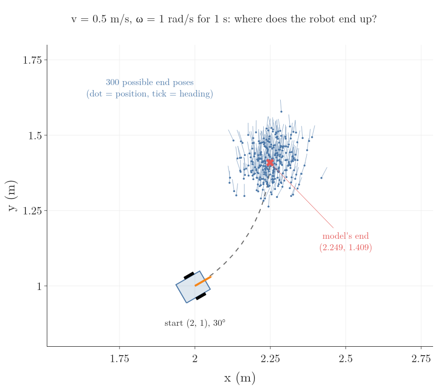
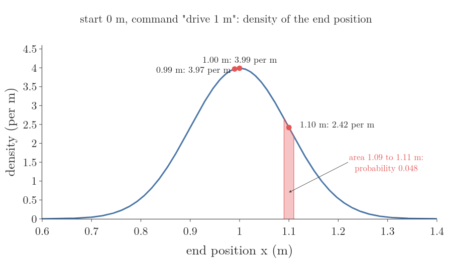
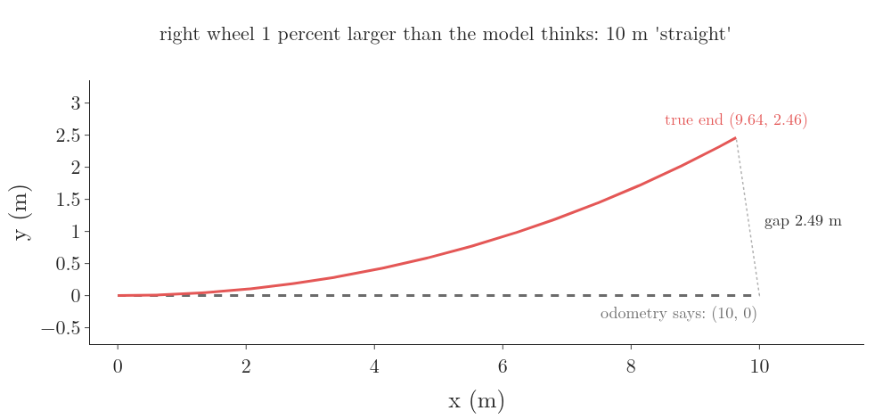
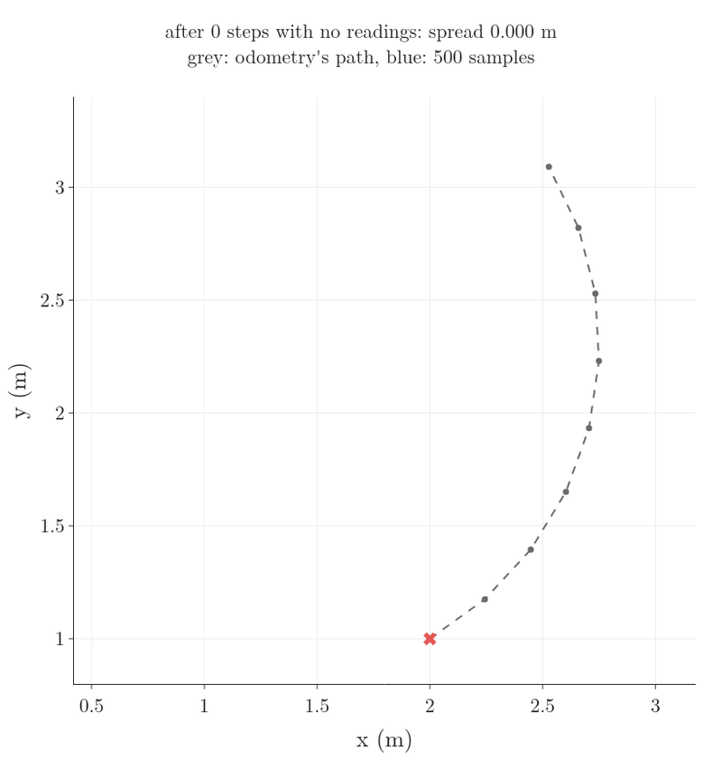
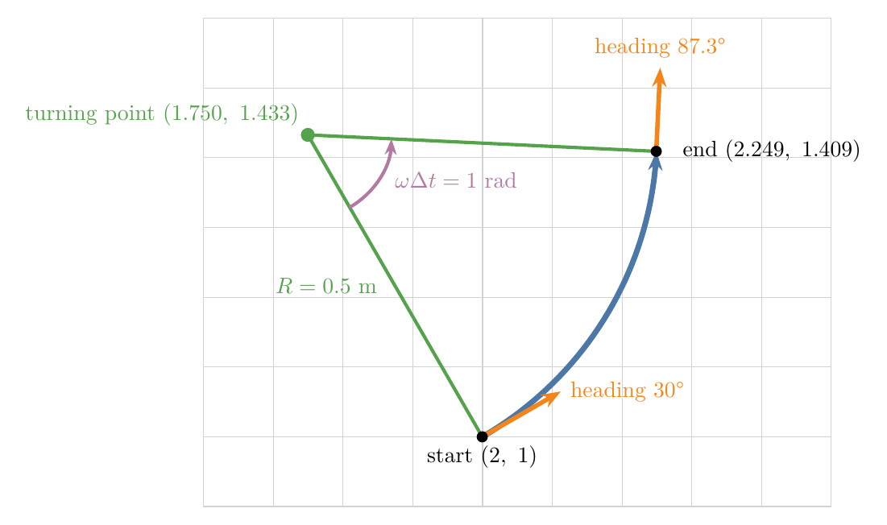
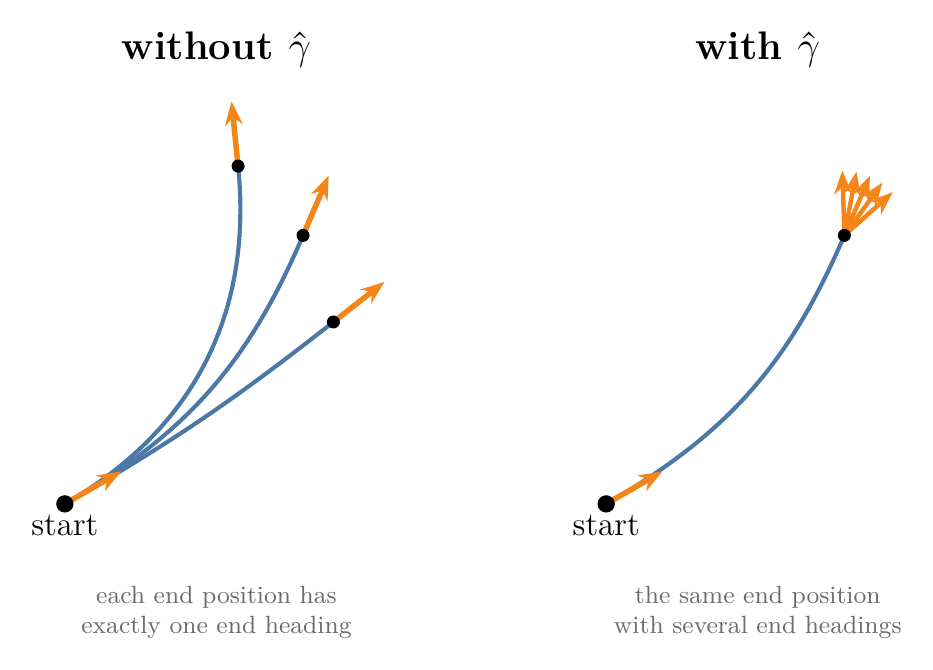

## 1. Overview

> **Key point:** A command or an odometry reading does not fix where the robot ends up; it fixes a spread of likely end poses. A probabilistic motion model describes that spread, so that a filter can both score any end pose and draw likely end poses at random.

The [kinematic model](../../../control/01-robot-models/RO-001-pose-and-differential-drive/RO-001-pose-and-differential-drive.md#52-the-kinematic-model) (G-2297) predicts exactly one place for a command. Our robot from that model starts at the pose (2 m, 1 m, 30°), drives at 0.5 m/s while turning at 1 rad/s, and after 1 s it should stand at (2.249 m, 1.409 m), facing 87.3°. A real robot on a real floor ends somewhere near there, but a little off, and a different amount off every time (Figure 1).

Every move makes the robot [less sure where it is](../RO-007-why-a-robot-is-never-sure/RO-007-why-a-robot-is-never-sure.md#6-moving-makes-the-robot-less-sure-sensing-makes-it-more-sure). Here we build the models that say by how much and in which directions, for a robot on a floor:

- motion as a probability distribution over end poses, and why its value is a density (Section 2);
- wheel odometry: how wheel encoders measure the motion, and why it drifts (Section 3);
- the odometry motion model: turn, drive, turn, each with its own noise (Section 4);
- drawing random end poses from a motion model, with the small amount of sampling theory it needs (Section 5);
- the velocity motion model, for when only the commanded speeds are known (Section 6);
- using a map to rule out end poses inside walls (Section 7).

## 2. Motion as a distribution

> **Key point:** Wheels slip and motors lag, so the same command ends in different poses. We describe the result as a distribution over end poses, $p(x_t \mid u_t, x_{t-1})$, whose value at a pose is a density, not a probability.

### 2.1 Why one command gives many end poses

Ask a robot to move 1 m forward and it may move 95 cm one time and 1.1 m the next. The reasons are physical:

- the motors do not reach the commanded speed at once, so the robot covers less ground than planned;
- a wheel slips on a smooth floor or a carpet, so it turns without moving the robot as far;
- a bump, such as a cable on the floor, makes a wheel skip part of a turn;
- the two wheels differ slightly in diameter, or a load presses one side harder, so the robot drifts to one side.

The last two are listed for wheeled robots in the Freiburg slides on motion models. Their effects add up from move to move: a robot that counts only its own moves through a maze slowly drifts away from its true path, the [dead reckoning](../RO-007-why-a-robot-is-never-sure/RO-007-why-a-robot-is-never-sure.md#21-why-counting-moves-is-not-enough-dead-reckoning) (G-2311) drift of the previous Note.

### 2.2 The motion model and its density

Start with a robot that moves along a straight line. It starts at 0 m and is told "drive 1 m". From many trials we find that it ends near 1 m, with a [standard deviation](../../../../MA/02-probability/MA-012-expected-value-and-variance/MA-012-expected-value-and-variance.md#41-variance-term-by-term) (G-1870) of 0.1 m, in a [normal distribution](../../../../MA/03-distributions/MA-024-normal-distribution/MA-024-normal-distribution.md#2-what-the-normal-distribution-is) (G-827). Figure 2 draws the curve. We can ask it questions such as "how likely is the robot to end at 1.1 m?"

The curve's height at a point is a [probability density](../../../../MA/03-distributions/MA-022-pdf-and-continuous-cdf/MA-022-pdf-and-continuous-cdf.md#5-what-the-density-at-a-point-means) (G-1569): probability per metre. It is not itself a probability, because the chance of ending at exactly 1.1 m, to infinitely many decimals, is zero. A probability is an area under the curve. For the 2 cm band from 1.09 m to 1.11 m:

$$\text{density at 1.10 m} = 2.42 \text{ per m}$$

$$\text{band width} = 0.02 \text{ m}$$

$$\text{probability} \approx 2.42 \times 0.02 = 0.048$$

The exact area is 0.0484. A density can be larger than 1: at 1 m it is 3.99 per m. Some course slides call these density values "probabilities"; they are densities, and only their areas are probabilities.

The same idea in full is the **motion model** (G-2319), also called the state transition probability (Freiburg slides):

$$p(x_t \mid u_t,\ x_{t-1})$$

- $x_{t-1}$ is the pose before the move, such as (2 m, 1 m, 30°);
- $u_t$ is the control: the command or the odometry reading for this move;
- $x_t$ is a possible pose after the move;
- the value is the density of ending at $x_t$.

In the one-dimensional example:

$$p(1.1 \mid \text{drive 1 m},\ 0) = 2.42 \text{ per m}$$

A filter uses a motion model in two ways, and this Note builds both:

1. **Score a pose:** given a possible end pose, compute its density (Section 4.4). Filters that keep a probability for every cell of a grid need this.
2. **Draw poses:** produce random end poses that follow the distribution (Sections 5 and 6). Filters that keep a cloud of sample poses, the particle filters, need this.

## 3. Wheel odometry: measuring the motion

> **Key point:** Encoders count how far each wheel turned; from the two wheel distances we get the robot's forward move and turn, and from those its new pose. Adding up many such steps is accurate over short distances but drifts, from slip and from wrong wheel sizes.

### 3.1 From encoder ticks to a new pose

A **wheel encoder** (G-2320) is a sensor that counts how far a wheel turns. A common kind is a disc with evenly spaced slots fixed to the motor shaft. A light shines through the slots onto a light sensor, which gives one pulse, or tick, each time a slot passes (Freiburg slides). Knowing how many slots make a full turn, the robot turns the tick count into the angle the wheel turned (Figure 3).

Working out the robot's pose by adding up the wheel motion the encoders measure is **wheel odometry** (G-2321). It takes three steps. Our encoders give 1000 ticks per wheel turn; our wheels have radius $r = 0.05$ m and are $L = 0.2$ m apart (RO-001). In one step of 0.1 s the right encoder counts 191 ticks and the left 127.

**Step 1: ticks to wheel distances.** A rolling wheel moves one circumference per turn, by [rolling without slipping](../../../control/01-robot-models/RO-001-pose-and-differential-drive/RO-001-pose-and-differential-drive.md#32-why-wheel-spin-gives-ground-speed-rolling-without-slipping) (G-2290). One tick is a thousandth of that:

$$\text{tick} = \frac{2\pi \times 0.05}{1000}$$

$$= 0.314 \text{ mm}$$

$$d_R = 191 \times 0.314 = 60.0 \text{ mm}$$

$$d_L = 127 \times 0.314 = 39.9 \text{ mm}$$

**Step 2: wheel distances to the robot's move.** These are the [forward kinematics](../../../control/01-robot-models/RO-001-pose-and-differential-drive/RO-001-pose-and-differential-drive.md#43-wheel-speeds-to-forward-speed-and-turn-rate) (G-2294) of RO-001, used with distances instead of speeds. The time step cancels out, so the robot needs only the tick counts, not the wheel speeds:

$$\Delta s = \frac{d_R + d_L}{2}$$

$$= \frac{60.0 + 39.9}{2} = 49.95 \text{ mm}$$

$$\Delta\theta = \frac{d_R - d_L}{L}$$

$$= \frac{0.0600 - 0.0399}{0.2} = 0.1005 \text{ rad}$$

**Step 3: the move in the world frame.** An [Euler step](../../../control/01-robot-models/RO-001-pose-and-differential-drive/RO-001-pose-and-differential-drive.md#53-why-we-predict-the-path-step-by-step) (G-2299) from the pose (2, 1, 0.5236):

$$x = 2 + 0.04995 \times 0.866 = 2.0433$$

$$y = 1 + 0.04995 \times 0.5 = 1.0250$$

$$\theta = 0.5236 + 0.1005 = 0.6241$$

The step repeats every 0.1 s, each one starting from the last result. The tick counts match the wheel spin rates of RO-001 (12 and 8 rad/s), so the result matches the first Euler step there.

### 3.2 Why odometry drifts, and why it needs calibration

Wheel odometry adds a small increment to its previous estimate again and again, so every small error stays in the sum and the estimate drifts. The errors are of two kinds:

- **Random errors**, different every time: wheel slip, bumps, the step-by-step approximation. When a wheel slips, the encoder still counts ticks but the robot does not move as far.
- **Systematic errors**, the same every time: the model's wheel radius or wheel separation is slightly wrong. No two real robots are identical, even when built to the same drawing.

Figure 4 shows how much a small systematic error costs. The model assumes both wheels have radius 0.05 m, but the right one is really 0.0505 m, 1 percent larger. Both encoders count the same ticks, so odometry believes the robot drove straight for 10 m. Really, the right wheel covered 10.1 m and the left 10 m, so the robot turned left:

$$\Delta\theta = \frac{10.1 - 10}{0.2} = 0.5 \text{ rad}$$

The true robot ends at (9.64 m, 2.46 m), 2.49 m from where odometry puts it. Finding the real wheel radii and separation of one particular robot by driving known paths is **odometry calibration** (G-2322); it removes most of the systematic error, while the random error stays and needs a probabilistic model.

## 4. The odometry motion model

> **Key point:** The odometry model takes the motion odometry reports between two poses, splits it into turn, drive, turn, and puts separate noise on each part. Its density at a possible end pose is the product of three normal densities.

### 4.1 Odometry or commands: which data to use

There are two common choices for the control $u_t$ of a wheeled robot, and each gives its own motion model: the **odometry motion model** (G-2323), built in this section, and the **velocity motion model** (G-2324) of Section 6 (Freiburg slides):

| | Odometry model | Velocity model |
|---|---|---|
| Data | the motion measured by wheel encoders | the commanded speeds $v$ and $\omega$ |
| Needs | encoders | nothing extra |
| Accuracy | usually better | usually worse |
| Available | only after the move | before the move |

Odometry is usually more accurate, because it measures what the wheels did after the command was carried out, while the velocity model only hopes the command was followed. Odometry also leaves out the error of the model that turns speeds into motion.

Strictly, odometry is a measurement. We still treat it as a control, because treating it as a measurement would mean adding the robot's speeds to the state, a bigger state for the same result. Its one drawback: it exists only after the move, so a planner that must predict motion before it happens uses the velocity model instead.

Odometry's pose estimate drifts from the truth over time, as Section 3.2 showed. So the model does not use odometry's poses themselves. It uses only the change odometry reports over one short step, which stays close to the true change even when odometry's absolute pose has drifted.

### 4.2 Turn, drive, turn

Odometry reports that the robot went from one pose to another. Over our 1 s drive:

$$\bar x_{t-1} = (2,\ 1,\ 0.524)$$

$$\bar x_t = (2.249,\ 1.409,\ 1.524)$$

The bars mark odometry's own estimates. Whatever path the robot took, any such change of pose can be done in three simple motions: turn on the spot to face the end point, drive straight to it, turn on the spot to the end heading (Figure 5). Three numbers describe the three motions, matching the three numbers of the pose change (Thrun et al. 2005 §5.4, as in the Freiburg slides):

- $\delta_{\text{rot1}}$: the first turn;
- $\delta_{\text{trans}}$: the straight drive;
- $\delta_{\text{rot2}}$: the second turn.

The drive is the straight-line distance between the two positions:

$$\delta_{\text{trans}} = \sqrt{0.249^2 + 0.409^2}$$

$$= 0.479 \text{ m}$$

The first turn is the direction of that line minus the start heading. The direction of a line that rises 0.409 m while running 0.249 m comes from the **atan2** (G-2325) function, which takes the rise and the run separately and returns the angle over the full circle. The plain inverse tangent of the ratio covers only half the circle, so it cannot tell "up and right" from "down and left" (Freiburg slides):

$$\text{atan2}(0.409,\ 0.249) = 1.024$$

$$\delta_{\text{rot1}} = 1.024 - 0.524 = 0.500 \text{ rad}$$

The second turn is whatever turning is left:

$$\delta_{\text{rot2}} = 1.524 - 0.524 - 0.500$$

$$= 0.500 \text{ rad}$$

A check from geometry: the robot drove an arc of a circle of radius 0.5 m, turning 1 rad. The straight line from the start to the end of an arc points exactly halfway between the start and end headings, so each turn is half of 1 rad, 0.500 rad. The line's length, the chord, is:

$$2 \times 0.5 \times \sin(0.5) = 0.479 \text{ m}$$

Both agree with the numbers above.

### 4.3 Noise on each of the three parts

The true motion is odometry's motion plus noise. We could put one bell-shaped spread around the end pose, but in practice a separate noise on each of the three parts matches real robots better. The robot makes three separate motions, and each goes wrong in its own way: a wrong first turn sends it off at a wrong angle, a wrong drive changes only the distance, a wrong second turn changes only the end heading. Section 5.3 shows the shapes this gives. Each noise has a standard deviation that grows with the size of the motion, because a longer drive or a bigger turn gives the wheels more chance to slip (Freiburg slides):

$$\sigma_{\text{rot1}} = \alpha_1 \lvert\delta_{\text{rot1}}\rvert + \alpha_2\thinspace\delta_{\text{trans}}$$

$$\sigma_{\text{trans}} = \alpha_3\thinspace\delta_{\text{trans}} + \alpha_4 (\lvert\delta_{\text{rot1}}\rvert + \lvert\delta_{\text{rot2}}\rvert)$$

$$\sigma_{\text{rot2}} = \alpha_1 \lvert\delta_{\text{rot2}}\rvert + \alpha_2\thinspace\delta_{\text{trans}}$$

The four numbers $\alpha_1$ to $\alpha_4$ are set for each robot:

- $\alpha_1 = 0.1$: turning error per radian turned;
- $\alpha_2 = 0.1$ rad per m: turning error per metre driven;
- $\alpha_3 = 0.1$: driving error per metre driven;
- $\alpha_4 = 0.01$ m per rad: driving error per radian turned.

For our step:

$$\sigma_{\text{rot1}} = 0.1 \times 0.5 + 0.1 \times 0.479$$

$$= 0.098 \text{ rad}$$

$$\sigma_{\text{trans}} = 0.1 \times 0.479 + 0.01 \times 1.0$$

$$= 0.058 \text{ m}$$

$$\sigma_{\text{rot2}} = 0.098 \text{ rad}$$

So the first turn is 0.500 rad give or take about 0.1 rad (6°), and the drive 0.479 m give or take about 6 cm.

### 4.4 Scoring a possible end pose

The question a grid filter asks: how likely is it that the robot, starting at (2, 1, 0.524), really ended at the pose (2.27, 1.38, 1.50)? The odometry model answers in three steps (Freiburg slides, `motion_model_odometry`):

1. Work out the turn, drive and turn that would take the start pose to this pose, with the formulas of Section 4.2. We mark them with hats; for this pose they are $\hat\delta_{\text{rot1}} = 0.429$, $\hat\delta_{\text{trans}} = 0.466$ and $\hat\delta_{\text{rot2}} = 0.547$.
2. Compare each with what odometry reported, using the normal density with the standard deviations of Section 4.3.
3. Multiply the three densities, because the three noises are taken as [independent](../../../../MA/02-probability/MA-016-independent-events/MA-016-independent-events.md#2-the-definition) (G-934).

The three comparisons:

$$p_1 = \mathcal{N}(0.500 - 0.429;\ 0.098) = 3.14$$

$$p_2 = \mathcal{N}(0.479 - 0.466;\ 0.058) = 6.72$$

$$p_3 = \mathcal{N}(0.500 - 0.547;\ 0.098) = 3.63$$

Here $\mathcal{N}(a;\ \sigma)$ is the normal density at a distance $a$ from the centre, with standard deviation $\sigma$:

$$\mathcal{N}(a;\ \sigma) = \frac{1}{\sqrt{2\pi\sigma^2}}\thinspace e^{-a^2 / (2\sigma^2)}$$

The density of the pose is the product:

$$3.14 \times 6.72 \times 3.63 = 76.7$$

The value 76.7 is a density per radian, per metre and per radian, so it can be far above 1. On its own it means little; it is useful for comparison. The pose (2.10, 1.60, 1.50), which needs a first turn of 0.882 rad instead of 0.5, scores $8.7 \times 10^{-7}$: about a hundred million times less likely. The notebook `RO-008-probabilistic-motion-models.ipynb` computes both.

Scoring every pose on a fine grid around the start and shading each by its density draws the shape of the distribution. Its typical shape is curved like a banana, a **banana-shaped distribution** (G-2328). Section 5.3 shows why.

## 5. Drawing sample poses

> **Key point:** Particle filters need random end poses that follow the motion model. We get them by drawing a random noise for each of the three parts and driving turn, drive, turn; normal noise itself can be made from uniform random numbers.

### 5.1 Why sample instead of scoring

Scoring needs a grid over all poses, and a pose has three numbers, so the grid is large: 100 values each of $x$, $y$ and $\theta$ make a million cells to score after every move. A cloud of sample poses describes the same distribution where it matters: more samples where the density is high, few where it is low. To build the cloud we need to draw random numbers that follow a chosen distribution. Drawing a random value so that, over many draws, values come up as often as the distribution says is **sampling** (G-2326) from that distribution.

### 5.2 Normal and triangular noise from uniform random numbers

Every computer can draw **uniform** random numbers: any value in a range, such as from $-b$ to $b$, equally likely, the [uniform distribution](../../../../MA/03-distributions/MA-029-uniform-and-log-normal/MA-029-uniform-and-log-normal.md#2-the-uniform-distribution) (G-2043). We build the other noises from it (Freiburg slides). Figure 6 checks each recipe with 20 000 draws, for $b = 0.1$.

**Normal noise with standard deviation $b$.** Add 12 uniform numbers from $-b$ to $b$ and halve the sum (Freiburg slides):

$$\text{sample} = \frac{1}{2}\sum_{i=1}^{12} \text{rand}(-b,\ b)$$

Why a bell: a sum of many independent random numbers is close to normal, whatever their own shape, by the [central limit theorem](../../../../MA/04-inference/MA-033-sampling-distribution-and-clt/MA-033-sampling-distribution-and-clt.md#4-the-central-limit-theorem) (G-364); twelve is already enough for the eye in Figure 6. Why standard deviation $b$: one uniform number from $-b$ to $b$ has variance $b^2/3$, and for independent numbers [variances add](../../../../MA/04-inference/MA-033-sampling-distribution-and-clt/MA-033-sampling-distribution-and-clt.md#42-mean-and-variance-of-the-sample-means). Halving divides the variance by 4:

$$12 \times \frac{b^2}{3} = 4b^2$$

$$\frac{4b^2}{4} = b^2$$

So the standard deviation is $b$; the notebook measures 0.1002 for $b = 0.1$.

**Triangular noise with standard deviation $b$.** Add only 2 uniform numbers and scale by $\sqrt{6}/2$. Two dice show why the result is a triangle: a total of 7 can be made in six ways, a total of 2 or 12 in only one. The variance check:

$$2 \times \frac{b^2}{3} \times \frac{6}{4} = b^2$$

A **triangular distribution** (G-2327) has a hard edge: it never gives noise larger than $\sqrt{6}\thinspace b$, about 2.45 times $b$. The normal distribution allows any size of error, however rarely, which for a robot would mean being carried off to another room. If a robot's error is known to stay within a bound, the triangular distribution says so.

### 5.3 Sampling the odometry model

To draw one end pose (Freiburg slides, `sample_motion_model`):

1. Draw a noisy first turn, drive and second turn: each odometry value plus a normal sample with the standard deviation of Section 4.3.
2. Turn by the noisy first turn and drive the noisy distance:

   $$
   x' = x + \hat\delta_{\text{trans}} \cos(\theta + \hat\delta_{\text{rot1}})
   $$

   $$
   y' = y + \hat\delta_{\text{trans}} \sin(\theta + \hat\delta_{\text{rot1}})
   $$

3. Turn by both noisy turns:

   $$
   \theta' = \theta + \hat\delta_{\text{rot1}} + \hat\delta_{\text{rot2}}
   $$

**Worked sample.** Suppose the three draws come out as +0.05 rad, −0.03 m and −0.02 rad:

$$\hat\delta_{\text{rot1}} = 0.500 + 0.05 = 0.550$$

$$\hat\delta_{\text{trans}} = 0.479 - 0.03 = 0.449$$

$$\hat\delta_{\text{rot2}} = 0.500 - 0.02 = 0.480$$

The robot drives in the direction:

$$0.524 + 0.550 = 1.074 \text{ rad}$$

$$x' = 2 + 0.449 \times 0.477 = 2.214$$

$$y' = 1 + 0.449 \times 0.879 = 1.395$$

$$\theta' = 0.524 + 0.550 + 0.480 = 1.554$$

This sample ends 3.5 cm left of and 1.4 cm below the model's end point, and faces 1.7° further left.

Figure 7 draws 500 such samples for three noise settings. With the Note's noise the cloud is round. When turning noise dominates, the samples swing along a circle around the start, because a wrong first turn sends the robot off at a wrong angle but the same distance: that is the banana. When driving noise dominates, they spread along the line of travel.

Repeating the sampling move after move, with no readings, shows the cloud growing (Figure 8). Each sample takes the last one's end pose as its start, so errors pile up: the spread grows from 3.5 cm after one step of 0.3 m to 22 cm after eight steps. Only a reading can shrink it again, as in the previous Note.

## 6. The velocity motion model

> **Key point:** When only the commanded speeds are known, the robot is taken to drive an arc of a circle. Noise on the forward speed and turn rate, plus an extra noise on the final heading, gives the distribution of end poses.

### 6.1 The exact arc from the commanded speeds

The velocity model takes the control to be the commanded speeds (Freiburg slides):

$$u_t = (v,\ \omega) = (0.5 \text{ m/s},\ 1 \text{ rad/s})$$

held for a time step $\Delta t = 1$ s. RO-001 predicted the path with small [Euler steps](../../../control/01-robot-models/RO-001-pose-and-differential-drive/RO-001-pose-and-differential-drive.md#53-why-we-predict-the-path-step-by-step) (G-2299). With speeds held fixed we can do better and compute the end pose exactly, because the robot then drives an arc of a circle about one fixed point.

**The turning point.** A robot driving at $v$ while turning at $\omega$ circles a point at the [turning radius](../../../control/01-robot-models/RO-001-pose-and-differential-drive/RO-001-pose-and-differential-drive.md#43-wheel-speeds-to-forward-speed-and-turn-rate) (G-2293) on its left, square to its heading (RO-001):

$$R = \frac{v}{\omega} = \frac{0.5}{1} = 0.5 \text{ m}$$

In this Note $R$ is always this turning radius. The Kalman filter uses the same letter for a different thing, the [measurement noise](../RO-017-kalman-filter/RO-017-kalman-filter.md#71-r-measure-the-sensor) of the sensor.

Square to the heading, to the left, is the direction $(-\sin\theta,\ \cos\theta)$, the robot's left arrow in RO-001. So the turning point is:

$$x_c = x - R\sin\theta$$

$$y_c = y + R\cos\theta$$

At $\theta = 0$ this gives the point $(x,\ y + R)$, straight to the left of a robot facing along x, as it should. For our robot:

$$x_c = 2 - 0.5 \times 0.5 = 1.750$$

$$y_c = 1 + 0.5 \times 0.866 = 1.433$$

**The end pose.** In $\Delta t$ the robot turns by $\omega\Delta t$ about the turning point, so its heading becomes $\theta + \omega\Delta t$, and it sits on the circle on the right of its new heading:

$$x' = x_c + R\sin(\theta + \omega\Delta t)$$

$$y' = y_c - R\cos(\theta + \omega\Delta t)$$

$$\theta' = \theta + \omega\Delta t$$

At $\Delta t = 0$ these give back the start pose, as they should. Our robot turns by 1 rad to the heading 1.524 rad (87.3°):

$$x' = 1.750 + 0.5 \times 0.999 = 2.249$$

$$y' = 1.433 - 0.5 \times 0.047 = 1.409$$

Figure 9 draws the construction. One Euler step of 1 s would instead put the robot at (2.433, 1.250), 24 cm away, because it drives straight along the start heading. Substituting the turning point gives the form used in the Freiburg slides:

$$x' = x - R\sin\theta + R\sin(\theta + \omega\Delta t)$$

$$y' = y + R\cos\theta - R\cos(\theta + \omega\Delta t)$$

A gotcha: $R = v/\omega$ has no value when $\omega = 0$. A robot driving straight has no turning point, so code must use the straight-line step when $\omega$ is zero or tiny:

$$x' = x + v\Delta t\cos\theta$$

$$y' = y + v\Delta t\sin\theta$$

### 6.2 Noise, and why it needs a third number

The noise goes on the two commanded speeds, again growing with their size (Freiburg slides):

$$\hat v = v + \text{sample}(\alpha_1 \lvert v\rvert + \alpha_2 \lvert\omega\rvert)$$

$$\hat\omega = \omega + \text{sample}(\alpha_3 \lvert v\rvert + \alpha_4 \lvert\omega\rvert)$$

where $\text{sample}(b)$ draws normal noise with standard deviation $b$ (Section 5.2). With $\alpha_1 = 0.1$, $\alpha_2 = 0.02$, $\alpha_3 = 0.1$ and $\alpha_4 = 0.1$, the forward speed varies by about 0.07 m/s and the turn rate by about 0.15 rad/s.

These two noises are not enough. A pose has three numbers, but $\hat v$ and $\hat\omega$ are only two. For every end position, exactly one circular arc leaves the start along the start heading and reaches it, so the end heading is fixed by the end position (Figure 10, left). A real robot can end at the same spot facing a little differently. The model therefore adds a third noise, $\hat\gamma$, a small extra turn at the end (Freiburg slides):

$$\hat\gamma = \text{sample}(\alpha_5 \lvert v\rvert + \alpha_6 \lvert\omega\rvert)$$

$$\theta' = \theta + \hat\omega\Delta t + \hat\gamma\Delta t$$

The notebook checks this with 2 million samples. Among the samples that end within 2 mm of (2.249, 1.409), the end headings spread by only 0.24° without $\hat\gamma$, and by 1.71° with it ($\alpha_5 = \alpha_6 = 0.02$).

**Worked sample.** Suppose the draws come out as $\hat v = 0.54$ m/s, $\hat\omega = 0.9$ rad/s and $\hat\gamma = 0.02$ rad/s:

$$R = 0.54 / 0.9 = 0.6 \text{ m}$$

$$x_c = 2 - 0.6 \times 0.5 = 1.700$$

$$y_c = 1 + 0.6 \times 0.866 = 1.520$$

The heading after the arc:

$$0.524 + 0.9 \times 1 = 1.424 \text{ rad}$$

$$x' = 1.700 + 0.6 \times 0.989 = 2.294$$

$$y' = 1.520 - 0.6 \times 0.146 = 1.432$$

$$\theta' = 1.424 + 0.02 \times 1 = 1.444$$

A faster, gentler drive: the sample ends 4.4 cm further right and 2.2 cm higher than the noise-free end, facing 4.6° less far round.

> **Extra:** Scoring a pose with the velocity model works backwards (Thrun et al. 2005 §5.3, as in the Freiburg slides, `motion_model_velocity`). Given the start pose and a possible end pose, find the circle that leaves the start along its heading and passes through the end position; its centre lies on the line halfway between the two positions, square to the line joining them. The circle's radius and the angle turned give the speeds $\hat v$ and $\hat\omega$ that would have produced this end position, and the difference between the end heading and the arc's heading gives $\hat\gamma$. The density is then the product of three normal densities, exactly as in Section 4.4.

## 7. Ruling out poses inside walls

> **Key point:** A map tells the robot where it cannot be. For small steps we multiply the motion model by "is this pose free?"; when sampling, we throw away and redraw any sample that lands inside an obstacle.

The motion models so far know nothing about the surroundings, so they happily put samples inside walls (Figure 11, left, red). With a map $m$ of the free space we want the motion model that also knows the map:

$$p(x_t \mid u_t,\ x_{t-1},\ m)$$

Computing it exactly is hard, because it asks whether the robot could have reached $x_t$ without hitting anything along the way. For small steps there is an easy approximation (Freiburg slides):

$$p(x_t \mid u_t, x_{t-1}, m)$$

$$\approx \eta\thinspace p(x_t \mid u_t, x_{t-1})\thinspace\pi(x_t)$$

- $\pi(x_t)$ is 1 if the pose $x_t$ is free in the map and 0 if it is inside an obstacle;
- $\eta$ is a number that rescales the result so that it adds up to 1 again.

This is the **map-consistent motion model** (G-2329). When sampling, it becomes a simple rule: draw a sample with the motion model; if it lies inside an obstacle, throw it away and draw again. Keeping only the draws that pass a test, and drawing again otherwise, is **rejection sampling** (G-2330) (Freiburg slides).

The approximation checks only where a sample ends, not the path to it. That is why it needs small steps. In Figure 11, left, a wall 8 cm thick lies across the cloud of our 0.48 m step. Of 500 samples, 95 end inside the wall and are rejected, but 14 end beyond it, in free space, and are kept, although the robot could never have driven through the wall. On the right, the same motion is made in twenty small steps of about 2.4 cm, each with the noise raised so that the total spread is the same, and every sample that lands in the wall is redrawn. A small step cannot cross the wall in one jump, so no sample gets beyond it. A common rule of thumb is to keep each step below half the robot's diameter.

> **Extra:** Rejection sampling also draws samples from any density $f$ we can compute but not sample directly (Freiburg slides). Draw a value $x$ uniformly over the range of $f$, and a height $y$ uniformly from 0 to the largest value of $f$. Keep $x$ if the point $(x, y)$ lies under the curve, $y < f(x)$; otherwise reject it and draw again. Values where $f$ is high are kept more often, in proportion to $f$.

## 8. Summary

| Model | Control $u_t$ | Noise on | Use when |
|---|---|---|---|
| Odometry model | odometry's pose change: turn, drive, turn | each of the three parts | encoders exist; filtering after the move |
| Velocity model | commanded $v$, $\omega$ for $\Delta t$ | $v$, $\omega$ and an extra end turn $\gamma$ | no encoders, or predicting before the move (planning) |
| Map-consistent model | either of the above, plus a map | as above; poses inside obstacles get 0 | a map is known and steps are small |

- A motion model is a distribution $p(x_t \mid u_t, x_{t-1})$, because wheels slip and motors lag; its values are densities, so only areas are probabilities (0.048 for the band 1.09 to 1.11 m) and a density can exceed 1.
- Wheel odometry turns encoder ticks into wheel distances, the robot's move and a new pose; it drifts because each error stays in the running sum, and a 1 percent wrong wheel radius already puts the robot 2.49 m off after 10 m, so robots need calibration.
- The odometry model splits each reported move into turn, drive, turn and puts noise on each, because that matches real robots better than one spread on the end pose; its standard deviations grow with the motion, because bigger motions slip more.
- Scoring a pose multiplies three normal densities (76.7 for a close pose, $8.7 \times 10^{-7}$ for a far one), so filters can compare poses on a grid.
- Sampling draws noisy turn, drive, turn and moves the robot; half the sum of 12 uniform numbers gives normal noise of standard deviation $b$, because the central limit theorem shapes it and the variances add to $b^2$.
- Rotation noise bends the cloud into a banana, because a wrong turn sends the robot the same distance in a wrong direction; with no readings the cloud keeps growing (3.5 cm to 22 cm over eight steps).
- The velocity model drives an exact arc about the turning point $R = v/\omega$ to the left; it needs a third noise $\gamma$, because two noisy speeds alone tie the end heading to the end position.
- A map rules out poses inside obstacles by rejecting samples there, which is safe only for small steps, because the check looks at where a sample ends, not at the path to it.

So the command of the opening, 0.5 m/s and 1 rad/s for 1 s, does not lead to one pose but to a cloud around (2.249, 1.409); the odometry and velocity models describe that cloud, score any pose in it, and draw from it.

## 9. Sources

**Built from**

- Cyrill Stachniss channel (University of Bonn), "Motion Models", YouTube, https://www.youtube.com/watch?v=IVTV7vJgIkU (Stachniss channel, Motion models)
- Carlotta A. Berry, "Advanced Mobile Robotics: Lecture 3-2b Probabilistic Motion Models", YouTube, https://www.youtube.com/watch?v=sTQGT0ar6-g (Berry, Lecture 3-2b)
- Duckietown, "12 - Odometry", YouTube, https://www.youtube.com/watch?v=154DmLoGWic (Duckietown)
- NPTEL IIT Madras, Introduction to Robotics, "#38 Odometry Motion Model", YouTube, https://www.youtube.com/watch?v=PPwih9x12YQ (NPTEL #38)
- Büscher, D. (2023). "Probabilistic Motion Models", *Introduction to Mobile Robotics* slides, University of Freiburg (companion material to Thrun et al. 2005 ch.5): odometry and velocity models, noise, sampling normal and triangular noise, rejection sampling, map-consistent motion. http://ais.informatik.uni-freiburg.de/teaching/ss23/robotics/slides/06-motion-models.pdf (Freiburg slides)

**Other references**

- Thrun, S., Burgard, W. and Fox, D. (2005). *Probabilistic Robotics*. MIT Press. §5.3 velocity motion model, §5.4 odometry motion model, §5.5 motion and maps. Cited only where the Freiburg slides confirm it.

## 10. Key terms

Terms taught in this Note come first; linked terms are recaps, taught in the Note the link opens.

| Term | Meaning |
|---|---|
| Motion model $p(x_t \mid u_t, x_{t-1})$ (G-2319) | The probability distribution of a robot's pose after a move, given its pose before and the control (command or odometry); it describes how uncertain motion is, so a filter can score possible end poses or draw them at random. |
| Wheel encoder (G-2320) | A sensor that counts how far a wheel turns, for example a slotted disc on the shaft that gives one tick per slot passing a light sensor; its counts are the raw data of wheel odometry. |
| Wheel odometry (G-2321) | Working out a robot's pose by adding up the wheel motion its encoders measure: ticks to wheel distances, to the robot's move and turn, to a new pose; accurate over short distances but it drifts, because every error stays in the sum. |
| Odometry calibration (G-2322) | Measuring one robot's real wheel radii and wheel separation, for example by driving known paths, so that odometry has no systematic error; a 1 percent radius error alone puts a robot 2.49 m off after 10 m. |
| Odometry motion model (G-2323) | A motion model that splits the pose change reported by odometry into a first turn, a straight drive and a second turn, and adds independent noise to each, with a spread that grows with the motion; used when wheel encoders exist. |
| Velocity motion model (G-2324) | A motion model that takes the commanded forward speed and turn rate, moves the robot along the exact arc they give, and adds noise to both speeds plus an extra final turn; used without encoders or to predict before a move. |
| atan2 (G-2325) | A function atan2(rise, run) that returns the direction of a line over the full circle from its rise and run given separately; needed because the plain inverse tangent of the ratio cannot tell opposite directions apart. |
| Banana-shaped distribution (G-2328) | The curved cloud of end positions a motion model gives when turning noise is large: a wrong first turn sends the robot the right distance in a wrong direction, so the positions spread along an arc around the start. |
| Sampling (from a distribution) (G-2326) | Drawing random values so that, over many draws, each value comes up as often as a given distribution says; it turns a motion model into a cloud of possible poses for particle filters. |
| Triangular distribution (G-2327) | A distribution whose density is a triangle, highest in the middle and zero beyond a hard edge; used for motion noise when errors are known never to exceed a bound, and sampled as a scaled sum of two uniform numbers. |
| Map-consistent motion model (G-2329) | A motion model that also uses the map, approximated for small steps by multiplying the plain motion model by 1 for free poses and 0 for poses inside obstacles; it stops the robot's estimate from passing through walls. |
| Rejection sampling (G-2330) | Drawing samples and keeping only those that pass a test, drawing again otherwise; used to keep motion samples out of obstacles and, more generally, to sample from any density that can be computed. |
| [Kinematic model](../../../../RO/control/01-robot-models/RO-001-pose-and-differential-drive/RO-001-pose-and-differential-drive.md#52-the-kinematic-model) (G-2297) | Equations that give how a robot's configuration changes from its speed inputs alone, ignoring masses and forces, such as $\dot{x} = v\cos\theta$, $\dot{y} = v\sin\theta$, $\dot{\theta} = \omega$; used to predict motion at low speed. |
| [Dead reckoning](../../../../RO/localization/02-bayes-filters/RO-007-why-a-robot-is-never-sure/RO-007-why-a-robot-is-never-sure.md#21-why-counting-moves-is-not-enough-dead-reckoning) (G-2311) | Working out a robot's position from a known start by adding up its own moves, without looking at its surroundings; simple, but its error grows with every move, so it needs readings to correct it. |
| [Standard deviation of a random variable](../../../../MA/02-probability/MA-012-expected-value-and-variance/MA-012-expected-value-and-variance.md#41-variance-term-by-term) (G-1870) | The square root of a random variable's variance, in the units of $X$; it says how far values typically fall from the expected value. |
| [Gaussian distribution](../../../../MA/03-distributions/MA-024-normal-distribution/MA-024-normal-distribution.md#2-what-the-normal-distribution-is) (G-827) | Another name for the normal distribution: the symmetric, bell-shaped continuous distribution set by its mean and standard deviation, used to model many measurements. |
| [Probability density](../../../../MA/03-distributions/MA-022-pdf-and-continuous-cdf/MA-022-pdf-and-continuous-cdf.md#5-what-the-density-at-a-point-means) (G-1569) | The height of a continuous distribution's curve; compares how likely nearby values are. |
| [Rolling without slipping](../../../../RO/control/01-robot-models/RO-001-pose-and-differential-drive/RO-001-pose-and-differential-drive.md#32-why-wheel-spin-gives-ground-speed-rolling-without-slipping) (G-2290) | A wheel moving so that its contact point does not skid: it moves forward by its radius times the angle it turns and never slides sideways, which is what lets wheel turns predict motion. |
| [Forward kinematics (wheeled robot)](../../../../RO/control/01-robot-models/RO-001-pose-and-differential-drive/RO-001-pose-and-differential-drive.md#43-wheel-speeds-to-forward-speed-and-turn-rate) (G-2294) | Working out the robot's forward speed and turn rate from its wheel speeds, used to predict where the robot goes. |
| [Euler step](../../../../RO/control/01-robot-models/RO-001-pose-and-differential-drive/RO-001-pose-and-differential-drive.md#53-why-we-predict-the-path-step-by-step) (G-2299) | One step of predicting motion: hold the rates fixed for a short time $\Delta t$ and add rate times $\Delta t$ to each quantity; repeated, it traces a path, more accurately the smaller $\Delta t$ is. |
| [Independent events](../../../../MA/02-probability/MA-016-independent-events/MA-016-independent-events.md#2-the-definition) (G-934) | Events where one happening does not change the probability of the other. |
| [Uniform distribution](../../../../MA/03-distributions/MA-029-uniform-and-log-normal/MA-029-uniform-and-log-normal.md#2-the-uniform-distribution) (G-2043) | A distribution in which every outcome in a range is equally likely. |
| [Central limit theorem](../../../../MA/04-inference/MA-033-sampling-distribution-and-clt/MA-033-sampling-distribution-and-clt.md#4-the-central-limit-theorem) (G-364) | For large enough samples, the means of many samples follow a normal distribution centred on the population mean, whatever the shape of the data (if its variance is finite); this justifies confidence intervals and hypothesis tests on means. |
| [Turning radius $R$](../../../../RO/control/01-robot-models/RO-001-pose-and-differential-drive/RO-001-pose-and-differential-drive.md#42-why-the-robot-turns-about-a-point-on-its-axle-line) (G-2293) | The distance from the point a robot is turning about (the turning point, or instantaneous centre of curvature) to the robot's reference point; $R = v / \omega$, so it says how tight a turn is. |
