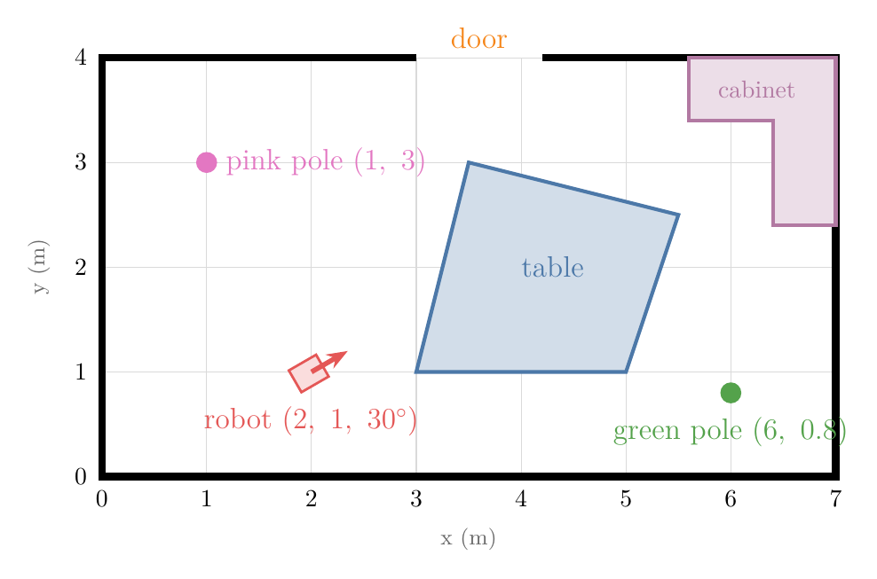
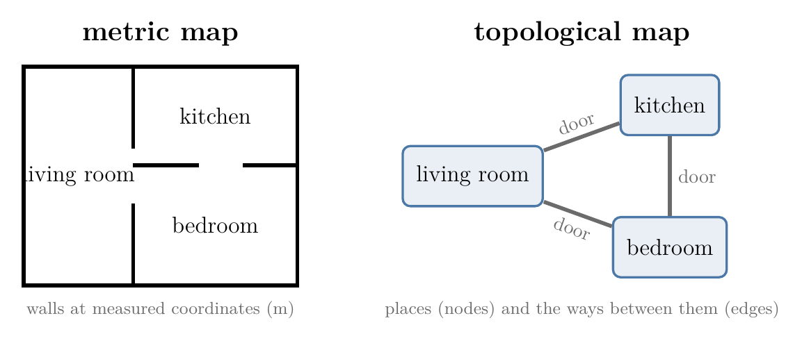
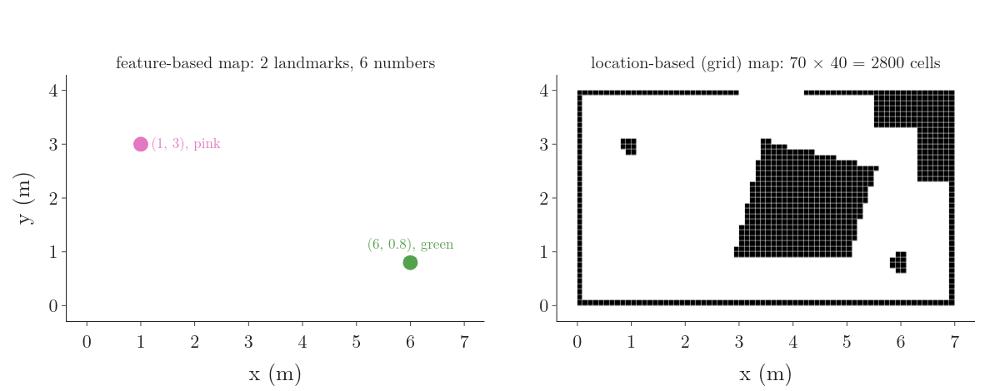
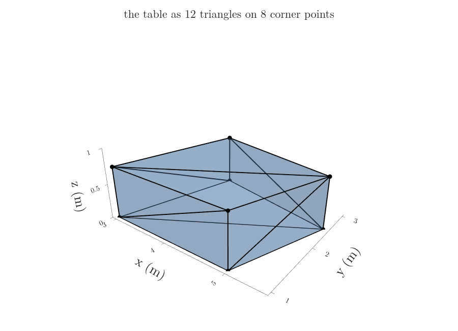
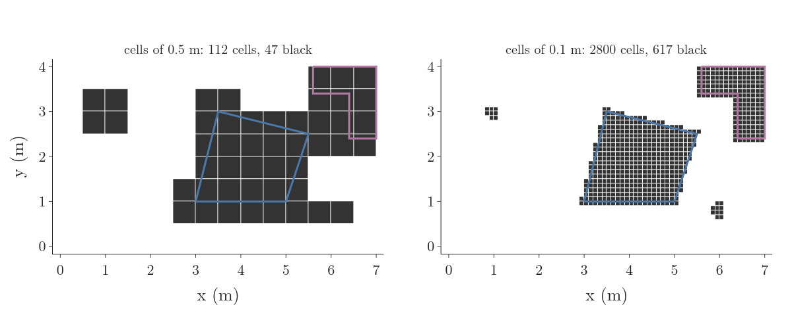
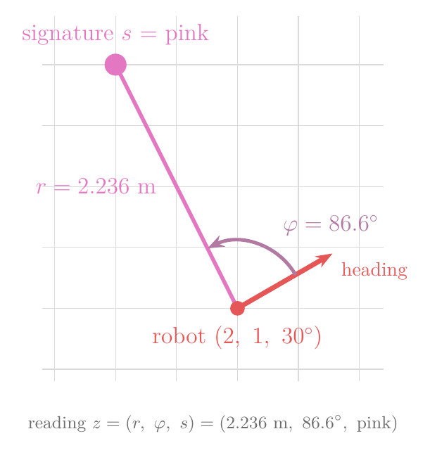

## 1. Overview

> **Key point:** A robot finds where it is by comparing what it senses with a map. A map can list a few landmarks or mark every cell as free or occupied; obstacles can be stored exactly as polygons built from half-planes, as triangles, or as a grid of cells; and landmarks are pulled out of raw sensor data as range, bearing and signature.

A robot [compares each reading with a map](../RO-007-why-a-robot-is-never-sure/RO-007-why-a-robot-is-never-sure.md#31-why-one-reading-fits-many-places): "door" fits only the places where the map has a door. Readings mean nothing without that map. This Note is about the map itself, for the room of Figure 1:

- what a map is, and the main families of maps: metric and topological, feature-based and grid (Sections 2 and 3);
- how to store an obstacle exactly, as a polygon made of half-planes, and test whether a point is inside it (Section 4);
- two other common models, triangle meshes and bitmaps, and what each costs (Section 5);
- how a robot pulls landmarks out of a laser scan and describes each by its range, bearing and signature (Section 6).

## 2. Why a robot needs a map

> **Key point:** A map is the robot's model of its surroundings: a list of the objects that matter, with where they are. Localization compares readings with it, and planning searches it for routes.

### 2.1 What a map is for

A reading such as "a wall 1 m ahead" or "a pole 2.2 m away, to the left" says where things are relative to the robot. To turn it into "where am I?", the robot needs to know where those things are in the room. That is what a map gives: the robot compares what it sees with the map and keeps the poses where the two agree. Planning needs the map too: a route to the door must go round the table.

A **map** (G-2331) is a list of the objects in the environment that matter to the robot, with their positions and properties (Thrun et al. 2005 §6.2). We write it as a list:

$$m = \lbrace m_1,\ m_2,\ \dots,\ m_N \rbrace$$

Each $m_i$ is one object, such as the pink pole at (1 m, 3 m). Fixed things, such as walls and furniture, belong in the map; things that move, such as people, belong in the robot's [state](../RO-007-why-a-robot-is-never-sure/RO-007-why-a-robot-is-never-sure.md#41-state-from-one-number-to-many) (G-2314) instead.

### 2.2 Metric and topological maps

There are two broad ways to describe a building, shown in Figure 2:

- A **metric map** (G-2332) gives every object at its coordinates in metres, so distances on the map are real distances. A city street map and our room of Figure 1 are metric maps.
- A **topological map** (G-2333) lists places, such as rooms, and which places connect to which: a graph of nodes and edges. A metro map is one: it shows which stations connect, not how far apart they are.

A topological map is small and fits route-finding between rooms. It needs places that the robot can recognise, so it fails in large open spaces such as a desert or a car park, where there are no rooms to split the space into. Localization needs positions in metres, so this chapter uses metric maps.

## 3. Feature-based and grid maps

> **Key point:** A feature-based map lists only landmarks and where they are; a grid map gives every cell of space a value, free or occupied. The first is tiny but says nothing about free space; the second is large but answers "can the robot be here?" at once.

Metric maps come in two kinds (Thrun et al. 2005 §6.2). Figure 3 draws our room both ways.

A **feature-based map** (G-2334) is a list of landmarks, each with its coordinates and a label that tells landmarks apart. Our room needs two entries:

$$m = \lbrace(1,\ 3,\ \text{pink}),\ (6,\ 0.8,\ \text{green}) \rbrace$$

That is 6 numbers for the whole room (Brown CS148 tutorial). It is cheap to store and to search, but it says nothing about the rest of the room: from it the robot cannot tell that the table is there.

A **location-based map** (G-2335), or grid map, splits space into small cells and stores a value for each: occupied or free. With cells of 0.1 m our room takes:

$$\frac{7}{0.1} \times \frac{4}{0.1} = 70 \times 40$$

$$= 2800 \text{ cells}$$

It is called location-based, or volumetric, because it has an entry for every location, free space included. That is what lets it answer "is this pose free?", the test that the [map-consistent motion model](../RO-008-probabilistic-motion-models/RO-008-probabilistic-motion-models.md#7-ruling-out-poses-inside-walls) (G-2329) uses to keep poses out of walls.

| | Feature-based map | Grid map |
|---|---|---|
| Stores | landmarks: position and label | every cell: occupied or free |
| Our room | 6 numbers | 2800 cells |
| Free space | unknown | known |
| Matches | landmark readings | full scans |
| Weak point | needs landmarks to exist and be found | memory grows with area and fineness |

Grid maps are the most common map in robotics today (Correll §4.1). Cells need not all be the same size: a quadtree splits a cell into four only where it contains an obstacle edge, so large free areas take few cells (Correll §4.1).

## 4. Obstacles as polygons made of half-planes

> **Key point:** A line splits the floor into two half-planes, told apart by the sign of one formula. A convex obstacle is the overlap of a few half-planes, so a point is inside exactly when every formula is at most 0; any other obstacle is a union of convex pieces.

### 4.1 Why store obstacles exactly

A grid blurs every edge to the nearest cell. Collision checks in route planning often need the exact shape: does the robot's path clip the table's corner or not? The table in Figure 1 is a four-sided polygon, given by its corners in counter-clockwise order (LaValle §3.1.1):

$$(3,\ 1),\ (5,\ 1),\ (5.5,\ 2.5),\ (3.5,\ 3)$$

The list draws the table's outline, but it does not answer the question a planner asks a million times: is the point (4, 2) inside the table? Half-planes answer it with a few multiplications.

### 4.2 Half-plane: one side of a line

Every edge of the table lies on a line, which we can write in the [general form of a line](../../../../MA/05-linear-algebra/MA-051-equation-of-a-hyperplane/MA-051-equation-of-a-hyperplane.md#31-the-general-form-of-a-line):

$$f(x, y) = a x + b y + c = 0$$

The function $f$ is 0 on the line, negative on one side and positive on the other. The vector $(a, b)$ is the line's [normal vector](../../../../MA/05-linear-algebra/MA-051-equation-of-a-hyperplane/MA-051-equation-of-a-hyperplane.md#61-the-argument) (G-1346) and points towards the positive side. All the points on one side of a line, together with the line, form a **half-plane** (G-2336) (LaValle §3.1.1):

$$H = \lbrace(x, y) : f(x, y) \le 0 \rbrace$$

**Worked example: the right edge of the table.** It runs from (5, 1) to (5.5, 2.5), so its direction is (0.5, 1.5). The corners run counter-clockwise, so the table always lies on the left of each edge as we walk along it. Turning the direction a quarter turn clockwise therefore gives a normal that points to the right of the edge, out of the table:

$$(a, b) = (1.5,\ -0.5)$$

The line passes through (5, 1), where $f$ must be 0:

$$1.5 \times 5 - 0.5 \times 1 + c = 0$$

$$c = -7$$

Doubling every number gives whole numbers and the same line, with the same signs:

$$f_2(x, y) = 3x - y - 14$$

Checks: at the other corner (5.5, 2.5), $f_2$ is 0, so the line goes through both corners; at the point (6, 1), outside the table, $f_2$ is 3, positive as the outward normal promises.

### 4.3 A convex polygon is where every half-plane agrees

The table is a [convex set](../../../../MA/07-optimisation/MA-067-convex-sets-and-functions/MA-067-convex-sets-and-functions.md#21-walking-along-the-segment) (G-479): the segment between any two of its points stays inside it. A convex polygon is the overlap, the [intersection](../../../../MA/07-optimisation/MA-067-convex-sets-and-functions/MA-067-convex-sets-and-functions.md#22-combining-convex-sets) (G-967), of one half-plane per edge, each taking the side that holds the polygon (LaValle §3.1.1). Our table's four edge functions, each scaled to whole numbers and signed so that the inside is negative:

$$f_1 = 1 - y$$

$$f_2 = 3x - y - 14$$

$$f_3 = 2x + 8y - 31$$

$$f_4 = 11 - 4x + y$$

Figure 4 adds the four half-planes one at a time; what is left inside all of them is the table.

**Inside test.** A point is inside the table when all four values are at most 0. For the point (4, 2):

$$f_1 = 1 - 2 = -1$$

$$f_2 = 12 - 2 - 14 = -4$$

$$f_3 = 8 + 16 - 31 = -7$$

$$f_4 = 11 - 16 + 2 = -3$$

All four are negative: inside. For the point (5.5, 1.5):

$$f_2 = 16.5 - 1.5 - 14 = 1$$

One positive value is enough: outside, on the far side of the right edge. In logic, the table's test joins the four conditions with AND (LaValle §3.1.1): $f_1 \le 0$ AND $f_2 \le 0$, and so on for all four edges. Each half-plane is one simple shape that more complex shapes are built from, a **geometric primitive** (G-2337) (LaValle §3.1.1).

### 4.4 Non-convex obstacles are unions of convex pieces

The cabinet is L-shaped, so it is not convex: the segment between a point in one arm and a point in the other leaves the cabinet (Figure 5). No set of half-planes taken together with AND can describe it, because their overlap is always convex. Instead we cut it into convex pieces, two rectangles, and take their [union](../../../../MA/07-optimisation/MA-067-convex-sets-and-functions/MA-067-convex-sets-and-functions.md#22-combining-convex-sets) (G-2045) (LaValle §3.1.1):

$$R_1:\ 5.6 \le x \le 7,\ \ 3.4 \le y \le 4$$

$$R_2:\ 6.4 \le x \le 7,\ \ 2.4 \le y \le 4$$

$$\text{cabinet} = R_1 \cup R_2$$

A point is in the cabinet if it is in $R_1$ OR in $R_2$. The point (6.2, 3.0), in the notch of the L, fails both:

- in $R_1$? No: $y = 3.0$ is below 3.4;
- in $R_2$? No: $x = 6.2$ is left of 6.4.

So it is free. Every obstacle made of straight edges can be written this way, as a union of intersections of half-planes; the pieces may overlap, as $R_1$ and $R_2$ do in the corner (LaValle §3.1.1).

> **Extra:** Replacing the straight lines by curves, such as a circle $x^2 + y^2 - 1 \le 0$, gives primitives for round obstacles. Unions and intersections of such polynomial primitives are called semi-algebraic sets; they describe smooth shapes exactly, at the price of harder computations (LaValle §3.1.2).

## 5. Triangle meshes and bitmaps

> **Key point:** In 3D, obstacles are often stored as many triangles, which graphics hardware draws fast but which do not say what is inside. A bitmap marks every cell that touches an obstacle; it is simple and fits sensor data, but finer cells cost many more cells.

### 5.1 Triangle meshes

Real objects are 3D, and the common 3D model is a set of triangles, each given by its three corner points in space. A set of triangles that together cover an object's surface is a **triangle mesh** (G-2338) (LaValle §3.1.3). Figure 6 builds our table, 0.75 m high, from 8 corner points and 12 triangles: 2 for the top, 2 for the bottom and 2 for each of the 4 sides.

Triangles are popular because graphics hardware is built to draw them (LaValle §3.1.3). Neighbouring triangles share corners, so meshes often store each corner once and list triangles by corner numbers, as the table's 12 triangles share 8 corners. The drawback: a mesh is only a surface. Nothing in a loose set of triangles says which side is inside, and meshes made from scans or design files often have holes, so a planner cannot always tell whether a point is inside an object (LaValle §3.1.3).

### 5.2 Bitmaps and occupancy grids

The simplest model of all splits the room into square cells and marks each one: 1 if the cell contains any point of an obstacle, 0 if it does not. This is a **bitmap** (G-2339) of the obstacles, the same thing as the black-and-white image of Figure 7 (LaValle §3.1.3).

To read Figure 7: each small square is one cell, black for 1 (some obstacle inside) and white for 0; the coloured outlines are the exact polygons of Section 4. The cell size sets the trade-off. Black area overstates the obstacles, because a cell turns black when an obstacle covers any part of it. The table, cabinet and poles really cover 5.13 m²:

| Cell size | Cells | Black cells | Black area |
|---|---|---|---|
| 0.5 m | 112 | 47 | 11.75 m² |
| 0.1 m | 2800 | 617 | 6.17 m² |

Cells five times smaller bring the black area close to the truth but need 25 times as many cells. Bitmaps arise naturally when a robot builds a map with its own sensors (LaValle §3.1.3). Storing a number between 0 and 1 in each cell instead of 0 or 1, such as the probability that the cell is occupied, gives an **occupancy grid** (G-2340), the standard grid map of robotics (LaValle §3.1.3).

## 6. Landmarks and feature extraction

> **Key point:** A scan of 360 distances is mostly wall. Feature extraction finds the few objects in it that are easy to spot and tell apart, the landmarks, and reports each as a range, a bearing and a signature.

### 6.1 Why extract features

A laser scanner on our robot measures 360 distances, one per degree. Comparing all 360 with a map is possible (the range-sensor Notes later in this chapter do it), but most of the numbers describe plain wall, which looks the same all along the room. A few distinctive objects carry most of the information about where the robot is. Pulling such objects out of raw sensor data, so that a scan of hundreds of numbers becomes a short list of objects, is **feature extraction** (G-2341) (Thrun et al. 2005 §6.6, as in the Freiburg sensor-model slides).

An object makes a good **landmark** (G-2342) when two things hold:

1. the robot can **detect** it reliably, such as a pole that stands out in a laser scan or a coloured marker in a camera image;
2. the robot can **tell it apart** from the other landmarks: tree 1 from tree 2, the pink pole from the green one.

Landmarks can be natural objects (trees, doors, road signs) or artificial ones put there for the robot (coloured markers, reflectors). Some are passive, only seen; others are active and send a signal, such as a radio beacon (Freiburg sensor-model slides).

### 6.2 Finding the poles in a scan

Figure 8 shows a simulated scan from our robot at (2, 1) facing 30°: 360 beams, one per degree, each with 1 cm of range noise. The grey dots are where the beams hit: walls, the near side of the table, and two small clusters.

A pole shows up as a few neighbouring beams that are much shorter than the beams on both sides, which pass it and hit the wall behind. So the extraction rule, applied to the scan in order, is:

1. cut the scan wherever the range jumps by more than 0.3 m between neighbouring beams;
2. keep a piece that is narrower than 0.35 m and nearer than the beams on both sides of it;
3. report its direction as the average direction of its beams, and its distance as its nearest range plus the pole's radius of 0.1 m, so that the distance is to the pole's centre.

The rule finds exactly the two poles:

| Pole | Beams | Extracted range | True range | Extracted bearing | True bearing |
|---|---|---|---|---|---|
| pink | 5 | 2.232 m | 2.236 m | 87.0° | 86.6° |
| green | 3 | 4.004 m | 4.005 m | −33.0° | −32.9° |

The extracted bearings are off by less than half a degree, because the beams are one degree apart. The table's corners pass step 2 only if they are narrow and stand in front of something farther away, which they do not here; real extractors add more tests for such cases.

### 6.3 Range, bearing and signature

Each extracted landmark is reported as three numbers (Thrun et al. 2005 §6.6, as in the Brown CS148 tutorial), shown in Figure 9:

- its **range** (G-2343) $r$: the distance from the robot to the landmark;
- its **bearing** (G-2344) $\varphi$: the angle from the robot's heading to the landmark, positive to the left, negative to the right;
- its **signature** (G-2345) $s$: what kind of landmark it is, such as its colour or an ID number.

For the pink pole, the true values follow from the map. The pole is 1 m back in $x$ and 2 m up in $y$ from the robot:

$$r = \sqrt{1^2 + 2^2} = 2.236 \text{ m}$$

Its direction in the room is [atan2](../RO-008-probabilistic-motion-models/RO-008-probabilistic-motion-models.md#42-turn-drive-turn) (G-2325) of the rise and the run:

$$\text{atan2}(2,\ -1) = 116.6^\circ$$

The bearing is measured from the heading, 30°:

$$\varphi = 116.6^\circ - 30^\circ = 86.6^\circ$$

So the reading is:

$$z = (2.236 \text{ m},\ 86.6^\circ,\ \text{pink})$$

Why each of the three numbers is needed:

- **Range and bearing** fix where the landmark is relative to the robot. Range alone puts it anywhere on a circle around the robot; bearing alone, anywhere along a ray from it.
- **The signature** says which landmark of the map the reading belongs to. Without it, two identical poles would leave the robot with two explanations of every reading, like the three identical doors of the [hallway](../RO-007-why-a-robot-is-never-sure/RO-007-why-a-robot-is-never-sure.md#31-why-one-reading-fits-many-places); with it, the reading "pink" can only be the pole at (1, 3).

### 6.4 From a reading to the map, and back

If the robot knows its pose, a reading tells it where the landmark is in the room. It goes the distance $r$ in the direction heading plus bearing:

$$x_m = x + r\cos(\theta + \varphi)$$

$$y_m = y + r\sin(\theta + \varphi)$$

For the extracted pink pole, the direction is:

$$\theta + \varphi = 30^\circ + 87.0^\circ = 117.0^\circ$$

so:

$$x_m = 2 + 2.232 \times (-0.454) = 0.99$$

$$y_m = 1 + 2.232 \times 0.891 = 2.99$$

within 1 cm of the true pole at (1, 3). Repeating this from many known poses and averaging is how feature-based maps are built.

The other direction is localization: the map is known and the pose is not. Then a single landmark reading cannot fix the pose; with the range alone it only says the robot stands somewhere on a circle of radius $r$ around the landmark, and two or three landmarks together pin it down. The [landmark measurement model](../RO-012-landmark-measurement-model/RO-012-landmark-measurement-model.md#5-where-can-the-robot-be) builds that step.

## 7. Summary

| Model | Stores | Inside test | Strength | Weakness |
|---|---|---|---|---|
| Feature-based map | landmarks: position, signature | none | tiny (6 numbers here) | no free space |
| Grid map | a value per cell | read the cell | free space known; fits scans | size grows with area and fineness |
| Polygons from half-planes | edge functions | all $f_i \le 0$ in some convex piece | exact straight edges | curved shapes need many edges |
| Triangle mesh | 3D triangles | not defined by the mesh | fast to draw in 3D | inside and outside unclear |
| Bitmap / occupancy grid | 0 or 1 (or a probability) per cell | read the cell | simple; built from sensors | overstates obstacles; finer costs more |

- A map is the robot's list of the objects that matter, because readings say where things are relative to the robot and only a map turns them into a pose.
- Metric maps give coordinates and topological maps give connections; localization needs metric maps, because it works in metres.
- A feature-based map stores 6 numbers for our room and a 0.1 m grid 2800 cells; the grid costs more but knows where free space is, which the map-consistent motion model needs.
- A half-plane is one sign test, $f(x, y) \le 0$; a convex obstacle is where all its edge tests pass, so the table's inside test is four multiplications and sums (−1, −4, −7, −3 for (4, 2)).
- Non-convex obstacles are unions of convex pieces, because the overlap of half-planes is always convex; the cabinet's notch point (6.2, 3.0) fails both rectangles and is free.
- Triangle meshes suit 3D graphics but do not define an inside; bitmaps are simple, but 0.5 m cells inflate the obstacles from 5.13 m² to 11.75 m², and 0.1 m cells cost 25 times as many cells.
- Feature extraction turns 360 scan distances into two landmarks, because a few distinctive objects carry most of the information about the pose; each landmark is reported as range, bearing and signature, and the signature says which map landmark it is.

So the opening question, what the robot compares its readings with, has its answer: a map of landmarks or of cells, with obstacles stored as half-planes, triangles or bitmaps, and readings reduced to landmarks that can be matched against it.

## 8. Sources

**Built from**

- Oleg Shipitko, "Lecture 5. Mapping", YouTube, 1:06–23:00, https://www.youtube.com/watch?v=2_xO_hIT8qw (Shipitko, Mapping)
- Steven M. LaValle, "Motion Planning: Life in C-Space" (ICRA tutorial), YouTube, 3:35–8:16, https://www.youtube.com/watch?v=ERaZJru80bM (LaValle, Life in C-space)
- Cyrill Stachniss, "Observation Models", YouTube, 32:42–36:17, https://www.youtube.com/watch?v=SfwxLpdFB-o (Stachniss, Observation models)
- Carlotta A. Berry, "Advanced Mobile Robotics: Lecture 4-1a", YouTube, 4:07–5:38, https://www.youtube.com/watch?v=zNanMwnBT5w (Berry, Lecture 4-1a)
- LaValle, S. M. (2006). *Planning Algorithms*. Cambridge University Press. §3.1.1 polygonal models (convex polygons as intersections of half-planes, non-convex polygons as unions, the logical predicate), §3.1.2 semi-algebraic models, §3.1.3 other models (3D triangles, bitmaps, occupancy grids). Free online: https://lavalle.pl/planning/node78.html (LaValle)
- Schwertfeger, S. (2007). "Tutorial on a Probabilistic Measurement Model based on Landmark Range and Bearing Information", Brown University CS148. https://cs.brown.edu/courses/cs148/tutorials/measurement_model_tutorial.pdf (Brown CS148 tutorial)

**Other references**

- Correll, N. et al. *Introduction to Autonomous Robots*, §4.1 "Map Representations". Free online: https://eng.libretexts.org/Bookshelves/Mechanical_Engineering/Introduction_to_Autonomous_Robots_(Correll)/04%3A_Path_Planning/4.01%3A_Map_Representations (Correll §4.1)
- Burgard, W. et al. (2023). "Probabilistic Sensor Models", *Introduction to Mobile Robotics* slides, University of Freiburg (features and landmarks). http://ais.informatik.uni-freiburg.de/teaching/ss23/robotics/slides/07-sensor-models.pdf (Freiburg sensor-model slides)
- Thrun, S., Burgard, W. and Fox, D. (2005). *Probabilistic Robotics*. MIT Press. §6.2 maps, §6.6 feature-based measurement models (range, bearing, signature). Cited only where the free sources above confirm it.

## 9. Key terms

Terms taught in this Note come first; linked terms are recaps, taught in the Note the link opens.

| Term | Meaning |
|---|---|
| Map (G-2331) | A robot's list of the objects in its surroundings that matter, with their positions and properties, such as the pink pole at (1, 3); readings only give positions relative to the robot, and the map turns them into a pose. |
| Metric map (G-2332) | A map that gives every object at its coordinates in metres, so distances on the map are real distances; localization needs it because it works out the pose in metres. |
| Topological map (G-2333) | A map that lists places, such as rooms, and which places connect, as a graph of nodes and edges (like a metro map); small and good for routes between rooms, but it fails in open spaces with no recognisable places. |
| Feature-based map (G-2334) | A map that stores only landmarks, each with its coordinates and signature, such as (1, 3, pink); very compact, but it says nothing about which space is free. |
| Location-based map (grid map) (G-2335) | A map that splits space into cells and stores a value for every cell, occupied or free, free space included (2800 cells for a 7 m by 4 m room at 0.1 m); larger, but it answers at once whether a pose is free. |
| Half-plane (G-2336) | All points on one side of a line, together with the line: the points where $a x + b y + c \le 0$; one sign test, used as a building block for polygon obstacles. |
| Geometric primitive (G-2337) | A simple shape that is easy to store and test, such as a half-plane, from which complex obstacles are built by intersections and unions. |
| Triangle mesh (G-2338) | A set of triangles, each given by three corner points in space, that together cover an object's surface (a table as 12 triangles on 8 corners); fast to draw in 3D, but it does not say what is inside. |
| Bitmap (obstacle bitmap) (G-2339) | A grid of cells marked 1 if the cell contains any obstacle point and 0 otherwise, like a black-and-white image; simple and natural for sensor data, but it overstates obstacles, and finer cells cost many more cells. |
| Occupancy grid (G-2340) | A grid map that stores in each cell a number between 0 and 1, such as the probability that the cell is occupied, instead of a hard 0 or 1; the standard grid map of robotics, since sensors are never sure. |
| Feature extraction (from sensor data) (G-2341) | Pulling a few distinctive objects out of raw sensor data, such as two poles out of a 360-beam laser scan; it shrinks hundreds of numbers to a short list that is easy to match with a map. |
| Landmark (G-2342) | An object the robot can detect reliably and tell apart from the others, such as a coloured pole or a door; its known position in the map lets readings of it fix the robot's pose. |
| Range (of a landmark reading) (G-2343) | The distance from the robot to a sensed landmark, such as 2.236 m; together with the bearing it fixes where the landmark is relative to the robot. |
| Bearing (G-2344) | The angle from the robot's heading to a sensed landmark, positive to the left, such as 86.6 degrees; together with the range it fixes where the landmark is relative to the robot. |
| Signature (of a landmark) (G-2345) | A label that says what kind of landmark was sensed, such as its colour or ID number; it tells the robot which landmark in the map a reading belongs to. |
| [State $x_t$](../../../../RO/localization/02-bayes-filters/RO-007-why-a-robot-is-never-sure/RO-007-why-a-robot-is-never-sure.md#41-state-from-one-number-to-many) (G-2314) | The quantities a robot keeps track of at time $t$ because they decide what happens next, such as its pose, its speeds and moving things around it; it is what localization and filtering estimate. |
| [Map-consistent motion model](../../../../RO/localization/02-bayes-filters/RO-008-probabilistic-motion-models/RO-008-probabilistic-motion-models.md#7-ruling-out-poses-inside-walls) (G-2329) | A motion model that also uses the map, approximated for small steps by multiplying the plain motion model by 1 for free poses and 0 for poses inside obstacles; it stops the robot's estimate from passing through walls. |
| [Normal vector](../../../../MA/05-linear-algebra/MA-051-equation-of-a-hyperplane/MA-051-equation-of-a-hyperplane.md#61-the-argument) (G-1346) | A vector perpendicular to a line, plane or hyperplane; for $w^{\mathsf T}x + w_0 = 0$ it is $w$. |
| [Convex set](../../../../MA/07-optimisation/MA-067-convex-sets-and-functions/MA-067-convex-sets-and-functions.md#21-walking-along-the-segment) (G-479) | A set that contains the whole segment between any two of its points. |
| [Intersection (A ∩ B)](../../../../MA/02-probability/MA-015-conditional-probability/MA-015-conditional-probability.md#2-the-definition) (G-967) | The set of elements that are in both A and B, such as the points inside both of two half-planes; for events, the event that both A and B happen. |
| [Union (A ∪ B)](../../../../MA/02-probability/MA-017-mutually-exclusive-events/MA-017-mutually-exclusive-events.md#5-the-addition-rule-where-mutual-exclusivity-pays-off) (G-2045) | The set of elements in A or B (or both), such as the points inside either of two convex pieces of an obstacle; for events, the event that A or B (or both) happens. |
| [atan2](../../../../RO/localization/02-bayes-filters/RO-008-probabilistic-motion-models/RO-008-probabilistic-motion-models.md#42-turn-drive-turn) (G-2325) | A function atan2(rise, run) that returns the direction of a line over the full circle from its rise and run given separately; needed because the plain inverse tangent of the ratio cannot tell opposite directions apart. |
