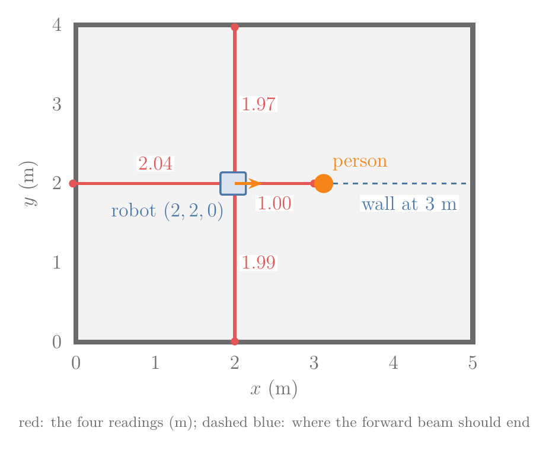
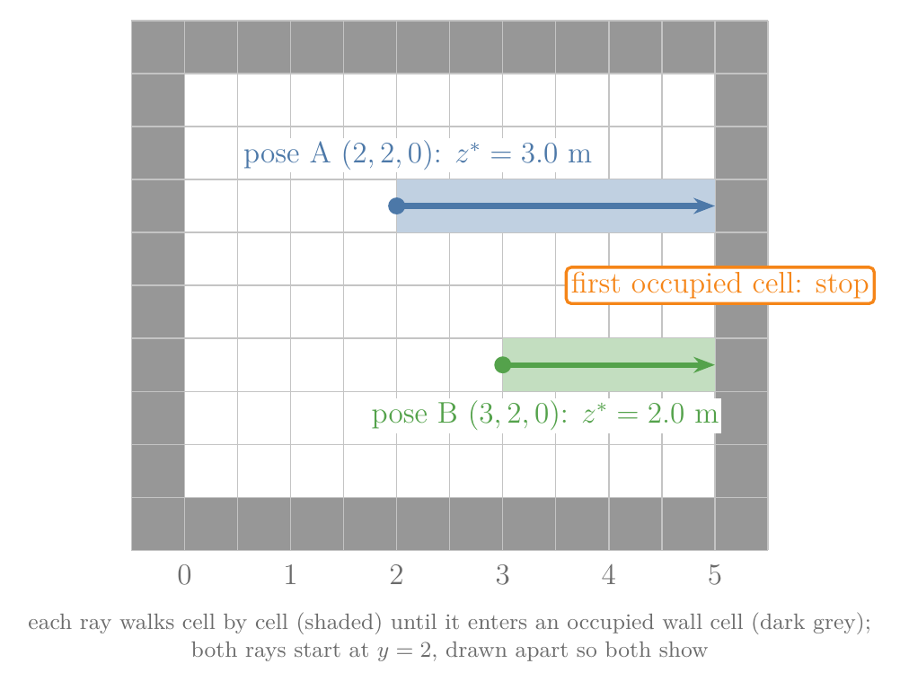
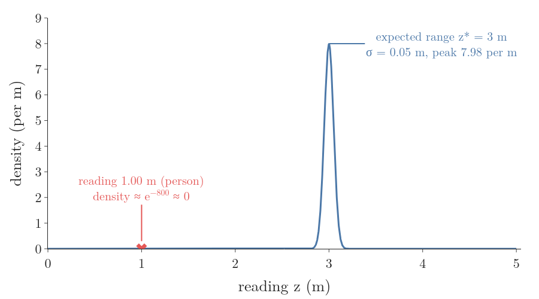
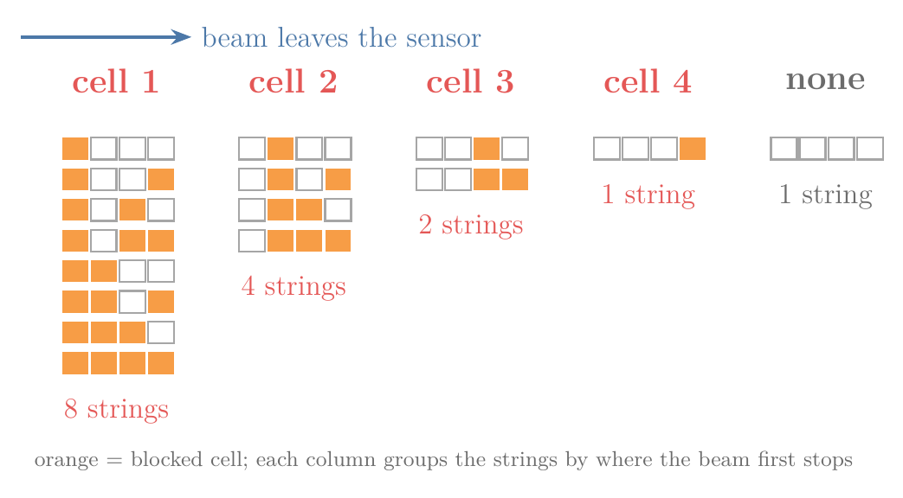
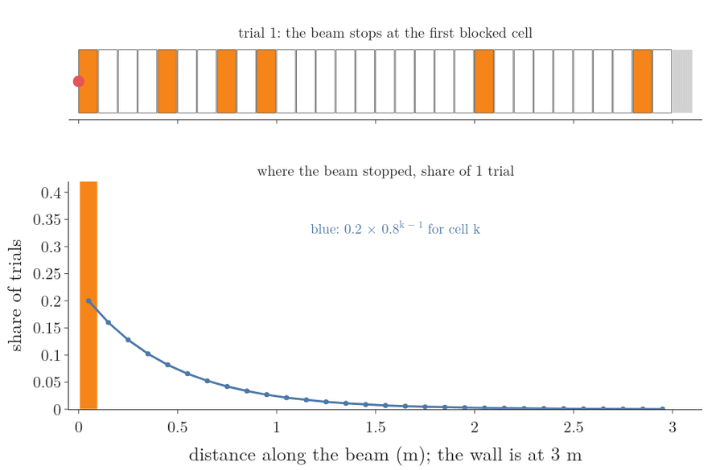
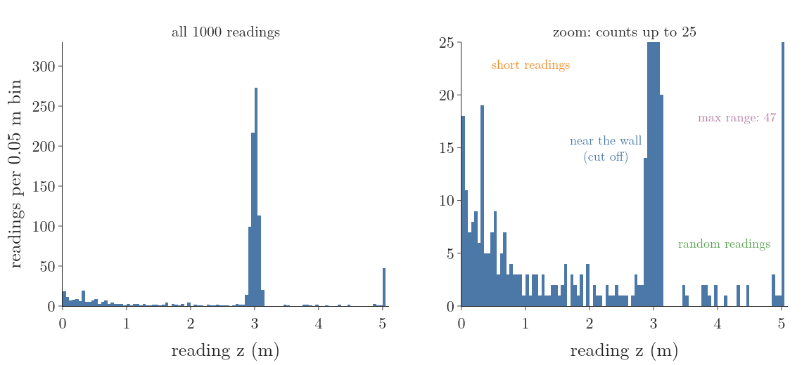

## 1. Overview

> **Key point:** A robot judges a guess about its pose by asking how likely its laser readings would be from there. The beam model gives that number for one reading as a mix of four causes, so that a person walking past does not make the right pose look impossible.



A robot with a map does not know where it is on that map. It can only guess poses and test each guess against what its sensors report. Figure 1 shows the test case of this Note. The robot stands at pose (2, 2, 0) in a 5 m by 4 m room; its laser measures the distance to the nearest surface in four directions. A person stands 1 m in front of it, so the forward beam reads 1.00 m, although the map says the wall is 3 m away.

A sensor reading is a [measurement](../RO-007-why-a-robot-is-never-sure/RO-007-why-a-robot-is-never-sure.md#51-measurements-and-controls) (G-2317): what the sensors report about the world at one moment. To test a guessed pose we need a rule that answers one question: how likely are these four readings if the robot stood at that pose? This Note builds the standard rule for range sensors:

- what a range sensor reports, and why the question above is the one to ask (Section 2);
- why a bell curve around the expected distance is not enough (Section 3);
- the four causes of a reading and the shape each one gives, with the reason for every shape (Section 4);
- how the four shapes combine into one model, and what the model says about Figure 1 (Section 5);
- how to learn the model's numbers from recorded readings, by maximum likelihood and the EM algorithm (Section 6);
- the other kinds of sensor models a robot uses (Section 7).

The map is a [grid map](../RO-009-maps-and-landmarks/RO-009-maps-and-landmarks.md#3-feature-based-and-grid-maps): the room split into small cells, each marked free or occupied.

## 2. What a range sensor measures

> **Key point:** A range sensor reports, for each direction, the distance to the first surface the beam meets. A measurement model scores a guessed pose by how likely those distances are from there.

### 2.1 Range finders and scans

A **range finder** (G-2371) measures the distance to the nearest surface in one direction. A laser range finder, or [LiDAR](../../../../DL/01-basics/DL-003-nn-types-history-applications/DL-003-nn-types-history-applications.md#41-mainstream-applications) (G-1083), sends a short pulse of light and times its return. The pulse travels to the surface and back, so the time of flight multiplied by the speed of light is twice the distance; halved, it is the distance. A sonar does the same with a sound pulse (LaValle §11.5.1).

A scanning laser turns, so one sweep gives many readings, for example one every half degree. The list of readings from one sweep is a **range scan** (G-2372). We write it as:

$$z = (z^1, z^2, \dots, z^K)$$

Here $z^k$ is the reading of beam $k$, in metres, and $K$ is the number of beams. Figure 1 has $K = 4$ beams, at 0°, 90°, 180° and 270° from the robot's heading:

$$z = (1.00,\ 1.97,\ 2.04,\ 1.99)$$

Every sensor has a longest distance it can report. When no surface returns the pulse in time, the sensor reports that longest distance itself. This is the **maximum range** (G-2373) $z_{\max}$; our laser has:

$$z_{\max} = 5 \text{ m}$$

### 2.2 Why we need a measurement model

Suppose the robot is unsure whether it is at pose A, (2, 2, 0), or at pose B, (3, 2, 0): one metre further along the room. To decide, it compares its readings with what each pose would predict. The map predicts, for each pose and each beam, the distance the beam should travel before it meets a wall: the **expected range** (G-2375), written $z^{\ast}$.

We find it by **ray casting** (G-2376): start at the robot, walk along the beam's direction in small steps, and stop at the first occupied cell of the grid map (Figure 2). The distance walked is $z^{\ast}$. For the forward beam:

$$z_{A}^{\ast} = 3.0 \text{ m}$$

$$z_{B}^{\ast} = 2.0 \text{ m}$$



The reading was 1.00 m, which matches neither 3.0 nor 2.0. We need a number for "how well does a reading of 1.00 m fit an expected range of 3.0 m?", one that tolerates small sensor errors and the odd surprise. That number is the **measurement model** (G-2374), also called the sensor model or observation model (Thrun §6.1):

$$p(z \mid x, m)$$

In words: the density of getting the readings $z$, given that the robot is at pose $x$ and the world looks like map $m$. The pose $x$ is the [pose](../../../control/01-robot-models/RO-001-pose-and-differential-drive/RO-001-pose-and-differential-drive.md#22-why-position-is-not-enough-the-heading) (G-2280) of a floor robot, position and heading:

$$x = (x,\ y,\ \theta)$$

For a fixed set of readings, $p(z \mid x, m)$ read as a function of the pose is the [likelihood](../../../../MA/08-likelihood/MA-069-probability-vs-likelihood/MA-069-probability-vs-likelihood.md#22-likelihood-from-the-event-back-to-the-parameter) (G-1086) of that pose: the poses under which the readings are more likely score higher. That is how a localization filter uses it; the [Bayes filter](../RO-014-bayes-filter/RO-014-bayes-filter.md#43-the-correction-step) multiplies its belief by this likelihood in its correction step.

A range reading is a continuous quantity, so $p(z \mid x, m)$ is a [probability density](../../../../MA/03-distributions/MA-022-pdf-and-continuous-cdf/MA-022-pdf-and-continuous-cdf.md#5-what-the-density-at-a-point-means) (G-1569), measured per metre, not a probability. A density can be larger than 1; only areas under it are probabilities.

### 2.3 Why a whole scan is a product of beams

A scan has many beams, and writing one density for all of them at once is hard. We split it into one density per beam and multiply:

$$p(z \mid x, m) = \prod_{k=1}^{K} p(z^k \mid x, m)$$

The product sign $\prod$ means "multiply the terms for $k = 1$ to $K$". Multiplying is allowed when the beams are independent: knowing one beam's error tells us nothing about another's. That is not true in general, but it is close to true once the pose and the map are known (Thrun §6.3.1):

- **Without a map**, beams are linked: if one beam hits something at 2 m, the beam half a degree away probably hits the same object at about 2 m.
- **With the map and the pose given**, that shared object is already in the map, so each beam's remaining error is its own sensor noise, and the beams are close to independent.

Independence that holds only once a third thing is known is [conditional independence](../../../../ML/07-classification/ML-082-naive-bayes-maths/ML-082-naive-bayes-maths.md#5-step-3-the-naive-assumption) (G-443), the same assumption Naive Bayes makes for features given the class.

> **Extra:** The assumption is not exact. A person blocks several neighbouring beams at once, and their errors are then linked. The product then counts that one person several times, which makes the model overconfident (Freiburg sensor-model slides, "Summary beam-based model"). Implementations therefore use only a subset of the beams of each scan: the ROS localization package AMCL uses 30 evenly spaced beams per scan by default (ROS amcl, `laser_max_beams`).

## 3. Why a bell curve alone fails

> **Key point:** A narrow Gaussian around the expected range gives a reading caused by a passer-by a density of practically zero, and the product then rejects the true pose outright.

The first model that comes to mind: the reading should be the expected range plus a small sensor error, and small errors follow a [Gaussian distribution](../../../../MA/03-distributions/MA-024-normal-distribution/MA-024-normal-distribution.md#2-what-the-normal-distribution-is) (G-827). With the spread of a good laser, $\sigma = 0.05$ m, the density of a reading $z$ is:

$$\mathcal{N}(z;\ z^{\ast}, \sigma^2) = \frac{1}{\sigma\sqrt{2\pi}}\ e^{-\frac{1}{2}\left(\frac{z - z^{\ast}}{\sigma}\right)^2}$$

Figure 3 draws it for the forward beam at the true pose A, where $z^{\ast} = 3$ m. Now put the person's reading, 1.00 m, into it. The distance from the expected range, in units of $\sigma$:

$$\frac{1.00 - 3.00}{0.05} = -40$$

The exponent:

$$-\tfrac{1}{2} \times 40^2 = -800$$

The factor in front of the exponential:

$$\frac{1}{0.05 \times \sqrt{2\pi}} = 7.98$$

The density:

$$7.98 \times e^{-800}$$

$$\approx 0$$

The number $e^{-800}$ is so small that a computer stores it as exactly 0 (the notebook checks).



Because the scan density is a product, one zero beam makes the whole scan density zero, whatever the other beams say. So the true pose A gets 0. The wrong pose B does worse on most beams but escapes the zero: its forward beam expects 2 m, and its backward beam expects 3 m but reads 2.04 m. Those two densities are tiny but not zero, and B ends up with a scan density of about $4 \times 10^{-164}$. A bell curve alone would prefer the wrong pose, only because a person stepped in front of the robot.

The cure is not a wider bell: that would make every reading near the wall less informative too. Instead we list the other ways a reading can come about, and give each its own shape.

## 4. The four causes of a reading

> **Key point:** A reading is a correct hit with small noise, a hit on something not in the map, a failure that reports the maximum range, or plain junk. Each cause has its own density shape, and each shape follows from how that cause works.

Figure 4 shows the four shapes for the forward beam at pose A ($z^{\ast} = 3$ m, $z_{\max} = 5$ m). They come from Thrun §6.3.1 and the Freiburg sensor-model slides; the reason for each shape follows below.


### 4.1 Measurement noise: a bell around the expected range

When the beam does reach the mapped wall, the reading still differs a little from $z^{\ast}$: limited resolution, temperature, the surface. This **measurement noise** (G-2378) is the Gaussian of Section 3, with one change. Readings below 0 or above $z_{\max}$ cannot occur, so the bell is cut to the range from 0 to $z_{\max}$ and scaled up so its area is 1 again:

$$p_{\text{hit}}(z) = \eta\ \mathcal{N}(z;\ z^{\ast}, \sigma_{\text{hit}}^2)$$

for $0 \le z \le z_{\max}$, and 0 outside. A bell cut to a range and rescaled is a [truncated normal](../../../../DL/02-training/DL-030-xavier-he-initialization/DL-030-xavier-he-initialization.md#62-with-keras-initialisers) (G-2023). The **normalizer** (G-2382) $\eta$ (eta) is one over the area of the bell that lies inside the range, so that the whole density again has area 1 (Thrun §6.3.1).

For our wall at 3 m, the bell lies far inside the range (40 $\sigma$ from 0 and from 5 m), so $\eta = 1.000$. It matters near the edge. If the wall were 4.98 m away, about a third of the bell would lie beyond 5 m:

$$\text{area inside} = 0.655$$

$$\eta = 1 / 0.655 = 1.53$$

**Worked example.** At pose A the forward beam expects 3 m. A reading of 3.02 m has the density:

$$\frac{3.02 - 3.00}{0.05} = 0.4$$

$$p_{\text{hit}}(3.02) = 7.98 \times e^{-0.08}$$

$$= 7.37 \text{ per m}$$

### 4.2 Unexpected objects: why the curve falls off, and why it stops

A person, a chair or an open door that is not in the map can block the beam first. The reading is then shorter than $z^{\ast}$. This is an **unexpected object** (G-2379), and its reading a short reading. Figure 4 shows its shape: high at 0, falling off, and zero after $z^{\ast}$. Both features have a reason.

**Why it stops at the expected range.** An object behind the wall cannot block the beam: the wall is hit first. So a short reading is always shorter than $z^{\ast}$, and the density is 0 beyond it.

**Why it falls off.** Only the first object along the beam matters; anything behind it is hidden. Cut the beam into 4 equal cells and let each cell be either blocked (1) or free (0), all 16 patterns equally likely. Figure 5 sorts the 16 patterns by the first blocked cell:

| First blocked cell | Patterns |
|---|---|
| 1 | 8 |
| 2 | 4 |
| 3 | 2 |
| 4 | 1 |
| none | 1 |



The first cell is blocked in 8 of the 16 patterns: more than the 1 + 2 + 4 = 7 patterns that first stop further out. The count halves with each cell, because each extra free cell in front is one more condition the pattern must meet.

The same holds for any blocking chance. Let each cell be blocked with probability $p$, independently. For the beam to stop at cell $k$, the $k - 1$ cells before it must be free and cell $k$ blocked:

$$P(\text{first stop at cell } k) = (1 - p)^{k - 1}\ p$$

Each further cell multiplies the chance by the same factor $1 - p$. With cells of 0.1 m and $p = 0.2$:

$$P(\text{cell } 1) = 0.2$$

$$P(\text{cell } 2) = 0.8 \times 0.2 = 0.16$$

$$P(\text{cell } 3) = 0.8^2 \times 0.2 = 0.128$$

Figure 6 runs this as an experiment: in each trial, cells of a 3 m beam are blocked at random, and we record where the beam stops. After 5000 trials the shares match the formula.



A curve that falls by the same factor at every step is exponential. Make the cells shorter, with length $\Delta$, and keep the blocking chance per metre fixed at $\lambda$, so that $p = \lambda\Delta$. The share per metre at 1 m, for $\lambda = 2$ per metre, approaches $\lambda e^{-\lambda z}$:

| Cell length $\Delta$ | Share per metre at 1 m |
|---|---|
| 0.1 m | 0.215 |
| 0.01 m | 0.265 |
| 0.001 m | 0.270 |
| limit: $2 e^{-2}$ | 0.271 |

So the short-reading density is an [exponential distribution](../../../../MA/08-likelihood/MA-071-mle-for-common-distributions/MA-071-mle-for-common-distributions.md#31-the-distribution-of-waiting-times) (G-733), cut at $z^{\ast}$. The exponential holds under the assumption made above: objects are spread evenly and block the beam with the same chance per metre at every distance (De Laet et al. 2008, §3.6). Its rate $\lambda_{\text{short}}$ is large in a crowded hall and small in an empty one:

$$p_{\text{short}}(z) = \eta\ \lambda_{\text{short}}\ e^{-\lambda_{\text{short}} z}$$

for $0 \le z \le z^{\ast}$, and 0 otherwise (Thrun §6.3.1).

**The normalizer.** The exponential's area from 0 to $z^{\ast}$ is:

$$\int_0^{z^{\ast}} \lambda e^{-\lambda z}\thinspace dz = 1 - e^{-\lambda z^{\ast}}$$

So $\eta$ is one over that area. With $\lambda_{\text{short}} = 2$ per metre and $z^{\ast} = 3$ m:

$$1 - e^{-6} = 0.9975$$

$$\eta = 1.0025$$

**Worked example.** The person's reading, 1.00 m:

$$p_{\text{short}}(1.00) = 1.0025 \times 2 e^{-2}$$

$$= 1.0025 \times 0.2707$$

$$= 0.271 \text{ per m}$$

### 4.3 Failures: a spike at the maximum range

Sometimes no pulse comes back: the beam hits glass or a black, light-absorbing surface, bounces off a shiny surface at a slant, or the wall is simply out of range (Thrun §6.3.1). The sensor then reports $z_{\max}$. Such a **max-range reading** (G-2380) lands on exactly one value, 5 m, however far the wall is. So its density is a single spike at $z_{\max}$:

$$p_{\max}(z) = 1 \text{ if } z = z_{\max}, \text{ else } 0$$

A distribution that puts all its probability on one value is a **point mass** (G-2383). A point mass has no height, only a probability, so it cannot be added to densities as it stands. In code we draw it as a narrow box one sensor step wide (1 cm), of height 100 per metre, so its area is 1 (Figure 4, third panel).

### 4.4 Random readings: a flat floor

Some readings have no cause we can model: cross-talk between sonars, reflections that come back by a strange path, electronic glitches (Thrun §6.3.1; Freiburg slides). We know nothing about where such a **random measurement** (G-2381) lands, so we give every value from 0 to $z_{\max}$ the same density, a [uniform distribution](../../../../MA/03-distributions/MA-029-uniform-and-log-normal/MA-029-uniform-and-log-normal.md#2-the-uniform-distribution) (G-2043):

$$p_{\text{rand}}(z) = \frac{1}{z_{\max}}$$

$$= \frac{1}{5} = 0.2 \text{ per m}$$

The flat floor has a job: no reading between 0 and 5 m ever gets a density of exactly 0, so one strange reading can never wipe out a whole scan.

## 5. The beam model: one mixture of four shapes

> **Key point:** The beam model adds the four densities with weights that sum to 1. With it, the person's reading costs pose A a factor, not everything, and the true pose wins.

### 5.1 The mixture

We do not know which cause produced a given reading, only how often each cause happens. So the density of a reading is the weighted sum of the four densities, a [mixture density](../../../../MA/08-likelihood/MA-073-gaussian-mixture-models/MA-073-gaussian-mixture-models.md#61-the-formula) like a Gaussian mixture, but with parts of different shapes:

$$p(z^k \mid x, m) = w_{\text{hit}}\ p_{\text{hit}} + w_{\text{short}}\ p_{\text{short}}$$

$$\qquad + w_{\max}\ p_{\max} + w_{\text{rand}}\ p_{\text{rand}}$$

The [mixture weights](../../../../MA/08-likelihood/MA-073-gaussian-mixture-models/MA-073-gaussian-mixture-models.md#62-why-the-weights-must-add-up-to-1) (G-1238) are the shares of readings each cause produces. They are not negative and add up to 1, so the mixture's area is 1 too. Thrun writes them $z_{\text{hit}}, \dots$; we write $w$ so that $z$ always means a reading. This weighted mixture of four densities is the **beam model** (G-2377) of a range finder, also called the beam-based proximity model (Thrun §6.3; Freiburg slides). We use these weights in Sections 5 and 6:

| Cause | Weight | Shape |
|---|---|---|
| hit, measurement noise | $w_{\text{hit}} = 0.75$ | bell, $\sigma_{\text{hit}} = 0.05$ m |
| unexpected object | $w_{\text{short}} = 0.12$ | exponential, $\lambda_{\text{short}} = 2$ per m |
| failure | $w_{\max} = 0.05$ | spike at 5 m |
| random | $w_{\text{rand}} = 0.08$ | flat, 0.2 per m |

Figure 7 stacks the four weighted parts; the black top edge is the mixture. Its odd shape, with the falling start, the dip just before the wall, the bell, the flat floor and the spike at the end, is the sum of four simple shapes.


**Worked example: the person's reading, 1.00 m, at pose A.** The bell and the spike give 0 there. The other two parts:

$$0.12 \times 0.271 = 0.0326$$

$$0.08 \times 0.2 = 0.016$$

$$p(1.00 \mid A) = 0.0326 + 0.016$$

$$= 0.049 \text{ per m}$$

Small, because a short reading is less common than a hit, but not zero.

### 5.2 Back to the opening scan

Now score both poses with the beam model. Ray casting gives the expected ranges of the four beams:

| Beam | Reading (m) | $z^{\ast}$ at A (m) | $z^{\ast}$ at B (m) |
|---|---|---|---|
| 0° | 1.00 | 3.0 | 2.0 |
| 90° | 1.97 | 2.0 | 2.0 |
| 180° | 2.04 | 2.0 | 3.0 |
| 270° | 1.99 | 2.0 | 2.0 |

The beam densities (per m), from the notebook:

| Beam | Pose A | Pose B |
|---|---|---|
| 0° | 0.049 | 0.049 |
| 90° | 5.019 | 5.019 |
| 180° | 4.361 | 0.020 |
| 270° | 5.886 | 5.886 |
| product | 6.26 | 0.029 |

The forward beam costs both poses the same, because both explain 1.00 m only as a short reading. The backward beam decides: it fits A's expected 2 m well and B's expected 3 m badly. The ratio of the two scan densities:

$$\frac{6.26}{0.029} = 215$$

So the scan says pose A is about 215 times more likely than pose B, the right answer. The bell curve alone gave A exactly 0.

> **Python:** the beam model for a whole scan, as in the UChicago class 05 algorithm.
> ```python
> def beam_model(readings, expected):  # metres
>     q = 1.0
>     for z, zs in zip(readings, expected):
>         q *= mixture(z, zs)  # four weighted parts
>     return q
> beam_model([1.00, 1.97, 2.04, 1.99], [3, 2, 2, 2])   # 6.26 (pose A)
> beam_model([1.00, 1.97, 2.04, 1.99], [2, 2, 3, 2])   # 0.029 (pose B)
> ```
> `mixture` is defined in the notebook `RO-010-range-sensors-beam-model.ipynb`.

> **Extra:** Ray casting is the expensive step: every beam of every guessed pose walks through the map. A particle filter tries hundreds of poses per scan, so implementations precompute expected ranges for a grid of poses and angles, trading memory for speed (Freiburg slides). The [likelihood field model](../RO-011-likelihood-fields-and-scan-matching/RO-011-likelihood-fields-and-scan-matching.md#31-look-only-at-where-the-beam-ends) avoids ray casting altogether.

## 6. Learning the model's numbers from data

> **Key point:** Record many readings of a wall at a known distance and choose the weights and widths that make those readings most likely. The causes are hidden, so EM finds them by alternating "which cause made each reading?" with "refit each cause".

### 6.1 Why the numbers must be learned

The beam model has six numbers: the four weights, $\sigma_{\text{hit}}$ and $\lambda_{\text{short}}$. These are the model's **intrinsic parameters** (G-2384): they belong to the sensor and its surroundings, not to the pose (Thrun §6.3.4). A sonar is noisier than a laser, and a busy hall has more short readings than an empty lab, so no textbook value fits every robot. We measure them.

The experiment: place the robot 3 m from a wall and record 1000 readings of the beam that faces it while people walk past (Freiburg slides, "Raw sensor data" for an expected distance of 300 cm). Figure 8 shows the result as counts per 0.05 m bin. We built these readings in the notebook from the model of Section 5, so that we can check the fit against known values; real recordings look the same (Freiburg slides, "Raw sensor data").



Some numbers are easy. With nobody around, the readings scatter only by measurement noise, and $\sigma_{\text{hit}}$ is their standard deviation, the [MLE of a normal distribution](../../../../MA/08-likelihood/MA-071-mle-for-common-distributions/MA-071-mle-for-common-distributions.md#44-the-mle-of-the-standard-deviation) (G-1242). The weights cannot be read off like that: a reading of 2.95 m could be a hit or a short reading, and nothing in the reading says which.

### 6.2 Maximum likelihood, and why it needs a search

The principle is [maximum likelihood estimation](../../../../MA/08-likelihood/MA-070-maximum-likelihood-estimation/MA-070-maximum-likelihood-estimation.md#72-the-maximum-likelihood-estimate) (G-1191): choose the six numbers that make the 1000 recorded readings $z_1, \dots, z_n$ most likely. With the [log-likelihood](../../../../MA/08-likelihood/MA-070-maximum-likelihood-estimation/MA-070-maximum-likelihood-estimation.md#8-why-we-take-the-log) (G-1113), we maximise:

$$\ell = \sum_{i=1}^{n} \log p(z_i \mid z^{\ast})$$

where each $p(z_i \mid z^{\ast})$ is the mixture of Section 5 at $z^{\ast} = 3$ m. The log of a sum of four parts does not split into simple pieces, so setting the derivative to zero gives no closed formula, exactly as for a [Gaussian mixture](../../../../MA/08-likelihood/MA-073-gaussian-mixture-models/MA-073-gaussian-mixture-models.md#9-why-maximum-likelihood-has-no-closed-form). Two ways out:

- **Search** the parameter values, for example by hill climbing or gradient ascent on $\ell$, and fix the last weight so that the weights sum to 1 (Freiburg slides, "Approximation").
- **EM:** guess which cause made each reading, refit each cause to its readings, and repeat (UW CSE 571 slides; Thrun §6.3.4; De Laet et al. 2008, Algorithm 1).

EM is the standard choice for mixtures, because each of its steps has a simple formula.

### 6.3 EM for the beam model

The hidden piece of information is the cause of each reading, a [latent variable](../../../../MA/08-likelihood/MA-073-gaussian-mixture-models/MA-073-gaussian-mixture-models.md#52-the-latent-variable) (G-1050). The [EM algorithm](../../../../MA/08-likelihood/MA-074-expectation-maximization/MA-074-expectation-maximization.md#3-the-two-steps-and-the-algorithm) (G-675) repeats two steps from a starting guess. We start from equal weights 0.25, $\sigma_{\text{hit}} = 0.3$ m and $\lambda_{\text{short}} = 0.5$ per m.

**E-step: share each reading among the causes.** For each reading, compute each weighted part and divide by their sum. The shares are the [responsibilities](../../../../MA/08-likelihood/MA-073-gaussian-mixture-models/MA-073-gaussian-mixture-models.md#32-the-standard-terms) (G-1687) $e_{i,c}$ of cause $c$ for reading $i$; they add up to 1 over the four causes ([E-step](../../../../MA/08-likelihood/MA-074-expectation-maximization/MA-074-expectation-maximization.md#31-the-two-steps), G-654). With the starting guess, the weighted parts (per m) for three readings:

| Reading | hit | short | max | rand | sum |
|---|---|---|---|---|---|
| 3.02 m | 0.332 | 0 | 0 | 0.05 | 0.382 |
| 1.00 m | 0 | 0.098 | 0 | 0.05 | 0.148 |
| 5.00 m | 0 | 0 | 25 | 0.05 | 25.05 |

Dividing each row by its sum gives the responsibilities:

| Reading | hit | short | max | rand |
|---|---|---|---|---|
| 3.02 m | 0.869 | 0 | 0 | 0.131 |
| 1.00 m | 0 | 0.661 | 0 | 0.339 |
| 5.00 m | 0 | 0 | 0.998 | 0.002 |

The 3.02 m reading is mostly a hit, the 1.00 m reading mostly a short reading, the 5.00 m reading almost surely a failure.

**M-step: refit each cause to its share of the readings.** Each cause is now fitted like a single distribution, with each reading counted by its responsibility (the [M-step](../../../../MA/08-likelihood/MA-074-expectation-maximization/MA-074-expectation-maximization.md#21-one-round-recalled), G-1139). With $n = 1000$ readings (Thrun §6.3.4; De Laet et al. 2008, Eq. 65–66):

- **Weights:** a cause's weight is its average responsibility, its share of the readings.

  $$
  w_c = \frac{1}{n} \sum_i e_{i,c}
  $$

- **Spread of the hits:** the responsibility-weighted variance around $z^{\ast}$, the same formula as the MLE of a normal with weighted readings.

  $$
  \sigma_{\text{hit}}^2 = \frac{\sum_i e_{i,\text{hit}}\ (z_i - z^{\ast})^2}{\sum_i e_{i,\text{hit}}}
  $$

- **Rate of the short readings:** the [MLE of an exponential rate](../../../../MA/08-likelihood/MA-071-mle-for-common-distributions/MA-071-mle-for-common-distributions.md#33-the-derivation) (G-1243) is the number of waits over their sum. With weighted readings, the count becomes the sum of responsibilities:

  $$
  \lambda_{\text{short}} = \frac{\sum_i e_{i,\text{short}}}{\sum_i e_{i,\text{short}}\ z_i}
  $$

This last formula ignores the cut at $z^{\ast}$. That is safe when the curve has nearly died out before $z^{\ast}$, as here, where only $e^{-6} = 0.0025$ of the exponential lies beyond 3 m.

Figure 9 plays the rounds. After round 1 the bell has already narrowed onto the wall; after a few rounds the curve follows the bars, and the log-likelihood has stopped rising. EM never lowers the log-likelihood from one round to the next ([why the log-likelihood never decreases](../../../../MA/08-likelihood/MA-074-expectation-maximization/MA-074-expectation-maximization.md#6-why-the-log-likelihood-never-decreases)).


| Round | $w_{\text{hit}}$ | $w_{\text{short}}$ | $w_{\max}$ | $w_{\text{rand}}$ | $\sigma_{\text{hit}}$ (m) | $\lambda_{\text{short}}$ | log-likelihood |
|---|---|---|---|---|---|---|---|
| 0 | 0.250 | 0.250 | 0.250 | 0.250 | 0.300 | 0.50 | −932 |
| 1 | 0.621 | 0.163 | 0.047 | 0.169 | 0.081 | 0.88 | 280 |
| 2 | 0.727 | 0.135 | 0.047 | 0.092 | 0.052 | 1.53 | 445 |
| 60 | 0.733 | 0.150 | 0.047 | 0.070 | 0.051 | 1.75 | 448 |

### 6.4 Did EM find the truth?

Because we simulated the readings, we know the cause of each one, so we can check the answer:

| Number | Used to simulate | In this sample | EM |
|---|---|---|---|
| $w_{\text{hit}}$ | 0.75 | 0.733 | 0.733 |
| $w_{\text{short}}$ | 0.12 | 0.141 | 0.150 |
| $w_{\max}$ | 0.05 | 0.047 | 0.047 |
| $w_{\text{rand}}$ | 0.08 | 0.079 | 0.070 |
| $\sigma_{\text{hit}}$ (m) | 0.05 | 0.051 | 0.051 |
| $\lambda_{\text{short}}$ (per m) | 2.0 | 2.08 | 1.75 |

The "in this sample" column holds the true share of each cause among these 1000 readings, and the spread and rate of the readings that truly were hits and short readings. EM matches the hits and the failures closely. It confuses some random readings below 3 m with short readings, because there the two shapes overlap: a random reading of 0.4 m looks exactly like a short one. That moves about 1 percent of the weight from random to short and makes the fitted short curve a little flatter. A single reading cannot settle which cause made it, so more data, or data from walls at several distances, is the cure.

> **Extra:** In practice the parameters depend on the distance to the wall and on the angle at which the beam meets it, so they are learned for several expected ranges and angles (Freiburg slides, "Influence of angle to obstacle").

## 7. A catalogue of sensor models

> **Key point:** Every sensor needs its own $p(z \mid x, m)$, because each reports a different kind of number. Four kinds cover most mobile robots: landmark, range, boundary and odometry sensors.

The beam model is one entry in a family. A model is needed for every sensor the robot uses, and its shape follows from what the sensor reports. LaValle collects the common kinds (LaValle §11.5.1); Figure 10 draws four of them in our room.


| Kind | What it reports | Example | Where we model it |
|---|---|---|---|
| **Landmark sensor** (G-2385) | the direction or distance to a known point | a camera sees a coloured pole 3 m away at 37° to the left | [landmark measurement model](../RO-012-landmark-measurement-model/RO-012-landmark-measurement-model.md#4-the-landmark-measurement-model) |
| **Depth-mapping sensor** (G-2386) | the distance to the nearest surface along each beam | the laser scan of Figure 1 | this Note and the [likelihood field](../RO-011-likelihood-fields-and-scan-matching/RO-011-likelihood-fields-and-scan-matching.md#3-the-likelihood-field-model) |
| **Boundary sensor** (G-2387) | whether the robot touches, or is close to, an obstacle | a bumper, or "within 0.5 m of a wall" | yes/no readings |
| **Odometry sensor** (G-2388) | how far the robot has moved, from its wheel turns | "1.02 m since the last step" | the [odometry motion model](../RO-008-probabilistic-motion-models/RO-008-probabilistic-motion-models.md#4-the-odometry-motion-model) |

Two things in the table are worth a note:

- A landmark sensor that reports only the direction tells the robot which way the landmark lies but not how far; one that reports only the distance tells it how far but not which way (LaValle §11.5.1, the "homing" and "Geiger counter" sensors). The landmark measurement model shows how combining several such readings fixes the pose.
- Odometry is a reading about motion, not about the world, so robots usually treat it as an input to the motion model rather than as a measurement (Freiburg motion-model slides, "Odometry model: calculate posterior p(x′ | x, u)"; LaValle §11.5.1, "Odometry sensors"). The [odometry motion model](../RO-008-probabilistic-motion-models/RO-008-probabilistic-motion-models.md#4-the-odometry-motion-model) (G-2323) gives it its own density of the next pose.

## 8. Summary

| Part | Density | Why this shape |
|---|---|---|
| measurement noise | bell around $z^{\ast}$, cut to $[0, z_{\max}]$ | small errors scatter symmetrically around the true distance |
| unexpected object | exponential, from 0 up to $z^{\ast}$ | only the first blocker counts, and each extra free stretch is one more condition; nothing behind the wall can block |
| failure | spike at $z_{\max}$ | a lost pulse is reported as the maximum range |
| random | flat, $1 / z_{\max}$ | no reading may ever have density 0 |

- A range finder reports the distance to the first surface along each beam, so a guessed pose can be tested by ray casting the map to get the expected ranges and comparing.
- The measurement model $p(z \mid x, m)$ scores a pose by how likely the readings are from there; read over poses it is the likelihood that a localization filter multiplies into its belief.
- A scan's density is the product of its beams' densities, because once the pose and map are known the beams are nearly independent; the leftover dependence makes the product overconfident, so implementations use a subset of beams.
- A Gaussian alone fails, because one reading caused by a passer-by gets density 0 and the product then rejects the true pose.
- The beam model mixes four causes with weights that add up to 1, so a short reading costs a pose a factor instead of everything; in our scan it makes the true pose 215 times more likely than the wrong one.
- The short-reading curve is exponential because the beam stops at the first of many evenly spread blockers, which halves (or shrinks by a fixed factor) the chance with every extra stretch of beam.
- The weights and widths are learned by maximum likelihood from recorded readings; the causes are hidden, so EM alternates responsibilities and weighted refits, and it never lowers the log-likelihood.
- Each sensor kind (landmark, range, boundary, odometry) needs its own model, because each reports a different kind of number.

So the opening question has its answer: the four readings of Figure 1 are about 215 times more likely from pose A than from pose B, even though a person blocks the forward beam, and the six numbers behind that answer can be learned from a thousand readings of one wall.

## 9. Sources

**Built from**

- Cyrill Stachniss, "Observation Models", YouTube, https://www.youtube.com/watch?v=SfwxLpdFB-o (Stachniss, observation models)
- Carlotta A. Berry, PhD, "Advanced Mobile Robotics: Lecture 4-1b - Probabilistic Sensor Models", YouTube, https://www.youtube.com/watch?v=l6Xk37fpQHg (Berry, lecture 4-1b)
- NPTEL - IIT Madras, "#40 Range Finder Measurement Model", *Introduction to Robotics*, YouTube, https://www.youtube.com/watch?v=SwzKOMm1X_I (NPTEL #40)
- Burgard, W. et al., *Introduction to Mobile Robotics*, "Probabilistic Sensor Models" slides, University of Freiburg, http://ais.informatik.uni-freiburg.de/teaching/ss23/robotics/slides/07-sensor-models.pdf (Freiburg slides)
- University of Chicago, CMSC 20600 *Introduction to Robotics*, "Class Meeting 05: Measurement Models for Range Finders", https://classes.cs.uchicago.edu/archive/2025/fall/20600-1/class_meeting_05.html (the beam-model algorithm and the four formulas)
- University of Washington, CSE 571 *Robotics*, "Motion and sensor models" slides, https://courses.cs.washington.edu/courses/cse571/26wi/slides/03-motion-sensor-models.pdf (UW CSE 571 slides: EM for the mixture parameters)
- De Laet, T., De Schutter, J. and Bruyninckx, H. (2008). "A Rigorously Bayesian Beam Model and an Adaptive Full Scan Model for Range Finders in Dynamic Environments". *Journal of Artificial Intelligence Research* 33, 179–222. https://arxiv.org/abs/1401.3432 (§3.6: the assumptions behind the exponential; §4.1 and Algorithm 1: EM for the beam model)
- LaValle, S. M. (2006). *Planning Algorithms*. Cambridge University Press. §11.5.1 "Sensor models". Free online: https://lavalle.pl/planning/node570.html (LaValle)
- Thrun, S., Burgard, W. and Fox, D. (2005). *Probabilistic Robotics*. MIT Press. §6.1–6.3 (measurement models, the beam model, learning its parameters). Cited only for what the free sources above confirm. (Thrun)

**Other references**

- Burgard, W. et al., *Introduction to Mobile Robotics*, "Probabilistic Motion Models" slides, University of Freiburg, http://ais.informatik.uni-freiburg.de/teaching/ss23/robotics/slides/06-motion-models.pdf (Freiburg motion-model slides)
- ROS `amcl` package, parameter definitions `AMCL.cfg`, https://github.com/ros-planning/navigation/blob/noetic-devel/amcl/cfg/AMCL.cfg (ROS amcl)
- Cyrill Stachniss's lecture is part of his course on state estimation; the same slides appear in "MSR Course 05: Motion and Sensor Models", YouTube, https://www.youtube.com/watch?v=rjpbE-X23wc

## 10. Key terms

Terms taught in this Note come first; linked terms are recaps, taught in the Note the link opens.

| Term | Meaning |
|---|---|
| Range finder (G-2371) | A sensor that measures the distance to the nearest surface in one direction, for example by timing a laser or sound pulse; robots use it to compare what they see with a map. |
| Range scan (G-2372) | The list of readings from one sweep of a scanning range finder, one distance per beam direction, such as $z = (1.00, 1.97, 2.04, 1.99)$; it is the measurement a laser-based robot tests poses against. |
| Maximum range $z_{\max}$ (G-2373) | The longest distance a range sensor can report, such as 5 m; when no pulse returns, the sensor reports this value, so a reading of $z_{\max}$ usually means a failure, not a wall. |
| Expected range $z^{\ast}$ (G-2375) | The distance a beam would read with a perfect sensor, if the robot were at a given pose in the map; the measurement model compares each real reading with it. |
| Ray casting (G-2376) | Finding the expected range by walking along a beam's direction through the map until the first occupied cell; it turns a guessed pose and a map into the readings the robot should see. |
| Measurement model $p(z \mid x, m)$ (G-2374) | The density of getting sensor readings $z$ if the robot were at pose $x$ in map $m$ (also sensor or observation model); read over poses it is a likelihood that tells a filter which poses fit the readings. |
| Hit part $p_{\text{hit}}$ (measurement noise in the beam model) (G-2378) | The small scatter of a reading around the true distance when the beam does hit the mapped surface; modelled as a Gaussian around $z^{\ast}$ cut to $[0, z_{\max}]$. |
| Normalizer $\eta$ (G-2382) | The factor that rescales a set of products, or a density, so that they add up to 1, such as $1/0.4 = 2.5$ after a reading in the door world; it saves computing $p(z)$ separately, because it is always one over the sum of the products |
| Unexpected object ($p_{\text{short}}$) (G-2379) | Something not in the map, such as a person, that blocks the beam before the mapped surface and gives a short reading; modelled as an exponential from 0 up to $z^{\ast}$, because only the first blocker counts. |
| Max-range reading ($p_{\max}$) (G-2380) | A reading of exactly $z_{\max}$ that a sensor gives when its pulse never returns (glass, black or shiny surfaces, nothing in range); modelled as a spike at $z_{\max}$. |
| Point mass (G-2383) | A distribution that puts all its probability on one value, such as a reading of exactly $z_{\max}$; it has no density height, so code draws it as a very narrow box of area 1. |
| Random measurement ($p_{\text{rand}}$) (G-2381) | A reading with no modelled cause, such as cross-talk or a stray reflection; modelled as a flat density $1/z_{\max}$ so that no reading ever has density 0. |
| Beam model (G-2377) | The measurement model of a range finder that mixes four densities for one reading (measurement noise, unexpected objects, failures, random readings) with weights that add up to 1, so no single odd reading can rule out the true pose. |
| Intrinsic parameters (of a sensor model) (G-2384) | The numbers that describe a sensor and its surroundings rather than the pose, such as the beam model's four weights, $\sigma_{\text{hit}}$ and $\lambda_{\text{short}}$; they are learned from recorded readings. |
| Landmark sensor (G-2385) | A sensor that reports the direction or distance to a known point in the world, such as a camera that sees a coloured pole; each kind of report needs its own measurement model. |
| Depth-mapping sensor (G-2386) | A sensor that reports the distance to the nearest surface along each of many directions, such as a laser scanner or a ring of sonars; the beam model describes its readings. |
| Boundary sensor (G-2387) | A sensor that reports whether the robot touches, or is close to, an obstacle, such as a bumper or a proximity sensor; it gives yes/no readings. |
| Odometry sensor (G-2388) | A sensor that reports how far the robot has moved, from counting wheel turns; robots usually feed it into the motion model rather than the measurement model. |
| [Measurement $z_t$](../../../../RO/localization/02-bayes-filters/RO-007-why-a-robot-is-never-sure/RO-007-why-a-robot-is-never-sure.md#51-measurements-and-controls) (G-2317) | What a robot's sensors report about the world at time $t$, such as "door", a laser scan or a camera image; it does not change the state but tells the robot something about it, which narrows its distribution. |
| [LiDAR](../../../../DL/01-basics/DL-003-nn-types-history-applications/DL-003-nn-types-history-applications.md#41-mainstream-applications) (G-1083) | A sensor that measures distances to nearby objects with laser light. |
| [Pose](../../../../RO/control/01-robot-models/RO-001-pose-and-differential-drive/RO-001-pose-and-differential-drive.md#22-why-position-is-not-enough-the-heading) (G-2280) | Where a robot is and which way it faces: on a floor, its position $(x, y)$ and heading $\theta$, such as (2 m, 1 m, 30°); needed because a robot at one spot drives off differently depending on its heading. |
| [Likelihood](../../../../MA/08-likelihood/MA-069-probability-vs-likelihood/MA-069-probability-vs-likelihood.md#22-likelihood-from-the-event-back-to-the-parameter) (G-1086) | How probable the observed data is under given parameter values; read as a function of the parameters with the data fixed. |
| [Probability density](../../../../MA/03-distributions/MA-022-pdf-and-continuous-cdf/MA-022-pdf-and-continuous-cdf.md#5-what-the-density-at-a-point-means) (G-1569) | The height of a continuous distribution's curve; compares how likely nearby values are. |
| [Conditional independence](../../../../ML/07-classification/ML-082-naive-bayes-maths/ML-082-naive-bayes-maths.md#5-step-3-the-naive-assumption) (G-443) | Independence that holds once a third variable is known: given the class, knowing one feature tells nothing more about another. Naive Bayes assumes it so it can multiply one probability per feature. |
| [Gaussian distribution](../../../../MA/03-distributions/MA-024-normal-distribution/MA-024-normal-distribution.md#2-what-the-normal-distribution-is) (G-827) | Another name for the normal distribution: the symmetric, bell-shaped continuous distribution set by its mean and standard deviation, used to model many measurements. |
| [Truncated normal](../../../../DL/02-training/DL-030-xavier-he-initialization/DL-030-xavier-he-initialization.md#62-with-keras-initialisers) (G-2023) | A normal distribution restricted to a range and rescaled so its area is 1; it keeps its bell shape inside the range. Keras' normal initialisers cut at two standard deviations: values beyond are redrawn. |
| [Exponential distribution](../../../../MA/08-likelihood/MA-071-mle-for-common-distributions/MA-071-mle-for-common-distributions.md#31-the-distribution-of-waiting-times) (G-733) | The pattern of waiting times between random events: short waits are common and long waits rare (a right-skewed continuous distribution). |
| [Uniform distribution](../../../../MA/03-distributions/MA-029-uniform-and-log-normal/MA-029-uniform-and-log-normal.md#2-the-uniform-distribution) (G-2043) | A distribution in which every outcome in a range is equally likely. |
| [Mixture weight $\pi_k$](../../../../MA/08-likelihood/MA-073-gaussian-mixture-models/MA-073-gaussian-mixture-models.md#61-the-formula) (G-1238) | How big a share of a mixture one component $k$ gets; the weights are non-negative and add up to 1. |
| [MLE of a normal distribution](../../../../MA/08-likelihood/MA-071-mle-for-common-distributions/MA-071-mle-for-common-distributions.md#44-the-mle-of-the-standard-deviation) (G-1242) | The normal curve that makes the data most likely: its mean is the sample mean and its variance the average squared distance from that mean (dividing by $n$), $\hat\mu = \bar{x}$ and $\hat\sigma^2 = \sum(x_i - \bar{x})^2/n$. |
| [Maximum likelihood estimation (MLE)](../../../../MA/08-likelihood/MA-070-maximum-likelihood-estimation/MA-070-maximum-likelihood-estimation.md#72-the-maximum-likelihood-estimate) (G-1191) | Fitting parameters by making the likelihood of the observed data as large as possible. |
| [Log-likelihood](../../../../ML/07-classification/ML-072-log-loss/ML-072-log-loss.md#42-taking-logs) (G-1113) | The logarithm of the likelihood, which turns the product of probabilities into a sum of log probabilities; it peaks at the same parameters as the likelihood and is easier to compute and maximise. |
| [Latent variable](../../../../MA/08-likelihood/MA-073-gaussian-mixture-models/MA-073-gaussian-mixture-models.md#52-the-latent-variable) (G-1050) | A variable in a model that is never observed, such as the component that produced a point. |
| [EM algorithm (expectation maximization)](../../../../MA/08-likelihood/MA-074-expectation-maximization/MA-074-expectation-maximization.md#3-the-two-steps-and-the-algorithm) (G-675) | A method for finding the maximum likelihood when some variables are hidden (latent): it repeats two steps, an E-step and an M-step, until the fit settles. |
| [Responsibility $r_{nk}$](../../../../MA/08-likelihood/MA-073-gaussian-mixture-models/MA-073-gaussian-mixture-models.md#32-the-standard-terms) (G-1687) | In a mixture model, how likely it is that component $k$ produced point $n$, given that point (the posterior probability). |
| [E-step](../../../../MA/08-likelihood/MA-074-expectation-maximization/MA-074-expectation-maximization.md#31-the-two-steps) (G-654) | The expectation step of the EM algorithm: using the current parameters, give every point its responsibilities (the probability that it came from each component), a soft assignment that the M-step then uses. |
| [M-step](../../../../MA/08-likelihood/MA-074-expectation-maximization/MA-074-expectation-maximization.md#21-one-round-recalled) (G-1139) | The second step of each EM round (maximisation): with the responsibilities held fixed, re-estimate each component's mean, covariance and weight as responsibility-weighted averages, so the fit to the data improves. |
| [MLE of an exponential rate](../../../../MA/08-likelihood/MA-071-mle-for-common-distributions/MA-071-mle-for-common-distributions.md#33-the-derivation) (G-1243) | The rate of an exponential distribution that makes the observed waiting times most likely: one over their mean, $\hat\lambda = n/\sum x_i = 1/\bar{x}$. |
| [Odometry motion model](../../../../RO/localization/02-bayes-filters/RO-008-probabilistic-motion-models/RO-008-probabilistic-motion-models.md#4-the-odometry-motion-model) (G-2323) | A motion model that splits the pose change reported by odometry into a first turn, a straight drive and a second turn, and adds independent noise to each, with a spread that grows with the motion; used when wheel encoders exist. |
