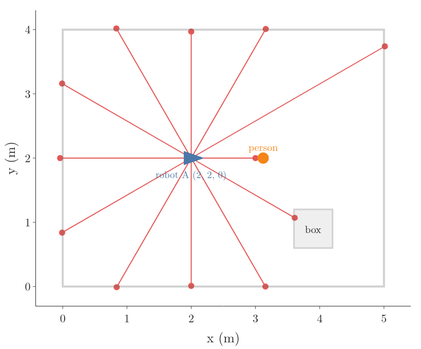
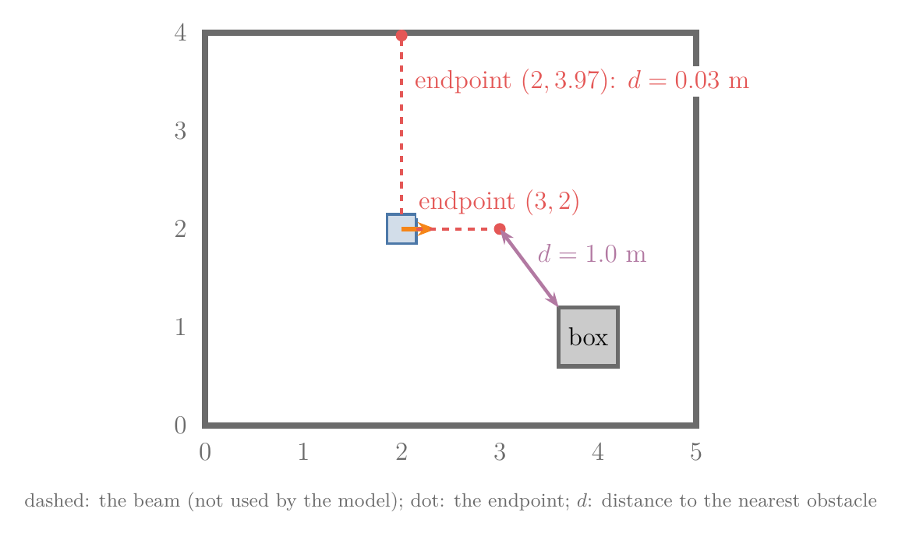
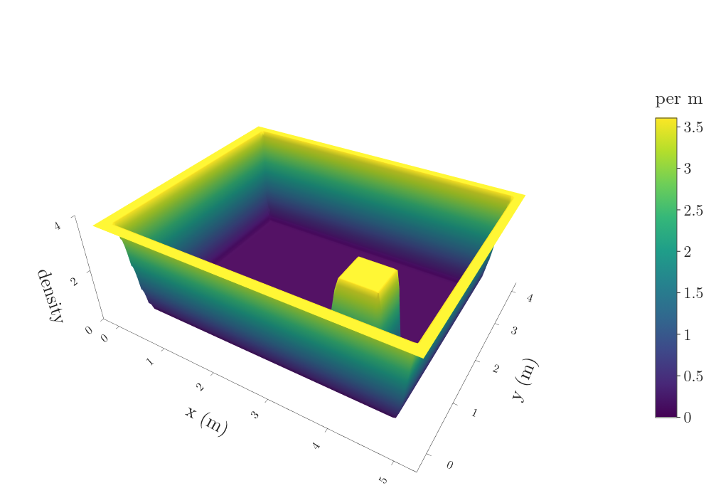
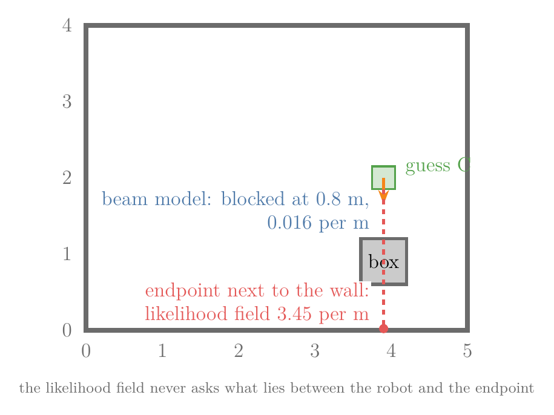

## 1. Overview

> **Key point:** The likelihood field model scores a laser reading by one look-up: how close does the beam's end point land to an obstacle in the map? It gives up some physics for a large gain in speed and smoothness, and the same idea lets a robot match one scan against another to measure how far it moved.



The [beam model](../RO-010-range-sensors-beam-model/RO-010-range-sensors-beam-model.md#51-the-mixture) (G-2377) scores a guessed pose by casting every beam through the map and comparing each reading with the distance it should have read: a mix of four densities for measurement noise, unexpected objects, failures and random readings. It is careful, and it is slow. A localization filter may try hundreds of guessed poses for every scan, and each guess needs a ray cast per beam.

This Note keeps the room of the beam model, adds a box (Figure 1), and builds the faster alternative:

- why the beam model is too slow and too jumpy for some uses (Section 2);
- the likelihood field model: look only at where each beam ends (Section 3);
- how the whole map is turned into a look-up picture once, in advance, and what that picture gives up (Section 4);
- scan matching: using a likelihood field built from one scan to find how far the robot moved before the next (Section 5);
- correlation-based map matching: comparing a small map built from a scan with the global map (Section 6).

## 2. Why the beam model is not enough

> **Key point:** The beam model needs a ray cast for every beam of every guessed pose, and a tiny change of pose can make a beam slip past an edge and change its score a hundredfold.

### 2.1 It is slow

For each guessed pose, the beam model walks every beam through the map until it meets an obstacle ([ray casting](../RO-010-range-sensors-beam-model/RO-010-range-sensors-beam-model.md#22-why-we-need-a-measurement-model), G-2376). A particle filter, which tries many poses at once, multiplies that work. With 1000 guessed poses, 30 beams each, and up to 500 steps of 1 cm per beam:

$$1000 \times 30 \times 500$$

$$= 15\ 000\ 000 \text{ steps per scan}$$

In the notebook, scoring the 12-beam scan of Figure 1 at one pose takes about 11 ms with the beam model and 0.045 ms with the likelihood field of Section 3: about 250 times faster (plain Python; the exact ratio depends on the machine). The Freiburg slides list "not very efficient" as a weakness of the beam model and "highly efficient, uses 2D tables only" as a strength of the endpoint model of Section 3 (Freiburg slides, "Endpoint model" and "Properties of endpoint model").

### 2.2 It jumps at edges

The beam model is "not smooth for small obstacles and at edges" (Freiburg slides, "Endpoint model"). Figure 2 shows why. Take one beam, at 330° (pointing down to the right), with the reading 1.86 m, and slide the robot down the room a centimetre at a time:

| Robot at $y$ | Expected range $z^{\ast}$ | Beam model (per m) |
|---|---|---|
| 1.53 m | 1.85 m (hits the box) | 5.88 |
| 1.52 m | 3.04 m (misses the box) | 0.022 |

One centimetre of movement lets the beam slip under the box's corner. Its expected range jumps from 1.85 m to 3.04 m, and the density of the same reading drops by a factor of:

$$5.88 / 0.022 = 270$$


A score that jumps like this is hard to search: a method that improves a guess by small steps, such as [gradient descent](../../../../ML/06-regression/ML-056-gradient-descent/ML-056-gradient-descent.md#21-which-way-to-move) (G-862), finds no slope to follow on the flat parts and a cliff at the edge. The green curve in Figure 2 is the likelihood field of the next section. It changes smoothly with the pose, which is the second thing we gain (Freiburg slides, "Properties of endpoint model").

## 3. The likelihood field model

> **Key point:** Turn each reading into the point where the beam ended. A reading is likely if that end point lies close to an obstacle in the map; the density is a bell of the distance to the nearest obstacle, plus a small floor.

### 3.1 Look only at where the beam ends

A correct reading ends on a surface. So instead of following the beam, we can ask a simpler question: does the beam's end point lie on, or near, a surface in the map (Freiburg slides, "Endpoint model": "instead of following along the beam, just check the endpoint")? The point where a beam ends is the **beam endpoint** (G-2392). From the robot's pose $(x, y, \theta)$, a beam at angle $\theta_k$ from the heading with reading $z^k$ ends at:

$$x_{\text{end}} = x + z^k \cos(\theta + \theta_k)$$

$$y_{\text{end}} = y + z^k \sin(\theta + \theta_k)$$

These are the cosine and sine shares of a length along a direction, as in the [kinematic model](../../../control/01-robot-models/RO-001-pose-and-differential-drive/RO-001-pose-and-differential-drive.md#51-why-the-speed-splits-into-cosine-and-sine-parts). The laser sits at the robot's centre here; a laser mounted elsewhere adds its offset (UChicago class 05).

**Worked example.** At pose A, the beam at 90° reads 1.97 m:

$$x_{\text{end}} = 2 + 1.97 \cos 90^\circ = 2$$

$$y_{\text{end}} = 2 + 1.97 \sin 90^\circ = 3.97$$

The forward beam reads 1.00 m, so it ends at (3, 2). Figure 3 marks both end points and the distance $d$ from each to the nearest obstacle in the map:

$$d(2, 3.97) = 0.03 \text{ m (top wall)}$$

$$d(3, 2) = 1.0 \text{ m (box corner)}$$



### 3.2 From distance to density

An end point 3 cm from a wall is what a good reading looks like; one 1 m away from everything is not. We turn the distance into a density with two parts (Thrun §6.4; Freiburg slides, "Endpoint model"; UChicago class 05):

- **a bell of the distance:** sensor noise scatters end points a little around the surface, so we use a [Gaussian](../../../../MA/03-distributions/MA-024-normal-distribution/MA-024-normal-distribution.md#2-what-the-normal-distribution-is) (G-827) of $d$ with mean 0 and spread $\sigma$;
- **a flat floor:** readings with no modelled cause, such as the person, must not get density 0, for the same reason as the [random part of the beam model](../RO-010-range-sensors-beam-model/RO-010-range-sensors-beam-model.md#44-random-readings-a-flat-floor).

  $$
  p(z^k \mid x, m) = w_{\text{hit}}\ \mathcal{N}(d;\ 0, \sigma^2) + \frac{w_{\text{rand}}}{z_{\max}}
  $$

We use $w_{\text{hit}} = 0.9$, $w_{\text{rand}} = 0.1$, $\sigma = 0.1$ m and $z_{\max} = 5$ m. The spread is wider than the beam model's 0.05 m, because $d$ also absorbs small errors in the map and the pose. The ROS localization package uses 0.2 m by default (ROS amcl, `laser_sigma_hit`).

**Worked example: the 90° beam,** $d = 0.03$ m. The Gaussian at $d = 0$ has height 3.989 per m:

$$\mathcal{N}(0.03;\ 0, 0.1^2) = 3.989 \times e^{-0.045}$$

$$= 3.814$$

$$0.9 \times 3.814 = 3.432$$

$$3.432 + 0.1 / 5 = 3.452 \text{ per m}$$

**The person's beam,** $d = 1.0$ m, ten spreads away. The bell part is about $e^{-50}$, so only the floor is left:

$$0.9 \times 3.989 \times e^{-50} \approx 0$$

$$p = 0 + 0.02 = 0.02 \text{ per m}$$

Two kinds of reading need a rule of their own:

- **Max-range readings** are skipped. Their end point is not on any surface; it only says nothing came back (UChicago class 05; Thrun §6.4).
- **The whole scan** is the product of its beams, as for the beam model, because the beams are close to [conditionally independent](../RO-010-range-sensors-beam-model/RO-010-range-sensors-beam-model.md#23-why-a-whole-scan-is-a-product-of-beams) given the pose and the map. In practice we add logs instead of multiplying, which gives the same ranking without very small numbers.

This mixture, evaluated at beam end points, is the **likelihood field model** (G-2391), also called the endpoint model (Thrun §6.4; Freiburg slides).

### 3.3 The scan at pose A

The notebook scores all 12 beams of Figure 1:

| Beam | Reading (m) | End point | $d$ (m) | Density (per m) |
|---|---|---|---|---|
| 0° | 1.00 | (3.00, 2.00) | 1.01 | 0.020 |
| 90° | 1.97 | (2.00, 3.97) | 0.03 | 3.452 |
| 270° | 1.99 | (2.00, 0.01) | 0.02 | 3.539 |
| 330° | 1.86 | (3.61, 1.07) | 0.00 | 3.611 |
| 8 others | 2.04 to 3.48 | on a wall | 0.00 | 3.611 |

The distances come from a grid of 1 cm cells, so an end point inside a wall cell has $d = 0$. Adding the logs of all 12 densities gives the scan's log-likelihood at each guessed pose:

| Guessed pose | Log-likelihood of the scan |
|---|---|
| A, (2, 2, 0) | 10.15 |
| (2.1, 2, 0): 10 cm off | 8.91 |
| (2, 2, 5°): turned 5° | 8.49 |
| (2, 2.3, 0): 30 cm off | −19.29 |
| B, (3, 2, 0): 1 m off | −15.75 |

The true pose scores highest, and poses a few centimetres or degrees away score only a little lower: the smooth fall-off of Section 2.2. The person's beam costs every pose the same, because its end point is far from every obstacle at all of them.

> **Python:** the likelihood field model for one scan.
> ```python
> def field_loglik(F, pose, z, angles):
>     x, y, th = pose
>     keep = z < ZMAX                    # skip max-range readings
>     ex = x + z[keep] * np.cos(th + angles[keep])
>     ey = y + z[keep] * np.sin(th + angles[keep])
>     return np.log(lookup(F, ex, ey)).sum()
> ```
> `F` is the precomputed field of Section 4 and `lookup` reads the grid cell under each end point; both are in `RO-011-likelihood-fields-and-scan-matching.ipynb`.

## 4. Precomputing the field

> **Key point:** The density depends only on where the end point lands, not on the pose, so we compute it once for every cell of the map and store it. That stored picture is the likelihood field.

### 4.1 The distance transform

The density of Section 3.2 needs one number per end point: the distance to the nearest obstacle. That number depends only on the end point's position, never on the pose the beam came from. So we can work it out for every cell of the map once, before the robot moves, and store it.

The stored grid of "distance from this cell to the nearest occupied cell" is the **distance transform** (G-2394) of the map, and with straight-line distances the Euclidean distance transform. Image-processing libraries compute it in one pass over a grid of marked and unmarked cells, for example `scipy.ndimage.distance_transform_edt` (SciPy docs). Figure 4 shows it on a coarse grid of 0.5 m cells, with the box rounded to whole cells. Read it like a table: each number is the distance in metres from that cell's centre to the nearest grey cell. The numbers grow by about one cell size (0.5 m) per step away from any wall, and the cells between the box and the right wall stay small because two obstacles are near.


### 4.2 From distances to the likelihood field

Putting each cell's distance into the density of Section 3.2 gives the density an end point would have in that cell. The grid of these densities is the **likelihood field** (G-2393) of the map (Thrun §6.4; Freiburg slides, "Example"). We build it in three views, from the familiar to the compact.

**A line through the room.** Figure 5 walks along the line $y = 0.9$ m, which crosses the left wall, the box and the right wall. The top panel is the distance to the nearest obstacle: zero at each obstacle and rising in a straight line away from it, until it levels off at 0.9 m in the middle, where the nearest obstacle is the bottom wall 0.9 m below the line. The bottom panel is the field: a peak of 3.61 per m on every obstacle, falling to the floor of 0.02 within about 0.3 m (three spreads).


**The whole room as a surface.** Doing this for every line gives a surface over the floor plan (Figure 6): height is the density of an end point at that spot. Ridges stand along the walls and around the box; a flat floor lies everywhere else.



**The same surface from straight above.** Looking down on Figure 6 and keeping only the colours gives Figure 7, the usual way to draw a likelihood field: bright means an end point here is likely, dark means unlikely. The 12 end points of the scan at pose A are drawn on it. Eleven sit on bright ridges; the person's end point sits on the dark floor. Scoring a pose means placing the scan's end points on this picture and reading off the colours.


The field is computed once per map, so its cost does not grow with the number of poses tried. Scoring a pose then costs one look-up per beam, with no ray casting: this is the speed-up of Section 2.1 (Freiburg slides: "highly efficient, uses 2D tables only"). The ROS localization package AMCL uses this model by default (ROS amcl, `laser_model_type`).

### 4.3 What the field gives up

The model "ignores physical properties of beams" (Freiburg slides, "Properties of endpoint model"): it looks at the end point and ignores what lies between the robot and it. Two consequences follow.

**It sees through walls.** Figure 8 shows a guessed pose C, (3.9, 2, −90°), above the box, facing down. Suppose a reading of 1.98 m. Its end point, (3.9, 0.02), lies 3 cm from the bottom wall, so the field scores it 3.45 per m, a near-perfect reading. But from C the beam would meet the box after 0.8 m; it could never reach the wall. The beam model knows this and gives the reading 0.016 per m (Thrun §6.4 lists the same drawback).



**It does not model people.** The field has no short-reading part. A person's reading is scored only by the floor, 0.02 per m, wherever it lands. That is mild in practice, because the floor still keeps the scan's product from reaching 0, and the person costs every guessed pose the same.

So the trade is: physics for speed and smoothness. It pays when many poses must be scored, as in a particle filter, and when the score is searched by small steps, as in scan matching (Freiburg slides, "Properties of endpoint model").

## 5. Scan matching: how far did the robot move?

> **Key point:** Build a likelihood field from the first scan's end points, then slide the second scan over it. The shift that puts the second scan's end points on the brightest places is the robot's motion between the two scans.

### 5.1 The problem: odometry drifts

Wheel odometry estimates motion by counting wheel turns, and wheels slip, so its estimate drifts ([wheel odometry](../RO-008-probabilistic-motion-models/RO-008-probabilistic-motion-models.md#32-why-odometry-drifts-and-why-it-needs-calibration), G-2321: motion measured from wheel turns, with errors that grow as the robot drives). A laser sees the same walls before and after a move, and they shift in its view by exactly the robot's motion. Finding that shift is **scan matching** (G-2395): aligning two scans to find the motion between the poses they were taken from (Olson 2009).

Our test: the robot takes scan 1 at (2, 2, 0), then drives to (2.3, 2.1, 5°). Odometry claims it reached (2.3, 2.0, 0): it missed the 0.1 m sideways slip and the 5° turn. Each scan has 360 beams, one per degree.

### 5.2 A likelihood field from the first scan

Scan matching needs no map. We treat the end points of scan 1 as the occupied cells of a little map and build its likelihood field exactly as in Section 4 (Freiburg slides, "Scan matching: extract likelihood field from first scan and use it to match second scan"). Scan 2's end points, placed at the right motion, must then land on the bright ridges of that field.

### 5.3 Search the candidate motions

A candidate motion is a shift $(\Delta x, \Delta y)$ and a turn $\Delta\theta$. To test one, we turn scan 2's end points by $\Delta\theta$, shift them by $(\Delta x, \Delta y)$, look up the field of scan 1 under each, and add the logs. That sum is the score of the candidate. We try every candidate on a grid:

- $\Delta x$ from −0.1 to 0.7 m and $\Delta y$ from −0.3 to 0.3 m, in steps of 0.02 m;
- $\Delta\theta$ from −10° to 10°, in steps of 1°.

That is 41 × 31 × 21 = 26 691 candidates, scored in about one second in the notebook. Searching a whole grid of candidates and keeping the best is **correlative scan matching** (G-2396) (Olson 2009). It does not need a good first guess, unlike methods that improve one guess step by step.

Figure 9 plays a few candidates. At the odometry guess, scan 2's end points sit beside the ridges: the score is 169. The best candidate is the true motion, $(0.3, 0.1, 5^\circ)$, where the points lie along the ridges and the score is 447.


Because the field is smooth, the score also rises smoothly towards the best candidate, so the search can be refined by small steps, for example by gradient ascent from the best grid point (Freiburg slides: the distance grid "is smooth w.r.t. to small changes in robot position"; Olson 2009).

> **Extra:** The field must be dense enough. With 72 beams per scan (one every 5°), scan 1's end points 3 m away lie about 0.26 m apart, more than twice the field's spread of 0.1 m. The field then has dark gaps between the points, and the same search picks $(0.28, 0.1, 7^\circ)$ instead of the true motion (the notebook shows it). Denser scans, a wider $\sigma$, or a field built from several scans fix it.

## 6. Correlation-based map matching

> **Key point:** Turn the scan into a small map of marked cells, place it on the global map at a candidate pose, and measure how well the two agree with a correlation coefficient. The placement with the highest correlation is the best pose.

### 6.1 A local map from the scan

A third way to score a pose compares maps instead of points. We mark, on cells of 0.1 m, every cell that holds an end point of scan 2. This small grid built from the robot's own readings is a **local map** (G-2398). Placed at a candidate pose, it should line up with the global map's occupied cells (Freiburg slides, "Map matching: generate small, local maps from sensor data and match local maps against global model"). Comparing the two grids cell by cell to score the placement is **map matching** (G-2397) (Thrun §6.5).

### 6.2 Multiply and add

The simplest comparison places the local map on the global map, multiplies matching cells and adds the products (Konolige and Chou 1999: "places the sensor patch on the map, multiplies the corresponding values, and sums them"). A cell adds 1 only where both maps are marked. Take a strip of 8 cells across a corridor, with walls in cells 3 and 7 of the global map:

| Cell | 1 | 2 | 3 | 4 | 5 | 6 | 7 | 8 |
|---|---|---|---|---|---|---|---|---|
| global map $g$ | 0 | 0 | 1 | 0 | 0 | 0 | 1 | 0 |
| local map, placed off by one | 0 | 1 | 0 | 0 | 0 | 1 | 0 | 0 |
| local map, placed right | 0 | 0 | 1 | 0 | 0 | 0 | 1 | 0 |

Placed off by one, no marked cells meet, so the sum is 0; placed right, two meet, so the sum is 2. Larger is better.

The raw sum has a flaw: it rewards a local map for marking many cells. In the room of Figure 1, the right placement of scan 2 scores 175, but a local map with every cell marked scores 224, the global map's whole count. A comparison must not prefer "everything is a wall".

### 6.3 Why we normalise: the correlation coefficient

The fix is the [Pearson correlation coefficient](../../../../MA/01-descriptive-stats/MA-009-covariance-and-correlation/MA-009-covariance-and-correlation.md#4-correlation) (G-1474) of the two maps, read cell by cell as two lists of numbers. It subtracts each map's mean before multiplying, so cells marked everywhere earn nothing, and divides by both spreads, so the result lies between −1 and +1 (MA-009):

$$r = \frac{\sum_i (g_i - \bar g)(l_i - \bar l)}{\sqrt{\sum_i (g_i - \bar g)^2\ \sum_i (l_i - \bar l)^2}}$$

Here $g_i$ and $l_i$ are cell $i$ of the global and local map, and $\bar g$ and $\bar l$ their means (Thrun §6.5 uses this correlation for map matching).

**Worked example: the strip placed off by one.** Both maps mark 2 of 8 cells:

$$\bar g = \bar l = 2 / 8 = 0.25$$

Each cell's product $(g_i - 0.25)(l_i - 0.25)$ is one of three values:

- both 0 (4 cells): $(-0.25)(-0.25) = 0.0625$;
- one marked, one not (4 cells): $(0.75)(-0.25) = -0.1875$;
- both marked: no such cell.

The top of the fraction:

$$4 \times 0.0625 = 0.25$$

$$4 \times (-0.1875) = -0.75$$

$$0.25 - 0.75 = -0.5$$

Each map's sum of squares, 2 marked and 6 unmarked cells:

$$2 \times 0.75^2 + 6 \times 0.25^2 = 1.5$$

The correlation:

$$r = \frac{-0.5}{\sqrt{1.5 \times 1.5}}$$

$$= -0.5 / 1.5 = -0.333$$

Placed right, the two lists are identical, so $r = 1$. A local map with half its cells marked at random gets $r = 0.001$ against the room, although its raw sum is 113: the correlation sees that it agrees with the walls no better than chance.

The score is used as the likelihood of the reading at that pose, a weight for the pose, and a likelihood cannot be negative. The correlation can be, as the placement off by one shows. Only a positive correlation counts as evidence for a pose; a negative one is treated the same as no correlation at all. So the score of a placement is the correlation cut at zero (Thrun §6.5; Omr et al. 2024):

$$\text{score} = \max(r,\ 0)$$

For the strip placed off by one:

$$\max(-0.333,\ 0) = 0$$

### 6.4 Matching scan 2 against the room

Figure 10 places scan 2's local map on the room's map. With the turn fixed at 5° and the sideways shift at 0.1 m, the correlation rises from about 0.6 to a flat top of 0.86 to 0.875 between $\Delta x$ = 0.24 and 0.36 m. Its best value is at 0.28 m, next to the true 0.3 m. Searching all candidates of Section 5.3, the best placement is $(0.30, 0.08, 6^\circ)$ with $r = 0.877$, against $r = 0.872$ at the true motion and 0.617 at the odometry guess.


So map matching found the motion to within one cell (0.1 m) and one degree. The flat top shows its limit: on 0.1 m cells, placements a few centimetres apart mark the same cells, so they cannot be told apart. Smaller cells sharpen it at a higher cost. Map matching is cheap and needs only a grid comparison, but its score is a measure of agreement, not a density derived from how the sensor works; like the likelihood field, it ignores what lies along each beam (Konolige and Chou 1999: correlation "violates the visibility constraint").

## 7. Summary

| Model | Looks at | Cost per guessed pose | Smooth in the pose | Knows what blocks a beam |
|---|---|---|---|---|
| beam model | the whole beam, by ray casting | a ray cast per beam | no: jumps at edges | yes |
| likelihood field | each beam's end point | one look-up per beam | yes | no: sees through walls |
| map matching | a local map of the scan | a grid comparison | in steps of a cell | no |

- The likelihood field model scores a reading by the distance from its end point to the nearest obstacle, because a correct reading ends on a surface; the density is a bell of that distance plus a floor, so no reading scores 0.
- The distances depend only on where the end point lands, not on the pose, so the whole field is computed once with a distance transform and every later score is a look-up: about 250 times faster than the beam model in our test.
- The field changes smoothly with the pose, because moving the robot moves each end point only a little, so a search by small steps can climb it; the beam model jumps when a beam slips past an edge.
- The price is physics: the field ignores what lies along the beam, so it can score a reading that would have to pass through a wall, and it has no part for people.
- Scan matching builds a field from one scan and slides the next scan over it; the best shift, here (0.3 m, 0.1 m, 5°), is the motion the odometry got wrong.
- Map matching compares a local map of the scan with the global map by their correlation, cut at zero, because the raw sum of products would reward a local map that marks everything.

So the opening problem has its answer: when hundreds of poses must be scored per scan, the robot looks only at where each beam ends, on a picture of the map prepared in advance, and the same picture, built from its own last scan, tells it how far it really moved.

## 8. Sources

**Built from**

- Cyrill Stachniss, "Observation Models", YouTube, https://www.youtube.com/watch?v=SfwxLpdFB-o
- Carlotta A. Berry, PhD, "Advanced Mobile Robotics: Lecture 4-2a - Probabilistic Sensor Models", YouTube, https://www.youtube.com/watch?v=T8b2fMQbWug
- Burgard, W. et al., *Introduction to Mobile Robotics*, "Probabilistic Sensor Models" slides, University of Freiburg, http://ais.informatik.uni-freiburg.de/teaching/ss23/robotics/slides/07-sensor-models.pdf (Freiburg slides)
- University of Chicago, CMSC 20600 *Introduction to Robotics*, "Class Meeting 05: Measurement Models for Range Finders", https://classes.cs.uchicago.edu/archive/2025/fall/20600-1/class_meeting_05.html (UChicago class 05: the likelihood-field algorithm)
- Olson, E. B. (2009). "Real-Time Correlative Scan Matching". *IEEE International Conference on Robotics and Automation*. https://april.eecs.umich.edu/pdfs/olson2009icra.pdf (Olson 2009)
- Konolige, K. and Chou, K. (1999). "Markov Localization using Correlation". *International Joint Conference on Artificial Intelligence*, 1154–1159. https://ijcai.org/Proceedings/99-2/Papers/069.pdf (Konolige and Chou 1999)
- Thrun, S., Burgard, W. and Fox, D. (2005). *Probabilistic Robotics*. MIT Press. §6.4 (likelihood fields), §6.5 (correlation-based measurement models). Cited only for what the free sources confirm. (Thrun)

**Other references**

- ROS `amcl` package, parameter definitions `AMCL.cfg`, https://github.com/ros-planning/navigation/blob/noetic-devel/amcl/cfg/AMCL.cfg (ROS amcl: `laser_model_type` default `likelihood_field`, `laser_sigma_hit` default 0.2)
- SciPy documentation, `scipy.ndimage.distance_transform_edt`, https://docs.scipy.org/doc/scipy/reference/generated/scipy.ndimage.distance_transform_edt.html (SciPy docs)
- Omr, M., Ali, A., Al-Hamad, A. and Georgy, J. (2024). "Method and system for positioning using optical sensor and motion sensors". US Patent 11,875,519 B2 (InvenSense). https://patents.google.com/patent/US11875519B2/en (Omr et al. 2024: the map-matching likelihood is proportional to max(correlation, 0), because only a positive correlation or none is significant)

## 9. Key terms

Terms taught in this Note come first; linked terms are recaps, taught in the Note the link opens.

| Term | Meaning |
|---|---|
| Beam endpoint (G-2392) | The point where a beam ends: the robot's position plus the reading along the beam's direction, $(x + z\cos(\theta + \theta_k),\ y + z\sin(\theta + \theta_k))$; the likelihood field model looks only at this point. |
| Likelihood field model (G-2391) | A measurement model for range finders that scores each reading by how close its beam endpoint lands to an obstacle in the map (a Gaussian of that distance plus a flat floor); it is fast and smooth because it skips ray casting, but it ignores what lies along the beam. |
| Distance transform (G-2394) | A grid that stores, for every cell of a map, the distance to the nearest occupied cell (with straight-line distances, the Euclidean distance transform); it lets a likelihood field be built in one pass. |
| Likelihood field (G-2393) | A grid over the map that stores, for each cell, the density of a beam endpoint landing there; computed once from the distance transform, so scoring a pose becomes one look-up per beam. |
| Scan matching (G-2395) | Aligning two range scans to find the motion between the poses they were taken from, for example by sliding the second scan over a likelihood field built from the first; it corrects drifting odometry. |
| Correlative scan matching (G-2396) | Scan matching that scores every candidate motion on a grid of shifts and turns and keeps the best, so it needs no good first guess. |
| Local map (G-2398) | A small grid map built from the robot's current readings alone, such as the cells holding a scan's endpoints; map matching compares it with the global map. |
| Map matching (correlation-based) (G-2397) | Scoring a guessed pose by placing a local map built from the scan on the global map there and computing their correlation, cut at zero; it is cheap but coarse, limited by the cell size. |
| [Beam model](../../../../RO/localization/02-bayes-filters/RO-010-range-sensors-beam-model/RO-010-range-sensors-beam-model.md#51-the-mixture) (G-2377) | The measurement model of a range finder that mixes four densities for one reading (measurement noise, unexpected objects, failures, random readings) with weights that add up to 1, so no single odd reading can rule out the true pose. |
| [Ray casting](../../../../RO/localization/02-bayes-filters/RO-010-range-sensors-beam-model/RO-010-range-sensors-beam-model.md#22-why-we-need-a-measurement-model) (G-2376) | Finding the expected range by walking along a beam's direction through the map until the first occupied cell; it turns a guessed pose and a map into the readings the robot should see. |
| [Gradient descent](../../../../ML/06-regression/ML-056-gradient-descent/ML-056-gradient-descent.md#1-overview) (G-862) | Finding the lowest point of a function by repeated small steps downhill. |
| [Gaussian distribution](../../../../MA/03-distributions/MA-024-normal-distribution/MA-024-normal-distribution.md#2-what-the-normal-distribution-is) (G-827) | Another name for the normal distribution: the symmetric, bell-shaped continuous distribution set by its mean and standard deviation, used to model many measurements. |
| [Wheel odometry](../../../../RO/localization/02-bayes-filters/RO-008-probabilistic-motion-models/RO-008-probabilistic-motion-models.md#31-from-encoder-ticks-to-a-new-pose) (G-2321) | Working out a robot's pose by adding up the wheel motion its encoders measure: ticks to wheel distances, to the robot's move and turn, to a new pose; accurate over short distances but it drifts, because every error stays in the sum. |
| [Pearson correlation coefficient (Pearson's r)](../../../../ML/02-getting-data/ML-018-understanding-your-data/ML-018-understanding-your-data.md#91-correlation) (G-1474) | The usual measure of correlation for straight-line relationships between two numerical columns, written $r$; the one `df.corr()` computes. |
