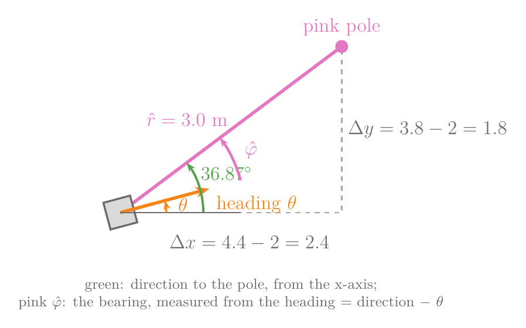
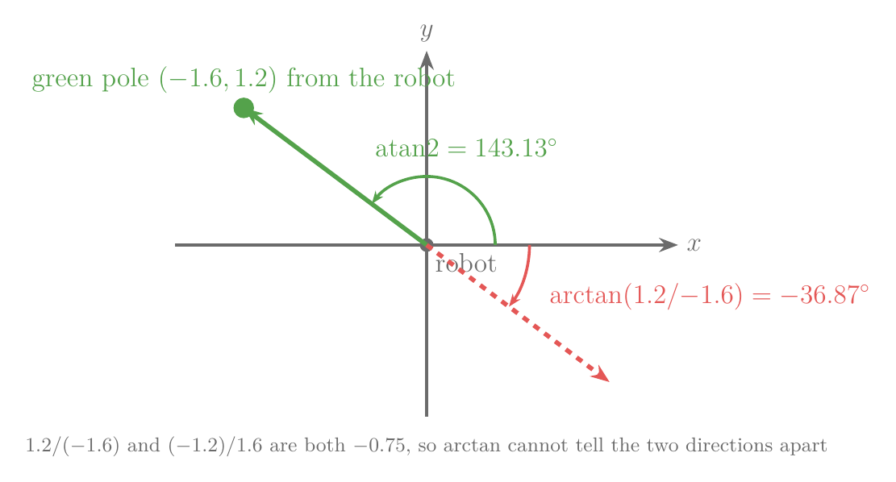
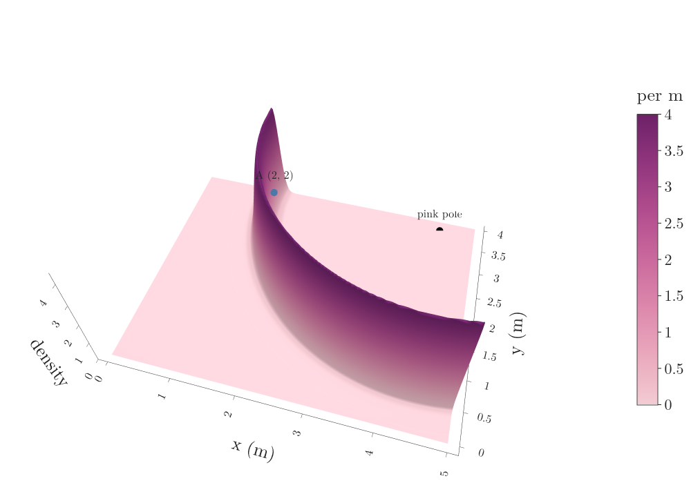

## 1. Overview

> **Key point:** A landmark reading is a range and a bearing to a known point. The model predicts both from a guessed pose and scores the guess with two bells around the predictions. One reading puts the robot on a ring; three readings pin it to one spot, and a reading can also be turned around to propose poses.


A laser scan gives hundreds of distances, all of which look alike: wall, wall, wall. A camera that spots a pink pole gives far less data, but the data says exactly which object it saw, and the map says exactly where that object stands. Such a recognisable object at a known place is a landmark. Robots [pull landmarks out of sensor data](../RO-009-maps-and-landmarks/RO-009-maps-and-landmarks.md#62-finding-the-poles-in-a-scan), and each one is seen as a range (how far), a bearing (at what angle from the robot's heading) and a signature (what it looks like, here its colour).

Figure 1 shows the test case of this Note: the robot at A = (2, 2, 0) sees three poles. To use these readings, the robot needs the same thing the [beam model](../RO-010-range-sensors-beam-model/RO-010-range-sensors-beam-model.md#22-why-we-need-a-measurement-model) gave it for a laser: a [measurement model](../RO-010-range-sensors-beam-model/RO-010-range-sensors-beam-model.md#22-why-we-need-a-measurement-model) (G-2374), the density of the readings $p(z \mid x, m)$ for any guessed pose $x$ in the map $m$. This Note builds it:

- what range and bearing a pole should show from a guessed pose, and the two pitfalls in computing the angle (Section 3);
- the density of a reading, and why it is a product of two bells (Section 4);
- why one reading puts the robot on a ring, and several readings pin it down (Section 5);
- how to turn one reading around and draw poses that fit it (Section 6).

## 2. A landmark reading

> **Key point:** Each reading is a range, a bearing and a signature; the signature tells us which landmark of the map was seen.

We write one landmark reading as a list of three entries, the [range, bearing and signature](../RO-009-maps-and-landmarks/RO-009-maps-and-landmarks.md#63-range-bearing-and-signature) (G-2343, G-2344, G-2345):

$$z = (r,\ \varphi,\ s)$$

- $r$ is the range: the distance from the robot to the landmark, in metres;
- $\varphi$ (phi) is the bearing: the angle from the robot's heading to the landmark, counter-clockwise positive, as for the [heading](../../../control/01-robot-models/RO-001-pose-and-differential-drive/RO-001-pose-and-differential-drive.md#22-why-position-is-not-enough-the-heading) (G-2284) itself;
- $s$ is the signature: what identifies the landmark, here its colour.

The three readings of Figure 1:

| Pole | Range $r$ | Bearing $\varphi$ | Signature $s$ |
|---|---|---|---|
| pink | 3.10 m | 40° | pink |
| green | 1.95 m | 141° | green |
| blue | 2.05 m | −55° | blue |

A sensor that gives both numbers, such as a laser that picks poles out of its scan or a calibrated camera that also judges size, is a range-bearing sensor (Brown CS148 tutorial; Freiburg sensor-model slides, "Landmarks"). The signature solves a problem the laser scan never had to face: which landmark of the map is this? Knowing which map landmark a reading belongs to is **known correspondence** (G-2405). Here each colour appears once, so the colour gives the correspondence directly (Brown CS148 tutorial, §3). We write $c$ for the index of that landmark and $(m_{c,x},\ m_{c,y})$ for its place in the map; for the pink pole:

$$(m_{c,x},\ m_{c,y}) = (4.4,\ 3.8)$$

When colours repeat, the correspondence is unknown and must be worked out too; later Notes on SLAM deal with that.

## 3. What a guessed pose predicts

> **Key point:** From pose $(x, y, \theta)$, a landmark should appear at the straight-line distance and at its direction minus the heading. Compute the direction with atan2, and wrap every angle difference into −180° to 180°.

### 3.1 Expected range and bearing

To judge a guessed pose, we first ask what the robot would read from there. The steps are those that turn [a known pose and the map into a reading](../RO-009-maps-and-landmarks/RO-009-maps-and-landmarks.md#63-range-bearing-and-signature), now done from a guessed pose. Figure 2 draws the pink pole seen from (2, 2). The pole lies 2.4 m further along x and 1.8 m further along y:

$$\Delta x = 4.4 - 2 = 2.4$$

$$\Delta y = 3.8 - 2 = 1.8$$



**Expected range.** The straight-line distance is the long side of the triangle (Pythagoras), the [Euclidean distance](../../../../ML/04-missing-data-and-outliers/ML-038-knn-imputer/ML-038-knn-imputer.md#41-the-euclidean-distance) (G-715):

$$\hat r = \sqrt{\Delta x^2 + \Delta y^2}$$

$$= \sqrt{5.76 + 3.24} = 3.0 \text{ m}$$

**Expected bearing.** The direction from the robot to the pole, measured from the world x-axis, is the angle whose tangent is $\Delta y / \Delta x$:

$$\text{direction} = \operatorname{atan2}(1.8,\ 2.4) = 36.87^\circ$$

The bearing is measured from the robot's heading, not from the x-axis, so we subtract the heading (Figure 2). At pose A, $\theta = 0$:

$$\hat\varphi = 36.87^\circ - \theta$$

$$= 36.87^\circ - 0^\circ = 36.87^\circ$$

A hat marks a predicted value. Together, the **expected range and bearing** (G-2402) of landmark $c$ from pose $(x, y, \theta)$ are (Thrun §6.6; Brown CS148 tutorial, Eq. 5–6):

$$\hat r = \sqrt{(m_{c,x} - x)^2 + (m_{c,y} - y)^2}$$

$$\hat\varphi = \operatorname{atan2}(m_{c,y} - y,\ m_{c,x} - x) - \theta$$

A check at an easy pose: a robot at (2, 3.8) facing along x, with the pole straight ahead at (4.4, 3.8). Then $\Delta y = 0$, the direction is 0°, and the predicted bearing is 0°: straight ahead, as it should be.

### 3.2 Why atan2 and not arctan

Take the green pole, at (0.4, 3.2). From A:

$$\Delta x = 0.4 - 2 = -1.6$$

$$\Delta y = 3.2 - 2 = 1.2$$

The plain arctangent of the ratio:

$$\arctan(1.2 / {-1.6}) = \arctan(-0.75)$$

$$= -36.87^\circ$$

That direction points down and to the right, away from the pole (Figure 3). The ratio has lost the signs: a point at (1.6, −1.2) gives the same ratio −0.75. So the formula uses [atan2](../RO-008-probabilistic-motion-models/RO-008-probabilistic-motion-models.md#42-turn-drive-turn) (G-2325), which takes $\Delta y$ and $\Delta x$ separately, so it knows which quarter of the plane the point lies in, and returns the angle in the right quarter, between −180° and 180° (Brown CS148 tutorial, §3):

$$\operatorname{atan2}(1.2,\ -1.6) = 143.13^\circ$$



### 3.3 Why angle differences must be wrapped

Scoring a reading means comparing it with the prediction. For range, the difference is a plain subtraction. For bearings it is not. Suppose the bearing reads 175° and the prediction is −178°. The two directions are only 7° apart, across the ±180° line, but the plain difference is:

$$175 - (-178) = 353^\circ$$

A bell around the prediction would call that a wild miss. The fix is to add or subtract 360° until the difference lies between −180° and 180°:

$$353^\circ - 360^\circ = -7^\circ$$

This is **angle wrapping** (G-2404), the same wrap-around of headings as on a [dial](../../../control/01-robot-models/RO-001-pose-and-differential-drive/RO-001-pose-and-differential-drive.md#25-configuration-and-configuration-space), where 350° and 10° are 20° apart. Every bearing difference and every heading in this Note is wrapped (Brown CS148 tutorial, §3, which uses the angle between two unit vectors to the same effect).

## 4. The landmark measurement model

> **Key point:** The density of a reading is a bell of the range error times a bell of the bearing error, because the two errors are taken as independent. Several landmarks multiply in the same way.

### 4.1 Two bells, multiplied

The real reading differs from the prediction by sensor noise. As for the [measurement noise of a laser](../RO-010-range-sensors-beam-model/RO-010-range-sensors-beam-model.md#41-measurement-noise-a-bell-around-the-expected-range), small errors follow a [Gaussian](../../../../MA/03-distributions/MA-024-normal-distribution/MA-024-normal-distribution.md#2-what-the-normal-distribution-is) (G-827) centred on 0. Our sensor has these spreads:

$$\sigma_r = 0.1 \text{ m}$$

$$\sigma_\varphi = 5^\circ = 0.0873 \text{ rad}$$

We treat the range error and the bearing error as independent: knowing that the range came out 10 cm long says nothing about the bearing (Brown CS148 tutorial, Eq. 13). For [independent events](../../../../MA/02-probability/MA-016-independent-events/MA-016-independent-events.md#2-the-definition) (G-934) the probabilities multiply, and so do the densities. So the density of one reading is the product of two bells:

$$p(z \mid x, m) = \mathcal{N}(r - \hat r;\ 0, \sigma_r^2)$$

$$\qquad \times\ \mathcal{N}(\varphi - \hat\varphi;\ 0, \sigma_\varphi^2)$$

with the bearing difference wrapped. A camera can confuse colours, so Thrun adds a third bell for the signature; with known correspondence that factor is the same for every pose and can be left out (Thrun §6.6; Brown CS148 tutorial, Eq. 16–17). This is the **landmark measurement model** (G-2401) with known correspondence (Thrun §6.6, Table 6.4; Freiburg sensor-model slides, "Probabilistic Model").

**Worked example: the pink pole at pose A.** The errors:

$$r - \hat r = 3.10 - 3.00 = 0.10 \text{ m}$$

$$\varphi - \hat\varphi = 40^\circ - 36.87^\circ = 3.13^\circ$$

$$3.13^\circ = 0.0546 \text{ rad}$$

The range bell. Its peak height is one over $\sigma_r\sqrt{2\pi}$:

$$\frac{1}{0.1 \times 2.507} = 3.989 \text{ per m}$$

The error is one spread, so:

$$3.989 \times e^{-\frac{1}{2} \times 1^2}$$

$$= 3.989 \times 0.607 = 2.420 \text{ per m}$$

The bearing bell. Its peak height:

$$\frac{1}{0.08727 \times 2.5066} = 4.572 \text{ per rad}$$

The error, in spreads:

$$\frac{0.0546}{0.0873} = 0.627$$

$$4.572 \times e^{-\frac{1}{2} \times 0.627^2}$$

$$= 4.572 \times 0.822 = 3.758 \text{ per rad}$$

The product:

$$2.420 \times 3.758 = 9.09$$

The result is a density, per metre per radian, so it can be larger than 1; only areas under it are probabilities ([what a density means](../../../../MA/03-distributions/MA-022-pdf-and-continuous-cdf/MA-022-pdf-and-continuous-cdf.md#5-what-the-density-at-a-point-means), G-1569). It is easy to call such a number "the probability of the reading", and wrong.

### 4.2 Several landmarks

Readings of different landmarks come from separate detections, so their errors are taken as independent too, and their densities multiply (Brown CS148 tutorial, Eq. 11). The three readings at pose A:

| Pole | $\hat r$ (m) | $\hat\varphi$ | Range error | Bearing error | Density |
|---|---|---|---|---|---|
| pink | 3.00 | 36.87° | 0.10 m | 3.13° | 9.09 |
| green | 2.00 | 143.13° | −0.05 m | −2.13° | 14.70 |
| blue | 2.00 | −53.13° | 0.05 m | −1.87° | 15.01 |

$$9.09 \times 14.70 \times 15.01 = 2006$$

At the wrong pose B = (3, 2, 0), one metre to the right, the pink pole should appear at 2.28 m and 52°, the green at 2.86 m and 155°, the blue at 1.61 m and −83°. Every reading misses by several spreads, and the product is about $10^{-43}$. The readings say A, overwhelmingly.

> **Python:** the model for one reading (Brown CS148 tutorial, Table 2).
> ```python
> def landmark_density(pose, m, r, phi):
>     x, y, th = pose
>     r_hat = np.hypot(m[0] - x, m[1] - y)
>     phi_hat = np.arctan2(m[1] - y, m[0] - x) - th
>     return gauss(r - r_hat, 0.1) * gauss(wrap(phi - phi_hat), np.radians(5))
> landmark_density((2, 2, 0), (4.4, 3.8), 3.10, np.radians(40))   # 9.09
> ```
> `gauss` is the Gaussian density and `wrap` wraps an angle to (−π, π]; both are in `RO-012-landmark-measurement-model.ipynb`.

## 5. Where can the robot be?

> **Key point:** One range reading allows every position on a ring around the landmark. Two rings meet in at most two points, and a third ring, or the map, picks one.

### 5.1 One landmark: a ring

Turn the question around: the reading is fixed, and we ask which robot positions fit it. Take the pink pole's range, 3.10 m, alone. Every position 3.10 m from the pole predicts that range exactly, whatever its direction from the pole. So the positions that fit form a ring of radius 3.10 m around the pole, blurred by the 0.1 m noise (Freiburg sensor-model slides, "Distances only").

Figure 4 draws the range bell over every position of the room as a surface: a curved ridge of height 3.99 per m along the ring, falling to zero on either side. The true position A sits on the ridge, and so does every other point of it.



### 5.2 Two and three landmarks: rings meet

The green pole's range, 1.95 m, gives a second ring. A position that fits both readings must lie on both rings, and two circles cross in at most two points. With the first pole at the origin and the second at distance $a$ along the x-axis, the crossing points of circles of radius $d_1$ and $d_2$ are (Freiburg sensor-model slides, "Distances only"):

$$x = \frac{a^2 + d_1^2 - d_2^2}{2a}$$

$$y = \pm\sqrt{d_1^2 - x^2}$$

The formula comes from the two circle equations:

$$x^2 + y^2 = d_1^2$$

$$(x - a)^2 + y^2 = d_2^2$$

Subtract the second equation from the first. The $y^2$ terms cancel:

$$x^2 - (x - a)^2 = d_1^2 - d_2^2$$

Multiply out the bracket:

$$2ax - a^2 = d_1^2 - d_2^2$$

Solve for $x$:

$$x = \frac{a^2 + d_1^2 - d_2^2}{2a}$$

Putting that $x$ back into the first circle gives $y$. For pink and green, 4.04 m apart:

$$x = \frac{16.36 + 9.61 - 3.80}{8.09} = 2.74$$

$$y = \pm\sqrt{9.61 - 7.51} = \pm 1.45$$

Turned back into room coordinates, the two crossing points are (1.91, 1.96), close to the true (2, 2), and (1.48, 4.83), which lies outside the room. The map rules the second one out. Finding a position from distances to known points is **trilateration** (G-2406), the principle GPS uses with satellites.

Figure 5 multiplies the range densities in, one pole at a time; the product of densities is how readings combine, as in Section 4.2. With pink alone the whole ring fits. With pink and green, only the spot near (1.9, 2.0) is left inside the room. With all three, the highest point is (1.90, 1.98), 10 cm from the true position, because each reading carries its own noise.


The bearings add the heading. Once the position is known, a bearing says which way the robot faces: the pole must appear at the measured angle from the heading. With bearings only, as from a simple camera that cannot judge distance, two landmarks seen a fixed angle apart put the robot on a circle through both, and a third landmark fixes the pose; finding a position from angles to known points is **triangulation** (G-2409) (Freiburg sensor-model slides, "Bearings only"; LaValle §11.5.1: three non-collinear "homing" sensors determine the state). A sensor that reports only bearings is a **bearing-only sensor** (G-2407); its model is Section 4.1 with the range bell left out, because there is no range to compare (Freiburg sensor-model slides, "Landmarks": a sensor provides "distance, or bearing, or distance and bearing").

## 6. Sampling poses from a landmark reading

> **Key point:** To propose poses that fit one reading, pick a random angle around the landmark, step out by the measured range, and turn the robot so the landmark appears at the measured bearing.

### 6.1 Why turn a reading around

A particle filter keeps a cloud of guessed poses and moves them with the motion model. If the robot is carried somewhere else, or starts with no idea where it is, none of its guesses may lie near the truth, and weighting them by the measurement model cannot fix that. A remedy is to add guesses drawn from the reading itself: poses where the robot could be, given what it just saw. Lenser and Veloso used exactly this on soccer-playing legged robots, adding poses drawn from the landmark readings whenever the filter was lost ("sensor resetting localization", Lenser and Veloso 2000). Drawing poses that fit a reading is **sampling poses from a measurement** (G-2408) (Thrun §6.6.3). The [particle filter loop](../RO-016-particle-filter/RO-016-particle-filter.md#46-the-algorithm) runs the filter itself, and [random particles](../RO-016-particle-filter/RO-016-particle-filter.md#52-the-kidnapped-robot-and-random-particles) are its other remedy for a lost filter; drawing random values from a distribution is [sampling](../RO-008-probabilistic-motion-models/RO-008-probabilistic-motion-models.md#51-why-sample-instead-of-scoring) (G-2326).

### 6.2 The recipe, and where the heading comes from

Section 5.1 says the robot lies on a ring around the pole, at any angle. So we pick that angle at random, and add noise to the reading so the samples spread as the sensor's errors do (Thrun §6.6.3, Table 6.5):

1. Draw an angle $\gamma$ (gamma) around the pole, uniformly from 0° to 360°.
2. Draw a noisy range and bearing:

   $$
   \tilde r = r + \text{noise of spread } \sigma_r
   $$

   $$
   \tilde\varphi = \varphi + \text{noise of spread } \sigma_\varphi
   $$

3. Place the robot at distance $\tilde r$ from the pole, in direction $\gamma$:

   $$
   x = m_{c,x} + \tilde r \cos\gamma
   $$

   $$
   y = m_{c,y} + \tilde r \sin\gamma
   $$

4. Set the heading (wrapped):

   $$
   \theta = \gamma + 180^\circ - \tilde\varphi
   $$

Step 4 needs a reason. Figure 6 shows it. The robot sits in direction $\gamma$ from the pole, so seen from the robot the pole lies in the opposite direction, $\gamma + 180^\circ$. The bearing is that direction minus the heading (Section 3.1):

$$\tilde\varphi = \gamma + 180^\circ - \theta$$

Solving for the heading gives step 4. Thrun writes $\gamma - \pi - \varphi$, which is the same angle, since $+180^\circ$ and $-180^\circ$ differ by a full turn.


**Check with the noise-free reading.** From the pink pole, A lies in the direction:

$$\gamma = \operatorname{atan2}(2 - 3.8,\ 2 - 4.4) = 216.87^\circ$$

With the predicted range 3.0 m and bearing 36.87°:

$$x = 4.4 + 3.0 \cos 216.87^\circ = 4.4 - 2.4 = 2.0$$

$$y = 3.8 + 3.0 \sin 216.87^\circ = 3.8 - 1.8 = 2.0$$

$$\theta = 216.87^\circ + 180^\circ - 36.87^\circ = 360^\circ$$

$$= 0^\circ \text{ after wrapping}$$

The recipe gives back pose A exactly. With the real reading (3.10 m, 40°) it gives (1.92, 1.94, −3.13°): close to A, off by the reading's own noise.

### 6.3 The samples

Figure 7 draws 200 poses from the pink reading. They form a ring of radius about 3.1 m around the pole, and each arrow is turned so that the pole appears about 40° to its left. Seen from the 200 samples, the pole's range averages 3.10 m with spread 0.10 m and its bearing averages 39.8° with spread 4.9°: the samples reproduce the reading and its noise, as they should.


Only 64 of the 200 samples lie inside the room. One reading does not know about walls; the map does. Samples outside the free space are thrown away, as the motion model does for [poses inside walls](../RO-008-probabilistic-motion-models/RO-008-probabilistic-motion-models.md#7-ruling-out-poses-inside-walls), and readings of the other poles, through the measurement model of Section 4, then weight the rest.

## 7. Summary

| Step | Formula | Why |
|---|---|---|
| expected range | $\hat r = \sqrt{\Delta x^2 + \Delta y^2}$ | straight-line distance to the landmark's place in the map |
| expected bearing | $\hat\varphi = \operatorname{atan2}(\Delta y, \Delta x) - \theta$ | the direction to the landmark, measured from the heading |
| density of a reading | $\mathcal{N}(r - \hat r) \times \mathcal{N}(\varphi - \hat\varphi)$ | range and bearing errors taken as independent |
| a pose from a reading | $m + \tilde r(\cos\gamma, \sin\gamma)$, $\theta = \gamma + 180^\circ - \tilde\varphi$ | the robot lies on a ring; the bearing fixes its heading |

- A landmark reading is a range, a bearing and a signature; the signature gives the correspondence, so the robot knows which map landmark to predict.
- The expected bearing uses atan2, because the plain arctangent of $\Delta y / \Delta x$ loses the signs and can point the opposite way (−36.87° instead of 143.13° for the green pole).
- Bearing differences are wrapped into −180° to 180°, because 175° and −178° are 7° apart, not 353°.
- The density of a reading is the product of a range bell and a bearing bell, because the two errors are taken as independent; readings of several landmarks multiply for the same reason. It is a density, so it can exceed 1 (9.09 for the pink pole).
- One range reading fits a whole ring of positions; two rings cross in at most two points, and a third reading or the map picks one; here the three poles put the robot within 10 cm of the truth.
- A reading can be turned around to draw poses that fit it: a random angle around the landmark, the measured range, and the heading $\gamma + 180^\circ - \varphi$, so that a lost particle filter can put guesses where the robot could really be.

So the opening question has its answer: three coloured poles, each reduced to two numbers, score the true pose about $10^{46}$ times higher than a pose one metre away, and a single pole's reading already narrows the robot down to a ring of poses that can be drawn directly.

## 8. Sources

**Built from**

- Cyrill Stachniss, "Observation Models", YouTube, https://www.youtube.com/watch?v=SfwxLpdFB-o
- Carlotta A. Berry, PhD, "Advanced Mobile Robotics: Lecture 4-2a - Probabilistic Sensor Models", YouTube, https://www.youtube.com/watch?v=T8b2fMQbWug
- Schwertfeger, J. (2007). "Tutorial on a Probabilistic Measurement Model based on Landmark Range and Bearing Information". Brown University CS148. https://cs.brown.edu/courses/cs148/tutorials/measurement_model_tutorial.pdf (Brown CS148 tutorial)
- Burgard, W. et al., *Introduction to Mobile Robotics*, "Probabilistic Sensor Models" slides, University of Freiburg, http://ais.informatik.uni-freiburg.de/teaching/ss23/robotics/slides/07-sensor-models.pdf (Freiburg sensor-model slides)
- Lenser, S. and Veloso, M. (2000). "Sensor Resetting Localization for Poorly Modelled Mobile Robots". *IEEE International Conference on Robotics and Automation*. https://www.ri.cmu.edu/publications/sensor-resetting-localization-for-poorly-modelled-mobile-robots (Lenser and Veloso 2000)
- LaValle, S. M. (2006). *Planning Algorithms*. Cambridge University Press. §11.5.1 "Landmark sensors". Free online: https://lavalle.pl/planning/node574.html (LaValle)
- Thrun, S., Burgard, W. and Fox, D. (2005). *Probabilistic Robotics*. MIT Press. §6.6 (feature-based measurement models), §6.6.3 (sampling poses). Cited only for what the free sources above confirm or the Note derives. (Thrun)

**Other references**

- Carlotta A. Berry, PhD, "Advanced Mobile Robotics: 4-2s Landmark-based Detection Sensor Model Example", YouTube, https://www.youtube.com/watch?v=7xwHe3vAqZc (a second worked example; the notebook reproduces its density 0.606)
- Oriolo, G., "Localization: Landmark-based and SLAM" slides, Sapienza University of Rome, https://www.diag.uniroma1.it/~oriolo/amr/slides/Localization3_Slides.pdf

## 9. Key terms

Terms taught in this Note come first; linked terms are recaps, taught in the Note the link opens.

| Term | Meaning |
|---|---|
| Known correspondence (G-2405) | Knowing which landmark of the map a reading belongs to, for example from a unique colour (its signature); with it the model can predict that one landmark's range and bearing. |
| Expected range and bearing $(\hat r, \hat\varphi)$ (G-2402) | The range and bearing a landmark would show from a guessed pose: the straight-line distance to its place in the map, and its direction (by atan2) minus the robot's heading; the model compares the real reading with them. |
| Angle wrapping (G-2404) | Adding or subtracting full turns until an angle or angle difference lies between −180° and 180°, so that 175° and −178° count as 7° apart, not 353°; needed whenever bearings or headings are compared. |
| Landmark measurement model (G-2401) | The density of a landmark reading (range, bearing) given a pose and the map: a Gaussian of the range error times a Gaussian of the bearing error, with the errors taken as independent; it scores how well a guessed pose explains what the robot saw. |
| Trilateration (G-2406) | Finding a position from measured distances to points at known places: each distance puts the robot on a circle, and the circles meet at the position; GPS works this way. |
| Triangulation (G-2409) | Finding a position from measured angles (bearings) to points at known places; with three landmarks that are not in a line, the bearings fix the pose. |
| Bearing-only sensor (G-2407) | A sensor that reports only the direction to a landmark, not its distance, such as a simple camera; its model keeps only the bearing term, and several landmarks are needed to fix the pose. |
| Sampling poses from a measurement (G-2408) | Drawing poses that fit one reading: for a landmark, a random angle around it, the measured range plus noise, and the heading that makes the landmark appear at the measured bearing; used to add good guesses to a particle filter that is lost. |
| [Measurement model $p(z \mid x, m)$](../../../../RO/localization/02-bayes-filters/RO-010-range-sensors-beam-model/RO-010-range-sensors-beam-model.md#22-why-we-need-a-measurement-model) (G-2374) | The density of getting sensor readings $z$ if the robot were at pose $x$ in map $m$ (also sensor or observation model); read over poses it is a likelihood that tells a filter which poses fit the readings. |
| [Range (of a landmark reading)](../../../../RO/localization/02-bayes-filters/RO-009-maps-and-landmarks/RO-009-maps-and-landmarks.md#63-range-bearing-and-signature) (G-2343) | The distance from the robot to a sensed landmark, such as 2.236 m; together with the bearing it fixes where the landmark is relative to the robot. |
| [Bearing](../../../../RO/localization/02-bayes-filters/RO-009-maps-and-landmarks/RO-009-maps-and-landmarks.md#63-range-bearing-and-signature) (G-2344) | The angle from the robot's heading to a sensed landmark, positive to the left, such as 86.6 degrees; together with the range it fixes where the landmark is relative to the robot. |
| [Signature (of a landmark)](../../../../RO/localization/02-bayes-filters/RO-009-maps-and-landmarks/RO-009-maps-and-landmarks.md#63-range-bearing-and-signature) (G-2345) | A label that says what kind of landmark was sensed, such as its colour or ID number; it tells the robot which landmark in the map a reading belongs to. |
| [Heading $\theta$](../../../../RO/control/01-robot-models/RO-001-pose-and-differential-drive/RO-001-pose-and-differential-drive.md#22-why-position-is-not-enough-the-heading) (G-2284) | The angle from the world x-axis to the direction a robot faces, measured counter-clockwise; it decides which way the robot moves when it drives forward. |
| [Euclidean distance](../../../../ML/04-missing-data-and-outliers/ML-038-knn-imputer/ML-038-knn-imputer.md#41-the-euclidean-distance) (G-715) | The straight-line distance between two points. |
| [atan2](../../../../RO/localization/02-bayes-filters/RO-008-probabilistic-motion-models/RO-008-probabilistic-motion-models.md#42-turn-drive-turn) (G-2325) | A function atan2(rise, run) that returns the direction of a line over the full circle from its rise and run given separately; needed because the plain inverse tangent of the ratio cannot tell opposite directions apart. |
| [Gaussian distribution](../../../../MA/03-distributions/MA-024-normal-distribution/MA-024-normal-distribution.md#2-what-the-normal-distribution-is) (G-827) | Another name for the normal distribution: the symmetric, bell-shaped continuous distribution set by its mean and standard deviation, used to model many measurements. |
| [Independent events](../../../../MA/02-probability/MA-016-independent-events/MA-016-independent-events.md#2-the-definition) (G-934) | Events where one happening does not change the probability of the other. |
| [Probability density](../../../../MA/03-distributions/MA-022-pdf-and-continuous-cdf/MA-022-pdf-and-continuous-cdf.md#5-what-the-density-at-a-point-means) (G-1569) | The height of a continuous distribution's curve; compares how likely nearby values are. |
| [Sampling (from a distribution)](../../../../RO/localization/02-bayes-filters/RO-008-probabilistic-motion-models/RO-008-probabilistic-motion-models.md#51-why-sample-instead-of-scoring) (G-2326) | Drawing random values so that, over many draws, each value comes up as often as a given distribution says; it turns a motion model into a cloud of possible poses for particle filters. |
