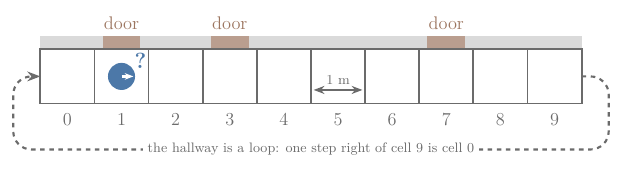
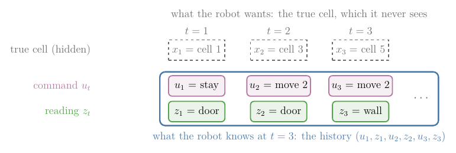
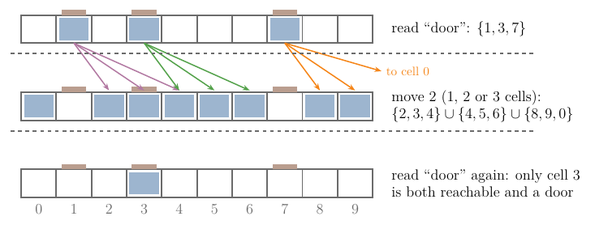
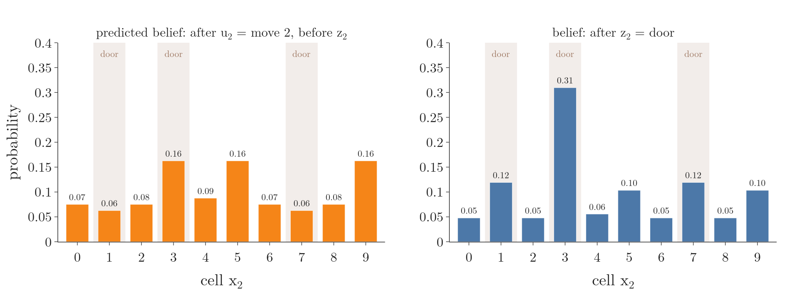
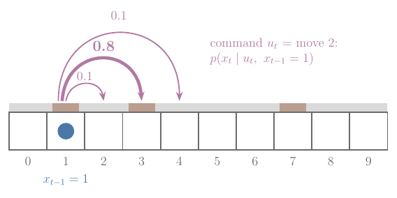
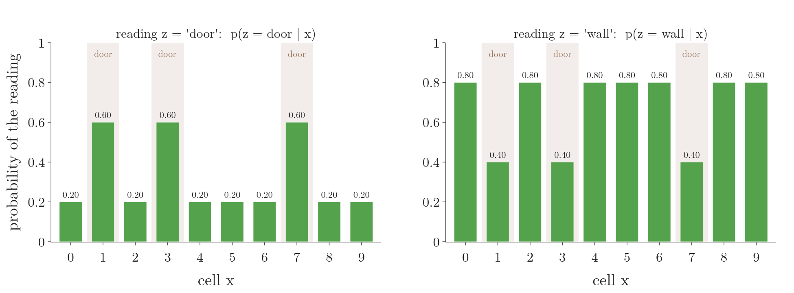
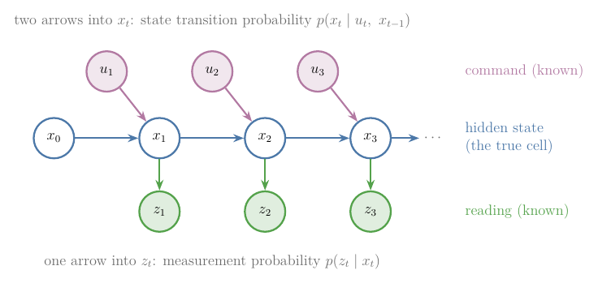

## 1. Overview

> **Key point:** A robot never sees its own position. What it can keep is a belief: a probability for every place it might be, computed from the commands it gave and the readings it got.

Figure 1 shows the world of this Note. A robot stands in a hallway of 10 cells, each 1 m long. The hallway is a loop: one step to the right of cell 9 is cell 0. There are doors in front of cells 1, 3 and 7, and all three look the same.

The robot has two things to go on:

- a **door sensor** that reads "door" or "wall", and is sometimes wrong;
- its **commands**, such as "move 2 cells to the right", which its wheels carry out only roughly.

The robot stands in cell 1, but nothing tells it so. A reading of "door" fits three cells. A move of "2 cells" may really be 1 or 3. So the question of this Note is: **what should the robot keep in memory about where it is, so that it can act sensibly?**

We answer it in steps:

- what the robot really knows: the list of its commands and readings (Section 2);
- a first summary of that list: the set of cells it could be in, and why a set is not enough (Section 3);
- a better summary: a probability for every cell, the belief (Section 4);
- the two probability tables that tell the robot how commands and readings change the belief (Section 5);
- one picture of how states, commands and readings depend on each other, the hidden Markov model (Section 6).

The [state](../RO-007-why-a-robot-is-never-sure/RO-007-why-a-robot-is-never-sure.md#41-state-from-one-number-to-many) is what the robot keeps track of, and the [commands and readings](../RO-007-why-a-robot-is-never-sure/RO-007-why-a-robot-is-never-sure.md#51-measurements-and-controls) are the two streams of data it receives. Here the state $x_t$ is the robot's cell at time $t$, the command is $u_t$ and the reading is $z_t$.

## 2. What the robot knows: its history

> **Key point:** The robot cannot know its true cell. It can only know the commands it gave and the readings it got; that list is its information state.

### 2.1 Why the true cell is out of reach

The sensor reads "door" in front of three different cells, and it is sometimes wrong. The wheels slip, so the command "move 2" does not say exactly how far the robot went. Nothing the robot has ever received names its cell. Figure 2 sorts the pieces into what the robot cannot see (the top row) and what it can (the framed rows).

The robot's run in Figure 2 is the running example of this Note:

| Time $t$ | Command $u_t$ | Reading $z_t$ | True cell $x_t$ (hidden) |
|---|---|---|---|
| 1 | stay | door | 1 |
| 2 | move 2 | door | 3 |
| 3 | move 2 | wall | 5 |

### 2.2 The information state: everything the robot knows

The framed part of Figure 2 is everything the robot knows at time $t$: what it knew at the start, followed by every command and every reading so far. This list is the **information state** (G-2431), also called the history information state (LaValle §11.1.2). At time 2 it is:

$$\eta_2 = (u_1,\ z_1,\ u_2,\ z_2)$$

$$\eta_2 = (\text{stay},\ \text{door},\ \text{move 2},\ \text{door})$$

The Greek letter $\eta$ (eta) is LaValle's name for it. Each new step adds one command and one reading:

$$\eta_t = (\eta_{t-1},\ u_t,\ z_t)$$

Why give the list a name? Because it is the only thing a robot's decisions can be based on. A rule such as "if you think you are at the second door, open it" has to be a rule on what the robot knows, not on its true cell, which it never sees (LaValle §11.1.3).

The trouble with the list is its length. It grows by two entries every step and never shrinks. A robot that reads its sensor 10 times a second has, after one hour:

$$10 \times 3600 = 36{,}000 \text{ readings}$$

Storing and searching that whole list at every step is not practical. So we look for a short summary of the history that keeps everything the robot needs and throws away the rest (LaValle §11.2). Sections 3 and 4 give two such summaries.

## 3. Summary 1: the set of cells the robot could be in

> **Key point:** We can keep the set of cells that agree with every command and reading. A move turns each cell into all the cells it can reach; a reading keeps only the cells that agree with it. With a sensor that can be wrong, the set stops shrinking.

### 3.1 The set, step by step

Suppose for a moment that the sensor is never wrong. The reading "door" then means "one of the door cells". So after the first reading the robot can be in:

$$\lbrace1, 3, 7 \rbrace$$

Next, the command "move 2" moves the robot 1, 2 or 3 cells. Every cell of the set becomes all the cells it can reach, and we collect them together (Figure 3, middle row). The symbol $\cup$ (union) means "all cells in either set":

$$\lbrace2,3,4\rbrace\cup \lbrace4,5,6\rbrace\cup \lbrace8,9,0\rbrace$$

$$= \lbrace0, 2, 3, 4, 5, 6, 8, 9 \rbrace$$

The second reading "door" keeps only the cells of this set that are doors. The symbol $\cap$ (intersection) means "cells in both sets":

$$\lbrace0, 2, 3, 4, 5, 6, 8, 9 \rbrace\cap \lbrace1, 3, 7 \rbrace$$

$$= \lbrace3 \rbrace$$

Figure 3 shows the three sets. Only cell 3 can be reached from a door by one move and is itself a door, so the robot knows exactly where it is. This set of possible states is the **nondeterministic information state** (G-2432), also called the set-valued information state (LaValle §11.2.2). It is far shorter than the history: at most 10 cells, however long the robot runs. LaValle gives the two rules in general form, with $F(x, u)$ the set of cells that command $u$ can lead to from cell $x$, and $H(z)$ the set of cells where reading $z$ is possible:

$$\text{after a move: } \bigcup_{x \in S} F(x, u)$$

$$\text{after a reading: } S \cap H(z)$$

Here $S$ is the set before the step.

### 3.2 Why a set is not enough

Now use the real sensor, which reads "door" at a wall 20 percent of the time. A reading of "door" is then possible in every cell, so $H(\text{door})$ is the whole hallway, and the intersection removes nothing:

$$S \cap \lbrace0, 1, \ldots, 9 \rbrace= S$$

The set never shrinks, however many readings arrive. Crossing places out only works for a perfect sensor, for the reason shown in [why noisy sensors forbid crossing places out](../RO-007-why-a-robot-is-never-sure/RO-007-why-a-robot-is-never-sure.md#33-why-noisy-sensors-forbid-crossing-places-out): a wrong reading would cross out the true cell. The set also cannot say that cell 3 fits the readings much better than cell 9: both are simply "possible". We need a summary that keeps a **number** for every cell, saying how strongly the readings point to it. Probabilities are that number.

## 4. Summary 2: a probability for every cell

> **Key point:** The belief gives every cell the probability that the robot is there, given its whole history. A reading sharpens it; a move shifts it and blurs it.

### 4.1 The belief, as a picture

Instead of "possible" or "impossible", the robot keeps one probability for each of the 10 cells. Together they form a [probability distribution](../../../../MA/03-distributions/MA-020-random-variables-and-distributions/MA-020-random-variables-and-distributions.md#3-probability-distributions-as-tables) (a list of every outcome with its probability, adding to 1). Figure 4 plays the running example.

What to watch in each stage:

1. **No idea yet.** The robot has no reason to prefer any cell, so each gets the same share:

   $$
   \frac{1}{10} = 0.1
   $$

2. **Reads "door".** The three door cells grow and the seven wall cells shrink. The wall cells do not drop to zero, because the sensor reads "door" at a wall 20 percent of the time.
3. **Moves 2 cells.** Every bump moves 2 cells to the right, with the robot.
4. **The move is uncertain.** The move may have been 1 or 3 cells, so each bump spreads onto its neighbours and gets lower (0.19 becomes 0.16).
5. **Reads "door" again.** Only the bump at cell 3 sits on a door, so it grows to 0.31 while the others shrink. The tallest bar is the true cell.

Why do the door cells get 0.19 in stage 2? The sensor reads "door" three times as often at a door as at a wall:

$$\frac{0.6}{0.2} = 3$$

So each door cell keeps 3 shares of belief for every 1 share of a wall cell, the same [weighting instead of crossing out](../RO-007-why-a-robot-is-never-sure/RO-007-why-a-robot-is-never-sure.md#33-why-noisy-sensors-forbid-crossing-places-out) as for any noisy sensor. There are 3 door cells and 7 wall cells:

$$3 \times 3 + 7 \times 1 = 16 \text{ shares}$$

$$\text{door cell: } 3/16 = 0.1875$$

$$\text{wall cell: } 1/16 = 0.0625$$

The figure shows 0.1875 rounded to 0.19. The exact rule behind this share-counting is Bayes' theorem, applied at every reading by the [correction step](../RO-014-bayes-filter/RO-014-bayes-filter.md#43-the-correction-step).

### 4.2 The definition

The robot's probability for each cell, given everything it knows, is its **belief** (G-2433). Written out:

$$\text{bel}(x_t) = p(x_t \mid z_{1:t},\ u_{1:t})$$

Each symbol:

- $x_t$ is the cell at time $t$; the belief has one value for every possible cell;
- $z_{1:t}$ means all readings from time 1 to $t$, here $(z_1, z_2) = (\text{door}, \text{door})$ at $t = 2$;
- $u_{1:t}$ means all commands from time 1 to $t$, here $(\text{stay}, \text{move 2})$;
- the bar $\mid$ is read "given", as in a [conditional probability](../../../../MA/02-probability/MA-015-conditional-probability/MA-015-conditional-probability.md#2-the-definition).

The right-hand side conditions on $z_{1:t}$ and $u_{1:t}$: exactly the information state of Section 2.2. So the belief is a summary of the history, made of 10 numbers however long the history grows (PR §2.3.4). At $t = 2$ in our run:

$$\text{bel}(x_2 = 3) = 0.31$$

$$\text{bel}(x_2 = 9) = 0.10$$

Unlike the set of Section 3, the belief says that cell 3 fits the readings three times better than cell 9.

### 4.3 A belief is not a position

The robot is always in exactly one cell. A belief of 0.19 on three cells does not mean the robot is spread over three places; it means the robot does not know which of the three it is in (Labbe ch.2). The belief describes the robot's **knowledge**, not the world. That is why the arrow for the true cell and the bars in Figure 4 are drawn separately: the bars can be wrong, and the true cell does not care.

### 4.4 Why the whole history appears in the definition

The definition conditions on every command and reading since the start, which looks like the long list we wanted to avoid. It is there because the robot does not know its earlier cells either: if it knew $x_{t-1}$, that one cell plus the latest command and reading would be enough, but it only has the history (PR §2.3.4). The [derivation of the Bayes filter](../RO-014-bayes-filter/RO-014-bayes-filter.md#5-why-the-two-steps-give-the-exact-belief) shows that the belief can still be computed step by step from the previous belief alone, so the robot never stores the history itself.

### 4.5 The predicted belief: after the move, before the reading

> **Key point:** The predicted belief is the belief after the latest command but before the latest reading. Commands lose knowledge, readings gain it, so we track the belief between the two.

The two kinds of event act in opposite directions, as [moving and sensing](../RO-007-why-a-robot-is-never-sure/RO-007-why-a-robot-is-never-sure.md#6-moving-makes-the-robot-less-sure-sensing-makes-it-more-sure) showed. A move adds doubt, because the robot cannot be sure how far it went. A reading removes doubt, because it rules places in or out. So it pays to look at the belief halfway through a step: after the command $u_t$, before the reading $z_t$. This is the **predicted belief** (G-2436), written with a bar:

$$\overline{\text{bel}}(x_t) = p(x_t \mid z_{1:t-1},\ u_{1:t})$$

The only difference from $\text{bel}(x_t)$ is that the last reading $z_t$ is missing from the right-hand side (PR §2.3.4). Figure 5 shows both at $t = 2$.

Follow the tallest bar through time 2:

$$\text{bel}(x_1 = 1) = 0.1875$$

$$\overline{\text{bel}}(x_2 = 3) = 0.1625$$

$$\text{bel}(x_2 = 3) = 0.3095$$

The move lowered it, the reading raised it. The [Bayes filter](../RO-014-bayes-filter/RO-014-bayes-filter.md#44-the-algorithm) gives the two rules behind these numbers, and the [histogram filter](../RO-015-grid-filters/RO-015-grid-filters.md#2-the-histogram-filter) computes them cell by cell.

## 5. The two tables that drive the belief

> **Key point:** Two probability tables are all the robot needs: how a command moves it (the state transition probability) and what the sensor reads in each place (the measurement probability).

To update its belief, the robot must know two things about itself. Both are probability tables measured or modelled in advance.

### 5.1 How a command moves the robot: the state transition probability

The command "move 2" does not always move the robot 2 cells. Suppose tests on the real hallway show it moves:

| Cells moved | 1 | 2 | 3 |
|---|---|---|---|
| Probability | 0.1 | 0.8 | 0.1 |

Figure 6 draws the three outcomes from cell 1.

The probability of landing in cell $x_t$, given the command $u_t$ and the previous cell $x_{t-1}$, is the **state transition probability** (G-2434) (PR §2.3.3):

$$p(x_t \mid u_t,\ x_{t-1})$$

From Figure 6:

$$p(x_t = 3 \mid \text{move 2},\ x_{t-1} = 1) = 0.8$$

$$p(x_t = 2 \mid \text{move 2},\ x_{t-1} = 1) = 0.1$$

The robot ends somewhere, so the three outcomes add to 1:

$$0.1 + 0.8 + 0.1 = 1$$

Why only $u_t$ and $x_{t-1}$, and not the whole past? If the state is complete, the current cell and the command already contain everything that affects the next cell; how the robot got to cell 1 does not matter (the [complete state](../RO-007-why-a-robot-is-never-sure/RO-007-why-a-robot-is-never-sure.md#43-complete-state-and-the-markov-property)). This is the Markov property applied to motion (PR §2.3.3).

Why is the reading $z_t$ not in it? A reading does not move the robot. It helps us **guess** where the robot went, but it does not **cause** where it went. The transition probability describes the robot itself, not our guessing (PR §2.3.3).

For a real wheeled robot, $x_t$ is a pose and the table becomes a probability density over poses: the [motion model](../RO-008-probabilistic-motion-models/RO-008-probabilistic-motion-models.md#22-the-motion-model-and-its-density). Here the hallway keeps it a small table.

**A small piece of maths: Markov chains.** A sequence of states where the next state depends only on the current one is a **Markov chain** (G-2437) (CS188 §8.1). Our robot repeating "move 2" without looking is one. Its transition probabilities fit in a table with one row per "from" cell and one column per "to" cell, the **transition matrix** (G-2438). Row 1 of our 10 × 10 transition matrix, with columns for cells 0 to 9, is:

$$(0,\ 0,\ 0.1,\ 0.8,\ 0.1,\ 0,\ 0,\ 0,\ 0,\ 0)$$

Every row has the same three numbers, shifted to start at its own cell. Every row adds to 1, because from any cell the robot ends somewhere.

### 5.2 What the sensor reads in each place: the measurement probability

The door sensor is not perfect either. Suppose tests show:

| True cell | p(reads "door") | p(reads "wall") |
|---|---|---|
| a door cell (1, 3, 7) | 0.6 | 0.4 |
| a wall cell (all others) | 0.2 | 0.8 |

Figure 7 draws both columns for all 10 cells.

The probability of a reading $z_t$ given the true cell $x_t$ is the **measurement probability** (G-2435) (PR §2.3.3):

$$p(z_t \mid x_t)$$

From the table:

$$p(z = \text{door} \mid x = 3) = 0.6$$

$$p(z = \text{door} \mid x = 4) = 0.2$$

In each cell, the two readings add to 1:

$$0.6 + 0.4 = 1$$

Why does it depend on $x_t$ alone? Once the true cell is known, how the robot got there and what it read before tell us nothing more about what it will read now (PR §2.3.3). This is the [Markov property](../RO-007-why-a-robot-is-never-sure/RO-007-why-a-robot-is-never-sure.md#43-complete-state-and-the-markov-property) applied to readings.

Why do we write $p(z \mid x)$, reading given place, and not $p(x \mid z)$, place given reading? Because $p(z \mid x)$ is the one we can measure. We park the robot in front of a door 100 times and count how often it reads "door"; doing the same at a wall gives the other row. This direction, from cause to effect, is easy to collect; the other direction, from effect back to cause, is what Bayes' theorem computes from it (Labbe ch.2). For a real range sensor the table becomes the [beam model](../RO-010-range-sensors-beam-model/RO-010-range-sensors-beam-model.md#51-the-mixture).

> **Extra:** These are the same numbers as the door sensor in Thrun's door world, the running example of the [Bayes filter](../RO-014-bayes-filter/RO-014-bayes-filter.md#2-the-door-world): there, the sensor reads "open" with probability 0.6 when the door is open and 0.2 when it is closed (PR §2.4.2). Keeping them equal lets the two Notes share one sensor.

## 6. The whole picture: the hidden Markov model

> **Key point:** States form a hidden Markov chain driven by the commands; each reading depends only on its own state. Drawn as a graph, this is a dynamic Bayes network, and the probability of a whole story is a product of one factor per arrow.

### 6.1 A small piece of maths: Bayesian networks

Many probability models are easiest to read as a drawing. Each variable is a circle. Arrows go into a variable from the variables its probability depends on directly; in robot models they usually run from cause to effect. Each variable then needs only one table: its probability given the variables with arrows into it, its **parents**. Such a drawing is a **Bayesian network** (G-2442) (CS188 §6.3). The probability of all variables together is the product of these tables, one per circle.

Why a product? The [chain rule of probability](../../../../ML/07-classification/ML-082-naive-bayes-maths/ML-082-naive-bayes-maths.md#4-step-2-the-chain-rule) (G-369) always writes a joint probability as a product of conditional probabilities. The missing arrows say which conditions can be dropped, so each factor shrinks to "given my parents" (CS188 §6.3).

### 6.2 The robot as a dynamic Bayes network

Figure 8 draws our robot this way, one column per time step.

Reading the arrows:

- two arrows point into $x_t$, from $x_{t-1}$ and from $u_t$: its table is the state transition probability $p(x_t \mid u_t, x_{t-1})$ of Section 5.1;
- one arrow points into $z_t$, from $x_t$: its table is the measurement probability $p(z_t \mid x_t)$ of Section 5.2;
- no arrow goes from $z_1$ to $z_2$: given the cells, one reading says nothing about another;
- the shaded circles are what the robot knows (its information state); the white ones are hidden.

A Bayesian network that repeats the same columns over time is a **dynamic Bayes network** (G-2441) (PR §2.3.3). Every robot state estimator in this chapter rests on this one drawing.

### 6.3 Hidden Markov model

Remove the commands from Figure 8 and a well-known model is left: a Markov chain whose states are hidden, each state producing a reading we can see. This is a **hidden Markov model** (G-2439), or HMM (CS188 §8.2). Speech recognition and weather tracking use the same model; in robotics the hidden state is the robot's place and the reading is its sensor.

HMM texts use their own words for the two tables:

| Robotics name | HMM name | In our hallway |
|---|---|---|
| state transition probability | transition probability | 0.1, 0.8, 0.1 |
| measurement probability | emission probability | 0.6 or 0.2 for "door" |

Written as a table with one row per state and one column per possible reading, the emission probabilities form the **emission matrix** (G-2440). For our hallway it has 10 rows; the two kinds of row are the two rows of the table in Section 5.2. With the commands added back, the robot's model is an HMM whose transitions depend on the command; Thrun calls this the dynamic Bayes network of the robot and its environment (PR §2.3.3).

### 6.4 The probability of one whole story

A **story** here is one full guess at the hidden cells, together with the commands and readings. The network says its probability is a product with one factor per arrow, plus the starting belief. For two time steps:

$$p(x_{0:2}, z_{1:2} \mid u_{1:2}) = p(x_0)$$

$$\times\ p(x_1 \mid u_1, x_0)\ p(z_1 \mid x_1)$$

$$\times\ p(x_2 \mid u_2, x_1)\ p(z_2 \mid x_2)$$

**The true story.** The robot starts in cell 1, stays, reads "door", moves to cell 3, reads "door". One factor per line:

$$p(x_0 = 1) = 0.1$$

$$p(x_1 = 1 \mid \text{stay},\ x_0 = 1) = 1$$

$$p(\text{door} \mid x_1 = 1) = 0.6$$

$$p(x_2 = 3 \mid \text{move 2},\ x_1 = 1) = 0.8$$

$$p(\text{door} \mid x_2 = 3) = 0.6$$

The product:

$$0.1 \times 1 \times 0.6 \times 0.8 \times 0.6$$

$$= 0.0288$$

**A rival story.** Start in cell 7 (also a door), stay, move to cell 9. Every factor is the same except the last one, because cell 9 is a wall:

$$p(\text{door} \mid x_2 = 9) = 0.2$$

$$0.1 \times 1 \times 0.6 \times 0.8 \times 0.2$$

$$= 0.0096$$

The true story is three times as probable as the rival, for the same reason as in Section 4.1: the second reading fits a door three times better than a wall.

This product is what ties the belief to the model. Add up the probabilities of all stories that end in cell 3, and divide by the sum over all stories; the notebook does this for all 1000 stories of three cells:

$$\text{stories ending in cell 3: } 0.0312$$

$$\text{all stories: } 0.1008$$

$$0.0312 / 0.1008 = 0.3095$$

That is $\text{bel}(x_2 = 3)$ from Figure 5. So the belief is the share of all story probability that ends in each cell. Adding up 1000 stories works for 2 steps but not for 200; the [Bayes filter](../RO-014-bayes-filter/RO-014-bayes-filter.md#44-the-algorithm) gets the same numbers with one short update per step, and the [grid filters](../RO-015-grid-filters/RO-015-grid-filters.md#53-the-most-likely-path-the-viterbi-algorithm) also find the single most probable story.

The notebook `RO-013-belief.ipynb` checks every number in this Note and lets us try other reading sequences.

## 7. Summary

| What the robot keeps | Size | After a move | After a reading | Weakness |
|---|---|---|---|---|
| History (information state) | grows every step | add $u_t$ | add $z_t$ | too long to keep |
| Set of possible cells | at most 10 cells | union of reachable cells | keep cells that fit | stops shrinking with a sensor that can be wrong; no "how likely" |
| Belief | 10 probabilities | shift and spread | multiply up the cells that fit, then rescale | needs the two tables of Section 5 |

- The robot cannot see its true cell; it only knows its commands and readings, so every decision must be based on that history, the information state.
- The history grows forever, so we keep a summary of it: the set of possible cells is short, but a sensor that can be wrong makes every cell possible, so the set stops shrinking.
- The belief keeps one probability per cell given the whole history, so it can say that cell 3 fits the readings three times better than cell 9.
- A belief describes the robot's knowledge, not its position, because the robot is always in exactly one cell.
- The predicted belief is taken after the command and before the reading, because a move adds doubt and a reading removes it.
- The state transition probability $p(x_t \mid u_t, x_{t-1})$ and the measurement probability $p(z_t \mid x_t)$ are all the robot needs, because a complete state makes the past irrelevant once the current cell is known.
- Drawn as a dynamic Bayes network (a hidden Markov model with commands), the probability of a whole story is a product of one factor per arrow, so the belief is the share of all story probability that ends in each cell.

So the answer to the opening question: the robot should keep its belief. It is short, it loses nothing the robot needs from its history, and it says how strongly the readings point to each cell.

## 8. Sources

**Built from**

- Udacity, Artificial Intelligence for Robotics, lesson 1 "Localization", introduction (video titled in Korean, "Total probability"; English audio), YouTube, https://www.youtube.com/watch?v=n1EacrqyCs8
- Francisco Iacobelli, "bayesianBeliefHMMRobotics", YouTube, https://www.youtube.com/watch?v=BDjJzCHMv28
- Normalized Nerd, "Hidden Markov Model Clearly Explained! Part - 5", YouTube, https://www.youtube.com/watch?v=RWkHJnFj5rY
- NPTEL IIT Madras, "Introduction to Robotics: Introduction to Probabilistic Robotics" (#28), YouTube, https://www.youtube.com/watch?v=j7BVHy231B0
- NPTEL IIT Madras, "Introduction to Robotics: Recursive State Estimation, Bayes Filter" (#29), YouTube, https://www.youtube.com/watch?v=v0FJhNy6Fh0
- LaValle, S. M. (2006). *Planning Algorithms*. Cambridge University Press. §11.1.2 history information states, §11.1.3 plans on the information space, §11.2 derived information spaces, §11.2.2 nondeterministic information spaces. Free online: https://lavalle.pl/planning/node542.html and https://lavalle.pl/planning/node551.html (LaValle)
- DeNero, J., Klein, D. et al. *CS 188: Introduction to Artificial Intelligence*, online textbook, UC Berkeley. §6.3 Bayesian network representation, §8.1 Markov models, §8.2 hidden Markov models. https://inst.eecs.berkeley.edu/~cs188/textbook/hmms/hmm.html (CS188)
- Labbe, R. *Kalman and Bayesian Filters in Python*, ch.2 "Discrete Bayes Filter" ("Tracking a Dog" to "Noisy Sensors"). https://github.com/rlabbe/Kalman-and-Bayesian-Filters-in-Python/blob/master/02-Discrete-Bayes.ipynb (Labbe ch.2)

**Other references**

- Thrun, S., Burgard, W. and Fox, D. (2005). *Probabilistic Robotics*. MIT Press. §2.3.3 state transition and measurement probabilities and the dynamic Bayes network, §2.3.4 belief distributions, §2.4.2 the door example. Cited only where the free sources above say the same (PR)

## 9. Key terms

Terms taught in this Note come first; linked terms are recaps, taught in the Note the link opens.

| Term | Meaning |
|---|---|
| Information state (history) (G-2431) | Everything a robot knows at time t: its starting knowledge plus every command and every reading so far, such as (stay, door, move 2, door); every decision must be based on it, because the true state is never seen. |
| Nondeterministic (set-valued) information state (G-2432) | The set of states that agree with every command and reading so far, such as cells {1, 3, 7} after reading "door"; a move replaces it by all reachable states, a reading keeps only the states that fit, but it says nothing about how likely each state is. |
| Belief (G-2433) | The robot's probability for each possible state given all its commands and readings, $\text{bel}(x_t) = p(x_t \mid z_{1:t}, u_{1:t})$; a short summary of the history that says how strongly the evidence points to each state. |
| Predicted belief (G-2436) | The belief after the latest command but before the latest reading, $\overline{\text{bel}}(x_t) = p(x_t \mid z_{1:t-1}, u_{1:t})$; it separates the doubt a move adds from the knowledge a reading brings. |
| State transition probability (G-2434) | The probability of the next state given the command and the previous state, $p(x_t \mid u_t, x_{t-1})$, such as 0.8 for "move 2" taking the robot from cell 1 to cell 3; it tells the robot how a command changes where it is. |
| Markov chain (G-2437) | A sequence of random states in which the next state depends only on the current one, not on earlier ones, such as a robot repeating "move 2"; it lets a whole sequence be described by one table of transition probabilities. |
| Transition matrix (G-2438) | A table of a Markov chain's transition probabilities, one row per "from" state and one column per "to" state, each row adding to 1; it stores in one place how the state moves. |
| Measurement probability (G-2435) | The probability of a sensor reading given the true state, $p(z_t \mid x_t)$, such as 0.6 for reading "door" in front of a door; it tells the robot how well each state explains a reading. |
| Bayesian network (G-2442) | A drawing of random variables as circles with arrows into each from the variables it depends on directly (its parents), plus one table per variable giving its probability given its parents; the probability of all variables together is the product of those tables. |
| Dynamic Bayes network (G-2441) | A Bayesian network that repeats the same variables at every time step, such as states, commands and readings of a robot; it shows which variable depends on which over time, so a whole run's probability splits into small factors. |
| Hidden Markov model (HMM) (G-2439) | A Markov chain whose states cannot be seen, where each state produces an observation that can, such as hidden robot cells producing "door" or "wall" readings; it is the model behind robot state estimation, speech recognition and many trackers. |
| Emission probability (emission matrix) (G-2440) | The HMM name for the measurement probability: the probability of each observation given each hidden state, stored as a table with one row per state and one column per observation; it links what is seen to what is hidden. |
| [Chain rule of probability](../../../../ML/07-classification/ML-082-naive-bayes-maths/ML-082-naive-bayes-maths.md#4-step-2-the-chain-rule) (G-369) | Writing a joint probability as a product of conditional probabilities, one variable at a time. |
