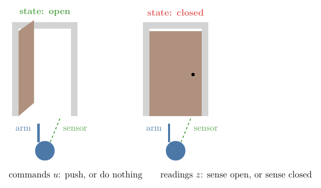
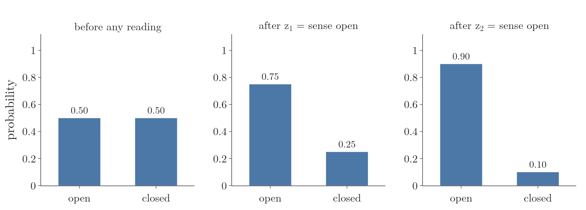
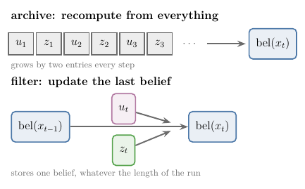
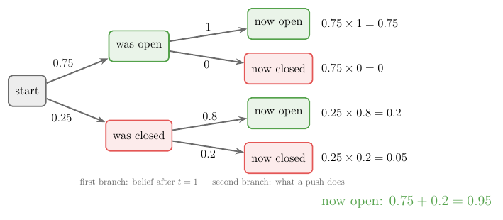
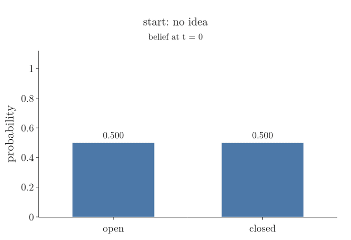
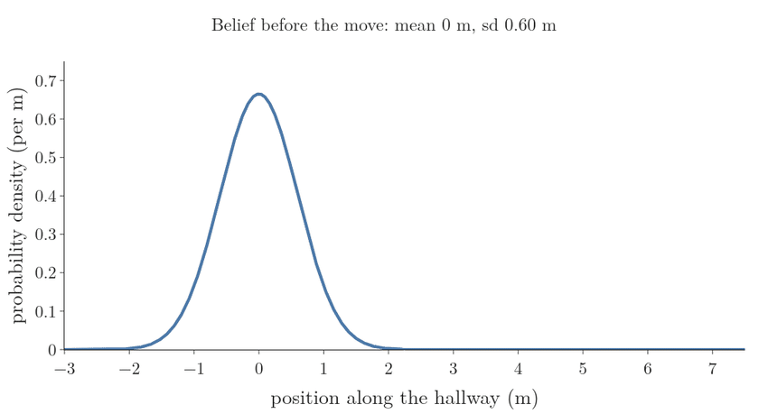
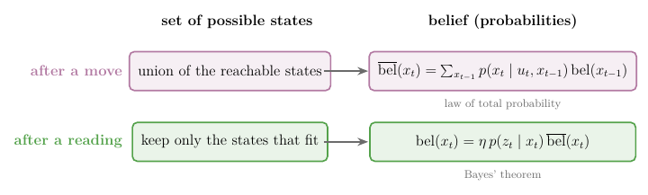

## 1. Overview

> **Key point:** The Bayes filter updates a robot's belief one step at a time: a prediction step pushes the belief through the motion model after each command, and a correction step multiplies it by the measurement probability after each reading. The robot never needs to store its history.

A phone's map shows a blue dot for where we are. Sometimes the dot jumps two streets sideways and back, while we stand still. The phone stored one best guess, and nothing in that one number said how sure it was. A robot that keeps a [belief](../RO-013-belief/RO-013-belief.md#42-the-definition) (a probability for every possible state) carries its own doubt with it: a sharp belief says "I know", a wide one says "I am lost".

The belief has a cost. By its definition it depends on every command and every reading since the robot started, a list that grows forever. This Note answers the question: **how can a robot keep its belief up to date at every step, using only the newest command and the newest reading?**



We work on Thrun's door world (Figure 1), small enough to compute by hand (PR §2.4.2):

- one reading at a time, with Bayes' theorem that remembers earlier readings (Section 3);
- the filter itself, a prediction step and a correction step, worked on the door (Section 4);
- why the two steps give the exact belief, and which three assumptions that needs (Section 5);
- the same two steps on a continuous position, where sums become integrals (Section 6);
- why the belief is all the robot needs to keep (Section 7), and which famous filters are this one in disguise (Section 8).

## 2. The door world

> **Key point:** One state (the door, open or closed), two commands (push, do nothing), one noisy sensor. Its two probability tables are all the filter needs.

The **state** $x_t$ is the door at time $t$: open or closed. The robot does not know it. The two tables of [belief](../RO-013-belief/RO-013-belief.md#5-the-two-tables-that-drive-the-belief) describe the robot (PR §2.4.2).

**The measurement probability** $p(z_t \mid x_t)$: the sensor reads "open" or "closed", and is sometimes wrong.

| True door | p(sense open) | p(sense closed) |
|---|---|---|
| open | 0.6 | 0.4 |
| closed | 0.2 | 0.8 |

These are the same numbers as the door sensor of the [hallway](../RO-013-belief/RO-013-belief.md#52-what-the-sensor-reads-in-each-place-the-measurement-probability).

**The state transition probability** $p(x_t \mid u_t, x_{t-1})$: the robot can push the door or do nothing.

| Command | Door before | p(open after) | p(closed after) |
|---|---|---|---|
| push | open | 1 | 0 |
| push | closed | 0.8 | 0.2 |
| do nothing | open | 1 | 0 |
| do nothing | closed | 0 | 1 |

A push on a closed door fails one time in five, because the door is heavy. Doing nothing changes nothing.

**The start.** The robot has no idea, so its first belief is:

$$\text{bel}(x_0 = \text{open}) = 0.5$$

$$\text{bel}(x_0 = \text{closed}) = 0.5$$

**The run.** At $t = 1$ the robot does nothing and senses "open". At $t = 2$ it pushes and senses "open" again. We want its belief after each step.

## 3. One reading at a time: Bayes' theorem with past readings

> **Key point:** Bayes' theorem turns "how likely is this reading in each state" into "how likely is each state given the reading". Applied again with the first answer as the new prior, it adds a second reading, provided the readings are independent once the state is known.

### 3.1 Why the robot needs Bayes' theorem

For now, nobody touches the door; the robot only reads. Its table tells it $p(z \mid x)$: how often the sensor reads "open" for each kind of door. The robot needs the other direction, $p(x \mid z)$: given the reading, how likely is each kind of door? [Bayes' theorem](../../../../MA/02-probability/MA-018-bayes-theorem/MA-018-bayes-theorem.md#4-the-formula-and-its-proof) (G-269) turns one into the other:

$$p(x \mid z) = \frac{p(z \mid x)\ p(x)}{p(z)}$$

**First reading, "sense open".** Multiply each prior by how well that door explains the reading:

$$\text{open: } 0.6 \times 0.5 = 0.3$$

$$\text{closed: } 0.2 \times 0.5 = 0.1$$

The two products are not yet probabilities, because they add to 0.4, not 1. Their sum is the [evidence](../../../../MA/02-probability/MA-018-bayes-theorem/MA-018-bayes-theorem.md#3-the-names-of-the-four-parts) (G-718) $p(z)$, the overall chance of the reading, by the [law of total probability](../../../../MA/02-probability/MA-019-bayes-problem/MA-019-bayes-problem.md#4-the-evidence-total-probability) (G-1053). Divide by it:

$$p(\text{open} \mid z_1) = 0.3 / 0.4 = 0.75$$

$$p(\text{closed} \mid z_1) = 0.1 / 0.4 = 0.25$$

Dividing by the sum is the same as multiplying by its inverse, written $\eta$ (eta):

$$\eta = 1 / 0.4 = 2.5$$

This number is the **normaliser** (G-2382): whatever factor makes the products add to 1, the same job it does for the [cut bell of the beam model](../RO-010-range-sensors-beam-model/RO-010-range-sensors-beam-model.md#41-measurement-noise-a-bell-around-the-expected-range). We never need $p(z)$ from anywhere else, because it is always the sum of the products (PR §2.2).

### 3.2 A second reading: Bayes' theorem with background knowledge

One reading leaves a 0.25 chance of a closed door. To be surer, the robot reads again and again gets "open". Now the belief must depend on both readings. Bayes' theorem still works if every term also carries the earlier readings behind the bar. With $C$ standing for that background knowledge:

$$p(x \mid z, C) = \frac{p(z \mid x, C)\ p(x \mid C)}{p(z \mid C)}$$

This is **Bayes' rule with background knowledge** (G-2452) (PR §2.2). It holds for the same reason as the plain rule: the joint probability of $x$ and $z$ given $C$ can be split two ways by the [multiplication rule](../../../../MA/02-probability/MA-015-conditional-probability/MA-015-conditional-probability.md#5-the-multiplication-rule) (G-2212), and setting the two equal gives the formula.

With $x$ the door, $z = z_2$ and $C = z_1$, two of the terms are known:

- $p(x \mid z_1)$ is the answer of Section 3.1: the old posterior becomes the new prior;
- $p(z_2 \mid x, z_1)$ asks how likely the second reading is, given the door **and** the first reading.

Here the robot makes an assumption: **once the state of the door is known, the first reading tells nothing more about the second.** Each reading is the door plus its own independent sensor noise. So:

$$p(z_2 \mid x, z_1) = p(z_2 \mid x)$$

This is [conditional independence](../../../../ML/07-classification/ML-082-naive-bayes-maths/ML-082-naive-bayes-maths.md#5-step-3-the-naive-assumption) (G-443): independence that holds **given** the state. It does not say that the two readings are independent on their own. They are not, as the robot's own numbers show:

$$p(z_2 = \text{open}) = 0.6 \times 0.5 + 0.2 \times 0.5$$

$$= 0.4$$

$$p(z_2 = \text{open} \mid z_1 = \text{open})$$

$$= 0.6 \times 0.75 + 0.2 \times 0.25 = 0.5$$

A first "open" makes a second "open" more likely (0.5 instead of 0.4), because it makes an open door more likely. Only when the door is known does that link disappear.

**Second reading, "sense open".** Same recipe, with 0.75 and 0.25 as the prior:

$$\text{open: } 0.6 \times 0.75 = 0.45$$

$$\text{closed: } 0.2 \times 0.25 = 0.05$$

$$\eta = 1 / (0.45 + 0.05) = 2$$

$$p(\text{open} \mid z_1, z_2) = 0.9$$

$$p(\text{closed} \mid z_1, z_2) = 0.1$$



Figure 2 shows the belief growing with each reading. The robot never went back to the first reading: it reused its answer. That reuse is the whole idea of a filter.

## 4. The Bayes filter: predict, then correct

> **Key point:** Each step has two parts. Prediction: after the command, add up every way of reaching each state. Correction: after the reading, multiply by the measurement probability and rescale.

### 4.1 Why a moving world needs a second step

Section 3 assumed nothing changes the door. Once the robot pushes, the door may change between readings, and a robot that drives changes its own position. The belief must now follow two kinds of event: commands, which change the state and add doubt, and readings, which add knowledge (see the [predicted belief](../RO-013-belief/RO-013-belief.md#45-the-predicted-belief-after-the-move-before-the-reading)).

The honest way to know the belief is to recompute it from the whole history at every step (Figure 3, top). That is an archive, not a filter: after an hour at 10 readings a second, it holds 36,000 readings and keeps growing. The Bayes filter keeps only the last belief and updates it with the newest command and reading (Figure 3, bottom). Updating a belief from the previous belief in this way is **recursive state estimation** (G-2450) (PR §2.4).



### 4.2 The prediction step

After the command, before the reading, the robot wants its [predicted belief](../RO-013-belief/RO-013-belief.md#45-the-predicted-belief-after-the-move-before-the-reading) $\overline{\text{bel}}(x_t)$. It does not know the previous state, so it considers every previous state, asks how likely the command takes it to $x_t$, and weights that by how much it believed in that previous state. Adding these up is the law of total probability:

$$\overline{\text{bel}}(x_t) = \sum_{x_{t-1}} p(x_t \mid u_t, x_{t-1})$$

$$\times\ \text{bel}(x_{t-1})$$

The sum runs over every possible previous state. This is the **prediction step** (G-2447), also called the motion update or time update (PR §2.4.1).

**At $t = 2$, the command is "push"**, and the belief after $t = 1$ is 0.75 open (Section 4.3 computes it). Figure 4 draws the four paths. Two of them end with the door open:

$$\overline{\text{bel}}(\text{open}) = 1 \times 0.75 + 0.8 \times 0.25$$

$$= 0.75 + 0.2 = 0.95$$

The other two end closed:

$$\overline{\text{bel}}(\text{closed}) = 0 \times 0.75 + 0.2 \times 0.25$$

$$= 0.05$$



The push raised the chance of an open door from 0.75 to 0.95 before the robot looked: it knows that pushing tends to open doors. At $t = 1$ the command was "do nothing", which keeps every door as it was, so the prediction changes nothing there:

$$\overline{\text{bel}}(\text{open}) = 1 \times 0.5 + 0 \times 0.5 = 0.5$$

$$\overline{\text{bel}}(\text{closed}) = 0 \times 0.5 + 1 \times 0.5 = 0.5$$

### 4.3 The correction step

After the reading, the robot applies Bayes' theorem of Section 3 to the predicted belief:

$$\text{bel}(x_t) = \eta\ p(z_t \mid x_t)\ \overline{\text{bel}}(x_t)$$

This is the **correction step** (G-2448), also called the measurement update (PR §2.4.1). It multiplies each state's predicted belief by how well that state explains the reading, then rescales with $\eta$ so the beliefs add to 1.

**At $t = 1$, the reading is "sense open":**

$$\text{open: } 0.6 \times 0.5 = 0.3$$

$$\text{closed: } 0.2 \times 0.5 = 0.1$$

$$\eta = 1 / 0.4 = 2.5$$

$$\text{bel}(x_1 = \text{open}) = 0.75$$

$$\text{bel}(x_1 = \text{closed}) = 0.25$$

**At $t = 2$, the reading is again "sense open":**

$$\text{open: } 0.6 \times 0.95 = 0.57$$

$$\text{closed: } 0.2 \times 0.05 = 0.01$$

$$\eta = 1 / 0.58 = 1.724$$

$$\text{bel}(x_2 = \text{open}) = 0.983$$

$$\text{bel}(x_2 = \text{closed}) = 0.017$$

These are Thrun's numbers for the same example (PR §2.4.2). Figure 5 plays the whole run.



### 4.4 The algorithm

Together the two steps are the **Bayes filter** (G-2446) (PR §2.4.1). For every possible state $x_t$:

1. **Predict:** $\overline{\text{bel}}(x_t) = \sum_{x_{t-1}} p(x_t \mid u_t, x_{t-1})\ \text{bel}(x_{t-1})$.
2. **Correct:** $\text{bel}(x_t) = \eta\ p(z_t \mid x_t)\ \overline{\text{bel}}(x_t)$.

Then return $\text{bel}(x_t)$ and wait for the next command and reading.

> **Python:** one step of the filter for a finite set of states.
> ```python
> import numpy as np
> T_push = np.array([[1.0, 0.0],    # from open: to open, closed
>                    [0.8, 0.2]])   # from closed
> p_z = np.array([0.6, 0.2])        # p(sense open | open, closed)
> bel = np.array([0.75, 0.25])      # belief after t = 1
> bel_bar = bel @ T_push            # predict: [0.95, 0.05]
> bel = p_z * bel_bar
> bel = bel / bel.sum()             # correct: [0.983, 0.017]
> ```

The matrix product `bel @ T_push` is the sum of the prediction step: entry $j$ adds belief times transition probability over every previous state $i$. The notebook `RO-014-bayes-filter.ipynb` runs both steps and checks every number above.

## 5. Why the two steps give the exact belief

> **Key point:** Starting from the definition of the belief, five steps lead to the filter: Bayes' rule, a Markov assumption for readings, the law of total probability, a Markov assumption for motion, and the assumption that the newest command says nothing about the past.

The two steps were built from intuition. Here we show that they give exactly $p(x_t \mid z_{1:t}, u_{1:t})$, the belief as defined, and we name every assumption on the way (PR §2.4.3). The notation $z_{1:t}$ means all readings $z_1, \ldots, z_t$, and $u_{1:t}$ all commands.

**Line 0, the definition.** Nothing is assumed:

$$\text{bel}(x_t) = p(x_t \mid z_{1:t},\ u_{1:t})$$

**Line 1, Bayes' rule with background knowledge.** Split the newest reading $z_t$ off from the rest; everything older is the background $C$ of Section 3.2. The denominator does not depend on $x_t$, so it becomes the normaliser $\eta$:

$$\text{bel}(x_t) = \eta\ p(z_t \mid x_t,\ z_{1:t-1},\ u_{1:t})$$

$$\times\ p(x_t \mid z_{1:t-1},\ u_{1:t})$$

This line is exact; it is a rule of probability.

**Line 2, the Markov assumption for readings.** If the state $x_t$ is known, the past readings and commands tell nothing more about the current reading. This is the same assumption as the door readings in Section 3.2, and the arrow structure of the [dynamic Bayes network](../RO-013-belief/RO-013-belief.md#62-the-robot-as-a-dynamic-bayes-network):

$$p(z_t \mid x_t,\ z_{1:t-1},\ u_{1:t}) = p(z_t \mid x_t)$$

The second factor of Line 1 is the predicted belief, by its definition. So:

$$\text{bel}(x_t) = \eta\ p(z_t \mid x_t)\ \overline{\text{bel}}(x_t)$$

That is the correction step. One assumption has paid for it: a history that grows forever dropped out of the measurement term.

**Line 3, the law of total probability.** We now unpack the predicted belief. We do not know where the robot was at $t - 1$, so we bring in every possible previous state and weight each by how likely it was. This introduces $x_{t-1}$ on purpose, to reach the previous belief:

$$\overline{\text{bel}}(x_t) = \sum_{x_{t-1}} p(x_t \mid x_{t-1},\ z_{1:t-1},\ u_{1:t})$$

$$\times\ p(x_{t-1} \mid z_{1:t-1},\ u_{1:t})$$

This line is exact.

**Line 4, the Markov assumption for motion.** If we know the previous state, the older readings and commands tell nothing more about where the newest command takes the robot; only $u_t$ still matters:

$$p(x_t \mid x_{t-1},\ z_{1:t-1},\ u_{1:t}) = p(x_t \mid u_t,\ x_{t-1})$$

**Line 5, the newest command does not tell us the past.** The last factor of Line 3 is the belief about $x_{t-1}$, except that it also knows $u_t$, the command given after time $t - 1$. We assume a command chosen now says nothing about where the robot was:

$$p(x_{t-1} \mid z_{1:t-1},\ u_{1:t}) = p(x_{t-1} \mid z_{1:t-1},\ u_{1:t-1})$$

$$= \text{bel}(x_{t-1})$$

This assumption can fail. A robot with collision avoidance never commands "drive 20 cm forward" while standing in front of a wall, so that command does tell us the robot was not at the wall. In most cases the command carries no such hint, and we drop it (PR §2.4.3).

**The result.** Putting Lines 4 and 5 into Line 3:

$$\overline{\text{bel}}(x_t) = \sum_{x_{t-1}} p(x_t \mid u_t,\ x_{t-1})$$

$$\times\ \text{bel}(x_{t-1})$$

That is the prediction step, and its last factor is the belief one step earlier: the formula refers to itself. That is why the robot only has to keep its last belief. The derivation used three assumptions:

1. readings depend only on the current state (Line 2);
2. the next state depends only on the previous state and the newest command (Line 4);
3. the newest command does not tell us about the previous state (Line 5).

The first two together are the [Markov property](../RO-007-why-a-robot-is-never-sure/RO-007-why-a-robot-is-never-sure.md#43-complete-state-and-the-markov-property) (PR §2.4.4): the current state is a complete summary of the past. When they hold, the Bayes filter is not an approximation; it gives the exact belief. When they fail, for example when people walk around a robot whose map does not include them, the readings are no longer independent given the robot's pose, and the filter can become overconfident (PR §2.4.4; Fox 1999).

## 6. The same two steps on a continuous position

> **Key point:** For a position that can take any value, the sum of the prediction step becomes an integral. When the beliefs are Gaussian, prediction always widens the belief and correction always narrows it, even below the width of the reading.

Positions in a real hallway are not 2 door states but any number of metres. The belief becomes a [probability density](../../../../MA/03-distributions/MA-022-pdf-and-continuous-cdf/MA-022-pdf-and-continuous-cdf.md#5-what-the-density-at-a-point-means) (G-1569), and the sum over previous states becomes an [integral](../../../../MA/03-distributions/MA-022-pdf-and-continuous-cdf/MA-022-pdf-and-continuous-cdf.md#3-area-under-the-curve-is-probability) (G-957), a sum over infinitely many thin slices:

$$\overline{\text{bel}}(x_t) = \int p(x_t \mid u_t,\ x_{t-1})$$

$$\times\ \text{bel}(x_{t-1})\ dx_{t-1}$$

The correction step is unchanged: multiply by $p(z_t \mid x_t)$ and rescale so the area under the curve is 1 (PR §2.4.1).

**A worked example.** A robot drives along a straight hallway. Its belief about its position is a [Gaussian](../../../../MA/03-distributions/MA-024-normal-distribution/MA-024-normal-distribution.md#2-what-the-normal-distribution-is) (G-827), a bell curve with:

$$\text{mean} = 0 \text{ m}$$

$$\text{standard deviation} = 0.6 \text{ m}$$

It drives forward 3 m; its odometry says the real distance varies with a standard deviation of 0.9 m. Then a sensor reads 3.6 m, with a standard deviation of 0.7 m. Figure 6 plays both steps, computed on a 1 cm grid in the notebook.



**Predict.** The curve slides to 3 m, and it widens. For Gaussians the variances (squared standard deviations) add, because the error of the old position and the error of the move are [independent errors that add](../RO-017-kalman-filter/RO-017-kalman-filter.md#24-adding-independent-errors-adds-variances) (Labbe ch.4):

$$0.6^2 + 0.9^2 = 1.17$$

$$\sqrt{1.17} = 1.08 \text{ m}$$

The robot knows less about its position after moving than before. That is not a flaw of the maths: moving without looking can only lose information.

**Correct.** Multiply the predicted curve by the reading's curve and rescale. For two Gaussians the product is again a Gaussian, with a variance smaller than either (Labbe ch.4):

$$\frac{1.17 \times 0.49}{1.17 + 0.49} = 0.345$$

$$\sqrt{0.345} = 0.59 \text{ m}$$

Why smaller than either? The formula is the reading's variance times a fraction below 1:

$$0.49 \times \frac{1.17}{1.17 + 0.49}$$

$$= 0.49 \times 0.705 = 0.345$$

The same holds the other way round, so the product is narrower than both the predicted belief (1.08 m) and the reading itself (0.7 m). Two independent noisy opinions about the same position contain more information than either alone.

The new mean is a weighted average of the prediction, 3 m, and the reading, 3.6 m. Each one is weighted by the other one's variance, so the more certain opinion gets the larger weight (Labbe ch.4):

$$\frac{0.49 \times 3 + 1.17 \times 3.6}{1.17 + 0.49}$$

$$= \frac{1.47 + 4.212}{1.66}$$

$$= 3.42 \text{ m}$$

The mean lies between the two, nearer the reading, because the reading has the smaller variance (0.49 against 1.17).

The [Kalman filter](../RO-017-kalman-filter/RO-017-kalman-filter.md#3-predict-the-bell-moves-and-widens) derives these Gaussian formulas in general, including [why multiplying two bells gives a narrower bell](../RO-017-kalman-filter/RO-017-kalman-filter.md#45-the-same-answer-from-multiplying-bells).

## 7. The belief is the probabilistic information state

> **Key point:** The belief can be updated from the previous belief, the newest command and the newest reading alone. So it carries everything the history knew, and the robot can throw the history away.

The [set of possible states](../RO-013-belief/RO-013-belief.md#3-summary-1-the-set-of-cells-the-robot-could-be-in) also had two update rules, one per event. LaValle puts the two summaries side by side (Figure 7):

- after a move, the **union** of all reachable states becomes the **sum** over all previous states (the prediction step);
- after a reading, the **intersection** with the states that fit becomes **multiply by $p(z \mid x)$ and rescale** (the correction step).

In LaValle's words, marginalisation and Bayes' rule are "the probabilistic equivalents of union and intersection" (LaValle §11.2.3).



The belief, seen as a summary of the history, is the **probabilistic information state** (G-2451) (LaValle §11.2.3). Section 5 showed that the new belief needs only the old belief, $u_t$ and $z_t$. So the belief is a sufficient summary: any decision the robot could base on the whole history, it can base on the belief instead, without keeping the history (LaValle §11.2.3).

## 8. One equation, many filters

> **Key point:** Every filter in the rest of this chapter is the Bayes filter with a particular way of storing the belief.

The Bayes filter says what to compute, not how to store a belief over a continuous pose. Each practical filter answers that differently (PR §2.5):

- **[grid filters](../RO-015-grid-filters/RO-015-grid-filters.md#2-the-histogram-filter):** chop the space into cells and keep one probability per cell, as in the hallway; the sum stays a sum;
- **[particle filter](../RO-016-particle-filter/RO-016-particle-filter.md#3-a-belief-as-a-cloud-of-samples):** keep a cloud of sample states; dense clouds mean high belief;
- **[Kalman filter](../RO-017-kalman-filter/RO-017-kalman-filter.md#2-why-two-numbers-are-enough-the-linear-gaussian-system):** assume every belief is a Gaussian and keep only its mean and spread, as in Section 6;
- **[extended Kalman filter](../RO-018-extended-kalman-filter/RO-018-extended-kalman-filter.md#2-the-kalman-filter-in-brief-and-why-curves-break-it):** the Kalman filter for curved motion and sensor models.

Each is a different bet about what shape the belief is allowed to have. Knowing the Bayes filter tells us what each of them is trying to compute, and what breaks when its bet is wrong.

## 9. Summary

| Step | When | Formula | Effect on the belief |
|---|---|---|---|
| Prediction | after the command $u_t$ | $\overline{\text{bel}}(x_t) = \sum p(x_t \mid u_t, x_{t-1})\ \text{bel}(x_{t-1})$ | shifts it and widens it |
| Correction | after the reading $z_t$ | $\text{bel}(x_t) = \eta\ p(z_t \mid x_t)\ \overline{\text{bel}}(x_t)$ | multiplies up the states that fit, then rescales |

- Bayes' theorem turns the measurement probability $p(z \mid x)$, which we can measure, into $p(x \mid z)$, which the robot needs, so one reading moves the door belief from 0.5 to 0.75.
- With background knowledge, the old posterior becomes the new prior, so a second reading moves it to 0.9 without revisiting the first; this needs the readings to be independent given the state, not independent outright.
- The prediction step adds up every way of reaching each state (the law of total probability), because the robot does not know its previous state; a push raised the door belief to 0.95 before the robot looked.
- The correction step multiplies by $p(z_t \mid x_t)$ and divides by the sum, so the beliefs add to 1; the normaliser never has to be known in advance.
- The derivation is exact under three assumptions (readings depend only on the current state, motion only on the previous state and command, the newest command says nothing about the past), so the filter fails in the ways those assumptions fail.
- On a continuous position the sum becomes an integral; for Gaussian beliefs prediction widens the belief (1.08 m), because independent errors add their variances, and correction narrows it below both inputs (0.59 m), because two independent opinions carry more information than either.
- The belief needs only the last belief, $u_t$ and $z_t$, so it is the probabilistic information state and the robot never stores its history.

So the answer to the opening question: predict with the motion model after every command, correct with the measurement model after every reading, and keep nothing but the belief.

## 10. Sources

**Built from**

- Robo Code Hub, "Bayes Filter Explained | Every Kalman Filter Is This One Equation", YouTube, https://www.youtube.com/watch?v=7GGqhHKz8RA
- Cyrill Stachniss, "Bayes Filter (Cyrill Stachniss)", YouTube, https://www.youtube.com/watch?v=0lKHFJpaZvE
- Carlotta A. Berry, PhD, "Advanced Mobile Robotics Lecture 2-2a: Recursive Bayesian Updating for State Estimation", YouTube, https://www.youtube.com/watch?v=3W6IxGNsKX4
- NPTEL IIT Madras, "Introduction to Robotics: Recursive State Estimation, Bayes Filter Illustration" (#30), YouTube, https://www.youtube.com/watch?v=8PtZx6SeJ2s
- Labbe, R. *Kalman and Bayesian Filters in Python*, ch.2 "Discrete Bayes Filter" (section "Bayes Theorem and the Total Probability Theorem") and ch.4 "One Dimensional Kalman Filters" (sums and products of Gaussians). https://github.com/rlabbe/Kalman-and-Bayesian-Filters-in-Python (Labbe ch.2, Labbe ch.4)
- LaValle, S. M. (2006). *Planning Algorithms*. Cambridge University Press. §11.2.3 "Probabilistic information spaces". Free online: https://lavalle.pl/planning/node552.html (LaValle)
- DeNero, J., Klein, D. et al. *CS 188: Introduction to Artificial Intelligence*, online textbook, UC Berkeley. §8.2.1 "The forward algorithm" (the two steps derived from marginalisation and Bayes' rule). https://inst.eecs.berkeley.edu/~cs188/textbook/hmms/hmm.html

**Other references**

- Fox, D., Burgard, W. and Thrun, S. (1999). Markov localization for mobile robots in dynamic environments. *Journal of Artificial Intelligence Research* 11, 391–427. §1–2: the Markov assumption and how people near the robot violate it. https://jair.org/index.php/jair/article/view/10246 (Fox 1999)
- Thrun, S., Burgard, W. and Fox, D. (2005). *Probabilistic Robotics*. MIT Press. §2.2 Bayes' rule with background knowledge, §2.4.1 the Bayes filter algorithm, §2.4.2 the door example, §2.4.3 its derivation, §2.4.4 the Markov assumption, §2.5 representation and computation. Cited only where the free sources above say the same (PR)

## 11. Key terms

Terms taught in this Note come first; linked terms are recaps, taught in the Note the link opens.

| Term | Meaning |
|---|---|
| Bayes' rule with background knowledge (G-2452) | Bayes' theorem with an extra condition $C$ in every term, $p(x \mid z, C) = p(z \mid x, C)\ p(x \mid C) / p(z \mid C)$, such as earlier readings; it lets the posterior after one reading serve as the prior for the next. |
| Recursive state estimation (G-2450) | Estimating the state by updating the previous estimate with only the newest command and reading, instead of recomputing from the whole history; it keeps the work per step fixed however long the robot runs. |
| Prediction step (motion update) (G-2447) | The Bayes-filter step after a command: for each state, add up the probability of reaching it from every previous state, weighted by the belief in that state, $\overline{\text{bel}}(x_t) = \sum p(x_t \mid u_t, x_{t-1})\ \text{bel}(x_{t-1})$; it moves the belief with the robot and widens it. |
| Correction step (measurement update) (G-2448) | The Bayes-filter step after a reading: multiply each state's predicted belief by the measurement probability $p(z_t \mid x_t)$ and rescale so the beliefs add to 1; it raises the states that explain the reading and sharpens the belief. |
| Bayes filter (G-2446) | The algorithm that keeps a robot's belief up to date one step at a time: a prediction step after each command and a correction step after each reading; it gives the exact belief without storing the history, under the Markov assumption. |
| Probabilistic information state (G-2451) | The belief viewed as a summary of the robot's history: a probability distribution over states that can be updated from itself, the newest command and the newest reading, so it carries everything the history knew and the history can be discarded. |
| [Bayes' theorem](../../../../MA/02-probability/MA-018-bayes-theorem/MA-018-bayes-theorem.md#4-the-formula-and-its-proof) (G-269) | The rule that reverses a conditional probability: from $P(B \mid A)$ it gives $P(A \mid B)$, so a belief about $A$ can be updated after seeing $B$; $P(A \mid B) = P(B \mid A) P(A) / P(B)$. |
| [Evidence](../../../../MA/02-probability/MA-018-bayes-theorem/MA-018-bayes-theorem.md#3-the-names-of-the-four-parts) (G-718) | The overall chance of seeing what we observed, counted over every possible hypothesis, written $P(E)$. Bayes' theorem divides by it: posterior = likelihood × prior / evidence. |
| [Law of total probability](../../../../MA/02-probability/MA-019-bayes-problem/MA-019-bayes-problem.md#1-overview) (G-1053) | The rule for the overall probability of an event: add its probability under each case, weighted by how likely that case is, $P(B) = \sum_i P(B \mid A_i) P(A_i)$, when the cases $A_i$ are mutually exclusive and cover every possibility. |
| [Normalizer $\eta$](../../../../RO/localization/02-bayes-filters/RO-010-range-sensors-beam-model/RO-010-range-sensors-beam-model.md#41-measurement-noise-a-bell-around-the-expected-range) (G-2382) | The factor that rescales a set of products, or a density, so that they add up to 1, such as $1/0.4 = 2.5$ after a reading in the door world; it saves computing $p(z)$ separately, because it is always one over the sum of the products |
| [Multiplication rule](../../../../MA/02-probability/MA-015-conditional-probability/MA-015-conditional-probability.md#5-the-multiplication-rule) (G-2212) | The chance that both A and B happen is the chance of B times the chance of A given B: $P(A \cap B) = P(A \mid B) \times P(B)$. |
| [Conditional independence](../../../../ML/07-classification/ML-082-naive-bayes-maths/ML-082-naive-bayes-maths.md#5-step-3-the-naive-assumption) (G-443) | Independence that holds once a third variable is known: given the class, knowing one feature tells nothing more about another. Naive Bayes assumes it so it can multiply one probability per feature. |
| [Probability density](../../../../MA/03-distributions/MA-022-pdf-and-continuous-cdf/MA-022-pdf-and-continuous-cdf.md#5-what-the-density-at-a-point-means) (G-1569) | The height of a continuous distribution's curve; compares how likely nearby values are. |
| [Integration](../../../../MA/03-distributions/MA-022-pdf-and-continuous-cdf/MA-022-pdf-and-continuous-cdf.md#3-area-under-the-curve-is-probability) (G-957) | Finding the area under a curve by adding up infinitely many thin strips. |
| [Gaussian distribution](../../../../MA/03-distributions/MA-024-normal-distribution/MA-024-normal-distribution.md#2-what-the-normal-distribution-is) (G-827) | Another name for the normal distribution: the symmetric, bell-shaped continuous distribution set by its mean and standard deviation, used to model many measurements. |
