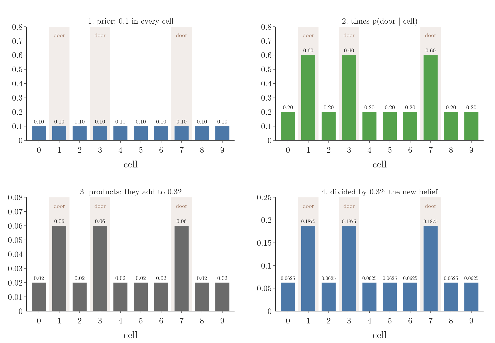
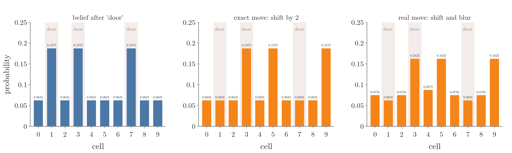
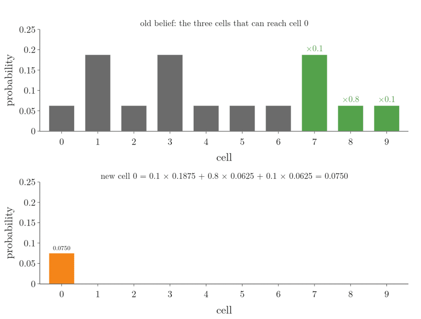
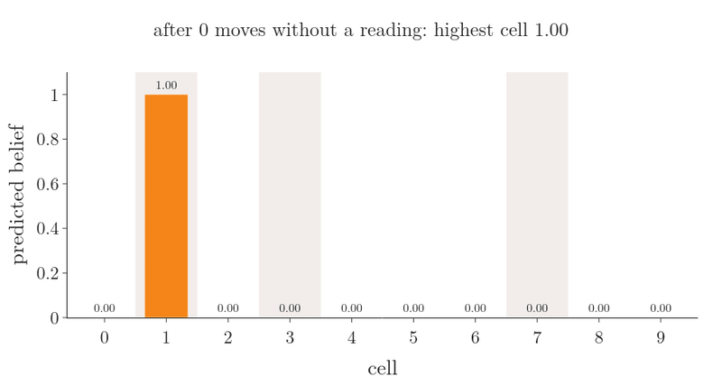
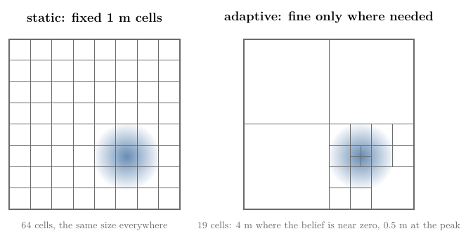
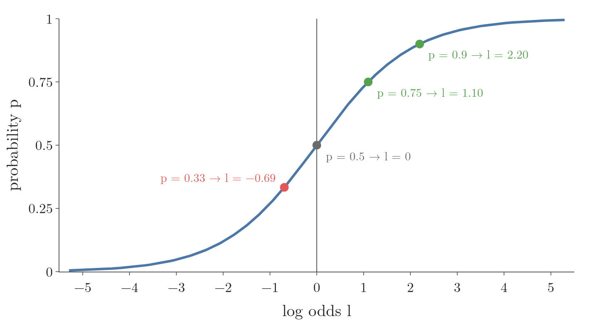
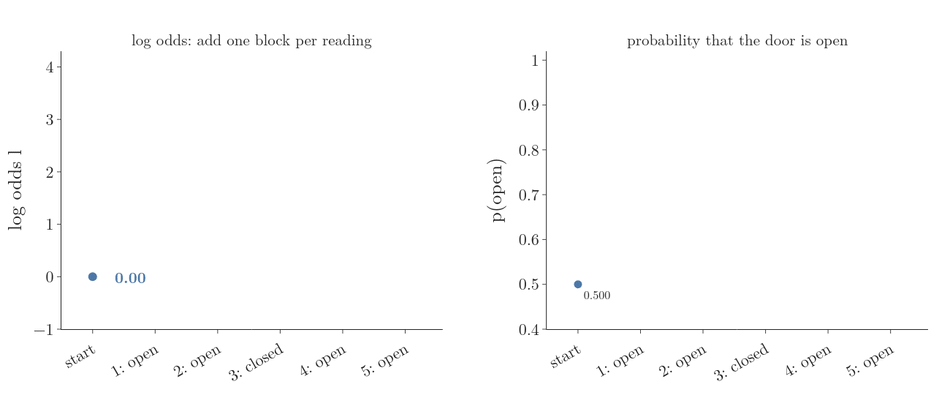
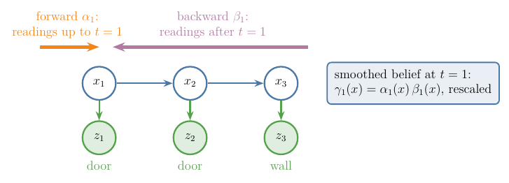
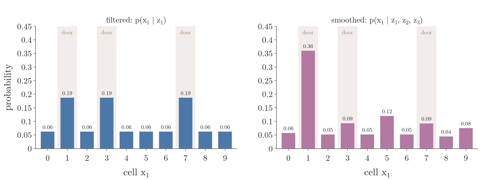

## 1. Overview

> **Key point:** Chop the robot's space into cells and keep one probability per cell: the Bayes filter then becomes plain arithmetic on a list of numbers. The same list of numbers also answers two questions about the past: where the robot most likely was, and which whole path it most likely took.


The [Bayes filter](../RO-014-bayes-filter/RO-014-bayes-filter.md#44-the-algorithm) tells the robot how to update its belief: a prediction step after each command, a correction step after each reading. But its prediction step is a sum over **every** possible previous state. A robot's position can take infinitely many values, so the sum cannot be done as written. This Note answers: **how does a computer run the Bayes filter, and what else can the same numbers tell us?**

We use the hallway of [belief](../RO-013-belief/RO-013-belief.md#1-overview) throughout (Figure 1): 10 cells of 1 m in a loop, doors at cells 1, 3 and 7, a door sensor that reads "door" with probability 0.6 at a door and 0.2 at a wall, and a command "move 2" that moves the robot 1, 2 or 3 cells with probability 0.1, 0.8 and 0.1.

The Note covers:

- the histogram filter: one probability per cell, updated by multiplying (sensing) and sliding (moving) (Section 2);
- how to cut a real, continuous space into cells: fixed cells or cells that adapt to the belief (Section 3);
- the binary Bayes filter for a yes-or-no state that does not change, run in log odds (Section 4);
- looking back: the smoothed belief at an earlier time, and the most likely whole path (Section 5).

## 2. The histogram filter

> **Key point:** Keep one probability per cell. Sensing multiplies every cell by how well it explains the reading, then rescales. Moving slides the list along and blurs it with the motion probabilities.

### 2.1 Why cells

A continuous position, such as "3.42 m along the hallway", can take infinitely many values, and a computer can only store a finite list. So we cut the hallway into cells, here 10 cells of 1 m, and keep one probability for each: the probability that the robot is somewhere in that cell. This is the same move as [discretization](../../../../ML/03-feature-engineering/ML-031-binning-binarization/ML-031-binning-binarization.md#3-discretization) (G-619) of a feature into bins, and the list of probabilities, drawn as bars, is a [histogram](../../../../ML/02-getting-data/ML-019-univariate-analysis/ML-019-univariate-analysis.md#6-histogram) (G-899) of the belief.

The Bayes filter run on such a list of cells is the **histogram filter** (G-2461) (PR §4.1). When the states are finite to begin with, as in the door world, the same algorithm is called the discrete Bayes filter (Labbe ch.2). The sum of the prediction step now has only 10 terms, so it can be done exactly.

### 2.2 Sense: multiply, then rescale

The robot has no idea where it is, so each cell starts at 0.1. It reads "door". Figure 2 shows the four stages.



**Multiply** each cell by the probability of the reading in that cell:

$$\text{door cell: } 0.1 \times 0.6 = 0.06$$

$$\text{wall cell: } 0.1 \times 0.2 = 0.02$$

**Add** the 10 products, 3 door cells and 7 wall cells:

$$3 \times 0.06 + 7 \times 0.02 = 0.32$$

**Rescale** by dividing every product by 0.32, so the cells add to 1 again:

$$\text{door cell: } 0.06 / 0.32 = 0.1875$$

$$\text{wall cell: } 0.02 / 0.32 = 0.0625$$

This is the correction step of the Bayes filter, done cell by cell (Labbe ch.2). The robot reads "door" three times as often at a door as at a wall, and after the update each door cell holds three times the belief of a wall cell.

### 2.3 Move: shift, then blur

Next the robot moves 2 cells. If the move were exact, every probability would simply travel 2 cells to the right, wrapping round the loop (Figure 3, middle). But the move is 1 cell with probability 0.1 and 3 cells with probability 0.1, so some belief also lands one cell short or one cell too far (Figure 3, right).



Which old cells can end in cell 3? Cell 2 (by moving 1), cell 1 (by moving 2) and cell 0 (by moving 3). Each contributes its old belief times the probability of that move:

$$\text{new cell 3} = 0.1 \times 0.0625$$

$$+\ 0.8 \times 0.1875$$

$$+\ 0.1 \times 0.0625$$

$$= 0.1625$$

This is the prediction step of the Bayes filter: the [law of total probability](../../../../MA/02-probability/MA-019-bayes-problem/MA-019-bayes-problem.md#4-the-evidence-total-probability) (G-1053) with three terms instead of ten, because only three old cells can reach each new one.

Every new cell is built the same way, with the same three weights, slid along the hallway. Figure 4 builds the whole predicted belief this way, one cell at a time.



The list of weights, here (0.1, 0.8, 0.1), is the **motion kernel** (G-2462). Sliding a small list of weights along a longer list and adding the products at each position is a [convolution](../../../../DL/04-cnn/DL-042-convolution-operation/DL-042-convolution-operation.md#41-a-moving-average) (G-481), the same operation a CNN filter performs on an image (Labbe ch.2). It is valid here because the move's error does not depend on where the robot is: the same kernel applies in every cell.

### 2.4 Moving without looking loses everything

What if the robot keeps moving and never reads its sensor? Figure 5 starts it sure that it is in cell 1 and repeats "move 2".



Each move spreads every bump over three cells, so the peak shrinks:

| Moves without a reading | 0 | 1 | 3 | 10 | 80 |
|---|---|---|---|---|---|
| Highest cell | 1.00 | 0.80 | 0.56 | 0.29 | 0.11 |

The belief tends to 0.1 in every cell, where the robot started before it knew anything. A prediction can only lose information; only readings bring it back (Labbe ch.2). The belief that repeated moves settle into, and that one more move leaves unchanged, is the **stationary distribution** (G-2463) of the motion (CS188 §8.1). Here it is flat, because the hallway is a loop and every cell looks the same to the motion.

### 2.5 Sense and move together

A real robot alternates: move, read, move, read. Figure 6 runs seven steps. The true robot starts in cell 1 and really moves 2 cells each time (cells 1, 3, 5, 7, 9, 1, 3). Every reading is correct except at $t = 5$, where the sensor says "door" in front of the wall of cell 9.


The tallest bar at each step:

| $t$ | 1 | 2 | 3 | 4 | 5 | 6 | 7 |
|---|---|---|---|---|---|---|---|
| True cell | 1 | 3 | 5 | 7 | 9 | 1 | 3 |
| Tallest bar | 1, 3, 7 (tied) | 3 | 5 | 7 | 3 | 1 | 3 |
| Its belief | 0.19 | 0.31 | 0.30 | 0.42 | 0.32 | 0.37 | 0.47 |

The wrong reading at $t = 5$ moves the tallest bar to cell 3, a door. But the true cell 9 keeps a belief of 0.24, because one reading never sets a cell to zero. Two correct readings later the filter is back on the true cell with 0.47. A filter that kept only one best guess would have been lost at $t = 5$ (Labbe ch.2).

### 2.6 The formal version

With the cells numbered $k = 0, \ldots, 9$, let $p_{k,t}$ be the belief in cell $k$ at time $t$ and $\bar p_{k,t}$ the predicted belief. The histogram filter is (PR §4.1.1):

$$\bar p_{k,t} = \sum_{i} p(x_k \mid u_t,\ x_i)\ p_{i,t-1}$$

$$p_{k,t} = \eta\ p(z_t \mid x_k)\ \bar p_{k,t}$$

The first line is the prediction step with the sum over the old cells $i$; the second is the correction step. Both lines visit every cell, so one step costs a fixed amount of work per cell.

> **Python:** the hallway filter, using `np.roll` to shift a list round the loop.
> ```python
> import numpy as np
> door = np.isin(np.arange(10), [1, 3, 7])
> def sense(bel, z):           # z = True: reads "door"
>     p = np.where(door, 0.6, 0.2)
>     if not z:
>         p = 1 - p
>     return p * bel / (p * bel).sum()
> def move(bel):               # 1, 2 or 3 cells
>     return (0.1 * np.roll(bel, 1)
>             + 0.8 * np.roll(bel, 2)
>             + 0.1 * np.roll(bel, 3))
> bel = sense(np.full(10, 0.1), True)   # 0.1875 at doors
> bel = sense(move(bel), True)          # 0.3095 at cell 3
> ```

The notebook `RO-015-grid-filters.ipynb` runs every example in this Note.

## 3. Cutting a real space into cells

> **Key point:** Fine cells give an accurate belief but their number explodes with the size of the space and the number of state variables. A static decomposition fixes the cells in advance; an adaptive one makes cells small only where the belief needs them.

### 3.1 Why the number of cells explodes

Our hallway has 10 cells of 1 m, so the robot's position is never known better than "somewhere in this metre". Smaller cells give a sharper answer, but every cell costs memory and time, because both steps visit every cell. A real floor robot has a pose: position $x$, $y$ and heading $\theta$ (see [pose](../../../control/01-robot-models/RO-001-pose-and-differential-drive/RO-001-pose-and-differential-drive.md#22-why-position-is-not-enough-the-heading)), so the grid has three directions. For a 30 m by 30 m floor with 15 cm cells and the heading in steps of 2° (Fox 1999):

$$\frac{30}{0.15} = 200 \text{ cells along } x$$

$$\frac{30}{0.15} = 200 \text{ cells along } y$$

$$\frac{360}{2} = 180 \text{ headings}$$

$$200 \times 200 \times 180 = 7{,}200{,}000 \text{ cells}$$

Halving the cell size multiplies the count by 4 for the position alone, and each extra state variable, such as speed, multiplies it again by the number of its values (Labbe ch.2). Fox, Burgard and Thrun found that updating 7.2 million cells at every reading was too slow for the computers of 1999 (Fox 1999).

### 3.2 Static and adaptive decomposition

Most of those millions of cells hold a belief close to zero: the robot is not inside a wall or at the far end of the building. Two ways of cutting the space follow from that (PR §4.1.4):

- A **static decomposition** (G-2464) fixes the cells before the robot starts, whatever the belief turns out to be. A regular grid of equal cells is the usual choice (Fox 1999). It is simple, and every cell is updated the same way, but it spends as much work on empty regions as on the region where the robot is.
- An **adaptive decomposition** (G-2465), also called a dynamic decomposition, changes the cells as the belief changes: small cells where the belief is high, large cells where it is near zero. A common way is a quadtree, which splits a square into four only where more detail is needed (ShanghaiTech slides; Fox 1999, §6).



Figure 7 compares the two on an 8 m by 8 m floor. The fixed grid uses 64 cells of 1 m. The adaptive one uses 19 cells, yet its smallest cells (0.5 m) are finer than the fixed grid's where the belief peaks. The price is bookkeeping: cells must be split and merged as the belief moves.

> **Extra:** A related trick keeps the fixed grid but updates only the cells whose belief is above a small threshold, the selective update of Fox, Burgard and Thrun. During global localization most of the belief quickly falls below the threshold, so most cells are skipped (Fox 1999, §3.4.2).

## 4. The binary Bayes filter

> **Key point:** For a yes-or-no state that never changes, each reading multiplies the odds by a fixed factor. In log odds that becomes adding a fixed number, which is fast and does not round to 0 or 1.

### 4.1 A state that does not change

Go back to the [door world](../RO-014-bayes-filter/RO-014-bayes-filter.md#2-the-door-world), but now nobody touches the door: it is open or closed, and it stays that way while the robot reads its sensor again and again. A state that the robot's commands do not change is a **static state** (G-2467) (PR §4.2). With a static state the prediction step does nothing (the belief before a step equals the belief after it), so only the correction step is left.

The same situation appears in mapping: whether one small square of the floor is occupied by an obstacle is a yes-or-no question about something that does not move. A map built this way keeps one such filter per square (PR §4.2; Freiburg mapping slides).

### 4.2 Each reading multiplies the odds

The [odds](../../../../ML/08-trees-and-ensembles/ML-116-gradient-boosting-classification/ML-116-gradient-boosting-classification.md#4-stage-1-the-log-odds-of-class-1) (G-1376) of the door being open compare the two possibilities:

$$\text{odds} = \frac{p(\text{open})}{p(\text{closed})}$$

Why does a reading multiply the odds? Write Bayes' theorem once for "open" and once for "closed", after a reading $z$. Both share the same denominator $p(z)$:

$$p(\text{open} \mid z) = \frac{p(z \mid \text{open})\ p(\text{open})}{p(z)}$$

$$p(\text{closed} \mid z) = \frac{p(z \mid \text{closed})\ p(\text{closed})}{p(z)}$$

Divide the first line by the second. The $p(z)$ cancels:

$$\frac{p(\text{open} \mid z)}{p(\text{closed} \mid z)}$$

$$= \frac{p(z \mid \text{open})}{p(z \mid \text{closed})} \times \frac{p(\text{open})}{p(\text{closed})}$$

The left side is the new odds; the last fraction is the old odds. The ratio of the two measurement probabilities in between is the [Bayes factor](../../../../MA/02-probability/MA-019-bayes-problem/MA-019-bayes-problem.md#61-the-size-of-the-update-the-bayes-factor) (G-2215):

$$\text{new odds} = \text{old odds} \times \frac{p(z \mid \text{open})}{p(z \mid \text{closed})}$$

We never need $p(z)$, the normaliser $\eta$ of the correction step, which is why odds are convenient.

For a reading of "sense open" the factor is:

$$0.6 / 0.2 = 3$$

For "sense closed" it is:

$$0.4 / 0.8 = 0.5$$

Starting from odds of 1 (that is, 0.5 against 0.5), two readings of "open" give:

$$1 \times 3 \times 3 = 9$$

Odds of 9 mean 9 parts open to 1 part closed:

$$p(\text{open}) = \frac{9}{9 + 1} = 0.9$$

the same 0.9 as in the [Bayes filter](../RO-014-bayes-filter/RO-014-bayes-filter.md#32-a-second-reading-bayes-theorem-with-background-knowledge).

### 4.3 Log odds turn the products into sums

Taking the logarithm turns a product into a sum. The natural log of the odds is the [log odds](../../../../ML/08-trees-and-ensembles/ML-116-gradient-boosting-classification/ML-116-gradient-boosting-classification.md#4-stage-1-the-log-odds-of-class-1) (G-1116):

$$l = \ln \frac{p}{1 - p}$$

Figure 8 shows how probabilities map to log odds: 0.5 goes to 0, probabilities above 0.5 to positive numbers, below 0.5 to negative ones, and 0 and 1 are never reached.



Each reading now **adds** a fixed amount:

$$\text{sense open: } \ln 3 = +1.10$$

$$\text{sense closed: } \ln 0.5 = -0.69$$

Figure 9 runs five readings: open, open, closed, open, open.



Step by step:

$$0 + 1.10 = 1.10$$

$$1.10 + 1.10 = 2.20$$

$$2.20 - 0.69 = 1.50$$

$$1.50 + 1.10 = 2.60$$

$$2.60 + 1.10 = 3.70$$

To read a probability back out, undo the log, which is the [sigmoid function](../../../../ML/07-classification/ML-071-sigmoid-function/ML-071-sigmoid-function.md#4-the-sigmoid-function) (G-1798):

$$p = 1 - \frac{1}{1 + e^{l}}$$

$$l = 3.70: \quad p = 0.976$$

The notebook checks that Bayes' theorem applied five times gives the same 0.976.

### 4.4 Why work in log odds

Two reasons:

1. **Adding is cheaper than multiplying and rescaling.** A map can hold millions of cells, each updated at every scan; one addition per cell is the cheapest update possible, and every cell can be updated at the same time (Freiburg mapping slides: the log odds update "only requires to compute sums").
2. **Probabilities near 0 or 1 round off.** Run 40 readings of "open" in ordinary probabilities. The odds become 3 to the power 40, about 12 billion billion, and the computer stores $p(\text{open})$ as exactly 1.0. After that, a reading of "closed" changes nothing, because 1.0 times anything, divided by itself, is still 1.0. In log odds the same run reaches 43.94, and a "closed" reading moves it to 43.25, as it should. The notebook shows both.

### 4.5 The inverse measurement model

So far the robot used $p(z \mid x)$: how likely the reading is for each state. In the binary Bayes filter it is usual to use the other direction, $p(x \mid z)$: how likely the state is, given one reading on its own. This is the **inverse measurement model** (G-2468) (PR §4.2). For the door, with an even prior:

$$p(\text{open} \mid \text{sense open}) = 0.75$$

$$p(\text{open} \mid \text{sense closed}) = 0.33$$

Why turn the model round? Because the state is a single yes or no, while the reading can be large, such as a whole camera image. Writing down how likely every possible image is for an open door is very hard; learning to say "open" or "closed" from one image is much easier (PR §4.2).

The update in log odds is then (PR §4.2; UW CSE 571):

$$l_t = l_{t-1} + \ln \frac{p(x \mid z_t)}{1 - p(x \mid z_t)} - l_0$$

where $l_0$ is the log odds of the prior, before any reading:

$$l_0 = \ln \frac{p(x)}{1 - p(x)}$$

Why subtract $l_0$? The inverse model already includes the prior once, because it answers "how likely is open after this one reading, starting from the prior". Section 4.2 gives the same fact as a formula. Applied to one reading on its own, starting from the prior, it says:

$$\text{odds of } p(x \mid z)$$

$$= \text{Bayes factor} \times \text{prior odds}$$

Take the log of both sides:

$$\ln \frac{p(x \mid z)}{1 - p(x \mid z)}$$

$$= \ln(\text{Bayes factor}) + l_0$$

So the log of the Bayes factor, the amount each reading should add, is:

$$\ln(\text{Bayes factor}) = \ln \frac{p(x \mid z)}{1 - p(x \mid z)} - l_0$$

Put this into "new log odds = old log odds + log of the Bayes factor" and we get the update above. Without the $-l_0$, the prior would be counted again at every reading. With an even prior, $l_0 = 0$, and each "sense open" adds:

$$\ln \frac{0.75}{0.25} = \ln 3 = 1.10$$

the same step as in Section 4.3. This filter, a static binary state updated in log odds, is the **binary Bayes filter** (G-2466) (PR §4.2).

> **Extra:** With an uneven prior the subtraction matters. Suppose doors in this building are usually closed, with a prior of 0.2 for open. The inverse model for "sense open" is then:
>
> $$\frac{0.6 \times 0.2}{0.6 \times 0.2 + 0.2 \times 0.8} = 0.43$$
>
> With the $-l_0$ term the filter gives 0.43 after one reading, which matches Bayes' theorem. Without it the filter gives 0.16, because it counted the prior of 0.2 twice.

## 5. Looking back: smoothing and the most likely path

> **Key point:** Later readings also say where the robot was earlier. The forward-backward algorithm combines readings from before and after a time step into the smoothed belief; the Viterbi algorithm finds the single most likely path.

### 5.1 Three questions about a run

The hallway robot's run from [belief](../RO-013-belief/RO-013-belief.md#21-why-the-true-cell-is-out-of-reach): at $t = 1$ it stays and reads "door"; at $t = 2$ it moves 2 and reads "door"; at $t = 3$ it moves 2 and reads "wall". Its true cells are 1, 3 and 5. The [hidden Markov model](../RO-013-belief/RO-013-belief.md#63-hidden-markov-model) of the robot can answer three different questions (CS188 §8.2–8.3; J&M App. A):

1. **Where is the robot now, given the readings so far?** This is **filtering** (G-2469); the histogram filter of Section 2 does it.
2. **Where was the robot at an earlier time, given all readings, including later ones?** This is **smoothing** (G-2470).
3. **Which whole path of cells is most likely, given all readings?** This is the **most likely path** (G-2476), found by the Viterbi algorithm.

Filtering is what a robot needs while it drives. Smoothing and the most likely path are for looking back over a recorded run, for example to draw the path it took.

### 5.2 Smoothing with the forward-backward algorithm

At $t = 1$ the filter knew only the first reading, so cells 1, 3 and 7 were equally likely (Figure 11, left). Later readings settle it. A robot at cell 3 at $t = 1$ would be at cell 5 at $t = 2$, a wall, and would have read "door" there only 20 percent of the time. A robot at cell 1 would be at cell 3, a door. So the reading at $t = 2$ points back to cell 1.

The **forward-backward algorithm** (G-2471) makes this exact. It combines two quantities for every cell $x$ and time $t$ (J&M App. A):

- the **forward probability** (G-2472) $\alpha_t(x)$: the probability of the readings up to $t$ and of being in cell $x$ at $t$. It is the histogram filter before rescaling; at $t = 1$ it is 0.06 at the doors and 0.02 at the walls (Section 2.2);
- the **backward probability** (G-2473) $\beta_t(x)$: the probability of the readings **after** $t$, given cell $x$ at $t$. It is computed from the end backwards, starting from 1 at the last step.



Figure 10 shows the idea: $\alpha$ carries the evidence from the past, $\beta$ from the future. Their product, rescaled to add to 1, is the smoothed belief:

$$\gamma_t(x) = \eta\ \alpha_t(x)\ \beta_t(x)$$

Why does a plain product work? Write the two pieces out:

$$\alpha_t(x) = p(z_{1:t},\ x_t = x)$$

$$\beta_t(x) = p(z_{t+1:T} \mid x_t = x)$$

By the [Markov property](../RO-007-why-a-robot-is-never-sure/RO-007-why-a-robot-is-never-sure.md#43-complete-state-and-the-markov-property), once the cell at $t$ is known, the earlier readings tell nothing more about the later ones. So the later readings can be added to the condition without changing $\beta$, and the product is the probability of all readings together with cell $x$ at $t$:

$$\alpha_t(x)\ \beta_t(x) = p(z_{1:T},\ x_t = x)$$

Dividing by its total over all cells, $p(z_{1:T})$, gives $p(x_t = x \mid z_{1:T})$, the smoothed belief (J&M App. A).

**$\beta$ for cell 1 at $t = 1$**, worked backwards. At $t = 3$ there are no later readings, so $\beta_3 = 1$ everywhere. One step back, from cell 3 at $t = 2$ the robot reaches cell 4, 5 or 6 (all walls), and each reads "wall" with probability 0.8:

$$\beta_2(3) = 0.1 \times 0.8 + 0.8 \times 0.8 + 0.1 \times 0.8$$

$$= 0.8$$

Another step back, from cell 1 at $t = 1$ the robot reaches cell 2 (a wall), 3 (a door) or 4 (a wall), and must then read "door" and continue. $\beta_2(2)$ is worked like $\beta_2(3)$: from cell 2 the robot reaches cell 3 (a door, reads "wall" with probability 0.4), 4 or 5 (walls):

$$\beta_2(2) = 0.1 \times 0.4 + 0.8 \times 0.8$$

$$+\ 0.1 \times 0.8 = 0.76$$

$\beta_2(4) = 0.76$ the same way (notebook). Then:

$$\beta_1(1) = 0.1 \times 0.2 \times 0.76$$

$$+\ 0.8 \times 0.6 \times 0.8$$

$$+\ 0.1 \times 0.2 \times 0.76$$

$$= 0.4144$$

The same calculation for cell 3 gives only 0.1072, because a robot there would read "door" at a wall. Then:

$$\alpha_1(1)\ \beta_1(1) = 0.06 \times 0.4144 = 0.0249$$

$$\alpha_1(3)\ \beta_1(3) = 0.06 \times 0.1072 = 0.0064$$

The products over all 10 cells add to 0.06896, the probability of the three readings; it is the same at every $t$, which the notebook checks. Rescaling gives the smoothed belief:

$$\gamma_1(1) = 0.0249 / 0.06896 = 0.36$$

$$\gamma_1(3) = 0.0064 / 0.06896 = 0.09$$



Figure 11 compares the two. Using the later readings nearly doubles the belief in the true starting cell, from 0.19 to 0.36.

### 5.3 The most likely path: the Viterbi algorithm

Smoothing gives a probability for each cell at each time. Sometimes we want one answer instead: the single path of cells that best explains all readings. Trying every path is hopeless for long runs: with 10 cells and $T$ steps there are 10 to the power $T$ paths, 1000 for our 3 steps but a 1 followed by 100 zeros for 100 steps (J&M App. A).

The **Viterbi algorithm** (G-2474) avoids this with one observation: the best path to a cell at time $t$ must continue the best path to some cell at time $t - 1$. So for each cell it keeps only the probability of the best path ending there, $m_t(x)$, and which cell that path came from, the **back-pointer** (G-2477) (CS188 §8.3). It is the forward algorithm with the sum replaced by a maximum:

$$m_t(x) = p(z_t \mid x)\ \max_{x'} p(x \mid u_t, x')\ m_{t-1}(x')$$

Here $x'$ runs over the cells at $t - 1$. Storing each sub-answer once and reusing it is [dynamic programming](../../../../DL/01-basics/DL-019-mlp-memoization/DL-019-mlp-memoization.md#33-the-memoized-version) (G-652).

**At $t = 2$, cell 3.** The best path into cell 3 comes from cell 1, cell 2 or cell 0, and $m_1$ is 0.06 at a door and 0.02 at a wall:

$$\text{from cell 1: } 0.8 \times 0.06 = 0.048$$

$$\text{from cell 2: } 0.1 \times 0.02 = 0.002$$

$$\text{from cell 0: } 0.1 \times 0.02 = 0.002$$

The best is from cell 1, so the back-pointer of cell 3 at $t = 2$ is cell 1, and:

$$m_2(3) = 0.6 \times 0.048 = 0.0288$$

This 0.0288 is the probability of the "true story" in [belief](../RO-013-belief/RO-013-belief.md#64-the-probability-of-one-whole-story): the best path into cell 3 is that story.

**At $t = 3$, cell 5.** The best way in is from cell 3 at $t = 2$:

$$m_3(5) = 0.8 \times 0.8 \times 0.0288 = 0.0184$$


Figure 12 draws all 30 values on a **trellis** (G-2475): one column of cells per time step, with lines for the possible moves between columns. Cell 5 has the largest value at $t = 3$. Following its back-pointer gives cell 3 at $t = 2$, and cell 3's back-pointer gives cell 1 at $t = 1$:

$$\text{most likely path: } 1 \rightarrow 3 \rightarrow 5$$

These are the true cells. The notebook checks all 1000 paths by brute force and finds the same path with the same probability, 0.0184. The Viterbi algorithm needed only 10 × 10 comparisons per step, 300 in all, against 1000 paths; for 100 steps it needs 10,000 against 10 to the power 100 (J&M App. A).

## 6. Summary

| Method | Answers | One step | Cost |
|---|---|---|---|
| Histogram filter | where the robot is now | slide and blur (predict), multiply and rescale (correct) | every cell, every step |
| Static or adaptive cells | how to cut a continuous space | fixed grid, or fine cells only where the belief is high | adaptive saves cells, costs bookkeeping |
| Binary Bayes filter | a fixed yes-or-no state | add the log odds of the inverse model, subtract $l_0$ | one addition per reading |
| Forward-backward | where the robot was at an earlier time | multiply forward $\alpha$ and backward $\beta$, rescale | two passes over the run |
| Viterbi | the single most likely path | maximum instead of sum, then follow back-pointers | 10 × 10 per step, not 10 to the power $T$ |

- The histogram filter runs the Bayes filter exactly on a list of cells, because the sum over previous states has only as many terms as there are cells.
- Sensing multiplies each cell by $p(z \mid x)$ and rescales, so cells that explain the reading gain belief; moving convolves the belief with the motion kernel, because the same move error applies in every cell.
- Moving without reading flattens the belief to the stationary distribution, so a robot must keep reading its sensors to stay localized.
- A wrong reading moves the tallest bar but never removes the true cell, so the filter recovers after a few correct readings.
- Fine cells explode in number with the space size and the number of state variables (7.2 million for a 30 m floor), so adaptive decompositions put small cells only where the belief is high.
- For a static yes-or-no state each reading multiplies the odds by the Bayes factor, so in log odds it adds a fixed number; this is fast and does not round to 0 or 1.
- The inverse measurement model is used because the state is simple and the reading may be complex; subtracting $l_0$ stops the prior from being counted at every reading.
- Later readings tell where the robot was earlier: forward-backward raised the true starting cell from 0.19 to 0.36, and the Viterbi algorithm recovered the true path 1, 3, 5 with 300 comparisons instead of 1000 path products.

So the answer to the opening question: a computer runs the Bayes filter by cutting the space into cells and doing a multiply, a slide and a rescale on the list of their probabilities; the same model, run backwards and with maxima, also reconstructs the past.

## 7. Sources

**Built from**

- Udacity, Artificial Intelligence for Robotics, lesson 1 "Localization" (clips "Probability After Sense" to "Sense and Move"; some titles in Korean, English audio), YouTube playlist, https://www.youtube.com/playlist?list=PLJTqwKOfxtSjwWlu3Gth0m6mcQ9awWONg
- Udacity, Artificial Intelligence for Robotics, lesson 1, programming assignment (2-D localization), YouTube, https://www.youtube.com/watch?v=9a42_zEeeA0
- RoboJackets, "Log Odds Derivation | Robotics 5-3", YouTube, https://www.youtube.com/watch?v=bNoWvj0klAo
- NPTEL IIT Madras, "Introduction to Robotics: Binary Bayes" (#36), YouTube, https://www.youtube.com/watch?v=odk5ZfSStag
- DataMListic, "The Viterbi Algorithm | HMM Part 2", YouTube, https://www.youtube.com/watch?v=LGY4yMWUjL4
- DataMListic, "Forward-Backward Algorithm | HMM Part 3", YouTube, https://www.youtube.com/watch?v=QBDvFVmpgd0 (used for the idea of alpha, beta and gamma only)
- Carlotta A. Berry, PhD, "Advanced Mobile Robotics: Lecture 5-1 Discrete Bayes Filters" (grid size and tree-based cells), YouTube, https://www.youtube.com/watch?v=m-a8WRKv7nM
- Labbe, R. *Kalman and Bayesian Filters in Python*, ch.2 "Discrete Bayes Filter" (sensing, prediction as convolution, loss of information, bad sensor data, drawbacks and limitations). https://github.com/rlabbe/Kalman-and-Bayesian-Filters-in-Python/blob/master/02-Discrete-Bayes.ipynb (Labbe ch.2)
- Fox, D., Burgard, W. and Thrun, S. (1999). Markov localization for mobile robots in dynamic environments. *Journal of Artificial Intelligence Research* 11, 391–427. §3.4 grid sizes and selective update, §6 the need for variable-resolution grids. https://jair.org/index.php/jair/article/view/10246 (Fox 1999)
- Luft, L., Burgard, W. et al. (Uni Freiburg), *Introduction to Mobile Robotics*, "Grid Maps and Mapping with Known Poses" slides (binary Bayes filter per cell, log odds update "only requires to compute sums"). http://ais.informatik.uni-freiburg.de/teaching/ss23/robotics/slides/12-occupancy-mapping.pdf (Freiburg mapping slides)
- University of Washington, CSE 571 Robotics (2020), "Occupancy grid mapping" slides (binary Bayes filter in log odds). https://courses.cs.washington.edu/courses/cse571/20sp/slides/09-occupancy-mapping.pdf (UW CSE 571)
- DeNero, J., Klein, D. et al. *CS 188: Introduction to Artificial Intelligence*, online textbook, UC Berkeley. §8.1 Markov models, §8.2 hidden Markov models, §8.3 the Viterbi algorithm. https://inst.eecs.berkeley.edu/~cs188/textbook/hmms/viterbi.html (CS188)
- Jurafsky, D. and Martin, J. H. *Speech and Language Processing*, 3rd ed. draft, Appendix A "Hidden Markov Models" (the count of possible paths, forward, backward and smoothed probabilities, Viterbi). https://web.stanford.edu/~jurafsky/slp3/A.pdf (J&M App. A)

**Other references**

- ShanghaiTech University, Robotics (2024), "Mapping" slides, slide "Adaptive cell decomposition" (quadtrees and octrees). https://robotics.shanghaitech.edu.cn/sites/default/files/2024-03/robotics_2024_05-Mapping.pdf (ShanghaiTech slides)
- Thrun, S., Burgard, W. and Fox, D. (2005). *Probabilistic Robotics*. MIT Press. §4.1 the histogram filter, §4.1.4 decomposition techniques, §4.2 binary Bayes filters with static state. Cited only where the free sources above say the same (PR)

## 8. Key terms

Terms taught in this Note come first; linked terms are recaps, taught in the Note the link opens.

| Term | Meaning |
|---|---|
| Histogram filter (discrete Bayes filter) (G-2461) | The Bayes filter run on a space cut into cells, keeping one probability per cell; sensing multiplies each cell by $p(z \mid x)$ and rescales, moving slides and blurs the list. It makes the Bayes filter computable for a continuous position. |
| Motion kernel (G-2462) | The short list of move probabilities, such as (0.1, 0.8, 0.1) for one cell short, exact, one cell too far, slid along the belief in the prediction step; it spreads each cell's belief over the cells the robot may have reached. |
| Stationary distribution (G-2463) | The belief that repeated moves without readings settle into and that one more move leaves unchanged, such as 0.1 in every cell of a looped hallway; it shows that prediction alone loses all knowledge. |
| Static decomposition (G-2464) | Cutting the state space into cells fixed before the robot starts, usually a regular grid such as 15 cm cells and 2° headings; simple, but it spends as much work on empty regions as where the robot is. |
| Adaptive (dynamic) decomposition (G-2465) | Cutting the state space into cells that change with the belief: small cells where the belief is high, large cells where it is near zero, as in a quadtree; it gives fine detail with far fewer cells. |
| Static state (G-2467) | A state that the robot's commands do not change while it is being estimated, such as a door nobody touches; the prediction step then does nothing and only readings update the belief. |
| Inverse measurement model (G-2468) | The probability of the state given one reading on its own, $p(x \mid z)$, such as 0.75 for "door open" after one "sense open"; used when the state is a simple yes or no but the reading is complex, such as a camera image. |
| Binary Bayes filter (G-2466) | The Bayes filter for a yes-or-no state that does not change, such as "door open" or "this map cell is occupied", run in log odds: each reading adds the log odds of the inverse measurement model and subtracts the prior's log odds. It is fast and does not round to 0 or 1. |
| Filtering (state estimation) (G-2469) | Estimating the current state from the readings so far, $p(x_t \mid z_{1:t})$; what a robot needs while it drives, and what the Bayes filter computes. |
| Smoothing (G-2470) | Estimating the state at an earlier time using all readings, including later ones, $p(x_t \mid z_{1:T})$; later readings often settle where the robot was, such as raising the true starting cell from 0.19 to 0.36. |
| Most likely path (G-2476) | The one sequence of hidden states with the highest probability given all readings, such as cells 1, 3, 5; one consistent answer for a whole run, found by the Viterbi algorithm. |
| Forward-backward algorithm (G-2471) | The method that computes smoothed beliefs in an HMM by multiplying a forward pass (evidence up to $t$) by a backward pass (evidence after $t$) and rescaling; it uses every reading of a recorded run for each time step. |
| Forward probability $\alpha_t$ (G-2472) | The probability of the readings up to time $t$ together with being in state $x$ at $t$; the histogram filter before rescaling, carrying the evidence from the past. |
| Backward probability $\beta_t$ (G-2473) | The probability of the readings after time $t$, given state $x$ at $t$, computed from the last step backwards starting at 1; it carries the evidence from the future. |
| Viterbi algorithm (G-2474) | The method that finds the single most likely sequence of hidden states in an HMM by keeping, for each state and time, only the best path ending there and where it came from, then tracing back; it costs states squared times steps instead of trying every path. |
| Back-pointer (G-2477) | The note the Viterbi algorithm keeps for each state and time of which earlier state the best path came from; following them backwards from the best end recovers the most likely path. |
| Trellis (G-2475) | A grid drawing of an HMM run with one column of states per time step and lines for the possible moves between columns; every path through it is one guess at the hidden states. |
| [Discretization](../../../../ML/03-feature-engineering/ML-031-binning-binarization/ML-031-binning-binarization.md#1-overview) (G-619) | Turning a continuous column into a discrete one by cutting its range into intervals. |
| [Histogram](../../../../ML/02-getting-data/ML-019-univariate-analysis/ML-019-univariate-analysis.md#6-histogram) (G-899) | A bar chart of how many values fall in each equal range (bin) of a numerical column. |
| [Law of total probability](../../../../MA/02-probability/MA-019-bayes-problem/MA-019-bayes-problem.md#1-overview) (G-1053) | The rule for the overall probability of an event: add its probability under each case, weighted by how likely that case is, $P(B) = \sum_i P(B \mid A_i) P(A_i)$, when the cases $A_i$ are mutually exclusive and cover every possibility. |
| [Convolution operation](../../../../DL/04-cnn/DL-042-convolution-operation/DL-042-convolution-operation.md#6-the-convolution-operation) (G-481) | Sliding a small filter over an input and, at each position, multiplying cell by cell and adding up, so the output (a feature map) is large where the input contains the filter's pattern, such as an edge. |
| [Odds](../../../../ML/08-trees-and-ensembles/ML-116-gradient-boosting-classification/ML-116-gradient-boosting-classification.md#4-stage-1-the-log-odds-of-class-1) (G-1376) | How often an event happens divided by how often it does not, e.g. 5 placed to 3 not placed is $5/3$. |
| [Bayes factor](../../../../MA/02-probability/MA-019-bayes-problem/MA-019-bayes-problem.md#61-the-size-of-the-update-the-bayes-factor) (G-2215) | A number that says how strongly the evidence favours yes over no: how many times more likely the evidence is if the answer is yes than if it is no, $P(\text{evidence} \mid \text{yes}) / P(\text{evidence} \mid \text{no})$. Multiplying the prior odds by it gives the posterior odds. |
| [Log-odds](../../../../ML/08-trees-and-ensembles/ML-116-gradient-boosting-classification/ML-116-gradient-boosting-classification.md#4-stage-1-the-log-odds-of-class-1) (G-1116) | The natural log of the odds, $\ln(p/(1-p))$: it turns a probability between 0 and 1 into any number (0 at $p = 0.5$), so a model such as logistic regression can predict it with a straight line, and the sigmoid turns it back into a probability. |
| [Sigmoid function](../../../../ML/07-classification/ML-071-sigmoid-function/ML-071-sigmoid-function.md#4-the-sigmoid-function) (G-1798) | An S-shaped function that squashes any number into the range 0 to 1, $\sigma(z) = 1/(1 + e^{-z})$; it turns a score into a probability, as in logistic regression. |
| [Dynamic programming](../../../../DL/01-basics/DL-019-mlp-memoization/DL-019-mlp-memoization.md#33-the-memoized-version) (G-652) | Solving a problem by storing the answer to each overlapping sub-problem the first time it is computed and looking it up afterwards, so no work is repeated; memoization is one form of it. |
