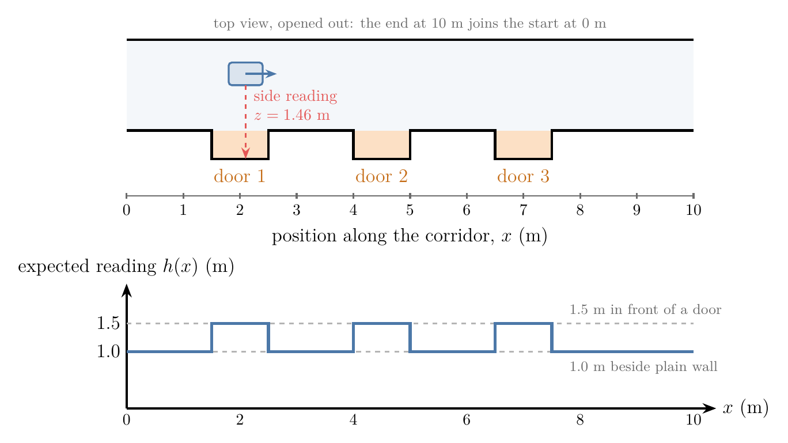
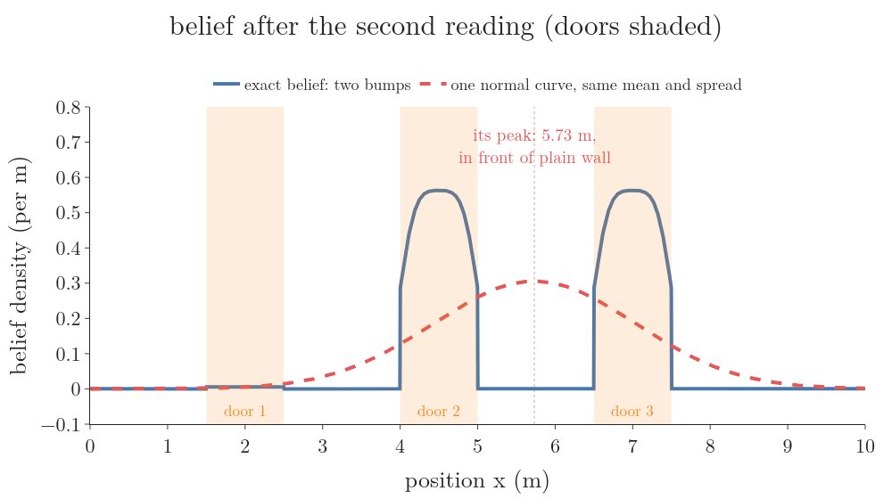
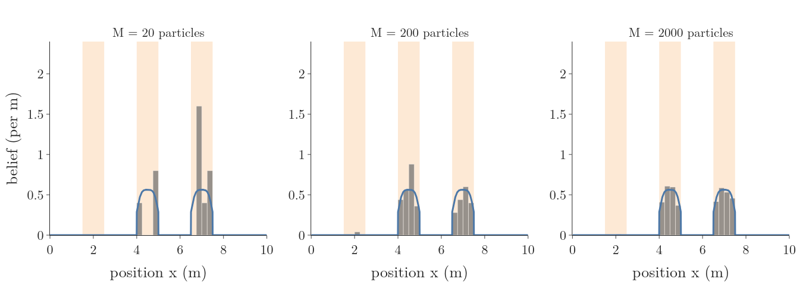
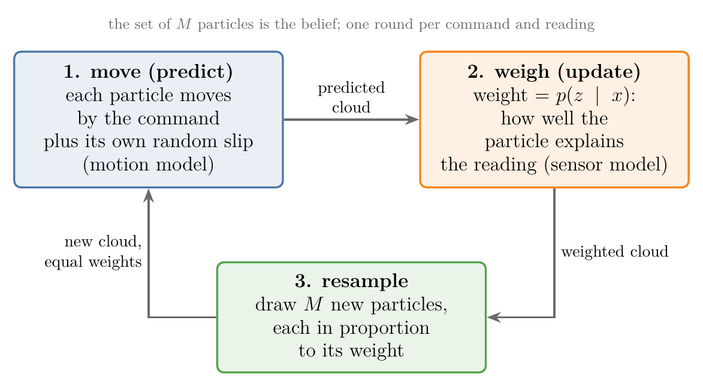
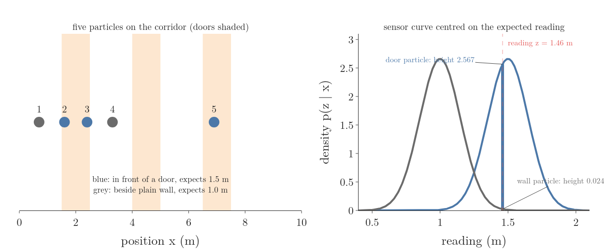
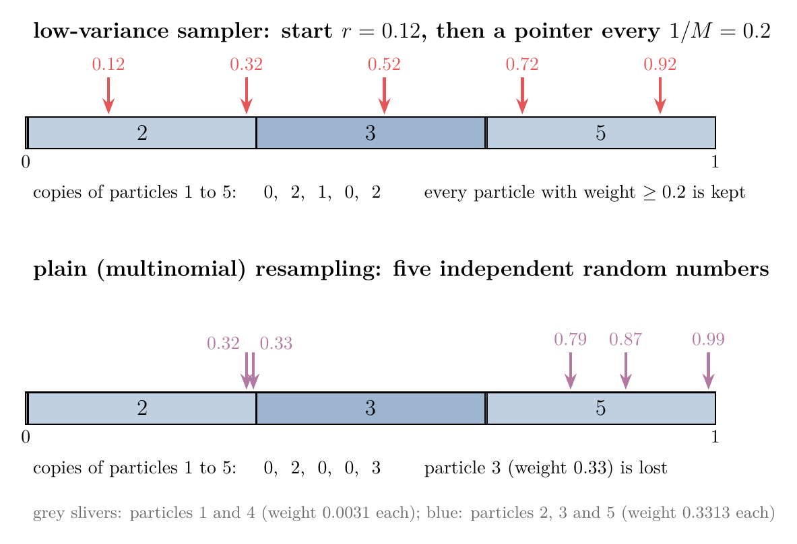
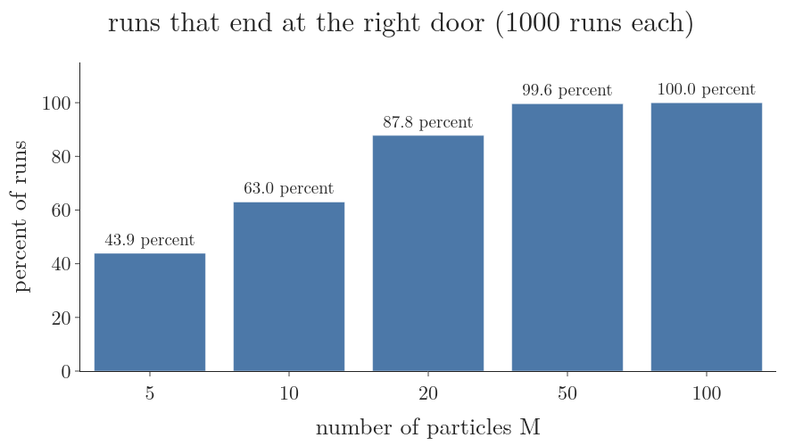
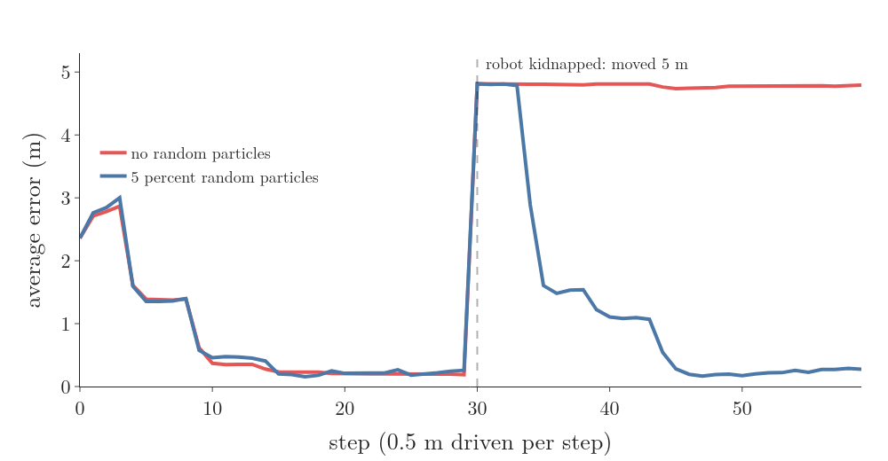

## 1. Overview

> **Key point:** A particle filter keeps the robot's belief as a cloud of guesses. Each reading reweighs the guesses, resampling keeps the good ones, and each move shifts them all; the cloud can take any shape, including several bumps at once.



A robot is somewhere in the corridor of Figure 1. It has a map of the corridor, but it does not know where it is. Its side sensor reads 1.46 m, which means "a door is beside me". Three doors fit that reading, so the honest answer to "where am I?" is "at door 1, door 2 or door 3, about equally likely": a belief with three bumps.

The [Bayes filter](../RO-014-bayes-filter/RO-014-bayes-filter.md#44-the-algorithm) gives the rule for updating such a belief. Two ways of running it are already known, and both struggle here:

- the **grid filter**, or [histogram filter](../RO-015-grid-filters/RO-015-grid-filters.md#2-the-histogram-filter), stores one number per cell, which is fine on a 10 m line but grows very fast with the number of state variables;
- the **Kalman filter** of [the Kalman filter](../RO-017-kalman-filter/RO-017-kalman-filter.md#22-a-bell-is-two-numbers) stores the belief as one bell curve, and one bell curve cannot have three bumps (Section 3.1).

The particle filter stores the belief as a set of sample guesses instead. This Note builds it on the corridor of Figure 1:

- why a cloud of samples can stand for a belief, and how accurate it is (Section 3);
- the three steps, move, weigh and resample, worked by hand and then run on the corridor (Section 4);
- the low-variance sampler, the standard way to resample (Section 4.3);
- what goes wrong with too few particles, and the fixes (Section 5);
- where the particle filter sits among the other filters (Section 6).

## 2. The running example and the Bayes filter in brief

> **Key point:** The robot has a map, a noisy side sensor and wheels that slip. The Bayes filter turns these into a belief with two steps per round: predict with the motion, update with the reading.

### 2.1 The corridor, the sensor and the motion

The corridor loops round a block and is 10 m around, so position 10 m is position 0 m again. Unlike the 10-cell [hallway](../RO-015-grid-filters/RO-015-grid-filters.md#21-why-cells) of the grid filter, its position is a continuous number of metres, and its doors are 1 m stretches of wall. Three doors are set 0.5 m back into the right-hand wall (Figure 1):

| Door | From (m) | To (m) |
|---|---|---|
| 1 | 1.5 | 2.5 |
| 2 | 4.0 | 5.0 |
| 3 | 6.5 | 7.5 |

**The map.** The side sensor measures the distance to the right-hand wall. The map tells us what it should read at each position $x$; we call that expected reading $h(x)$:

$$h(x) = 1.5 \text{ m in front of a door}$$

$$h(x) = 1.0 \text{ m beside plain wall}$$

For example, $h(2.0) = 1.5$ m and $h(3.0) = 1.0$ m.

**The sensor model.** The sensor is noisy: its error follows a [normal distribution](../../../../MA/03-distributions/MA-024-normal-distribution/MA-024-normal-distribution.md#2-what-the-normal-distribution-is) (G-827) with mean 0 and standard deviation $\sigma_z = 0.15$ m. So the reading $z$ at position $x$ has the density

$$p(z \mid x) = \mathcal{N}(z;\ h(x),\ \sigma_z^2)$$

a bell curve centred on the expected reading. The [beam model](../RO-010-range-sensors-beam-model/RO-010-range-sensors-beam-model.md#5-the-beam-model-one-mixture-of-four-shapes) explains why real range sensors need a richer curve; one bell is enough for this Note.

**The motion model.** Each move is commanded as $u = 2.5$ m. The wheels slip, so the true move is 2.5 m plus a random slip with standard deviation $\sigma_u = 0.15$ m, a simple [probabilistic motion model](../RO-008-probabilistic-motion-models/RO-008-probabilistic-motion-models.md#22-the-motion-model-and-its-density).

**The run.** The robot starts at 2.1 m, takes three readings and makes two moves:

| | Reading 1 | Move 1 | Reading 2 | Move 2 | Reading 3 |
|---|---|---|---|---|---|
| True position (m) | 2.10 | +2.52 | 4.62 | +2.46 | 7.08 |
| Reading $z$ (m) | 1.46 | | 1.58 | | 1.41 |

The filter never sees the true positions; they are there so we can check its answers.

### 2.2 The Bayes filter in brief

The robot's **belief** $\text{bel}(x_t)$ is a probability distribution over where it is at time $t$, given every command and reading so far ([belief](../RO-013-belief/RO-013-belief.md#42-the-definition)). The [Bayes filter](../RO-014-bayes-filter/RO-014-bayes-filter.md#44-the-algorithm) updates it in two steps per round.

**Predict** with the command $u_t$: every place $x_{t-1}$ the robot may have been sends probability to the places the move may take it.

$$\overline{\text{bel}}(x_t) = \int p(x_t \mid u_t, x_{t-1})\ \text{bel}(x_{t-1})\ dx_{t-1}$$

**Update** with the reading $z_t$: multiply by how well each place explains the reading, then rescale so the total is 1.

$$\text{bel}(x_t) = \eta\ p(z_t \mid x_t)\ \overline{\text{bel}}(x_t)$$

Here $\overline{\text{bel}}$ (read "bel bar") is the predicted belief and $\eta$ is the number that makes the total 1. The update is [Bayes' theorem](../../../../MA/02-probability/MA-018-bayes-theorem/MA-018-bayes-theorem.md#3-the-names-of-the-four-parts) (G-269) with the predicted belief as the prior.

The two formulas are exact, but they hold whole curves, and an integral over a curve cannot be computed for most maps and sensors (Labbe ch.12). Every Bayes-filter variant is a way of storing the curve so that the two steps become sums a computer can do. The particle filter stores it as samples.

## 3. A belief as a cloud of samples

> **Key point:** A distribution can be stood for by many samples drawn from it: the share of samples in a region estimates the probability of that region. Giving each sample a weight lets us change the distribution without moving the samples.

### 3.1 Why one bell curve is not enough

After the second reading, the exact belief (computed on a fine grid, Section 4.5) has two bumps, one at door 2 and one at door 3 (Figure 2). The robot has seen "door, then 2.5 m later door again", and two places fit.



Try to describe this belief by one bell curve, as a Kalman filter must. The best we can do is a curve with the same mean and standard deviation:

$$\text{mean} = 5.73 \text{ m}$$

$$\text{standard deviation} = 1.31 \text{ m}$$

Figure 2 shows the result: the red curve peaks at 5.73 m, in front of plain wall, the one stretch where the last reading says the robot cannot be. One bell curve has one bump, so it cannot hold "here or there" (Labbe ch.12). We need a way of storing a belief that can take any shape.

### 3.2 Samples stand for a distribution: the Monte Carlo idea

Suppose we could draw guesses of the robot's position from its belief, many of them. Where the belief is high, guesses would fall often; where it is low, rarely. Then the guesses alone would answer every question about the belief: "how likely is door 3?" becomes "what share of the guesses is at door 3?".

Estimating a probability or an average by counting random samples is a **Monte Carlo estimate** (G-2493) (Labbe ch.12). It needs no formula for the distribution's shape, which is why it can follow two bumps, a step or anything else.

Its price is randomness: a different set of samples gives a slightly different answer. More samples give a steadier answer. In our corridor, the share of weight at door 3 after the third reading is exactly 0.956. Estimated by the particle filter of Section 4 with $M$ particles, repeated 1000 times (notebook):

| Samples $M$ | Average estimate | Spread (standard deviation) |
|---|---|---|
| 100 | 0.950 | 0.030 |
| 1000 | 0.956 | 0.008 |

Ten times the samples cut the spread by a little under four times, close to the square root of 10, which is 3.16. The spread of an average of independent draws, its [standard error](../../../../MA/04-inference/MA-033-sampling-distribution-and-clt/MA-033-sampling-distribution-and-clt.md#42-mean-and-variance-of-the-sample-means) (G-1872), shrinks at that same rate.

Figure 3 shows the same thing as a picture: the particles' histogram after the second reading, for three sample sizes, against the exact belief. With 20 samples the two bumps are ragged; with 2000 the bars follow the curve.



### 3.3 Weighted samples

In a particle filter each sample is a **particle** (G-2491): one guess of the full state, here one position $x^{[m]}$, with a number attached to it, its weight $w^{[m]}$. The superscript $[m]$ counts the particles from 1 to $M$. The belief is the whole set:

$$\text{bel}(x_t) \approx \lbrace\langle x_t^{[m]},\ w_t^{[m]} \rangle \rbrace$$

The probability of a region is the sum of the weights of the particles in it (with weights that add up to 1). Equal weights give the plain sample count of Section 3.2.

A filter whose belief is not a formula with a fixed list of numbers (a mean and a variance, say) is a **nonparametric filter** (G-2505); the grid filter and the particle filter are both nonparametric, and the detail they can show grows with the computation spent (Freiburg PF slides; Thrun §4.3).

## 4. The particle filter, step by step

> **Key point:** Each round moves every particle by the command plus its own random slip, weighs it by how well it explains the reading, and resamples the set in proportion to the weights.

The **particle filter** (G-2492) runs the two Bayes-filter steps on particles (Figure 4). We work each step by hand first, then run all of them on the corridor.



### 4.1 Start: spread the particles evenly

The robot has no idea where it is, so every position is equally likely. We draw $M = 100$ positions at random, evenly between 0 and 10 m, and give each the weight

$$w^{[m]} = 1 / M$$

$$= 1 / 100 = 0.01$$

Frame 1 of Figure 7 (Section 4.5) shows this cloud.

### 4.2 Weigh: the update step

> **Key point:** A particle's weight is the height of the sensor curve, centred on the reading the particle expects, at the reading we got.

**The idea.** The reading is 1.46 m. A particle in front of a door expects 1.5 m: close, so it explains the reading well. A particle beside plain wall expects 1.0 m: 0.46 m off, more than three sensor standard deviations, so it explains the reading badly. The weight turns "explains well" into a number.

**The weight.** For each particle we ask the sensor model how likely the reading $z$ is if the robot were where the particle says:

$$w^{[m]} = p(z \mid x^{[m]})$$

The result is the **importance weight** (G-2494) of the particle. It is the height of the bell curve, centred on the particle's expected reading $h(x^{[m]})$, at the reading $z$ (Figure 5). It is a height, not an area: the area under a density over a single point is zero, and the height is what a [likelihood](../../../../MA/08-likelihood/MA-069-probability-vs-likelihood/MA-069-probability-vs-likelihood.md#42-likelihood-is-a-height) (G-1086) is. The height is a density, not a probability, so it can be larger than 1.



**Worked example.** Take five particles, with the reading $z = 1.46$ m and $\sigma_z = 0.15$ m. For particle 2, at 1.6 m in front of door 1, the gap between reading and expected reading is:

$$z - h(x) = 1.46 - 1.5 = -0.04$$

In standard deviations:

$$-0.04 / 0.15 = -0.267$$

The height of the normal curve at that point:

$$\frac{1}{0.15\sqrt{2\pi}} = 2.660$$

$$e^{-0.5 \times 0.267^2} = 0.965$$

$$2.660 \times 0.965 = 2.567$$

For particle 1, at 0.7 m beside plain wall:

$$z - h(x) = 1.46 - 1.0 = 0.46$$

$$0.46 / 0.15 = 3.067$$

$$e^{-0.5 \times 3.067^2} = 0.00907$$

$$2.660 \times 0.00907 = 0.024$$

All five:

| Particle | Position (m) | Expected reading $h(x)$ (m) | Density $p(z \mid x)$ |
|---|---|---|---|
| 1 | 0.7 | 1.0 | 0.024 |
| 2 | 1.6 | 1.5 | 2.567 |
| 3 | 2.4 | 1.5 | 2.567 |
| 4 | 3.3 | 1.0 | 0.024 |
| 5 | 6.9 | 1.5 | 2.567 |

**Normalise.** The weights should add up to 1 so that they read as shares of the belief. Dividing each by their total is [normalisation](../../../../ML/08-trees-and-ensembles/ML-110-adaboost-step-by-step/ML-110-adaboost-step-by-step.md#8-step-6-normalise-the-weights) (G-1347). The total:

$$3 \times 2.567 + 2 \times 0.024 = 7.749$$

A door particle's weight:

$$2.567 / 7.749 = 0.3313$$

A wall particle's weight:

$$0.024 / 7.749 = 0.0031$$

The division by the total is the $\eta$ of the update formula in Section 2.2: we never need to know it in advance.

### 4.2.1 Why weighting gives the right belief: importance sampling

We want particles drawn from the updated belief $\text{bel}(x)$, but we cannot draw from it directly: its shape is the unknown we are computing. What we have are particles drawn from the predicted belief $\overline{\text{bel}}(x)$, because the move step (Section 4.4) produces them. The trick is to keep those particles and correct for the mismatch with weights.

The distribution we want samples from is the **target distribution** (G-2497), $f$; the one we can sample from is the **proposal distribution** (G-2496), $g$. A sample drawn from $g$ at a place where $f$ is twice as high as $g$ should count twice. So each sample gets the weight

$$w = f(x) / g(x)$$

and a weighted set of samples from $g$ then stands for $f$. Drawing from one distribution and weighting by the ratio to stand for another is **importance sampling** (G-2495) (Freiburg PF slides; Labbe ch.12). It needs $g$ to be above zero wherever $f$ is.

For the particle filter, the target and the proposal are the two sides of the update formula:

$$f(x) = \eta\ p(z \mid x)\ \overline{\text{bel}}(x)$$

$$g(x) = \overline{\text{bel}}(x)$$

Their ratio is

$$\frac{f(x)}{g(x)} = \eta\ p(z \mid x)$$

so the weight is just the sensor model, up to the constant $\eta$ that normalising removes (Freiburg PF slides). That is the weight of Section 4.2.

**Check on the corridor.** At the start the particles come from the even belief, 0.1 per metre. Under it, the three doors (3 m in all) hold 0.3 of the probability and the walls (7 m) hold 0.7. Weighting by the first reading:

$$\text{doors: } 0.3 \times 2.567 = 0.770$$

$$\text{walls: } 0.7 \times 0.024 = 0.017$$

Normalised, the doors' share is:

$$0.770 / (0.770 + 0.017) = 0.978$$

or 0.326 per door, and the exact belief from the grid gives 0.326 per door too (notebook). The weighted cloud is the updated belief.

### 4.3 Resample: copy the heavy particles, drop the light ones

> **Key point:** Resampling draws a fresh set of $M$ particles from the weighted set, each pick in proportion to weight, so the computation goes where the belief is. The low-variance sampler does it with one random number and keeps every particle whose weight is at least $1/M$.

**Why resample.** After weighing, the two wall particles carry a weight of 0.0031 each; after a few more readings, most of 100 particles would carry weights near zero. They still cost a motion step and a sensor check each round but add almost nothing to the belief. Worse, a particle's weight only ever shrinks or grows by multiplication, so a few particles soon carry nearly all the weight and the cloud behaves as if it had two or three particles (Labbe ch.12 calls this degeneracy).

**The idea.** Draw $M$ new particles from the weighted set, [with replacement](../../../../ML/08-trees-and-ensembles/ML-099-bagging-intuition/ML-099-bagging-intuition.md#23-drawing-with-replacement) (G-2125), each draw picking particle $i$ with probability $w^{[i]}$. A heavy particle is picked several times, a light one probably never. The new particles all get the weight $1/M$ again: the copies have taken the place of the weight. This step is **resampling** (G-2498); it is the same "draw rows in proportion to weight" as [upsampling in AdaBoost](../../../../ML/08-trees-and-ensembles/ML-110-adaboost-step-by-step/ML-110-adaboost-step-by-step.md#9-step-7-upsampling-a-new-dataset-drawn-by-weight).

**Plain resampling.** Lay the weights end to end along the line from 0 to 1, so each particle owns a stretch as long as its weight (Figure 6, bottom). Draw $M$ independent random numbers between 0 and 1; each picks the particle whose stretch it lands in. This is **multinomial resampling** (G-2500). With our five weights, one draw of five numbers gave:

$$0.33,\ 0.99,\ 0.32,\ 0.79,\ 0.87$$

| Particle | 1 | 2 | 3 | 4 | 5 |
|---|---|---|---|---|---|
| Weight | 0.0031 | 0.3313 | 0.3313 | 0.0031 | 0.3313 |
| Copies (plain) | 0 | 2 | 0 | 0 | 3 |

Particle 3 carried a third of the belief and got no copy, by bad luck alone. The chance of that, with five independent draws each missing it with probability 0.6687:

$$0.6687^5 = 0.134$$

A good guess lost by chance is never recovered, because resampling only copies existing particles. Section 5 shows where that leads.

**The low-variance sampler.** Instead of $M$ independent random numbers, draw one random start $r$ between 0 and $1/M$, and place $M$ pointers exactly $1/M$ apart from it (Figure 6, top). Each pointer picks the particle it lands on. This is the **low-variance sampler** (G-2499), also called systematic resampling (Freiburg PF slides; Labbe ch.12).



**Worked example.** With $M = 5$ the spacing is:

$$1/M = 0.2$$

Say the random start is $r = 0.12$. The pointers are:

$$0.12,\ 0.32,\ 0.52,\ 0.72,\ 0.92$$

The stretches end at the running totals of the weights:

| Particle | 1 | 2 | 3 | 4 | 5 |
|---|---|---|---|---|---|
| Stretch ends at | 0.0031 | 0.3344 | 0.6656 | 0.6687 | 1.0000 |
| Pointers landing | none | 0.12, 0.32 | 0.52 | none | 0.72, 0.92 |
| Copies | 0 | 2 | 1 | 0 | 2 |

**Why it is better.** Two reasons, both visible in Figure 6:

- **No good particle is lost.** A particle whose weight is at least $1/M$ owns a stretch at least as long as the pointer spacing, so at least one pointer must land in it. Particles 2, 3 and 5 (weight 0.3313, above 0.2) are always kept (Freiburg PF slides).
- **Less randomness.** All pointers move together with the one random start, so the number of copies a particle gets can only be the whole number just below or just above $M$ times its weight. For particle 3, five times 0.3313 is 1.66, so it gets 1 or 2 copies. Over 100,000 repeats (notebook):

| Method | Average copies of particle 3 | Spread of copies | Share of repeats with no copy |
|---|---|---|---|
| Low-variance | 1.655 | 0.475 | 0.000 |
| Plain | 1.654 | 1.052 | 0.135 |

Both give the same average, so neither favours any particle; the low-variance sampler is less than half as spread. It also needs one pass along the list, a running time proportional to $M$, against $M \log M$ for plain resampling with a search per draw (Freiburg PF slides; Labbe ch.12).

> **Python:** the low-variance sampler in four lines.
> ```python
> def low_variance(w, rng):
>     M = len(w)
>     pointers = rng.uniform(0, 1 / M) + np.arange(M) / M
>     return np.searchsorted(np.cumsum(w), pointers, side="right")
> ```
> `np.cumsum(w)` gives the stretch ends; `np.searchsorted(..., side="right")` returns, for each pointer, the index of the first stretch that ends beyond it. `x = x[low_variance(w, rng)]` is the new particle set.

### 4.4 Move: the predict step

> **Key point:** Each particle moves by the command plus its own random slip, drawn from the motion model, so copies spread apart again.

**The idea.** The robot is commanded 2.5 m. Each particle is one guess of where the robot was, so each moves 2.5 m too. The wheels slip, so we add to each particle its own random slip, drawn from the normal distribution with standard deviation $\sigma_u = 0.15$ m. For a particle at 2.0 m whose slip draw is +0.08 m:

$$2.0 + 2.5 + 0.08 = 4.58 \text{ m}$$

Each particle's new position is one sample from $p(x_t \mid u_t, x_{t-1})$, so the whole set is a sample from the predicted belief $\overline{\text{bel}}(x_t)$: the integral of Section 2.2 is done by sampling, with no integral computed (Freiburg PF slides; [sampling a motion model](../RO-008-probabilistic-motion-models/RO-008-probabilistic-motion-models.md#5-drawing-sample-poses)).

**Why each particle gets its own slip.** After resampling, particle 2 exists twice at exactly 1.6 m. With the same slip for both, the copies would stay identical forever, and after a few rounds the cloud would be a handful of points repeated many times. Independent slips spread the copies apart, so the cloud keeps covering the places the robot may be (Labbe ch.12 calls the collapse sample impoverishment).

### 4.5 The whole loop on the corridor

Figure 7 runs the filter with 100 particles through the three readings and two moves. Watch three things:

- after reading 1 (frame 2), the particles at the three doors grow and the rest shrink: three bumps;
- after move 1 and reading 2 (frames 4 and 5), only the clusters that saw "door, then door 2.5 m later" stay heavy: two bumps, at doors 2 and 3;
- after move 2 and reading 3 (frames 7 and 8), one cluster is left, at door 3, around the robot.

The blue line in the lower panel is the exact belief from a fine grid (a [histogram filter](../RO-015-grid-filters/RO-015-grid-filters.md#2-the-histogram-filter) with 2000 cells); the grey bars follow it.


The share of weight at each door after each reading, from the particles of Figure 7 and from the exact grid (notebook):

| Reading | Door 1: particles, exact | Door 2: particles, exact | Door 3: particles, exact |
|---|---|---|---|
| 1 ($z$ = 1.46) | 0.33, 0.33 | 0.36, 0.33 | 0.29, 0.33 |
| 2 ($z$ = 1.58) | 0.00, 0.01 | 0.49, 0.50 | 0.51, 0.50 |
| 3 ($z$ = 1.41) | 0.00, 0.00 | 0.00, 0.01 | 0.96, 0.96 |

The cloud remembers the history without storing it: after reading 3, the only particles left are those whose whole path, door then door then door, fits every reading. That is the "remember what we have seen and how we moved" of the opening, done by the motion and sensor models together.

**One answer from a cloud, and a trap.** A controller usually wants one position. The usual choice is the weighted mean of the particles:

$$\hat{x} = \sum_{m=1}^{M} w^{[m]}\ x^{[m]}$$

After reading 3 it gives 7.05 m; the robot is at 7.08 m. After reading 2, the same formula gives 5.73 m, between the two clusters, in front of plain wall (the black diamond in frame 5 of Figure 7). The weighted mean is a good answer only when the cloud has one cluster; with several, report the heaviest cluster or keep the whole cloud (Labbe ch.12).

### 4.6 The algorithm

Putting the steps together gives the particle filter of Thrun Table 4.3, as also given in the Freiburg PF slides. Inputs: the particle set $\mathcal X_{t-1}$ from the last round, the command $u_t$ and the reading $z_t$.

1. For each particle $m = 1, \ldots, M$:
   - **move:** sample $x_t^{[m]}$ from $p(x_t \mid u_t, x_{t-1}^{[m]})$;
   - **weigh:** set $w_t^{[m]} = p(z_t \mid x_t^{[m]})$.
2. **Normalise** the weights so they add up to 1.
3. **Resample:** draw $M$ particles from the weighted set in proportion to the weights (low-variance sampler); they form $\mathcal X_t$, each with weight $1/M$.

Every line uses the models only to draw a sample or to evaluate a density. No model needs to be linear, smooth or Gaussian: our map is a step, which a Kalman filter could not use (Section 6). The particle filter applied to robot localization is **Monte Carlo localization** (MCL) (G-2504) (Freiburg PF slides).

## 5. Particle deprivation

> **Key point:** If no particle is near the true state, no step can create one there, and the filter settles on a wrong answer. More particles, a few random particles each round and fewer, smarter resamplings are the fixes.

### 5.1 Too few particles

Resampling only copies particles that exist, and the move step only shifts them a little. So once every particle near the true position has been dropped, the filter has no way back. Losing the particles near the true state is **particle deprivation** (G-2501) (Thrun §4.3).

With few particles it happens often. We ran the corridor example 1000 times for each particle count and counted how often the filter ended at the right door (Figure 8):



| Particles $M$ | 5 | 10 | 20 | 50 | 100 |
|---|---|---|---|---|---|
| Runs at the right door (percent) | 43.9 | 63.0 | 87.8 | 99.6 | 100.0 |

With 5 particles, the start often has no particle at door 1, the robot's true door, or resampling drops the few there; the filter then follows whatever survived, with full confidence. Too few particles make the filter overconfident: it reports one tight cluster at the wrong door. The average share it gives door 3 shows the same bias: 0.432 with 5 particles against the exact 0.956 (notebook); a small particle set gives a biased belief (Thrun §4.3).

The problem grows with the number of state variables. A cloud of 100 points covers a 10 m line densely, but spread over a room's $(x, y, \theta)$ the same 100 points leave wide gaps, so the number of particles needed grows very fast with the state's dimension (Labbe ch.12).

### 5.2 The kidnapped robot and random particles

A harder test: the robot is localized, then picked up and put down somewhere else without being told. This is the **kidnapped robot problem** (G-2503) (Freiburg PF slides). All particles sit at the old place, every reading fits them badly, but normalising the weights hides that, and the cloud stays where it is.

The fix: after each resampling, replace a few particles with random ones spread over the whole map. Adding random particles in this way is **random particle injection** (G-2502); it amounts to assuming the robot may be teleported at any moment with a small probability (Freiburg PF slides).

We tested it on a longer run: the robot drives 0.5 m per step and reads at every step; at step 30 it is moved 5 m. Over 200 runs with 200 particles each (Figure 9):



| Version | Error before the kidnap (m) | Runs recovered by step 59 (percent) |
|---|---|---|
| no random particles | 0.19 | 1.0 |
| 5 percent random particles | 0.22 | 88.5 |

The random particles cost a little accuracy before the kidnap (0.22 m against 0.19 m), because 5 percent of the cloud is always somewhere useless. In exchange, a lost filter can find the robot again: the random particles that land near the new position explain the readings well, get heavy and are copied.

### 5.3 Other fixes

- **More particles.** The direct fix, paid for in computation (Labbe ch.12). Adaptive Monte Carlo localization (AMCL) changes the number each round: many while the belief is spread out, few once it is one tight cluster (Thrun §8.3).
- **Resample less often.** Each resampling throws away variety. One rule resamples only when the weights have become uneven: when the effective number of particles

  $$
  \hat N_{\text{eff}} = 1 / \textstyle\sum_m (w^{[m]})^2
  $$

  falls below half of $M$ (Labbe ch.12). With equal weights it equals $M$; with all weight on one particle it equals 1.
- **A very accurate sensor is a trap.** If the sensor curve is much narrower than the gaps between particles, almost every particle gets a weight near zero and the cloud collapses onto one or two. Pretending the sensor is noisier than it is, or using more particles, keeps enough particles alive (Labbe ch.12).

## 6. The particle filter among the Bayes filters

> **Key point:** All three filters run the same predict and update; they differ in how they store the belief, which decides what shapes they can hold and what they cost.

| | Grid filter | Particle filter | Kalman filter |
|---|---|---|---|
| Belief stored as | one number per cell | $M$ weighted samples | a mean and a covariance |
| Shapes it can hold | any, at the grid's resolution | any, given enough particles | one bell curve |
| Models it needs | any | any we can sample from and evaluate | linear, with Gaussian noise |
| Cost grows with state dimension | very fast | fast | slowly |
| Our corridor | works | works | fails after reading 1 |

Sources: Labbe ch.12 (summary); Freiburg PF slides; Freiburg KF slides. The [Kalman filter](../RO-017-kalman-filter/RO-017-kalman-filter.md#22-a-bell-is-two-numbers) is the cheapest when its conditions hold, and its extended form handles curved models with one bump ([extended Kalman filter](../RO-018-extended-kalman-filter/RO-018-extended-kalman-filter.md#41-the-algorithm)); the particle filter is the choice when the belief has several bumps, as in our corridor or in a robot that must find itself on a map from scratch.

## 7. Summary

| Step | What it does | Why |
|---|---|---|
| Start | spread $M$ particles evenly, weight $1/M$ | the robot knows nothing yet |
| Move | each particle moves by $u$ plus its own slip | samples the predicted belief, no integral needed |
| Weigh | $w = p(z \mid x)$, then normalise | importance sampling turns the predicted cloud into the updated belief |
| Resample | draw $M$ new particles in proportion to weight | puts the computation where the belief is |

- A cloud of samples can stand for any belief, because the share of samples in a region estimates its probability; the estimate's spread shrinks like one over the square root of $M$ (0.030 at 100 particles, 0.008 at 1000).
- One bell curve cannot hold "door 2 or door 3": its peak lands at 5.73 m, in front of wall, so a multi-bump belief needs a nonparametric filter.
- A particle's weight is the height of the sensor curve at the reading (2.567 at a door, 0.024 at a wall), because target over proposal reduces to $p(z \mid x)$.
- Resampling with the low-variance sampler keeps every particle with weight at least $1/M$ and halves the randomness of plain resampling, so good guesses are not lost by chance.
- Each particle gets its own slip in the move step, so copies spread out and the cloud keeps covering the possible positions.
- The weighted mean is a safe answer only for one cluster; with two it can fall in front of a wall.
- Too few particles cause deprivation (43.9 percent right with 5 particles, 100 percent with 100), and a kidnapped robot is lost for good, so filters add a few random particles each round (88.5 percent recovered with 5 percent random particles).

So the robot of the opening, which saw a door and could be at any of three, ends after three readings and two moves with 96 percent of its belief at door 3, where it is: the cloud held all three doors as long as the readings could not tell them apart.

## 8. Sources

**Built from**

- MATLAB, "Understanding the Particle Filter | Autonomous Navigation, Part 2", YouTube, https://www.youtube.com/watch?v=NrzmH_yerBU
- James Han, "The Particle Filter: A Full Tutorial", YouTube, https://www.youtube.com/watch?v=BfKEf2s7Y80
- Bot Field, "Particle Filters | Robot Localization", YouTube, https://www.youtube.com/watch?v=ydC0mE0ZYSA
- NPTEL-NOC IITM, "Introduction to Robotics, #35 Particle Filter", YouTube, https://www.youtube.com/watch?v=UOKYhuGOUPI
- Labbe, R. *Kalman and Bayesian Filters in Python*, ch.12 "Particle Filters", https://github.com/rlabbe/Kalman-and-Bayesian-Filters-in-Python/blob/master/12-Particle-Filters.ipynb (Labbe ch.12)
- Burgard, W. et al. (Uni Freiburg), *Introduction to Mobile Robotics*, "Bayes Filter – Particle Filter and Monte Carlo Localization" slides, http://ais.informatik.uni-freiburg.de/teaching/ss23/robotics/slides/09-pf-mcl.pdf (Freiburg PF slides)

**Other references**

- Thrun, S., Burgard, W. and Fox, D. (2005). *Probabilistic Robotics*. MIT Press. §4.3 "The Particle Filter", Table 4.3 (particle filter), Table 4.4 (low-variance sampler); cited for what the Freiburg slides and Labbe confirm (Thrun)
- Burgard, W. et al. (Uni Freiburg), *Introduction to Mobile Robotics*, "Bayes Filter – Kalman Filter" slides, http://ais.informatik.uni-freiburg.de/teaching/ss23/robotics/slides/10-kalman.pdf (Freiburg KF slides)

## 9. Key terms

Terms taught in this Note come first; linked terms are recaps, taught in the Note the link opens.

| Term | Meaning |
|---|---|
| Monte Carlo estimate (G-2493) | An estimate of a probability or an average made by counting or averaging random samples, such as the share of samples at door 3; it needs no formula for the distribution, and its spread shrinks like one over the square root of the number of samples. |
| Particle (G-2491) | One sample guess of the full state, such as a position of 1.6 m, together with a weight; a particle filter keeps $M$ of them so that together they stand for the belief. |
| Nonparametric filter (G-2505) | A filter whose belief is not a formula with a fixed list of numbers (such as a mean and a variance) but a grid or a set of samples, so it can take any shape; grid and particle filters are nonparametric. |
| Particle filter (G-2492) | A Bayes filter that stores the belief as a set of weighted samples (particles) and runs each round as move, weigh, resample; it can hold beliefs of any shape, such as three bumps at three doors. |
| Importance weight (G-2494) | The weight a particle gets from a reading: the height of the sensor model $p(z \mid x)$ at that reading, normalised over all particles; it says how well the particle explains what the robot sensed. |
| Target distribution (G-2497) | In importance sampling, the distribution we want samples from but cannot draw directly; in a particle filter, the updated belief after a reading. |
| Proposal distribution (G-2496) | In importance sampling, the distribution the samples are actually drawn from; in a particle filter, the predicted belief produced by the move step. |
| Importance sampling (G-2495) | Drawing samples from a distribution we can sample (the proposal) and weighting each by target over proposal, so the weighted samples stand for a distribution we cannot sample directly (the target). |
| Resampling (particle filter) (G-2498) | Drawing a fresh set of $M$ particles, with replacement, from the weighted set, each pick in proportion to weight, then giving all weight $1/M$; heavy particles are copied and light ones dropped, so computation goes where the belief is. |
| Multinomial resampling (G-2500) | Plain resampling: $M$ independent random numbers each pick a particle in proportion to weight; simple, but a good particle can get no copy by chance. |
| Low-variance sampler (systematic resampling) (G-2499) | A way to resample with one random start between 0 and $1/M$ and $M$ pointers $1/M$ apart along the stacked weights; it keeps every particle with weight at least $1/M$, adds little randomness and runs in time proportional to $M$. |
| Monte Carlo localization (MCL) (G-2504) | The particle filter used to find a robot's pose on a known map: particles are poses, moved by the motion model and weighed by the sensor model against the map. |
| Particle deprivation (G-2501) | The failure in which no particles are left near the true state, so the filter settles confidently on a wrong answer; caused by too few particles or unlucky resampling, and fought with more particles or random particles. |
| Kidnapped robot problem (G-2503) | The test in which a localized robot is moved elsewhere without being told; a filter passes only if it can notice and relocalize, which a plain particle filter cannot. |
| Random particle injection (G-2502) | Replacing a few particles after each resampling with random ones spread over the whole map, so a lost or kidnapped filter can find the robot again, at a small cost in accuracy. |
| [Gaussian distribution](../../../../MA/03-distributions/MA-024-normal-distribution/MA-024-normal-distribution.md#2-what-the-normal-distribution-is) (G-827) | Another name for the normal distribution: the symmetric, bell-shaped continuous distribution set by its mean and standard deviation, used to model many measurements. |
| [Bayes' theorem](../../../../MA/02-probability/MA-018-bayes-theorem/MA-018-bayes-theorem.md#4-the-formula-and-its-proof) (G-269) | The rule that reverses a conditional probability: from $P(B \mid A)$ it gives $P(A \mid B)$, so a belief about $A$ can be updated after seeing $B$; $P(A \mid B) = P(B \mid A) P(A) / P(B)$. |
| [Standard error](../../../../MA/04-inference/MA-033-sampling-distribution-and-clt/MA-033-sampling-distribution-and-clt.md#42-mean-and-variance-of-the-sample-means) (G-1872) | How much a statistic, such as the sample mean, changes from one sample to the next, so how precise it is as an estimate. It is the standard deviation of the sampling distribution; for the mean, $\sigma/\sqrt{n}$. |
| [Likelihood](../../../../MA/08-likelihood/MA-069-probability-vs-likelihood/MA-069-probability-vs-likelihood.md#22-likelihood-from-the-event-back-to-the-parameter) (G-1086) | How probable the observed data is under given parameter values; read as a function of the parameters with the data fixed. |
| [Normalisation (of weights)](../../../../ML/08-trees-and-ensembles/ML-111-adaboost-from-scratch/ML-111-adaboost-from-scratch.md#6-normalising-and-drawing-the-next-dataset) (G-1347) | Dividing every weight by their sum so they add up to 1. |
| [With replacement](../../../../ML/08-trees-and-ensembles/ML-099-bagging-intuition/ML-099-bagging-intuition.md#23-drawing-with-replacement) (G-2125) | Sampling in which each drawn item is put back, so it can be drawn again. |
