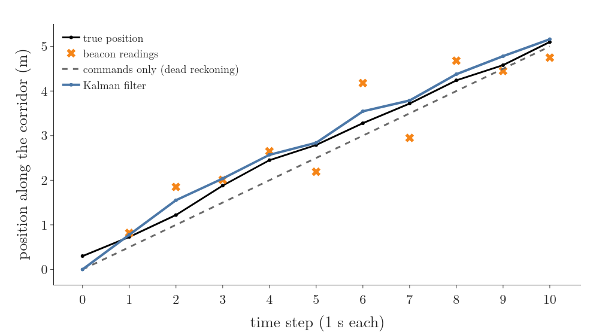
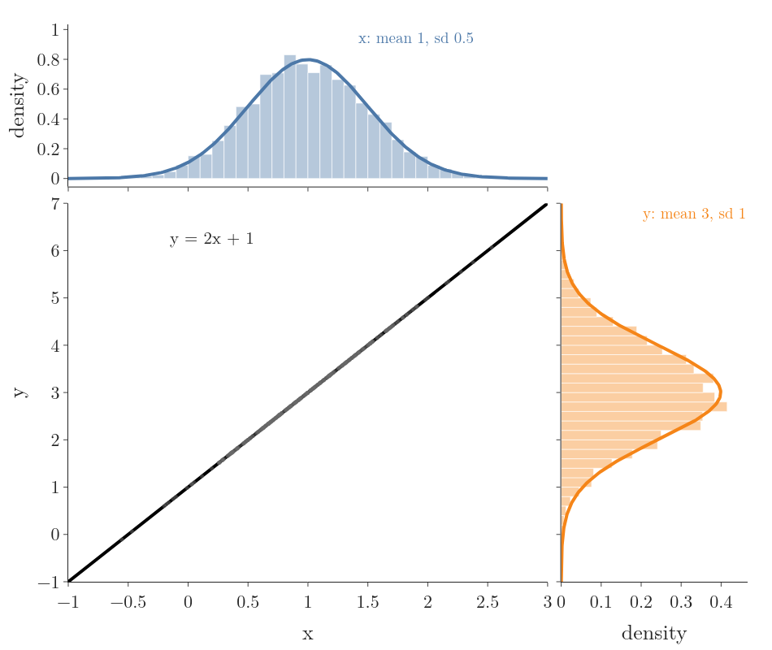
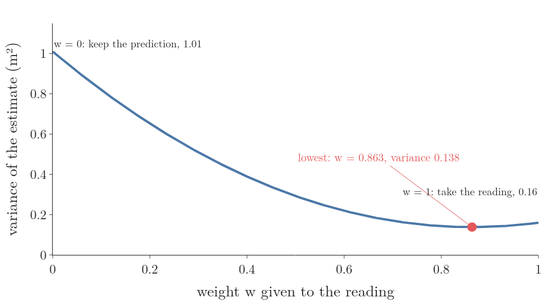
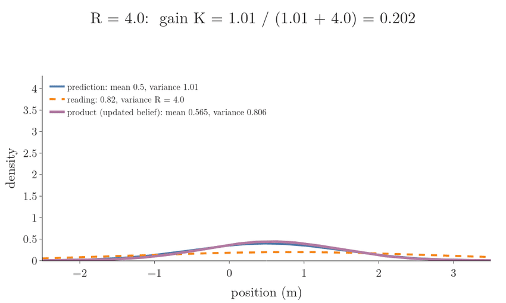
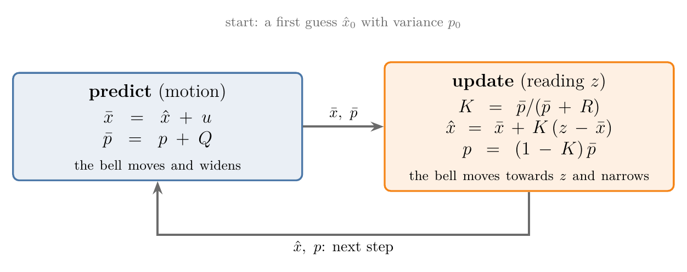
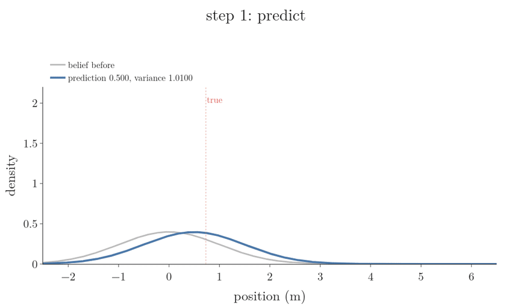
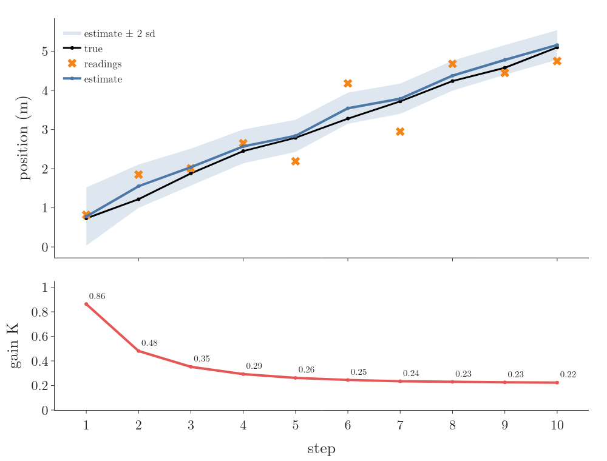
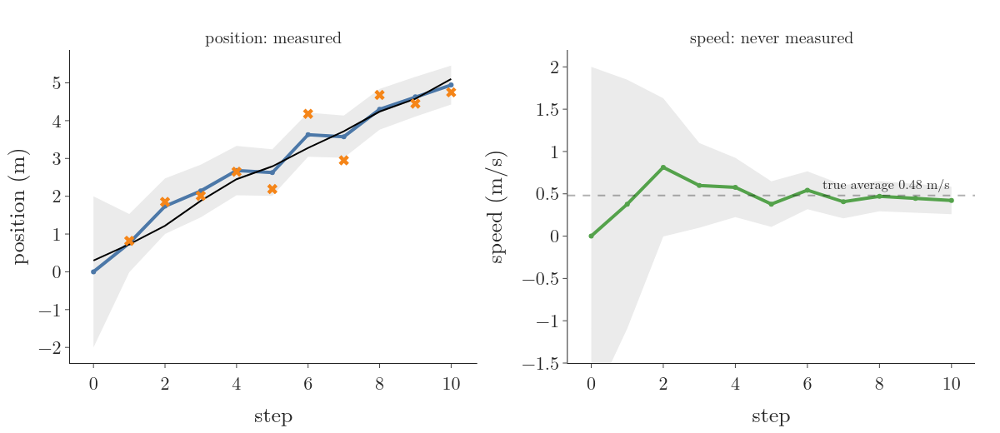
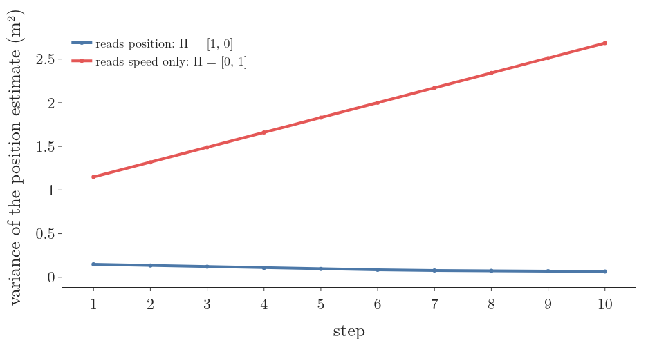
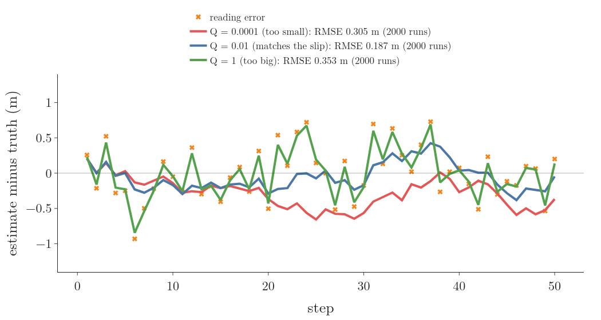

## 1. Overview

> **Key point:** A robot has two noisy ways to know where it is: its commands, which drift, and its sensor, which jumps. The Kalman filter blends them with the weight that makes the result as certain as possible, and it does so one step at a time from two numbers.

A delivery robot drives along a straight corridor. Every second it is commanded to move 0.5 m. A ceiling beacon system also reports its position once a second. Neither source is good enough on its own (Figure 1):

- **The commands** give a smooth path, but the wheels slip a little every step and the robot's starting point was only a guess, so the errors pile up. Over the ten steps of Figure 1, the commands alone miss the true position by 0.27 m on average (root mean square).
- **The beacon** has no memory, so its error does not pile up, but each reading is off by up to about 0.8 m. Its readings miss by 0.51 m on average.

The Kalman filter's estimate misses by 0.17 m, better than either (notebook). It gets there by asking, at every step, how far to trust each source, and the answer is a number we derive: the Kalman gain.

This Note builds the filter on that corridor, one step at a time, in the order of kalmanfilter.net and Becker's book:

- why a bell-shaped belief stays bell-shaped, so two numbers are enough (Section 2);
- the predict step: the bell moves and widens (Section 3);
- the update step: the gain derived as the weight that makes the variance smallest (Section 4);
- the first ten steps by hand (Section 5);
- the matrix form, which estimates a speed that is never measured, observability, and the filter as the source of the state a controller needs (Section 6);
- how to choose the two noise settings, Q and R (Section 7).

## 2. Why two numbers are enough: the linear Gaussian system

> **Key point:** If the motion and the sensor are straight-line functions of the state with added bell-shaped noise, a bell-shaped belief stays bell-shaped through every step. Then the whole belief is a mean and a variance.

### 2.1 The Bayes filter in brief

The robot's belief $\text{bel}(x_t)$ is a probability distribution over its position $x_t$ at step $t$. The [Bayes filter](../RO-014-bayes-filter/RO-014-bayes-filter.md#44-the-algorithm) updates it in two steps per round:

- **predict** with the command $u_t$, spreading the belief by the motion model $p(x_t \mid u_t, x_{t-1})$;
- **update** with the reading $z_t$, multiplying by the sensor model $p(z_t \mid x_t)$ and rescaling to a total of 1.

For a general belief these steps act on whole curves, which is costly: the [particle filter](../RO-016-particle-filter/RO-016-particle-filter.md#3-a-belief-as-a-cloud-of-samples) needs hundreds of samples to store one. The Kalman filter instead uses the case in which the curve is always a bell.

### 2.2 A bell is two numbers

A [normal distribution](../../../../MA/03-distributions/MA-024-normal-distribution/MA-024-normal-distribution.md#3-parameters-and-notation) (G-827) is fixed by its mean (where the peak is) and its variance (how wide it is). If the belief is normal, it is enough to store:

- the estimate $\hat{x}$, the mean, our best single guess;
- its variance $p$, how unsure we are, in m².

The robot's first guess is that it starts at the dock, give or take about 1 m:

$$\hat x_0 = 0 \text{ m}$$

$$p_0 = 1 \text{ m}^2$$

The true start is 0.3 m; the filter does not know that.

### 2.3 A straight-line function keeps a bell a bell

> **Key point:** Passing a normal variable through a straight line $y = ax + b$ gives another normal variable: the mean goes through the line and the variance is multiplied by $a^2$.

Take a normal variable $x$ with mean 1 and standard deviation 0.5, and the straight-line function

$$y = 2x + 1$$

Every value of $x$ is stretched by 2 and shifted by 1, so the whole bell is stretched by 2 and shifted by 1. Its shape stays a bell (Figure 2). The mean goes through the line:

$$2 \times 1 + 1 = 3$$

The standard deviation is stretched by the slope:

$$2 \times 0.5 = 1$$

**Why the variance gets $a^2$.** The [variance](../../../../MA/02-probability/MA-012-expected-value-and-variance/MA-012-expected-value-and-variance.md#4-variance-of-a-random-variable) (G-2076) is the average squared distance from the mean. For $y = ax + b$ with mean $a\mu + b$, each distance is:

$$y - (a\mu + b) = a\thinspace(x - \mu)$$

Squared:

$$a^2\thinspace(x - \mu)^2$$

Averaged, the factor $a^2$ comes out in front:

$$\text{Var}(ax + b) = a^2\thinspace\text{Var}(x)$$

With our numbers:

$$\text{Var}(y) = 4 \times 0.25 = 1$$

The shift $b$ moves the bell without widening it. That the result is still a bell, not some other shape, is a property of the normal distribution (Freiburg KF slides; Labbe ch.4).

### 2.4 Adding independent errors adds variances

The robot's next position is its present position plus the commanded 0.5 m plus a random slip $w$. When two errors are independent, their variances add:

$$\text{Var}(x + w) = \text{Var}(x) + \text{Var}(w)$$

**Why.** Square the summed error:

$$(x + w)^2 = x^2 + 2xw + w^2$$

with $x$ and $w$ measured from their means. Averaged, the middle term is zero: the two errors are independent and each has mean zero, so a positive $x$ meets a positive $w$ as often as a negative one. What is left is the two variances.

### 2.5 The linear Gaussian system

The two facts above are all the Kalman filter needs. A system is a **linear Gaussian system** (G-2507) when (Freiburg KF slides; Thrun §3.2):

1. the next state is a straight-line function of the state and the command, plus normal noise;
2. the reading is a straight-line function of the state, plus normal noise;
3. the first belief is normal.

Our robot is one:

$$x_t = x_{t-1} + u_t + w_t$$

$$z_t = x_t + v_t$$

Here $w_t$ is the wheel slip, normal with mean 0 and variance $Q = 0.01$ m² (a standard deviation of 0.1 m per step), and $v_t$ is the beacon's error, normal with mean 0 and variance $R = 0.16$ m² (a standard deviation of 0.4 m). In such a system the belief stays a bell forever, and the **Kalman filter** (G-2506) computes its mean and variance exactly: it is the Bayes filter, with nothing approximated (Freiburg KF slides).

## 3. Predict: the bell moves and widens

> **Key point:** The command moves the estimate; the slip widens it. The predicted variance is the old variance plus $Q$.

**The idea.** The robot is commanded 0.5 m, so our best guess moves 0.5 m. But we do not know how much the wheels slipped, so we are less sure than before.

**The standard terms.** The uncertainty the motion adds at each step is the **process noise** (G-2509), with variance $Q$ (kalmanfilter.net process noise). The estimate before the step's reading is the **predicted estimate** (G-2512), $\bar{x}$, also called the prior or a priori estimate, with variance $\bar{p}$.

**The formulas.** The mean goes through the motion; the variances add (Section 2.4):

$$\bar{x} = \hat{x} + u$$

$$\bar{p} = p + Q$$

**Step 1 on the corridor.** From the first guess:

$$\bar x_1 = 0 + 0.5 = 0.5 \text{ m}$$

$$\bar p_1 = 1 + 0.01 = 1.01 \text{ m}^2$$

Frame "step 1: predict" of Figure 6 (Section 5) shows the bell moving 0.5 m and widening a little.

If the robot drove with no readings at all, the variance would grow by $Q$ every step. After 100 steps:

$$p = 1 + 100 \times 0.01 = 2 \text{ m}^2$$

$$\sqrt{2} = 1.4 \text{ m standard deviation}$$

The commands alone always drift; a reading is needed to pull the variance down.

## 4. Update: the gain that makes the estimate most certain

> **Key point:** The new estimate is a weighted average of the prediction and the reading. The weight on the reading that gives the smallest variance is the Kalman gain $K = \bar{p}/(\bar{p} + R)$: large when the prediction is unsure, small when the reading is.

### 4.1 Two estimates of one position

After the predict step of step 1, we have two estimates of the same position:

| Source | Value | Variance |
|---|---|---|
| prediction | $\bar x_1 = 0.5$ m | $\bar p_1 = 1.01$ m² |
| beacon reading | $z_1 = 0.82$ m | $R = 0.16$ m² |

The reading's error has a variance $R$, the **measurement noise** (G-2510) variance, which comes from the sensor's datasheet or from a calibration (Section 7.1).

Neither should be thrown away. A natural blend is a weighted average, with weight $w$ on the reading and $1 - w$ on the prediction:

$$\hat{x} = w\thinspace z + (1 - w)\thinspace\bar{x}$$

Which $w$? Taking $w = 0$ keeps the prediction, $w = 1$ takes the reading, and anything in between mixes them. We want the $w$ that makes the blended estimate as certain as possible: the smallest variance.

### 4.2 The variance of the blend

The prediction's error and the reading's error are independent. By Section 2.3, scaling an error by $w$ scales its variance by $w^2$; by Section 2.4, independent variances add:

$$p(w) = w^2 R + (1 - w)^2\thinspace\bar{p}$$

With our numbers:

$$p(w) = 0.16\thinspace w^2 + 1.01\thinspace(1 - w)^2$$

Figure 3 plots it. At the ends:

$$p(0) = 1.01 \quad \text{(prediction only)}$$

$$p(1) = 0.16 \quad \text{(reading only)}$$

In between, the curve dips below both: mixing two independent estimates beats either one.

### 4.3 The best weight: the Kalman gain

The lowest point of a smooth curve is where its slope is zero. The [derivative](../../../../MA/06-calculus/MA-061-derivatives-of-one-variable/MA-061-derivatives-of-one-variable.md#41-from-secant-to-tangent) of $p(w)$, term by term:

$$\frac{dp}{dw} = 2wR - 2(1 - w)\thinspace\bar{p}$$

Set it to zero and divide by 2:

$$wR = (1 - w)\thinspace\bar{p}$$

$$wR + w\bar{p} = \bar{p}$$

$$w = \frac{\bar{p}}{\bar{p} + R}$$

This best weight is the **Kalman gain** (G-2508), written $K$ (kalmanfilter.net 1D; Becker ch.4). For step 1:

$$K_1 = \frac{1.01}{1.01 + 0.16}$$

$$= 1.01 / 1.17 = 0.863$$

The reading gets 86 percent of the say, because our first guess (variance 1.01) was far less certain than the beacon (0.16).

**Checks at easy values** (kalmanfilter.net 1D):

- A perfect sensor, $R = 0$: the top and bottom of the gain are equal, so $K = 1$, and the estimate is the reading.
- A perfect prediction, $\bar{p} = 0$: $K = 0$, and the reading is ignored.
- Equal variances: $K = 0.5$, a plain average.

So $K$ always lies between 0 and 1.

### 4.4 The updated estimate and its variance

Put $w = K$ into the weighted average and regroup:

$$\hat{x} = Kz + (1 - K)\thinspace\bar{x}$$

$$\hat{x} = \bar{x} + K\thinspace(z - \bar{x})$$

The second form reads: start from the prediction and move a fraction $K$ of the way towards the reading. The gap between the reading and the prediction, $z - \bar{x}$, is the **innovation** (G-2511): the part of the reading the prediction did not expect.

For step 1, the innovation is:

$$z_1 - \bar x_1 = 0.82 - 0.5 = 0.32$$

The updated estimate:

$$\hat x_1 = 0.5 + 0.863 \times 0.32$$

$$= 0.5 + 0.276 = 0.776 \text{ m}$$

The true position is 0.73 m.

**The variance.** Put $w = K$ into $p(w)$. The two weights are:

$$K = \frac{\bar{p}}{\bar{p} + R}$$

$$1 - K = \frac{R}{\bar{p} + R}$$

So the two terms of $p(w)$ are:

$$K^2 R = \frac{\bar{p}^2 R}{(\bar{p} + R)^2}$$

$$(1 - K)^2\thinspace\bar{p} = \frac{R^2\thinspace\bar{p}}{(\bar{p} + R)^2}$$

Add them and take out the shared $\bar{p} R$:

$$p = \frac{\bar{p} R\thinspace(\bar{p} + R)}{(\bar{p} + R)^2}$$

$$= \frac{R}{\bar{p} + R}\thinspace\bar{p}$$

$$= (1 - K)\thinspace\bar{p}$$

(kalmanfilter.net 1D).

For step 1:

$$p_1 = 0.137 \times 1.01 = 0.138 \text{ m}^2$$

the lowest point of Figure 3. The standard deviation has fallen from 1 m to 0.37 m. Because $1 - K$ is at most 1, an update never makes the filter less sure. The estimate after the reading is the **updated estimate** (G-2513), also called the posterior or a posteriori estimate.

### 4.5 The same answer from multiplying bells

The Bayes filter's update multiplies the predicted belief by the sensor model and rescales, as the [continuous Bayes filter](../RO-014-bayes-filter/RO-014-bayes-filter.md#6-the-same-two-steps-on-a-continuous-position) previewed. Both are bells here, and the product of two bells is again a bell (Labbe ch.4; Freiburg KF slides), with mean and variance:

$$\text{mean} = \frac{R\thinspace\bar{x} + \bar{p}\thinspace z}{\bar{p} + R}$$

$$\text{variance} = \frac{\bar{p}\thinspace R}{\bar{p} + R}$$

For step 1:

$$\frac{0.16 \times 0.5 + 1.01 \times 0.82}{1.17}$$

$$= 0.908 / 1.17 = 0.776$$

$$\frac{1.01 \times 0.16}{1.17} = 0.138$$

The same numbers as Section 4.4: the variance-minimising blend and the Bayes update are one and the same. Figure 4 multiplies the step-1 prediction by readings of different quality. A vague reading ($R = 4$) gives $K = 0.202$ and barely moves the bell; the real beacon ($R = 0.16$) gives $K = 0.863$; a sharp reading ($R = 0.01$) gives $K = 0.990$ and the product sits on the reading.

## 5. Ten steps on the corridor

> **Key point:** Predict, then update, every step. The gain starts high, while the first guess is vague, and settles to a fixed value once the variance stops changing.

Figure 5 shows the two steps as a loop. The filter keeps only $\hat{x}$ and $p$ from one step to the next: it never stores the past readings, yet its estimate uses all of them (kalmanfilter.net 1D; Labbe ch.4).

**Step 1** is Sections 3 and 4: prediction 0.5 m (variance 1.01), reading 0.82 m, gain 0.863, estimate 0.776 m (variance 0.138).

**Step 2.** Predict from step 1's estimate:

$$\bar x_2 = 0.776 + 0.5 = 1.276$$

$$\bar p_2 = 0.138 + 0.01 = 0.148$$

The reading is $z_2 = 1.85$ m. The gain:

$$K_2 = 0.148 / (0.148 + 0.16)$$

$$= 0.148 / 0.308 = 0.481$$

The prediction is now about as certain as the reading, so the gain is near one half. The innovation:

$$z_2 - \bar x_2 = 1.85 - 1.276 = 0.574$$

The update:

$$\hat x_2 = 1.276 + 0.481 \times 0.574$$

$$= 1.276 + 0.276 = 1.552 \text{ m}$$

$$p_2 = 0.519 \times 0.148 = 0.077 \text{ m}^2$$

The true position is 1.22 m. The reading 1.85 m was 0.63 m too high, and the filter followed it only halfway.

**Steps 3 to 10** (notebook):

| Step | $\bar{x}$ | $\bar{p}$ | $K$ | $z$ | $\hat{x}$ | $p$ | True |
|---|---|---|---|---|---|---|---|
| 1 | 0.500 | 1.010 | 0.863 | 0.82 | 0.776 | 0.138 | 0.73 |
| 2 | 1.276 | 0.148 | 0.481 | 1.85 | 1.552 | 0.077 | 1.22 |
| 3 | 2.052 | 0.087 | 0.352 | 2.01 | 2.037 | 0.056 | 1.88 |
| 4 | 2.537 | 0.066 | 0.293 | 2.65 | 2.570 | 0.047 | 2.45 |
| 5 | 3.070 | 0.057 | 0.262 | 2.19 | 2.839 | 0.042 | 2.79 |
| 6 | 3.339 | 0.052 | 0.245 | 4.18 | 3.545 | 0.039 | 3.28 |
| 7 | 4.045 | 0.049 | 0.235 | 2.95 | 3.788 | 0.038 | 3.72 |
| 8 | 4.288 | 0.048 | 0.230 | 4.68 | 4.378 | 0.037 | 4.24 |
| 9 | 4.878 | 0.047 | 0.226 | 4.45 | 4.781 | 0.036 | 4.58 |
| 10 | 5.281 | 0.046 | 0.224 | 4.75 | 5.162 | 0.036 | 5.10 |

Variances are in m², positions in m.

What to see in Figures 6 and 7:

- **The gain falls, then settles.** Each update shrinks the variance, and each prediction adds back only $Q = 0.01$. After a few steps the two balance: the variance before each reading settles near 0.046 and the gain near 0.22 (0.2207 in the long run, notebook). The filter has stopped learning about its start and now trusts each reading about a fifth. The fixed value the gain approaches is the **steady-state gain** (G-2518).
- **Wild readings are damped.** The reading at step 6 was 0.9 m too high; the estimate moved only 0.21 m towards it, because the gain was 0.245.
- **The band is honest.** The shaded band in Figure 7 is the estimate plus and minus two standard deviations; the true position stays inside it at every step.

## 6. The matrix form: more than one number

> **Key point:** With a state of several numbers, the variance becomes a covariance matrix and the same five lines become matrix lines. The covariance between position and speed lets a position reading correct a speed that is never measured.

### 6.1 Why a vector state: the hidden speed

So far the filter knew the commanded 0.5 m per step. Suppose instead we do not know the robot's speed, only that it drives roughly steadily: a person is pushing a trolley, or the odometry is unreliable. We still want the speed, for example because a speed controller needs it (Section 6.5), but nothing measures it.

We put the speed into the state. The state is now a vector (a list of numbers) with two entries:

$$\mathbf{x} = \begin{bmatrix} \text{position} \cr\text{speed} \end{bmatrix}$$

Its uncertainty is a 2 × 2 [covariance matrix](../../../../ML/05-dimensionality/ML-047-pca-step-by-step/ML-047-pca-step-by-step.md#33-the-covariance-matrix) (G-495) $P$: the variances of position and speed on the diagonal, and their covariance off it. The belief is a [multivariate normal distribution](../../../../MA/08-likelihood/MA-073-gaussian-mixture-models/MA-073-gaussian-mixture-models.md#71-the-multivariate-normal) (G-1283) with mean $\hat{\mathbf{x}}$ and covariance $P$.

### 6.2 The model as matrices

**Motion.** With steps of 1 s, the position grows by the speed and the speed stays as it is, plus noise. As a matrix times the state:

$$\mathbf x_t = F\thinspace\mathbf x_{t-1} + \mathbf w_t$$

$$F = \begin{bmatrix} 1 & 1 \cr0 & 1 \end{bmatrix}$$

The first row gives position plus speed; the second gives speed. $F$ is the **state transition matrix** (G-2514); this choice of $F$ is the constant-velocity model (Labbe ch.6). The noise $\mathbf w_t$ has covariance

$$Q = \begin{bmatrix} 0.01 & 0 \cr0 & 0.001 \end{bmatrix}$$

a position slip of 0.1 m and a speed change of about 0.03 m/s per step.

**Reading.** The beacon reads position, not speed:

$$z_t = H\thinspace\mathbf x_t + v_t$$

$$H = \begin{bmatrix} 1 & 0 \end{bmatrix}$$

$H$ is the **measurement matrix** (G-2515): it picks out of the state what the sensor sees. The reading noise is the same, $R = 0.16$.

### 6.3 The five lines in matrix form

Each line is the one-dimensional line with numbers replaced by matrices (Labbe ch.6; kalmanfilter.net multivariate; Freiburg KF slides). The [transpose](../../../../ML/05-dimensionality/ML-047-pca-step-by-step/ML-047-pca-step-by-step.md#21-projecting-one-point) (G-2012) $F^{\mathsf T}$ flips a matrix over its diagonal, and $S^{-1}$ is the [inverse](../../../../ML/06-regression/ML-053-multiple-lr-maths/ML-053-multiple-lr-maths.md#6-the-normal-equation) (G-968), here simply 1 divided by the number $S$.

| Step | One number | Matrix form |
|---|---|---|
| predict mean | $\bar{x} = \hat{x} + u$ | $\bar{\mathbf{x}} = F\thinspace\hat{\mathbf{x}}$ |
| predict variance | $\bar{p} = p + Q$ | $\bar{P} = F P F^{\mathsf T} + Q$ |
| innovation variance | $\bar{p} + R$ | $S = H \bar{P} H^{\mathsf T} + R$ |
| gain | $K = \bar{p} / (\bar{p} + R)$ | $K = \bar{P} H^{\mathsf T} S^{-1}$ |
| update mean | $\hat{x} = \bar{x} + K(z - \bar{x})$ | $\hat{\mathbf{x}} = \bar{\mathbf{x}} + K(z - H\bar{\mathbf{x}})$ |
| update variance | $p = (1 - K)\thinspace\bar{p}$ | $P = (I - KH)\thinspace\bar{P}$ |

The only new piece is $F P F^{\mathsf T}$. It is the matrix version of Section 2.3's rule "variance times slope squared": a linear map $F$ turns a covariance $P$ into $F P F^{\mathsf T}$ (Labbe ch.7). The matrix gain is derived the same way as in Section 4.3, by making the updated variances as small as possible (Labbe ch.7, "Deriving the Kalman gain equation").

### 6.4 One step in matrix form, and the speed nobody measured

Start at position 0, speed 0, both with variance 1 and no covariance:

$$\hat{\mathbf x_0} = \begin{bmatrix} 0 \cr0 \end{bmatrix}$$

$$P_0 = \begin{bmatrix} 1 & 0 \cr0 & 1 \end{bmatrix}$$

**Predict.** The mean stays at zero. $P_0$ is the identity matrix, so $F P_0 F^{\mathsf T}$ is $F F^{\mathsf T}$. Each entry is a row of $F$ times a row of $F$:

$$\text{top left: } 1 \times 1 + 1 \times 1 = 2$$

$$\text{off-diagonal: } 1 \times 0 + 1 \times 1 = 1$$

$$\text{bottom right: } 0 \times 0 + 1 \times 1 = 1$$

$$F P_0 F^{\mathsf T} = \begin{bmatrix} 2 & 1 \cr1 & 1 \end{bmatrix}$$

$$\bar P_1 = \begin{bmatrix} 2.01 & 1 \cr1 & 1.001 \end{bmatrix}$$

The position variance has grown from 1 to 2.01, because an unknown speed adds an unknown distance. The off-diagonal 1 is new: the prediction now links the two errors. If the robot is further along than predicted, it was probably faster.

**Update** with the first reading $z_1 = 0.82$:

$$S = 2.01 + 0.16 = 2.17$$

$H = [1, 0]$ picks the first column of $\bar P_1$, so $\bar P_1 H^{\mathsf T} = (2.01, 1)$, and dividing by $S$ gives the gain:

$$K = \begin{bmatrix} 2.01 / 2.17 \cr1 / 2.17 \end{bmatrix}$$

$$= \begin{bmatrix} 0.926 \cr0.461 \end{bmatrix}$$

The prediction was 0, so the innovation is the whole reading, 0.82. The new state:

$$0.926 \times 0.82 = 0.760$$

$$0.461 \times 0.82 = 0.378$$

$$\hat{\mathbf x_1} = \begin{bmatrix} 0.760 \cr0.378 \end{bmatrix}$$

One position reading has given a speed estimate of 0.378 m/s. The gain's second entry is the covariance divided by $S$: through the link in $\bar{P}$, a position surprise becomes a speed correction.

Figure 8 runs all ten readings. The speed estimate jumps around at first, then settles: after step 10 it is 0.421 m/s with a standard deviation of 0.081 m/s, against the robot's true average speed of 0.48 m/s, inside one standard deviation (notebook). A quantity that no sensor measures has been estimated from how the measured one changes, which kalmanfilter.net and Labbe ch.6 call the strength of the multivariate filter.

### 6.5 Observability: can the readings pin down the state?

Could we do the same with a speed sensor and no position sensor? No. Every position, shifted by the same amount, gives exactly the same speed readings, so no number of speed readings can tell where the robot is.

A system is **observable** (G-2517) if its whole state can be worked out from its readings (and commands) over time (FBS §8.1). The test: stack the measurement matrix and what it sees one step later,

$$\mathcal{O} = \begin{bmatrix} H \cr HF \end{bmatrix}$$

and check that its [rank](../../../../MA/05-linear-algebra/MA-052-linear-combinations-span-and-basis/MA-052-linear-combinations-span-and-basis.md#7-linear-dependence-and-independence) (G-1627) equals the number of state variables, here 2 (FBS Theorem 8.1). For the position sensor:

$$H = \begin{bmatrix} 1 & 0 \end{bmatrix}$$

$$HF = \begin{bmatrix} 1 & 1 \end{bmatrix}$$

The two rows point in different directions: rank 2, observable. Two position readings one second apart give the position and, from their difference, the speed. For a speed sensor:

$$H = \begin{bmatrix} 0 & 1 \end{bmatrix}$$

$$HF = \begin{bmatrix} 0 & 1 \end{bmatrix}$$

The rows are the same: rank 1, not observable. Figure 9 shows what that does to the filter: with the speed sensor, the variance of the position estimate grows every step, to 2.68 m² after ten steps; with the position sensor it falls to 0.066 m² (notebook). A Kalman filter on an unobservable system runs without error messages but cannot shrink the uncertainty in the hidden direction, so checking observability comes before building the filter.

### 6.6 The state a controller needs: the filter as an observer

A controller that holds the robot at 0.5 m/s must know the speed; one that stops it at a door must know the position. Many controllers need the whole state, but sensors give only part of it (FBS §8.1). Something must rebuild the missing parts.

The obvious attempt is to run the model alone, with no readings: each step, multiply the last estimate by $F$. That is dead reckoning: any error in the start or in the model is never corrected. The fix is feedback: compare the reading with what the estimate predicts, and correct the estimate by a gain times the gap,

$$\hat{\mathbf{x}} = \bar{\mathbf{x}} + L\thinspace(z - H\bar{\mathbf{x}})$$

A model run alongside the real system and corrected this way is a **state observer** (G-2516) (FBS §8.2). The size of the gain $L$ is a trade-off: a large gain corrects errors fast but passes the sensor's noise straight into the estimate (FBS §8.2). The Kalman filter is the observer whose gain, $L = K$, is the best compromise for the given noises (FBS §8.2). The controller then uses $\hat{\mathbf{x}}$ in place of the true state (FBS §8.3), which is why the Kalman filter sits between the sensors and the controller in most robots.

## 7. Choosing Q and R

> **Key point:** R describes the sensor and is measured; Q describes how far the motion can stray from the model and is tuned. Only their ratio changes the estimates.

### 7.1 R: measure the sensor

$R$ is the variance of the sensor's error, so it can be measured: put the robot on a mark at a known position and record many readings (kalmanfilter.net 1D). We parked the robot at exactly 2.00 m and took 100 readings (`data/beacon_calibration.csv`):

$$\text{mean} = 2.018 \text{ m}$$

$$\text{sample variance} = 0.134 \text{ m}^2$$

The datasheet value is 0.16 m². With 100 readings, a sample variance itself scatters from sample to sample. For normal readings its standard deviation is:

$$0.16 \times \sqrt{2 / 99} = 0.023 \text{ m}^2$$

The datasheet and the measured value differ by about one such scatter, the size of difference chance alone produces. Sensor datasheets are the other source of $R$ (kalmanfilter.net 1D). The mean, 2.018 m, also shows no sizeable bias, which matters because the Kalman filter assumes the noise has mean zero.

### 7.2 Q: tune the motion noise

$Q$ is harder: it covers everything the motion model leaves out (slips, pushes, a wheel radius slightly wrong), so there is no datasheet for it, and it is set by tuning against data (Labbe ch.8). Each wrong choice fails in its own way. We simulated 2000 runs of 50 steps in which the true slip variance is 0.01, and ran three filters on them (Figure 10):

| Filter's $Q$ | Gain it settles to | Error (RMSE, steps 11–50) | What goes wrong |
|---|---|---|---|
| 0.0001 (too small) | 0.10 at step 10, falling | 0.305 m | trusts the commands, ignores readings, drifts with the slips |
| 0.01 (right) | 0.22 | 0.187 m | none |
| 1 (too big) | 0.88 | 0.353 m | trusts each reading, copies its noise |

The readings alone give 0.399 m. Too small a $Q$ makes the filter overconfident in its model, so it reacts slowly or not at all; too large a $Q$ makes it jump at every reading (Labbe ch.4, "Incorrect process variance"; kalmanfilter.net process noise, where a too-small $Q$ causes a lag error).

**Only the ratio matters.** Multiply $Q$, $R$ and the first variance all by 10: every gain $\bar{p}/(\bar{p} + R)$ has a 10 on top and below, so the gains and the estimates are the same; the notebook finds a largest difference of exactly 0. What a filter designer really chooses is how much the model is trusted relative to the sensor.

**How to tell when it is wrong without knowing the truth.** On a real robot the truth is unknown, but the innovations are not: a well-tuned filter's innovations look like random noise of the size its own $S$ predicts. Testing them is the subject of [filter honesty](../RO-018-extended-kalman-filter/RO-018-extended-kalman-filter.md#5-filter-honesty-is-the-filter-telling-the-truth-about-itself) in the next Note.

> **Extra:** The letters differ between books. kalmanfilter.net, Labbe and the Freiburg slides use $Q$ for the motion noise and $R$ for the sensor noise, as here. Thrun's *Probabilistic Robotics* uses the opposite: $R_t$ for the motion and $Q_t$ for the sensor. Check which convention a text uses before copying a formula.

## 8. Summary

| Line | Formula | Why |
|---|---|---|
| predict mean | $\bar{x} = \hat{x} + u$ | the command moves the robot |
| predict variance | $\bar{p} = p + Q$ | independent slip variances add |
| gain | $K = \bar{p}/(\bar{p} + R)$ | the weight that makes the blended variance smallest |
| update mean | $\hat{x} = \bar{x} + K(z - \bar{x})$ | move a fraction $K$ of the way to the reading |
| update variance | $p = (1 - K)\thinspace\bar{p}$ | blending two independent estimates beats either |

- In a linear Gaussian system the belief stays a bell, because straight-line functions keep bells bells and independent variances add, so a mean and a variance carry the whole belief.
- The predict step widens the bell by $Q$, so the commands alone always drift: after 100 steps the standard deviation would be 1.4 m.
- The Kalman gain is derived, not chosen: it is the weight on the reading that minimises the updated variance, and it equals the Bayes update of two multiplied bells (0.776 m and 0.138 m² at step 1 either way).
- The gain is high while the estimate is vague (0.863 at step 1) and settles near 0.22 once prediction and reading balance, so wild readings are damped.
- In matrix form the covariance links position and speed, so position readings estimate a speed nobody measures (0.421 m/s against a true 0.48 m/s).
- Observability decides what readings can pin down: position readings give both variables (rank 2), speed readings never give the position, whose variance grows to 2.68 m².
- The Kalman filter is the observer with the best gain for the given noises, so it supplies the full state a controller needs from partial sensors.
- $R$ is measured from the sensor, $Q$ is tuned; too small a $Q$ drifts, too large a $Q$ is noisy, and only the ratio matters.

So the corridor robot's two poor sources make one good one: its estimate misses by 0.17 m against 0.27 m for the commands and 0.51 m for the beacon, because at every step the gain gives each source exactly the trust its variance earns.

## 9. Sources

**Built from**

- MATLAB, "Understanding Kalman Filters, Part 2: State Observers", YouTube, https://www.youtube.com/watch?v=4OerJmPpkRg
- MATLAB, "Understanding Kalman Filters, Part 3: Optimal State Estimator", YouTube, https://www.youtube.com/watch?v=ul3u2yLPwU0
- MATLAB, "Understanding Kalman Filters, Part 4: Optimal State Estimator Algorithm", YouTube, https://www.youtube.com/watch?v=VFXf1lIZ3p8
- Lars Hammarstrand (Chalmers), "4.3.3 Kalman filter tuning and consistency: motion and measurement models", YouTube, https://www.youtube.com/watch?v=WroIS3pPfjM
- Steve Brunton, "Control Bootcamp: Observability", YouTube, https://www.youtube.com/watch?v=iRZmJBcg1ZA
- Becker, A. *Kalman Filter from the Ground Up*, and its free tutorial pages: "Kalman Filter in one dimension" https://www.kalmanfilter.net/kalman1d.html, "Adding process noise" https://www.kalmanfilter.net/kalman1d_pn.html, "Multivariate Kalman Filter" https://www.kalmanfilter.net/kalmanmulti.html (kalmanfilter.net 1D, process noise, multivariate; Becker ch.4)
- Labbe, R. *Kalman and Bayesian Filters in Python*, ch.4 "One Dimensional Kalman Filters", ch.6 "Multivariate Kalman Filters", ch.7 "Kalman Filter Math", ch.8 "Designing Kalman Filters", https://github.com/rlabbe/Kalman-and-Bayesian-Filters-in-Python (Labbe ch.4, ch.6, ch.7, ch.8)
- Åström, K. J. and Murray, R. M. (2021). *Feedback Systems*, 2nd ed., ch.8 "Output Feedback", §8.1 Observability, §8.2 State estimation, §8.3 Control using estimated state. Free: https://fbswiki.org (FBS)
- Burgard, W. et al. (Uni Freiburg), *Introduction to Mobile Robotics*, "Bayes Filter – Kalman Filter" slides, http://ais.informatik.uni-freiburg.de/teaching/ss23/robotics/slides/10-kalman.pdf (Freiburg KF slides)

**Other references**

- NPTEL-NOC IITM, "Introduction to Robotics, #33 Kalman Filter", YouTube, https://www.youtube.com/watch?v=E9QL8XWJIh8
- Thrun, S., Burgard, W. and Fox, D. (2005). *Probabilistic Robotics*. MIT Press. §3.2 "The Kalman Filter"; cited for what the Freiburg slides confirm (Thrun)

## 10. Key terms

Terms taught in this Note come first; linked terms are recaps, taught in the Note the link opens.

| Term | Meaning |
|---|---|
| Linear Gaussian system (G-2507) | A system whose next state and whose readings are straight-line functions of the state plus normal noise, starting from a normal belief; in it the belief stays normal, so the Kalman filter is exact. |
| Kalman filter (G-2506) | The Bayes filter for a linear Gaussian system: it keeps the belief as a mean and a (co)variance and updates them with a predict step and an update step, blending a model's prediction with a sensor reading so the result is as certain as possible. |
| Process noise $Q$ (G-2509) | The random part of the motion the model leaves out (wheel slip, pushes), given as its variance or covariance $Q$; it widens the belief at every predict step and is usually set by tuning. |
| Predicted estimate (a priori) (G-2512) | The estimate and its variance after the predict step and before the step's reading, $\bar{x}$ and $\bar{p}$; it says what the model alone expects. |
| Measurement noise $R$ (G-2510) | The random error of a sensor reading, given as its variance or covariance $R$; it sets how much the filter trusts each reading and is taken from the datasheet or measured in a calibration. |
| Kalman gain $K$ (G-2508) | The weight the update gives to the reading, $K = \bar{p}/(\bar{p} + R)$ in one dimension: the weight that makes the updated variance smallest, near 1 when the prediction is vague and near 0 when the reading is. |
| Innovation (G-2511) | The gap between a reading and the reading the prediction expected, $z - H\bar{x}$; the update moves the estimate by the gain times this gap, and its size is used to check the filter. |
| Updated estimate (a posteriori) (G-2513) | The estimate and its variance after the reading has been blended in, $\hat{x}$ and $p$; it is the filter's output for the step and the start of the next. |
| Steady-state gain (G-2518) | The fixed value the Kalman gain settles to once the variance added by each prediction balances the variance removed by each update, such as 0.22 for $Q = 0.01$ and $R = 0.16$. |
| State transition matrix $F$ (G-2514) | The matrix that carries the state one step forward in a linear model, such as $F = [[1, 1], [0, 1]]$ for position and speed with 1 s steps (position plus speed, speed unchanged). |
| Measurement matrix $H$ (G-2515) | The matrix that turns the state into the reading the sensor should give, such as $H = [1, 0]$ for a sensor that sees position but not speed. |
| Observability (G-2517) | Whether a system's whole state can be worked out from its readings and commands over time; tested by the rank of $[H;\ HF;\ \ldots]$, and needed before a filter can pin down every state variable. |
| State observer (G-2516) | A model run alongside the real system and corrected by a gain times the gap between the measured and the predicted reading, so it rebuilds states no sensor measures for a controller to use; the Kalman filter is the observer with the best gain for the given noises. |
| [Gaussian distribution](../../../../MA/03-distributions/MA-024-normal-distribution/MA-024-normal-distribution.md#2-what-the-normal-distribution-is) (G-827) | Another name for the normal distribution: the symmetric, bell-shaped continuous distribution set by its mean and standard deviation, used to model many measurements. |
| [Variance of a random variable](../../../../MA/02-probability/MA-012-expected-value-and-variance/MA-012-expected-value-and-variance.md#4-variance-of-a-random-variable) (G-2076) | How spread out a random variable's values are: the expected squared distance from its expected value, $\mathrm{Var}(X) = E[(X - E[X])^2]$. |
| [Covariance matrix](../../../../ML/05-dimensionality/ML-047-pca-step-by-step/ML-047-pca-step-by-step.md#33-the-covariance-matrix) (G-495) | A square table with every feature's variance on the diagonal and every pair's covariance off it, so it sums up how the data spreads and which features move together; PCA takes its eigenvectors. |
| [Multivariate normal distribution](../../../../MA/08-likelihood/MA-073-gaussian-mixture-models/MA-073-gaussian-mixture-models.md#71-the-multivariate-normal) (G-1283) | The bell-shaped (normal) distribution for several numbers at once, a vector; it is set by a mean vector (its centre) and a covariance matrix (its spread and how the numbers vary together). |
| [Transpose](../../../../ML/06-regression/ML-053-multiple-lr-maths/ML-053-multiple-lr-maths.md#41-two-rules-about-transposes) (G-2012) | A matrix or vector with rows and columns swapped; it turns a column vector $u$ into a row $u^{\mathsf T}$, so $u^{\mathsf T}x$ is the dot product. |
| [Inverse matrix](../../../../ML/06-regression/ML-053-multiple-lr-maths/ML-053-multiple-lr-maths.md#6-the-normal-equation) (G-968) | The matrix that undoes another: their product is the identity matrix. |
| [Rank (of a matrix)](../../../../MA/05-linear-algebra/MA-058-computing-the-svd/MA-058-computing-the-svd.md#5-a-matrix-of-rank-1) (G-1627) | The number of linearly independent columns of a matrix, that is, how many directions its columns really span; a column that is a combination of others does not add to it. |
