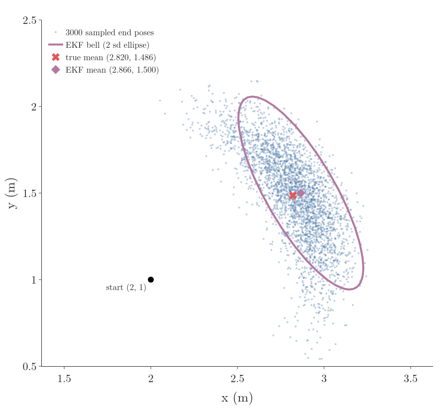
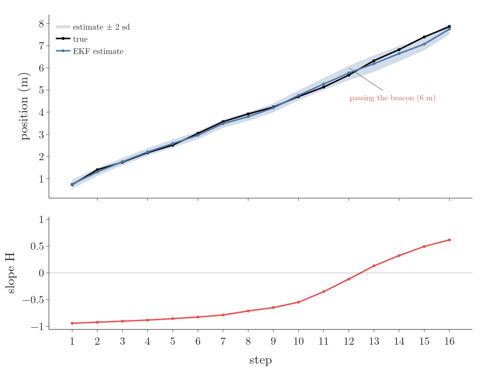
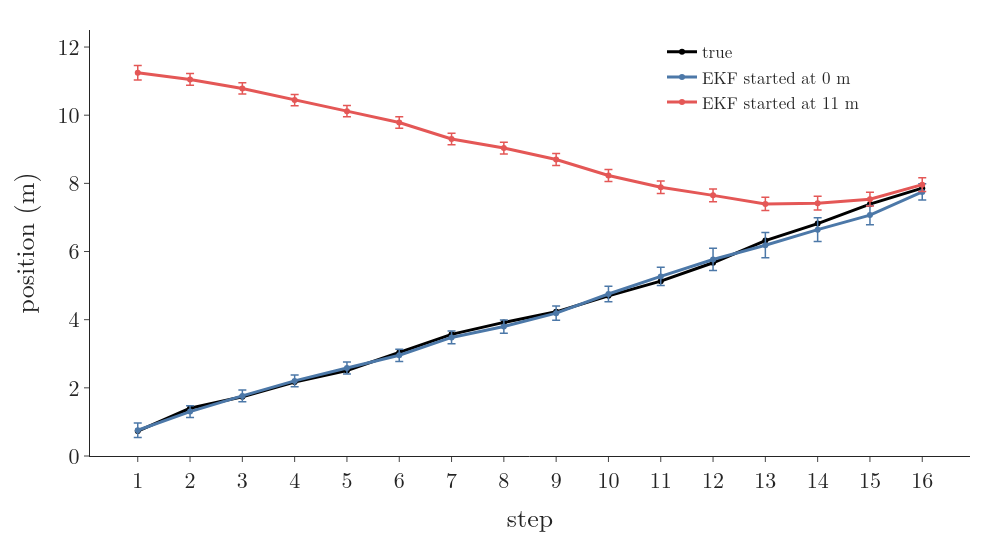
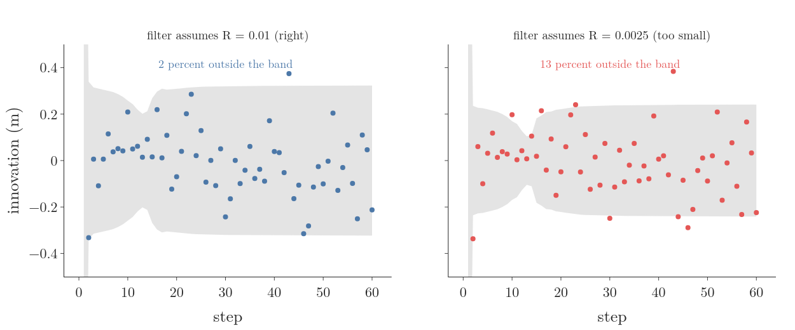
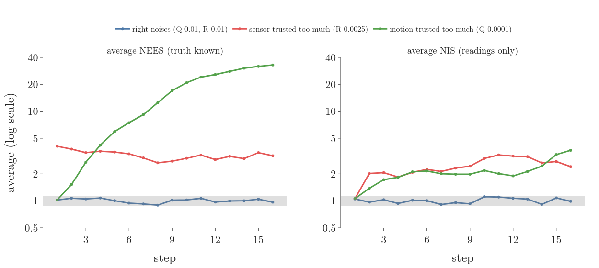

## 1. Overview

> **Key point:** Most robot sensors and motions are curved functions of the state, and a curve bends a bell out of shape. The extended Kalman filter replaces each curve by its tangent line at the current estimate and then runs the ordinary Kalman filter; checking its innovations tells us whether it can be trusted.

The corridor robot of [the Kalman filter](../RO-017-kalman-filter/RO-017-kalman-filter.md#1-overview) has a new sensor. Instead of a ceiling system that reports its position, it has a radio beacon fixed on the wall at 6 m along the corridor, 2 m to the side, and it measures its straight-line distance to the beacon (Figure 1). Such range sensors are common: radio beacons, GPS ranges to satellites, a lidar's range to a landmark.

The reading is no longer the position plus noise. It is a curved function of the position:

- far from the beacon, the distance changes almost one for one with position, nearly a straight line;
- under the beacon, the distance stops changing: it bottoms out at 2 m;
- past the beacon, it grows again, so 4 m and 8 m give the same reading.

The Kalman filter needs straight-line models (Section 2). This Note shows what a curve does to a bell, how the extended Kalman filter straightens it, and how to tell when the result has gone wrong:

- pushing a bell through a curve, and the tangent-line fix (Section 3);
- the extended Kalman filter, step by step on the corridor (Section 4);
- its limits: one bell can hold only one side (Section 4.4);
- filter honesty: the innovation, its covariance, and the NIS and NEES tests (Section 5).

## 2. The Kalman filter in brief, and why curves break it

> **Key point:** The Kalman filter is exact only because straight-line functions keep a bell a bell. A curved function does not.

The [Kalman filter](../RO-017-kalman-filter/RO-017-kalman-filter.md#63-the-five-lines-in-matrix-form) keeps the belief as a mean $\hat{x}$ and a variance $p$ and runs two steps per round:

- **predict:** move the mean with the command and add the process noise $Q$ to the variance;
- **update:** blend in the reading $z$ with the [Kalman gain](../RO-017-kalman-filter/RO-017-kalman-filter.md#43-the-best-weight-the-kalman-gain) (G-2508), which gives the reading the weight that makes the new variance smallest.

Both steps rest on one fact: a [straight-line function keeps a bell a bell](../RO-017-kalman-filter/RO-017-kalman-filter.md#23-a-straight-line-function-keeps-a-bell-a-bell), with the variance multiplied by the slope squared. The update also assumed the reading was a straight-line function of the position, $z = Hx + v$. Our new reading is

$$h(x) = \sqrt{(6 - x)^2 + 2^2}$$

the distance from position $x$ to the beacon. For example, at 0.5 m:

$$h(0.5) = \sqrt{5.5^2 + 4}$$

$$= \sqrt{34.25} = 5.852 \text{ m}$$

No single number $H$ turns position into this reading everywhere, so the five lines of the Kalman filter cannot be used as they are. The rest of the run is unchanged: the robot is commanded 0.5 m per step with process noise $Q = 0.01$ m², and starts from the guess 0 m with variance 1 m². The beacon's distance readings have a standard deviation of 0.1 m, so $R = 0.01$ m².

## 3. Pushing a bell through a curve

> **Key point:** A curve bends a bell into a lopsided shape. Near a point, the curve looks like its tangent line, and a line keeps a bell a bell; that approximation is good when the bell is narrow compared with the bend.

### 3.1 What a curve does to a bell

Suppose the robot's position is a bell with mean 5.5 m and standard deviation 0.5 m. What does the predicted reading look like? We cannot use a formula yet, so we use the [Monte Carlo](../RO-016-particle-filter/RO-016-particle-filter.md#32-samples-stand-for-a-distribution-the-monte-carlo-idea) way: draw 200,000 positions from the bell, push each through $h$, and look at the results (notebook).

Figure 2 shows the result in its middle frame. The readings pile up against 2 m, the smallest possible distance, with a long tail upwards: the bell has become lopsided. Its lopsidedness, the skewness, is 1.89, where a bell has 0. A Kalman filter has no way to store that shape: it keeps only a mean and a variance.

### 3.2 The tangent line: linearisation

Zoom in on any smooth curve and it looks straight. Near a point $\mu$, the curve is close to its tangent line, the straight line through $(\mu, h(\mu))$ with the curve's slope there. Replacing a function near a point by its tangent line is [linearisation](../../../../MA/06-calculus/MA-061-derivatives-of-one-variable/MA-061-derivatives-of-one-variable.md#63-degree-1-the-tangent-line) (G-1099):

$$h(x) \approx h(\mu) + h'(\mu)\thinspace(x - \mu)$$

Here $h'(\mu)$ is the [derivative](../../../../MA/06-calculus/MA-061-derivatives-of-one-variable/MA-061-derivatives-of-one-variable.md#41-from-secant-to-tangent), the slope of the curve at $\mu$. For the beacon distance, write $h$ as a square root of an inside part $s$:

$$s(x) = (6 - x)^2 + 4$$

$$h = \sqrt{s}$$

The two slopes:

$$\frac{dh}{ds} = \frac{1}{2\sqrt{s}} = \frac{1}{2h}$$

$$\frac{ds}{dx} = -2\thinspace(6 - x)$$

The [chain rule](../../../../MA/06-calculus/MA-061-derivatives-of-one-variable/MA-061-derivatives-of-one-variable.md#53-the-chain-rule) (G-371) multiplies them:

$$h'(x) = \frac{-2\thinspace(6 - x)}{2h(x)}$$

$$= \frac{-(6 - x)}{h(x)}$$

It is the shrink rate of the distance per metre driven. At $x = 1$:

$$h(1) = \sqrt{25 + 4} = 5.385$$

$$h'(1) = -5 / 5.385 = -0.928$$

Driving 1 m towards the beacon from there cuts the distance by about 0.93 m.

The tangent line is a straight line, and a straight line keeps a bell a bell. So the predicted reading is a bell whose mean is $h(\mu)$ and whose standard deviation is the input's standard deviation times the size of the slope:

$$\text{mean} \approx h(\mu)$$

$$\text{sd} \approx |h'(\mu)| \times \text{sd of } x$$

Carrying a mean and a spread through a function this way, with its value and slope at the mean, is **first-order uncertainty propagation** (G-2519) (Labbe ch.9; Becker ch.13).

**Check far from the beacon.** Input mean 1 m, standard deviation 0.5 m (Figure 2, first frame):

$$\text{sd} \approx 0.928 \times 0.5 = 0.464$$

The 200,000 pushed samples have mean 5.388 and standard deviation 0.464; the tangent line gives 5.385 and 0.464. Where the curve is nearly straight over the width of the bell, the approximation is almost exact.

### 3.3 When the tangent line fails

The tangent line describes the curve well only near the point where it touches. The farther the bell spreads, and the more the curve bends inside it, the worse the approximation (Labbe ch.9; Freiburg EKF slides). The three frames of Figure 2, from the notebook:

| Input bell | True readings: mean, sd | Tangent line: mean, sd |
|---|---|---|
| mean 1.0, sd 0.5 (curve nearly straight) | 5.39, 0.46 | 5.39, 0.46 |
| mean 5.5, sd 0.5 (near the bend) | 2.12, 0.14 | 2.06, 0.12 |
| mean 5.5, sd 1.5 (near the bend, wide) | 2.48, 0.57 | 2.06, 0.36 |

Near the bend, the tangent bell puts its mean too low and is too narrow, so a filter using it would be too sure of itself. It even gives probability to readings below 2 m, which no position can produce. Both failures grow with the width of the input: with standard deviation 1.5 m, the tangent line misses the true spread by more than a third.

### 3.4 Several variables: the Jacobian

A robot's pose has several numbers, $(x, y, \theta)$, and a function of several numbers has a slope for each pair of output and input. The table of all these slopes is the [Jacobian](../../../../MA/06-calculus/MA-063-jacobian-and-matrix-gradients/MA-063-jacobian-and-matrix-gradients.md#42-the-formula-every-partial-derivative-in-one-grid) (G-980), and it plays the part of the slope: near a point, the function behaves like multiplying by that matrix.

**The motion of a wheeled robot.** The robot of [pose and differential drive](../../../control/01-robot-models/RO-001-pose-and-differential-drive/RO-001-pose-and-differential-drive.md#52-the-kinematic-model), at pose $(2, 1, 30^\circ)$, drives $d = 1$ m straight:

$$x' = x + d\cos\theta$$

$$y' = y + d\sin\theta$$

$$\theta' = \theta$$

These are curved in $\theta$. Their Jacobian with respect to $(x, y, \theta)$ has one row per output and one column per input. Only the $\theta$ column is new: the slope of $x'$ in $\theta$ is $-d\sin\theta$ and of $y'$ is $d\cos\theta$. At 30 degrees:

$$-1 \times \sin 30^\circ = -0.5$$

$$1 \times \cos 30^\circ = 0.866$$

$$G = \begin{bmatrix} 1 & 0 & -0.5 \cr0 & 1 & 0.866 \cr0 & 0 & 1 \end{bmatrix}$$

This $G$ is the **motion Jacobian** (G-2522). Take the start covariance with standard deviations 0.1 m in $x$ and $y$ and 0.3 rad in heading:

$$P = \begin{bmatrix} 0.01 & 0 & 0 \cr0 & 0.01 & 0 \cr0 & 0 & 0.09 \end{bmatrix}$$

The matrix version of "variance times slope squared" is $G P G^{\mathsf T}$ ([the matrix Kalman filter](../RO-017-kalman-filter/RO-017-kalman-filter.md#63-the-five-lines-in-matrix-form)). Its position part:

$$\text{var } x' = 0.01 + 0.5^2 \times 0.09 = 0.0325$$

$$\text{var } y' = 0.01 + 0.866^2 \times 0.09 = 0.0775$$

$$\text{cov} = -0.5 \times 0.866 \times 0.09 = -0.039$$

Figure 3 compares this ellipse with 3000 sampled end poses. Unsure heading sweeps the end point along an arc, so the true cloud is a curved band, a banana; the ellipse covers it roughly, with its mean 0.04 m ahead of the cloud's. Over 200,000 samples the cloud's mean is (2.828, 1.478); the ellipse's is (2.866, 1.500) (notebook). The 3000 samples drawn in Figure 3 give a mean of (2.820, 1.486). With a heading spread of 0.3 rad (17°) the straight-line picture is still usable; with a much larger one the banana would bend round and the ellipse would not fit it (Labbe ch.9; Thrun §5.3).

## 4. The extended Kalman filter

> **Key point:** The EKF predicts and updates with the curved functions themselves, and uses their slopes at the current estimate wherever the Kalman filter used $F$ and $H$.

### 4.1 The algorithm

The **extended Kalman filter** (EKF) (G-2520) runs the Kalman filter on curved models by linearising them at the latest estimate, every step (Freiburg EKF slides; Thrun §3.3; Labbe ch.11):

- the motion model $g$ is linearised at the last estimate $\hat{x}$, with Jacobian $G$;
- the sensor model $h$ is linearised at the prediction $\bar{x}$, with Jacobian $H$, the **measurement Jacobian** (G-2521).

Each is linearised where the filter's best guess is at the moment it is used. The lines:

| Step | Kalman filter | Extended Kalman filter |
|---|---|---|
| predict mean | $\bar{\mathbf{x}} = F\hat{\mathbf{x}}$ | $\bar{\mathbf{x}} = g(u, \hat{\mathbf{x}})$ |
| predict covariance | $\bar{P} = FPF^{\mathsf T} + Q$ | $\bar{P} = GPG^{\mathsf T} + Q$ |
| innovation | $z - H\bar{\mathbf{x}}$ | $z - h(\bar{\mathbf{x}})$ |
| innovation covariance | $S = H\bar{P}H^{\mathsf T} + R$ | same, $H$ = slope of $h$ at $\bar{\mathbf{x}}$ |
| gain | $K = \bar{P}H^{\mathsf T}S^{-1}$ | same |
| update | $\hat{\mathbf{x}} = \bar{\mathbf{x}} + K(z - H\bar{\mathbf{x}})$ | $\hat{\mathbf{x}} = \bar{\mathbf{x}} + K(z - h(\bar{\mathbf{x}}))$ |
| | $P = (I - KH)\bar{P}$ | same |

The means go through the true curved functions; only the covariances and the gain use the slopes. If the models are straight lines, $G = F$ and $h(\bar{\mathbf{x}}) = H\bar{\mathbf{x}}$, and the EKF is the Kalman filter (Freiburg EKF slides).

In our corridor the motion is still a straight line, so $G = 1$ and the predict step is unchanged. Only the update needs the slope.

### 4.2 Step 1 by hand

**Predict**, as in the Kalman filter:

$$\bar x_1 = 0 + 0.5 = 0.5 \text{ m}$$

$$\bar p_1 = 1 + 0.01 = 1.01 \text{ m}^2$$

**Linearise the sensor at the prediction.** The expected reading and the slope:

$$h(0.5) = 5.852$$

$$H = -5.5 / 5.852 = -0.940$$

**Innovation.** The reading is $z_1 = 5.61$ m:

$$z_1 - h(\bar x_1) = 5.61 - 5.852 = -0.242$$

The robot is 0.24 m closer to the beacon than predicted.

**Gain.** First the innovation variance:

$$S = 0.940^2 \times 1.01 + 0.01$$

$$= 0.892 + 0.01 = 0.902$$

then

$$K = 1.01 \times (-0.940) / 0.902$$

$$= -1.052$$

The gain is negative because the slope is: a shorter distance than expected means the robot is further along, so a negative innovation must move the estimate forward. Its size above 1 is no surprise either: it converts metres of distance into metres of position, and here the distance changes a little less than one for one.

**Update:**

$$\hat x_1 = 0.5 + (-1.052)(-0.242)$$

$$= 0.5 + 0.255 = 0.755 \text{ m}$$

$$p_1 = (1 - (-1.052)(-0.940)) \times 1.01$$

$$= 0.011 \times 1.01 = 0.0112 \text{ m}^2$$

The true position is 0.73 m. **A check.** After a reading this good, the position should be known about as well as the sensor allows, which is the sensor's standard deviation divided by the slope:

$$0.1 / 0.940 = 0.106 \text{ m}$$

$$0.106^2 = 0.0113 \text{ m}^2$$

matching $p_1$.

### 4.3 Sixteen steps, past the beacon

Figure 4 runs 16 steps, as the robot drives from 0.73 m to 7.86 m, past the beacon at 6 m. Watch the slope $H$ in the lower panel:

| Step | Prediction (m) | Slope $H$ | Gain $K$ | Variance after (m²) | Estimate (m) | True (m) |
|---|---|---|---|---|---|---|
| 1 | 0.50 | −0.940 | −1.052 | 0.0112 | 0.755 | 0.73 |
| 6 | 3.08 | −0.825 | −0.662 | 0.0080 | 2.955 | 3.04 |
| 11 | 5.25 | −0.349 | −0.623 | 0.0178 | 5.270 | 5.13 |
| 12 | 5.77 | −0.115 | −0.307 | 0.0268 | 5.767 | 5.67 |
| 13 | 6.27 | 0.133 | 0.459 | 0.0346 | 6.186 | 6.32 |
| 16 | 7.57 | 0.617 | 0.868 | 0.0141 | 7.749 | 7.86 |

- Far from the beacon the slope is near −1: each reading pins the position down, and the variance stays between 0.007 and 0.011 m².
- Near the beacon the slope goes to 0: the distance hardly changes with position, so a reading says almost nothing about where the robot is. The variance grows to 0.035 m² at step 13, and the band in Figure 4 widens; the filter is coasting on its commands.
- Past the beacon the slope turns positive and the gain changes sign with it; the readings pin the position down again.

The filter needs no special case for any of this: recomputing $H$ at every prediction is all it takes.

### 4.4 The limits of the EKF

**One bell holds one side.** Positions 4 m and 8 m give the same reading; so do 1 m and 11 m. Figure 5 feeds the same 16 readings to a second EKF that starts at 11 m, the mirror image of the dock across the beacon. Every reading fits the mirror position as well as the true one, so the filter follows the mirror path, confident and wrong: at step 1 it says 11.24 m when the robot is at 0.73 m, 10.5 m off, with a band a few centimetres wide. Only when the robot passes the beacon, where the mirror and the true path meet, does it come right (7.96 m against 7.86 m at step 16, notebook). A bell has one peak, so it cannot say "here or at the mirror place"; a [particle filter](../RO-016-particle-filter/RO-016-particle-filter.md#31-why-one-bell-curve-is-not-enough) can keep both until the readings decide (Labbe ch.12).

The other limits (Freiburg EKF slides; Labbe ch.11):

- **Strong curves.** Where the bell is wide compared with the bend (Section 3.3), the linearised covariance is wrong, usually too small, and the filter becomes overconfident.
- **Jacobians must exist.** A model with steps, like the door map of the [particle filter](../RO-016-particle-filter/RO-016-particle-filter.md#21-the-corridor-the-sensor-and-the-motion) (1.0 m beside wall, 1.5 m at a door), has slope 0 almost everywhere and no slope at the edges, so the EKF cannot use it.
- **Jacobians must be derived.** Deriving them by hand is error-prone for big models; symbolic tools such as SymPy can do it (Labbe ch.11).

The unscented Kalman filter pushes a few chosen sample points through the curve instead of a tangent line, and the particle filter pushes many; both avoid Jacobians at a higher cost (Labbe ch.9; Freiburg EKF slides).

## 5. Filter honesty: is the filter telling the truth about itself?

> **Key point:** A filter reports a variance along with its estimate. It is honest (consistent) when its real errors are as big as that variance says: on average, error squared divided by variance comes to the number of variables. The innovations allow the check without knowing the truth.

### 5.1 Why we need a check

The EKF's variance comes from tangent lines and from the $Q$ and $R$ we chose, so it can be wrong without any error message: the mirror filter of Figure 5 reported a few centimetres of uncertainty while 10 m off. A controller or a planner that trusts a variance needs to know whether it is honest. A filter whose errors match its own variance is **consistent** (G-2524) (Chen et al. 2018; Labbe ch.8).

### 5.2 The innovation and its covariance

Every step, before it sees the reading, the filter predicts it: $h(\bar{x})$. It also predicts how far off the reading will be. The innovation $z - h(\bar{x})$ has two independent sources of error, the prediction's and the sensor's. The prediction's error reaches the reading through the slope $H$, so its variance is multiplied by $H^2$ ([variance times slope squared](../RO-017-kalman-filter/RO-017-kalman-filter.md#23-a-straight-line-function-keeps-a-bell-a-bell)); then the [two independent variances add](../RO-017-kalman-filter/RO-017-kalman-filter.md#24-adding-independent-errors-adds-variances):

$$S = H\bar{P}H^{\mathsf T} + R$$

This $S$ is the **innovation covariance** (G-2523): the spread of the surprise the filter expects (Labbe ch.8; Chen et al. 2018). At step 1, the innovation was −0.242 m with $S = 0.902$, a predicted standard deviation of:

$$\sqrt{0.902} = 0.95 \text{ m}$$

So a surprise of 0.24 m was well within what the filter expected. Unlike the true error, the innovation is known on a real robot at every step, so it is the everyday test.

### 5.3 NIS: the innovation test, no truth needed

Divide each squared innovation by its predicted variance:

$$\varepsilon_z = y^2 / S$$

For several readings at once, $\varepsilon_z = y^{\mathsf T} S^{-1} y$. This is the **normalised innovation squared** (NIS) (G-2526). For step 1:

$$0.242^2 / 0.902 = 0.065$$

**Why it should average 1.** If the filter is honest, $y$ is a bell with mean 0 and variance $S$, so $y / \sqrt{S}$ is a standard bell and its square averages 1. A squared standard bell follows the [chi-square distribution](../../../../MA/04-inference/MA-045-chi-square-tests/MA-045-chi-square-tests.md#31-built-from-squared-normal-draws) (G-378) with 1 degree of freedom; with $m$ readings at once, the NIS follows chi-square with $m$ degrees of freedom and averages $m$ (Chen et al. 2018). For one reading, 95 percent of honest NIS values lie below 3.84 (notebook), and an innovation two standard deviations out gives an NIS of 4.

**On one run.** Figure 6 plots 60 innovations with the band $\pm 2\sqrt{S}$ the filter predicts. With the right $R$, 2 percent fall outside. A filter that assumes the sensor is twice as precise ($R = 0.0025$, a standard deviation of 0.05 m) predicts a band half as wide, and 13 percent fall outside: its surprises are bigger than it admits (Labbe ch.8).

### 5.4 NEES: the error test, when the truth is known

In a simulation, or with a much better reference sensor, the true state is known and we can test the error itself. Divide the squared error by the filter's variance:

$$\varepsilon_x = (x - \hat{x})^2 / p$$

or $\tilde{\mathbf{x}}^{\mathsf T} P^{-1} \tilde{\mathbf{x}}$ for a state of $n$ numbers, where $\tilde{\mathbf{x}}$ is the error. This is the **normalised estimation error squared** (NEES) (G-2525) (Labbe ch.8; Chen et al. 2018). By the same argument it follows chi-square with $n$ degrees of freedom and averages $n$, here 1. For step 1:

$$(0.73 - 0.755)^2 / 0.0112 = 0.056$$

One value says little; the test averages many. We simulated 500 runs of 16 steps, ran three EKFs on each, and averaged NEES and NIS at each step (Figure 7). If the filter is honest, an average of 500 chi-square values with 1 degree of freedom lies between 0.88 and 1.13 in 95 percent of cases (notebook):

| Filter | Average NEES | Average NIS | Verdict |
|---|---|---|---|
| right noises, $Q = 0.01$, $R = 0.01$ | 1.00 | 1.01 | honest |
| sensor trusted too much, $R = 0.0025$ | 3.25 | 2.41 | overconfident |
| motion trusted too much, $Q = 0.0001$ | 15.95, rising to 32.9 | 2.12 | overconfident, getting worse |

### 5.5 Reading the results

- **Both near 1:** the filter's variances match its real errors; it can be trusted.
- **Both well above 1:** the filter is overconfident. Increase the noise it assumes; which one is told by tuning experiments such as those of [choosing Q and R](../RO-017-kalman-filter/RO-017-kalman-filter.md#72-q-tune-the-motion-noise).
- **NEES rising over time:** errors pile up faster than the filter allows, the mark of too small a $Q$: the filter trusts its motion model and stops listening to readings.
- **Values well below 1:** the filter is too timid; its noises are too large, and it wastes information.

The innovations should also look like random noise: centred on zero and with no slow trend. A trend means the model misses something, such as a bias or too little process noise (Labbe ch.8). NEES needs the truth, so it is a design-time test in simulation; NIS needs only the readings, so it can also run on the robot.

## 6. Summary

| Idea | What it does | Why |
|---|---|---|
| Linearisation | replace a curve by its tangent line at the estimate | a line keeps a bell a bell |
| First-order propagation | sd out ≈ slope × sd in | the tangent line's slope stretches the bell |
| EKF | Kalman filter with Jacobians $G$, $H$ recomputed every step | curved models with one-bump beliefs |
| Innovation covariance $S$ | the spread of surprise the filter expects | a yardstick for each reading |
| NIS, NEES | squared surprise or error over its predicted variance, average 1 per variable | tests whether the filter's variance is honest |

- A curve bends a bell: near the beacon the readings pile up against 2 m with skewness 1.89, so a mean and variance alone no longer describe them.
- Linearising at the mean is almost exact where the curve is straight over the bell's width (sd 0.464 both ways at 1 m) and too narrow where it bends (0.36 against 0.57 for a wide bell at 5.5 m), so EKF accuracy depends on keeping the uncertainty small compared with the bends.
- The EKF uses the curved functions for the means and their slopes for the covariances, so with straight-line models it is exactly the Kalman filter.
- The slope sets how much a reading tells: at 0.94 the position is pinned to 0.106 m; under the beacon it is near 0 and the filter coasts on its commands.
- One bell holds one hypothesis, so an EKF started on the wrong side follows the mirror path, 10.5 m off with tiny error bars; multi-bump beliefs need a particle filter.
- An honest filter's NEES and NIS average 1 per variable (1.00 and 1.01 in our runs); values near 3 or a rising NEES flag noises set too small, and NIS works without the truth, so it can run on the robot.

So the beacon that measures a distance, not a position, still locates the robot: the EKF straightens the distance curve at every prediction, and the NIS check tells us when that straightening, or our choice of noises, has stopped being honest.

## 7. Sources

**Built from**

- MATLAB, "Understanding Kalman Filters, Part 5: Nonlinear State Estimators", YouTube, https://www.youtube.com/watch?v=Vefia3JMeHE
- James Han, "The Extended Kalman Filter (EKF): Why Taylor Expansions are Awesome", YouTube, https://www.youtube.com/watch?v=9X3jGGnbcvU
- Lars Hammarstrand (Chalmers), "4.3.2 Kalman filter tuning and consistency: Innovation", YouTube, https://www.youtube.com/watch?v=QQLO7N3PQkM
- Lars Hammarstrand (Chalmers), "4.3.1 Kalman filter tuning and consistency", YouTube, https://www.youtube.com/watch?v=E5JEWjNITxQ
- Labbe, R. *Kalman and Bayesian Filters in Python*, ch.8 "Designing Kalman Filters" (NEES, likelihood, residuals), ch.9 "Nonlinear Filtering", ch.11 "Extended Kalman Filters", ch.12 "Particle Filters", https://github.com/rlabbe/Kalman-and-Bayesian-Filters-in-Python (Labbe ch.8, ch.9, ch.11, ch.12)
- Becker, A. *Kalman Filter from the Ground Up*, ch.13 "Extended Kalman Filter (EKF)": uncertainty projection, EKF equations, limitations; tutorial page https://www.kalmanfilter.net/ekf.html (Becker ch.13)
- Burgard, W. et al. (Uni Freiburg), *Introduction to Mobile Robotics*, "Bayes Filter – Extended Kalman Filter" slides, http://ais.informatik.uni-freiburg.de/teaching/ss23/robotics/slides/11-ekf.pdf (Freiburg EKF slides)
- Chen, Z., Heckman, C., Julier, S. and Ahmed, N. (2018). "Weak in the NEES?: Auto-tuning Kalman Filters with Bayesian Optimization". arXiv:1807.08855, §II (definitions of NEES and NIS and their chi-square tests), https://arxiv.org/abs/1807.08855 (Chen et al. 2018)

**Other references**

- NPTEL-NOC IITM, "Introduction to Robotics, #34 Extended Kalman Filter", YouTube, https://www.youtube.com/watch?v=c7V5_uQ2ues
- Thrun, S., Burgard, W. and Fox, D. (2005). *Probabilistic Robotics*. MIT Press. §3.3 "The Extended Kalman Filter", §5.3 (sampled motion and its banana shape); cited for what the Freiburg slides and Labbe confirm (Thrun)
- Bar-Shalom, Y., Li, X. R. and Kirubarajan, T. (2001). *Estimation with Applications to Tracking and Navigation*. Wiley. The origin of the NEES and NIS tests, cited by Chen et al. 2018

## 8. Key terms

Terms taught in this Note come first; linked terms are recaps, taught in the Note the link opens.

| Term | Meaning |
|---|---|
| First-order uncertainty propagation (G-2519) | Carrying a mean and a spread through a function by its value and slope at the mean: mean out ≈ $h(\mu)$, standard deviation out ≈ slope × standard deviation in (with a Jacobian, $J P J^{\mathsf T}$); accurate when the function is nearly straight across the spread. |
| Motion Jacobian $G$ (G-2522) | The slopes of the motion model at the last estimate, such as the column $(-d\sin\theta, d\cos\theta, 1)$ for heading in a driving robot; the EKF uses it to carry the covariance forward as $G P G^{\mathsf T} + Q$. |
| Extended Kalman filter (EKF) (G-2520) | The Kalman filter for curved motion and sensor models: it moves the mean through the curved functions and uses their Jacobians at the latest estimate in place of $F$ and $H$, so it can track one-bump beliefs through nonlinear models. |
| Measurement Jacobian $H$ (G-2521) | The slopes of the sensor model at the predicted state, one row per reading and one column per state variable; the EKF uses it to compute the innovation covariance and the gain, and its size says how much a reading tells about the state. |
| Consistent filter (filter honesty) (G-2524) | A filter whose real errors are as large as its own reported covariance says, on average; only then can its uncertainty be trusted by a controller or planner. |
| Innovation covariance $S$ (G-2523) | The spread the filter expects of its next surprise, $S = H\bar{P}H^{\mathsf T} + R$: prediction uncertainty seen through the sensor plus sensor noise; it scales the gain and is the yardstick for the NIS test. |
| NIS (normalised innovation squared) (G-2526) | The squared innovation divided by its predicted covariance, $y^{\mathsf T}S^{-1}y$; for an honest filter it follows chi-square with $m$ degrees of freedom (one per reading) and averages $m$, so it tests consistency from readings alone, even on the robot. |
| NEES (normalised estimation error squared) (G-2525) | The squared estimation error divided by the filter's variance, $\tilde{x}^{\mathsf T}P^{-1}\tilde{x}$; for an honest filter it follows chi-square with $n$ degrees of freedom and averages $n$, so its average over simulated runs tests consistency when the truth is known. |
| [Kalman gain $K$](../../../../RO/localization/02-bayes-filters/RO-017-kalman-filter/RO-017-kalman-filter.md#43-the-best-weight-the-kalman-gain) (G-2508) | The weight the update gives to the reading, $K = \bar{p}/(\bar{p} + R)$ in one dimension: the weight that makes the updated variance smallest, near 1 when the prediction is vague and near 0 when the reading is. |
| [Linearisation](../../../../MA/06-calculus/MA-061-derivatives-of-one-variable/MA-061-derivatives-of-one-variable.md#63-degree-1-the-tangent-line) (G-1099) | Replacing a function near a point by its tangent line (its first-order Taylor polynomial). |
| [Chain rule](../../../../ML/07-classification/ML-073-sigmoid-derivative/ML-073-sigmoid-derivative.md#2-two-rules-we-need) (G-371) | To differentiate a function of a function, multiply the outer derivative by the inner derivative. |
| [Jacobian](../../../../MA/06-calculus/MA-063-jacobian-and-matrix-gradients/MA-063-jacobian-and-matrix-gradients.md#42-the-formula-every-partial-derivative-in-one-grid) (G-980) | The table (matrix) of all first partial derivatives of a function with several inputs and outputs, one row per output and one column per input, $J_{ij} = \partial f_i/\partial x_j$; it shows how every output changes with every input near a point. |
| [Chi-square distribution](../../../../MA/04-inference/MA-045-chi-square-tests/MA-045-chi-square-tests.md#31-built-from-squared-normal-draws) (G-378) | The shape the chi-square statistic $\chi^2$ follows when the null hypothesis $H_0$ is true: never negative, skewed to the right, with one parameter, the degrees of freedom. |
